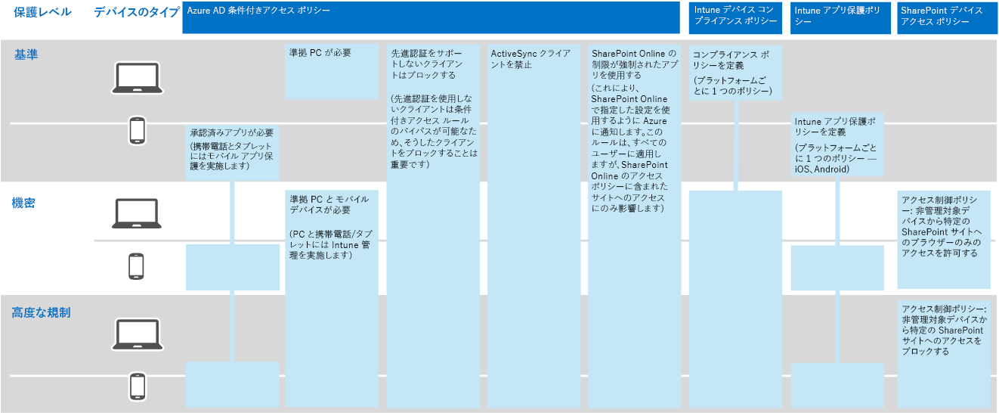
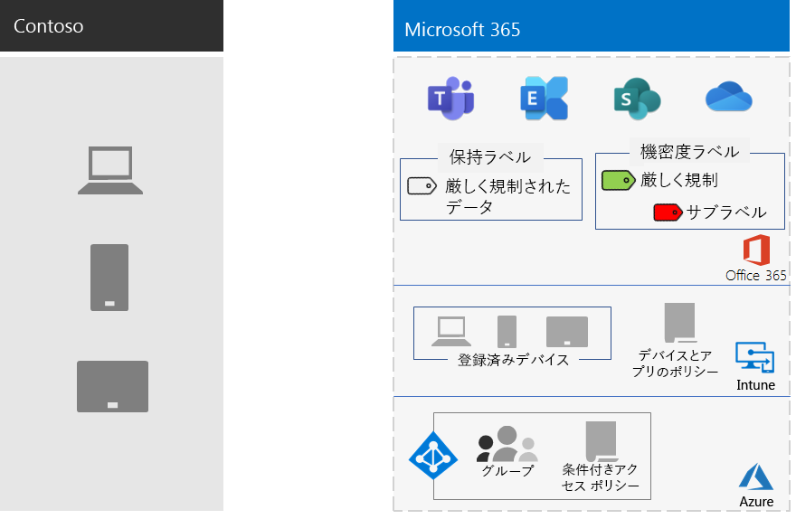

# Contoso Corporation の情報保護

Contoso 社では、情報のセキュリティと保護を重視しています。たとえば、製品のデザインや独自の製造技術を説明する知的財産の漏洩や破壊は、それらを競争面で不利な立場に置くことになります。

機密性が高く、最も価値の高いデジタル資産をクラウドに移行する前に、Contoso 社ではオンプレミスの情報分類と保護の要件が Microsoft 365 Enterprise のクラウドベースのサービスでサポートされ、実装されていることを確認しました。

## Contoso 社のデータ セキュリティの分類

Contoso 社では自社のデータの分析を行い、次に示すレベルを決定しました。

||||
|:-------|:-----|:-----|
| **レベル 1: ベースライン** | **レベル 2: 機密** | **レベル 3: 厳しく規制** |
| データは暗号化され、認証されたユーザーのみが使用できます。     オンプレミスとクラウドベースのストレージとワークロード (Office 365 など) に格納されているすべてのデータに提供されます。データは、サービス内に存在している間、およびサービスとクライアント デバイス間の転送中は暗号化されます。    レベル 1 のデータの例には、通常のビジネス通信 (電子メール) や、管理、販売、およびサポート ワーカー用のファイルがあります。 | レベル 1 以上の強力な認証とデータ損失保護。     強力な認証には、SMS 検証を使用した Azure 多要素認証 (MFA) が含まれています。 データ損失の防止により、機密情報または重要な情報が Microsoft クラウドの外部に漏出しないようにします。    レベル 2 のデータの例には、財務情報や法的情報、新製品の研究開発データがあります。 | レベル 2 以上の最高レベルの暗号化、認証、監査。      保存データおよびクラウド内のデータに対する最高レベルの暗号化。地域の規制に準拠し、スマート カードや詳細な監査と警告を使用する MFA と組み合わされています。     レベル 3 のデータの例には、顧客およびパートナーの個人を特定できる情報、製品のエンジニアリング仕様、および独自の製造技術があります。  |
||||

## Contoso 社の情報ポリシー
次の表に、Contoso 社の情報ポリシーを示します。

|||||
|:-------|:-----|:-----|:-----|
|  | **Access** | **データ保存期間** | **情報保護** |
| 低いビジネス価値 (レベル 1: ベースライン) | すべてのユーザーに対してアクセスを許可  | 6 か月 | 暗号化を使用します。 |
| 中程度のビジネス価値 (レベル 2: 機密) | Contoso 社の従業員、下請業者、パートナーに対してアクセスを許可     MFA、トランスポート層セキュリティ (TLS)、およびモバイル アプリケーション管理 (MAM) を使用します。 | 2 年  | データ整合性のためにハッシュ値を使用します。  |
| 高度なビジネス価値 (レベル 3: 厳しく規制) | エグゼクティブ、およびエンジニアリングと製造の潜在顧客に対してアクセスを許可します。     管理されたネットワーク デバイスのみの Rights Management System (RMS) です。  | 7 年  | 否認防止のためにデジタル署名を使用します。  |
|||||

## Contoso 社の Microsoft 365 Enterprise を使用した情報保護への道のり

Contoso 社は、次の手順を使用して、自社の情報保護の要件に対応する Microsoft 365 Enterprise を準備しました。

1. 保護する情報を特定した

   Contoso 社は、オンプレミスの SharePoint サイトとファイル共有にある既存のデジタル資産を広範囲にわたって再調査して、それぞれを分類しました。

2. 各データ レベルに応じてアクセス ポリシー、保持ポリシー、情報保護ポリシーを決定した

   データ レベルに基づいて、Contoso 社は詳細なポリシー要件を決定しました。この要件は、クラウドへの移行時に既存のデジタル資産を保護するために使用されました。

3. さまざまな情報のレベルに応じた機密ラベルとその設定を作成した

   Contoso 社では、データのレベルに応じた機密ラベルを作成しました。「厳しく規制」のラベルで、暗号化、アクセス許可、透かしなどが含まれます。

4. アクセスをロックするアクセス許可を使用して機密データと厳しく規制されたデータに対応する保護された SharePoint サイトを作成した

   機密性の高いサイトと厳しく規制されたサイトの両方が、追加のアクセス許可の制限のあるプライベート チーム サイトとして構成されました。 「機密」および「厳しく規制」の SharePoint サイトは、対応する保持ラベルを使用して構成されています。 「厳しく規制」の SharePoint サイトに保存されているファイルは、「厳しく規制」のラベルの「機密」サブラベルで保護されています。 詳細については、「[厳しく規制されたデータに適した SharePoint サイト](teams-sharepoint-online-sites-highly-regulated-data.md)」のシナリオを参照してください。

5.  オンプレミスの SharePoint サイトとファイル共有のデータを新しい SharePoint サイトに移動した

    新しい SharePoint サイトに移行したファイルには、そのサイトに割り当てられた既定の保持ラベルを継承させました。

6.  新しいドキュメントに機密ラベルを使用する方法、新しい SharePoint サイトの作成時に Contoso 社の IT 部門と応対する方法、およびデジタル資産は必ず SharePoint サイトに保管することについて従業員を教育しました

    クラウドに向けた情報保護の変化で最も難しい部分であると考えられることから、Contoso 社の IT 部門と経営陣は、クラウド上のデジタル資産には必ずラベルを付けて保存し、オンプレミスのファイル共有を控え、サード パーティのクラウド ストレージ サービスや USB ドライブは決して使用しないように、組織の従業員の情報保管に関する悪習慣を改めることが必要でした。

## 情報保護のための条件付きアクセス ポリシー

ID とモバイル デバイスの管理インフラストラクチャと共に、Exchange Online と SharePoint のロールアウトの一環として、Contoso 社は、次に示す条件付きアクセス ポリシーのセットを構成して、そのポリシーを該当するグループに適用しました。

- [デバイスで管理されるアプリケーション アクセスと管理されないアプリケーション アクセスのポリシー](identity-access-policies.md)
- [Exchange Online アクセス ポリシー](secure-email-recommended-policies.md)
- [SharePoint アクセス ポリシー](sharepoint-file-access-policies.md)

以下は、Contoso 社の情報保護に応じた結果としてのポリシーのセットです。

>[!Note]
>Contoso 社は、ID とサインイン用に追加の条件付きアクセス ポリシーも構成しました。 「[Contoso 社の ID](contoso-identity.md#conditional-access-policies-for-identity-and-device-access)」を参照してください。
>

これらのポリシーでは、次のことを確実にします。

- 許可されるアプリと、そのアプリで組織のデータに対して実行できる操作は、アプリ保護ポリシーによって定義される。
- PC とモバイル デバイスが必ず準拠している。
- Exchange Online は、Exchange Online に対応した Office 365 メッセージ暗号化を使用する。
- SharePoint は、アプリによって適用される制限を使用する。
- SharePoint は、ブラウザー専用のアクセスにアクセス制御ポリシーを使用して、管理されていないデバイスのアクセスはブロックする。

## Contoso 社のデータ レベルへの Microsoft 365 Enterprise 機能のマッピング

次の表は、Microsoft 365 Enterprise の情報保護機能への Contoso 社のデータ レベルをマッピングしています。

|||||
|:-------|:-----|:-----|:-----|
| | **Office 365** | **Windows 10 および Office 365 ProPlus** | **EMS** |
| レベル 1: ベースライン  | SharePoint および Exchange Online の条件付きアクセス ポリシー   SharePoint サイトのアクセス許可 | 機密ラベル   BitLocker   Windows 情報保護 | デバイスの条件付きアクセス ポリシーとモバイル アプリケーション管理ポリシー |
| レベル 2: 機密 | レベル 1 プラス:     機密ラベル   SharePoint サイトの Office 365 保持ラベル   SharePoint および Exchange Online 用の Office 365 データ損失防止   分離した SharePoint サイト  | レベル 1 プラス:     デジタル資産の機密ラベル  | レベル 1 |
| レベル 3: 厳しく規制 | レベル 2 プラス:    営業秘密情報の BYOK (Bring Your Own Key) 暗号化と保護   Office 365 サービスと対話する基幹業務アプリケーションの Azure Key Vault | レベル 2 | レベル 1 |
|||||

以下は、Contoso 社の結果として得られる情報保護構成です。

## 次の手順

ID とアクセスの管理、脅威の防止、情報の保護、およびセキュリティの管理に Contoso 社がどのように Microsoft 365 Enterprise のセキュリティ機能を使用しているかについて[確認してください](contoso-security-summary.md)。

## 関連項目

[Microsoft 365 Enterprise の情報保護](infoprotect-infrastructure.md)

[展開ガイド](deploy-microsoft-365-enterprise.md)

[テスト ラボ ガイド](m365-enterprise-test-lab-guides.md)

