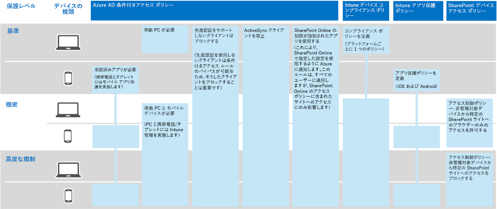
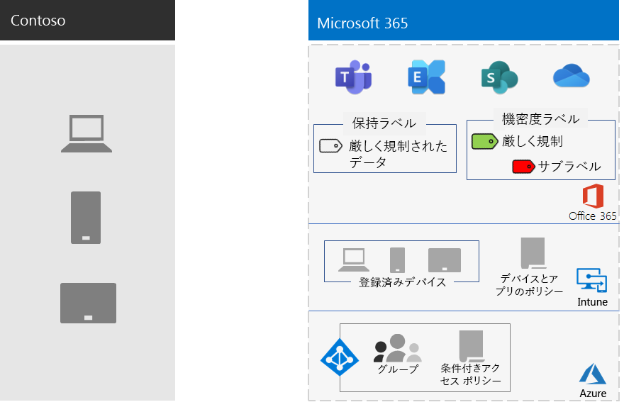

# Contoso Corporation の情報保護

Contoso 社は、情報セキュリティについて真剣に取り組む。 製品設計と独自の製造技術を記述する知的財産の漏洩または破壊は、競争上の不利な立場にあります。

機密性の高いデジタル資産をクラウドに移行する前に、Contoso 社は、エンタープライズ向け Microsoft 365 のクラウドベースのサービスによって、オンプレミスの情報分類と保護要件がサポートMicrosoft 365確認しました。

## Contoso のデータ セキュリティ分類

Contoso 社はデータの分析を実行し、次の分類レベルを決定しました。

| レベル 1: ベースライン | レベル 2: 機密 | レベル 3: 厳しく規制 |
|:-------|:-----|:-----|
| データは暗号化され、認証されたユーザーのみが使用できます。    オンプレミスおよびクラウドベースのストレージとワークロードに格納されているすべてのデータに対して提供されます。 データは、サービス内に存在している間、およびサービスとクライアント デバイス間の転送中は暗号化されます。   レベル 1 のデータの例には、通常のビジネス通信 (電子メール) や、管理、販売、およびサポート ワーカー用のファイルがあります。 | レベル 1 以上の強力な認証とデータ損失保護。    強力な認証には、SMS 検証AD多要素認証 (MFA) の Azure 認証が含まれます。 データ損失防止により、機密性の高い情報や重要な情報が Microsoft クラウド外に移動しません。  レベル 2 のデータの例には、財務情報や法的情報、新製品の研究開発データがあります。 | レベル 2 以上の最高レベルの暗号化、認証、監査。  保存データおよびクラウド内のデータに対する最高レベルの暗号化。地域の規制に準拠し、スマート カードや詳細な監査と警告を使用する MFA と組み合わされています。   レベル 3 データの例は、顧客およびパートナーの個人情報、製品エンジニアリング仕様、および独自の製造技術です。  |
||||

## Contoso の情報ポリシー
次の表に、Contoso の情報ポリシーを示します。

| 値 | Access | データ保存期間 | 情報保護 |
|:-------|:-----|:-----|:-----|
| 低いビジネス価値 (レベル 1: ベースライン) | すべてのユーザーへのアクセスを許可します。  | 6 か月 | 暗号化を使用します。 |
| 中程度のビジネス価値 (レベル 2: 機密) | Contoso の従業員、下請け業者、パートナーへのアクセスを許可します。    MFA、トランスポート層セキュリティ (TLS)、およびモバイル アプリケーション管理 (MAM) を使用します。 | 2 年  | データ整合性のためにハッシュ値を使用します。  |
| 高度なビジネス価値 (レベル 3: 厳しく規制) | エグゼクティブ、およびエンジニアリングと製造の潜在顧客に対してアクセスを許可します。     管理されたネットワーク デバイスのみの Rights Management System (RMS) です。  | 7 年  | 否認防止のためにデジタル署名を使用します。  |
|||||

## エンタープライズ向けサービスを使用した情報保護Microsoft 365 Contoso パス

Contoso は、次の手順に従って、Microsoft 365保護要件に合ったエンタープライズ向けサービスを準備しました。

1. 保護する情報を特定する

   Contoso 社は、オンプレミスのサイトとファイル共有に位置する既存SharePoint詳細なレビューを行い、各アセットを分類しました。

2. 各データ レベルについてアクセス、保持、情報保護ポリシーを決定する

   データ レベルに基づいて、Contoso 社は詳細なポリシー要件を決定しました。この要件は、クラウドへの移行時に既存のデジタル資産を保護するために使用されました。

3. さまざまなレベルの情報に対する感度ラベルとその設定を作成する

   Contoso 社では、データのレベルに応じた機密ラベルを作成しました。「厳しく規制」のラベルで、暗号化、アクセス許可、透かしなどが含まれます。

4. オンプレミスのサイトとファイル共有SharePointから新しいサイトにデータをSharePointする

    新しい SharePoint サイトに移行したファイルには、そのサイトに割り当てられた既定の保持ラベルを継承させました。

5. 従業員が新しいドキュメントに対して感度ラベルを使用する方法、新しい SharePoint サイトを作成するときに Contoso IT とやり取りする方法、およびデジタル資産を常に SharePoint サイトに保存する方法をトレーニングする

    ワーカーの情報ストレージの習慣の悪い変更は、多くの場合、クラウドの情報保護移行の最も難しい部分と見なされます。 Contoso IT と管理は、従業員が常にデジタル資産にラベルを付け、クラウドに保存したり、オンプレミスのファイル共有を使用したり、サードパーティのクラウド ストレージ サービスや USB ドライブを使用したりするために必要でした。

## 情報保護のための条件付きアクセス ポリシー

Contoso 社は、Exchange Online および SharePoint のロールアウトの一環として、次の一連の条件付きアクセス ポリシーを構成し、適切なグループに適用しました。

- [デバイスで管理されるアプリケーション アクセスと管理されないアプリケーション アクセスのポリシー](../security/office-365-security/identity-access-policies.md)
- [Exchange Online アクセス ポリシー](../security/office-365-security/secure-email-recommended-policies.md)
- [SharePoint アクセス ポリシー](../security/office-365-security/sharepoint-file-access-policies.md)

情報保護のための Contoso ポリシーのセットを次に示します。

>[!Note]
>Contoso 社は、ID とサインイン用に追加の条件付きアクセス ポリシーも構成しました。 「[Contoso 社の ID](contoso-identity.md#conditional-access-policies-for-identity-and-device-access)」を参照してください。
>

これらのポリシーでは、次のことを確実にします。

- 許可されるアプリと、組織のデータで実行できるアクションは、アプリ保護ポリシーによって定義されます。
- PC とモバイル デバイスが必ず準拠している。
- Exchange OnlineはOffice 365メッセージ暗号化 (OME) を使用Exchange Online。
- SharePointは、アプリによって適用される制限を使用します。
- SharePoint は、ブラウザー専用のアクセスにアクセス制御ポリシーを使用して、管理されていないデバイスのアクセスはブロックする。

## エンタープライズ機能Microsoft 365 Contoso データ レベルへのマッピング

次の表は、Contoso のデータ レベルをエンタープライズ向けサービスの情報保護Microsoft 365マップします。

| レベル | Microsoft 365クラウド サービス | Windows 10 および Microsoft 365 Apps for enterprise | セキュリティとコンプライアンス |
|:-------|:-----|:-----|:-----|
| レベル 1: ベースライン  | SharePoint および Exchange Online の条件付きアクセス ポリシー   SharePoint サイトのアクセス許可 | 機密ラベル   BitLocker   Windows 情報保護 | デバイスの条件付きアクセス ポリシーとモバイル アプリケーション管理ポリシー |
| レベル 2: 機密 | レベル 1 プラス:     秘密度ラベル   SharePoint サイトの Microsoft 365 保持ラベル   SharePoint および Exchange Online 用のデータ損失防止   分離した SharePoint サイト  | レベル 1 プラス:     デジタル資産の機密ラベル  | レベル 1 |
| レベル 3: 厳しく規制 | レベル 2 プラス:    独自のキー (BYOK) 暗号化と営業秘密情報の保護を行う   Azure Key Vault for line-of-business applications for interact with Microsoft 365 サービス | レベル 2 | レベル 1 |
|||||

Contoso の情報保護構成を次に示します。

## 次の手順

Contoso 社が ID およびアクセス管理、脅威[保護、情報保護、および](contoso-security-summary.md)セキュリティ管理のために、Microsoft 365全体でセキュリティ機能を使用する方法について説明します。

## 関連項目

[セキュリティ ロードマップ](../security/office-365-security/security-roadmap.md)

[Microsoft 365 for Enterprise の概要](microsoft-365-overview.md)

[テスト ラボ ガイド](m365-enterprise-test-lab-guides.md)