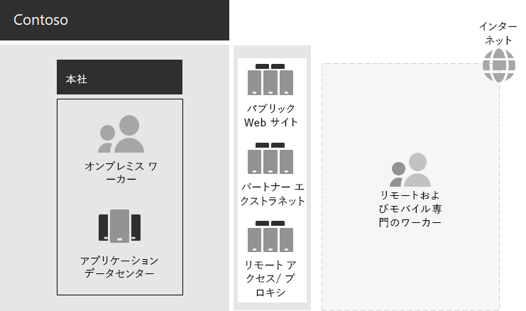

# Contoso IT インフラストラクチャとビジネス ニーズ

Contoso 社は、オンプレミスの集中管理された IT インフラストラクチャから、クラウドベースの個人の生産性ワークロードとアプリケーションを組み込んだクラウドを含むセットアップに移行しています。

## 既存の Contoso IT インフラストラクチャ

Contoso 社では、ほとんど集中管理されたオンプレミスの IT インフラストラクチャを使用しており、アプリケーション データセンターはパリ本社に位置します。

アプリケーション データセンター、DMZ、およびインターネットを備え、本社のオフィスを次に示します。

オンプレミス アプリケーション データセンターのホストは次のとおりです: 

- 他の Linux データベースを使用するカスタム SQL Serverアプリケーション。
- 従来の SharePoint サーバーのセット。
- ファイル記憶域用の組織およびチームレベルのサーバー。

さらに、各地域のハブ オフィスは、同様のアプリケーション セットを持つサーバー セットをサポートしています。 これらのサーバーは、地域の IT 部門が管理します。

こうした地理的に離れた複数のデータセンターのアプリケーションとデータに対する検索性については引き続き課題です。

Contoso 本社 DMZ では、異なるサーバー セットで次の機能が提供されます。

- 顧客が製品、パーツ、消耗品、およびサービスを注文できる Contoso パブリック Web サイトのホスティング。
- パートナーの通信およびコラボレーションのための Contoso 社のパートナー エクストラネットのホスティング。
- パリ本社の従業員のための Contoso 社イントラネットおよび Web プロキシへの仮想プライベート ネットワーク (VPN) ベースのリモート アクセス。

## Contoso のビジネス ニーズ

Contoso のビジネス ニーズは、次の 5 つの主なカテゴリに分類されます。

**生産性**

- グループ作業を容易にする

  電子メールとファイル共有ベースのコラボレーションを、ドキュメント、簡単なオンライン会議、およびキャプチャされた会話スレッドに対するリアルタイムの変更を可能にするオンライン モデルに置き換えます。
- リモート ワーカーとモバイル ワーカーの生産性を向上させる

  多くの従業員が自宅または現場で作業を行う場合、ボトルネックの VPN ソリューションをクラウド内の Contoso データおよびリソースへのパフォーマンスの高いアクセスに置き換えます。
- 独創性と革新性を向上させる

  手描き入力や 3D の視覚エフェクトなど最新のビジュアル学習とアイデア開発の方法を活用できます。

**セキュリティ**

- ID およびアクセス管理

  多要素認証などの認証を適用し、ユーザーアカウントと管理者アカウントの資格情報を保護します。

- 脅威保護

  メールおよびオペレーティング システム ベースのマルウェアなど、外部のセキュリティの脅威から保護します。

- 情報保護

  顧客データ、設計および製造仕様、従業員情報などの重要なデジタル資産へのアクセスを制限し、暗号化します。

- セキュリティ管理

  セキュリティの態勢を監視し、脅威をリアルタイムで検出して対応します。

**リモート/モバイル アクセスおよびビジネス パートナー**

- リモートワーカーとモバイル ワーカーのセキュリティを強化する

  セキュリティで保護されたアクセス、適切なアプリケーション動作、および会社のデータ保護を確保するために、独自のデバイス (BYOD) と会社所有のデバイス管理を実装します。

- 従業員のリモート アクセス インフラストラクチャを縮小する

  一般的にアクセスされるリソースをクラウドに移行することで、メンテナンスとサポートのコストを削減し、リモート アクセス ソリューションのパフォーマンスを向上させます。

- ビジネス間 (B2B) トランザクションに対する接続性の向上とオーバーヘッドの削減

  エージングおよび高価なパートナー エクストラネットを、フェデレーション認証を使用するクラウドベースのソリューションに置き換える。

**コンプライアンス**

- 地域の規制要件に準拠する

  欧州連合の一般データ保護規則 (GDPR) など、データストレージ、暗号化、データプライバシー、および個人データ規制に関する業界および地域の規制への準拠を確認します。

**管理**

- クライアント PC およびデバイスで実行されているソフトウェアを管理するための IT オーバーヘッドを削減する

  組織全体のオペレーティング システムとWindows更新プログラムMicrosoft 365 Apps for enterpriseインストールを自動化します。

## エンタープライズ向け Contoso ビジネスのMicrosoft 365マッピング

Contoso IT 部門は、展開前に次のビジネス ニーズのマッピングMicrosoft 365 E5を決定しました。

| カテゴリ | ビジネス ニーズ | Microsoft 365製品または機能の詳細 |
|:-------|:-----|:-----|
| 生産性 |  |  |
|  | グループ作業を容易にする | Microsoft Teams、SharePoint、OneDrive |
|  | リモート ワーカーとモバイル ワーカーの生産性を向上させる | Microsoft 365 のワークロードとクラウドベースのデータ |
|  | 独創性と革新性を向上させる | Windows Ink、職場の Cortana、PowerPoint |
| セキュリティ |  |  |
|  | ID およびアクセス管理 | Azure AD 多要素認証 (MFA) と Azure AD Privileged Identity Management (PIM) を使用した専用のグローバル管理者アカウント   すべてのユーザー アカウントの MFA   条件付きアクセス   セキュリティ閲覧者   Windows Hello   Windows Credential Guard |
|  | 脅威保護 | Advanced Threat Analytics   Windows Defender   Defender for Office 365   Microsoft Defender for Office 365   Microsoft 365の調査と対応   |
|  | 情報保護 | Azure Information Protection   データ損失防止 (DLP)   Windows 情報保護 (WIP)   Microsoft Cloud App Security   Microsoft Intune |
|  | セキュリティ管理 | Azure Defender    Windows Defender セキュリティ センター |
| リモート/モバイル アクセスおよびビジネス パートナー |  |  |
|  | リモート ワーカーとモバイル ワーカーのセキュリティを強化する | Microsoft Intune |
|  | 従業員のリモート アクセス インフラストラクチャを縮小する | Microsoft 365 のワークロードとクラウドベースのデータ |
|  | B2B トランザクションの接続性とオーバーヘッドの削減 | フェデレーション認証とクラウドベースのリソース |
| コンプライアンス |  |  |
|  | 地域の規制要件に準拠する | GDPR の機能 (Microsoft 365 |
| 管理 |  |  |
|  | クライアント更新プログラムのインストールに関する IT オーバーヘッドの削減 | Windows 10 Enterprise の更新プログラム   Microsoft 365 Apps for enterprise の更新プログラム |
||||

## 次の手順

Contoso Corporation のオンプレミス[ネットワーク](contoso-networking.md)と、クラウド ベースのリソースへのアクセスと待機時間を最適化Microsoft 365について説明します。

## 関連項目

[Microsoft 365 for Enterprise の概要](microsoft-365-overview.md)

[テスト ラボ ガイド](m365-enterprise-test-lab-guides.md)
