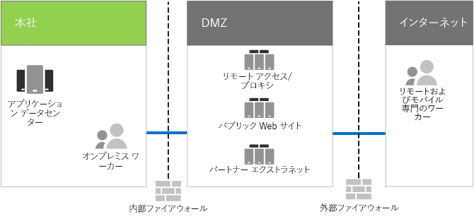

# Contoso 社の IT インフラストラクチャおよびビジネス ニーズContoso's IT infrastructure and business needs

Contoso 社は、集中管理されたオンプレミスの IT インフラストラクチャから、クラウド包括型の IT インフラストラクチャへと移行しています。後者には、クラウドベースの個人生産性のワークロードとアプリケーションが組み込まれています。Contoso has been transitioning from an on-premises, centralized IT infrastructure to a cloud-inclusive one that incorporates cloud-based personal productivity workloads and applications.

## Contoso 社の既存の IT インフラストラクチャContoso's existing IT infrastructure

Contoso 社では、ほとんど集中管理されたオンプレミスの IT インフラストラクチャを使用しており、アプリケーション データセンターはパリ本社に位置します。Contoso uses a mostly centralized on-premises IT infrastructure, with application datacenters in the Paris headquarters.

図 1 は、本社とアプリケーション データセンター、境界ネットワーク、およびインターネットを示しています。Figure 1 shows a headquarters office with application datacenters, a DMZ, and the Internet.

**図 1: Contoso 社の既存の IT インフラストラクチャ****Figure 1: Contoso's existing IT infrastructure**
 
オンプレミス アプリケーション データセンターのホストは次のとおりです:The on-premises application datacenters host: 

- SQL Server や他の Linux データベースを使用するカスタムの基幹業務アプリケーション。Custom line of business applications that use SQL Server and other Linux databases.
- 従来の SharePoint サーバーのセット。A set of legacy SharePoint servers.
- ファイル記憶域用の組織およびチームレベルのサーバー。Organization and team-level servers for file storage.

さらに、各地域のハブ オフィスは、同様のアプリケーション セットを持つサーバー セットをサポートしています。Additionally, each regional hub office supports a set of servers with a similar set of applications. これらのサーバーは、地域の IT 部門が管理します。These servers are under the control of regional IT departments.

こうした地理的に離れた複数のデータセンターのアプリケーションとデータに対する検索性については引き続き課題です。Searchability across the applications and data of these separate multi-geographical datacenters continues to be a challenge.

Contoso 社の本社の境界ネットワークでは、サーバーのさまざまなセットが次のことを実現します。In Contoso's headquarters DMZ, different sets of servers provide:

- 顧客が製品、部品、備品、またはサービスを発注できる Contoso 社のパブリック Web サイトのホスティング。Hosting for the Contoso public web site, from which customers can order products, parts, supplies, or service.
- パートナーの通信およびコラボレーションのための Contoso 社のパートナー エクストラネットのホスティング。Hosting for the Contoso partner extranet for partner communication and collaboration.
- パリ本社の従業員のための Contoso 社イントラネットおよび Web プロキシへの仮想プライベート ネットワーク (VPN) ベースのリモート アクセス。Virtual private network (VPN)-based remote access to the Contoso intranet and web proxying for workers in the Paris headquarters.

## Contoso 社のビジネス ニーズContoso's business needs

Contoso 社のビジネス ニーズは、5 つの主なカテゴリに分類されます。Contoso's business needs fall into five main categories.

生産性:Productivity:

- グループ作業を容易にするMake collaboration easier

  メールとファイル共有ベースのグループ作業を、オンライン モデルに置き換えることで、文書のリアルタイム変更、簡単なオンライン会議、会話スレッドのキャプチャを可能にします。Replace the email and file share-based collaboration with an online model that allows real-time changes on documents, easier online meetings, and captured conversation threads.
- リモート ワーカーとモバイル ワーカーの生産性を向上させるImprove productivity for remote and mobile workers

  多くの従業員が自宅や現場で働いているため、ボトルネックとなっている VPN ソリューションを、クラウド内の Contoso 社のデータとリソースへの効率的なアクセスに変更します。With many employees working from homes or in the field, replace the bottlenecked VPN solution with performant access to Contoso data and resources in the cloud.
- 独創性と革新性を向上させるIncrease creativity and innovation

  手描き入力や 3D の視覚エフェクトなど最新のビジュアル学習とアイデア開発の方法を活用できます。Take advantage of the latest visual learning and idea development methods, including inking and 3D visualization.

セキュリティ:Security:

- ID およびアクセス管理Identity and access management

  多要素認証および他の形式の認証を適用し、ユーザーおよび管理者アカウントの資格情報を保護します。Enforce multi-factor and other forms of authentication and protect user and administrator account credentials.

- 脅威保護Threat protection

  メールおよびオペレーティング システム ベースのマルウェアなど、外部のセキュリティの脅威から保護します。Protect against external security threats, including email and operating system-based malware.

- 情報保護Information protection

  顧客データ、設計および製造仕様、従業員情報などの重要なデジタル資産へのアクセスを制限し、暗号化します。Lock down access to and encrypt high-value digital assets, such as customer data, design and manufacturing specifications, and employee information.

- セキュリティ管理Security management

  セキュリティの状態を監視し、リアルタイムで脅威を検出して対応できるようにします。Monitor security posture and be able to detect and respond to threats in real time.

リモート/モバイル アクセスおよびビジネス パートナー:Remote and mobile access and business partners:

- リモート ワーカーとモバイル ワーカーのセキュリティを強化するBetter security for remote and mobile workers

  持ち込みデバイス (BYOD) と会社所有のデバイスの管理に着手し、確実にアクセスをセキュリティで保護し、アプリケーションを正しく動作させ、企業データを保護できるようにします。Institute Bring Your Own Device (BYOD) and company-owned device management to ensure secured access, correct application behavior, and company data protection.

- 従業員のリモート アクセス インフラストラクチャを縮小するReduce remote access infrastructure for employees

  よくアクセスされているリソースをクラウドに移動することで、保守作業とサポートのコストを削減し、リモート アクセス ソリューションのパフォーマンスを向上させます。Reduce maintenance and support costs and improve performance for remote access solution by moving commonly-accessed resources to the cloud.

- 企業間 (B2B) のトランザクションにおける接続性を向上し、オーバーヘッドを削減するProvide better connectivity and lower overhead for Business-to-Business (B2B) transactions

  老朽化が進み、維持にコストがかかるパートナー エクストラネットを、フェデレーション認証を使用するクラウドベースのソリューションに切り替えます。Replace aging and expensive partner extranet with a cloud-based solution that uses federated authentication.

コンプライアンス:Compliance:

- 地域の規制要件に準拠するAdhere to regional regulatory requirements

  欧州連合の一般データ保護規則 (GDPR) などのデータ ストレージ、暗号化、データ プライバシー、個人データの規制に関する産業および地域の規則に準拠し、これを維持します。Become and remain compliant with industry and regional regulations for data storage, encryption, data privacy, and personal data regulations, such as the General Data Protection Regulation (GDPR) for the Europe Union.

管理:Management:

- クライアント PC とデバイスで実行されているソフトウェアを管理するために、IT オーバーヘッドを削減します。Lower the IT overhead for managing software running on client PCs and devices

  組織全体で Windows オペレーティング システムと Microsoft Office ProPlus への更新プログラムのインストールを自動化します。Automate the installation of updates to the Windows operating system and Microsoft Office ProPlus across the organization.

## Contoso 社のビジネス ニーズを Microsoft 365 Enterprise にマッピングするMapping Contoso's business needs to Microsoft 365 Enterprise

Contoso 社の IT 部門は、展開に先立って次のビジネス ニーズを Microsoft 365 Enterprise E5 の機能にマッピングすることを決定しました。Contoso's IT department determined the following mapping of business needs to Microsoft 365 Enterprise E5 features prior to deployment:

||||
|:-------|:-----|:-----|
| **カテゴリ****Category** | **ビジネス ニーズ****Business need** | **Microsoft 365 Enterprise の製品または機能****Microsoft 365 Enterprise products or features** |
| 生産性Productivity |  |  |
|  | グループ作業を容易にするMake collaboration easier | Microsoft Teams、SharePoint、OneDriveMicrosoft Teams, SharePoint, OneDrive |
|  | リモート ワーカーとモバイル ワーカーの生産性を向上させるImprove productivity for remote and mobile workers | Microsoft 365 のワークロードとクラウドベースのデータMicrosoft 365 workloads and cloud-based data |
|  | 独創性と革新性を向上させるIncrease creativity and innovation | Windows Ink、職場の Cortana、PowerPointWindows Ink, Cortana at Work, PowerPoint |
| セキュリティSecurity |  |  |
|  | ID およびアクセス管理Identity & access management | Azure 多要素認証 (MFA) および Azure AD Privileged Identity Management (PIM) 付きの専用のグローバル管理者アカウントDedicated global administrator accounts with Azure Multi-Factor Authentication (MFA) and Azure AD Privileged Identity Management (PIM)   すべてのユーザー アカウントの MFAMFA for all user accounts   条件付きアクセスConditional Access   Windows HelloWindows Hello   Windows Credential GuardWindows Credential Guard |
|  | 脅威保護Threat protection | Advanced Threat AnalyticsAdvanced Threat Analytics   Windows DefenderWindows Defender   Advanced Threat ProtectionAdvanced Threat Protection   Office 365 Advanced Threat ProtectionOffice 365 Advanced Threat Protection   Office 365 脅威の調査および対応Office 365 threat investigation and response   |
|  | 情報保護Information protection | Azure Information ProtectionAzure Information Protection   Office 365 データ損失防止 (DLP)Office 365 Data Loss Prevention (DLP)   Windows 情報保護 (WIP)Windows Information Protection (WIP)   Microsoft Cloud App SecurityMicrosoft Cloud App Security   Microsoft IntuneMicrosoft Intune |
|  | セキュリティ管理Security management | Azure Security CenterAzure Security Center    Windows Defender セキュリティ センターWindows Defender Security Center |
| リモート/モバイル アクセスおよびビジネス パートナーRemote and mobile access and business partners |  |  |
|  | リモート ワーカーとモバイル ワーカーのセキュリティを強化するBetter security for remote and mobile workers | Microsoft IntuneMicrosoft Intune |
|  | 従業員のリモート アクセス インフラストラクチャを縮小するReduce remote access infrastructure for employees | Microsoft 365 のワークロードとクラウドベースのデータMicrosoft 365 workloads and cloud-based data |
|  | B2B のトランザクションにおける接続性を向上し、オーバーヘッドを削減するProvide better connectivity and lower overhead for B2B transactions | フェデレーション認証とクラウドベースのリソースFederated authentication and cloud-based resources |
| コンプライアンスCompliance |  |  |
|  | 地域の規制要件に準拠するAdhere to regional regulatory requirements | Office 365 の GDPR 機能GDPR features in Office 365 |
| 管理Management |  |  |
|  | クライアントの更新プログラムをインストールするため、IT オーバーヘッドを削減するLower the IT overhead for installing client updates | 展開リングDeployment rings   Windows 10 Enterprise の更新プログラムWindows 10 Enterprise updates   Office 365 ProPlus の更新プログラムOffice 365 ProPlus updates |
||||

## 次の手順Next step

Contoso 社のオンプレミス ネットワークと、Microsoft 365 のクラウドベースのリソースへのアクセスと待ち時間を最適化した方法について[確認](contoso-networking.md)します。[Learn](contoso-networking.md) about the Contoso Corporation’s on-premises network and how it was optimized for access and latency to Microsoft 365 cloud-based resources.

## 関連項目See also

[展開ガイドDeployment guide](deploy-microsoft-365-enterprise.md)

[テスト ラボ ガイドTest lab guides](m365-enterprise-test-lab-guides.md)
