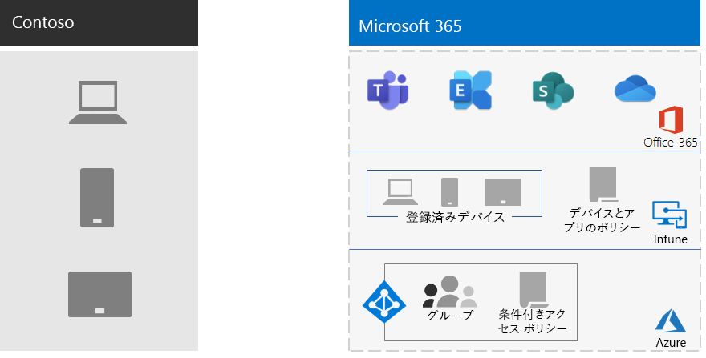

# Contoso 社のモバイル デバイス管理

Microsoft 365には、Intune と、モバイル デバイスとアプリケーションの管理とセキュリティをサポートする一連の Azure サービスが含まれます。

Contoso には、モバイル対応の従業員が多数います。 一部のオフィスは Contoso の場所に、一部のオフィスにはオフィスはありません。 Contoso 社では、従業員の生産性を有効にし、デバイス、それらのデバイスに保存されている Contoso データ、およびアプリケーションの動作を安全に保つ方法が必要でした。

## 計画

Contoso 社は、エンタープライズ向けモバイル デバイス管理の次の Intune Microsoft 365を特定しました。

- メールExchange Onlineデータを保護して、モバイル デバイスから安全にアクセスできます。
- Contoso の従業員に対して、自分でデバイスを持ち込む (BYOD) プログラムを実装します。
- Contoso の従業員に組織所有の電話と使用制限付き共有タブレットを発行します。

Contoso は Intune を使用して次の条件を設定します。

- 従業員が管理されていない公開キオスクからMicrosoft 365にアクセスできます。
- オンプレミスの Microsoft Exchange サーバーがないので、モバイル デバイスから安全にアクセスできるよう、オンプレミスの電子メールとデータをExchangeします。

## 展開

Contoso 社は、次のようにモバイル デバイス管理インフラストラクチャをセットアップしています。

- Intune をモバイル デバイス管理 (MDM) 機関として設定し、Intune on Azure を使用してコンテンツを管理し、デバイスを管理する
- 登録Azure Active Directory Intune のAD条件付きアクセス ポリシーのデバイス用に作成されたグループ (Azure AD)

  詳細については [、「Contoso 条件付きアクセス ポリシー」を参照してください](contoso-identity.md#conditional-access-policies-for-identity-and-device-access)。

- Apple デバイス プラットフォームで、iPad、iMac、および iPhone、および企業所有の iPhone で従業員をサポートする機能を有効にしました
- Contoso 社では、独自の使用条件ポリシーを作成しており、Contoso 社の会社ポータルをモバイル デバイスにインストールする時に表示されるようになっています。
- 登録されていないデバイスの場合は、一連のモバイル アプリケーション管理 (MAM) ポリシーを実装して、サービスへのアクセスに認証をMicrosoft 365しました
- 以下のための Intune ポリシーが作成されています。
  - 許可されているアプリ。
  - 承認されていないアクセスを防止するためのデバイスの暗号化。
  - 6 桁の PIN またはパスワード。
  - 非アクティブ タイムアウト期間。
  - ウイルス対策とマルウェアの保護、およびデバイス上のWindows Defender署名Windows 10更新。
  - 最新のセキュリティ更新Windows 10含むデバイスの自動更新。
  - 管理対象デバイスへの証明書のプッシュ。
  - ビジネス データと個人データの明確な分離。ユーザーまたは管理者は、画像、個人用メール アカウント、個人用ファイルなどの個人データはそのままにして、デバイスから会社のデータを選択的に消去できます。

Contoso 社は、展開された PC と会社所有のスマートフォンとタブレットを適切な Intune デバイス グループに追加して登録しました。 また、従業員が個人用デバイスを登録する BYOD プログラムも確立しました。 登録されたデバイスは Intune ポリシーを受け取り、その結果、管理対象デバイスとセキュリティで保護されたデバイスとそのアプリケーションが作成されます。 登録されていないデバイスには、許可されたアプリケーションを指定するモバイル アプリケーション管理 (MAM) ポリシーがあります。

Contoso モバイル デバイス管理の展開アーキテクチャを次に示します。

## 次の手順

Contoso 社がエンタープライズ向[け](contoso-info-protect.md)Microsoft 365の情報保護機能を使用して、組織全体で重要なデジタル資産を分類、識別、および保護する方法について説明します。

## 関連項目

[デバイスの管理Microsoft 365](device-management-roadmap-microsoft-365.md)

[Microsoft 365 for Enterprise の概要](microsoft-365-overview.md)

[テスト ラボ ガイド](m365-enterprise-test-lab-guides.md)

