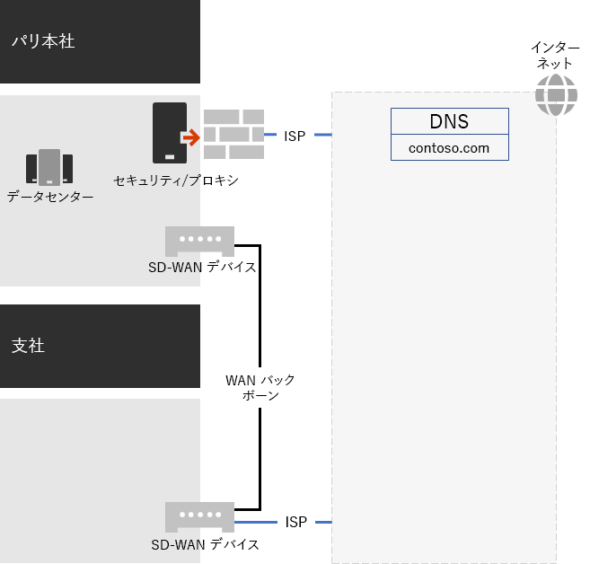
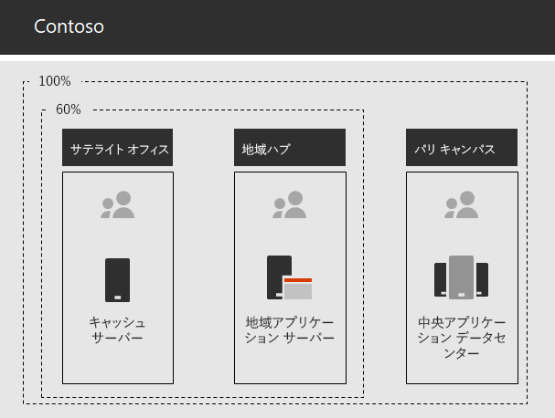

# Contoso Corporation のネットワーク

クラウドを含むインフラストラクチャを採用するために、Contoso 社はクラウド サービスへのネットワーク トラフィックの移動方法の根本的な変化を考案しました。 次のレベルのオフィス階層のネットワーク接続とトラフィックに焦点を当てた内部ハブ アンド スポーク モデルの代わりに、ユーザーの場所をローカルインターネット出力にマップし、インターネット上で最も近い Microsoft 365 ネットワークの場所にローカル接続をマップしました。

## ネットワーク インフラストラクチャ

世界中の Contoso のオフィスをリンクするネットワーク要素を次に示します。

- Multiprotocol Label Switching (MPLS) WAN ネットワーク

  MPLS WAN ネットワークは、パリ本社を地域のオフィスや地域のオフィスとサテライト オフィスに接続し、スポークアンドハブ構成で接続します。 このネットワークを使用すると、ユーザーはパリ本社のビジネス アプリケーションを構成するオンプレミス サーバーにアクセスできます。 また、一般的なインターネット トラフィックをパリのオフィスにルーティングし、ネットワーク セキュリティ デバイスが要求をスクラブします。 各オフィス内で、ルーターはプライベート IP アドレス空間を使用するサブネット上の有線ホストまたはワイヤレス アクセス ポイントにトラフィックを配信します。

- トラフィックのローカル直接Microsoft 365アクセス

  各オフィスには、1 つ以上のローカル インターネット ISP ネットワーク回線を備え、プロキシ サーバーを介した独自のインターネット接続を備えるソフトウェア定義の WAN (SD-WAN) デバイスがあります。 これは通常、パブリック IP アドレスとローカル DNS サーバーも提供するローカル ISP への WAN リンクとして実装されます。

- インターネット プレゼンス

  Contoso は contoso com パブリック \. ドメイン名を所有しています。 製品を注文する Contoso パブリック Web サイトは、パリキャンパス内のインターネットに接続されたデータセンター内のサーバーのセットです。 Contoso は、インターネット上で /24 パブリック IP アドレス範囲を使用します。

図 1 は、Contoso のネットワーク インフラストラクチャとインターネットへの接続を示しています。

 
**図 1: Contoso ネットワーク**

## Microsoft への最適なネットワーク接続のための SD-WAN の使用

Contoso 社は次の [Microsoft 365 ネットワーク接続の原則](microsoft-365-network-connectivity-principles.md)に従いました。

- Microsoft 365 ネットワーク トラフィックを識別して区別する
- ネットワーク接続のローカルの出口を提供する
- ネットワーク ヘアピンを回避する
- 重複するネットワーク セキュリティ デバイスをバイパスする

ネットワーク トラフィックには、最適化、許可、および *Microsoft 365の* 3 *つの* カテゴリ *があります*。 最適化と許可トラフィックは、エンドポイントで暗号化されセキュリティで保護され、ネットワーク上のネットワークにMicrosoft 365されます。

Contoso は次のように決定しました。

- オプティマイズと許可カテゴリ トラフィックに直接インターネット出力を使用し、すべての既定のカテゴリ トラフィックをパリベースの中央インターネット接続に転送します。

- これらの原則に従い、クラウド ベースのサービスに最適なネットワーク パフォーマンスを実現する簡単な方法として、各Microsoft 365に SD-WAN デバイスを展開します。

  SD-WAN デバイスには、ローカル オフィス ネットワーク用の LAN ポートと複数の WAN ポートがあります。 1 つの WAN ポートが MPLS ネットワークに接続します。 別の ISP 回線はローカル ISP 回線に接続します。 SD-WAN デバイスは、ISP リンクを介してカテゴリ ネットワーク トラフィックを最適化および許可します。

## Contoso line-of-business アプリ インフラストラクチャ

Contoso 社は、次の業務用アプリケーションとサーバー イントラネット インフラストラクチャを設計しました。

- サテライト オフィスは、ローカル キャッシュ サーバーを使用して、アクセス頻度の高いドキュメントおよび内部 Web サイトを格納します。
- 地域ハブは、地域オフィスおよびサテライト オフィスに地域アプリケーション サーバーを使用します。これらのサーバーは、パリ本社のサーバーと同期します。
- パリのキャンパス データセンターには、組織全体にサービスを提供する集中アプリケーション サーバーが含まれています。

図 2 は、Contoso イントラネット全体のサーバーにアクセスするときに使用されるネットワーク トラフィック容量の割合を示しています。

 
**図 2: 内部アプリケーションの Contoso インフラストラクチャ**

サテライトまたは地域のハブ オフィスでは、従業員が必要とするリソースの 60% をサテライトおよび地域のハブ オフィス サーバーで提供できます。 リソース要求の追加 40% は、パリキャンパスへの WAN リンクを越える必要があります。

## エンタープライズ向けネットワーク分析Microsoft 365準備

Contoso ユーザーによるエンタープライズ Microsoft 365の導入の成功は、高可用性とパフォーマンスの高いインターネット接続、または Microsoft クラウド サービスへの直接接続に依存します。 Contoso は、エンタープライズ クラウド サービス向けに最適化された接続を計画および実装するためにMicrosoft 365手順を実行しました。

1. 計画を支援する会社の WAN ネットワーク図を作成する

   Contoso 社は、ネットワーク計画を開始するために、自分のオフィスの場所、既存のネットワーク接続、既存のネットワーク境界デバイス、およびネットワーク上で管理されるサービス クラスを示す図を作成しました。 この図は、ネットワーク接続の計画と実装の後続の各手順で使用しました。

2. エンタープライズ ネットワーク接続用のMicrosoft 365計画を作成する

   Contoso 社は[、Microsoft 365接続](microsoft-365-network-connectivity-principles.md)の原則とサンプル リファレンス ネットワーク アーキテクチャを使用して、SD-WAN をネットワーク接続の優先トポロジMicrosoft 365しました。

3. 各オフィスでのインターネット接続使用率と MPLS-WAN 帯域幅を分析し、必要に応じて帯域幅を増やします

   各オフィスの現在の使用状況が分析され、回線が増加し、Microsoft 365 クラウドベースのトラフィックが平均 20% の未使用容量で動作すると予測されました。

4. Microsoft ネットワーク サービスへのパフォーマンスの最適化

   Contoso 社は、最適なパフォーマンスOffice 365、インターネット パス内の一連のファイアウォール、Intune、Azure エンドポイント、および構成済みのファイアウォール、セキュリティ デバイス、その他のシステムを決定しました。 [最適化Office 365許可] カテゴリ トラフィックのエンドポイントは、ISP 回線を通してルーティングするために SD-WAN デバイスに構成されています。

5. 内部 DNS の構成

   DNS が機能し、Microsoft 365 トラフィックのためにローカルで検索対象になる必要があります。

6. ネットワーク エンドポイントとポート接続の検証

   Contoso 社は、Microsoft ネットワーク接続テスト ツールを実行して、エンタープライズ クラウド Microsoft 365の接続を検証しました。

7. ネットワーク接続用に従業員のコンピューターを最適化する

   個々のコンピューターがチェックされ、最新のオペレーティング システム更新プログラムがインストールされ、すべてのクライアントでエンドポイント セキュリティ監視がアクティブにされていることを確認しました。

## 次の手順

Contoso 社が従業員 [向け](contoso-identity.md) クラウドでオンプレミスの Active Directory ドメイン サービスを活用し、顧客とビジネス パートナーのフェデレーション認証を行う方法について説明します。

## 関連項目

[ネットワークのロードマップ (Microsoft 365](networking-roadmap-microsoft-365.md)

[Microsoft 365 for enterprise の概要](microsoft-365-overview.md)

[テスト ラボ ガイド](m365-enterprise-test-lab-guides.md)
