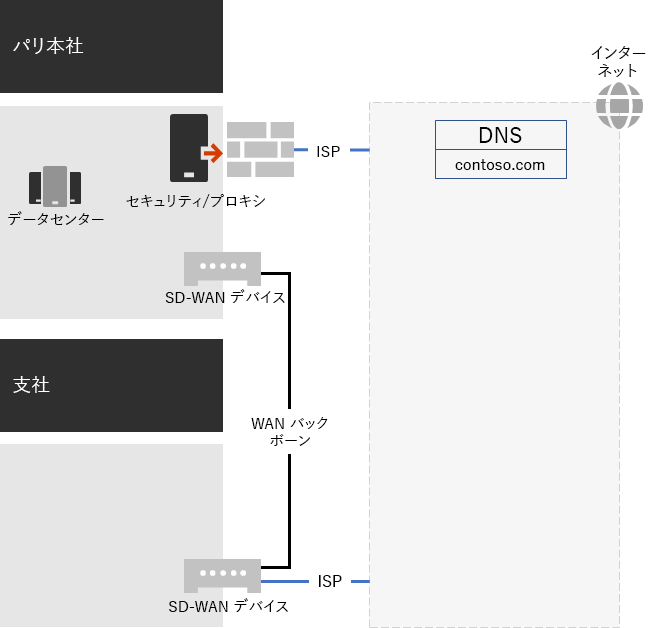
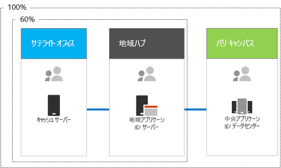

# Contoso Corporation のネットワーク

**概要:** Contoso 社のネットワーク インフラストラクチャと、Microsoft 365 Enterprise のクラウドベースのサービスに対する最高性能のネットワーク接続性を得るために SD-WAN テクノロジをどのように使用しているかについて説明します。

クラウドを組み込んだインフラストラクチャを導入するために、Contoso 社のネットワーク エンジニアは、ネットワーク トラフィックがクラウドベースのサービスへ移動する際の根本的な変化を認識しました。本社のネットワーク接続に注目したハブ アンド スポーク モデルの代わりに、ユーザーの場所をローカルのインターネット出口と、インターネット上の Microsoft ネットワークの場所へのローカル接続にマッピングしました。

## Contoso 社のネットワーク インフラストラクチャ

世界中のオフィスをつなぐ Contoso 社のネットワークの要素を次に示します。

- MPLS WAN ネットワーク

  MPLS WAN ネットワークは、パリの本社と地方の支店や、地方の支店とサテライト オフィスを、スポークとハブによる構成で接続します。これは、ユーザーがパリのオフィスで基幹業務アプリケーションを構成するオンプレミス サーバーにアクセスするためのものです。また、一般的なインターネット トラフィックを、ネットワーク セキュリティ デバイスが要求をスクラブするパリのオフィスにルーティングします。各オフィス内でルーターは、プライベート IP アドレス空間を使用するサブネット上のホストまたはワイヤレス アクセス ポイントにトラフィックを配信します。

- Office 365 のトラフィック向けのローカル インターネット直接アクセス

  各オフィスには、1 つ以上のローカル インターネット ISP ネットワーク回線を持つ SD-WAN デバイスがあり、プロキシ サーバー経由でインターネットに接続します。これは通常、プロキシ サーバーのパブリック IP アドレスとローカル DNS サーバーの IPアドレスも提供するローカル ISP への WAN リンクとして実装されます。

- インターネット プレゼンス

  Contoso 社は、contoso.com パブリック ドメイン名を所有しています。製品を発注するための Contoso 社のパブリック Web サイトは、パリ キャンパスのインターネット接続データセンター内のサーバー セットです。Contoso 社は、インターネット上の /24 のパブリック IP アドレス範囲を使用します。

図 1 は、Contoso 社のネットワーク インフラストラクチャと、そのインターネットに対する接続を示しています。

 
**図 1: Contoso 社のネットワーク**

## Microsoft への最適なネットワーク接続のための SD-WAN の使用

Contoso 社は次の [Office 365 ネットワーク接続の原則](https://docs.microsoft.com/office365/enterprise/office-365-network-connectivity-principles)に従いました。

1. Office 365 ネットワーク トラフィックを識別して区別する
2. ネットワーク接続のローカルの出口を提供する
3. ネットワーク ヘアピンを回避する
4. 重複するネットワーク セキュリティ デバイスをバイパスする

Office 365 のネットワーク トラフィックには、最適化、許可、既定の 3 つのカテゴリがあります。最適化トラフィックと許可トラフィックは、エンドポイントで暗号化され、セキュリティで保護された、Microsoft データセンター向けの信頼されたネットワーク トラフィックです。

Contoso 社は、最適化カテゴリと許可カテゴリのトラフィック用に直接のインターネット出口を使用し、すべての既定カテゴリのトラフィックをパリに本部を置く中央インターネット接続に転送することにしました。

同社は、これらの原則に従い、Microsoft 365 クラウドベースのサービスで最適なネットワーク パフォーマンスを実現する簡単な方法として、各オフィスに SD-WAN デバイスを導入することに決めました。

SD-WAN デバイスには、ローカル オフィス ネットワーク用の LAN ポートと複数の WAN ポートがあります。1 つの WAN ポートが MPLS ネットワークに接続し、他の WAN ポートがローカル ISP 回線に接続します。SD-WAN デバイスは、最適化および許可カテゴリのネットワーク トラフィックを ISP リンクにルーティングします。

## Contoso 社の基幹業務アプリケーションのインフラストラクチャ

Contoso 社は、次のような基幹業務アプリケーションおよびサーバー インフラストラクチャを設計しました。

- サテライト オフィスは、ローカル キャッシュ サーバーを使用して、アクセス頻度の高いドキュメントおよび内部 Web サイトを格納します。
- 地域ハブは、地域オフィスおよびサテライト オフィスに地域アプリケーション サーバーを使用します。これらのサーバーは、パリ本社のサーバーと同期します。
- パリ キャンパスには、組織全体にサービスを提供する集中管理されたアプリケーション サーバーを含むデータセンターが存在します。

図 2 は、Contoso 社のイントラネット サーバー アクセス時のネットワーク トラフィックの割合を示します。

 
**図 2: Contoso 社の内部アプリケーションのインフラストラクチャ**

サテライト オフィスまたは地域ハブ オフィスのユーザーについては、従業員が必要とするリソースの 60% をサテライト オフィスおよび地域ハブ オフィスのサーバーでまかなうことができます。リソース要求の残りの 40% は、WAN リンク経由でパリ キャンパスに引き継がれる必要があります。

## Contoso 社のネットワーク分析と Microsoft 365 Enterprise のネットワークの準備

Contoso 社のユーザーによる Microsoft 365 Enterprise サービスの導入が成功するかどうかは、インターネットへの高可用性と高性能の接続、または Microsoft クラウド サービスへの直接接続によります。Contoso 社は、Microsoft 365 Enterprise のクラウド サービスへの最適な接続を計画および実装するために、次の手順を実行しました。

1. 計画の支援のために、会社の WAN ネットワーク ダイアグラムを作成

   Contoso 社は、ネットワーク上で管理されている場所、既存のネットワーク接続、既存のネットワーク周辺機器、サービス クラスを示す図を作成して、ネットワーク計画を開始しました。ネットワーク接続の計画と実装における後続の各ステップにおいて、この図が使用されました。

2. Microsoft 365 Enterprise のネットワーク接続の計画を作成

   Contoso 社は、[Office 365 のネットワーク接続の原則](https://docs.microsoft.com/office365/enterprise/office-365-network-connectivity-principles)を使用し、参照ネットワーク アーキテクチャを提供して、Office 365 接続の優先トポロジを SD-WAN にすることに決定しました。

3. 各オフィスのインターネット接続利用率と MPLS WAN 帯域幅を分析し、必要に応じて帯域幅を拡大

   各オフィスで現在の使用状況が分析され、予測される Microsoft 365 のクラウドベースのトラフィックが未使用容量の平均 20% で動作するように回線が増加されました。

4. Microsoft ネットワーク サービスへのパフォーマンスを最適化

   Contoso 社は、最適なパフォーマンスを得るために、Office 365、Intune、Azure エンドポイントのセットを決定し、インターネット パス上にファイアウォール、セキュリティ デバイス、その他のシステムを構成しました。Office 365 の最適化および許可カテゴリのトラフィックのエンドポイントは、インターネットへの直接アクセスを可能にする SD-WAN デバイスに構成されました。

5. 内部 DNS の構成

   DNS が機能し、Office 365 トラフィックのためにローカルで検索対象になる必要があります。

6. ネットワーク エンドポイントとポートの接続を検証

   Contoso 社は、Microsoft が提供するネットワーク接続テスト ツールを実行して、Microsoft 365 Enterprise のクラウド サービスの接続を検証しました。

7. 従業員のコンピューターのネットワーク接続を最適化

   各自のコンピューターをチェックして、最新のオペレーティング システムの更新プログラムがインストールされ、すべてのクライアントでエンドポイント セキュリティ監視がアクティブであることを確認しました。

## 次の手順

Contoso 社が、どのようにクラウド内のオンプレミスの ID プロバイダーを従業員向けに利用し、どのように顧客やビジネス パートナー向けのフェデレーション認証を活用しているかについて[説明](contoso-identity.md)します。

## 関連項目

[Microsoft 365 Enterprise のネットワーク](networking-infrastructure.md)

[展開ガイド](deploy-microsoft-365-enterprise.md)

[テスト ラボ ガイド](m365-enterprise-test-lab-guides.md)
