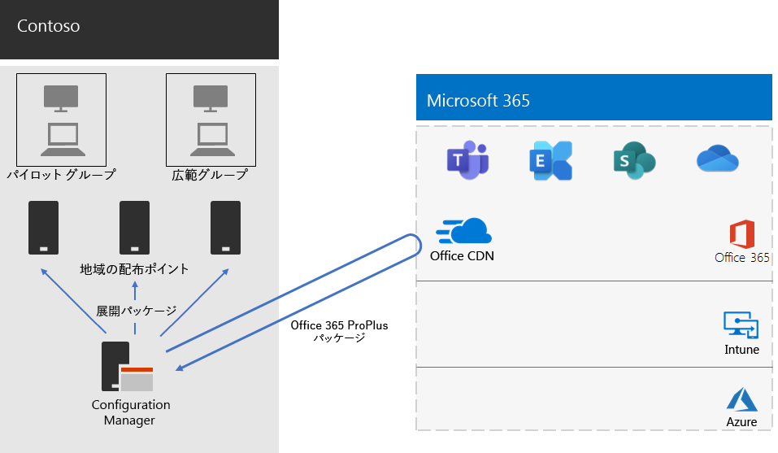

# Contoso 社の Microsoft 365 Apps for enterprise の展開

Contoso 社は、より効果的なWindows 10 Enterprise、Microsoft 365 Apps for enterprise、よりモダンなデスクトップ エクスペリエンスを実現するために、PC をアップグレードして、新しいデスクトップ エクスペリエンスを実現しました。 インフラストラクチャとビジネス ニーズを評価した後、Contoso 社は展開に関する次の重要な要件を特定しました。

- すべての PC は、次のMicrosoft 365 Apps for enterprise。
- 展開では、可能な場合は既存の管理ツールとインフラストラクチャを使用する必要があります。
- 展開では、ユーザーのデバイスで複数の言語と既存のアーキテクチャをサポートする必要があります。
- PC は、IT 管理コストを最小限に抑え、ユーザーに与える影響を最小限に抑え、最新のセキュリティを維持する必要があります。

## 展開ツール

Contoso 社は要件に基づいて、Configuration Manager (Current Branch) をWindows 10 Enterprise、Microsoft 365 Apps for enterpriseを展開することを選択しました。 Configuration Manager は、大規模な環境向けに調整されていて、インストール、更新、設定についての詳細な制御を実現します。 さらに、次に示す組み込みの機能により、Office の展開および管理が簡単で効率的になります。

- ピア キャッシュ: リモートの場所のデバイスに展開する際にネットワーク容量が制限される場合に役立ちます。
- クライアントOffice管理ダッシュボードを使用すると、更新プログラムを簡単に展開Office監視し、管理者は最新の展開および管理機能にアクセスできます。
- オペレーティング システムと同じ言語を自動的に展開するなどのインテリジェントな言語パックの展開。
- 展開中にクライアントから既存のバージョンのファイルを削除する完全にサポートされ、使いやすいOffice方法です。

Configuration Manager に加えて、Contoso 社は Office アドインの準備 Toolkit と[、Microsoft](/deployoffice/readiness-toolkit-application-compatibility-microsoft-365-apps)の無料ツールである VBA を使用して、Office マクロとアドインとの互換性の問題を評価しました。

## 展開と更新プログラムの管理

Microsoft 365 Apps for enterprise新しいリリース モデルが含Officeサービスとして使用されます。 サービス モデルを使用すると、新しい機能を簡単に最新の情報に更新できます。 しかし、多くの場合、IT 部門は新しいリリースの展開方法とテスト方法を変更する必要があります。 互換性の問題を最小限に抑え、コンピューターが最新の情報を維持するために、Contoso 社は次の 2 つのWindowsとOffice展開しました。

- 最初に、組織全体Microsoft 365 Apps for enterprise一連の代表的なデバイスに展開しました。 このパイロット グループは、アプリ、アドイン、ハードウェアをテストするために使用Microsoft 365 Apps for enterprise。
- 4 か月後、パイロット グループのアプリ、アドイン、ハードウェアに関する重要な問題を解決した後、Contoso 社では Microsoft 365 Apps for enterprise を組織内の残り (広範グループ) のデバイスに展開しました。

Configuration Manager を使用してOffice更新プログラムを管理する代わりに、Contoso はクラウドからの自動更新を有効にしました。 クラウドベースの更新プログラムを使用すると、管理上のオーバーヘッドが軽減され、デバイスが最新の情報に更新されます。

Contoso 社は、Office の展開に使用した機能更新プログラムと同じ 2 段階のアプローチに従いました。パイロット グループ内のデバイスは、組織の他のデバイス (広範なグループ) よりも 4 か月前に機能更新プログラムを受け取りました。 これを Office で可能にするために、Contoso 社では 2 つの推奨される[更新チャネル](/DeployOffice/overview-update-channels)を使用しました。

- パイロット グループへの更新向け半期エンタープライズ チャネル (プレビュー)
- Semi-Annual Enterpriseグループの更新のためのチャネルの追加

エンタープライズ チャネル (プレビュー) は半期エンタープライズ チャネルよりも 4 か月早いバージョンの Microsoft 365 Apps for enterprise をリリースするため、Contoso 社は更新プログラムを管理する必要なしに、それらを検証する時間があります。

## 展開プロセス

Office の展開を完了するために、Contoso 社では Microsoft のベスト プラクティスの推奨事項を含む次のプロセスを実装しました。

1. 展開の前に、Contoso は Office アドインと VBA の準備 Toolkit を使用して、アプリと Office アドインをテストして、Microsoft 365 Apps for enterprise との互換性を評価しました。
1. Configuration Manager では、クライアント デバイスでピア キャッシュを有効にし、リモートの場所にクライアント デバイスを展開する際のネットワーク容量の制限に役立ちます。 
1. Contoso 社は、Configuration Manager で 2 つの展開グループをデバイス コレクションとして定義しました。パイロット グループと広範なグループ。 組織全体の代表的なデバイスの小さなセットを含むパイロット グループは、Windows 10 Enterprise と Microsoft 365 Apps for enterprise を使用したアプリ、アドイン、ハードウェアの追加テストに使用されました。
1. これらのユーザーは、Office クライアント管理ダッシュボードと Office Office 365 インストーラー ウィザード (どちらも Configuration Manager コンソールの一部) を使用して、Office の展開パッケージを作成しました。 2 つの Microsoft 365 Apps for enterprise パッケージを構築しました。1 つは Semi-Annual Enterprise チャネル (プレビュー) のパイロット グループ用と、Semi-Annual Enterprise チャネルの広範なグループ用です。
2. 各Officeには、英語、フランス語、ドイツ語の言語パックが含まれていました。 デバイスで、Office パッケージに含まれていない言語が必要な場合、その言語パックは自動的に Office Content Delivery Network (CDN) からダウンロードされました。
3. Office パッケージの組み込み機能を使用して、Microsoft 365 Apps for enterprise のインストール前に既存の MSI バージョンの Office をすべて自動的に削除しました。
4. Configuration Manager では、ネットワーク全体の配布ポイントにWindows Officeパッケージを展開しました。 次に、Configuration Manager 展開タスク シーケンスを実行して、パイロット Microsoft 365 Apps for enterpriseにパイロット パッケージを展開しました。
5. パイロット グループとの互換性の問題に対処した後、Contoso はタスク シーケンスを実行して、Microsoft 365 Apps for enterprise パッケージを広範なグループに展開しました。

Contoso 社ではクラウドからデバイスを自動的に更新するよう選択しているため、Configuration Manger でプロセスを管理する必要はありませんでした。 デバイスは、最初の展開で定義された更新チャネルに基づいて、クラウドベースから直接自動的に更新されます。

Contoso のインストールと継続的Microsoft 365 Apps for enterprise展開アーキテクチャを次に示します。

 
## 次の手順

Contoso 社が[エンタープライズ向](contoso-mdm.md)Microsoft Intune Microsoft 365を使用して、組織全体で実行するデバイスとアプリを管理する方法について説明します。

## 関連項目

[Microsoft 365 Apps for enterprise](/deployoffice/deployment-guide-microsoft-365-apps)

[Microsoft 365 for enterprise の概要](microsoft-365-overview.md)

[テスト ラボ ガイド](m365-enterprise-test-lab-guides.md)