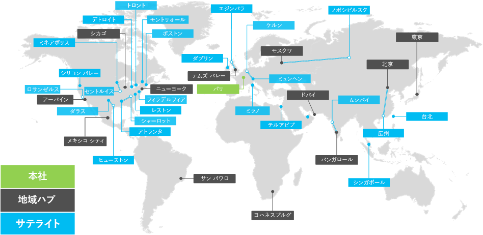

# Contoso Corporation の概要

Contoso Corporation は、パリに本社を置く多国籍企業です。 会社は、100,000 以上の製品を持つ製造、販売、およびサポート組織です。

## 世界の Contoso

図 1 は、パリの本社オフィスと、さまざまな大陸の地域ハブオフィスとサテライト オフィスを示しています。

**図 1: 世界中の Contoso オフィス**
 
Contoso 社には、次の 3 つの層のオフィスがあります。

- Headquarters

  Contoso 本社はパリ郊外の企業キャンパスで、管理、エンジニアリング、製造施設用の数十の建物があります。 すべての Contoso データセンターとそのインターネットプレゼンスは、パリ本社に収容されています。

  本社には 25,000 人のワーカーがいます。

- 地域ハブ

  ハブ オフィスは、60% の売上とサポート スタッフを持つ世界の特定の地域にサービスを提供します。 各地域ハブは、高帯域幅 WAN リンクを介してパリ本社に接続されます。

  地域ハブの平均従業員数は 2,000 人です。

- サテライト オフィス

  サテライト オフィスには、80% の売上とサポート スタッフが含まれる。 主要都市またはサブ地域の Contoso のお客様にオンサイトプレゼンスを提供します。 各サテライト オフィスは、高帯域幅 WAN リンクを介して地域ハブに接続されます。

  サテライト オフィスの従業員数は平均 250 人です。

Contoso の従業員の約 25% がモバイル専用です。 地域ハブとサテライト オフィスは、これらのワーカーの割合が高くなります。 モバイル専門のワーカーにより良いサポートを提供することが、Contoso 社の重要なビジネス目標です。

## エンタープライズ向けMicrosoft 365に関する設計上の考慮事項

Contoso IT アーキテクトは、エンタープライズ向けソリューションを展開する次の設計要件Microsoft 365特定しました。

- 地理的に複数の場所にあり、地域に応じた規制とコンプライアンスの要件がある
- 社内の業務アプリケーションをホストする本社オフィスおよび地域のアプリケーション サーバーの中央イントラネット データセンター
- 既存の Microsoft Endpoint Configuration Manager インフラストラクチャ
- クライアント コンピューター、Mac、および Linux をWindowsするクライアント コンピューティング デバイスの組み合わせ
- iOS (iPhone と iPad) や Android のスマートフォンやタブレットを含め、個人および会社が所有するモバイル デバイスは各種混合
- リモートおよびモバイルのワーカーが多数
- ビジネス パートナーが多数
- 管理およびセキュリティ保護を行う大量の顧客および他の機密情報
- 製品の設計仕様、および製造上の機密情報の形式で、重要な知的財産の量が多い

## 次の手順

Contoso Corporation のオンプレミス[IT インフラストラクチャ](contoso-infra-needs.md)と、企業のビジネス ニーズがエンタープライズ向けサービスとどのように対応Microsoft 365説明します。

## 関連項目

[Microsoft 365 for Enterprise の概要](microsoft-365-overview.md)

[テスト ラボ ガイド](m365-enterprise-test-lab-guides.md)
