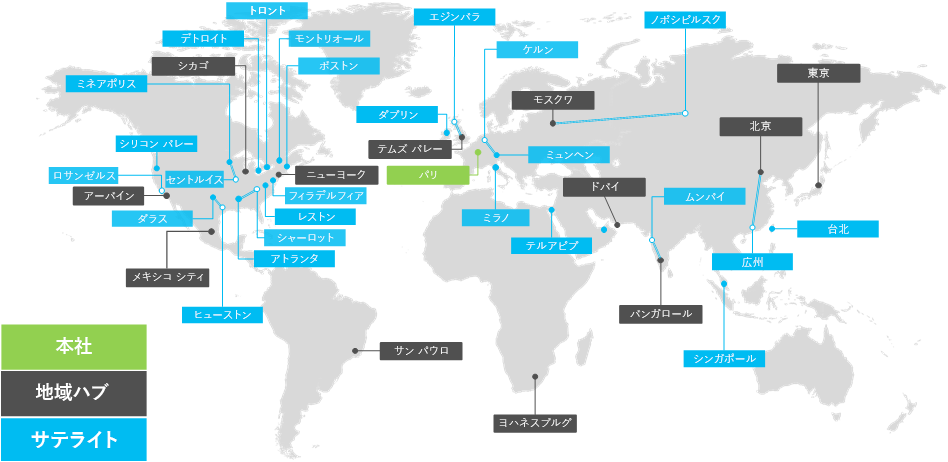

# Contoso Corporation の概要

**概要:** ビジネスとしての Contoso Corporation について、さらに同社の世界規模のオフィスの階層構造について説明します。

Contoso Corporation は、フランスのパリに本社を持つ多国籍企業であり、100,000 を超える製品を製造、販売、およびサポートする複合組織です。

## 世界の Contoso

図 1 は、パリにある本社と、さまざまな大陸にある地域ハブおよびサテライト オフィスを示しています。

**図 1:世界各国の Contoso 社のオフィス**
 
世界各国の Contoso 社のオフィスは、3 層設計に従っています。

- 本社

  Contoso Corporation の本社は、管理、エンジニアリング、および製造設備のための数十の建物を持つパリ郊外の大規模な企業キャンパスです。Contoso 社のすべてのデータセンターおよびインターネット プレゼンスはパリ本社内に存在します。

  本社には 25,000 人のワーカーがいます。

- 地域ハブ

  地域ハブ オフィスでは、60% の販売およびサポート スタッフが世界の特定の地域にサービスを提供しています。各地域のハブは、高帯域幅の WAN リンクでパリの本社に接続されています。 

  各地域ハブには平均 2,000 人のワーカーがいます。

- サテライト オフィス

  サテライト オフィスには 80% の販売およびサポート スタッフがいて、主要都市または地区で Contoso 社の顧客にオンサイトのプレゼンスを提供します。各サテライト オフィスは、高帯域幅の WAN リンクで地域ハブに接続されています。

  各サテライト オフィスには平均 250 人のワーカーがいます。

Contoso 社の要員の 25% はモバイル専門であり、地域ハブ オフィスおよびサテライト オフィスではモバイル専門のワーカーの割合がさらに高くなります。モバイル専門のワーカーにより良いサポートを提供することが、Contoso 社の重要なビジネス目標です。

## Microsoft 365 Enterprise の設計上の考慮事項

Contoso 社の IT アーキテクトは、Microsoft 365 Enterprise を展開する際の、次の設計上の考慮事項を特定しました。 

- 地理的に複数の場所にあり、地域に応じた規制とコンプライアンスの要件がある
- 本社オフィスに中央イントラネット データセンターがあり、地域のアプリケーション サーバーで内部の基幹業務アプリケーションをホストしている
- 既存の System Center Configuration Manager インフラストラクチャ
- クライアント コンピューティング デバイスは Windows、Mac、Linux など各種混合
- iOS (iPhone と iPad) や Android のスマートフォンやタブレットを含め、個人および会社が所有するモバイル デバイスは各種混合
- リモートおよびモバイルのワーカーが多数
- ビジネス パートナーが多数
- 顧客データと個人情報データの量が多い
- 製品の設計仕様、および製造上の機密情報の形式で、重要な知的財産の量が多い

## 次の手順

Contoso Corporation のオンプレミスの IT インフラストラクチャについて、およびそのビジネス ニーズが Microsoft 365 Enterprise によってどのように満たされるかについて[説明](contoso-infra-needs.md)します。

## 関連項目

[展開ガイド](deploy-microsoft-365-enterprise.md)

[テスト ラボ ガイド](m365-enterprise-test-lab-guides.md)

