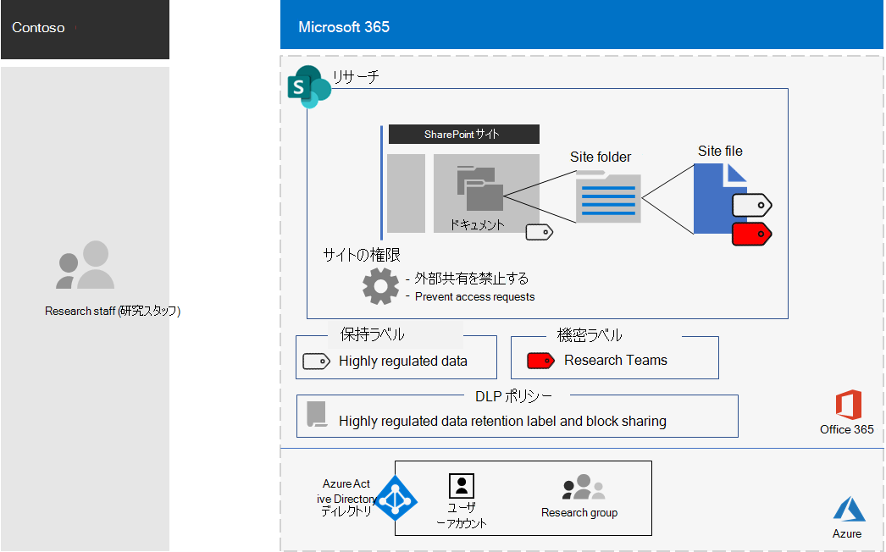
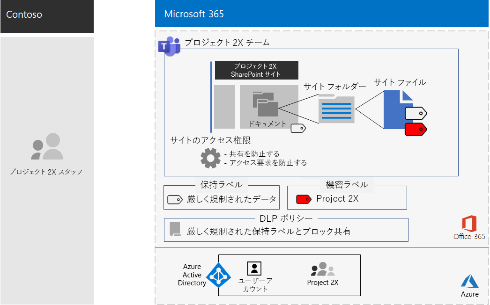

# Contoso 社の極秘プロジェクトのチームTeam for a top-secret project of the Contoso Corporation

上級管理職がオフサイトになると、Contoso 社の CEO は、今後5年間で Contoso 社の利益を2倍にすることができる新しいスイートの製品とサービスの開発を命じました。After an executive offsite, Contoso’s CEO ordered the development of a new suite of products and services that could double Contoso’s profits in the next five years. ビジネス、エンジニアリング、マーケットプランを開発する最上位のプロジェクトは、 **Project 2x**という名前で、会社全体にわたる主なスタッフは recruited でした。The top-secret project to develop the business, engineering, and market plan was named **Project 2X** and key staff across the company were recruited. 

研究開発のタイムラインは厳しいものでした。つまり、共同作業を効率的に行い、セキュリティで保護された会議、継続的な会話、ファイルストレージを提供する必要がありました。The timelines for research and development were tight, which meant that collaboration had to be efficient and provide for secure meetings, ongoing conversations, and file storage.

プロジェクト2X の結果として得られる成果物は、ビジネスプラン、製品とエンジニアリングの仕様、およびマーケティング資料とスケジュールが、Word、Excel、および PowerPoint のファイルの形式で表示されます。The resulting deliverables for Project 2X were business plans, product and engineering specifications, and marketing materials and schedules in the form of Word, Excel, and PowerPoint files. 

機密情報のため、これらのファイルへのアクセスは次のようになりました。Due to their sensitive nature, access to these files were:

- プロジェクト2チームメンバーに制限されます。Restricted to Project 2X team members.
- データ損失防止 (DLP) ポリシーによって保護され、Project 2X チームメンバーがチーム外で共有できないようにします。Protected with a Data Loss Prevention (DLP) policy to prevent Project 2X team members from sharing them outside the team.
- ファイルが Contoso 外に配布された場合でも、Project 2X のチームメンバーにのみアクセスを許可するためのアクセス許可によって暗号化および保護されます。Encrypted and protected with permissions to allow access only to Project 2X team members, even if the files were distributed outside of Contoso.

Contoso IT スタッフは、Project 2X の[高度な規制データにチーム](secure-teams-highly-regulated-data-scenario.md)を使用して、これらの手順を実行していました。Contoso IT staff used a [team for highly-regulated data](secure-teams-highly-regulated-data-scenario.md) for Project 2X and these steps.

## 手順 1: プライベートチームを作成し、基盤となる SharePoint サイトをロックしたStep 1: Created a private team and locked down the underlying SharePoint site

チームの基礎となる SharePoint サイトへのアクセスを保護するために、Contoso IT 管理者が[推奨する sharepoint アクセスポリシー](sharepoint-file-access-policies.md)を構成しました。To protect access to the underlying SharePoint site for the team, Contoso IT administrators configured the [recommended SharePoint access policies](sharepoint-file-access-policies.md).

次に Contoso IT 管理者は、Project 2X という名前の新しいプライベートチームを作成し、Project 2X スタッフのユーザーアカウントをメンバーとして追加しました。Next, a Contoso IT administrator created a new private team named Project 2X and added the user accounts of Project 2X staff as members.

次に、プロジェクト2X がサイトへのアクセスを共有したり、他のユーザーがサイトへのアクセスを要求できないようにするために、サイトの追加のアクセス許可の設定を構成しました。Next, they configured additional permission settings for the site to prevent Project 2X from sharing access to the site and to prevent other from requesting access to the site.

構成の詳細については、「[高度な規制チームの SharePoint 設定](https://docs.microsoft.com/microsoft-365/security/office-365-security/deploy-teams-three-tiers#highly-confidential-teams)」を参照してください。For the configuration details, see [SharePoint settings for a highly regulated team](https://docs.microsoft.com/microsoft-365/security/office-365-security/deploy-teams-three-tiers#highly-confidential-teams).

## 手順 2: DLP ポリシーと、保持ラベルの基礎となるサイトを構成します。Step 2: Configured a DLP policy and the underlying site for a retention label 

最初に、Contoso 管理者は、Project 2X team の基礎となる SharePoint サイトの**ドキュメント**セクションに、既存の**非常に機密性の高い**Office 365 保持ラベルを適用しました。First, Contoso admins applied the existing **Highly Confidential** Office 365 retention label to the **Documents** section of the underlying SharePoint site of the Project 2X team.

次に、 **Project 2x**という新しい OFFICE 365 DLP ポリシーを作成しました。次のようになります。Next, they created a new Office 365 DLP policy named **Project 2X** that:

- 非常に機密性の高い Office 365 保持ラベルを使用します。Uses the Highly Confidential Office 365 retention label.
- ユーザーが Contoso の外部のプロジェクト2X チーム内のファイルを共有しようとすると、ユーザーをブロックします。Blocks users when they attempt to share a file in the Project 2X team outside of Contoso.

構成の詳細については、「[保持ラベルおよび DLP を使用した teams でファイルを保護](https://docs.microsoft.com/microsoft-365/security/office-365-security/deploy-teams-retention-dlp)する」を参照してください。For the configuration details, see [Protect files in teams with retention labels and DLP](https://docs.microsoft.com/microsoft-365/security/office-365-security/deploy-teams-retention-dlp).

## 手順 3: Project 2X チームの Office 365 機密ラベルを作成するStep 3: Created an Office 365 sensitivity label for the Project 2X team

Contoso 管理者は、 **Project 2x**という名前の新しい Office 365 機密ラベルを作成しました。Contoso admins created a new Office 365 sensitivity label named **Project 2X** that:

- 暗号化が必要です。Requires encryption.
- Project 2X Office 365 グループに対して共同編集権限を許可します。Allows Co-Author permissions for the Project 2X Office 365 group.

プロジェクト2チームの最終的な構成を次に示します。Here is the resulting configuration of the Project 2X team.

 
基になる Project 2X SharePoint サイトの [ドキュメント] セクションにあるファイルは、次の方法で保護されています。Files in the Documents section of the underlying Project 2X SharePoint site were protected by:

- サイトのアクセス許可。これは、Project 2X Office 365 グループのメンバーにのみアクセスを許可します。The site permissions, which only allow access to members of the Project 2X Office 365 group.
- 新しいファイルに自動的に割り当てられる、高機密保持ラベル。The  Highly Confidential retention label, which is automatically assigned to new files.
- 高機密保持ラベルと、そのファイルを外部ユーザーと共有することをブロックする設定を使用する DLP ポリシー。A DLP policy that uses the Highly Confidential retention label and settings that block the file from being shared with external users.
- プロジェクトがサイトから移動またはコピーされた場合に、ファイルと共に送信される、暗号化とアクセス許可を持つ2つのプロジェクトの機密ラベル。The Project 2X sensitivity label, with encryption and permissions that travel with the file if it is moved or copied from the site.

ここでは、基本となる Project 2X サイトに保存されているファイルのうち、高度な規制保持ラベルと Project 2X 機密ラベルが割り当てられているファイルの例を示します。Here is an example of a file stored in the underlying Project 2X site with the Highly Regulated retention label and the Project 2X sensitivity label assigned.

 
## 手順 4: トレーニングを受けた Project 2X チームメンバーStep 4: Trained Project 2X team members

Contoso のセキュリティスタッフは、次の手順に従ってステップ実行する必須のコースで、Project 2X のチームメンバーをトレーニングしています。Contoso security staff trained the Project 2X team members in a mandatory course that stepped them through:

- 新しい Project 2X teams にアクセスする方法、会議とチャットを使用する方法、およびチームファイルで共同作業する方法について説明します。How to access the new Project 2X team, use meetings and chats, and how to collaborate on team files.
- チーム内で新しいファイルを作成し、ローカルに作成された新しいファイルをアップロードする方法について説明します。How to create new files in the team and upload new files created locally.
- DLP ポリシーによって、ファイルが外部で共有されることをブロックする方法のデモ。A demonstration of how the DLP policy blocks files from being shared externally.
- Project 2X 機密ラベルを使用してファイルにラベルを付ける方法について説明します。How to label files with the Project 2X sensitivity label.
- プロジェクトの2つのラベルがチームを離れたときでもファイルを保護する方法についてのデモ。A demonstration of how the Project 2X  label protects a file even when it leaves the team.

最終的には、セキュリティで保護された環境で、Project 2X のチームメンバーがチャット、会議、およびファイルのセキュリティで保護された環境で共同作業を行うことができました。The end result was a secure environment in which Project 2X team members collaborated in a secure environment for chats, meetings, and files.

いくつかのインスタンスでは、Project 2X のチームメンバーは、オフライン作業のために Project 2X ラベルで保護されたファイルをローカルドライブにダウンロードしていました。In a couple of instances, Project 2X team members downloaded files protected by the Project 2X label to a local drive for offline work. ただし、資格情報を開くときに資格情報の入力を求められた後で、それらの間違いを認識して削除しました。However, after being prompted for credentials when opening them, they realized their mistake and deleted them.

Teams のグループ作業環境と Microsoft 365 のセキュリティ機能により、project 2X の詳細はプロジェクトの期間中に機密情報として保持されていました。Because of the collaboration environment of Teams and the security features of Microsoft 365, the details of Project 2X were kept secret for the duration of the project. Contoso 社はプランを発表し、新しい製品とサービスを顧客や投資家の成功および競合他社の chagrin に展開する過程にあります。Contoso announced its plans and is in the process of rolling out the new products and services to the delight of its customers and investors and the chagrin of its competitors.

## 次の手順Next step

[展開](deploy-microsoft-365-enterprise.md)組織内の Microsoft 365 Enterprise。[Deploy](deploy-microsoft-365-enterprise.md) Microsoft 365 Enterprise in your organization.

## 関連項目See also

[Microsoft 365 生産性向上ライブラリ](https://aka.ms/productivitylibrary) (https://aka.ms/productivitylibrary)[Microsoft 365 Productivity Library](https://aka.ms/productivitylibrary) (https://aka.ms/productivitylibrary)
