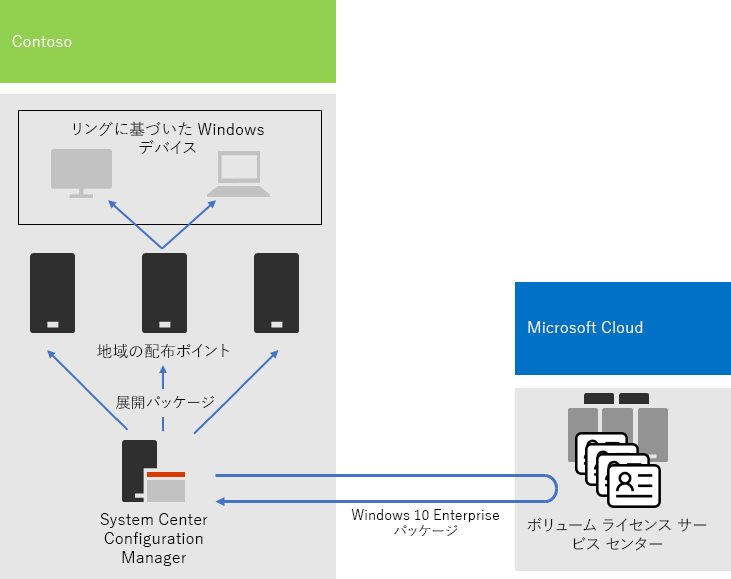

# Contoso 社の Windows 10 Enterprise 展開

Microsoft 365 Enterprise の広範なロールアウトに先立ち、Contoso 社には、Windows 7 (10%)、Windows 8.1 (65%)、Windows 10 (25%) が混在する Windows 互換の PC とデバイスがありました。Contoso 社は、Windows 10 Enterprise 用の PC をアップグレードして、高度なセキュリティを利用したいと考え、更新プログラムの自動展開により IT 部門の負荷を削減しました。 

インフラストラクチャとビジネス ニーズを評価した後、Contoso 社は展開に向けて、以下の重要な要件を特定しました。

- できるだけ多くの PC やデバイスで Windows 10 Enterprise を実行する必要がある
- 一括アップグレードのロールアウトには、既存の Configuration Manager インフラストラクチャを活用する
- Windows 10 Enterprise のどのバージョンを展開するかを制御し、更新プログラムはリングを介して行う
- PC やデバイスは、IT 管理コストとエンドユーザーに与える影響を最小限に抑えつつ、最新の状態に保つ必要がある

最新とは、Contoso 社のビジネス ニーズを満たす Windows 10 Enterprise のサポート バージョンとして定義されます。これは、すべての Windows 互換の PC が Windows 10 Enterprise の最新バージョンを実行することとは異なる場合があります。

## 展開ツール

Contoso 社は、Windows 10 Enterprise の一括アップグレードの前および最中に、Windows Analytics の次のソリューションを使用しました。

- Upgrade Readiness  

  分析のためにシステム、アプリケーション、ドライバーのデータを収集し、更新の妨げになる可能性がある互換性の問題、推奨される修正、Microsoft によって既に認識されている問題を特定します。

- Update Compliance  

  Windows 更新に関するデバイスの状態が表示されるため、必要に応じて最新の更新プログラムが適用されていることを確認できます。

- デバイスの正常性  

  頻繁にクラッシュするデバイスを特定します。そのため、再構築または交換が必要になる可能性があり、デバイス クラッシュの原因となるデバイス ドライバーと、クラッシュの数を減らす可能性のあるドライバーの代替バージョンを提案します。 エンド ユーザーにプロンプ​​トを送信する Windows 情報保護の構成の誤りを通知します。
 
Contoso には、既存の Configuration Manager (Current Branch) インフラストラクチャがあります。 Configuration Manager は、大規模な環境向けに調整されていて、インストール、更新、設定についての詳細な制御を実現します。 さらに、組み込みの機能により、Windows 10 Enterprise の展開および管理が簡単で効率的になります。

## 計画プロセス

展開に先立って、Contoso 社は次のリングを定義しました。

- 検証と展開ステージング用の 3 つのリング 
  - プレビュー ビルド用のリング 
  - 新規リリース ビルド用のリング
  - 以前のビルド用のリング 
- 検証リングからのデータに基づく Windows 10 Enterprise の幅広い展開のためのリング

Contoso 社は、Windows Analytics の Upgrade Readiness ソリューションを使用して、インストールされているアプリのセットとそれらの Windows 10 Enterprise との互換性を判断しました。

## 展開プロセス

Contoso 社は、Windows 10 Enterprise の一括アップグレードの展開を完了するために、Microsoft のベスト プラクティスの推奨事項を含む次のプロセスを実装しました。

1. 構成マネージャーのピア キャッシュを有効にしました。
2. ボリューム ライセンス サービス センターからのイメージに基づくカスタムの Windows パッケージを作成しました。
3. 構成マネージャーを使用して、ネットワーク上の配布ポイントに Windows パッケージを展開し、3 つの検証および展開ステージングのリングにビルドを展開しました。
4. Windows Analytics のデバイスの正常性および Update Compliance ソリューションを使用して、3 つの検証および展開ステージング リングで PC およびデバイスに対して成功の評価を実施しました。
5. Contoso 社は、Windows Analytics の情報に基づいて、広範な展開リングに展開する Windows 10 Enterprise のバージョンを決定しました。
6. 構成マネージャーの展開タスク シーケンスを実行して、選択した Windows パッケージを広範な展開リングに展開しました。
7. 問題に対応するために、デバイスの正常性および更新プログラムの適用状況 ソリューションを使用して、広範な展開リング内の PC とデバイスを監視しました。

次に一括アップグレード、および進行中の更新プログラムの展開アーキテクチャを示します。

このインフラストラクチャは以下で構成されます。

- Configuration Manager は、以下を行います:
  - Microsoft Network の Microsoft ボリューム ライセンス センターから Windows 10 Enterprise パッケージのイメージを取得します。
  - 展開パッケージに対する中央の管理ポイントです。
- 通常は Contoso 社の地域ハブ オフィスにある地域配布ポイント。
- リング メンバーシップに基づいた一括アップグレードまたは進行中の更新プログラムの展開パッケージを受信してインストールする、さまざまな場所にある Windows PC およびデバイス。

## 次の手順

Contoso 社が Configuration Manager インフラストラクチャを利用して、現在の Office 365 ProPlus を組織全体に展開し、維持する方法について[説明](contoso-o365pp.md)します。 

## 関連項目

[Microsoft 365 Enterprise 向け Windows 10 Enterprise](windows10-infrastructure.md)

[展開ガイド](deploy-microsoft-365-enterprise.md)

[テスト ラボ ガイド](m365-enterprise-test-lab-guides.md)
