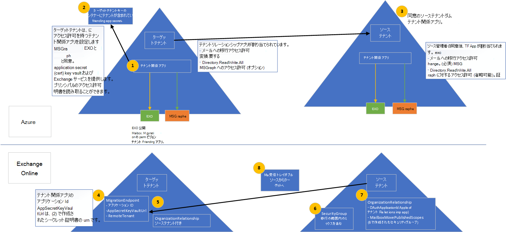

# <a name="cross-tenant-mailbox-migration-preview"></a>テナント間メールボックスの移行 (プレビュー)

以前は、Exchange Online テナントが同じ Exchange Online サービス内の別のテナントにメールボックスを移動する必要がある場合、メールボックスをオンプレミスに完全にオフボードしてから、新しいテナントにオンボードする必要がありました。 新しいクロステナント メールボックス移行機能により、移行元テナントとターゲット テナントの両方のテナント管理者は、オンプレミス システムでのインフラストラクチャの依存関係を最小限に抑えたテナント間でメールボックスを移動できます。 これにより、オフボードメールボックスとオンボードメールボックスが不要になります。

一般的に、合併や売却の際には、ユーザーとコンテンツを新しいテナントに移動する機能が必要です。 ターゲット テナント管理者が移動を実行すると、オンプレミスからクラウド オンボーディング移行に似たプル移動と呼ばれる。

クロステナント Exchange メールボックスの移動は、テナント管理者によって完全にセルフサービスされ、ユーザーを新しい組織に移行するために必要な大規模なワークフローにスクリプト化できる既知のインターフェイスを使用します。 管理者は、メールボックスの移動管理役割で使用できるコマンドレットを使用して、テナント `New-MigrationBatch` 間の移動を実行できます。 移動プロセスには、メールボックスの同期と完了時のテナント承認チェックが含まれます。

移行するユーザーは、移行先のテナント Exchange Online MailUsers として存在し、テナント間の移動を有効にするには、特定の属性でマークされている必要があります。 ターゲット テナントで適切に設定されていないユーザーの移動はシステムによって失敗します。

移動が完了すると、ソース システム メールボックスは MailUser に変換され、targetAddress (Exchange の ExternalEmailAddress として表示されます) は、宛先テナントへのルーティング アドレスでスタンプされます。 このプロセスは、従来の MailUser をソース テナントに残し、一時期の共同存在とメール ルーティングを可能にします。 ビジネス プロセスで許可されている場合、ソース テナントはソース MailUser を削除するか、メール連絡先に変換できます。

ハイブリッドまたはクラウドExchange、または 2 つの任意の組み合わせのテナントに対して、複数テナント間のメールボックス移行がサポートされます。

この記事では、テナント間メールボックスの移動のプロセスについて説明し、コンテンツ移動のソース テナントとターゲット テナントを準備する方法に関するガイダンスを提供します。

## <a name="preparing-source-and-target-tenants"></a>ソーステナントとターゲット テナントの準備

クロステナント 移行機能Exchange移行には、クロステナント移行の承認とスコープが必要です。 Azure Enterprise アプリケーションと Key Vault ストレージ ソリューションを使用して、テナント管理者は、1 つのテナントから別のテナントへの Exchange Online メールボックス移行の承認とスコープの両方を管理する権限を与えました。 テナント間メールボックスの移動は、テナントペア間の認証に使用される Azure Active Directory (Azure AD) アプリケーションを確立するための招待と同意モデルをサポートします。 組織の関係や移行エンドポイントなどの追加コンポーネントも必要です。

このセクションには、ターゲット ディレクトリ内の MailUser ユーザー オブジェクトを準備するために必要な具体的な手順は含まれています。また、移行バッチを送信するためのサンプル コマンドも含めありません。 この情報については [、「移行対象のユーザー オブジェクトを準備する」](#prepare-target-user-objects-for-migration) を参照してください。

## <a name="prerequisites"></a>前提条件

テナント間メールボックス移動機能では [、Azure Key Vault](/azure/key-vault/basic-concepts) がテナントペア固有の Azure アプリケーションを確立して、あるテナントから別のテナントへのメールボックス移行を認証および承認するために使用される証明書/シークレットを安全に保存してアクセスする必要があります。テナント間で証明書/シークレットを共有するための要件は削除されます。

開始する前に、Azure Key Vault、Move Mailbox Application、EXO Migration Endpoint、EXO Organization Relationship を構成するために、展開スクリプトを実行するために必要なアクセス許可を持っている必要があります。 通常、グローバル管理者には、すべての構成手順を実行するアクセス許可があります。

さらに、セットアップを実行する前に、ソース テナント内のメールが有効なセキュリティ グループが必要です。 これらのグループは、ソース (またはリソースとも呼ばれる) テナントからターゲット テナントに移動できるメールボックスの一覧の範囲を指定するために使用されます。 これにより、移行元テナント管理者は、移動する必要があるメールボックスの特定のセットを制限または範囲指定し、意図しないユーザーが移行されるのを防ぐことが可能になります。 入れ子になったグループはサポートされていません。

また、信頼できるパートナー企業 (メールボックスを移動する相手) と通信して、テナント ID を取得Microsoft 365必要があります。 このテナント ID は、[組織の関係] フィールドで使用 `DomainName` されます。

サブスクリプションのテナント ID を取得するには、サブスクリプションにサインインMicrosoft 365 管理センターに移動します [https://aad.portal.azure.com/#blade/Microsoft_AAD_IAM/ActiveDirectoryMenuBlade/Properties](https://aad.portal.azure.com/#blade/Microsoft_AAD_IAM/ActiveDirectoryMenuBlade/Properties) 。 Tenant ID プロパティのコピー アイコンをクリックしてクリップボードにコピーします。

プロセスの動作を次に示します。

:::image type="content" source="../media/tenant-to-tenant-mailbox-move/prepare-tenants-flow.png" alt-text="メールボックスの移行のためのテナントの準備。":::

[このイメージのより大きなバージョンを参照してください](https://github.com/MicrosoftDocs/microsoft-365-docs/raw/public/microsoft-365/media/tenant-to-tenant-mailbox-move/prepare-tenants-flow.png)。

<!--
[](https://github.com/MicrosoftDocs/microsoft-365-docs/raw/public/microsoft-365/media/tenant-to-tenant-mailbox-move/prepare-tenants-flow.png)
-->

### <a name="prepare-tenants"></a>テナントの準備

高レベルでは、セットアップ スクリプトの実行時に次の構成アクションが実行されます。

ターゲット テナントを準備します。

1. 既存の Azure リソース グループが指定されていない場合は、新しい Azure リソース グループが作成されます (SCRIPT)。
2. 既存の Key Vault が指定されていない場合は、新しいキー コンテナーが作成されます (SCRIPT)。
3. メールボックス移行アプリケーション (SCRIPT) のOffice 365 Exchange Onlineアクセス ポリシーが作成されます。
4. 移行アプリケーション (SCRIPT) にシークレットを保持するために、新しい証明書 (または指定されている場合は既存の証明書) が作成されます。
5. 新しい Azure ADアプリケーションが作成されます (SCRIPT)。
6. 証明書/シークレットが移行アプリケーション (SCRIPT) にアップロードされます。
7. メールボックス移行のアクセス許可は、アプリケーション (SCRIPT) に割り当てられます。
8. 展開スクリプトは、ターゲット管理者が自分のアプリケーション (SCRIPT) に同意するまで一時停止します。
9. ターゲット テナント管理者は、アプリケーションに与えられたアクセス許可 (MANUAL) に同意します。
10. 組織の関係は、ターゲット テナント (SCRIPT) に対して作成されます。
11. 移行エンドポイントが作成され、メールボックスをターゲット テナント (SCRIPT) にプルします。

ソース テナントを準備します。

1. 移行元テナント管理者は、ターゲット テナント (MANUAL) からのメールボックス移行アプリケーションの招待に対する同意を受け入れる。
2. 移行元テナント管理者は、移行アプリケーション (MANUAL) によって移動できるメールボックスの一覧を含むメールが有効なセキュリティ グループをテナントに作成します。
3. OAuth 検証で移動要求 (SCRIPT) を受け入れるには、メールボックス移行アプリケーションを使用する必要があるという組織の関係がターゲット テナントに作成されます。

#### <a name="step-by-step-instructions-for-the-target-tenant-admin"></a>ターゲット テナント管理者の手順

1. ターゲット テナントのSetupCrossTenantRelationshipForTargetTenant.ps1のスクリプトを、新しいリポジトリから[GitHubします](https://github.com/microsoft/cross-tenant/releases/tag/Preview)。
2. スクリプト (SetupCrossTenantRelationshipForTargetTenant.ps1) を、スクリプトを実行するコンピューターに保存します。
3. ターゲット テナントへのリモート PowerShell 接続Exchange Online作成します。 繰り返しますが、Azure Key Vault ストレージと証明書、Move Mailbox アプリケーション、EXO Migration Endpoint、EXO Organization Relationship を構成するために、展開スクリプトを実行するために必要なアクセス許可を持っている必要があります。
4. ファイル フォルダー ディレクトリをスクリプトの場所に変更するか、スクリプトが現在リモート PowerShell セッションの現在の場所に保存されているのを確認します。
5. 次のパラメーターと値を使用してスクリプトを実行します。

   |パラメーター|値|必須またはオプション
   |---|---|---|
   |-TargetTenantDomain|fabrikam ドメインなどのターゲット \. テナント ドメイン onmicrosoft.com。|必須|
   |-ResourceTenantDomain|contoso ドメインなどのソース \. テナント ドメイン onmicrosoft.com。|必須|
   |-ResourceTenantAdminEmail|ソース テナント管理者の電子メール アドレス。 これは、ターゲット管理者から送信されたメールボックス移行アプリケーションの使用に同意する移行元テナント管理者です。これは、アプリケーションのメール招待を受け取る管理者です。|必須|
   |-ResourceTenantId|ソース テナント組織 ID (GUID)。|必須|
   |-SubscriptionId|リソースの作成に使用する Azure サブスクリプション。|必須|
   |-ResourceGroup|キー コンテナーを含む、または含まれる Azure リソース グループ名。|必須|
   |-KeyVaultName|メールボックス移行アプリケーション証明書/シークレットを格納する Azure Key Vault インスタンス。|必須|
   |-CertificateName|キー コンテナーで証明書を生成または検索する場合の証明書名。|必須|
   |-CertificateSubject|AZURE Key Vault 証明書のサブジェクト名 (CN=contoso_fabrikam など)。|必須|
   |-AzureResourceLocation|Azure リソース グループとキー コンテナーの場所。|必須|
   |-ExistingApplicationId|既に作成されている場合に使用するメール移行アプリケーション。|省略可能|
   |-AzureAppPermissions|メールボックス移行アプリケーションに与える必要があるアクセス許可 (Exchange または MSGraph (メールボックスを移動するための Exchange、このアプリケーションを使用してリソース テナントに同意リンクの招待を送信するための MSGraph)。|必須|
   |-UseAppAndCertGeneratedForSendingInvitation|移行先テナント管理者に同意リンクの招待を送信するために使用する移行用に作成されたアプリケーションを使用するパラメーター。存在しない場合は、ターゲット管理者の資格情報が Azure 招待マネージャーに接続し、招待をターゲット管理者として送信するように求めるメッセージが表示されます。|省略可能|
   |-KeyVaultAuditStorageAccountName|Key Vault の監査ログが格納されるストレージ アカウント。|省略可能|
   |-KeyVaultAuditStorageResourceGroup|Key Vault 監査ログを格納するためのストレージ アカウントを含むリソース グループ。|省略可能|
   ||||

    > [!NOTE]
    > スクリプトを実行する前に、Azure AD PowerShell モジュールがインストールされていることを確認してください。 インストール手順については [、こちらを](/powershell/azure/install-az-ps) 参照してください。

6. スクリプトは一時停止し、このプロセス中に作成されたExchange移行アプリケーションに同意するか、同意を求めるメッセージが表示されます。 次に例を示します。

    ```powershell
    PS C:\PowerShell\> # Note: the below User.Invite.All permission is optional, and will only be used to retrieve access token to send invitation email to source tenant
    PS C:\PowerShell\> .\SetupCrossTenantRelationshipForTargetTenant.ps1 -ResourceTenantDomain contoso.onmicrosoft.com -ResourceTenantAdminEmail admin@contoso.onmicrosoft.com -TargetTenantDomain fabrikam.onmicrosoft.com -ResourceTenantId ksagjid39-ede2-4d2c-98ae-874709325b00 -SubscriptionId e4ssd05d-a327-49ss-849a-sd0932439023 -ResourceGroup "Cross-TenantMoves" -KeyVaultName "Cross-TenantMovesVault" -CertificateName "Contoso-Fabrikam-cert" -CertificateSubject "CN=Contoso_Fabrikam" -AzureResourceLocation "Brazil Southeast" -AzureAppPermissions Exchange, MSGraph -UseAppAndCertGeneratedForSendingInvitation -KeyVaultAuditStorageAccountName "t2tstorageaccount" -KeyVaultAuditStorageResourceGroup "Demo"

    cmdlet Get-Credential at command pipeline position 1
    Supply values for the following parameters:
    Credential
    Setting up key vault in the fabrikam.onmicrosoft.com tenant

    Name                                     Account                                 SubscriptionName                        Environment                             TenantId
        ----                                     -------                                 ----------------                        -----------                             --------
    Pay-As-You-Go (ewe23423-a3327-34232-343... Admin@fabrikam... Pay-As-You-Go                           AzureCloud                              dsad938432-dd8e-s9034-bf9a-83984293n43
    Auditing setup successfully for Cross-TenantMovesVault
    Exchange application given access to KeyVault Cross-TenantMovesVault
    Application fabrikam_Friends_contoso_2520 created successfully in fabrikam.onmicrosoft.com tenant with following permissions. MSGraph - User.Invite.All. Exchange - Mailbox.Migration
    Admin consent URI for fabrikam.onmicrosoft.com tenant admin is -
    https://login.microsoftonline.com/fabrikam.onmicrosoft.com/adminconsent?client_id=6fea6ere-0dwe-404d-ad35-c71a15cers5c&redirect_uri=https://office.com
    Admin consent URI for contoso.onmicrosoft.com tenant admin is -
    https://login.microsoftonline.com/contoso.onmicrosoft.com/adminconsent?client_id=6fea6ssd-0753-404d-wer5-c71a154d675c&redirect_uri=https://office.com
    Application details to be registered in organization relationship: ApplicationId: [ 6fes8en4-sjo3-406d-ad35-sldkfjiew993 ]. KeyVault secret Id: [ https://cross-tenantmovesvault.vault.azure.net:443/certificates/Contoso-Fabrikam-cert/ksdfj843nt8476h84c288c5a3fb8ec5fdb08 ]. These values are available in variables $AppId and $CertificateId respectively
    Please consent to the application for fabrikam.onmicrosoft.com before sending invitation to admin@contoso.onmicrosoft.com:
    ```

7. リモート PowerShell セッションに URL が表示されます。 テナントの同意のために提供されたリンクをコピーし、Web ブラウザーに貼り付けます。

8. グローバル管理者の資格情報でサインインします。 次の画面が表示された場合は、[同意する] を **選択します**。

    :::image type="content" source="../media/tenant-to-tenant-mailbox-move/permissions-requested-dialog.png" alt-text="[アクセス許可を受け入れる] ダイアログ ボックス":::

9. リモート PowerShell セッションに戻り、Enter キーを押して続行します。

10. スクリプトは、残りのセットアップ オブジェクトを構成します。 次に例を示します。

    ```powershell
    Successfully sent invitation to admin@contoso.onmicrosoft.com
    Setting up exchange components on target tenant: fabrikam.onmicrosoft.com
    MigrationEndpoint created in fabrikam.onmicrosoft.com for target contoso.onmicrosoft.com
    Exchange setup complete. Migration endpoint details are available in $MigrationEndpoint variable
    ```

ターゲット管理者のセットアップが完了しました。

#### <a name="step-by-step-instructions-for-the-source-tenant-admin"></a>ソース テナント管理者の手順

1. セットアップ中にターゲット管理者によって指定された -ResourceTenantAdminEmail としてメールボックスにサインインします。 ターゲット テナントから電子メールの招待状を見つけて、[メールの送信] ボタン **はじめに** します。

    :::image type="content" source="../media/tenant-to-tenant-mailbox-move/invited-by-target-tenant.png" alt-text="[招待された] ダイアログ ボックス":::

2. [承諾 **] を選択** して招待を承諾します。

    :::image type="content" source="../media/tenant-to-tenant-mailbox-move/permissions-requested-accept.png" alt-text="アクセス許可を受け入れるダイアログ ボックス":::

   > [!NOTE]
   > このメールを受け取らなか、見つからない場合は、ターゲット テナント管理者に直接 URL が提供されたので、招待を受け入れできます。 URL は、ターゲット テナント管理者のリモート PowerShell セッションのトランスクリプト内にある必要があります。

3. Microsoft 365 管理センター セッションまたはリモート PowerShell セッションで、1 つ以上のメールが有効なセキュリティ グループを作成して、ターゲット テナントがソース テナントからターゲット テナントにプル (移動) できるメールボックスの一覧を制御します。 このグループを事前に設定する必要はありますが、セットアップ 手順 (スクリプト) を実行するには、少なくとも 1 つのグループを指定する必要があります。 ネスト グループはサポートされていません。

4. ソース テナントのSetupCrossTenantRelationshipForResourceTenant.ps1のスクリプトを、次のリポジトリからGitHubダウンロードします [https://github.com/microsoft/cross-tenant/releases/tag/Preview](https://github.com/microsoft/cross-tenant/releases/tag/Preview) 。

5. 管理者のアクセス許可を使用して、ソース テナントへのリモート PowerShell 接続Exchange作成します。 グローバル管理者のアクセス許可は、ソース テナントを構成するために必要ではなく、Azure アプリケーションの作成プロセスのためにターゲット テナントのみを構成します。

6. ディレクトリをスクリプトの場所に変更するか、スクリプトが現在リモート PowerShell セッションの現在の場所に保存されているのを確認します。

7. 次の必須パラメーターと値を使用してスクリプトを実行します。

   |パラメーター|値|
   |---|---|
   |-SourceMailboxMovePublishedScopes|移行の対象である ID/メールボックスのソース テナントによって作成されたメールが有効なセキュリティ グループ。|
   |-ResourceTenantDomain|contoso ドメインなどのソース テナント \. ドメイン onmicrosoft.com。|
   |-ApplicationId|移行に使用されるアプリケーションの Azure アプリケーション ID (GUID)。 Azure portal (Azure AD、Enterprise アプリケーション、アプリ名、アプリケーション ID) を使用するか、招待メールに含まれるアプリケーション ID。|
   |-TargetTenantDomain|fabrikam ドメインなどのターゲット テナント \. ドメイン onmicrosoft.com。|
   |-TargetTenantId|ターゲット テナントのテナント ID。 たとえば、azure は contoso ADテナントのテナント ID \. onmicrosoft.com します。|
   |||

    次に例を示します。

    ```powershell
    SetupCrossTenantRelationshipForResourceTenant.ps1 -SourceMailboxMovePublishedScopes "MigScope","MyGroup" -ResourceTenantDomain contoso.onmicrosoft.com -TargetTenantDomain fabrikam.onmicrosoft.com -ApplicationId sdf5e87sa-0753-dd88-ad35-c71a15cs8e44c -TargetTenantId 4sdkfo933-3904-sd93-bf9a-sdi39402834
    Exchange setup complete.
    ```

ソース管理のセットアップが完了しました。

### <a name="verify-setup"></a>セットアップを確認する

移行元テナントとターゲット テナントの両方の組織関係と、ターゲット内の移行エンドポイントが正常に作成されたことを確認します。

#### <a name="target-tenant"></a>ターゲット テナント

##### <a name="organization-relationship"></a>組織の関係

組織リレーションシップ オブジェクトが作成され、このコマンドで構成されていることを確認します。

```powershell
Get-OrganizationRelationship <source tenant organization name> | fl name, DomainNames, MailboxMoveEnabled, MailboxMoveCapability
```
次に例を示します：

```powershell
PS C:\PowerShell\> Get-OrganizationRelationship fabrikam_contoso_1178 | fl name, DomainNames, MailboxMoveEnabled, MailboxMoveCapability

Name                  : fabrikam_contoso_1123
DomainNames           : {sd0933me9f-9304-s903-s093-s093mfi903m4}
MailboxMoveEnabled    : True
MailboxMoveCapability : Inbound
```

##### <a name="migration-endpoint"></a>移行エンドポイント

移行エンドポイント オブジェクトが作成され、このコマンドで構成されていることを確認します。

```powershell
Get-MigrationEndpoint "<fabrikam_contoso_1123> | fl Identity, RemoteTenant, ApplicationId, AppSecretKeyVaultUrl
```

次に例を示します。

```powershell
PS C:\PowerShell\> Get-MigrationEndpoint fabrikam_contoso_1123 | fl Identity, RemoteTenant, ApplicationId, AppSecretKeyVaultUrl


Identity             : fabrikam_contoso_1123
RemoteTenant         : contoso.onmicrosoft.com
ApplicationId        : s93mf93-das9-dq24-dq234-dada9033904m
AppSecretKeyVaultUrl : https://cross-tenantmyvaultformoves.vault.azure.net:443/certificates/Contoso-Fabrikam-cert/ae79348mx94384c288c5a3dfsioepw308
```

#### <a name="source-tenant"></a>ソース テナント

##### <a name="organization-relationship"></a>組織の関係

組織リレーションシップ オブジェクトが作成され、このコマンドで構成されていることを確認します。

```powershell
Get-OrganizationRelationship | fl name, MailboxMoveEnabled, MailboxMoveCapability, MailboxMovePublishedScopes, OAuthApplicationId
```

次に例を示します。

```powershell
PS C:\PowerShell\> Get-OrganizationRelationship | fl name, MailboxMoveEnabled, MailboxMoveCapability, MailboxMovePublishedScopes, OAuthApplicationId


Name                       : fabrikam_contoso_001
MailboxMoveEnabled         : True
MailboxMoveCapability      : RemoteOutbound
MailboxMovePublishedScopes : {MigScope}
OAuthApplicationId         : sd9890342-3243-3242-fe3w2-fsdade93m0
```

#### <a name="verify-setup-script"></a>セットアップ スクリプトの確認

ソーステナントまたはターゲット テナントの構成中にエラーが発生した場合は、VerifySetup.ps1 スクリプトをGitHubし[、](https://github.com/microsoft/cross-tenant/releases/tag/Preview)出力を確認できます。

次に、ターゲット テナントでVerifySetup.ps1例を示します。

```powershell
VerifySetup.ps1 -PartnerTenantId <SourceTenantId> -ApplicationId <AADApplicationId> -ApplicationKeyVaultUrl <appKeyVaultUrl> -PartnerTenantDomain <PartnerTenantDomain> -Verbose
```

次に、ソース テナントのVerifySetup.ps1例を示します。

```powershell
VerifySetup.ps1 -PartnerTenantId <TargetTenantId> -ApplicationId <AADApplicationId>
```

### <a name="move-mailboxes-back-to-the-original-source"></a>メールボックスを元のソースに戻す

メールボックスを元のソース テナントに戻す必要がある場合は、新しいソース テナントと新しいターゲット テナントの両方で同じ手順とスクリプトを実行する必要があります。 既存の Organization Relationship オブジェクトは更新または追加され、再作成されません。

## <a name="prepare-target-user-objects-for-migration"></a>移行用にターゲット ユーザー オブジェクトを準備する

移行するユーザーは、テナント間の移動を有効にするには、ターゲット テナントと Exchange Online システム (MailUsers) に特定の属性がマークされている必要があります。 ターゲット テナントで適切に設定されていないユーザーの移動はシステムによって失敗します。 次のセクションでは、ターゲット テナントの MailUser オブジェクト要件について説明します。

### <a name="prerequisites"></a>前提条件

次のオブジェクトと属性がターゲット組織で設定されている必要があります。

1. 移行元組織から移動するメールボックスの場合は、ターゲット組織で MailUser オブジェクトを準備する必要があります。

   - ターゲット MailUser には、ソース メールボックスからの属性、または新しい User オブジェクトが割り当てられている必要があります。
      - ExchangeGUID (ソースからターゲットへの直接フロー) – メールボックス GUID が一致している必要があります。 移動プロセスは、ターゲット オブジェクトに存在しない場合は続行できません。
      - ArchiveGUID (ソースからターゲットへの直接フロー) – アーカイブ GUID が一致している必要があります。 移動プロセスは、ターゲット オブジェクトに存在しない場合は続行できません。 (これは、ソース メールボックスがアーカイブが有効になっている場合にのみ必要です)。
      - LegacyExchangeDN (flow as proxyAddress, "x500: \<LegacyExchangeDN> ") – LegacyExchangeDN は、ターゲット MailUser に x500: proxyAddress として存在する必要があります。 さらに、ソース メールボックスからターゲット メール ユーザーにすべての x500 アドレスをコピーする必要があります。 移動プロセスは、ターゲット オブジェクトに存在しない場合は続行できません。 
      - UserPrincipalName – UPN は、ユーザーの新しい ID またはターゲット企業 (たとえば、user@northwindtraders.onmicrosoft.com) に合 user@northwindtraders.onmicrosoft.com。
      - プライマリ SMTPAddress – プライマリ SMTP アドレスは、ユーザーの新しい会社 (たとえば、user@northwind.com) に合 user@northwind.com。
      - TargetAddress/ExternalEmailAddress – MailUser は、ソース テナントでホストされているユーザーの現在のメールボックスを参照します (たとえば、user@contoso.onmicrosoft.com)。 この値を割り当てる場合は、PrimarySMTPAddress を割り当てまたは割り当て中か、この値によって PrimarySMTPAddress が設定され、移動エラーが発生します。
      - 移行元メールボックスからターゲット MailUser に従来の smtp プロキシ アドレスを追加することはできません。 たとえば、テナント オブジェクトの MEU contoso.com を維持 fabrikam.onmicrosoft.com できません)。 ドメインは、1 つの Azure ADまたはExchange Onlineにのみ関連付けられる。

     MailUser **オブジェクト** の例:

     |属性|値|
     |---|---|
     |Alias|LaraN|
     |RecipientType|MailUser|
     |RecipientTypeDetails|MailUser|
     |UserPrincipalName|LaraN@northwintraders.onmicrosoft.com|
     |PrimarySmtpAddress|Lara.Newton@northwind.com|
     |ExternalEmailAddress|SMTP:LaraN@contoso.onmicrosoft.com|
     |ExchangeGuid|1ec059c7-8396-4d0b-af4e-d6bd4c12a8d8|
     |LegacyExchangeDN|/o=First Organization/ou=Exchangeグループ|
     ||(FYDIBOHF23SPDLT)/cn=Recipients/cn=74e5385fce4b46d19006876949855035Lara|
     |EmailAddresses|x500:/o=First Organization/ou=Exchange 管理グループ (FYDIBOHF23SPDLT)/cn=Recipients/cn=d11ec1a2cacd4f81858c8190|
     ||7273f1f9-Lara|
     ||smtp:LaraN@northwindtraders.onmicrosoft.com|
     ||SMTP:Lara.Newton@northwind.com|
     |||

     ソース **メールボックス オブジェクト** の例:

     |属性|値|
     |---|---|
     |Alias|LaraN|
     |RecipientType|UserMailbox|
     |RecipientTypeDetails|UserMailbox|
     |UserPrincipalName|LaraN@contoso.onmicrosoft.com|
     |PrimarySmtpAddress|Lara.Newton@contoso.com|
     |ExchangeGuid|1ec059c7-8396-4d0b-af4e-d6bd4c12a8d8|
     |LegacyExchangeDN|/o=First Organization/ou=Exchangeグループ|
     ||(FYDIBOHF23SPDLT)/cn=Recipients/cn=d11ec1a2cacd4f81858c81907273f1f9Lara|
     |EmailAddresses|smtp:LaraN@contoso.onmicrosoft.com
     ||SMTP:Lara.Newton@contoso.com|
     |||

   - ハイブリッド書き込みバックに追加Exchange属性が含まれている場合があります。 含まれていない場合は、含める必要があります。
   - msExchBlockedSendersHash – クライアントからオンプレミスの Active Directory にオンラインセーフでブロックされた送信者データを書き込みます。
   - msExchSafeRecipientsHash – クライアントからオンプレミスの Active Directory にオンラインセーフでブロックされた送信者データを書き込みます。
   - msExchSafeSendersHash – クライアントからオンプレミスの Active Directory にオンラインセーフでブロックされた送信者データを書き込みます。

2. ソース メールボックスが LitigationHold に設定され、ソース メールボックスの回復可能なアイテムのサイズがデータベースの既定値 (30 GB) よりも大きい場合、ターゲット クォータがソース メールボックスのサイズより小さいので、移動は続行されません。 ターゲット MailUser オブジェクトを更新して、ELC メールボックス フラグをソース環境からターゲットに移行できます。これにより、ターゲット システムは MailUser のクォータを 100 GB に拡張し、ターゲットへの移動を許可します。 ELC フラグをスタンプするコマンドはテナント管理者に公開されないので、これらの手順は Azure AD Connect を実行するハイブリッド ID でのみ機能します。

    > [!NOTE]
    > サンプル – 現在、保証なし
    >
    > このスクリプトは、ソース メールボックス (ソース値を取得する) とターゲットのオンプレミス Active Directory (ADUser オブジェクトにスタンプを押す) の両方への接続を前提としています。 ソースで訴訟または単一アイテムの回復が有効になっている場合は、コピー先アカウントでこれを設定します。  これにより、宛先アカウントのゴミ箱のサイズが 100 GB に増加します。

    ```powershell
    $ELCValue = 0
    if ($source.LitigationHoldEnabled) {$ELCValue = $ELCValue + 8} if ($source.SingleItemRecoveryEnabled) {$ELCValue = $ELCValue + 16} if ($ELCValue -gt 0) {Set-ADUser -Server $domainController -Identity $destination.SamAccountName -Replace @{msExchELCMailboxFlags=$ELCValue}}
    ```

3. ハイブリッド以外のターゲット テナントは、次のコマンドを実行して MailUser オブジェクトの訴訟ホールドを有効にし、クォータを 100 GB に増やして、移行前に MailUsers の回復可能なアイテム フォルダーのクォータを変更できます。 `Set-MailUser -EnableLitigationHoldForMigration $TRUE` これは、ハイブリッドのテナントでは機能しません。

4. ターゲット組織のユーザーは、組織に適用可能な適切なサブスクリプションExchange Onlineライセンスを受け取る必要があります。 メールボックスの移動の前にライセンスを適用できますが、対象の MailUser が ExchangeGUID とプロキシ アドレスで適切に設定されている場合にのみ適用できます。 ExchangeGUID を適用する前にライセンスを適用すると、新しいメールボックスがターゲット組織にプロビジョニングされます。

    > [!NOTE]
    > Mailbox オブジェクトまたは MailUser オブジェクトにライセンスを適用すると、すべての SMTP タイプの proxyAddresses がスクラブされ、検証済みのドメインだけが Exchange EmailAddresses 配列に含まれるか確認されます。

5. ターゲットの MailUser に、ソース ExchangeGuid と一致しない以前の ExchangeGuid が存在しなかっている必要があります。 これは、ターゲット MEU が以前にメールボックスのライセンスを取得し、Exchange Onlineされている場合に発生する可能性があります。 ターゲットの MailUser が以前に ExchangeGuid のライセンスを取得していたか、ソース ExchangeGuid と一致しない ExchangeGuid を持っていた場合は、クラウド MEU のクリーンアップを実行する必要があります。 これらのクラウド MEUs では、実行できます `Set-User <identity> -PermanentlyClearPreviousMailboxInfo` 。

    > [!CAUTION]
    > このプロセスは不可逆的です。 オブジェクトに softDeleted メールボックスがある場合、この時点以降は復元できません。 ただし、クリアすると、正しい ExchangeGuid をターゲット オブジェクトに同期し、MRS は新しく作成されたターゲット メールボックスにソース メールボックスを接続します。 (新しいパラメーターに関する EHLO ブログを参照してください)。

    このコマンドを使用して、以前メールボックスだったオブジェクトを検索します。

    ```powershell
    Get-User <identity> | select Name, *recipient* | ft -AutoSize
    ```

    次に例を示します。

    ```powershell
    PS demo> get-user John@northwindtraders.com |select name, *recipient*| ft -AutoSize

    Name       PreviousRecipientTypeDetails     RecipientType RecipientTypeDetails
    ----       ---------------------------- ------------- --------------------
    John       UserMailbox                  MailUser      MailUser
    ```

    このコマンドを使用して、削除済みメールボックスを消去します。

    ```powershell
    Set-User <identity> -PermanentlyClearPreviousMailboxInfo
    ```

    次に例を示します。

    ```powershell
    PS demo> Set-User John@northwindtraders.com -PermanentlyClearPreviousMailboxInfo Confirm
    Are you sure you want to perform this action?
    Delete all existing information about user “John@northwindtraders.com"?. This operation will clear existing values from Previous home MDB and Previous Mailbox GUID of the user. After deletion, reconnecting to the previous mailbox that existed in the cloud will not be possible and any content it had will be unrecoverable PERMANENTLY.
    Do you want to continue?
    [Y] Yes  [A] Yes to All  [N] No  [L] No to All  [?] Help (default is "Y"): Y
    ```

## <a name="perform-mailbox-migrations"></a>メールボックスの移行を実行する

テナント間の移行Exchange移行は、移行バッチとしてターゲット テナントから開始されます。 これは、オンプレミスからオンプレミスへの移行時にオンボーディング移行バッチがExchangeに似Microsoft 365。

### <a name="create-migration-batches"></a>移行バッチの作成

移動を開始する移行バッチ コマンドレットの例を次に示します。

```powershell
New-MigrationBatch -Name T2Tbatch-testforignitedemo -SourceEndpoint target_source_7977 -CSVData ([System.IO.File]::ReadAllBytes('users.csv')) -Autostart -TargetDeliveryDomain targetformoves.onmicrosoft.com -AutoComplete

Identity                   Status  Type               TotalCount
--------                   ------  ----               ----------
T2Tbatch-testforignitedemo Syncing ExchangeRemoteMove 1

```

> [!NOTE]
> CSV ファイルの電子メール アドレスは、ソース テナントではなく、ターゲット テナントで指定された電子メール アドレスである必要があります。

移行バッチの申請は、クロステナント オプションを選択Exchange管理センターからサポートされます。

#### <a name="update-on-premises-mailusers"></a>オンプレミスの MailUsers を更新する

メールボックスがソースからターゲットに移動したら、オンプレミスのメール ユーザー (ソースとターゲットの両方) が新しい targetAddress で更新されます。 例では、移動で使用される targetDeliveryDomain **は次** contoso.onmicrosoft.com。 この targetAddress を使用してメール ユーザーを更新します。

## <a name="frequently-asked-questions"></a>よく寄せられる質問

**移動後に、オンプレミスのソースで RemoteMailboxes を更新する必要がありますか?**

はい、ソース テナント メールボックスがターゲット テナントに移動するときに、ソースのオンプレミス ユーザーの targetAddress (RemoteRoutingAddress/ExternalEmailAddress) を更新する必要があります。  メール ルーティングは、異なる targetAddresses を持つ複数のメール ユーザー間の参照に従う場合があります。メール ユーザーの空き時間情報の参照はメールボックス ユーザーの場所をターゲットにしている必要があります。 空き時間情報の参照は、複数のリダイレクトを追跡しない。

**会議Teamsテナント間で移行しますか?**

ただし、アイテムがクロステナントを移行Teams場合、会議 URL は更新されません。 URL はターゲット テナントで無効になりますので、会議を削除して再作成Teamsがあります。

**チャット フォルダー Teamsクロステナントを移行しますか?**

いいえ、Teamsフォルダーのコンテンツはクロステナントを移行できません。

**オンボーディングとオフボーディングの移動ではなく、テナント間の移動である移動を確認する方法**

パラメーターを `-flags` 使用します。 次に例を示します。

```powershell
Get-MoveRequest -Flags "CrossTenant"
```

**テストで使用する属性をコピーするためのスクリプトの例を提供できますか?**

> [!NOTE]
> サンプル – 現在、保証なし<br/>このスクリプトは、ソース メールボックス (ソース値を取得する) とターゲットのオンプレミス Active Directory ドメイン サービス (ADUser オブジェクトにスタンプを押す) の両方への接続を前提としています。 ソースで訴訟または単一アイテムの回復が有効になっている場合は、コピー先アカウントでこれを設定します。  これにより、宛先アカウントのゴミ箱のサイズが 100 GB に増加します。

```powershell
#Dumps out the test mailboxes from SourceTenant
#Note, the filter applied on Get-Mailbox is for an attribute set on CustomAttribute1 = "ProjectKermit"
#These are the ‘target’ users to be moved to the Northwind org tenant #################################################################
$outFileUsers = "$home\desktop\userstomigrate.txt"
$outFileUsersXML = "$home\desktop\userstomigrate.xml"
#output the test objects
Get-Mailbox -Filter "CustomAttribute1 -like 'ProjectKermit'" -ResultSize Unlimited | Select-Object -ExpandProperty Alias | Out-File $outFileUsers
$mailboxes = Get-Content $outFileUsers
$mailboxes | ForEach-Object {Get-Mailbox $_} | Select-Object PrimarySMTPAddress,Alias,SamAccountName,FirstName,LastName,DisplayName,Name,ExchangeGuid,ArchiveGuid,LegacyExchangeDn,EmailAddresses | Export-Clixml $outFileUsersXML

#################################################################
#Copy the file $outfile to the desktop of the target on-premises
#then run the below to create MEU in Target
#################################################################
$mailboxes = Import-Clixml $home\desktop\userstomigrate.xml

foreach ($m in $mailboxes) {
    $organization = "@contoso.onmicrosoft.com"
    $mosi = $m.Alias+$organization
    $Password = [System.Web.Security.Membership]::GeneratePassword(16,4) | ConvertTo-SecureString -AsPlainText -Force
    $x500 = "x500:" +$m.LegacyExchangeDn
    $tmpUser = New-MailUser -MicrosoftOnlineServicesID $mosi -PrimarySmtpAddress $mosi -ExternalEmailAddress $m.PrimarySmtpAddress -FirstName $m.FirstName -LastName $m.LastName -Name $m.Name -DisplayName $m.DisplayName -Alias $m.Alias -Password $Password
    $tmpUser | Set-MailUser -EmailAddresses @{add=$x500} -ExchangeGuid $m.ExchangeGuid -ArchiveGuid $m.ArchiveGuid -CustomAttribute1 "ProjectKermit"
    $tmpx500 = $m.EmailAddresses | ?{$_ -match "x500"}
    $tmpx500 | %{Set-MailUser $m.Alias -EmailAddresses @{add="$_"}}
    }

#################################################################
# On AADSync machine, run AADSync
#################################################################
Start-ADSyncSyncCycle

#AADSync and FWDSync will create the target MEUs in the Target tenant
```

**使用メールボックスの移動後Outlook 1 日目にアクセスする方法**

1 つのテナントだけがドメインを所有できるので、メールボックスの移動が完了すると、以前のプライマリ SMTPAddress はターゲット テナントのユーザーに関連付けされません。新しいテナントに関連付けられているドメインのみ。 Outlook新しい UPN を使用してサービスに対する認証を行い、Outlook プロファイルは、ターゲット システム内のメールボックスと一致するレガシ プライマリ SMTPAddress を見つける必要があります。 従来のアドレスがターゲットシステムに含されていないので、Outlook プロファイルは新しく移動されたメールボックスを見つけるために接続されません。

この初期展開では、ユーザーは新しい UPN、プライマリ SMTP アドレスを使用してプロファイルを再構築し、OST コンテンツを再同期する必要があります。

> [!NOTE]
> 完了のためにユーザーをバッチ処理する場合は、必要に応じて計画します。 クライアント プロファイルが作成され、後続の OST ファイルと OAB ファイルがクライアントにダウンロードOutlookネットワーク使用率と容量を考慮する必要があります。

**テナント間Exchangeを設定または完了するには、RBAC の役割を構成する必要がある役割を説明します。**

メールボックスの移動を実行する際の委任された職務の前提に基づく役割のマトリックスがあります。 現在、2 つの役割が必要です。

- 最初の役割は、テナント/組織の境界にコンテンツを移動または外に移動する権限を確立する 1 回のセットアップ タスクです。 組織の管理からデータを移動すると、すべての企業にとって重要な懸念事項となります。組織管理者 (OrgAdmin) の最も高い割り当てられた役割を選択しました。 この役割は、-MailboxMoveCapability をリモート組織で定義する新しい OrganizationRelationship を変更またはセットアップする必要があります。 MailboxMoveCapability 設定を変更できるのは OrgAdmin のみですが、OrganizationRelationhip の他の属性はフェデレーション共有管理者が管理できます。

- 実際の移動コマンドを実行する役割は、下位レベルの関数に委任できます。 メールボックスの移動の役割には、パラメーターを使用してメールボックスを組織の中または外に移動する機能が割り当 `-RemoteTenant` てられます。

**変換されたメールボックスの targetAddress (TargetDeliveryDomain) に選択されている SMTP アドレスを (MailUser 変換に) ターゲットにする方法を説明します。**

Exchangeのメール アドレス (proxyAddress) を照合して MailUser に変換するときに、MRS を使用して移動する場合は、元のソース メールボックスの targetAddress を作成します。 このプロセスは、move コマンドに渡される -TargetDeliveryDomain 値を受け取り、ターゲット側のそのドメインの一致するプロキシをチェックします。 一致を見つけると、一致する proxyAddress を使用して、変換されたメールボックス (現在の MailUser) オブジェクトに ExternalEmailAddress (targetAddress) を設定します。

**メールボックスのアクセス許可の移行方法**

メールボックスのアクセス許可には、代理送信とメールボックス アクセスが含まれます。

- Send On Behalf Of (AD:publicDelegates) は、代理人としてユーザーのメールボックスにアクセスできる受信者の DN を格納します。 この値は Active Directory に格納され、現在はメールボックスの移行の一部として移動されません。 ソース メールボックスに publicDelegates が設定されている場合は、MEU からメールボックスへの変換が実行によってターゲット環境で完了したら、ターゲット メールボックスの publicDelegates を再サンプリングする `Set-Mailbox <principle> -GrantSendOnBehalfTo <delegate>` 必要があります。

- メールボックスに格納されているメールボックスのアクセス許可は、プリンシパルと代理人の両方がターゲット システムに移動すると、メールボックスと共に移動します。 たとえば、ユーザーがTestUser_7に FullAccess が付与TestUser_8のメールボックスに SourceCompany.onmicrosoft.com。 メールボックスの移動が完了すると、TargetCompany.onmicrosoft.com ディレクトリに同じアクセス許可が設定されます。 ソース テナントとターゲット テナントの両方TestUser_7 *Get-MailboxPermission* を使用する例を以下に示します。 Exchangeコマンドレットには、ソースとターゲットのプレフィックスが付けされます。

移動前のメールボックスアクセス許可の出力例を次に示します。

```powershell
PS C:\PowerShell\> Get-SourceMailboxPermission testuser_7 |ft -AutoSize User, AccessRights, IsInherited, Deny
User                                             AccessRights                                                            IsInherited Deny
----                                             ------------                                                            ----------- ----
NT AUTHORITY\SELF                                {FullAccess, ReadPermission}                                            False       False
TestUser_8@SourceCompany.onmicrosoft.com         {FullAccess}                                                            False       False....
```

移動後のメールボックスアクセス許可の出力例を次に示します。

```powershell
PS C:\PowerShell\> Get-TargetMailboxPermission testuser_7 | ft -AutoSize User, AccessRights, IsInherited, Deny
User                                             AccessRights                                                            IsInherited Deny
----                                             ------------                                                            ----------- ----
NT AUTHORITY\SELF                                {FullAccess, ReadPermission}                                            False       FalseTestUser_8@TargetCompany.onmicrosoft.com         {FullAccess}                                                            False       False
```

> [!NOTE]
> テナント間のメールボックスと予定表のアクセス許可はサポートされていません。 プリンシパルと代理人を統合移動バッチに整理して、接続されているこれらのメールボックスがソース テナントから同時に移行される必要があります。

**移行を有効にするには、どの X500 プロキシをターゲットの MailUser プロキシ アドレスに追加する必要がありますか?**

テナント間メールボックスの移行では、ソース メールボックス オブジェクトの LegacyExchangeDN 値を、ターゲット MailUser オブジェクトの x500 メール アドレスとしてスタンプする必要があります。

例:

```powershell
LegacyExchangeDN value on source mailbox is:
/o=First Organization/ou=Exchange Administrative Group(FYDIBOHF23SPDLT)/cn=Recipients/cn=d11ec1a2cacd4f81858c81907273f1f9Lara

so the x500 email address to be added to target MailUser object would be:
x500:/o=First Organization/ou=Exchange Administrative Group (FYDIBOHF23SPDLT)/cn=Recipients/cn=d11ec1a2cacd4f81858c81907273f1f9-Lara
```

> [!NOTE]
> この X500 プロキシに加えて、ソース内のメールボックスからすべての X500 プロキシをターゲットのメールボックスにコピーする必要があります。

**移動が機能しない場合は、どこでトラブルシューティングを開始しますか?**

まず、次のVerifySetup.ps1スクリプトを実行[しGitHub](https://github.com/microsoft/cross-tenant/releases/tag/Preview)を確認します。

次に、ターゲット テナントでVerifySetup.ps1例を示します。

```powershell
VerifySetup.ps1 -PartnerTenantId <SourceTenantId> -ApplicationId <AADApplicationId> -ApplicationKeyVaultUrl <appKeyVaultUrl> -PartnerTenantDomain <PartnerTenantDomain> -Verbose
```

次に、ソース テナントで実行VerifySetup.ps1 eExample を示します。

```powershell
VerifySetup.ps1 -PartnerTenantId <TargetTenantId> -ApplicationId <AADApplicationId>
```

**ソーステナントとターゲット テナントは同じドメイン名を使用できますか?**

いいえ。 ソーステナントとターゲットテナントのドメイン名は一意である必要があります。 たとえば、ユーザーのソース ドメインと contoso.com のターゲット ドメイン fourthcoffee.com。

**共有メールボックスは移動し、引き続き機能しますか?**

はい、ただし、次の記事の説明に従ってストアのアクセス許可のみを保持します。

- [Microsoft Docs |ユーザー内の受信者のアクセス許可をExchange Online](/exchange/recipients-in-exchange-online/manage-permissions-for-recipients)

- [Microsoft サポート |専用のメールボックスExchangeアクセスOutlookを付与するOffice 365方法](https://support.microsoft.com/topic/how-to-grant-exchange-and-outlook-mailbox-permissions-in-office-365-dedicated-bac01b2c-08ff-2eac-e1c8-6dd01cf77287)

**Azure Key Vault が必要な場合と、トランザクションが行われた場合**

はい、移行を承認するために Key Vault を使用して証明書を格納するには、Azure サブスクリプションが必要です。 ユーザー名 & パスワードを使用してソースに対する認証を行うオンボード移行とは異なり、テナント間メールボックスの移行では OAuth とこの証明書がシークレット/資格情報として使用されます。 Key Vault へのアクセスは、移行の開始時と終了時に 1 回、増分同期時には 24 時間に 1 回アクセスされるので、すべてのメールボックス移行を通じて維持する必要があります。 AKV のコスト計算の詳細については、こちらを参照 [してください](https://azure.microsoft.com/pricing/details/key-vault/)。

**バッチに関する推奨事項はありますか?**

バッチあたりのメールボックス数は 2000 を超えないようにしてください。 同期中にエンド ユーザーに影響が出ない場合は、カットオーバー日の 2 週間前にバッチを送信することを強く推奨します。50,000 を超えるメールボックスの数量に関するガイダンスが必要な場合は、crosstenantmigrationpreview@service.microsoft.com のエンジニアリング フィードバック配布リストにアクセスできます。

**顧客キーでサービス暗号化を使用する場合は、**

メールボックスは移動前に復号化されます。 顧客キーがまだ必要な場合は、ターゲット テナントで顧客キーが構成されていることを確認します。 詳細 [については、](../compliance/customer-key-overview.md) こちらを参照してください。

**推定移行時間は何ですか?**

移行を計画する際に役立つ、次[](/exchange/mailbox-migration/office-365-migration-best-practices#estimated-migration-times)の表に、メールボックスの一括移行または個々の移行が完了すると予想される場合のガイドラインを示します。 これらの見積もりは、以前の顧客移行のデータ分析に基づいて行います。 すべての環境が一意なので、正確な移行速度は異なる場合があります。

この機能は現在プレビュー中であり、SLA および該当するサービス レベルは、この機能のプレビュー状態の間、パフォーマンスや可用性の問題には適用されません。

## <a name="known-issues"></a>既知の問題

- **問題: 自動拡張アーカイブを移行できません。** テナント間移行機能は、特定のユーザーのプライマリ メールボックスとアーカイブ メールボックスの移行をサポートします。 ただし、ソース内のユーザーが自動拡張アーカイブ (複数のアーカイブ メールボックスを意味する) を持つ場合、この機能は追加のアーカイブを移行できず、失敗する必要があります。

- **問題: 所有されていない smtp proxyAddress ブロック MRS がバックグラウンドを移動するクラウド MailUsers。** ターゲット テナントの MailUser オブジェクトを作成する場合は、すべての SMTP プロキシ アドレスがターゲット テナント組織に属している必要があります。 ローカル テナントに属していないターゲット メール ユーザーに SMTP proxyAddress が存在する場合、MailUser からメールボックスへの変換は防止されます。 これは、メールボックス オブジェクトが、テナントが権限を持つドメイン (テナントが要求するドメイン) からのみメールを送信できるという保証が原因です。

  - Azure AD Connect を使用してオンプレミスからユーザーを同期する場合は、メールボックスが存在するソース テナント (laran@contoso.onmicrosoft.com) を指す ExternalEmailAddress を使用してオンプレミスの MailUser オブジェクトをプロビジョニングし、PrimarySMTPAddress をターゲット テナント (Lara.Newton@northwind.com) に存在するドメインとしてスタンプします。 これらの値はテナントに同期され、適切なメール ユーザーがプロビジョニングされ、移行の準備が整います。 オブジェクトの例を次に示します。

    ```powershell
    target/AADSynced user] PS C> Get-MailUser laran | select ExternalEmailAddress, EmailAddresses
    ExternalEmailAddress               EmailAddresses
    --------------------               --------------
    SMTP:laran@contoso.onmicrosoft.com {SMTP:lara.newton@northwind.com}
    ```

   > [!NOTE]
   > 電子 *contoso.onmicrosoft.com* アドレス *が* EmailAddresses/proxyAddresses 配列に存在しない。

- **問題: "外部" プライマリ SMTP アドレスを持つ MailUser オブジェクトが変更/リセットされ、"内部" の会社が要求したドメインにリセットされる**

  MailUser オブジェクトは、ローカル以外のメールボックスへのポインターです。 テナント間メールボックスの移行の場合、MailUser オブジェクトを使用して、ソース メールボックス (ターゲット組織の観点から) またはターゲット メールボックス (ソース組織の観点から) を表します。 MailUsers には、ディレクトリ内のメールボックス ユーザーの表示される SMTP アドレスを表す、実際のメールボックス (ProxyTest@fabrikam.onmicrosoft.com) の smtp アドレスと primarySMTP アドレスをポイントする ExternalEmailAddress (targetAddress) があります。 一部の組織では、プライマリ SMTP アドレスを外部 SMTP アドレスとして表示し、ローカル テナントが所有/検証したアドレスとしてではなく (fabrikam.com など)、外部 SMTP アドレスとして表示 contoso.com。  ただし、Exchange サービス プラン オブジェクトがライセンス操作を介して MailUser に適用されると、プライマリ SMTP アドレスが変更され、ローカル組織 (contoso.com) によって確認されたドメインとして表示されます。 次の 2 つの潜在的な理由があります。

  - 任意の Exchange サービス プランが MailUser に適用されると、Azure AD プロセスはプロキシ スクラブの適用を開始して、ローカル組織が別のテナントからメール、スプーフィング、またはメールを送信できないか確認します。 これらのサービス プランを持つ受信者オブジェクト上の SMTP アドレスは、ローカル組織によってアドレスが確認されていない場合は削除されます。 例の場合と同様に、Fabikam.com ドメインは contoso.onmicrosoft.com テナントによって検証されないので、スクラブによってそのドメイン fabrikam.com されます。 移行前または移行後にこれらの外部ドメインを MailUser に保持する場合は、移行が完了した後、または移行前に移行プロセスを変更してライセンスを削除し、ユーザーが予期した外部ブランド化を適用する必要があります。 メールボックス オブジェクトがメール サービスに影響を与えずに適切にライセンスされていることを確認する必要があります。<br/><br/>テナント内の MailUser 上のサービス プランを削除するスクリプト Contoso.onmicrosoft.com 次に示します。

    ```powershell
    $LO = New-MsolLicenseOptions -AccountSkuId "contoso:ENTERPRISEPREMIUM" DisabledPlans
    "LOCKBOX_ENTERPRISE","EXCHANGE_S_ENTERPRISE","INFORMATION_BARRIERS","MIP_S_CLP2","
    MIP_S_CLP1","MYANALYTICS_P2","EXCHANGE_ANALYTICS","EQUIVIO_ANALYTICS","THREAT_INTE
    LLIGENCE","PAM_ENTERPRISE","PREMIUM_ENCRYPTION"
    Set-MsolUserLicense -UserPrincipalName proxytest@contoso.com LicenseOptions $lo
    ```

       割り当てられた ServicePlans のセットの結果を次に示します。

    ```powershell
    (Get-MsolUser -UserPrincipalName proxytest@contoso.com).licenses |select
    -ExpandProperty servicestatus |sort ProvisioningStatus -Descending
    ServicePlan           ProvisioningStatus
    -----------           ------------------
    ATP_ENTERPRISE        PendingProvisioning
    MICROSOFT_SEARCH      PendingProvisioning
    INTUNE_O365           PendingActivation
    PAM_ENTERPRISE        Disabled
    EXCHANGE_ANALYTICS    Disabled
    EQUIVIO_ANALYTICS     Disabled
    THREAT_INTELLIGENCE   Disabled
    LOCKBOX_ENTERPRISE    Disabled
    PREMIUM_ENCRYPTION    Disabled
    EXCHANGE_S_ENTERPRISE Disabled
    INFORMATION_BARRIERS  Disabled
    MYANALYTICS_P2        Disabled
    MIP_S_CLP1            Disabled
    MIP_S_CLP2            Disabled
    ADALLOM_S_O365        PendingInput
    RMS_S_ENTERPRISE      Success
    YAMMER_ENTERPRISE     Success
    PROJECTWORKMANAGEMENT Success
    BI_AZURE_P2           Success
    WHITEBOARD_PLAN3      Success
    SHAREPOINTENTERPRISE  Success
    SHAREPOINTWAC         Success
    KAIZALA_STANDALONE    Success
    OFFICESUBSCRIPTION    Success
    MCOSTANDARD           Success
    Deskless              Success
    STREAM_O365_E5        Success
    FLOW_O365_P3          Success
    POWERAPPS_O365_P3     Success
    TEAMS1                Success
    MCOEV                 Success
    MCOMEETADV            Success
    BPOS_S_TODO_3         Success
    FORMS_PLAN_E5         Success
    SWAY                  Success
    ```

    ユーザーの PrimarySMTPAddress がスクラブされなくなりました。 ドメイン fabrikam.com は、テナントが所有していない contoso.onmicrosoft.com ディレクトリに表示されるプライマリ SMTP アドレスとして保持されます。

    次に例を示します。

    ```powershell
    get-recipient proxytest | ft -a userprin*, primary*, external*
    PrimarySmtpAddress        ExternalDirectoryObjectId               ExternalEmailAddress
    ------------------        -------------------------               --------------------
    proxytest@fabrikam.com    e2513482-1d5b-4066-936a-cbc7f8f6f817    SMTP:proxytest@fabrikam.com
    ```

    - msExchRemoteRecipientType が 8 (DeprovisionMailbox) に設定されている場合、ターゲット テナントに移行されるオンプレミスの MailUser の場合、Azure のプロキシ スクラブ ロジックは所有されていないドメインを削除し、primarySMTP を所有ドメインにリセットします。 オンプレミスの MailUser で msExchRemoteRecipientType をクリアすると、プロキシ スクラブ ロジックは適用されなくなりました。

      以下は、サービス プランを含む、可能なサービス プランの完全Exchange Online。

      |名前|
      |---|
      |Advanced eDiscovery Storage (500 GB)|
      |顧客ロックボックス|
      |データ損失防止|
      |Exchange Enterprise CAL サービス (EOP、DLP)|
      |Exchange Essentials|
      |ExchangeFoundation|
      |Exchange Online (P1)|
      |Exchange Online (プラン 1)|
      |Exchange Online (プラン 2)|
      |Exchange Online 用の Exchange Online Archiving|
      |Exchange Server 用の Exchange Online Archiving|
      |Exchange Online非アクティブなユーザー アドオン|
      |Exchange Online Kiosk|
      |Exchange Online Multi-Geo|
      |Exchange Online プラン 1|
      |Exchange Online POP|
      |Exchange Online Protection|
      |情報バリア|
      |Information Protection for Office 365 - Premium|
      |Information Protection for Office 365 - Standard|
      |インサイト By MyAnalytics|
      |Microsoft 365高度な監査|
      |Microsoft Bookings|
      |Microsoft Business Center|
      |Microsoft MyAnalytics (フル機能)|
      |Office 365 Advanced eDiscovery|
      |Microsoft Defender for Office 365 (プラン 1)|
      |Microsoft Defender for Office 365 (プラン 2)|
      |Office 365 Privileged Access Management|
      |プレミアム暗号化のOffice 365|
      ||
