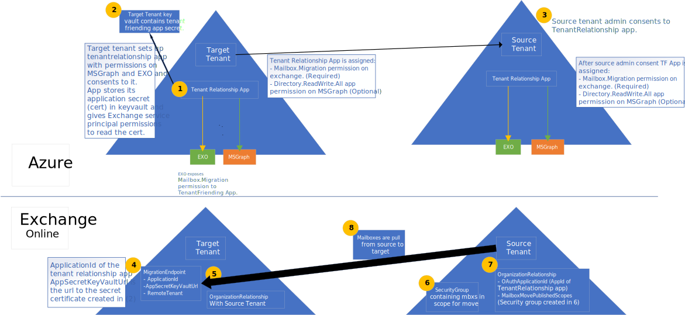

# <a name="cross-tenant-mailbox-migration-preview"></a><span data-ttu-id="3c625-103">テナント間のメールボックスの移行 (プレビュー)</span><span class="sxs-lookup"><span data-stu-id="3c625-103">Cross-tenant mailbox migration (preview)</span></span>

<span data-ttu-id="3c625-104">以前は、Exchange Online テナントが同じ Exchange Online サービスの別のテナントにメールボックスを移動する必要がある場合、それらを完全にオンプレミスにして、新しいテナントに移行する必要があります。</span><span class="sxs-lookup"><span data-stu-id="3c625-104">Previously, when an Exchange Online tenant needed to move mailboxes to another tenant in the same Exchange Online service, they would have to completely offboard them to on-premises and then onboard them to a new tenant.</span></span> <span data-ttu-id="3c625-105">新しいクロステナントメールボックス移行機能を使用すると、ソーステナントとターゲットテナントの両方のテナント管理者は、オンプレミスシステムのインフラストラクチャの依存関係を持つテナント間でメールボックスを移動することができます。</span><span class="sxs-lookup"><span data-stu-id="3c625-105">With the new cross-tenant mailbox migration feature, tenant administrators in both source and target tenants can move mailboxes between the tenants with minimal infrastructure dependencies in their on-premises systems.</span></span> <span data-ttu-id="3c625-106">これにより、オフボードおよびオンボードメールボックスに対する必要性がなくなります。</span><span class="sxs-lookup"><span data-stu-id="3c625-106">This removes the need to offboard and onboard mailboxes.</span></span>

<span data-ttu-id="3c625-107">一般に、合併または divestitures では、ユーザーとコンテンツを新しいテナントに移動する機能が必要です。</span><span class="sxs-lookup"><span data-stu-id="3c625-107">Commonly, during mergers or divestitures, you need the ability to move users and content into a new tenant.</span></span> <span data-ttu-id="3c625-108">ターゲットのテナント管理者が移動を実行すると、オンプレミスとクラウドのオンボード移行のようなプル移動と呼ばれます。</span><span class="sxs-lookup"><span data-stu-id="3c625-108">When the target tenant administrator executes the move, it’s called a Pull move, similar to on-premises to cloud onboarding migrations.</span></span>

<span data-ttu-id="3c625-109">テナント間の Exchange メールボックスの移動は、テナント管理者が完全にサービスを提供し、ユーザーを新しい組織に移行するために必要なより大きなワークフローにスクリプト化できる既知のインターフェイスを使用しています。</span><span class="sxs-lookup"><span data-stu-id="3c625-109">Cross-tenant Exchange mailbox moves are fully self-serviced by tenant administrators, using well known interfaces that can be scripted into the larger workflows needed to transition users to their new organization.</span></span> <span data-ttu-id="3c625-110">管理者は、 `New-MigrationBatch` Move メールボックス管理役割で使用可能なコマンドレットを使用して、テナント間の移動を実行できます。</span><span class="sxs-lookup"><span data-stu-id="3c625-110">Administrators can use the `New-MigrationBatch` cmdlet, available through the Move Mailboxes management role, to execute cross-tenant moves.</span></span> <span data-ttu-id="3c625-111">移動プロセスには、メールボックスの同期および終了の際にテナントの承認チェックが含まれます。</span><span class="sxs-lookup"><span data-stu-id="3c625-111">The move process includes tenant authorization checks during mailbox synchronization and finalization.</span></span> 
 
<span data-ttu-id="3c625-112">移行するユーザーは、テナントユーザーとしてターゲットテナントの Exchange Online システムに存在する必要があります。これは、テナント間の移動を有効にするために特定の属性でマークされています。</span><span class="sxs-lookup"><span data-stu-id="3c625-112">Users migrating must be present in the target tenant Exchange Online system as MailUsers, marked with specific attributes to enable the cross-tenant moves.</span></span> <span data-ttu-id="3c625-113">ターゲットテナントに正しく設定されていないユーザーの場合、システムは移動に失敗します。</span><span class="sxs-lookup"><span data-stu-id="3c625-113">The system will fail moves for users that are not properly set up in the target tenant.</span></span> 

<span data-ttu-id="3c625-114">移動が完了すると、移行元システムのメールボックスは MailUser に変換され、targetAddress (Exchange の ExternalEmailAddress として表示される) には、ルーティングアドレスが宛先のテナントにスタンプされます。</span><span class="sxs-lookup"><span data-stu-id="3c625-114">When the moves are complete, the source system mailbox is converted to MailUser and the targetAddress (shown as ExternalEmailAddress in Exchange) is stamped with the routing address to the destination tenant.</span></span> <span data-ttu-id="3c625-115">このプロセスでは、従来の MailUser をソーステナントに残して、共存とメールルーティングの期間を可能にします。</span><span class="sxs-lookup"><span data-stu-id="3c625-115">This process leaves the legacy MailUser in the source tenant, and allows for a period of co-existence and mail routing.</span></span> <span data-ttu-id="3c625-116">ビジネスプロセスが許可されている場合、ソーステナントは移動元の MailUser を削除するか、メール連絡先に変換することができます。</span><span class="sxs-lookup"><span data-stu-id="3c625-116">When business processes allow, the source tenant may remove the source MailUser or convert them to a mail contact.</span></span> 

<span data-ttu-id="3c625-117">テナント間の Exchange メールボックスの移行は、ハイブリッドまたはクラウドのみのテナント、またはその2つの組み合わせでサポートされています。</span><span class="sxs-lookup"><span data-stu-id="3c625-117">Cross-tenant Exchange mailbox migrations are supported for tenants in hybrid or cloud only, or any combination of the two.</span></span>

<span data-ttu-id="3c625-118">この記事では、テナント間でのメールボックスの移動のプロセスについて説明し、コンテンツの移動用にソースおよびターゲットテナントを準備する方法についてのガイダンスを提供します。</span><span class="sxs-lookup"><span data-stu-id="3c625-118">This article describes the process for cross-tenant mailbox moves and provides guidance on how to prepare source and target tenants for the content move.</span></span> 

## <a name="preparing-source-and-target-tenants"></a><span data-ttu-id="3c625-119">ソースおよびターゲットテナントの準備</span><span class="sxs-lookup"><span data-stu-id="3c625-119">Preparing source and target tenants</span></span>

<span data-ttu-id="3c625-120">テナント間の Exchange メールボックスの移行機能には、テナント間の移行の承認とスコープが必要です。</span><span class="sxs-lookup"><span data-stu-id="3c625-120">The Cross-tenant Exchange mailbox migration feature requires authorization and scoping for cross-tenant migrations.</span></span> <span data-ttu-id="3c625-121">Azure エンタープライズアプリケーションとキーヴォールトストレージソリューションを使用すると、テナント管理者は、1つのテナントから別のテナントへの Exchange Online メールボックスの移行の承認およびスコープの管理を行うことができるようになります。</span><span class="sxs-lookup"><span data-stu-id="3c625-121">Using the Azure Enterprise application and Key Vault storage solutions, tenant admins are now empowered to manage both authorization and scoping of Exchange Online mailbox migrations from one tenant to another.</span></span> <span data-ttu-id="3c625-122">テナント間のメールボックスの移動は、招待と同意モデルをサポートして、テナントのペア間の認証に使用される Azure Active Directory (Azure AD) アプリケーションを確立します。</span><span class="sxs-lookup"><span data-stu-id="3c625-122">Cross-tenant mailbox moves supports an invitation and consent model to establish an Azure Active Directory (Azure AD) application used for authentication between a tenant pair.</span></span> <span data-ttu-id="3c625-123">組織上の関係や移行エンドポイントなど、追加のコンポーネントも必要です。</span><span class="sxs-lookup"><span data-stu-id="3c625-123">Additional components such as an organization relationship and a migration endpoint are also required.</span></span>

<span data-ttu-id="3c625-124">このセクションには、ターゲットディレクトリで MailUser ユーザーオブジェクトを準備するために必要な特定の手順は含まれません。また、移行バッチを送信するためのサンプルコマンドも含まれていません。</span><span class="sxs-lookup"><span data-stu-id="3c625-124">This section does not include the specific steps required to prepare the MailUser user objects in the target directory, nor does it include the sample command to submit a migration batch.</span></span> <span data-ttu-id="3c625-125">この情報については、「 [移行先ユーザーオブジェクトの移行を準備する](#prepare-target-user-objects-for-migration) 」を参照してください。</span><span class="sxs-lookup"><span data-stu-id="3c625-125">Please see [Prepare target user objects for migration](#prepare-target-user-objects-for-migration) for this information.</span></span>

## <a name="prerequisites"></a><span data-ttu-id="3c625-126">前提条件</span><span class="sxs-lookup"><span data-stu-id="3c625-126">Prerequisites</span></span>

<span data-ttu-id="3c625-127">テナント間のメールボックス移動機能では、テナント間でのメールボックスの移行を認証および承認するために使用される証明書とシークレットに安全に格納してアクセスするために、 [Azure Key Vault](https://docs.microsoft.com/azure/key-vault/basic-concepts) が必要になります。</span><span class="sxs-lookup"><span data-stu-id="3c625-127">The cross-tenant mailbox move feature requires [Azure Key Vault](https://docs.microsoft.com/azure/key-vault/basic-concepts) to establish a tenant pair-specific Azure application to securely store and access the certificate/secret used to authenticate and authorize mailbox migration from one tenant to the other, removing any requirements to share certificates/secrets between tenants.</span></span> 

<span data-ttu-id="3c625-128">開始する前に、Azure Key Vault、Move Mailbox application、EXO Migration Endpoint、および EXO 組織上の関係を構成するために、展開スクリプトを実行するために必要なアクセス許可があることを確認してください。</span><span class="sxs-lookup"><span data-stu-id="3c625-128">Before starting, be sure you have the necessary permissions to run the deployment scripts in order to configure Azure Key Vault, Move Mailbox application, EXO Migration Endpoint, and the EXO Organization Relationship.</span></span> <span data-ttu-id="3c625-129">通常、グローバル管理者には、すべての構成手順を実行する権限があります。</span><span class="sxs-lookup"><span data-stu-id="3c625-129">Typically, Global Admin has permission to perform all configuration steps.</span></span>

<span data-ttu-id="3c625-130">さらに、セットアップを実行する前に、ソーステナント内のメールが有効なセキュリティグループが必要です。</span><span class="sxs-lookup"><span data-stu-id="3c625-130">Additionally, mail-enabled security groups in the source tenant are required prior to running setup.</span></span> <span data-ttu-id="3c625-131">これらのグループは、ソース (またはリソースとも呼ばれる) テナントからターゲットテナントに移動できるメールボックスの一覧のスコープに使用されます。</span><span class="sxs-lookup"><span data-stu-id="3c625-131">These groups are used to scope the list of mailboxes that can move from source (or sometimes referred to as resource) tenant to the target tenant.</span></span> <span data-ttu-id="3c625-132">これにより、移動する必要のある特定のメールボックスのセットをソーステナント管理者が制限または範囲設定でき、意図しないユーザーが移行されるのを防ぐことができます。</span><span class="sxs-lookup"><span data-stu-id="3c625-132">This allows the source tenant admin to restrict or scope the specific set of mailboxes that need to be moved, preventing unintended users from being migrated.</span></span> <span data-ttu-id="3c625-133">ネストされたグループはサポートされていません。</span><span class="sxs-lookup"><span data-stu-id="3c625-133">Nested groups are not supported.</span></span>

<span data-ttu-id="3c625-134">また、(メールボックスを移動する相手となる) 信頼できるパートナー企業と連絡して、Microsoft 365 テナント ID を入手する必要があります。</span><span class="sxs-lookup"><span data-stu-id="3c625-134">You will also need to communicate with your trusted partner company (with whom you will be moving mailboxes) to obtain their Microsoft 365 tenant ID.</span></span> <span data-ttu-id="3c625-135">このテナント ID は、組織の関係フィールドで使用され `DomainName` ます。</span><span class="sxs-lookup"><span data-stu-id="3c625-135">This tenant ID is used in the Organization Relationship `DomainName` field.</span></span>

<span data-ttu-id="3c625-136">サブスクリプションのテナント ID を取得するには、Microsoft 365 管理センターにサインインして、に移動し [https://aad.portal.azure.com/#blade/Microsoft_AAD_IAM/ActiveDirectoryMenuBlade/Properties](https://aad.portal.azure.com/#blade/Microsoft_AAD_IAM/ActiveDirectoryMenuBlade/Properties) ます。</span><span class="sxs-lookup"><span data-stu-id="3c625-136">To obtain the tenant ID of a subscription, sign-in to the Microsoft 365 admin center and go to [https://aad.portal.azure.com/#blade/Microsoft_AAD_IAM/ActiveDirectoryMenuBlade/Properties](https://aad.portal.azure.com/#blade/Microsoft_AAD_IAM/ActiveDirectoryMenuBlade/Properties).</span></span> <span data-ttu-id="3c625-137">テナント ID プロパティの [コピー] アイコンをクリックして、クリップボードにコピーします。</span><span class="sxs-lookup"><span data-stu-id="3c625-137">Click the copy icon for the Tenant ID property to copy it to the clipboard.</span></span>

<span data-ttu-id="3c625-138">プロセスのしくみを次に示します。</span><span class="sxs-lookup"><span data-stu-id="3c625-138">Here is how the process works.</span></span>

:::image type="content" source="../media/tenant-to-tenant-mailbox-move/prepare-tenants-flow.svg" alt-text="メールボックスの移行のテナントの準備。":::

<!--
[](https://github.com/MicrosoftDocs/microsoft-365-docs/raw/public/microsoft-365/media/tenant-to-tenant-mailbox-move/prepare-tenants-flow.svg)

[See a larger version of this image](https://github.com/MicrosoftDocs/microsoft-365-docs/raw/public/microsoft-365/media/tenant-to-tenant-mailbox-move/prepare-tenants-flow.svg).
--> 

### <a name="prepare-tenants"></a><span data-ttu-id="3c625-140">テナントの準備</span><span class="sxs-lookup"><span data-stu-id="3c625-140">Prepare tenants</span></span>

<span data-ttu-id="3c625-141">高レベルでは、セットアップスクリプトを実行するときに、次の構成操作が行われます。</span><span class="sxs-lookup"><span data-stu-id="3c625-141">At a high level, the following configuration actions take place when executing the setup scripts.</span></span>

<span data-ttu-id="3c625-142">ターゲットテナントを準備します。</span><span class="sxs-lookup"><span data-stu-id="3c625-142">Prepare the target tenant:</span></span>

1. <span data-ttu-id="3c625-143">既存の Azure リソースグループが指定されていない場合は、新しいものが作成されます (スクリプト)。</span><span class="sxs-lookup"><span data-stu-id="3c625-143">If an existing Azure Resource Group is not provided, a new one is created (SCRIPT).</span></span>
2. <span data-ttu-id="3c625-144">既存のキーボルトが指定されていない場合は、新しいコンテナーが作成されます (スクリプト)。</span><span class="sxs-lookup"><span data-stu-id="3c625-144">If an existing Key Vault is not provided, a new one is created (SCRIPT).</span></span>
3. <span data-ttu-id="3c625-145">Office 365 Exchange Online メールボックス移行アプリケーション (スクリプト) 用の新しいアクセスポリシーが作成されます。</span><span class="sxs-lookup"><span data-stu-id="3c625-145">A new Access Policy is created for the Office 365 Exchange Online Mailbox Migration application (SCRIPT).</span></span>
4. <span data-ttu-id="3c625-146">移行アプリケーション (スクリプト) に対するシークレットを保持するために、新しい証明書が作成されます (指定されている場合は、既存の証明書がある場合)。</span><span class="sxs-lookup"><span data-stu-id="3c625-146">A new certificate is created (or existing one, if specified) to hold the secret to the Migration application (SCRIPT).</span></span>
5. <span data-ttu-id="3c625-147">新しい Azure AD アプリケーションが作成されます (スクリプト)。</span><span class="sxs-lookup"><span data-stu-id="3c625-147">A new Azure AD application is created (SCRIPT).</span></span>
6. <span data-ttu-id="3c625-148">証明書/シークレットは、移行アプリケーション (スクリプト) にアップロードされます。</span><span class="sxs-lookup"><span data-stu-id="3c625-148">The certificate/secret is uploaded to the migration application (SCRIPT).</span></span>
7. <span data-ttu-id="3c625-149">メールボックスの移行アクセス許可は、アプリケーション (スクリプト) に割り当てられます。</span><span class="sxs-lookup"><span data-stu-id="3c625-149">Mailbox migration permissions are assigned to the application (SCRIPT).</span></span>
8. <span data-ttu-id="3c625-150">展開スクリプトは、ターゲットの管理者が自身のアプリケーション (スクリプト) を同意するまで停止します。</span><span class="sxs-lookup"><span data-stu-id="3c625-150">The deployment script pauses until target admin consents to their own application (SCRIPT).</span></span>
9. <span data-ttu-id="3c625-151">ターゲットのテナント管理者は、アプリケーションに与えられたアクセス許可 (手動) に同意します。</span><span class="sxs-lookup"><span data-stu-id="3c625-151">The target tenant admin consents to the permissions given to the application (MANUAL).</span></span>
10. <span data-ttu-id="3c625-152">ターゲットテナント (スクリプト) に対して組織上の関係が作成されます。</span><span class="sxs-lookup"><span data-stu-id="3c625-152">An organization relationship is created to the target tenant (SCRIPT).</span></span>
11. <span data-ttu-id="3c625-153">移行エンドポイントが作成され、メールボックスがターゲットテナント (スクリプト) にプルされます。</span><span class="sxs-lookup"><span data-stu-id="3c625-153">A migration endpoint is created to pull mailboxes to the target tenant (SCRIPT).</span></span>

<span data-ttu-id="3c625-154">ソーステナントを準備します。</span><span class="sxs-lookup"><span data-stu-id="3c625-154">Prepare the source tenant:</span></span>

1. <span data-ttu-id="3c625-155">ソーステナント管理者は、ターゲットテナント (手動) からメールボックス移行アプリケーションへの招待に対する同意を受け入れます。</span><span class="sxs-lookup"><span data-stu-id="3c625-155">The source tenant admin accepts consent to Mailbox Migration application invitation from the Target tenant (MANUAL).</span></span>
2. <span data-ttu-id="3c625-156">移行元のテナント管理者は、テナント内にメールが有効なセキュリティグループを作成して、移行アプリケーションによる移動が許可されたメールボックスのリストを格納します (手動)。</span><span class="sxs-lookup"><span data-stu-id="3c625-156">The source tenant admin creates a mail-enabled security group in their tenant to contain the list of mailboxes allowed to be moved by the migration application (MANUAL).</span></span>
3. <span data-ttu-id="3c625-157">メールボックス移行アプリケーションを指定するターゲットテナントに対して組織上の関係が作成され、移動要求 (スクリプト) を受け入れるために、OAuth の検証に使用する必要があります。</span><span class="sxs-lookup"><span data-stu-id="3c625-157">An organization relationship is created to the target tenant specifying the mailbox migration application should be used for OAuth verification to accept the move request (SCRIPT).</span></span>

#### <a name="step-by-step-instructions-for-the-target-tenant-admin"></a><span data-ttu-id="3c625-158">ターゲットテナント管理者のためのステップごとの手順</span><span class="sxs-lookup"><span data-stu-id="3c625-158">Step-by-step instructions for the target tenant admin</span></span>

1. <span data-ttu-id="3c625-159">[GitHub リポジトリ](https://github.com/microsoft/cross-tenant/releases/tag/Preview)からターゲットテナントのセットアップの SetupCrossTenantRelationshipForTargetTenant.ps1 スクリプトをダウンロードします。</span><span class="sxs-lookup"><span data-stu-id="3c625-159">Download the SetupCrossTenantRelationshipForTargetTenant.ps1 script for the target tenant setup from the [GitHub repository](https://github.com/microsoft/cross-tenant/releases/tag/Preview).</span></span> 
2. <span data-ttu-id="3c625-160">スクリプトを実行するコンピューターにスクリプト (SetupCrossTenantRelationshipForTargetTenant.ps1) を保存します。</span><span class="sxs-lookup"><span data-stu-id="3c625-160">Save the script (SetupCrossTenantRelationshipForTargetTenant.ps1) to the computer from which you will be executing the script.</span></span>
3. <span data-ttu-id="3c625-161">Exchange Online ターゲットテナントへのリモート PowerShell 接続を作成します。</span><span class="sxs-lookup"><span data-stu-id="3c625-161">Create a Remote PowerShell connection to the Exchange Online target tenant.</span></span> <span data-ttu-id="3c625-162">この場合も、Azure Key Vault storage and certificate、Move Mailbox application、EXO Migration Endpoint、および EXO 組織の関係を構成するために、展開スクリプトを実行するために必要なアクセス許可があることを確認してください。</span><span class="sxs-lookup"><span data-stu-id="3c625-162">Again, make sure you have the necessary permissions to run the deployment scripts in order to configure the Azure Key Vault storage and certificate, Move Mailbox application, EXO Migration Endpoint, and the EXO Organization Relationship.</span></span>
4. <span data-ttu-id="3c625-163">ファイルフォルダーディレクトリをスクリプトの場所に変更するか、現在リモート PowerShell セッションにある場所にスクリプトが保存されていることを確認します。</span><span class="sxs-lookup"><span data-stu-id="3c625-163">Change the file folder directory to the script location or verify the script is currently saved to the location currently in your Remote PowerShell session.</span></span>
5. <span data-ttu-id="3c625-164">次のパラメーターと値を使用して、スクリプトを実行します。</span><span class="sxs-lookup"><span data-stu-id="3c625-164">Run the script with the following parameters and values.</span></span>

    | <span data-ttu-id="3c625-165">パラメーター</span><span class="sxs-lookup"><span data-stu-id="3c625-165">Parameter</span></span> | <span data-ttu-id="3c625-166">値</span><span class="sxs-lookup"><span data-stu-id="3c625-166">Value</span></span> | <span data-ttu-id="3c625-167">必須またはオプション</span><span class="sxs-lookup"><span data-stu-id="3c625-167">Required or Optional</span></span>
    |---------------------------------------------|-----------------|--------------|
    | <span data-ttu-id="3c625-168">-ResourceTenantDomain</span><span class="sxs-lookup"><span data-stu-id="3c625-168">-ResourceTenantDomain</span></span>                       | <span data-ttu-id="3c625-169">ソーステナントドメイン (fabrikam onmicrosoft.com など) \. 。</span><span class="sxs-lookup"><span data-stu-id="3c625-169">Source tenant domain, such as fabrikam\.onmicrosoft.com.</span></span> | <span data-ttu-id="3c625-170">必須</span><span class="sxs-lookup"><span data-stu-id="3c625-170">Required</span></span> |
    | <span data-ttu-id="3c625-171">-ResourceTenantAdminEmail</span><span class="sxs-lookup"><span data-stu-id="3c625-171">-ResourceTenantAdminEmail</span></span>                   | <span data-ttu-id="3c625-172">送信元テナント管理者の電子メールアドレス。</span><span class="sxs-lookup"><span data-stu-id="3c625-172">Source tenant admin’s email address.</span></span> <span data-ttu-id="3c625-173">これは、ターゲット管理者から送信されたメールボックス移行アプリケーションの使用に同意するソーステナント管理者です。これは、アプリケーションの電子メールの招待を受信する管理者です。</span><span class="sxs-lookup"><span data-stu-id="3c625-173">This is the source tenant admin who will be consenting to the use of the mailbox migration application sent from the target admin. This is the admin who will receive the email invite for the application.</span></span> | <span data-ttu-id="3c625-174">必須</span><span class="sxs-lookup"><span data-stu-id="3c625-174">Required</span></span> |
    | <span data-ttu-id="3c625-175">-TargetTenantDomain</span><span class="sxs-lookup"><span data-stu-id="3c625-175">-TargetTenantDomain</span></span>                         | <span data-ttu-id="3c625-176">宛先のテナントドメイン (contoso onmicrosoft.com など) \. 。</span><span class="sxs-lookup"><span data-stu-id="3c625-176">Target tenant domain, such as contoso\.onmicrosoft.com.</span></span> | <span data-ttu-id="3c625-177">必須</span><span class="sxs-lookup"><span data-stu-id="3c625-177">Required</span></span> |
    | <span data-ttu-id="3c625-178">-ResourceTenantId</span><span class="sxs-lookup"><span data-stu-id="3c625-178">-ResourceTenantId</span></span>                           | <span data-ttu-id="3c625-179">送信元テナントの組織 ID (GUID)。</span><span class="sxs-lookup"><span data-stu-id="3c625-179">Source tenant organization ID (GUID).</span></span> | <span data-ttu-id="3c625-180">必須</span><span class="sxs-lookup"><span data-stu-id="3c625-180">Required</span></span> |
    | <span data-ttu-id="3c625-181">-SubscriptionId</span><span class="sxs-lookup"><span data-stu-id="3c625-181">-SubscriptionId</span></span>                             | <span data-ttu-id="3c625-182">リソースの作成に使用する Azure サブスクリプション。</span><span class="sxs-lookup"><span data-stu-id="3c625-182">The Azure subscription to use for creating resources.</span></span> | <span data-ttu-id="3c625-183">必須</span><span class="sxs-lookup"><span data-stu-id="3c625-183">Required</span></span> |
    | <span data-ttu-id="3c625-184">-ResourceGroup</span><span class="sxs-lookup"><span data-stu-id="3c625-184">-ResourceGroup</span></span>                              | <span data-ttu-id="3c625-185">キーのコンテナーを含む、または含む Azure リソースグループの名前。</span><span class="sxs-lookup"><span data-stu-id="3c625-185">Azure resource group name that contains or will contain the Key Vault.</span></span> | <span data-ttu-id="3c625-186">必須</span><span class="sxs-lookup"><span data-stu-id="3c625-186">Required</span></span> |
    | <span data-ttu-id="3c625-187">-KeyVaultName</span><span class="sxs-lookup"><span data-stu-id="3c625-187">-KeyVaultName</span></span>                               | <span data-ttu-id="3c625-188">メールボックス移行アプリケーション証明書/シークレットを格納する Azure Key Vault インスタンス。</span><span class="sxs-lookup"><span data-stu-id="3c625-188">Azure Key Vault instance that will store your mailbox migration application certificate/secret.</span></span> | <span data-ttu-id="3c625-189">必須</span><span class="sxs-lookup"><span data-stu-id="3c625-189">Required</span></span> |
    | <span data-ttu-id="3c625-190">-任意の Ename</span><span class="sxs-lookup"><span data-stu-id="3c625-190">-CertificateName</span></span>                            | <span data-ttu-id="3c625-191">キーコンテナーで証明書を生成または検索するときの証明書の名前。</span><span class="sxs-lookup"><span data-stu-id="3c625-191">Certificate name when generating or searching for certificate in key vault.</span></span> | <span data-ttu-id="3c625-192">必須</span><span class="sxs-lookup"><span data-stu-id="3c625-192">Required</span></span> |
    | <span data-ttu-id="3c625-193">-CertificateSubject</span><span class="sxs-lookup"><span data-stu-id="3c625-193">-CertificateSubject</span></span>                         | <span data-ttu-id="3c625-194">Azure Key Vault 証明書のサブジェクト名 (CN = contoso_fabrikam など)。</span><span class="sxs-lookup"><span data-stu-id="3c625-194">Azure Key Vault certificate subject name, such as CN=contoso_fabrikam.</span></span> | <span data-ttu-id="3c625-195">必須</span><span class="sxs-lookup"><span data-stu-id="3c625-195">Required</span></span> |
    | <span data-ttu-id="3c625-196">-ExistingApplicationId</span><span class="sxs-lookup"><span data-stu-id="3c625-196">-ExistingApplicationId</span></span>                      | <span data-ttu-id="3c625-197">メール移行アプリケーションが既に作成されている場合に使用します。</span><span class="sxs-lookup"><span data-stu-id="3c625-197">Mail migration application to use if one was already created.</span></span> | <span data-ttu-id="3c625-198">省略可能</span><span class="sxs-lookup"><span data-stu-id="3c625-198">Optional</span></span> |
    | <span data-ttu-id="3c625-199">-AzureAppPermissions</span><span class="sxs-lookup"><span data-stu-id="3c625-199">-AzureAppPermissions</span></span>                        | <span data-ttu-id="3c625-200">メールボックス移行アプリケーションに必要なアクセス許可 (Exchange または MSGraph (メールボックスを移動するための Exchange) など)。また、このアプリケーションを使用して、リソーステナントへの同意リンクの招待を送信するための MSGraph を提供します。</span><span class="sxs-lookup"><span data-stu-id="3c625-200">The permissions required to be given to the mailbox migration application, such as Exchange or MSGraph (Exchange for moving mailboxes, MSGraph for using this application to send a consent link invitation to resource tenant).</span></span> | <span data-ttu-id="3c625-201">必須</span><span class="sxs-lookup"><span data-stu-id="3c625-201">Required</span></span> |
    | <span data-ttu-id="3c625-202">-UseAppAndCertGeneratedForSendingInvitation</span><span class="sxs-lookup"><span data-stu-id="3c625-202">-UseAppAndCertGeneratedForSendingInvitation</span></span> | <span data-ttu-id="3c625-203">移行用に作成されたアプリケーションを使用して、ソーステナントの管理者に同意リンクの招待状を送信するために使用するパラメーター。このパラメーターを指定しない場合、Azure に接続するためのターゲット管理者の資格情報を求めるメッセージが表示され、招待を対象の管理者として送信します。</span><span class="sxs-lookup"><span data-stu-id="3c625-203">Parameter for using the application created for migration to be used for sending consent link invitation to source tenant admin. If not present this will prompt for the target admin’s credentials to connect to Azure invitation manager and send the invitation as target admin.</span></span> | <span data-ttu-id="3c625-204">省略可能</span><span class="sxs-lookup"><span data-stu-id="3c625-204">Optional</span></span> |
    | <span data-ttu-id="3c625-205">-KeyVaultAuditStorageAccountName</span><span class="sxs-lookup"><span data-stu-id="3c625-205">-KeyVaultAuditStorageAccountName</span></span>            | <span data-ttu-id="3c625-206">キーヴォールトの監査ログが格納されるストレージアカウント。</span><span class="sxs-lookup"><span data-stu-id="3c625-206">The storage account where Key Vault’s audit logs would be stored.</span></span> | <span data-ttu-id="3c625-207">省略可能</span><span class="sxs-lookup"><span data-stu-id="3c625-207">Optional</span></span> |
    | <span data-ttu-id="3c625-208">-KeyVaultAuditStorageResourceGroup</span><span class="sxs-lookup"><span data-stu-id="3c625-208">-KeyVaultAuditStorageResourceGroup</span></span>          | <span data-ttu-id="3c625-209">キーコンテナーの監査ログを格納するためのストレージアカウントを含むリソースグループ。</span><span class="sxs-lookup"><span data-stu-id="3c625-209">The resource group that contains the storage account for storing Key Vault audit logs.</span></span> | <span data-ttu-id="3c625-210">省略可能</span><span class="sxs-lookup"><span data-stu-id="3c625-210">Optional</span></span> |
    ||||

6. <span data-ttu-id="3c625-211">このスクリプトは一時停止して、このプロセス中に作成された Exchange メールボックス移行アプリケーションを受け入れるか、または同意するように求められます。</span><span class="sxs-lookup"><span data-stu-id="3c625-211">The script will pause and ask you to accept or consent to the Exchange mailbox migration application that was created during this process.</span></span> <span data-ttu-id="3c625-212">次に例を示します。</span><span class="sxs-lookup"><span data-stu-id="3c625-212">Here is an example.</span></span>

    ```powershell
    PS C:\Users\Admin\scripts\T2TMovesV2> .\SetupCrossTenantRelationshipForTargetTenant.ps1 -ResourceTenantDomain contoso.onmicrosoft.com -ResourceTenantAdminEmail admin@contoso.onmicrosoft.com -TargetTenantDomain fabrikam.onmicrosoft.com -ResourceTenantId ksagjid39-ede2-4d2c-98ae-874709325b00 -SubscriptionId e4ssd05d-a327-49ss-849a-sd0932439023 -ResourceGroup "Cross-TenantMoves" -KeyVaultName "Cross-TenantMovesVault" -CertificateName "Contoso-Fabrikam-cert" -CertificateSubject "CN=Contoso_Fabrikam" -AzureAppPermissions Exchange, MSGraph -UseAppAndCertGeneratedForSendingInvitation -KeyVaultAuditStorageAccountName "t2tstorageaccount" -KeyVaultAuditStorageResourceGroup "Demo"

    cmdlet Get-Credential at command pipeline position 1
    Supply values for the following parameters:
    Credential
    Setting up key vault in the fabrikam.onmicrosoft.com tenant

    Name                                     Account                                 SubscriptionName                        Environment                             TenantId
        ----                                     -------                                 ----------------                        -----------                             --------
    Pay-As-You-Go (ewe23423-a3327-34232-343... Admin@fabrikam... Pay-As-You-Go                           AzureCloud                              dsad938432-dd8e-s9034-bf9a-83984293n43
    Auditing setup successfully for Cross-TenantMovesVault
    Exchange application given access to KeyVault Cross-TenantMovesVault
    Application fabrikam_Friends_contoso_2520 created successfully in fabrikam.onmicrosoft.com tenant with following permissions. MSGraph - Directory.ReadWrite.All. Exchange - Mailbox.Migration
    Admin consent URI for fabrikam.onmicrosoft.com tenant admin is -
    https://login.microsoftonline.com/fabrikam.onmicrosoft.com/adminconsent?client_id=6fea6ere-0dwe-404d-ad35-c71a15cers5c&redirect_uri=https://office.com
    Admin consent URI for contoso.onmicrosoft.com tenant admin is -
    https://login.microsoftonline.com/contoso.onmicrosoft.com/adminconsent?client_id=6fea6ssd-0753-404d-wer5-c71a154d675c&redirect_uri=https://office.com
    Application details to be registered in organization relationship: ApplicationId: [ 6fes8en4-sjo3-406d-ad35-sldkfjiew993 ]. KeyVault secret Id: [ https://cross-tenantmovesvault.vault.azure.net:443/certificates/Contoso-Fabrikam-cert/ksdfj843nt8476h84c288c5a3fb8ec5fdb08 ]. These values are available in variables $AppId and $CertificateId respectively
    Please consent to the application for fabrikam.onmicrosoft.com before sending invitation to admin@contoso.onmicrosoft.com:
    ``` 

7. <span data-ttu-id="3c625-213">URL がリモート PowerShell セッションに表示されます。</span><span class="sxs-lookup"><span data-stu-id="3c625-213">A URL will be displayed in the Remote PowerShell session.</span></span> <span data-ttu-id="3c625-214">テナントの同意のために提供されたリンクをコピーして、Web ブラウザーに貼り付けます。</span><span class="sxs-lookup"><span data-stu-id="3c625-214">Copy the link provided for your tenant consent and paste it into a Web browser.</span></span>

8. <span data-ttu-id="3c625-215">グローバル管理者の資格情報を使用してサインインします。</span><span class="sxs-lookup"><span data-stu-id="3c625-215">Sign in with your Global Admin credentials.</span></span> <span data-ttu-id="3c625-216">次の画面が表示されたら、[ **同意**する] を選択します。</span><span class="sxs-lookup"><span data-stu-id="3c625-216">When the following screen is presented, select **Accept**.</span></span>

    :::image type="content" source="../media/tenant-to-tenant-mailbox-move/permissions-requested-dialog.png" alt-text="[アクセス許可の承諾] ダイアログボックス":::
    
9. <span data-ttu-id="3c625-218">リモート PowerShell セッションに戻り、Enter キーを押して続行します。</span><span class="sxs-lookup"><span data-stu-id="3c625-218">Switch back to the Remote PowerShell session and hit Enter to proceed.</span></span>

10. <span data-ttu-id="3c625-219">スクリプトは、残りのセットアップオブジェクトを構成します。</span><span class="sxs-lookup"><span data-stu-id="3c625-219">The script will configure the remaining setup objects.</span></span> <span data-ttu-id="3c625-220">次に例を示します。</span><span class="sxs-lookup"><span data-stu-id="3c625-220">Here is an example.</span></span>

    ```powershell
    Successfully sent invitation to admin@contoso.onmicrosoft.com
    Setting up exchange components on target tenant: fabrikam.onmicrosoft.com
    MigrationEndpoint created in fabrikam.onmicrosoft.com for target contoso.onmicrosoft.com
    Exchange setup complete. Migration endpoint details are available in $MigrationEndpoint variable
    ```

<span data-ttu-id="3c625-221">これで、ターゲットの管理者セットアップが完了しました。</span><span class="sxs-lookup"><span data-stu-id="3c625-221">The target admin setup is now complete!</span></span>

#### <a name="step-by-step-instructions-for-the-source-tenant-admin"></a><span data-ttu-id="3c625-222">ソーステナント管理者のためのステップごとの手順</span><span class="sxs-lookup"><span data-stu-id="3c625-222">Step-by-step instructions for the source tenant admin</span></span>

1.  <span data-ttu-id="3c625-223">セットアップ時に、ターゲット管理者によって指定された ResourceTenantAdminEmail として、メールボックスにサインインします。</span><span class="sxs-lookup"><span data-stu-id="3c625-223">Sign in to your mailbox as the -ResourceTenantAdminEmail specified by the target admin during their setup.</span></span> <span data-ttu-id="3c625-224">ターゲットテナントから電子メール招待状を検索し、[ **開始** ] ボタンを選択します。</span><span class="sxs-lookup"><span data-stu-id="3c625-224">Find the email invitation from the target tenant, and then select the **Get Started** button.</span></span>

    :::image type="content" source="../media/tenant-to-tenant-mailbox-move/invited-by-target-tenant.png" alt-text="Invided のダイアログボックスが表示されます。":::

2. <span data-ttu-id="3c625-226">[ **承諾** ] を選択して招待状を承諾します。</span><span class="sxs-lookup"><span data-stu-id="3c625-226">Select **Accept** to accept the invitation.</span></span>

    :::image type="content" source="../media/tenant-to-tenant-mailbox-move/permissions-requested-accept.png" alt-text="Permissons を受け入れるためのダイアログボックス":::

   > [!NOTE]
   > <span data-ttu-id="3c625-228">このメールを受信できない場合、または見つからない場合は、ターゲットテナント管理者に対して、招待を受け入れるために付与される直接 URL が提供されています。</span><span class="sxs-lookup"><span data-stu-id="3c625-228">If you do not get this email or cannot find it, the target tenant admin was provided a direct URL that can be given to you to accept the invitation.</span></span> <span data-ttu-id="3c625-229">URL は、ターゲットテナント管理者のリモート PowerShell セッションの「トランスクリプト」に記載されている必要があります。</span><span class="sxs-lookup"><span data-stu-id="3c625-229">The URL should in the in the transcript of the target tenant admin's Remote PowerShell session.</span></span>

3. <span data-ttu-id="3c625-230">Microsoft 365 管理センターまたはリモート PowerShell セッションのいずれかで、1つまたは複数のメールが有効なセキュリティグループを作成して、移動元のテナントからターゲットテナントにプル (移動) する目的のテナントによって許可されるメールボックスの一覧を制御します。</span><span class="sxs-lookup"><span data-stu-id="3c625-230">In either the Microsoft 365 admin center or a Remote PowerShell session, create one or more mail-enabled security groups to control the list of mailboxes allowed by the target tenant to pull (move) from the source tenant to the target tenant.</span></span> <span data-ttu-id="3c625-231">このグループを事前に設定する必要はありませんが、セットアップ手順 (スクリプト) を実行するには、少なくとも1つのグループを指定する必要があります。</span><span class="sxs-lookup"><span data-stu-id="3c625-231">You do not need to populate this group in advance, but at least one group must be provided to run the setup steps (script).</span></span> <span data-ttu-id="3c625-232">グループのネストはサポートされていません。</span><span class="sxs-lookup"><span data-stu-id="3c625-232">Nest groups are not supported.</span></span> 

4. <span data-ttu-id="3c625-233">[ここで](https://github.com/microsoft/cross-tenant/releases/tag/Preview)、GitHub リポジトリからソーステナントのセットアップの SetupCrossTenantRelationshipForTargetResource.ps1 スクリプトをダウンロードします。</span><span class="sxs-lookup"><span data-stu-id="3c625-233">Download the SetupCrossTenantRelationshipForTargetResource.ps1 script for the source tenant setup from the GitHub repository [here](https://github.com/microsoft/cross-tenant/releases/tag/Preview).</span></span> 

5. <span data-ttu-id="3c625-234">Exchange 管理者のアクセス許可を使用して、ソーステナントへのリモート PowerShell 接続を作成します。</span><span class="sxs-lookup"><span data-stu-id="3c625-234">Create a Remote PowerShell connection to the source tenant with your Exchange Administrator permissions.</span></span> <span data-ttu-id="3c625-235">グローバル管理者のアクセス許可は、ソーステナントのみを構成する必要はありません。これは、Azure アプリケーションの作成プロセスのためです。</span><span class="sxs-lookup"><span data-stu-id="3c625-235">Global Admin permissions are not required to configure the source tenant, only the target tenant because of the Azure application creation process.</span></span>

6. <span data-ttu-id="3c625-236">ディレクトリをスクリプトの場所に変更するか、現在リモート PowerShell セッションにある場所にスクリプトが保存されていることを確認してください。</span><span class="sxs-lookup"><span data-stu-id="3c625-236">Change directory to the script location or verify that the script is currently saved to the location currently in your Remote PowerShell session.</span></span>

7. <span data-ttu-id="3c625-237">次の必要なパラメーターと値を使用して、スクリプトを実行します。</span><span class="sxs-lookup"><span data-stu-id="3c625-237">Run the script with the following required parameters and values.</span></span>

    | <span data-ttu-id="3c625-238">パラメーター</span><span class="sxs-lookup"><span data-stu-id="3c625-238">Parameter</span></span> | <span data-ttu-id="3c625-239">値</span><span class="sxs-lookup"><span data-stu-id="3c625-239">Value</span></span> |
    |-----|------|
    | <span data-ttu-id="3c625-240">-SourceMailboxMovePublishedScopes</span><span class="sxs-lookup"><span data-stu-id="3c625-240">-SourceMailboxMovePublishedScopes</span></span> | <span data-ttu-id="3c625-241">移行の対象となる id またはメールボックスのソーステナントによって作成された、メールが有効なセキュリティグループ。</span><span class="sxs-lookup"><span data-stu-id="3c625-241">Mail-enabled security group created by source tenant for the identities/mailboxes that are in scope for migration.</span></span> |
    | <span data-ttu-id="3c625-242">-ResourceTenantDomain</span><span class="sxs-lookup"><span data-stu-id="3c625-242">-ResourceTenantDomain</span></span> | <span data-ttu-id="3c625-243">ソーステナントのドメイン名 (fabrikam onmicrosoft.com など) \. 。</span><span class="sxs-lookup"><span data-stu-id="3c625-243">Source tenant domain name, such as fabrikam\.onmicrosoft.com.</span></span> |
    | <span data-ttu-id="3c625-244">-TargetTenantDomain</span><span class="sxs-lookup"><span data-stu-id="3c625-244">-TargetTenantDomain</span></span> | <span data-ttu-id="3c625-245">宛先のテナントのドメイン名 (contoso \. onmicrosoft.com など)。</span><span class="sxs-lookup"><span data-stu-id="3c625-245">Target tenant domain name, such as contoso\.onmicrosoft.com.</span></span> |
    | <span data-ttu-id="3c625-246">-ApplicationId</span><span class="sxs-lookup"><span data-stu-id="3c625-246">-ApplicationId</span></span> | <span data-ttu-id="3c625-247">移行に使用するアプリケーションの Azure アプリケーション ID (GUID)。</span><span class="sxs-lookup"><span data-stu-id="3c625-247">Azure application ID (GUID) of the application used for migration.</span></span> <span data-ttu-id="3c625-248">Azure ポータル (Azure AD、エンタープライズアプリケーション、アプリ名、アプリケーション ID) 経由で利用可能なアプリケーション ID。または、招待メールに含まれています。</span><span class="sxs-lookup"><span data-stu-id="3c625-248">Application ID available via your Azure portal (Azure AD, Enterprise Applications, app name, application ID) or included in your invitation email.</span></span>  |
    | <span data-ttu-id="3c625-249">-TargetTenantId</span><span class="sxs-lookup"><span data-stu-id="3c625-249">-TargetTenantId</span></span> | <span data-ttu-id="3c625-250">ターゲットテナントのテナント ID。</span><span class="sxs-lookup"><span data-stu-id="3c625-250">Tenant ID of the target tenant.</span></span> <span data-ttu-id="3c625-251">たとえば、contoso onmicrosoft.com テナントの Azure AD テナント ID \. 。</span><span class="sxs-lookup"><span data-stu-id="3c625-251">For example, the Azure AD tenant ID of contoso\.onmicrosoft.com tenant.</span></span> |
    |||
    
    <span data-ttu-id="3c625-252">次に例を示します。</span><span class="sxs-lookup"><span data-stu-id="3c625-252">Here is an example.</span></span>
    ```powershell
    SetupCrossTenantRelationshipForResourceTenant.ps1 -SourceMailboxMovePublishedScopes "MigScope","MyGroup" -ResourceTenantDomain contoso.onmicrosoft.com -TargetTenantDomain fabrikam.onmicrosoft.com -ApplicationId sdf5e87sa-0753-dd88-ad35-c71a15cs8e44c -TargetTenantId 4sdkfo933-3904-sd93-bf9a-sdi39402834
    Exchange setup complete.

    ```

<span data-ttu-id="3c625-253">これで、ソース管理者のセットアップが完了しました。</span><span class="sxs-lookup"><span data-stu-id="3c625-253">The source admin setup is now complete!</span></span>

### <a name="verify-setup"></a><span data-ttu-id="3c625-254">セットアップを確認する</span><span class="sxs-lookup"><span data-stu-id="3c625-254">Verify setup</span></span>

<span data-ttu-id="3c625-255">ターゲットのソースとターゲットのテナントと移行エンドポイントの組織上の関係が正常に作成されていることを確認します。</span><span class="sxs-lookup"><span data-stu-id="3c625-255">Verify that the organization relationships in both source and target tenants and migration endpoint in the target were created successfully.</span></span>

#### <a name="target-tenant"></a><span data-ttu-id="3c625-256">ターゲットテナント</span><span class="sxs-lookup"><span data-stu-id="3c625-256">Target tenant</span></span>

<span data-ttu-id="3c625-257">**組織の関係**</span><span class="sxs-lookup"><span data-stu-id="3c625-257">**Organization relationship**</span></span>

<span data-ttu-id="3c625-258">このコマンドを使用して、組織の関係オブジェクトが作成され、構成されていることを確認します。</span><span class="sxs-lookup"><span data-stu-id="3c625-258">Verify that the organization relationship object was created and configured with this command.</span></span>

```powershell
Get-OrganizationRelationship <source tenant organization name> | fl name, DomainNames, MailboxMoveEnabled, MailboxMoveCapability
```
<span data-ttu-id="3c625-259">次に例を示します：</span><span class="sxs-lookup"><span data-stu-id="3c625-259">Here is an example:</span></span>

```powershell
PS C:\Users\Admin\scripts\T2TMovesV2> Get-OrganizationRelationship fabrikam_contoso_1178 | fl name, DomainNames, MailboxMoveEnabled, MailboxMoveCapability

Name                  : fabrikam_contoso_1123
DomainNames           : {sd0933me9f-9304-s903-s093-s093mfi903m4}
MailboxMoveEnabled    : True
MailboxMoveCapability : Inbound

```

<span data-ttu-id="3c625-260">**移行エンドポイント**</span><span class="sxs-lookup"><span data-stu-id="3c625-260">**Migration endpoint**</span></span>

<span data-ttu-id="3c625-261">このコマンドを使用して、移行エンドポイントオブジェクトが作成され、構成されていることを確認します。</span><span class="sxs-lookup"><span data-stu-id="3c625-261">Verify that the migration endpoint object was created and configured with this command.</span></span>

```powershell
Get-MigrationEndpoint "<fabrikam_contoso_1123> | fl Identity, RemoteTenant, ApplicationId, AppSecretKeyVaultUrl
```

<span data-ttu-id="3c625-262">次に例を示します。</span><span class="sxs-lookup"><span data-stu-id="3c625-262">Here is an example.</span></span>

```powershell
PS C:\Users\Admin\scripts\T2TMovesV2> Get-MigrationEndpoint fabrikam_contoso_1123 | fl Identity, RemoteTenant, ApplicationId, AppSecretKeyVaultUrl


Identity             : fabrikam_contoso_1123
RemoteTenant         : contoso.onmicrosoft.com
ApplicationId        : s93mf93-das9-dq24-dq234-dada9033904m
AppSecretKeyVaultUrl : https://cross-tenantmyvaultformoves.vault.azure.net:443/certificates/Contoso-Fabrikam-cert/ae79348mx94384c288c5a3dfsioepw308

```

#### <a name="source-tenant"></a><span data-ttu-id="3c625-263">ソーステナント</span><span class="sxs-lookup"><span data-stu-id="3c625-263">Source tenant</span></span>

<span data-ttu-id="3c625-264">**組織の関係**</span><span class="sxs-lookup"><span data-stu-id="3c625-264">**Organization relationship**</span></span>

<span data-ttu-id="3c625-265">このコマンドを使用して、組織の関係オブジェクトが作成され、構成されていることを確認します。</span><span class="sxs-lookup"><span data-stu-id="3c625-265">Verify that the organization relationship object was created and configured with this command.</span></span>

```powershell
Get-OrganizationRelationship | fl name, MailboxMoveEnabled, MailboxMoveCapability, MailboxMovePublishedScopes, OAuthApplicationId
```
<span data-ttu-id="3c625-266">次に例を示します。</span><span class="sxs-lookup"><span data-stu-id="3c625-266">Here is an example.</span></span>

```powershell
PS C:\Users\Admin\scripts\T2TMovesV2> Get-OrganizationRelationship | fl name, MailboxMoveEnabled, MailboxMoveCapability, MailboxMovePublishedScopes, OAuthApplicationId


Name                       : fabrikam_contoso_001
MailboxMoveEnabled         : True
MailboxMoveCapability      : RemoteOutbound
MailboxMovePublishedScopes : {MigScope}
OAuthApplicationId         : sd9890342-3243-3242-fe3w2-fsdade93m0
```

### <a name="move-mailboxes-back-to-the-original-source"></a><span data-ttu-id="3c625-267">メールボックスを元のソースに戻す</span><span class="sxs-lookup"><span data-stu-id="3c625-267">Move mailboxes back to the original source</span></span>

<span data-ttu-id="3c625-268">メールボックスが元のソーステナントに戻る必要がある場合は、同じ手順とスクリプトのセットを新しいソーステナントと新しいターゲットテナントの両方で実行する必要があります。</span><span class="sxs-lookup"><span data-stu-id="3c625-268">If a mailbox move back to the original source tenant is required, the same set of steps and scripts will need to be run in both new source and new target tenants.</span></span> <span data-ttu-id="3c625-269">既存の組織の関係オブジェクトは、再作成されるのではなく、更新または追加されます。</span><span class="sxs-lookup"><span data-stu-id="3c625-269">The existing Organization Relationship object will be updated or appended, not recreated.</span></span>

## <a name="prepare-target-user-objects-for-migration"></a><span data-ttu-id="3c625-270">移行先のユーザーオブジェクトの準備</span><span class="sxs-lookup"><span data-stu-id="3c625-270">Prepare target user objects for migration</span></span>

<span data-ttu-id="3c625-271">移行するユーザーは、テナント間の移動を有効にするために特定の属性でマークされたターゲットテナントおよび Exchange Online システム (MailUsers として) に存在する必要があります。</span><span class="sxs-lookup"><span data-stu-id="3c625-271">Users migrating must be present in the target tenant and Exchange Online system (as MailUsers) marked with specific attributes to enable the cross-tenant moves.</span></span> <span data-ttu-id="3c625-272">ターゲットテナントに正しく設定されていないユーザーの場合、システムは移動に失敗します。</span><span class="sxs-lookup"><span data-stu-id="3c625-272">The system will fail moves for users that are not properly set up in the target tenant.</span></span> <span data-ttu-id="3c625-273">次のセクションでは、ターゲットテナントの MailUser オブジェクトの要件について詳しく説明します。</span><span class="sxs-lookup"><span data-stu-id="3c625-273">The following section details the MailUser object requirements for the target tenant.</span></span>

### <a name="prerequisites"></a><span data-ttu-id="3c625-274">前提条件</span><span class="sxs-lookup"><span data-stu-id="3c625-274">Prerequisites</span></span>
  
<span data-ttu-id="3c625-275">次のオブジェクトと属性が移動先の組織に設定されていることを確認する必要があります。</span><span class="sxs-lookup"><span data-stu-id="3c625-275">You must ensure the following objects and attributes are set in the target organization.</span></span>  

1. <span data-ttu-id="3c625-276">送信元組織から移動するメールボックスの場合は、移動先の組織で MailUser オブジェクトを準備する必要があります。</span><span class="sxs-lookup"><span data-stu-id="3c625-276">For any mailbox moving from a source organization, you must provision a MailUser object in the Target organization:</span></span> 
   - <span data-ttu-id="3c625-277">移動先の MailUser は、移動元のメールボックスからこれらの属性を持っているか、または新しいユーザーオブジェクトで割り当てられている必要があります。</span><span class="sxs-lookup"><span data-stu-id="3c625-277">The Target MailUser must have these attributes from the source mailbox or assigned with the new User object:</span></span>
      - <span data-ttu-id="3c625-278">ExchangeGUID (ソースからターゲットへの直接フロー) –メールボックスの GUID は一致する必要があります。</span><span class="sxs-lookup"><span data-stu-id="3c625-278">ExchangeGUID (direct flow from source to target) – The mailbox GUID must match.</span></span> <span data-ttu-id="3c625-279">移動先のオブジェクトにこのパラメーターが存在しない場合、移動プロセスは続行されません。</span><span class="sxs-lookup"><span data-stu-id="3c625-279">The move process will not proceed if this is not present on target object.</span></span> 
      - <span data-ttu-id="3c625-280">アーカイブ Guid (ソースからターゲットへの直接フロー) –アーカイブ GUID は一致する必要があります。</span><span class="sxs-lookup"><span data-stu-id="3c625-280">ArchiveGUID (direct flow from source to target) – The archive GUID must match.</span></span> <span data-ttu-id="3c625-281">移動プロセスは、ターゲットオブジェクトに存在しない場合は続行されません。</span><span class="sxs-lookup"><span data-stu-id="3c625-281">The move process will not proceed if this is not present on the target object.</span></span> <span data-ttu-id="3c625-282">(これは、移動元のメールボックスのアーカイブが有効になっている場合にのみ必要です)。</span><span class="sxs-lookup"><span data-stu-id="3c625-282">(This is only required if the source mailbox is Archive enabled).</span></span> 
      - <span data-ttu-id="3c625-283">LegacyExchangeDN (proxyAddress, "x500: <LegacyExchangeDN> ") – legacyexchangedn は、対象の MailUser に x500: proxyAddress として存在している必要があります。</span><span class="sxs-lookup"><span data-stu-id="3c625-283">LegacyExchangeDN (flow as proxyAddress, “x500:<LegacyExchangeDN>”) – The LegacyExchangeDN must be present on target MailUser as x500: proxyAddress.</span></span> <span data-ttu-id="3c625-284">移動プロセスは、ターゲットオブジェクトに存在しない場合は続行されません。</span><span class="sxs-lookup"><span data-stu-id="3c625-284">The move processes will not proceed if this is not present on the target object.</span></span> 
      - <span data-ttu-id="3c625-285">UserPrincipalName – UPN は、ユーザーの新しい id または対象となる会社 (たとえば、user@northwindtraders.onmicrosoft.com) に揃えられます。</span><span class="sxs-lookup"><span data-stu-id="3c625-285">UserPrincipalName – UPN will align to the user’s NEW identity or target company (for example, user@northwindtraders.onmicrosoft.com).</span></span> 
      - <span data-ttu-id="3c625-286">プライマリ SMTPAddress –プライマリ SMTP アドレスは、ユーザーの新しい会社 (たとえば、user@northwind.com) に揃えられます。</span><span class="sxs-lookup"><span data-stu-id="3c625-286">Primary SMTPAddress – Primary SMTP address will align to the user’s NEW company (for example, user@northwind.com).</span></span> 
      - <span data-ttu-id="3c625-287">TargetAddress/ExternalEmailAddress – MailUser は、ソーステナントでホストされているユーザーの現在のメールボックスを参照します (たとえば、user@contoso.onmicrosoft.com)。</span><span class="sxs-lookup"><span data-stu-id="3c625-287">TargetAddress/ExternalEmailAddress – MailUser will reference the user’s current mailbox hosted in source tenant (for example user@contoso.onmicrosoft.com).</span></span> <span data-ttu-id="3c625-288">この値を割り当てるときは、PrimarySMTPAddress も割り当てられているか、またはこの値によって PrimarySMTPAddress が設定され、移動エラーが発生します。</span><span class="sxs-lookup"><span data-stu-id="3c625-288">When assigning this value, verify that you have/are also assigning PrimarySMTPAddress or this value will set the PrimarySMTPAddress which will cause move failures.</span></span> 
      - <span data-ttu-id="3c625-289">移行元メールボックスからメールユーザーを移動するために従来の smtp プロキシアドレスを追加することはできません。</span><span class="sxs-lookup"><span data-stu-id="3c625-289">You cannot add legacy smtp proxy addresses from source mailbox to target MailUser.</span></span> <span data-ttu-id="3c625-290">たとえば、fabrikam.onmicrosoft.com テナントオブジェクトの MEU で contoso.com を管理することはできません。</span><span class="sxs-lookup"><span data-stu-id="3c625-290">For example, you cannot maintain contoso.com on the MEU in fabrikam.onmicrosoft.com tenant objects).</span></span> <span data-ttu-id="3c625-291">ドメインは、1つの Azure AD または Exchange Online テナントにのみ関連付けられます。</span><span class="sxs-lookup"><span data-stu-id="3c625-291">Domains are associated with one Azure AD or Exchange Online tenant only.</span></span>
 
    <span data-ttu-id="3c625-292">**ターゲット**mailuser オブジェクトの例:</span><span class="sxs-lookup"><span data-stu-id="3c625-292">Example **target** MailUser object:</span></span>
 
    | <span data-ttu-id="3c625-293">属性</span><span class="sxs-lookup"><span data-stu-id="3c625-293">Attribute</span></span>             | <span data-ttu-id="3c625-294">値</span><span class="sxs-lookup"><span data-stu-id="3c625-294">Value</span></span>                                                                                                                    |
    |-----------------------|--------------------------------------------------------------------------------------------------------------------------|
    | <span data-ttu-id="3c625-295">エイリアス</span><span class="sxs-lookup"><span data-stu-id="3c625-295">Alias</span></span>                 | <span data-ttu-id="3c625-296">LaraN</span><span class="sxs-lookup"><span data-stu-id="3c625-296">LaraN</span></span>                                                                                                                    |
    | <span data-ttu-id="3c625-297">RecipientType</span><span class="sxs-lookup"><span data-stu-id="3c625-297">RecipientType</span></span>         | <span data-ttu-id="3c625-298">Enable-mailuser</span><span class="sxs-lookup"><span data-stu-id="3c625-298">MailUser</span></span>                                                                                                                 |
    | <span data-ttu-id="3c625-299">RecipientTypeDetails</span><span class="sxs-lookup"><span data-stu-id="3c625-299">RecipientTypeDetails</span></span>  | <span data-ttu-id="3c625-300">Enable-mailuser</span><span class="sxs-lookup"><span data-stu-id="3c625-300">MailUser</span></span>                                                                                                                 |
    | <span data-ttu-id="3c625-301">UserPrincipalName</span><span class="sxs-lookup"><span data-stu-id="3c625-301">UserPrincipalName</span></span>     | <span data-ttu-id="3c625-302">LaraN@northwintraders \. onmicrosoft.com</span><span class="sxs-lookup"><span data-stu-id="3c625-302">LaraN@northwintraders\.onmicrosoft.com</span></span>                                                                                    |
    | <span data-ttu-id="3c625-303">PrimarySmtpAddress</span><span class="sxs-lookup"><span data-stu-id="3c625-303">PrimarySmtpAddress</span></span>    | <span data-ttu-id="3c625-304">Lara \. Newton@northwind.com</span><span class="sxs-lookup"><span data-stu-id="3c625-304">Lara\.Newton@northwind.com</span></span>                                                                                                |
    | <span data-ttu-id="3c625-305">ExternalEmailAddress</span><span class="sxs-lookup"><span data-stu-id="3c625-305">ExternalEmailAddress</span></span>  | <span data-ttu-id="3c625-306">SMTP: LaraN@contoso \. onmicrosoft.com</span><span class="sxs-lookup"><span data-stu-id="3c625-306">SMTP:LaraN@contoso\.onmicrosoft.com</span></span>                                                                                       |
    | <span data-ttu-id="3c625-307">ExchangeGuid</span><span class="sxs-lookup"><span data-stu-id="3c625-307">ExchangeGuid</span></span>          | <span data-ttu-id="3c625-308">1ec059c7-8396-4d0b-af4e-d6bd4c12a8d8</span><span class="sxs-lookup"><span data-stu-id="3c625-308">1ec059c7-8396-4d0b-af4e-d6bd4c12a8d8</span></span>                                                                                     |
    | <span data-ttu-id="3c625-309">LegacyExchangeDN</span><span class="sxs-lookup"><span data-stu-id="3c625-309">LegacyExchangeDN</span></span>      | <span data-ttu-id="3c625-310">/o = First Organization/ou = Exchange 管理グループ</span><span class="sxs-lookup"><span data-stu-id="3c625-310">/o=First Organization/ou=Exchange Administrative Group</span></span>                                                                   |
    |                       | <span data-ttu-id="3c625-311">(FYDIBOHF23SPDLT)/cn = Recipients/cn = 74e5385fce4b46d19006876949855035Lara</span><span class="sxs-lookup"><span data-stu-id="3c625-311">(FYDIBOHF23SPDLT)/cn=Recipients/cn=74e5385fce4b46d19006876949855035Lara</span></span>                                                  |
    | <span data-ttu-id="3c625-312">EmailAddresses</span><span class="sxs-lookup"><span data-stu-id="3c625-312">EmailAddresses</span></span>        | <span data-ttu-id="3c625-313">x500:/o = First Organization/ou = Exchange 管理グループ (FYDIBOHF23SPDLT)/cn = Recipients/cn = d11ec1a2cacd4f81858c8190</span><span class="sxs-lookup"><span data-stu-id="3c625-313">x500:/o=First Organization/ou=Exchange Administrative Group (FYDIBOHF23SPDLT)/cn=Recipients/cn=d11ec1a2cacd4f81858c8190</span></span>  |
    |                       | <span data-ttu-id="3c625-314">72Lara f1f9-</span><span class="sxs-lookup"><span data-stu-id="3c625-314">7273f1f9-Lara</span></span>                                                                                                            |
    |                       | <span data-ttu-id="3c625-315">smtp: LaraN@northwindtraders \. onmicrosoft.com</span><span class="sxs-lookup"><span data-stu-id="3c625-315">smtp:LaraN@northwindtraders\.onmicrosoft.com</span></span>                                                                              |
    |                       | <span data-ttu-id="3c625-316">SMTP: Lara \. Newton@northwind.com</span><span class="sxs-lookup"><span data-stu-id="3c625-316">SMTP:Lara\.Newton@northwind.com</span></span>                                                                                           |
    |||

   <span data-ttu-id="3c625-317">**ソース**メールボックスオブジェクトの例:</span><span class="sxs-lookup"><span data-stu-id="3c625-317">Example **source** Mailbox object:</span></span>

   | <span data-ttu-id="3c625-318">属性</span><span class="sxs-lookup"><span data-stu-id="3c625-318">Attribute</span></span>             | <span data-ttu-id="3c625-319">値</span><span class="sxs-lookup"><span data-stu-id="3c625-319">Value</span></span>                                                                    |
   |-----------------------|--------------------------------------------------------------------------|
   | <span data-ttu-id="3c625-320">エイリアス</span><span class="sxs-lookup"><span data-stu-id="3c625-320">Alias</span></span>                 | <span data-ttu-id="3c625-321">LaraN</span><span class="sxs-lookup"><span data-stu-id="3c625-321">LaraN</span></span>                                                                    |
   | <span data-ttu-id="3c625-322">RecipientType</span><span class="sxs-lookup"><span data-stu-id="3c625-322">RecipientType</span></span>         | <span data-ttu-id="3c625-323">UserMailbox</span><span class="sxs-lookup"><span data-stu-id="3c625-323">UserMailbox</span></span>                                                              |
   | <span data-ttu-id="3c625-324">RecipientTypeDetails</span><span class="sxs-lookup"><span data-stu-id="3c625-324">RecipientTypeDetails</span></span>  | <span data-ttu-id="3c625-325">UserMailbox</span><span class="sxs-lookup"><span data-stu-id="3c625-325">UserMailbox</span></span>                                                              |
   | <span data-ttu-id="3c625-326">UserPrincipalName</span><span class="sxs-lookup"><span data-stu-id="3c625-326">UserPrincipalName</span></span>     | <span data-ttu-id="3c625-327">LaraN@contoso \. onmicrosoft.com</span><span class="sxs-lookup"><span data-stu-id="3c625-327">LaraN@contoso\.onmicrosoft.com</span></span>                                            |
   | <span data-ttu-id="3c625-328">PrimarySmtpAddress</span><span class="sxs-lookup"><span data-stu-id="3c625-328">PrimarySmtpAddress</span></span>    | <span data-ttu-id="3c625-329">Lara \. Newton@contoso.com</span><span class="sxs-lookup"><span data-stu-id="3c625-329">Lara\.Newton@contoso.com</span></span>                                                  |
   | <span data-ttu-id="3c625-330">ExchangeGuid</span><span class="sxs-lookup"><span data-stu-id="3c625-330">ExchangeGuid</span></span>          | <span data-ttu-id="3c625-331">1ec059c7-8396-4d0b-af4e-d6bd4c12a8d8</span><span class="sxs-lookup"><span data-stu-id="3c625-331">1ec059c7-8396-4d0b-af4e-d6bd4c12a8d8</span></span>                                     |
   | <span data-ttu-id="3c625-332">LegacyExchangeDN</span><span class="sxs-lookup"><span data-stu-id="3c625-332">LegacyExchangeDN</span></span>      | <span data-ttu-id="3c625-333">/o = First Organization/ou = Exchange 管理グループ</span><span class="sxs-lookup"><span data-stu-id="3c625-333">/o=First Organization/ou=Exchange Administrative Group</span></span>                   |
   |                       | <span data-ttu-id="3c625-334">(FYDIBOHF23SPDLT)/cn = Recipients/cn = d11ec1a2cacd4f81858c81907273f1f9Lara</span><span class="sxs-lookup"><span data-stu-id="3c625-334">(FYDIBOHF23SPDLT)/cn=Recipients/cn=d11ec1a2cacd4f81858c81907273f1f9Lara</span></span>  |
   | <span data-ttu-id="3c625-335">EmailAddresses</span><span class="sxs-lookup"><span data-stu-id="3c625-335">EmailAddresses</span></span>        | <span data-ttu-id="3c625-336">smtp: LaraN@contoso \. onmicrosoft.com</span><span class="sxs-lookup"><span data-stu-id="3c625-336">smtp:LaraN@contoso\.onmicrosoft.com</span></span> 
   |                       | <span data-ttu-id="3c625-337">SMTP: Lara \. Newton@contoso.com</span><span class="sxs-lookup"><span data-stu-id="3c625-337">SMTP:Lara\.Newton@contoso.com</span></span>          |
   |||

   - <span data-ttu-id="3c625-338">その他の属性は、既に Exchange ハイブリッドの書き戻しに含めることができます。</span><span class="sxs-lookup"><span data-stu-id="3c625-338">Additional attributes may be included in Exchange hybrid write back already.</span></span> <span data-ttu-id="3c625-339">含まれていない場合は、それらを含める必要があります。</span><span class="sxs-lookup"><span data-stu-id="3c625-339">If not, they should be included.</span></span> 
   - <span data-ttu-id="3c625-340">msExchBlockedSendersHash –オンラインセーフおよびブロックされた送信者データをクライアントからオンプレミスの Active Directory に書き戻します。</span><span class="sxs-lookup"><span data-stu-id="3c625-340">msExchBlockedSendersHash – Writes back online safe and blocked sender data from clients to on-premises Active Directory.</span></span>
   - <span data-ttu-id="3c625-341">Msexchsaferecipientshash ユーザー–オンラインセーフおよびブロックされた送信者データをクライアントからオンプレミスの Active Directory に書き戻します。</span><span class="sxs-lookup"><span data-stu-id="3c625-341">msExchSafeRecipientsHash – Writes back online safe and blocked sender data from clients to on-premises Active Directory.</span></span>
   - <span data-ttu-id="3c625-342">Msexchsafesendershash ユーザー–オンラインセーフおよびブロックされた送信者データをクライアントからオンプレミスの Active Directory に書き戻します。</span><span class="sxs-lookup"><span data-stu-id="3c625-342">msExchSafeSendersHash – Writes back online safe and blocked sender data from clients to on-premises Active Directory.</span></span>

2. <span data-ttu-id="3c625-343">ソースメールボックスが LitigationHold 上にあり、ソースメールボックスの回復可能なアイテムのサイズがデータベースの既定値 (30 GB) より大きい場合、移動先のクォータがソースメールボックスのサイズより小さいため、移動は続行されません。</span><span class="sxs-lookup"><span data-stu-id="3c625-343">If the source mailbox is on LitigationHold and the source mailbox Recoverable Items size is greater than our database default (30 GB), moves will not proceed since the target quota is less than the source mailbox size.</span></span> <span data-ttu-id="3c625-344">ターゲットの MailUser オブジェクトを更新して、ソース環境からターゲットに移動することによって、ターゲットシステムで MailUser のクォータを 100 GB に拡張し、ターゲットへの移動を許可することができます。</span><span class="sxs-lookup"><span data-stu-id="3c625-344">You can update the target MailUser object to transition the ELC mailbox flags from the source environment to the target, which triggers the target system to expand the quota of the MailUser to 100 GB, thus allowing the move to the target.</span></span> <span data-ttu-id="3c625-345">これらの手順は、ELC フラグをスタンプするコマンドがテナント管理者に公開されていないため、Azure AD Connect を実行しているハイブリッド id に対してのみ機能します。</span><span class="sxs-lookup"><span data-stu-id="3c625-345">These instructions will work only for hybrid identity running Azure AD Connect, as the commands to stamp the ELC flags are not exposed to tenant administrators.</span></span>

    >[!Note]
    > <span data-ttu-id="3c625-346">サンプル–これと同様に、保証なし</span><span class="sxs-lookup"><span data-stu-id="3c625-346">SAMPLE – AS IS, NO WARRANTY</span></span><br/><span data-ttu-id="3c625-347">このスクリプトでは、ソースのメールボックス (ソースの値を取得する場合) と、ターゲットのオンプレミスの Active Directory (ADUser オブジェクトにスタンプする) の両方への接続が想定されています。</span><span class="sxs-lookup"><span data-stu-id="3c625-347">This script assumes a connection to both source mailbox (to get source values) and the target on-premises Active Directory (to stamp the ADUser object).</span></span> <span data-ttu-id="3c625-348">ソースに訴訟または単一アイテムの回復が有効になっている場合は、これを移行先のアカウントで設定します。</span><span class="sxs-lookup"><span data-stu-id="3c625-348">If source has litigation or single item recovery enabled, set this on the destination account.</span></span>  <span data-ttu-id="3c625-349">これにより、移行先アカウントのサイズが 100 GB に増加します。</span><span class="sxs-lookup"><span data-stu-id="3c625-349">This will increase the dumpster size of destination account to 100 GB.</span></span>

    ```powershell
    $ELCValue = 0 
    if ($source.LitigationHoldEnabled) {$ELCValue = $ELCValue + 8} if ($source.SingleItemRecoveryEnabled) {$ELCValue = $ELCValue + 16} if ($ELCValue -gt 0) {Set-ADUser -Server $domainController -Identity $destination.SamAccountName -Replace @{msExchELCMailboxFlags=$ELCValue}} 
    ```
3. <span data-ttu-id="3c625-350">非ハイブリッドターゲットテナントは、次のコマンドを実行して、Mailusers オブジェクトに対する訴訟ホールドを有効にし、クォータを 100 GB に増やすことにより、メールを移行する前に、MailUsers の回復可能なアイテムフォルダーのクォータを変更することができ `Set-MailUser -EnableLitigationHoldForMigration $TRUE` ます。</span><span class="sxs-lookup"><span data-stu-id="3c625-350">Non-hybrid target tenants can modify the quota on the Recoverable Items folder for the MailUsers prior to migration by running the following command to enable Litigation Hold on the MailUser object and increasing the quota to 100 GB: `Set-MailUser -EnableLitigationHoldForMigration $TRUE`.</span></span> <span data-ttu-id="3c625-351">注これはハイブリッドのテナントでは機能しません。</span><span class="sxs-lookup"><span data-stu-id="3c625-351">Note this will not work for tenants in hybrid.</span></span>

4. <span data-ttu-id="3c625-352">移行先組織のユーザーには、組織に適用できる適切な Exchange Online サブスクリプションのライセンスが付与されている必要があります。</span><span class="sxs-lookup"><span data-stu-id="3c625-352">Users in the target organization must be licensed with appropriate Exchange Online subscriptions applicable for the organization.</span></span> <span data-ttu-id="3c625-353">メールボックスの移動の前にライセンスを適用することができますが、移動先の MailUser が ExchangeGUID とプロキシアドレスを使用して適切に設定されている場合に限られます。</span><span class="sxs-lookup"><span data-stu-id="3c625-353">You may apply a license in advance of a mailbox move but ONLY once the target MailUser is properly set up with ExchangeGUID and proxy addresses.</span></span> <span data-ttu-id="3c625-354">ExchangeGUID が適用される前にライセンスを適用すると、移動先の組織でプロビジョニングされた新しいメールボックスになります。</span><span class="sxs-lookup"><span data-stu-id="3c625-354">Applying a license before the ExchangeGUID is applied will result in a new mailbox provisioned in target organization.</span></span> 

    > [!Note]
    > <span data-ttu-id="3c625-355">メールボックスまたは MailUser オブジェクトにライセンスを適用すると、すべての SMTP タイプ proxyAddresses が scrubbed になり、確認済みのドメインのみが Exchange EmailAddresses アレイに含まれるようになります。</span><span class="sxs-lookup"><span data-stu-id="3c625-355">When you apply a license on a Mailbox or MailUser object, all SMTP type proxyAddresses are scrubbed to ensure only verified domains are included in the Exchange EmailAddresses array.</span></span> 

5. <span data-ttu-id="3c625-356">移動先の MailUser に、ソース ExchangeGuid と一致しない以前の ExchangeGuid がないことを確認する必要があります。</span><span class="sxs-lookup"><span data-stu-id="3c625-356">You must ensure that the target MailUser has no previous ExchangeGuid that does not match the Source ExchangeGuid.</span></span> <span data-ttu-id="3c625-357">これは、ターゲット MEU が以前 Exchange Online 用にライセンスされていて、メールボックスがプロビジョニングされている場合に発生する可能性があります。</span><span class="sxs-lookup"><span data-stu-id="3c625-357">This might occur if the target MEU was previously licensed for Exchange Online and provisioned a mailbox.</span></span> <span data-ttu-id="3c625-358">移動先のメールユーザーが以前にライセンスされていたか、またはソース ExchangeGuid と一致しない ExchangeGuid がある場合は、クラウド MEU のクリーンアップを実行する必要があります。</span><span class="sxs-lookup"><span data-stu-id="3c625-358">If the target MailUser was previously licensed for or had an ExchangeGuid that does not match the Source ExchangeGuid, you need to perform a cleanup of the cloud MEU.</span></span> <span data-ttu-id="3c625-359">これらの cloud MEUs では、コマンドを実行でき `Set-User <identity> -PermanentlyClearPreviousMailboxInfo` ます。</span><span class="sxs-lookup"><span data-stu-id="3c625-359">For these cloud MEUs, you can run the `Set-User <identity> -PermanentlyClearPreviousMailboxInfo` command.</span></span> 

    > [!Caution]
    > <span data-ttu-id="3c625-360">この処理は、取り消すことができません。</span><span class="sxs-lookup"><span data-stu-id="3c625-360">This process is irreversible.</span></span> <span data-ttu-id="3c625-361">オブジェクトに softDeleted メールボックスがある場合は、この時点以降は復元できません。</span><span class="sxs-lookup"><span data-stu-id="3c625-361">If the object has a softDeleted mailbox, it cannot be restored after this point.</span></span> <span data-ttu-id="3c625-362">ただし、オフにした場合は、正しい ExchangeGuid をターゲットオブジェクトに同期させることができます。また、新しく作成したターゲットメールボックスにソースメールボックスを接続します。</span><span class="sxs-lookup"><span data-stu-id="3c625-362">Once cleared, however, you can sync the correct ExchangeGuid to the target object and MRS will connect the source mailbox to the newly created target mailbox.</span></span> <span data-ttu-id="3c625-363">(新しいパラメーターで EHLO ブログを参照してください)。</span><span class="sxs-lookup"><span data-stu-id="3c625-363">(Reference EHLO blog on the new parameter.)</span></span> 
 
    <span data-ttu-id="3c625-364">このコマンドを使用して、以前のメールボックスであったオブジェクトを検索します。</span><span class="sxs-lookup"><span data-stu-id="3c625-364">Find objects that were previously mailboxes using this command.</span></span>

    ```powershell
    Get-User <identity> | select Name, *recipient* | ft -a**.
    ```
    <span data-ttu-id="3c625-365">次に例を示します。</span><span class="sxs-lookup"><span data-stu-id="3c625-365">Here is an example.</span></span> 

    ```powershell
    PS demo> get-user John@northwindtraders.com |select name, *recipient*| ft -AutoSize 
 
    Name        PreviousRecipientTypeDetails     RecipientType RecipientTypeDetails 
    ----       ---------------------------- ------------- -------------------- 
    John       UserMailbox                  MailUser      MailUser 
    ```   
 
    <span data-ttu-id="3c625-366">このコマンドを使用して、削除済みメールボックスの回復可能な削除</span><span class="sxs-lookup"><span data-stu-id="3c625-366">Clear the soft-deleted mailbox using this command.</span></span>

    ````
    Set-User <identity> -PermanentlyClearPreviousMailboxInfo
    ```` 

    <span data-ttu-id="3c625-367">次に例を示します。</span><span class="sxs-lookup"><span data-stu-id="3c625-367">Here is an example.</span></span>

    ```powershell
    PS demo> Set-User John@northwindtraders.com -PermanentlyClearPreviousMailboxInfo Confirm 
    Are you sure you want to perform this action? 
    Delete all existing information about user “John@northwindtraders.com"?. This operation will clear existing values from Previous home MDB and Previous Mailbox GUID of the user. After deletion, reconnecting to the previous mailbox that existed in the cloud will not be possible and any content it had will be unrecoverable PERMANENTLY. 
    Do you want to continue? 
    [Y] Yes  [A] Yes to All  [N] No  [L] No to All  [?] Help (default is "Y"): Y 
    ```

## <a name="perform-mailbox-migrations"></a><span data-ttu-id="3c625-368">メールボックスの移行を実行する</span><span class="sxs-lookup"><span data-stu-id="3c625-368">Perform mailbox migrations</span></span>

<span data-ttu-id="3c625-369">テナント間の Exchange メールボックスの移行は、ターゲットテナントから開始された移行バッチとして送信されます。</span><span class="sxs-lookup"><span data-stu-id="3c625-369">Cross-tenant Exchange mailbox migrations are submitted as migration batches initiated from the target tenant.</span></span> <span data-ttu-id="3c625-370">これは、Exchange オンプレミスから Microsoft 365 に移行する際に、移行バッチを処理する方法に似ています。</span><span class="sxs-lookup"><span data-stu-id="3c625-370">This is similar to the way that on-boarding migration batches work when migrating from Exchange on-premises to Microsoft 365.</span></span> 

### <a name="create-migration-batches"></a><span data-ttu-id="3c625-371">移行バッチを作成する</span><span class="sxs-lookup"><span data-stu-id="3c625-371">Create Migration batches</span></span>

<span data-ttu-id="3c625-372">や議 off 移動の移行バッチコマンドレットの例を次に示します。</span><span class="sxs-lookup"><span data-stu-id="3c625-372">Here is an example migration batch cmdlet for kicking off moves.</span></span>

```powershell
New-MigrationBatch -Name T2Tbatch-testforignitedemo -SourceEndpoint target_source_7977 -CSVData ([System.IO.File]::ReadAllBytes('users.csv')) -Autostart -TargetDeliveryDomain targetformoves.onmicrosoft.com -AutoComplete

Identity                   Status  Type               TotalCount
--------                   ------  ----               ----------
T2Tbatch-testforignitedemo Syncing ExchangeRemoteMove 1

```

> [!Note]
> <span data-ttu-id="3c625-373">CSV ファイルの電子メールアドレスは、ターゲットテナントで指定されたものである必要があります。ソーステナントでは指定されていません。</span><span class="sxs-lookup"><span data-stu-id="3c625-373">The email address in the CSV file must be the one specified in the target tenant, not the source tenant.</span></span>

<span data-ttu-id="3c625-374">クロステナントオプションを選択する場合は、新しい Exchange 管理センターから移行バッチの送信もサポートされます。</span><span class="sxs-lookup"><span data-stu-id="3c625-374">Migration batch submission is also supported from the new Exchange Admin Center when selecting the cross-tenant option.</span></span>
 
#### <a name="update-on-premises-mailusers"></a><span data-ttu-id="3c625-375">オンプレミスのメールユーザーを更新する</span><span class="sxs-lookup"><span data-stu-id="3c625-375">Update on-premises MailUsers</span></span>

<span data-ttu-id="3c625-376">メールボックスが移行元から移行先に移動したら、ソースとターゲットの両方の社内メールユーザーが新しい targetAddress で更新されるようにする必要があります。</span><span class="sxs-lookup"><span data-stu-id="3c625-376">Once the mailbox moves from source to target, you should ensure that the on-premises mail users, both Source and target, are updated with the new targetAddress.</span></span> <span data-ttu-id="3c625-377">この例では、移動で使用される targetDeliveryDomain は **contoso \. onmicrosoft.com**です。</span><span class="sxs-lookup"><span data-stu-id="3c625-377">In the examples, the targetDeliveryDomain used in the move is **contoso\.onmicrosoft.com**.</span></span> <span data-ttu-id="3c625-378">この targetAddress を使用してメールユーザーを更新します。</span><span class="sxs-lookup"><span data-stu-id="3c625-378">Update the mail users with this targetAddress.</span></span>
 
## <a name="frequently-asked-questions"></a><span data-ttu-id="3c625-379">よく寄せられる質問</span><span class="sxs-lookup"><span data-stu-id="3c625-379">Frequently asked questions</span></span>
 
<span data-ttu-id="3c625-380">**移行後に、オンプレミスのソースで Remotemックスを更新する必要がありますか?**</span><span class="sxs-lookup"><span data-stu-id="3c625-380">**Do we need to update RemoteMailboxes in source on-premises after the move?**</span></span>
 
<span data-ttu-id="3c625-381">はい。ソーステナントメールボックスをターゲットテナントに移動するときに、ソースの targetAddress (RemoteRoutingAddress/ExternalEmailAddress) を更新する必要があります。</span><span class="sxs-lookup"><span data-stu-id="3c625-381">Yes, you should update the targetAddress (RemoteRoutingAddress/ExternalEmailAddress) of the source on-premises users when the source tenant mailbox moves to target tenant.</span></span>  <span data-ttu-id="3c625-382">メールルーティングは、異なる targetAddresses を持つ複数のメールユーザーにわたる参照に従うことができますが、メールユーザーの空き時間情報の検索では、メールボックスユーザーの場所を対象とする必要があります。</span><span class="sxs-lookup"><span data-stu-id="3c625-382">While mail routing can follow the referrals across multiple mail users with different targetAddresses, Free/Busy lookups for mail users MUST target the location of the mailbox user.</span></span> <span data-ttu-id="3c625-383">空き時間情報の参照では、複数のリダイレクトは追跡されません。</span><span class="sxs-lookup"><span data-stu-id="3c625-383">Free/Busy lookups will not chase multiple redirects.</span></span> 
 
<span data-ttu-id="3c625-384">**Teams のチャットフォルダーコンテンツはテナント間で移行しますか?**</span><span class="sxs-lookup"><span data-stu-id="3c625-384">**Does the Teams chat folder content migrate cross-tenant?**</span></span> 

<span data-ttu-id="3c625-385">いいえ。 Teams のチャットフォルダーのコンテンツは、クロステナントを移行しません。</span><span class="sxs-lookup"><span data-stu-id="3c625-385">No, the Teams chat folder content does not migrate cross-tenant.</span></span> 
 
<span data-ttu-id="3c625-386">**オンボードとオフボードの移動ではなく、テナント間の移動のみを表示するには、どうすればよいですか?**</span><span class="sxs-lookup"><span data-stu-id="3c625-386">**How can I see just moves that are cross-tenant moves, not my onboarding and offboarding moves?**</span></span>

<span data-ttu-id="3c625-387">パラメーターを使用 `-flags` します。</span><span class="sxs-lookup"><span data-stu-id="3c625-387">Use the `-flags` parameter.</span></span> <span data-ttu-id="3c625-388">次に例を示します。</span><span class="sxs-lookup"><span data-stu-id="3c625-388">Here is an example.</span></span>

```powershell
Get-MoveRequest -Flags "CrossTenant" 
```
 
<span data-ttu-id="3c625-389">**テストで使用される属性をコピーするためのスクリプトの例を提供できますか。**</span><span class="sxs-lookup"><span data-stu-id="3c625-389">**Can you provide example scripts for copying attributes used in testing?**</span></span>

> [!Note]
> <span data-ttu-id="3c625-390">サンプル–これと同様に、保証なし</span><span class="sxs-lookup"><span data-stu-id="3c625-390">SAMPLE – AS IS, NO WARRANTY</span></span><br/><span data-ttu-id="3c625-391">このスクリプトでは、ソースのメールボックス (ソースの値を取得する場合) と、ターゲットのオンプレミスの Active Directory ドメインサービス (ADUser オブジェクトにスタンプする) の両方への接続を想定しています。</span><span class="sxs-lookup"><span data-stu-id="3c625-391">This script assumes a connection to both source mailbox (to get source values) and the target on-premises Active Directory Domain Services (to stamp the ADUser object).</span></span> <span data-ttu-id="3c625-392">ソースに訴訟または単一アイテムの回復が有効になっている場合は、これを移行先のアカウントで設定します。</span><span class="sxs-lookup"><span data-stu-id="3c625-392">If source has litigation or single item recovery enabled, set this on the destination account.</span></span>  <span data-ttu-id="3c625-393">これにより、移行先アカウントのサイズが 100 GB に増加します。</span><span class="sxs-lookup"><span data-stu-id="3c625-393">This will increase the dumpster size of destination account to 100 GB.</span></span>

```powershell
#Dumps out the test mailboxes from SourceTenant 
#Note, the filter applied on GetMailbox is for an attribute set on CA1 = “ProjectKermit” 
#These are the ‘target’ users to be moved to the Northwind org tenant #################################################################  
$outFile = "$home\desktop\UserListToImport.csv" 
$outArray = @() 
#output the test objects 
$Mailboxes = get-mailbox -filter "CustomAttribute1 -like ‘ProjectKermit'" -resultsize unlimited  
#created these mailboxes in adv using separate scripts but you get the idea on how to define the user list to move 
Foreach ($i in $Mailboxes)  
{ 
    $user = get-Recipient $i.alias 
    $myobj = New-Object System.Object 
    $myObj | Add-Member -type NoteProperty -name primarysmtpaddress -value $i.PrimarySMTPAddress 
    $myObj | Add-Member -type NoteProperty -name alias -value $i.alias 
    $myObj | Add-Member -type NoteProperty -name FirstName -value $User.FirstName 
    $myObj | Add-Member -type NoteProperty -name LastName -value $User.LastName 
    $myObj | Add-Member -type NoteProperty -name DisplayName -value $User.DisplayName 
    $myObj | Add-Member -type NoteProperty -name Name -value $i.Name 
    $myObj | Add-Member -type NoteProperty -name SamAccountName -value $i.SamAccountName 
    $myObj | Add-Member -type NoteProperty -name legacyExchangeDN -value $i.legacyExchangeDN    $myObj | Add-Member -type NoteProperty -name ExchangeGuid -value $i.ExchangeGuid 
    $outArray += $myObj 
} 
$outArray | Export-CSV $outfile -notypeinformation  
################################################################# 
#Copy the file $outfile to the desktop of the target on-premises 
#then run the below to create MEU in Target 
#################################################################  
$ImportUserList = import-csv "$home\desktop\UserListToImport.csv" 
$pwstr = "Something 98053 Random!!"; 
$pw = new-object "System.Security.SecureString"; 
for ($i=0; $i -lt $pwstr.Length; $i++) {$pw.AppendChar($pwstr[$i])} foreach ($user in $ImportUserList) { 
     $tmpUser = $null 
    $UPNSuffix = "@northwindtraders.com"    $UPN = $user.Alias+$upnsuffix 
    $tmpUser = New-MailUser -organization -UserPrincipalName $upn -ExternalEmailAddress $user.primarysmtpaddress -FirstName $user.FirstName ` 
                 -LastName $user.LastName -SamAccountName $user.SamAccountName -ResetPasswordOnNextLogon $false ` 
                 -Alias $user.alias -PrimarySmtpAddress $UPN -Name $User.Name -DisplayName $user.DisplayName ` 
                 -OrganizationalUnit "OU=ContosoUsers,OU=MLB,DC=ContosoLab,DC=net" -Password $pw       $x500 = "x500:" + $user.legacyExchangeDN 
    $tmpUser | Set-MailUser -ExchangeGuid $user.ExchangeGuid -EmailAddresses @{Add=$x500} -CustomAttribute1 "ProjectKermit" 
}  
################################################################# 
# On AADSync machine, run AADSync 
#################################################################  
Start-ADSyncSyncCycle 
 
#AADSync and FWDSync will create the target MEUs in the Target tenant 
```
<span data-ttu-id="3c625-394">**使用メールボックスを移動した後、1日目に Outlook にアクセスするにはどうすればよいですか。**</span><span class="sxs-lookup"><span data-stu-id="3c625-394">**How do we access Outlook on Day 1 after the use mailbox is moved?**</span></span>

<span data-ttu-id="3c625-395">ドメインを所有できるテナントは1つだけなので、メールボックスの移動が完了したときに、以前のプライマリ SMTPAddress はターゲットテナントのユーザーに関連付けられません。新しいテナントに関連付けられているドメインのみ。</span><span class="sxs-lookup"><span data-stu-id="3c625-395">Since only one tenant can own a domain, the former primary SMTPAddress will not be associated to the user in the target tenant when the mailbox move completes; only those domains associated with the new tenant.</span></span> <span data-ttu-id="3c625-396">Outlook では、ユーザーの新しい UPN を使用してサービスに対して認証を行い、Outlook プロファイルは、ターゲットシステムのメールボックスに一致する従来のプライマリ SMTPAddress を検索することを想定しています。</span><span class="sxs-lookup"><span data-stu-id="3c625-396">Outlook uses the users new UPN to authenticate to the service and the Outlook profile expects to find the legacy primary SMTPAddress to match the mailbox in the target system.</span></span> <span data-ttu-id="3c625-397">従来のアドレスはターゲットシステムには含まれていないため、outlook プロファイルは新たに移動されたメールボックスを検索するために接続されません。</span><span class="sxs-lookup"><span data-stu-id="3c625-397">Since the legacy address is not in the target System the outlook profile will not connect to find the newly moved mailbox.</span></span> 

<span data-ttu-id="3c625-398">この初期展開では、ユーザーは新しい UPN、プライマリ SMTP アドレスを使用してプロファイルを再構築し、OST コンテンツを再同期する必要があります。</span><span class="sxs-lookup"><span data-stu-id="3c625-398">For this initial deployment, users will need to rebuild their profile with their new UPN, primary SMTP address and re-sync OST content.</span></span> 

> [!Note]
> <span data-ttu-id="3c625-399">ユーザーの完了をバッチ処理する際には、適宜計画してください。</span><span class="sxs-lookup"><span data-stu-id="3c625-399">Plan accordingly as you batch your users for completion.</span></span> <span data-ttu-id="3c625-400">Outlook クライアントプロファイルを作成するときには、ネットワークの使用率と容量を考慮する必要があります。その後、OST および OAB ファイルがクライアントにダウンロードされます。</span><span class="sxs-lookup"><span data-stu-id="3c625-400">You need to account for network utilization and capacity when Outlook client profiles are created and subsequent OST and OAB files are downloaded to clients.</span></span> 
 
<span data-ttu-id="3c625-401">**テナント間の移動をセットアップまたは完了するには、どのような Exchange RBAC の役割をメンバーにする必要がありますか。**</span><span class="sxs-lookup"><span data-stu-id="3c625-401">**What Exchange RBAC roles do I need to be member of to set up or complete a cross-tenant move?**</span></span>
 
<span data-ttu-id="3c625-402">メールボックスの移動を実行する際に委任された業務の前提に基づいて、役割のマトリックスが用意されています。</span><span class="sxs-lookup"><span data-stu-id="3c625-402">There a matrix of roles based on assumption of delegated duties when executing a mailbox move.</span></span> <span data-ttu-id="3c625-403">現時点では、次の2つの役割が必要です。</span><span class="sxs-lookup"><span data-stu-id="3c625-403">Currently, two roles are required:</span></span>  

- <span data-ttu-id="3c625-404">最初の役割は、テナントまたは組織の境界からコンテンツを移動する承認を確立する1回限りのセットアップタスクです。</span><span class="sxs-lookup"><span data-stu-id="3c625-404">The first role is for a one-time setup task that establishes the authorization of moving content into or out of your tenant/organizational boundary.</span></span> <span data-ttu-id="3c625-405">組織の管理からデータを移動することは、すべての企業にとって重要な問題であるため、組織の管理者 (OrgAdmin) の中で最も割り当てられている役割を使用しています。</span><span class="sxs-lookup"><span data-stu-id="3c625-405">As moving data out of your organizational control is a critical concern for all companies, we opted with the highest assigned role of Organization Administrator (OrgAdmin).</span></span> <span data-ttu-id="3c625-406">この役割では、リモート組織で-MailboxMoveCapability を定義する新しい組織関係を変更またはセットアップする必要があります。</span><span class="sxs-lookup"><span data-stu-id="3c625-406">This role must alter or setup a new OrganizationRelationship that defines the -MailboxMoveCapability with the remote organization.</span></span> <span data-ttu-id="3c625-407">MailboxMoveCapability の設定を変更できるのは OrgAdmin ですが、OrganizationRelationhip のその他の属性はフェデレーション共有の管理者が管理できます。</span><span class="sxs-lookup"><span data-stu-id="3c625-407">Only the OrgAdmin can alter the MailboxMoveCapability setting, while other attributes on the OrganizationRelationhip can be managed by the Federated Sharing administrator.</span></span> 
 
- <span data-ttu-id="3c625-408">実際の移動コマンドを実行する役割は、下位レベルの関数に委任できます。</span><span class="sxs-lookup"><span data-stu-id="3c625-408">The role of executing the actual move commands can be delegated to a lower-level function.</span></span> <span data-ttu-id="3c625-409">移動メールボックスの役割には、パラメーターを使用して、組織内または組織外にメールボックスを移動する機能が割り当てられ `-RemoteTenant` ます。</span><span class="sxs-lookup"><span data-stu-id="3c625-409">The role of Move Mailboxes is assigned the capability of moving mailboxes in or out of the organization by using the `-RemoteTenant` parameter.</span></span>  

<span data-ttu-id="3c625-410">**変換されたメールボックスのどの SMTP アドレスが targetAddress (TargetDeliveryDomain) に対して選択されるのか (MailUser conversion への移行)。**</span><span class="sxs-lookup"><span data-stu-id="3c625-410">**How do we target which SMTP address is selected for targetAddress (TargetDeliveryDomain) on the converted mailbox (to MailUser conversion)?**</span></span>
 
<span data-ttu-id="3c625-411">Exchange メールボックスの移動先オブジェクトの電子メールアドレス (proxyAddress) を照合することによって、MailUser に変換するときに、targetAddress を使用して移動元のメールボックスに移動します。</span><span class="sxs-lookup"><span data-stu-id="3c625-411">Exchange mailbox moves using MRS craft the targetAddress on the original source mailbox when converting to a MailUser by matching an email address (proxyAddress) on the target object.</span></span> <span data-ttu-id="3c625-412">このプロセスは、移動コマンドに渡された TargetDeliveryDomain の値を取得し、そのドメインに対応するプロキシがターゲット側にあるかどうかを確認します。</span><span class="sxs-lookup"><span data-stu-id="3c625-412">The process takes the -TargetDeliveryDomain value passed into the move command, then checks for a matching proxy for that domain on the target side.</span></span> <span data-ttu-id="3c625-413">一致するものが見つかった場合は、一致した proxyAddress を使用して、変換されたメールボックス (現在は MailUser) オブジェクトの ExternalEmailAddress (targetAddress) を設定します。</span><span class="sxs-lookup"><span data-stu-id="3c625-413">When we find a match, the matching proxyAddress is used to set the ExternalEmailAddress (targetAddress) on the converted mailbox (now MailUser) object.</span></span>
 
<span data-ttu-id="3c625-414">**メールボックスのアクセス許可はどのように移行しますか?**</span><span class="sxs-lookup"><span data-stu-id="3c625-414">**How do mailbox permissions transition?**</span></span>

<span data-ttu-id="3c625-415">メールボックスのアクセス許可には、代理人としてのメールボックスアクセスが含まれています。</span><span class="sxs-lookup"><span data-stu-id="3c625-415">Mailbox permissions include Send on Behalf of and Mailbox Access:</span></span> 

- <span data-ttu-id="3c625-416">代理人として送信 (AD: publicDelegates) は、代理人としてユーザーのメールボックスにアクセスできる受信者の DN を格納します。</span><span class="sxs-lookup"><span data-stu-id="3c625-416">Send On Behalf Of (AD:publicDelegates) stores the DN of recipients with access to a user’s mailbox as a delegate.</span></span> <span data-ttu-id="3c625-417">この値は Active Directory に格納され、現在、メールボックスの移行の一部としては移動しません。</span><span class="sxs-lookup"><span data-stu-id="3c625-417">This value is stored in Active Directory and currently does not move as part of the mailbox transition.</span></span> <span data-ttu-id="3c625-418">送信元メールボックスに publicDelegates が設定されている場合は、コマンドを使用して、対象の環境で MEU からメールボックスへの変換が完了した後、宛先メールボックスに対して publicDelegates を再度スタンプする必要があり `Set-Mailbox <principle> -GrantSendOnBehalfTo <delegate>` ます。</span><span class="sxs-lookup"><span data-stu-id="3c625-418">If the source mailbox has publicDelegates set, you will need to restamp the publicDelegates on the target Mailbox once the MEU to Mailbox conversion completes in the target environment using the `Set-Mailbox <principle> -GrantSendOnBehalfTo <delegate>` command.</span></span> 
 
- <span data-ttu-id="3c625-419">メールボックスに格納されているメールボックスのアクセス許可は、プリンシパルと代理人の両方が移動先のシステムに移動されたときに、メールボックスと共に移動します。</span><span class="sxs-lookup"><span data-stu-id="3c625-419">Mailbox Permissions that are stored in the mailbox will move with the mailbox when both the principal and the delegate are moved to the target system.</span></span> <span data-ttu-id="3c625-420">たとえば、ユーザー TestUser_7 には、テナント SourceCompany.onmicrosoft.com の TestUser_8 メールボックスに対する FullAccess が許可されています。</span><span class="sxs-lookup"><span data-stu-id="3c625-420">For example, the user TestUser_7 is granted FullAccess to the mailbox TestUser_8 in the tenant SourceCompany.onmicrosoft.com.</span></span> <span data-ttu-id="3c625-421">メールボックスの移動が TargetCompany.onmicrosoft.com に完了すると、ターゲットディレクトリにも同じアクセス許可が設定されます。</span><span class="sxs-lookup"><span data-stu-id="3c625-421">After the mailbox move completes to TargetCompany.onmicrosoft.com, the same permissions are set up in the target directory.</span></span> <span data-ttu-id="3c625-422">*Add-mailboxpermission*を使用したソースおよびターゲットテナントの TestUser_7 の例を次に示します。</span><span class="sxs-lookup"><span data-stu-id="3c625-422">Examples using *Get-MailboxPermission* for TestUser_7 in both source and target tenants are shown below.</span></span> <span data-ttu-id="3c625-423">Exchange コマンドレットの先頭には、source と target が付けられます。</span><span class="sxs-lookup"><span data-stu-id="3c625-423">Exchange cmdlets are prefixed with source and target accordingly.</span></span> 
 
<span data-ttu-id="3c625-424">移動前のメールボックスアクセス許可の出力例を次に示します。</span><span class="sxs-lookup"><span data-stu-id="3c625-424">Here's an example of the output of the mailbox permission before a move.</span></span> 

```powershell
PS C:\DEMO Get-SourceMailboxPermission testuser_7 |ft -AutoSize User, AccessRights, IsInherited, Deny
User                                             AccessRights                                                            IsInherited Deny
----                                             ------------                                                            ----------- ----
NT AUTHORITY\SELF                                {FullAccess, ReadPermission}                                            False       False
TestUser_8@SourceCompany.onmicrosoft.com         {FullAccess}                                                            False       False....
```
<span data-ttu-id="3c625-425">移動後のメールボックスのアクセス許可の出力例を次に示します。</span><span class="sxs-lookup"><span data-stu-id="3c625-425">Here's an example of the output of the mailbox permission after the move.</span></span> 

```powershell
C:\DEMO> Get-TargetMailboxPermission testuser_7 | ft -AutoSize User, AccessRights, IsInherited, Deny
User                                             AccessRights                                                            IsInherited Deny
----                                             ------------                                                            ----------- ----
NT AUTHORITY\SELF                                {FullAccess, ReadPermission}                                            False       FalseTestUser_8@TargetCompany.onmicrosoft.com         {FullAccess}                                                            False       False
```
 
> [!Note]
> <span data-ttu-id="3c625-426">テナント間メールボックスおよび予定表へのアクセス許可はサポートされていません。</span><span class="sxs-lookup"><span data-stu-id="3c625-426">Cross-tenant mailbox and calendar permissions are NOT supported.</span></span> <span data-ttu-id="3c625-427">これらの接続されたメールボックスがソーステナントから同時に遷移するように、プリンシパルとデリゲートを統合された移動バッチに整理する必要があります。</span><span class="sxs-lookup"><span data-stu-id="3c625-427">You must organize principals and delegates into consolidated move batches so that these connected mailboxes are transitioned at the same time from the source tenant.</span></span> 
 
## <a name="known-issues"></a><span data-ttu-id="3c625-428">既知の問題</span><span class="sxs-lookup"><span data-stu-id="3c625-428">Known issues</span></span> 

-  <span data-ttu-id="3c625-429">**問題: 自動拡張アーカイブを移行できません。**</span><span class="sxs-lookup"><span data-stu-id="3c625-429">**Issue: Auto Expanded archives cannot be migrated.**</span></span> <span data-ttu-id="3c625-430">テナント間の移行機能は、特定のユーザーのプライマリメールボックスとアーカイブメールボックスの移行をサポートしています。</span><span class="sxs-lookup"><span data-stu-id="3c625-430">The cross-tenant migration feature support migrations of the primary mailbox and archive mailbox for a specific user.</span></span> <span data-ttu-id="3c625-431">ただし、ソース内のユーザーが自動拡張アーカイブを持っている場合 (複数のアーカイブメールボックスを対象としている場合)、追加のアーカイブを移行することはできません。</span><span class="sxs-lookup"><span data-stu-id="3c625-431">If the user in the source however has an auto expanded archive – meaning more than one archive mailbox, the feature is unable to migrate the additional archives.</span></span>

- <span data-ttu-id="3c625-432">**問題: 非所有の smtp proxyAddress ブロックを持つクラウドメールユーザーが背景を移動します。**</span><span class="sxs-lookup"><span data-stu-id="3c625-432">**Issue: Cloud MailUsers with non-owned smtp proxyAddress block MRS moves background.**</span></span> <span data-ttu-id="3c625-433">ターゲットテナントの MailUser オブジェクトを作成する場合は、すべての SMTP プロキシアドレスがターゲットテナントの組織に属していることを確認する必要があります。</span><span class="sxs-lookup"><span data-stu-id="3c625-433">When creating target tenant MailUser objects, you must ensure that all SMTP proxy addresses belong to the target tenant organization.</span></span> <span data-ttu-id="3c625-434">ローカルテナントに属していない宛先メールユーザーに SMTP proxyAddress が存在する場合、MailUser から Mailbox への変換は行われません。</span><span class="sxs-lookup"><span data-stu-id="3c625-434">If an SMTP proxyAddress exists on the target mail user that does not belong to the local tenant, the conversion of the MailUser to Mailbox is prevented.</span></span> <span data-ttu-id="3c625-435">これは、microsoft がメールボックスオブジェクトが権限を持つ (テナントによって要求された) ドメインからメールを送信できることを保証するためです。</span><span class="sxs-lookup"><span data-stu-id="3c625-435">This is due to our assurance that mailbox objects can only send mail from domains for which the tenant is authoritative (domains claimed by the tenant):</span></span> 
- 
   - <span data-ttu-id="3c625-436">Azure AD Connect を使用してオンプレミスのユーザーを同期する場合は、ExternalEmailAddress を使用してオンプレミスの MailUser オブジェクトをプロビジョニングします。これには、メールボックスが存在するソーステナント (laran@contoso \. onmicrosoft.com) を指定し、PrimarySMTPAddress をターゲットテナント (Newton@northwind Lara com) に存在するドメインとしてスタンプし \. ます。</span><span class="sxs-lookup"><span data-stu-id="3c625-436">When you sync users from on-premises using Azure AD Connect, you provision on-premises MailUser objects with ExternalEmailAddress pointing to the source tenant where the mailbox exists (laran@contoso\.onmicrosoft.com) and you stamp the PrimarySMTPAddress as a domain that resides in the target tenant (Lara.Newton@northwind\.com).</span></span> <span data-ttu-id="3c625-437">これらの値は、テナントに同期し、適切なメールユーザーがプロビジョニングされ、移行の準備ができています。</span><span class="sxs-lookup"><span data-stu-id="3c625-437">These values sync down to the tenant and an appropriate mail user is provisioned and ready for migration.</span></span> <span data-ttu-id="3c625-438">オブジェクトの例を次に示します。</span><span class="sxs-lookup"><span data-stu-id="3c625-438">An example object is shown here.</span></span>
     ```powershell
     target/AADSynced user] PS C> Get-MailUser laran | select ExternalEmailAddress, EmailAddresses   
     ExternalEmailAddress               EmailAddresses 
     --------------------               -------------- 
     SMTP:laran@contoso.onmicrosoft.com {SMTP:lara.newton@northwind.com} 
     ```

   > [!Note]
   > <span data-ttu-id="3c625-439">EmailAddresses/proxyAddresses 配列に *contoso. onmicrosoft \. com* アドレスが存在し *ません* 。</span><span class="sxs-lookup"><span data-stu-id="3c625-439">The *contoso.onmicrosoft\.com* address is *not* present in the EmailAddresses/proxyAddresses array.</span></span>

- <span data-ttu-id="3c625-440">**問題: "external" プライマリ SMTP アドレスを持つ MailUser オブジェクトが変更され、"内部" 企業の要求ドメインにリセットされる**</span><span class="sxs-lookup"><span data-stu-id="3c625-440">**Issue: MailUser objects with “external” primary SMTP addresses are modified/reset to “internal” company claimed domains**</span></span>

   <span data-ttu-id="3c625-441">MailUser オブジェクトは、ローカル以外のメールボックスへのポインターです。</span><span class="sxs-lookup"><span data-stu-id="3c625-441">MailUser objects are pointers to non-local mailboxes.</span></span> <span data-ttu-id="3c625-442">テナント間のメールボックスの移行の場合、MailUser オブジェクトを使用して、ソースのメールボックス (ターゲット組織の観点から) またはターゲットメールボックス (送信元組織の観点) を表します。</span><span class="sxs-lookup"><span data-stu-id="3c625-442">In the case for cross-tenant mailbox migrations, we use MailUser objects to represent either the source mailbox (from the target organization’s perspective) or target mailbox (from the source organization’s perspective).</span></span> <span data-ttu-id="3c625-443">MailUsers には、実際のメールボックスの smtp アドレス (ProxyTest \@ fabrikam \. onmicrosoft.com) と、ディレクトリ内のメールボックスユーザーの表示された smtp アドレスを表す primarysmtp アドレスをポイントする ExternalEmailAddress (targetAddress) があります。</span><span class="sxs-lookup"><span data-stu-id="3c625-443">The MailUsers will have an ExternalEmailAddress (targetAddress) that points to the smtp address of the actual mailbox (ProxyTest\@fabrikam\.onmicrosoft.com) and primarySMTP address that represents the displayed SMTP address of the mailbox user in the directory.</span></span> <span data-ttu-id="3c625-444">一部の組織では、プライマリ SMTP アドレスを外部の SMTP アドレスとして表示することを選択します。これは、ローカルテナントが所有/確認したアドレス (contoso.com としてではなく fabrikam.com など) では表示されません。</span><span class="sxs-lookup"><span data-stu-id="3c625-444">Some organizations choose to display the primary SMTP address as an external SMTP address, not as an address owned/verified by the local tenant (such as fabrikam.com rather than as contoso.com).</span></span>  <span data-ttu-id="3c625-445">ただし、ライセンス操作によって Exchange サービスプランオブジェクトが MailUser に適用されると、プライマリ SMTP アドレスが変更され、ローカル組織 (contoso.com) によって確認されたドメインとして表示されるようになります。</span><span class="sxs-lookup"><span data-stu-id="3c625-445">However, once an Exchange service plan object is applied to the MailUser via licensing operations, the primary SMTP address is modified to show as a domain verified by the local organization (contoso.com).</span></span> <span data-ttu-id="3c625-446">次の2つの理由が考えられます。</span><span class="sxs-lookup"><span data-stu-id="3c625-446">There are two potential reasons:</span></span>
   
   - <span data-ttu-id="3c625-447">いずれかの Exchange サービスプランが MailUser に適用されると、ローカル組織が別のテナントからメールの送信、スプーフィング、またはメールを送信できないようにするために、Azure AD プロセスがプロキシスクラブの強制が開始されます。</span><span class="sxs-lookup"><span data-stu-id="3c625-447">When any Exchange service plan is applied to a MailUser, the Azure AD process starts to enforce proxy scrubbing to ensure that the local organization is not able to send mail out, spoof, or mail from another tenant.</span></span> <span data-ttu-id="3c625-448">このようなサービスプランを持つ受信者オブジェクトのすべての SMTP アドレスは、アドレスがローカル組織によって確認されていない場合は削除されます。</span><span class="sxs-lookup"><span data-stu-id="3c625-448">Any SMTP address on a recipient object with these service plans will be removed if the address is not verified by the local organization.</span></span> <span data-ttu-id="3c625-449">この例の場合と同様に、Fabikam \. com ドメインは contoso onmicrosoft.com テナントによって検証されないため、スクラブにより \. fabrikam com ドメインが削除され \. ます。</span><span class="sxs-lookup"><span data-stu-id="3c625-449">As is the case in the example, the Fabikam\.com domain is NOT verified by the contoso\.onmicrosoft.com tenant, so the scrubbing removes that fabrikam\.com domain.</span></span> <span data-ttu-id="3c625-450">これらの外部ドメインを MailUser で保持する場合は、移行の前または移行後に、移行の完了後または移行後に、ライセンスを削除するように移行プロセスを変更する必要があります。これにより、ユーザーが期待する外部ブランドを適用していることを確認できます。</span><span class="sxs-lookup"><span data-stu-id="3c625-450">If you wish to persist these external domain on MailUser, either before the migration or after migration, you need to alter your migration processes to strip licenses after the move completes or before the move to ensure that the users have the expected external branding applied.</span></span> <span data-ttu-id="3c625-451">メールサービスに影響を与えないように、メールボックスオブジェクトが適切にライセンスされていることを確認する必要があります。</span><span class="sxs-lookup"><span data-stu-id="3c625-451">You will need to ensure that the mailbox object is properly licensed to not affect mail service.</span></span><br/><br/><span data-ttu-id="3c625-452">Contoso onmicrosoft.com テナントの MailUser のサービスプランを削除するスクリプトの例 \. を次に示します。</span><span class="sxs-lookup"><span data-stu-id="3c625-452">An example script to remove the service plans on a MailUser in the Contoso\.onmicrosoft.com tenant is shown here.</span></span>

    ```powershell
    $LO = New-MsolLicenseOptions -AccountSkuId "contoso:ENTERPRISEPREMIUM" DisabledPlans 
    "LOCKBOX_ENTERPRISE","EXCHANGE_S_ENTERPRISE","INFORMATION_BARRIERS","MIP_S_CLP2","
    MIP_S_CLP1","MYANALYTICS_P2","EXCHANGE_ANALYTICS","EQUIVIO_ANALYTICS","THREAT_INTE
    LLIGENCE","PAM_ENTERPRISE","PREMIUM_ENCRYPTION" 
    Set-MsolUserLicense -UserPrincipalName proxytest@contoso.com LicenseOptions $lo 
    ```

       <span data-ttu-id="3c625-453">指定された ServicePlans のセットの結果をここに示します。</span><span class="sxs-lookup"><span data-stu-id="3c625-453">Results in the set of ServicePlans assigned are shown here.</span></span>

    ```powershell
    (Get-MsolUser -UserPrincipalName proxytest@contoso.com).licenses |select 
    -ExpandProperty servicestatus |sort ProvisioningStatus -Descending   
    ServicePlan           ProvisioningStatus 
    -----------           ------------------ 
    ATP_ENTERPRISE        PendingProvisioning 
    MICROSOFT_SEARCH      PendingProvisioning 
    INTUNE_O365           PendingActivation 
    PAM_ENTERPRISE        Disabled 
    EXCHANGE_ANALYTICS    Disabled 
    EQUIVIO_ANALYTICS     Disabled 
    THREAT_INTELLIGENCE   Disabled 
    LOCKBOX_ENTERPRISE    Disabled 
    PREMIUM_ENCRYPTION    Disabled 
    EXCHANGE_S_ENTERPRISE Disabled 
    INFORMATION_BARRIERS  Disabled 
    MYANALYTICS_P2        Disabled 
    MIP_S_CLP1            Disabled 
    MIP_S_CLP2            Disabled 
    ADALLOM_S_O365        PendingInput 
    RMS_S_ENTERPRISE      Success 
    YAMMER_ENTERPRISE     Success 
    PROJECTWORKMANAGEMENT Success 
    BI_AZURE_P2           Success 
    WHITEBOARD_PLAN3      Success 
    SHAREPOINTENTERPRISE  Success 
    SHAREPOINTWAC         Success 
    KAIZALA_STANDALONE    Success 
    OFFICESUBSCRIPTION    Success 
    MCOSTANDARD           Success 
    Deskless              Success 
    STREAM_O365_E5        Success 
    FLOW_O365_P3          Success 
    POWERAPPS_O365_P3     Success 
    TEAMS1                Success 
    MCOEV                 Success 
    MCOMEETADV            Success 
    BPOS_S_TODO_3         Success 
    FORMS_PLAN_E5         Success 
    SWAY                  Success 

    ```
 
       <span data-ttu-id="3c625-454">ユーザーの PrimarySMTPAddress は scrubbed れなくなりました。</span><span class="sxs-lookup"><span data-stu-id="3c625-454">The user’s PrimarySMTPAddress is no longer scrubbed.</span></span> <span data-ttu-id="3c625-455">Fabrikam.com ドメインは contoso.onmicrosoft.com テナントによって所有されておらず、ディレクトリに表示されるプライマリ SMTP アドレスとして保持されます。</span><span class="sxs-lookup"><span data-stu-id="3c625-455">The fabrikam.com domain is not owned by the contoso.onmicrosoft.com tenant and will persist as the primary SMTP address shown in the directory.</span></span>

       <span data-ttu-id="3c625-456">次に例を示します。</span><span class="sxs-lookup"><span data-stu-id="3c625-456">Here is an example.</span></span>

    ```powershell
    get-recipient proxytest | ft -a userprin*, primary*, external*   
    PrimarySmtpAddress        ExternalDirectoryObjectId               ExternalEmailAddress 
    ------------------        -------------------------               -------------------- 
    proxytest@fabrikam.com    e2513482-1d5b-4066-936a-cbc7f8f6f817    SMTP:proxytest@fabrikam.com 
    ```

   - <span data-ttu-id="3c625-457">MsexchremoterDeprovisionMailbox Pienttype が 8 () に設定されている場合、ターゲットテナントに移行されるオンプレミスのメールユーザーの場合、Azure のプロキシのスクラブロジックによって、所有されていないドメインが削除され、primarySMTP が所有ドメインにリセットされます。</span><span class="sxs-lookup"><span data-stu-id="3c625-457">When msExchRemoteRecipientType is set to 8 (DeprovisionMailbox), for on-premises MailUsers that are migrated to the target tenant, the proxy scrubbing logic in Azure will remove nonowned domains and reset the primarySMTP to an owned domain.</span></span> <span data-ttu-id="3c625-458">オンプレミスのメールユーザーの Msexchenttype をオフにすると、プロキシスクラブロジックは適用されなくなります。</span><span class="sxs-lookup"><span data-stu-id="3c625-458">By clearing msExchRemoteRecipientType in the on-premises MailUser, the proxy scrub logic no longer applies.</span></span> <br/><br><span data-ttu-id="3c625-459">以下は、Exchange Online を含むサービスプランの完全なセットです。</span><span class="sxs-lookup"><span data-stu-id="3c625-459">Below is the full set of possible Service Plans that include Exchange Online.</span></span>

   | <span data-ttu-id="3c625-460">名前</span><span class="sxs-lookup"><span data-stu-id="3c625-460">Name</span></span>                                              |
   |---------------------------------------------------|
   | <span data-ttu-id="3c625-461">高度な電子情報開示ストレージ (500 GB)</span><span class="sxs-lookup"><span data-stu-id="3c625-461">Advanced eDiscovery Storage (500GB)</span></span>               |
   | <span data-ttu-id="3c625-462">顧客ロックボックス</span><span class="sxs-lookup"><span data-stu-id="3c625-462">Customer Lockbox</span></span>                                  |
   | <span data-ttu-id="3c625-463">データ損失防止</span><span class="sxs-lookup"><span data-stu-id="3c625-463">Data Loss Prevention</span></span>                              |
   | <span data-ttu-id="3c625-464">Exchange Enterprise CAL サービス (EOP、DLP)</span><span class="sxs-lookup"><span data-stu-id="3c625-464">Exchange Enterprise CAL Services (EOP, DLP)</span></span>       |
   | <span data-ttu-id="3c625-465">Exchange Essentials</span><span class="sxs-lookup"><span data-stu-id="3c625-465">Exchange Essentials</span></span>                               |
   | <span data-ttu-id="3c625-466">Exchange Foundation</span><span class="sxs-lookup"><span data-stu-id="3c625-466">Exchange Foundation</span></span>                               |
   | <span data-ttu-id="3c625-467">Exchange Online (P1)</span><span class="sxs-lookup"><span data-stu-id="3c625-467">Exchange Online (P1)</span></span>                              |
   | <span data-ttu-id="3c625-468">Exchange Online (プラン 1)</span><span class="sxs-lookup"><span data-stu-id="3c625-468">Exchange Online (Plan 1)</span></span>                          |
   | <span data-ttu-id="3c625-469">Exchange Online (プラン 2)</span><span class="sxs-lookup"><span data-stu-id="3c625-469">Exchange Online (Plan 2)</span></span>                          |
   | <span data-ttu-id="3c625-470">Exchange Online 用の Exchange Online Archiving</span><span class="sxs-lookup"><span data-stu-id="3c625-470">Exchange Online Archiving for Exchange Online</span></span>     |
   | <span data-ttu-id="3c625-471">Exchange Server 用の Exchange Online Archiving</span><span class="sxs-lookup"><span data-stu-id="3c625-471">Exchange Online Archiving for Exchange Server</span></span>     |
   | <span data-ttu-id="3c625-472">Exchange Online の非アクティブなユーザーアドオン</span><span class="sxs-lookup"><span data-stu-id="3c625-472">Exchange Online Inactive User Add-on</span></span>              |
   | <span data-ttu-id="3c625-473">Exchange Online Kiosk</span><span class="sxs-lookup"><span data-stu-id="3c625-473">Exchange Online Kiosk</span></span>                             |
   | <span data-ttu-id="3c625-474">Exchange Online Multi-Geo</span><span class="sxs-lookup"><span data-stu-id="3c625-474">Exchange Online Multi-Geo</span></span>                         |
   | <span data-ttu-id="3c625-475">Exchange Online プラン 1</span><span class="sxs-lookup"><span data-stu-id="3c625-475">Exchange Online Plan 1</span></span>                            |
   | <span data-ttu-id="3c625-476">Exchange Online POP</span><span class="sxs-lookup"><span data-stu-id="3c625-476">Exchange Online POP</span></span>                               |
   | <span data-ttu-id="3c625-477">Exchange Online Protection</span><span class="sxs-lookup"><span data-stu-id="3c625-477">Exchange Online Protection</span></span>                        |
   | <span data-ttu-id="3c625-478">情報の障壁</span><span class="sxs-lookup"><span data-stu-id="3c625-478">Information Barriers</span></span>                              |
   | <span data-ttu-id="3c625-479">Information Protection for Office 365 - Premium</span><span class="sxs-lookup"><span data-stu-id="3c625-479">Information Protection for Office 365 - Premium</span></span>   |
   | <span data-ttu-id="3c625-480">Information Protection for Office 365 - Standard</span><span class="sxs-lookup"><span data-stu-id="3c625-480">Information Protection for Office 365 - Standard</span></span>  |
   | <span data-ttu-id="3c625-481">MyAnalytics による洞察</span><span class="sxs-lookup"><span data-stu-id="3c625-481">Insights by MyAnalytics</span></span>                           |
   | <span data-ttu-id="3c625-482">Microsoft 365 Advanced Auditing</span><span class="sxs-lookup"><span data-stu-id="3c625-482">Microsoft 365 Advanced Auditing</span></span>                   |
   | <span data-ttu-id="3c625-483">Microsoft Bookings</span><span class="sxs-lookup"><span data-stu-id="3c625-483">Microsoft Bookings</span></span>                                |
   | <span data-ttu-id="3c625-484">Microsoft Business Center</span><span class="sxs-lookup"><span data-stu-id="3c625-484">Microsoft Business Center</span></span>                         |
   | <span data-ttu-id="3c625-485">Microsoft MyAnalytics (フル機能)</span><span class="sxs-lookup"><span data-stu-id="3c625-485">Microsoft MyAnalytics (Full)</span></span>                      |
   | <span data-ttu-id="3c625-486">Office 365 Advanced eDiscovery</span><span class="sxs-lookup"><span data-stu-id="3c625-486">Office 365 Advanced eDiscovery</span></span>                    |
   | <span data-ttu-id="3c625-487">Office 365 Advanced Threat Protection (プラン 1)</span><span class="sxs-lookup"><span data-stu-id="3c625-487">Office 365 Advanced Threat Protection (Plan 1)</span></span>    |
   | <span data-ttu-id="3c625-488">Office 365 Advanced Threat Protection (プラン 2)</span><span class="sxs-lookup"><span data-stu-id="3c625-488">Office 365 Advanced Threat Protection (Plan 2)</span></span>    |
   | <span data-ttu-id="3c625-489">Office 365 Privileged Access Management</span><span class="sxs-lookup"><span data-stu-id="3c625-489">Office 365 Privileged Access Management</span></span>           |
   | <span data-ttu-id="3c625-490">Outlook Customer Manager</span><span class="sxs-lookup"><span data-stu-id="3c625-490">Outlook Customer Manager</span></span>                          |
   | <span data-ttu-id="3c625-491">Office 365 でのプレミアム暗号化</span><span class="sxs-lookup"><span data-stu-id="3c625-491">Premium Encryption in Office 365</span></span>                  |
   || 
 
