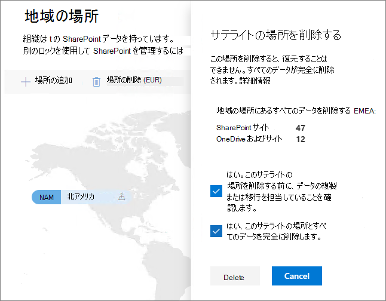

# Office 365 Multi-Geo でサテライトの場所を削除する

サテライトの場所が不要になった場合は、<a href="https://go.microsoft.com/fwlink/?linkid=2185219" target="_blank">テナントからSharePoint管理センター</a>から削除できます。

> [!WARNING]
> すべてのサテライトの場所のユーザー データは永久に削除されます。 これには、すべての OneDrive for Business コンテンツ、SharePoint サイトと Exchange メールボックス (Microsoft 365 グループ メールボックスを含む) が含まれます。 サテライトの場所を削除する前に、データを別のサテライトの場所または集中管理する場所に移行する必要があります。 この操作は元に戻せません。

サテライトの場所はグローバル管理者のみが削除できます。

サテライトの場所を削除するには

1. SharePoint管理センターを開き、[<a href="https://go.microsoft.com/fwlink/?linkid=2185076" target="_blank">**地域の場所**] タブ</a>に移動します。

1. マップで、削除する地域の場所を選択します。

1. [ **場所の削除] を選択します**。

1. 確認のチェック ボックスをオンにして、削除を確認します。

1. **[削除]** を選択します。
