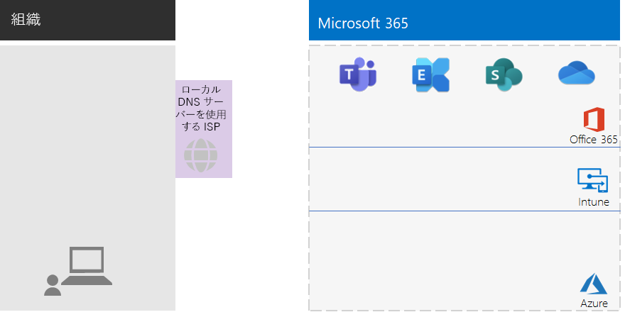
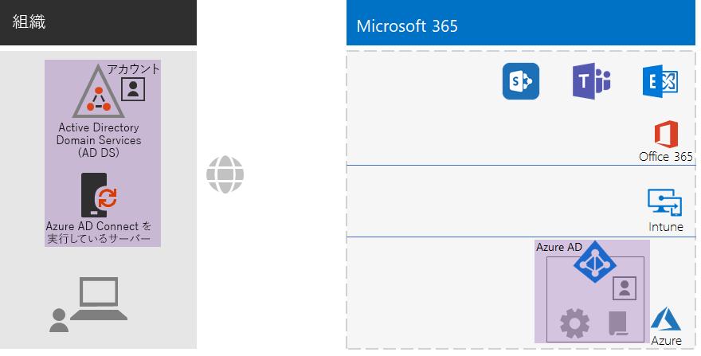
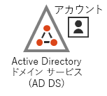
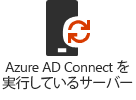
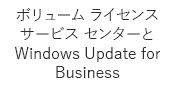
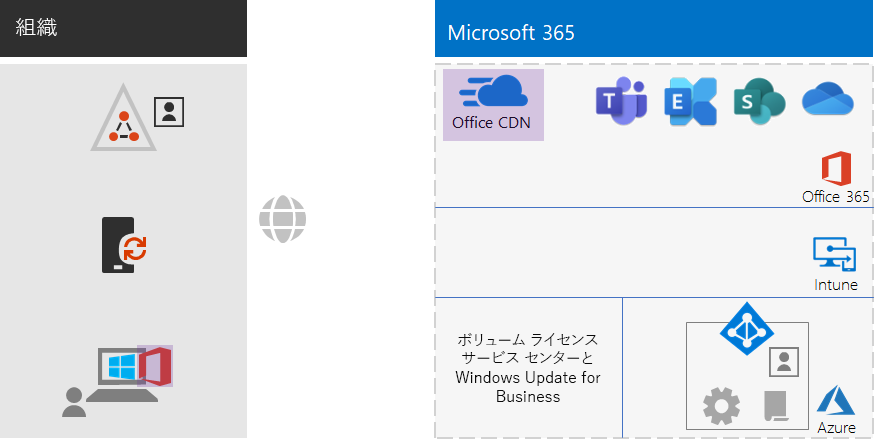

# 非エンタープライズ組織のためのエンタープライズ向け Microsoft 365 の基礎インフラストラクチャMicrosoft 365 for enterprise foundation infrastructure for non-enterprises

エンタープライズ以外の組織でも、エンタープライズ向け Microsoft 365 を展開することで、チームワークを可能にして創造性を解き放つ、統合された安全なインフラストラクチャがもたらすビジネス価値を実現することができます。Non-enterprise organizations can also deploy Microsoft 365 for enterprise and realize the business value of an integrated and secure infrastructure that enables teamwork and unlocks creativity. 通常、エンタープライズ以外の組織では以下が一般的です。A non-enterprise typically has:

- メール サーバー、ファイル サーバー、Active Directory Domain Services (AD DS) ドメインなど、小規模のオンプレミスの IT インフラストラクチャを装備している。または IT インフラストラクチャがまったく装備されていない。A small amount of on-premises IT infrastructure, such as email and file servers and an Active Directory Domain Services (AD DS) domain, or none at all.
- IT スタッフは少人数であり、そのほとんどが IT ゼネラリストであって、ネットワークや電子メールなどの特定のテクノロジやワークロードのスペシャリストではない。A small IT staff, most of whom are IT generalists, rather than specialists in a specific technology or workload such as networking or email.

小規模な非エンタープライズ組織向けに、Microsoft は [Microsoft 365 Business](https://www.microsoft.com/microsoft-365/business) を提供しています。For smaller, non-enterprise organizations, Microsoft offers [Microsoft 365 Business](https://www.microsoft.com/microsoft-365/business). しかし、次のような理由で エンタープライズ向け Microsoft 365 が必要になる場合があります。However, there are reasons why you might need Microsoft 365 for enterprise, such as:

- 組織が現時点で、または将来的に、Microsoft 365 Business ライセンスの最大数である 300 を超える Microsoft 365 ライセンスを必要としている。Your organization needs more or will need more than 300 Microsoft 365 licenses, which is the maximum for Microsoft 365 Business.
- 組織が、Microsoft 365 Business では利用できない高度な生産性、音声、セキュリティ、分析機能を必要としている。Your organization needs the advanced productivity, voice, security, and analytics capabilities that are not available with Microsoft 365 Business.

この記事では、非エンタープライズ組織に適した、エンタープライズ向け Microsoft 365 の基礎インフラストラクチャの簡略化された展開手順について説明します。This article steps you through a simplified deployment of the foundation infrastructure of Microsoft 365 for enterprise suitable for your non-enterprise.

## 最初の手順: サブスクリプションのセットアップFirst, set up your subscription

サブスクリプションのドメイン ネーム システム (DNS) ドメインをセットアップする必要があります。You must set up the Domain Name System (DNS) domains for your subscription. Office 365 サブスクリプションが既にある場合、この手順は完了しています。If you already have an Office 365 subscription, this should have been done. ない場合は、「[Office 365 にドメインを追加する](https://docs.microsoft.com/office365/admin/setup/add-domain?view=o365-worldwide)」の手順に従ってください。If not, follow the instructions in [Add a domain to Office 365](https://docs.microsoft.com/office365/admin/setup/add-domain?view=o365-worldwide).

次に、Microsoft 365 に対して追加のセキュリティを構成する必要があります。Next, you need to configure additional security for Microsoft 365. 「[セキュリティ強化を構成する](https://docs.microsoft.com/office365/securitycompliance/tenant-wide-setup-for-increased-security)」の手順に従ってください。Follow the instructions in [Configure increased security](https://docs.microsoft.com/office365/securitycompliance/tenant-wide-setup-for-increased-security).

## フェーズ 1: ネットワークPhase 1: Networking

通常、エンタープライズ以外の組織の場合、各オフィスでローカル インターネット接続を使用しており、プロキシ サーバー、ファイアウォール、パケット検査デバイスは使用していません。Non-enterprise organizations typically have local Internet connections in each office and do not use proxy servers, firewalls, or packet inspection devices. 各オフィスのインターネット サービス プロバイダー (ISP) は地域のローカル DNS サーバーを用意しているので、トラフィックは各自のオフィスとそのオフィスのオンプレミス ユーザーに最も近い Microsoft 365 のネットワークの場所に直接送信されます。The Internet service provider (ISP) serving each office has a regionally local DNS server so that traffic is directed to the Microsoft 365 network location that is closest to your offices and their on-premises users. 詳細については、「[オフィスごとにローカルのインターネット接続を構成する](networking-dns-resolution-same-location.md)」を参照してください。For more information, see [Configure local Internet connections for each office](networking-dns-resolution-same-location.md).

したがって、各オフィスの所在地の接続について ISP に確認が必要なのは、以下の事項のみです。Therefore, you only need to verify with your ISP that the connection at each of your office locations:

- 地域のローカル DNS サーバーを使用している。Uses a regionally local DNS server.
- ユーザーがより多くの Microsoft 365 クラウドサービスを使い始めても、現在および将来のニーズを十分に満たす能力がある。Is adequate for current and future needs as your users begin using more Microsoft 365 cloud services.

プロキシ サーバー、ファイアウォール、またはパケット検査デバイスを使用する場合、Microsoft 365 サービスのパフォーマンスを最適化する方法については、「[トラフィック バイパスを構成する](networking-configure-proxies-firewalls.md)」を参照してください。If you do use proxy servers, firewalls, or packet inspection devices, see [Configure traffic bypass](networking-configure-proxies-firewalls.md) for information on how to optimize performance to Microsoft 365 services.

### これまでの構成Your configuration so far

以下は、フェーズ 1 の要素に注目して概要を視覚的に示したものです。Here is a visual summary with the Phase 1 element highlighted. **組織**には複数のオフィスがある場合があり、各オフィスには地域のローカル DNS サーバーを使用している ISP 経由のローカル インターネット接続があります。**Your organization** can be multiple offices, each of which has a local Internet connection with an ISP that uses a regionally local DNS server. ISP を介して、各オフィスのユーザーは、最も近い Microsoft 365 のネットワークの場所にアクセスして Microsoft 365 サブスクリプションのリソースを使用できます。Through the ISP, users in each office can reach the nearest Microsoft 365 network location and the resources of your Microsoft 365 subscription.

## フェーズ 2: IDPhase 2: Identity

組織の各従業員がサインインできる状態である必要があります。そのためには、エンタープライズ向け Microsoft 365 サブスクリプションの Azure Active Directory (Azure AD) テナントにユーザー アカウントがある必要があります。Each employee of your organization must be able to sign in, which requires a user account in the Azure Active Directory (Azure AD) tenant of your Microsoft 365 for enterprise subscription. 次にグループが、SharePoint Online サイトやチームなどのアクセス許可が付与されたリソースと通信したり、それらにアクセスしたりするために、ユーザー アカウントやその他のグループをまとめるために使用されます。Groups are then used to contain user accounts and other groups to communicate or gain access to permissioned resources, such as a SharePoint Online site or a team. 

### 管理者アカウントAdministrator accounts

強力なパスワードや多要素認証 (MFA) を要求することで、グローバル管理者ユーザー アカウントを保護します。Protect your global administrator user accounts by requiring strong passwords and multi-factor authentication (MFA). 詳細については、「[グローバル管理者アカウントを保護する](identity-create-protect-global-admins.md#protect-global-administrator-accounts)」を参照してください。See [Protect global administrator accounts](identity-create-protect-global-admins.md#protect-global-administrator-accounts) for more information.

高度なセキュリティが要求される組織で Microsoft 365 E5 を使用している場合、Azure AD Privileged Identity Management を使用して、ジャストインタイムの管理者アクセスを有効にします。If your organization requires high security and you have Microsoft 365 E5, use Azure AD Privileged Identity Management to enable just-in-time administrator access. 詳細については、「[オンデマンド グローバル管理者をセットアップする](identity-create-protect-global-admins.md#identity-pim)」を参照してください。See [Set up on-demand global administrators](identity-create-protect-global-admins.md#identity-pim) for more information.

### グループに関する推奨事項Recommendations for groups

オンプレミス AD DS ドメインがある場合、これらのグループは、Azure AD のグループとして引き続きエンタープライズ向け Microsoft 365 で使用します。If you have an on-premises AD DS domain, continue to use those groups in Microsoft 365 for enterprise as groups in Azure AD.

オンプレミスの AD DS ドメインがない場合は、以下のレベルのセキュリティを使用して、Azure AD でセキュリティ グループを作成します。If you don't have an on-premises AD DS domain, create security groups in Azure AD using these levels of security.

| セキュリティ レベルSecurity level | 説明Description | 例Examples |
|:-------|:-----|:-----|
| ベースラインBaseline | これは、データ、データにアクセスする ID とデバイスを保護するための最低限の既定の基準です。This is a minimum and default  standard for protecting data and the identities and devices that access your data.    通常、ほとんどのユーザーによって管理されている組織の大部分のデータが対象になります。This is typically most of your organization's data managed by most of your users. | 営業、マーケティング、サポート、管理、製造など、現場担当者を対象にしたグループ。Groups for first line workers, such as sales, marketing, support, administration, and manufacturing. |
| 機密Sensitive | これは、ベースライン レベルを越えて保護する必要があるデータのサブセットに対する追加の保護です。This is additional protection for a subset of your data that must be protected beyond the baseline level. これらのグループには、すべてのユーザーが利用できるようには意図されていない、部署やプロジェクトに固有の機密性の高いデータを使用および作成するユーザーが含まれています。These groups contain users that use and create sensitive data that is specific to departments and projects that are not meant to be available to everyone. | 今後導入予定の製品を開発している製品チームまたはマーケティング チームProduct or marketing teams that are developing future products |
| 厳しく規制Highly regulated | これは、高度に分類され、知的財産または営業秘密と見なされる、通常は少量のデータ、またはセキュリティ規制に準拠する必要があるデータに対する最高レベルの保護です。This is the highest level of protection for a typically small amount of data that is highly classified, considered intellectual property or trade secrets, or data that must adhere to security regulations. |  研究チーム、法務チーム、財務チーム、あるいは顧客やパートナーのデータを保存または使用するチーム。Research, legal, and financial teams, or teams storing or using customer or partner data. |
||||

### ハイブリッド IDHybrid identity

オンプレミスの AD DS ドメインがある場合は、ドメインのユーザー アカウント、グループ、連絡先一式をエンタープライズ向け Microsoft 365 サブスクリプションの Azure AD テナントと同期する必要があります。If you have an on-premises AD DS domain, you need to synchronize the set of user accounts, groups, and contacts of your domain with the Azure AD tenant of your Microsoft 365 for enterprise subscription. エンタープライズ以外の場合は、パスワード ハッシュ同期 (PHS) を使用してサーバー上に Azure AD Connect を構成します。For your non-enterprise, you configure Azure AD Connect on a server with password hash synchronization (PHS). 詳細については、「[ID を同期する](identity-add-user-accounts.md#synchronize-identities-for-hybrid-identity)」を参照してください。See [Synchronize identities](identity-add-user-accounts.md#synchronize-identities-for-hybrid-identity) for more information.

### 条件付きアクセスポリシーを使用したユーザー アクセスのセキュリティ強化More secure user access with Conditional Access policies

Azure AD では、ユーザーのサインインの条件が評価されます。また、条件付きアクセス ポリシーを使用して、アクセスを許可または拒否したり、サインインを完了するために必要なその他のアクションを適用したりすることができます。Azure AD evaluates the conditions of user sign-ins and can use Conditional Access policies to grant or deny access and impose further actions that must be taken to complete the sign-in. たとえば、Azure AD によってサインインが中リスクまたは高リスクの条件下で行われていると判断された場合、ユーザーはサインインを完了するために MFA を実行するよう求められます。For example, if Azure AD determines that the sign-in is happening under medium or high-risk conditions, it can require the user to perform MFA to complete the sign-in.

条件付きアクセス ポリシーをユーザー アカウントまたはグループに適用します。You apply Conditional Access policies to user accounts or groups. 条件付きアクセス ポリシーの割り当てを容易にするには、組織内に次の Azure AD セキュリティ グループを作成します。To facilitate an easier assignment of Conditional Access policies, create these Azure AD security groups in your organization:

- ベースラインBASELINE

  ベースライン データにアクセスできるユーザーのグループまたはユーザー アカウントが含まれます。Contains the groups or user accounts for users with access to baseline data.

- 機密SENSITIVE

  機密性の高いデータにアクセスできるユーザーのグループまたはユーザー アカウントが含まれます。Contains the groups or user accounts for users with access to sensitive data.

- 厳しく規制HIGHLY-REGULATED

  厳しく規制されているデータにアクセスできるユーザーのグループまたはユーザー アカウントが含まれます。Contains the groups or user accounts for users with access to highly regulated data.

- 条件付きアクセスの除外COND-ACCESS-EXCLUDE

  条件付きアクセス ポリシーから一時的にユーザーを除外するために使用できる空のグループ。An empty group that you can use to temporarily exclude a user from Conditional Access policies.

以下は、有効にする、または作成する Azure AD 条件付きアクセス ポリシーの一覧です。Here is the list of Azure AD Conditional Access policies to enable or create.

| Azure AD 条件付きアクセス ポリシーAzure AD Conditional Access policy | 適用対象のグループGroups to which it applies |
|:------|:-----|
| ベースライン ポリシー: 管理者に MFA を要求するBaseline policy: Require MFA for admins | このポリシーは管理者の役割に適用されるため、グループを指定する必要はありません。This policy applies to admin roles, so no groups need to be specified. このポリシーは有効にするだけで済みます。This policy just needs to be enabled. 以降のすべてのポリシーは、作成して有効にする必要があります。All subsequent policies need to be created and enabled. |
| 先進認証をサポートしないクライアントはブロックするBlock clients that don't support modern authentication | ポリシー設定で [すべてのユーザー] を選択します。Select "All users" in the policy settings. |
| サインインのリスクが中または高のときに MFA が必要 (Microsoft 365 E5 が必要)Require MFA when sign-in risk is medium or high (requires Microsoft 365 E5) | ベースラインBASELINE |
| サインインのリスクが低、中、または高のときに MFA が必要 (Microsoft 365 E5 が必要)Require MFA when sign-in risk is low, medium, or high (requires Microsoft 365 E5) | 機密SENSITIVE |
| 常に MFA が必要Always require MFA | 厳しく規制HIGHLY-REGULATED |
| iOS と Android のデバイスで承認済みアプリが必要Require approved apps on iOS and Android devices | ベースライン、機密、厳しく規制BASELINE, SENSITIVE, HIGHLY-REGULATED |
| 準拠 PC が必要Require compliant PCs | ベースラインBASELINE |
| 準拠している PC、および iOS と Android のデバイスが必要Require compliant PCs and iOS and Android devices | 機密、厳しく規制SENSITIVE, HIGHLY-REGULATED |
|||

以下は、作成して有効にする必要がある Azure AD Identity Protection (Microsoft 365 E5 が必要です) のユーザー リスク ポリシーです。Here is the Azure AD Identity Protection (requires Microsoft 365 E5) user risk policy to create and enable.

| Azure AD Identity Protection ユーザーのリスク ポリシーAzure AD Identity Protection user risk policy | 適用対象のグループGroups to which it applies |
|:------|:-----|
| 高リスク ユーザーはパスワードを変更する必要があるHigh risk users must change passwords | ポリシー設定で [すべてのユーザー] を選択します。Select "All users" in the policy settings. |
|||

手順については、「[共通 ID とデバイスのアクセス ポリシー](identity-access-policies.md)」を参照してください。See [Common identity and device access policies](identity-access-policies.md) for the instructions.

### 管理を容易にするためのグループGroups for easier management

以下は、グループとライセンスの管理をより簡単にするための機能の一部です。Here are some features that can make group and licensing management easier for you.

| 機能Feature | 使用法Use |
|:------|:-----|
| セルフサービスによるグループの管理Self-service group management | IT スタッフではなく、グループの所有者が Azure AD グループを管理できるようにします。Allow management of Azure AD groups by group owners instead of IT staff. 詳細については、「[セルフサービスによるグループの管理](identity-use-group-management.md#allow-users-to-create-and-manage-their-own-groups)」を参照してください。See [Self-service group management](identity-use-group-management.md#allow-users-to-create-and-manage-their-own-groups) for more information. |
| 動的グループ メンバーシップDynamic group membership | 部署や国などのユーザー アカウントの属性に基づいて、Azure AD グループに対するユーザー アカウントの自動追加または自動削除を構成します。Configure automatic addition or removal of user accounts from Azure AD groups based on user account attributes, such as Department or Country. 詳細については、「[動的グループ メンバーシップ](identity-use-group-management.md#set-up-dynamic-group-membership)」を参照してください。See [Dynamic group membership](identity-use-group-management.md#set-up-dynamic-group-membership) for more information. |
| グループベースのライセンスGroup-based licensing | グループ メンバーシップを使用して、ユーザー アカウントに対して自動的にライセンスの割り当てまたは割り当て解除を行います。Use group membership to automatically assign or unassign licenses to user accounts. 詳細については、「[グループベースのライセンス](identity-use-group-management.md#set-up-automatic-licensing)」を参照してください。See [Group-based licensing](identity-use-group-management.md#set-up-automatic-licensing) for more information. |
|  |  |

グループベースのライセンスを使用している場合は、LICENSED という名前のグループを作成して、エンタープライズ向け Microsoft 365 ライセンスが割り当てられているユーザー アカウント名を含めます。If you are using group-based licensing, create a group named LICENSED to contain user account names that are assigned a Microsoft 365 for enterprise license.

### ユーザー アクセスの監視Monitor user access

Microsoft 365 E5 を利用している場合は、Azure AD Identity Protection を使用して、資格情報の侵害についてユーザーのサインインを監視および分析できます。If you have Microsoft 365 E5, you can use Azure AD Identity Protection to monitor and analyze user sign-ins for credential compromise. 詳細については、「[資格情報が侵害されないように保護する](identity-secure-user-sign-ins.md#protect-against-credential-compromise)」を参照してください。See [Protect against credential compromise](identity-secure-user-sign-ins.md#protect-against-credential-compromise) for more information.

### これまでの構成Your configuration so far

以下は、既存の要素と新しい要素に注目して、ハイブリッド ID の ID フェーズの概要を視覚的に示したものです。Here is a visual summary of the Identity phase for hybrid identity, with existing and new elements highlighted.

 
新しく取り上げたハイブリッド ID の要素には次のものがあります。The new and highlighted hybrid identity elements include:
 
|||
|:------:|:-----|
|  | ユーザーのアカウントとグループを含むオンプレミスの AD DS ドメイン。An on-premises AD DS domain with user accounts and groups. |
|  | Azure AD Connect を実行している Windows ベースのサーバー。A Windows-based server running Azure AD Connect. |
|  | Azure AD 内の AD DS のユーザー アカウントとグループの同期セット。The synchronized set of AD DS user accounts and groups in Azure AD. |
|  | 認証、グローバル アカウントのセキュリティ保護、グループとライセンスの管理の簡易化を行うための Azure AD 設定。Azure AD settings for authentication, securing global accounts, and making it easier to manage groups and licenses. |
|  | Azure AD 条件付きアクセス ポリシー。Azure AD Conditional Access policies. |
|||

以下は、新しい要素に注目して、クラウド専用 ID の ID フェーズの概要を視覚的に示したものです。Here is a visual summary of the Identity phase for cloud-only identity, with the new elements highlighted.

 
新しく取り上げたクラウド専用 ID の要素には次のものがあります。The new and highlighted cloud-only identity elements include:
 
|||
|:------:|:-----|
|  | Azure AD のユーザー アカウントとグループ。The user accounts and groups in Azure AD. |
|  | 認証、グローバル アカウントのセキュリティ保護、グループとライセンスの管理の簡易化を行うための Azure AD 設定。Azure AD settings for authentication, securing global accounts, and making it easier to manage groups and licenses. |
|  | Azure AD 条件付きアクセス ポリシー。Azure AD Conditional Access policies. |
|||

## フェーズ 3: Windows 10 EnterprisePhase 3: Windows 10 Enterprise

お使いの Windows 10 Enterprise デバイスをエンタープライズ向け Microsoft 365 の ID とセキュリティのインフラストラクチャに確実に統合する方法として、以下のオプションがあります。To ensure that your Windows 10 Enterprise devices are integrated into the identity and security infrastructure of Microsoft 365 for enterprise, here are your options:

- ハイブリッド (オンプレミスの AD DS ドメインがある場合)Hybrid (you have an on-premises AD DS domain)

  既に AD DS ドメインに参加している既存の Windows 10 Enterprise デバイスの場合は、各デバイスを Azure AD テナントに参加させます。For each existing Windows 10 Enterprise device already joined to your AD DS domain, join them to the Azure AD tenant. 詳細については、「[ハイブリッド Azure Active Directory 参加済みデバイスの構成方法](https://go.microsoft.com/fwlink/p/?linkid=872870)」を参照してください。See [How to configure hybrid Azure Active Directory joined devices](https://go.microsoft.com/fwlink/p/?linkid=872870) for the instructions.

  Windows 10 Enterprise の新しいデバイスの場合は、各デバイスを AD DS ドメインに参加させてから、Azure AD テナントに参加させます。For each new Windows 10 Enterprise device, join them to your AD DS domain, and then join them to the Azure AD tenant.

  Windows 10 Enterprise デバイスは、各デバイスをモバイル デバイスの管理用に登録します。For each Windows 10 Enterprise device, enroll them for mobile device management. 手順については、「[グループ ポリシーを使用して Intune に Windows 10 デバイスを登録する](https://go.microsoft.com/fwlink/p/?linkid=872871)」を参照してください。See [Enroll a Windows 10 device with Intune by using a Group Policy](https://go.microsoft.com/fwlink/p/?linkid=872871) for the instructions.

- クラウド専用 (オンプレミスの AD DS ドメインがない場合)Cloud-only (you do not have an on-premises AD DS domain)

  Windows 10 Enterprise の各デバイスをサブスクリプションの Azure AD テナントに参加させます。Join each Windows 10 Enterprise device to the Azure AD tenant of your subscription.

  詳細については、「[職場のデバイスを組織のネットワークに参加させる](https://docs.microsoft.com/azure/active-directory/user-help/user-help-join-device-on-network)」を参照してください。See [Join your work device to your organization's network](https://docs.microsoft.com/azure/active-directory/user-help/user-help-join-device-on-network) for more information.

インストールして参加させると、Windows 10 Enterprise の各デバイスには、Windows Update for Business クラウド サービスから更新プログラムが自動的にインストールされます。Once installed and joined, each Windows 10 Enterprise device automatically installs updates from the Windows Update for Business cloud service. 通常、エンタープライズ以外の組織では、Windows 10 更新プログラムの配布やインストール用にインフラストラクチャをセットアップする必要はありません。There is typically no need in a non-enterprise organization to set up an infrastructure to distribute and install Windows 10 updates.

### これまでの構成Your configuration so far

以下は、新しい要素に注目して、Windows 10 Enterprise フェーズの概要を視覚的に示したものです。Here is a visual summary of the Windows 10 Enterprise phase with the new elements highlighted.

 
新しく取り上げた Windows 10 Enterprise の要素には次のものがあります。The new and highlighted Windows 10 Enterprise elements include:

|||
|:------:|:-----|
|  | Windows デバイスにインストールされている Windows 10 Enterprise (例として、オンプレミスのノート PC を表示)。Windows 10 Enterprise installed on Windows devices, with an on-premises laptop as an example. |
|  | Windows 10 Enterprise の新規インストール用のイメージが用意されているボリューム ライセンス サービス センター、および最新の更新プログラムを提供する Windows Update for Business サービス。The Volume Licensing Service Center, which provides images for new installations of Windows 10 Enterprise, and the Windows Update for Business service, which provides the latest updates. |
|||

## フェーズ 4: Office 365 ProPlusPhase 4: Office 365 ProPlus

エンタープライズ向け Microsoft 365 には、Microsoft Office のサブスクリプション版である Office 365 ProPlus が含まれています。Microsoft 365 for enterprise includes Office 365 ProPlus, the subscription version of Microsoft Office. Office 2016 または Office 2019 と同様に、Office 365 ProPlus はクライアント デバイスに直接インストールされます。Like Office 2016 or Office 2019, Office 365 ProPlus is installed directly on your client devices. ただし、Office 365 ProPlus には、新機能を含む更新プログラムが定期的に提供されます。However, Office 365 ProPlus receives updates that include new features on a regular basis. 詳細については、「[エンタープライズでの Office 365 ProPlus について](https://docs.microsoft.com/deployoffice/about-office-365-proplus-in-the-enterprise)」を参照してください。See [About Office 365 ProPlus in the enterprise](https://docs.microsoft.com/deployoffice/about-office-365-proplus-in-the-enterprise) for more information.

エンタープライズ以外の組織の場合は、Office 365 ProPlus を Windows、iOS、Android デバイスを含むデバイスに手動でインストールします。For your non-enterprise organization, you manually install Office 365 ProPlus on devices, which can include Windows, iOS, and Android devices. これは、新しいデバイスを使用する準備の一環として実行することも、ユーザーがオンボード プロセスの一環として実行することもできます。This can be done as part of preparing a new device for use, or by the user as part of their onboarding process.

いずれの場合でも、管理者またはユーザーは https://portal.office.com で Office 365 ポータルにサインインします。In either case, the administrator or the user signs in to the Office 365 portal at https://portal.office.com. **[Microsoft Office Home]** タブで、**[Office のインストール]** をクリックして、インストール プロセスを進めます。On the **Microsoft Office Home** tab, click **Install Office** and step through the installation process.

Office 365 ProPlus に対する機能更新プログラムは、インストールされているコンピューターごとに毎月ダウンロードされます。Feature updates to Office 365 ProPlus are downloaded monthly by each computer on which it is installed. 通常、エンタープライズ以外の組織では、Office 365 ProPlus 更新プログラムの配布用にインフラストラクチャをセットアップする必要はありません。There is typically no need in a non-enterprise organization to set up an infrastructure to distribute Office 365 ProPlus updates. 

### これまでの構成Your configuration so far

以下は、新しい要素に注目して、Office 365 ProPlus フェーズの概要を視覚的に示したものです。Here is a visual summary of the Office 365 ProPlus phase with the new elements highlighted.

 
新しく取り上げた Office 365 ProPlus の要素には次のものがあります。The new and highlighted Office 365 ProPlus elements include:
 
|||
|:------:|:-----|
|  | デバイスにインストールされている Office 365 ProPlus (例として、オンプレミスのノート PC を表示)。Office 365 ProPlus installed on devices, with an on-premises laptop as an example. |
|  | Office 365 ProPlus の更新プログラムのためにデバイスがアクセスする、Office 365 ProPlus 用の Office コンテンツ配信ネットワーク (CDN)。The Office Content Delivery Network (CDN) for Office 365 ProPlus, which devices access for Office 365 ProPlus updates. |
|||

## フェーズ 5: モバイル デバイス管理Phase 5: Mobile device management

エンタープライズ向け Microsoft 365 には、モバイル デバイス管理用の Microsoft Intune が含まれています。Microsoft 365 for enterprise includes Microsoft Intune for mobile device management. Intune を使用すると、Windows、iOS、Android、macOS の各デバイスを管理して、自分のデータを含む、組織のリソースへのアクセスを保護することができます。With Intune, you can manage Windows, iOS, Android, and macOS devices to protect access to your organization's resources, including your data. Intune では、Azure AD のユーザー、グループ、コンピューター アカウントを使用します。Intune uses the user, group, and computer accounts of Azure AD.

Intune には、次の 2 種類のモバイル デバイス管理が用意されています。Intune provides two types of mobile device management:

- モバイル デバイス管理 (MDM) は、デバイスが Intune に登録された時点から行われます。Mobile device management (MDM) is when devices get enrolled in Intune. 登録されると、デバイスはマネージド デバイスとなり、組織で使用されているポリシー、ルール、設定を受信できます。Once enrolled, they are managed devices and can receive the policies, rules, and settings used by your organization. これらの種類のデバイスは、通常、組織が所有し、従業員に支給されます。These types of devices are typically owned by your organization and issued to your employees.

- 自分の個人用デバイスを使用しているユーザーの中には、自分のデバイスを登録したり、ポリシーや設定を使用して Intune で管理したりすることを望まないユーザーもいます。Users with their own personal devices may not want to enroll their devices or be managed by Intune with your policies and settings. しかし、そうであっても、組織のリソースとデータを保護する必要があります。However, you still need to protect your organization's resources and data. このような場合は、モバイル アプリケーション管理 (MAM) を使用して、アプリを保護することができます。For this scenario, you can protect your apps with mobile application management (MAM).  

Intune ポリシーでは、デバイス コンプライアンスとアプリ保護を適用できます。Intune policies can enforce device compliance and app protection. 以下は、作成する Intune ポリシーの一覧です。Here is the list of Intune policies to create.

| Intune ポリシーIntune policies | 適用対象のグループGroups to which it applies |
|:------|:-----|
| Windows 用のデバイス コンプライアンス ポリシーDevice compliance policy for Windows | ベースライン、機密、厳しく規制BASELINE, SENSITIVE, HIGHLY-REGULATED |
| iOS 用のデバイス コンプライアンス ポリシーDevice compliance policy for iOS | 機密、厳しく規制SENSITIVE, HIGHLY-REGULATED |
| macOS 用のデバイス コンプライアンス ポリシーDevice compliance for macOS | 機密、厳しく規制SENSITIVE, HIGHLY-REGULATED |
| Android と Android Enterprise 用のデバイス コンプライアンス ポリシーDevice compliance policy for Android and Android Enterprise | 機密、厳しく規制SENSITIVE, HIGHLY-REGULATED |
| iOS 用のアプリ保護ポリシーApp protection policy for iOS | ベースライン、機密、厳しく規制BASELINE, SENSITIVE, HIGHLY-REGULATED |
| macOS 用のアプリ保護ポリシーApp protection policy for macOS | ベースライン、機密、厳しく規制BASELINE, SENSITIVE, HIGHLY-REGULATED |
| Android と Android Enterprise 用のアプリ保護ポリシーApp protection policy for Android and Android Enterprise | ベースライン、機密、厳しく規制BASELINE, SENSITIVE, HIGHLY-REGULATED |
|||
    
手順については、「[共通 ID とデバイスのアクセス ポリシー](identity-access-policies.md)」を参照してください。See [Common identity and device access policies](identity-access-policies.md) for the instructions.

### これまでの構成Your configuration so far

以下は、新しい要素に注目して、モバイル デバイス管理フェーズの概要を視覚的に示したものです。Here is a visual summary of the Mobile Device Management phase with the new elements highlighted.

 
新しく取り上げたモバイル デバイス管理の要素には次のものがあります。The new and highlighted mobile device management elements include:

|||
|:------:|:-----|
|  | Intune に登録されているデバイス (例として、Windows 10 Enterprise を実行しているオンプレミスのノート PC を表示)。Devices that are enrolled in Intune, showing an on-premises laptop running Windows 10 Enterprise as an example. |
|  | デバイス コンプライアンスとアプリ保護のための Intune ポリシー。Intune policies for device compliance and app protection. |
|||

## フェーズ 6: 情報保護Phase 6: Information protection

エンタープライズ向け Microsoft 365 には情報保護機能が備わっており、異なるレベルのガバナンス、セキュリティ、保護を適用することによって、データの分類を異なる方法で処理することが可能です。Microsoft 365 for enterprise has a host of information protection features that allow you to treat classifications of data differently by applying different levels of governance, security, and protection. 

たとえば、ほとんどの従業員とその従業員が作業しているドキュメント間における通常の通信には、一定のベースライン レベルの保護が必要です。For example, normal correspondence between most employees and the documents on which they work need a certain baseline level of protection. 財務レコード、顧客データ、知的財産には、より高いレベルの保護が必要です。Financial records, customer data, and your intellectual property need a higher level of protection.

情報保護戦略の第一歩は、保護レベルを決定することです。The first step to an information protection strategy is to determine the levels of protection. 多くの組織では以下のレベルが使用されています。これらは既に条件付きアクセス ポリシーに使用されています。Many organizations use these levels, which are already being used for Conditional Access policies:

- ベースラインBaseline

  通常のビジネス通信 (電子メール) や、管理、営業、サポートの各担当者用のファイルなどがあります。Examples include normal business communications (email) and files for administrative, sales, and support workers.

- 機密Sensitive

  財務情報や法的情報、新しい製品やサービスに関する研究開発データなどがあります。Examples include financial and legal information and research and development data for new products or services.

- 高度な規制Highly regulated

  顧客やパートナーの個人を特定できる情報、組織の戦略計画または知的財産などがあります。Examples include customer and partner personally identifiable information and your organization's strategic plans or intellectual property.

次の手順では、これらのレベルのデータ セキュリティに基づいて、以下を特定して実装します。Based on these levels of data security, the next step is to identify and implement:

- カスタムの機密情報の種類Custom sensitive information types

  Microsoft 365 では、医療サービスやクレジット カード番号など、さまざまな機密情報の種類を提供しています。Microsoft 365 supplies a wide selection of sensitive information types, such as health service and credit card numbers. 提供される項目の一覧に必要なものが見つからない場合は、独自に作成することができます。If you do not find one that you need in the supplied list, you can create your own.

- 保持ラベルRetention labels

  組織のポリシーと地域の規制に準拠するには、必要に応じて、特定の種類のドキュメントまたは特定のコンテンツを含むドキュメントを保持する期間を決定する必要があります。To comply with organization policies and regional regulations, you might have to specify how long specific types of documents or documents with specific contents should be retained. これは、保持ラベルを使用して電子メールとドキュメントに実装できます。You can implement this for email and documents using retention labels. 保持ラベルは、組織外のファイルまたは電子メールの共有を制限できるデータ損失防止 (DLP) ポリシーと組み合わせて使用​​することもできます。Retention labels can also be used in conjunction with Data Loss Prevention (DLP) policies that can restrict the sharing of files or email outside your organization.

- 機密度ラベルSensitivity labels

  追加のセキュリティ レベルを適用できるように、名前付きの機密度ラベルを使用して、電子メールやドキュメントにラベルを付けることができます。You can label email or documents with a named sensitivity label so that additional levels of security can be applied. 例としては、透かし、暗号化、アクセス許可などがあります。これらを使用して、電子メールまたはドキュメントへのアクセスを許可されているユーザーとそのユーザーの許可されている操作を指定します。Examples are watermarks, encryption, and permissions, which specify who is allowed to access the email or document and what they are allowed to do.

詳細については、「[Microsoft 365 の分類の種類](infoprotect-configure-classification.md#microsoft-365-classification-types)」を参照してください。See [Microsoft 365 classification types](infoprotect-configure-classification.md#microsoft-365-classification-types) for more information.

アクセス許可の機密度ラベルを使用する場合は、追加の Office 365 セキュリティ グループを作成して、機密度ラベルが適用されている電子メールとドキュメントに対してどのような操作を誰に許可するのかを定義する必要があります。If you use sensitivity labels with permissions, you might have to create additional Office 365 security groups to define who is allowed to do what with email and documents that have the sensitivity label applied. 

たとえば、リサーチ チームの電子メールとドキュメントを保護するには、「リサーチ」という機密度ラベルを作成する必要があります。For example, you need to create a RESEARCH sensitivity label to protect the email and documents of your research team. 以下を決定する必要があります。You determine that:

- リサーチを行う従業員は、機密度ラベル "リサーチ" が付けられたドキュメントを変更できなければならない。Researchers must have the ability to change documents marked with the RESEARCH sensitivity label.
- リサーチを行わない従業員に必要なのは、機密度ラベル "リサーチ" が付けられたドキュメントを表示する機能のみ。Non-research employees only need to have the ability to view documents marked with the RESEARCH sensitivity label. 

つまり、次の 2 つの Office 365 グループを追加で作成して管理する必要があります。This means you need to create and manage two additional Office 365 groups:

- リサーチ-すべてRESEARCH-ALL
- リサーチ-表示RESEARCH-VIEW

これらのグループとそのアクセス許可は、リサーチ機密度ラベルの構成の一部になります。These groups and their permissions become part of the RESEARCH sensitivity label's configuration.

グループベースのアクセス許可で構成された機密度ラベルの場合、これらのグループのメンバーシップを管理する必要があります。For sensitivity labels configured with group-based permissions, you must manage the membership of these groups.

### これまでの構成Your configuration so far

以下は、新しい要素に注目して、情報保護フェーズの概要を視覚的に示したものです。Here is a visual summary of the Information Protection phase with the new elements highlighted.

 
新しく取り上げた情報保護の要素には次のものがあります。The new and highlighted information protection elements include:
 
|||
|:------:|:-----|
|  | ユーザーがドキュメントと電子メールに適用できる 3 つのセキュリティ レベルの機密度ラベル。Sensitivity labels for the three levels of security that users can apply to documents and email. |
|||

カスタム情報の種類と保持ラベルは表示されません。Custom information types and retention labels are not shown.

## オンボードOnboarding

エンタープライズ向け Microsoft 365 のインフラストラクチャがあれば、組織の従業員を簡単にオンボードすることができます。With your Microsoft 365 for enterprise infrastructure in place, you can easily onboard your employees.

### 新しい Windows 10 Enterprise デバイスA new Windows 10 Enterprise device

従業員に新しい Windows 10 Enterprise デバイスを提供する前に、以下を実行します。Before giving an employee a new Windows 10 Enterprise device:

- ハイブリッド ID の場合For hybrid identity

  デバイスを AD DS ドメイン、Azure AD テナントの順に参加させてから、Intune に登録します。Join the device to your AD DS domain, join the device to your Azure AD tenant, and then enroll the device in Intune.

- クラウド専用 ID の場合For cloud-only identity

  デバイスを Azure AD テナントに参加させます。Join the device to your Azure AD tenant.

### AD DS ユーザー アカウントを持っている既存の従業員Existing employee with an AD DS user account

ハイブリッド ID を使用する場合には、組織の初期のオンボードの一環として、次の Azure AD グループに AD DS ユーザー アカウントを追加します。As part of the initial onboarding for your organization when using hybrid identity, add the AD DS user account to these Azure AD groups:

- ライセンス付与済みLICENSED
- ベースライン、機密、厳しく規制の各 Azure AD グループのメンバーである、適切な AD DS または Azure AD セキュリティ グループThe appropriate AD DS or Azure AD security groups that are members of the BASELINE, SENSITIVE, and HIGHLY-REGULATED Azure AD groups
- 機密度ラベル グループ (必要な場合)Sensitivity label groups (as needed)

既存の従業員は、適切なワークグループ、部署、地域の AD DS グループに既に追加されている必要があります。The existing employee should already be added to the appropriate workgroup, departmental, and regional AD DS groups.

Microsoft 365 管理センターで、複数の Azure AD グループにユーザー アカウントを追加できます。You can add a user account to multiple Azure AD groups in the Microsoft 365 admin center. ユーザー アカウントのプロパティで、**[グループの管理] > [メンバーシップの追加]** の順にクリックします。From the properties of the user account, click **Manage groups > Add memberships**.

Powershell を使用する場合は、この[ダウンロード可能な Excel ブック](https://github.com/MicrosoftDocs/microsoft-365-docs/raw/public/microsoft-365/media/deploy-foundation-infrastructure-non-enterprises/Group-License-Mgmt-PowerShell.xlsx)を参照してください。指定したユーザー アカウントと選択したグループ名に基づいて PowerShell コマンドが生成されます。If you want to use PowerShell, see this [downloadable Excel workbook](https://github.com/MicrosoftDocs/microsoft-365-docs/raw/public/microsoft-365/media/deploy-foundation-infrastructure-non-enterprises/Group-License-Mgmt-PowerShell.xlsx), which generates the PowerShell commands based on a specified user account and selected group names.

### クラウド専用ユーザー アカウントを持っている新入社員New employee with a cloud-only user account

クラウド専用 ID を使用する場合には、組織の初期のオンボードの一環として、次のグループに新しいユーザー アカウントを追加します。As part of the initial onboarding for your organization when using cloud-only identity, add the new user account to these groups:

- ライセンス付与済みLICENSED
- ベースライン、機密、厳しく規制の各 Azure AD グループのメンバーである、適切な Azure AD セキュリティ グループThe appropriate Azure AD security groups that are members of the BASELINE, SENSITIVE, and HIGHLY-REGULATED Azure AD groups
- ワークグループ、部署、地域の各グループWorkgroup, departmental, and regional groups
- 機密度ラベル グループ (必要な場合)Sensitivity label groups (as needed)

### Microsoft 365 への最初のサインインInitial sign-in to Microsoft 365

従業員が初めて Microsoft 365 にサインインする場合は、以下を実施します。For the first time employees sign in to Microsoft 365, instruct them to:

1. ユーザー アカウントの資格情報を使用して、デバイスにサインインする。Sign into their devices with their user account credentials.
2. ブラウザーを使用して、https://portal.office.com で Office 365 ポータルにサインインする。Using a browser, sign in to the Office 365 portal at https://portal.office.com.
3. **[Office 365 Home]** タブから、**[Office のインストール]** をクリックして、デバイスに Office 365 ProPlus をインストールします。From the **Office 365 Home** tab, click **Install Office** to install Office 365 ProPlus on their device.

## 最終的な結果End results

エンタープライズ向け Microsoft 365 の基礎インフラストラクチャを非エンタープライズ組織向けに構成すると、次のようになります。Here are the results of configuring the Microsoft 365 for enterprise foundation infrastructure for your non-enterprise organization.

### インフラストラクチャの結果Infrastructure results

エンタープライズ向け Microsoft 365 インフラストラクチャの構築および構成が完了すると、以下が装備されます。After the build-out and configuration of your Microsoft 365 for enterprise infrastructure, you should have:

- 地域のローカル DNS サーバーを使用している ISP によって提供される十分な帯域幅を備えた、各オフィス用のローカル インターネット接続。A local Internet connection for each of your offices with sufficient bandwidth supplied by an ISP that uses a regionally local DNS server.
- ハイブリッド ID の場合は、オンプレミス AD DS ドメインと Azure AD テナントを同期するサーバーで実行される Azure AD Connect。For hybrid identity, Azure AD Connect running on a server that synchronizes your on-premises AD DS domain with your Azure AD tenant.
- グループは以下の通りです。These groups:
  - ライセンス付与済みLICENSED
  - 条件付きアクセスの除外COND-ACCESS-EXCLUDE
  - ベースライン、機密、厳しく規制の各 Azure AD グループのメンバーでもある、適切な AD DS または Azure AD セキュリティ グループThe appropriate AD DS or Azure AD security groups that are also members of the BASELINE, SENSITIVE, and HIGHLY-REGULATED Azure AD groups 
  - ワークグループ、部署、地域の各グループWorkgroup, departmental, and regional groups
  - 機密度ラベル Office 365 グループ (必要な場合)Sensitivity label Office 365 groups (as needed)
- ベースライン、機密、厳しく規制、条件付きアクセスの除外の各 Azure AD グループを使用する Azure AD サインイン条件付きアクセス ポリシー。Azure AD sign-in Conditional Access policies that use the BASELINE, SENSITIVE, and HIGHLY-REGULATED, and COND-ACCESS-EXCLUDE Azure AD groups.
- Intune アプリケーションとデバイスのコンプライアンス ポリシー。Intune application and device compliance policies.
- カスタムの機密情報の種類 (必要な場合)。Custom sensitive information types (as needed).
- 保持ラベル (必要な場合)。Retention labels (as needed).
- 機密度ラベル (必要な場合)。Sensitivity labels (as needed).

以下は、組織がハイブリッド ID を使用している場合のインフラストラクチャの概要を視覚的に示したものです。これには、AD DS ドメイン、Azure AD Connect サーバー、同期された AD DS のユーザーとグループが含まれています。Here is a visual summary of the infrastructure if your organization uses hybrid identity, which includes your AD DS domain, an Azure AD Connect server, and synchronized AD DS users and groups.

 
以下は、組織がクラウド専用の ID を使用している場合のインフラストラクチャの概要を視覚的に示したものです。Here is a visual summary of the infrastructure if your organization uses cloud-only identity.
 

### 従業員の結果Employee results

オンボード後、各従業員には次のものが提供されます。After their onboarding, each employee should have:

- 自分のデバイスから自分の地域の Microsoft 365 クラウド サービスへのパフォーマンスの高いオンプレミスのネットワーク パス。A performant, on-premises network path from their device to the Microsoft 365 cloud services in their region.
- 以下のメンバーシップを持つユーザー アカウント。A user account with these group memberships:
   - ライセンス付与済みLICENSED
   - 条件付きアクセス ポリシー用のベースライン、機密、厳しく規制の各 Azure AD グループのメンバーでもある、適切な AD DS または Azure AD セキュリティ グループThe appropriate AD DS or Azure AD security groups, which are also members of the BASELINE, SENSITIVE, and HIGHLY-REGULATED Azure AD groups for Conditional Access policies 
   - 適切なワークグループ、部署、地域の各グループThe appropriate workgroup, departmental, and regional groups
   - 機密度ラベル Office 365 グループ (必要な場合)Sensitivity label Office 365  groups (as needed)
- Windows 10 Enterprise デバイスは、以下のようになります。A Windows 10 Enterprise device that:
   - Azure AD テナント (クラウド専用) に参加している、または Azure AD テナントと AD DS ドメイン (ハイブリッド) の両方に参加している。Is joined to the Azure AD tenant (cloud-only) or to both the Azure AD tenant and your AD DS domain (hybrid).
   - Windows 10 Enterprise の最新の製品の品質向上とセキュリティ強化と共に自動的に更新される。Automatically updates itself with the latest Windows 10 Enterprise product improvements and security enhancements.
   - Office 365 ProPlus がインストールされ、これにより、最新の Office 製品の品質向上とセキュリティ強化と共に自動的に更新される。Has Office 365 ProPlus installed, which automatically updates itself with the latest Office product improvements and security enhancements.
   - Intune に登録され、Intune デバイス コンプライアンス ポリシーおよびアプリ保護ポリシーの対象となる。Is enrolled in Intune and subject to Intune device compliance policies and app protection policies.

## 次の手順Next step

[ワークロードとシナリオ](deploy-workloads.md)を展開して、エンタープライズ向け Microsoft 365 の基礎インフラストラクチャの機能と構成を活用します。Deploy your [workloads and scenarios](deploy-workloads.md) to take advantage of the features and configuration of your Microsoft 365 for enterprise foundation infrastructure.
