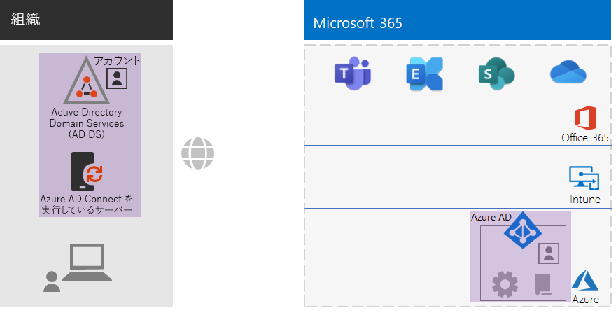
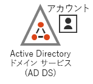
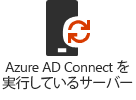
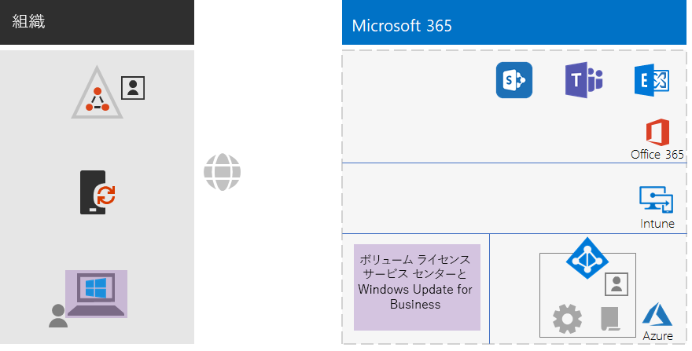
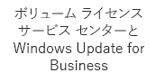
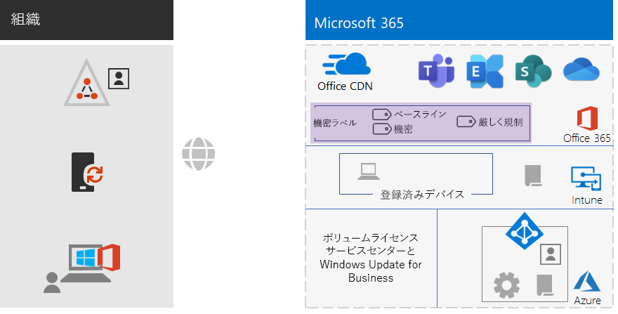
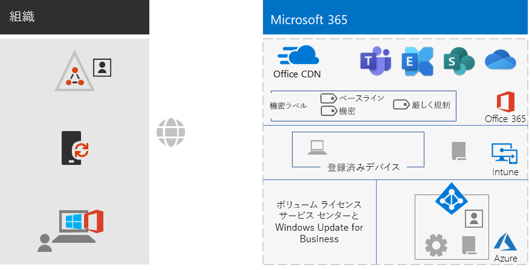
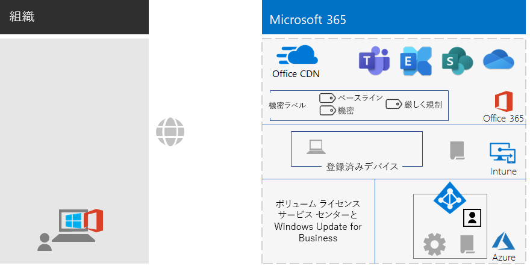

# 非エンタープライズ向け Microsoft 365 Enterprise の基礎インフラストラクチャ

エンタープライズ以外の組織でも、Microsoft 365 Enterprise を展開することで、チームワークを可能にして創造性を解き放つ、統合された安全なインフラストラクチャがもたらすビジネス価値を実現することができます。 通常、エンタープライズ以外の組織では以下が一般的です。

- メール サーバー、ファイル サーバー、Active Directory Domain Services (AD DS) ドメインなど、小規模のオンプレミスの IT インフラストラクチャを装備している。または IT インフラストラクチャがまったく装備されていない。
- IT スタッフは少人数であり、そのほとんどが IT ゼネラリストであって、ネットワークや電子メールなどの特定のテクノロジやワークロードのスペシャリストではない。

小規模な非エンタープライズ組織向けに、Microsoft は [Microsoft 365 Business](https://www.microsoft.com/microsoft-365/business) を提供しています。 しかし、次のような理由で Microsoft 365 Enterprise が必要になる場合があります。

- 組織が現時点で、または将来的に、Microsoft 365 Business ライセンスの最大数である 300 を超える Microsoft 365 ライセンスを必要としている。
- 組織が、Microsoft 365 Business では利用できない高度な生産性、音声、セキュリティ、分析を必要としている。

この記事では、非エンタープライズに適した Microsoft 365 Enterprise の基礎インフラストラクチャの単純な展開について説明します。

## 最初の手順: サブスクリプションのセットアップ

サブスクリプションのドメイン ネーム システム (DNS) ドメインをセットアップする必要があります。 Office 365 サブスクリプションが既にある場合、この手順は完了しています。 ない場合は、「[Office 365 にドメインを追加する](https://docs.microsoft.com/office365/admin/setup/add-domain?view=o365-worldwide)」の手順に従ってください。

次に、Microsoft 365 に対して追加のセキュリティを構成する必要があります。 「[セキュリティ強化を構成する](https://docs.microsoft.com/office365/securitycompliance/tenant-wide-setup-for-increased-security)」の手順に従ってください。

## フェーズ 1: ネットワーク

通常、エンタープライズ以外の組織の場合、各オフィスでローカル インターネット接続を使用しており、プロキシ サーバー、ファイアウォール、パケット検査デバイスは使用していません。 各オフィスのインターネット サービス プロバイダー (ISP) は地域のローカル DNS サーバーを用意しているので、トラフィックは各自のオフィスとそのオフィスのオンプレミス ユーザーに最も近い Microsoft 365 クラウドサーバーに直接送信されます。

したがって、各オフィスの所在地の接続について ISP に確認が必要なのは、以下の事項のみです。

- 地域のローカル DNS サーバーを使用している。
- ユーザーがより多くの Microsoft 365 クラウドサービスを使い始めても、現在および将来のニーズを十分に満たす能力がある。

### これまでの構成

以下は、フェーズ 1 の要素に注目して概要を視覚的に示したものです。 **組織**には複数のオフィスがある場合があり、各オフィスには地域のローカル DNS サーバーを使用している ISP 経由のローカル インターネット接続があります。 ISP を介して、各オフィスのユーザーは、最も近い Microsoft ネットワークの場所にアクセスして Microsoft 365 サブスクリプションのリソースを使用できます。

## フェーズ 2: ID

組織の各従業員がサインインできる必要があります。そのためには、Microsoft 365 Enterprise サブスクリプションの Azure Active Directory (Azure AD) テナントのユーザー アカウントが必要です。 次にグループが、SharePoint Online サイトやチームなどのアクセス許可が付与されたリソースと通信したり、それらにアクセスしたりするために、ユーザー アカウントやその他のグループをまとめるために使用されます。 

### 管理者アカウント

非常に強力なパスワードや多要素認証 (MFA) を要求することで、グローバル管理者ユーザー アカウントを保護します。 詳細については、「[グローバル管理者アカウントを保護する](identity-designate-protect-admin-accounts.md#protect-global-administrator-accounts)」を参照してください。

組織が高度なセキュリティを必要としていて、Microsoft 365 Enterprise E5 を使用している場合は、Azure AD Privileged Identity Management を使用して、ジャストインタイムの管理者アクセスを有効にします。 詳細については、「[オンデマンド グローバル管理者をセットアップする](identity-designate-protect-admin-accounts.md#set-up-on-demand-global-administrators)」を参照してください。

### グループに関する推奨事項

オンプレミスの AD DS ドメインがある場合は、Microsoft 365 Enterprise のグループを Azure AD のグループとして引き続き使用します。

オンプレミスの AD DS ドメインがない場合は、以下のレベルのセキュリティを使用して、Azure AD でセキュリティ グループを作成します。

| セキュリティ レベル | 説明 | 例 |
|:-------|:-----|:-----|
| ベースライン | これは、データ、データにアクセスする ID とデバイスを保護するための最低限の既定の基準です。    通常、ほとんどのユーザーによって管理されている組織の大部分のデータが対象になります。 | 営業、マーケティング、サポート、管理、製造など、現場担当者を対象にしたグループ。 |
| 機密 | これは、ベースライン レベルを越えて保護する必要があるデータのサブセットに対する追加の保護です。 これらのグループには、すべてのユーザーが利用できるようには意図されていない、部署やプロジェクトに固有の機密性の高いデータを使用および作成するユーザーが含まれています。 | 今後導入予定の製品を開発している製品チームまたはマーケティング チーム |
| 厳しく規制 | これは、高度に分類され、知的財産または営業秘密と見なされる、通常は少量のデータ、またはセキュリティ規制に準拠する必要があるデータに対する最高レベルの保護です。 |  調査、法務、財務の各チーム。    顧客やパートナーのデータを保存または使用しているチーム。 |

### ハイブリッド ID

オンプレミスの AD DS ドメインがある場合は、パスワード ハッシュ同期 (PHS) を使用してサーバー上に Azure AD Connect を構成します。 詳細については、「[ID を同期する](identity-azure-ad-connect.md)」を参照してください。

### 条件付きアクセスポリシーを使用したユーザー アクセスのセキュリティ強化

Azure AD では、ユーザーのサインインの条件が評価されます。また、条件付きアクセス ポリシーを使用して、アクセスを許可または拒否したり、サインインを完了するために必要なその他のアクションを適用したりすることができます。 たとえば、Azure AD によってサインインが中リスクまたは高リスクの条件下で行われていると判断された場合、ユーザーはサインインを完了するために MFA を実行するよう求められます。

条件付きアクセス ポリシーをユーザー アカウントまたはグループに適用します。 条件付きアクセス ポリシーの割り当てを容易にするには、組織内に次の Azure AD セキュリティ グループを作成します。

- ベースライン

  ベースライン データにアクセスできるユーザーのグループまたはユーザー アカウントが含まれます。

- 機密

  機密性の高いデータにアクセスできるユーザーのグループまたはユーザー アカウントが含まれます。

- 厳しく規制

  厳しく規制されているデータにアクセスできるユーザーのグループまたはユーザー アカウントが含まれます。

- 条件付きアクセスの除外

  条件付きアクセス ポリシーから一時的にユーザーを除外するために使用できる空のグループ。

以下は、有効にする、または作成する Azure AD 条件付きアクセス ポリシーの一覧です。

| Azure AD 条件付きアクセス ポリシー | 適用対象のグループ |
|:------|:-----|
| ベースライン ポリシー: 管理者に MFA を要求する | このポリシーは管理者の役割に適用されるため、グループを指定する必要はありません。 このポリシーは有効にするだけで済みます。 以降のすべてのポリシーは、作成して有効にする必要があります。 |
| 先進認証をサポートしないクライアントはブロックする | ポリシー設定で [すべてのユーザー] を選択します。 |
| サインインのリスクが中または高のときに MFA が必要 (Microsoft 365 Enterprise E5 が必要) | ベースライン |
| サインインのリスクが低、中、または高のときに MFA が必要 (Microsoft 365 Enterprise E5 が必要) | 機密 |
| 常に MFA が必要 | 厳しく規制 |
| iOS と Android のデバイスで承認済みアプリが必要 | ベースライン、機密、厳しく規制 |
| 準拠 PC が必要 | ベースライン |
| 準拠している PC、および iOS と Android のデバイスが必要 | 機密、厳しく規制 |
|||

以下は、作成して有効にする Azure AD Identity Protection (Microsoft 365 Enterprise E5 が必要) ユーザーのリスク ポリシーです。

| Azure AD Identity Protection ユーザーのリスク ポリシー | 適用対象のグループ |
|:------|:-----|
| 高リスク ユーザーはパスワードを変更する必要がある | ポリシー設定で [すべてのユーザー] を選択します。 |
|||

手順については、「[共通 ID とデバイスのアクセス ポリシー](identity-access-policies.md)」を参照してください。

### 管理を容易にするためのグループ

以下は、グループとライセンスの管理をより簡単にするための機能の一部です。

| 機能 | 使用法 |
|:------|:-----|
| セルフサービスによるグループの管理 | IT スタッフではなく、グループの所有者が Azure AD グループを管理できるようにします。 詳細については、「[セルフサービスによるグループの管理](identity-self-service-group-management.md#allow-users-to-create-and-manage-their-own-groups)」を参照してください。 |
| 動的グループ メンバーシップ | 部署や国などのユーザー アカウントの属性に基づいて、Azure AD グループに対するユーザー アカウントの自動追加または自動削除を構成します。 詳細については、「[動的グループ メンバーシップ](identity-self-service-group-management.md#set-up-dynamic-group-membership)」を参照してください。 |
| グループベースのライセンス | グループ メンバーシップを使用して、ユーザー アカウントに対して自動的にライセンスの割り当てまたは割り当て解除を行います。 詳細については、「[グループベースのライセンス](identity-self-service-group-management.md#set-up-automatic-licensing)」を参照してください。 |
|  |  |

グループベースのライセンスを使用している場合は、LICENSED という名前のグループを作成して、Microsoft 365 Enterprise ライセンスが割り当てられているユーザー アカウント名を含めます。

### ユーザー アクセスの監視

Microsoft 365 Enterprise E5 を利用している場合は、Azure AD Identity Protection を使用して、資格情報の侵害についてユーザーのサインインを監視および分析できます。 詳細については、「[資格情報が侵害されないように保護する](identity-multi-factor-authentication.md#protect-against-credential-compromise)」を参照してください。

### これまでの構成

以下は、新しい要素に注目して、ハイブリッド ID の ID フェーズの概要を視覚的に示したものです。

 
新しく取り上げた ID 要素には次のものがあります。
 
|||
|:------:|:-----|
|  | ユーザーのアカウントとグループを含むオンプレミスの AD DS ドメイン。 |
|  | Azure AD Connect を実行している Windows ベースのサーバー。 |
|  | Azure AD 内の AD DS のアカウントとグループの同期セット。 |
|  | 認証、グローバル アカウントのセキュリティ保護、グループとライセンスの管理の簡易化を行うための Azure AD 設定。 |
|  | Azure AD 条件付きアクセス ポリシー。 |
|||

## フェーズ 3: Windows 10 Enterprise

お使いの Windows 10 Enterprise デバイスを Microsoft 365 の ID とセキュリティ インフラストラクチャに確実に統合するには、次のオプションを使用できます。

- クラウド専用 (オンプレミスの AD DS ドメインがない場合)

  Windows 10 Enterprise の各デバイスをサブスクリプションの Azure AD テナントに参加させます。

  詳細については、「[職場のデバイスを組織のネットワークに参加させる](https://docs.microsoft.com/ja-JP/azure/active-directory/user-help/user-help-join-device-on-network)」を参照してください。

- ハイブリッド (オンプレミスの AD DS ドメインがある場合)

  既に AD DS ドメインに参加している既存の Windows 10 Enterprise デバイスの場合は、各デバイスを Azure AD テナントに参加させます。 詳細については、「[ハイブリッド Azure Active Directory 参加済みデバイスの構成方法](https://go.microsoft.com/fwlink/p/?linkid=872870)」を参照してください。

  Windows 10 Enterprise の新しいデバイスの場合は、各デバイスを AD DS ドメインに参加させてから、Azure AD テナントに参加させます。

  Windows 10 Enterprise デバイスは、各デバイスをモバイル デバイスの管理用に登録します。 手順については、「[グループ ポリシーを使用して Intune に Windows 10 デバイスを登録する](https://go.microsoft.com/fwlink/p/?linkid=872871)」を参照してください。

インストールして参加させると、Windows 10 Enterprise の各デバイスには、Windows Update for Business クラウド サービスから更新プログラムが自動的にインストールされます。 通常、エンタープライズ以外の組織では、更新プログラムの配布やインストール用にインフラストラクチャをセットアップする必要はありません。

### これまでの構成

以下は、新しい要素に注目して、Windows 10 Enterprise フェーズの概要を視覚的に示したものです。

 
新しく取り上げた Windows 10 Enterprise の要素には次のものがあります。

|||
|:------:|:-----|
|  | Windows デバイスにインストールされている Windows 10 Enterprise (例として、オンプレミスのノート PC を表示)。 |
|  | Windows 10 Enterprise の新規インストール用のイメージが用意されているボリューム ライセンス サービス センター、および最新の更新プログラムを提供する Windows Update for Business サービス。 |
|||

## フェーズ 4: Office 365 ProPlus

Microsoft 365 Enterprise には、Microsoft Office のサブスクリプション版である Office 365 ProPlus が含まれています。 Office 2016 または Office 2019 と同様に、Office 365 ProPlus はクライアント デバイスに直接インストールされます。 ただし、Office 365 ProPlus には定期的に新機能が提供されます。 詳細については、「[エンタープライズでの Office 365 ProPlus について](https://docs.microsoft.com/deployoffice/about-office-365-proplus-in-the-enterprise)」を参照してください。

エンタープライズ以外の組織の場合は、手動で Office 365 ProPlus をデバイスにインストールします。 これは、新しいデバイスを使用する準備の一環として実行することも、ユーザーがオンボーディング プロセスの一環として実行することもできます。

いずれの場合でも、管理者またはユーザーは https://portal.office.com で Office 365 ポータルにサインインします。 **[Microsoft Office Home]** タブで、**[Office のインストール]** をクリックして、インストール プロセスを進めます。

Office 365 ProPlus に対する機能更新プログラムは、インストールされているコンピューターごとに毎月ダウンロードされます。 通常、エンタープライズ以外の組織では、Office 365 ProPlus 更新プログラムの配布用にインフラストラクチャをセットアップする必要はありません。 

### これまでの構成

以下は、新しい要素に注目して、Office 365 ProPlus フェーズの概要を視覚的に示したものです。

 
新しく取り上げた Office 365 ProPlus の要素には次のものがあります。
 
|||
|:------:|:-----|
|  | デバイスにインストールされている Office 365 ProPlus (例として、オンプレミスのノート PC を表示)。 |
|  | Office 365 ProPlus の更新プログラムのためにデバイスがアクセスする、Office 365 ProPlus 用の Office コンテンツ配信ネットワーク (CDN)。 |
|||

## フェーズ 5: モバイル デバイス管理

Microsoft 365 Enterprise には、モバイル デバイス管理用の Microsoft Intune が含まれています。 Intune を使用すると、iOS、Android、macOS、Windows の各デバイスを管理して、自分のデータを含む、組織のリソースへのアクセスを保護することができます。 Intune は Azure AD のユーザー、グループ、コンピューター アカウントと統合されています。

Intune には、次の 2 種類のモバイル デバイス管理が用意されています。

- モバイル デバイス管理 (MDM) は、デバイスが Intune に登録された時点から行われます。 登録されると、デバイスはマネージド デバイスとなり、組織で使用されているポリシー、ルール、設定を受信できます。 これらの種類のデバイスは、通常、組織が所有し、従業員に支給されます。

- 自分の個人用デバイスを使用しているユーザーの中には、自分のデバイスを登録したり、ポリシーや設定を使用して Intune で管理したりすることを望まないユーザーもいます。 しかし、そうであっても、組織のリソースとデータを保護する必要があります。 このような場合は、モバイル アプリケーション管理 (MAM) を使用して、アプリを保護することができます。 これらの種類のデバイスは、私物機器の業務利用 (BYOD) と呼ばれ、通常は従業員が所有しています。 

Intune ポリシーでは、デバイス コンプライアンスとアプリ保護を適用できます。 以下は、作成する Intune ポリシーの一覧です。

| Intune ポリシー | 適用対象のグループ |
|:------|:-----|
| Windows 用のデバイス コンプライアンス ポリシー | ベースライン、機密、厳しく規制 |
| iOS 用のデバイス コンプライアンス ポリシー | 機密、厳しく規制 |
| macOS 用のデバイス コンプライアンス ポリシー | 機密、厳しく規制 |
| Android と Android Enterprise 用のデバイス コンプライアンス ポリシー | 機密、厳しく規制 |
| iOS 用のアプリ保護ポリシー | ベースライン、機密、厳しく規制 |
| macOS 用のアプリ保護ポリシー | ベースライン、機密、厳しく規制 |
| Android と Android Enterprise 用のアプリ保護ポリシー | ベースライン、機密、厳しく規制 |
|||
    
手順については、「[共通 ID とデバイスのアクセス ポリシー](identity-access-policies.md)」を参照してください。

### これまでの構成

以下は、新しい要素に注目して、モバイル デバイス管理フェーズの概要を視覚的に示したものです。

 
新しく取り上げたモバイル デバイス管理の要素には次のものがあります。

|||
|:------:|:-----|
|  | Intune に登録されているデバイス (例として、Windows 10 Enterprise を実行しているオンプレミスのノート PC を表示)。 |
|  | デバイス コンプライアンスとアプリ保護のための Intune ポリシー。 |
|||

## フェーズ 6: 情報保護

Microsoft 365 Enterprise には情報保護機能が用意されており、さまざまなレベルのガバナンス、セキュリティ、保護を適用することによって、データの分類を異なる方法で処理することが可能です。 

たとえば、ほとんどの従業員とその従業員が作業しているドキュメント間における通常の通信には、一定のベースライン レベルの保護が必要です。 財務レコード、顧客データ、知的財産には、より高いレベルの保護が必要です。

情報保護戦略の第一歩は、保護レベルを決定することです。 多くの組織では以下のレベルが使用されています。これらは既に条件付きアクセス ポリシーに使用されています。

- ベースライン

  通常のビジネス通信 (電子メール) や、管理、営業、サポートの各担当者用のファイルなどがあります。

- 機密

  財務情報や法的情報、新しい製品やサービスに関する研究開発データなどがあります。

- 厳しく規制

  顧客やパートナーの個人を特定できる情報、組織の知的財産などがあります。

次の手順では、これらのレベルのデータ セキュリティに基づいて、以下を特定して実装します。

- カスタムの機密情報の種類

  Microsoft 365 では、医療サービスやクレジット カード番号など、さまざまな機密情報の種類を提供しています。 Microsoft 365 によって提供される項目の一覧に必要なものが見つからない場合は、独自に作成することができます。

- 保持ラベル

  組織のポリシーと地域の規制に準拠するには、必要に応じて、特定の種類のドキュメントまたは特定のコンテンツを含むドキュメントを保持する期間を決定する必要があります。 これは、保存ラベルを使用して電子メールとドキュメントに実装できます。

- 機密度ラベル

  追加のセキュリティ レベルを適用できるように、名前付きの機密度ラベルを使用して、電子メールやドキュメントにラベルを付けることができます。 例としては、透かし、暗号化、アクセス許可などがあります。これらを使用して、電子メールまたはドキュメントへのアクセスを許可されているユーザーとそのユーザーの許可されている操作を指定します。

詳細については、「[Microsoft 365 の分類の種類](infoprotect-configure-classification.md#microsoft-365-classification-types)」を参照してください。

アクセス許可の機密度ラベルを使用する場合は、追加の Azure AD セキュリティ グループを作成して、電子メールとドキュメントに対してどのような操作を誰に許可するのかを定義する必要があります。 

たとえば、リサーチ チームの電子メールとドキュメントを保護するには、"リサーチ" という機密度ラベルを作成する必要があります。 リサーチ チームのメンバーの一部には、リサーチ機密度ラベルが付けられているドキュメントを変更できる権限が必要であり、またリサーチ チーム以外の他の従業員には、リサーチ機密度ラベルが付いているドキュメントの表示だけをできる権限が必要であると決定します。 つまり、次の 2 つのグループを追加で作成して管理する必要があります。

- リサーチ-すべて
- リサーチ-表示

これらのグループとそのアクセス許可は、リサーチ機密度ラベルの構成の一部になります。

グループベースのアクセス許可で構成された機密度ラベルの場合、これらのグループのメンバーシップを管理する必要があります。

### これまでの構成

以下は、新しい要素に注目して、情報保護フェーズの概要を視覚的に示したものです。

 
新しく取り上げた情報保護の要素には次のものがあります。
 
|||
|:------:|:-----|
|  | ユーザーがドキュメントに適用できる 3 つのセキュリティ レベルの機密度ラベル。 |
|||

保持ラベルとカスタム情報の種類は表示されません。

## オンボード

このインフラストラクチャでは、これらのプロセスを使用して、従業員に Microsoft 365 Enterprise 向けのオンボードを実施することができます。

### 新しい Windows 10 Enterprise デバイス

従業員に新しい Windows 10 Enterprise デバイスを提供する前に、以下を実行します。

- クラウド専用 ID の場合

  デバイスを Microsoft 365 Enterprise サブスクリプションの Azure AD テナントに参加させます。

- ハイブリッド ID 

  デバイスを AD DS、Azure AD テナントの順に参加させてから、Intune に登録します。

### AD DS ユーザー アカウントを持っている既存の従業員

ハイブリッド ID を使用する場合には、組織の初期のオンボードの一環として、次の Azure AD グループに AD DS ユーザー アカウントを追加します。

- ライセンス付与済み
- ベースライン、機密、厳しく規制の各 Azure AD グループのメンバーである、適切な AD DS または Azure AD セキュリティ グループ
- 機密度ラベル グループ (必要な場合)

既存の従業員は、適切なワークグループ、部署、地域の AD DS グループに既に追加されている必要があります。

### クラウド専用ユーザー アカウントを持っている新しい従業員

クラウド専用 ID を使用する場合には、組織の初期のオンボードの一環として、次のグループに新しいユーザー アカウントを追加します。

- ライセンス付与済み
- ベースライン、機密、厳しく規制の各 Azure AD グループのメンバーである、適切な Azure AD セキュリティ グループ
- ワークグループ、部署、地域の各グループ
- 機密度ラベル グループ (必要な場合)

### Microsoft 365 への最初のサインイン

AD DS ユーザー アカウントを持つ新しい従業員または既存の従業員が初めて Microsoft 365 にサインインする場合は、次を行うように従業員に指示してください。

1. ユーザー アカウントの資格情報を使用して、デバイスにサインインする。
2. ブラウザーを使用して、https://portal.office.com で Office 365 ポータルにサインインする。
3. **[Office 365 Home]** タブから、**[Office のインストール]** をクリックして、デバイスに Office 365 ProPlus をインストールします。

## 最終的な結果

エンタープライズ以外の組織向けに Microsoft 365 Enterprise の基礎インフラストラクチャを構成すると、次のようになります。

### インフラストラクチャの結果

Microsoft 365 Enterprise インフラストラクチャの構築および構成を行うと、以下が装備されます。

- 地域のローカル DNS サーバーを使用している ISP によって提供される十分な帯域幅を備えた、各オフィス用のローカル インターネット接続。
- ハイブリッド ID の場合は、オンプレミス AD DS ドメインと Azure AD テナントを同期するサーバーで実行される Azure AD Connect。
- グループは以下の通りです。
  - ライセンス付与済み
  - 条件付きアクセスの除外
  - ベースライン、機密、厳しく規制の各 Azure AD グループのメンバーでもある、適切な AD DS または Azure AD セキュリティ グループ 
  - ワークグループ、部署、地域の各グループ
  - 機密度ラベル グループ (必要な場合)
- ベースライン、機密、厳しく規制、条件付きアクセスの除外の各 Azure AD グループを使用する Azure AD サインイン条件付きアクセス ポリシー。
- Intune アプリケーションとデバイスのコンプライアンス ポリシー。
- カスタムの機密情報の種類 (必要な場合)。
- 保持ラベル (必要な場合)。
- 機密度ラベル (必要な場合)。

以下は、組織がハイブリッド ID を使用している場合のインフラストラクチャの概要を視覚的に示したものです。これには、AD DS ドメイン、Azure AD Connect サーバー、同期された AD DS のユーザーとグループが含まれています。

 
以下は、組織がクラウド専用の ID を使用している場合のインフラストラクチャの概要を視覚的に示したものです。
 

### 従業員の結果

オンボード後、各従業員には次のものが提供されます。

- 自分のデバイスから自分の地域の Microsoft 365 クラウド サービスへのパフォーマンスの高いオンプレミスのネットワーク パス。
- 以下のメンバーシップを持つユーザー アカウント。
   - ライセンス付与済み
   - 条件付きアクセス ポリシー用のベースライン、機密、厳しく規制の各 Azure AD グループのメンバーでもある、適切な AD DS または Azure AD セキュリティ グループ 
   - 適切なワークグループ、部署、地域の各グループ
   - 機密度ラベル グループ (必要な場合)
- Windows 10 Enterprise デバイスは、以下のようになります。
   - Azure AD テナント (クラウド専用) に参加している、または Azure AD テナントと AD DS ドメイン (ハイブリッド) の両方に参加している。
   - Windows 10 Enterprise の最新の製品の品質向上とセキュリティ強化と共に自動的に更新される。
   - Office 365 ProPlus がインストールされ、これにより、最新の Office 製品の品質向上とセキュリティ強化と共に自動的に更新される。
   - Intune に登録され、Intune デバイス コンプライアンス ポリシーおよびアプリ保護ポリシーの対象となる。

## 次の手順

[ワークロードとシナリオ](deploy-workloads.md)を展開して、基礎インフラストラクチャの機能と構成を活用します。
