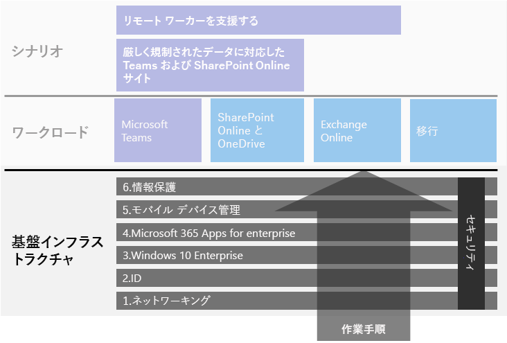
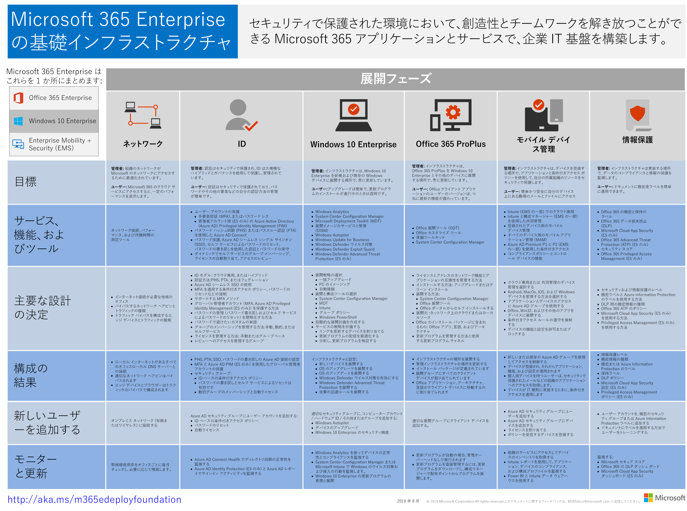

# Microsoft 365 Enterprise 基盤インフラストラクチャ

Microsoft 365 Enterprise のエンド ツー エンドの展開を自分で行う場合には、まず安全な環境でアプリケーションおよびサービスが創造性とチームワークを解き放つための強固な基盤を構築する必要があります。 この基盤は、*コア展開*と呼ばれることもあります。

定義されたエンドツーエンドの展開パスについて、これらのフェーズを使用して Microsoft 365 Enterprise の基盤インフラストラクチャを計画し展開することができます。

| | フェーズ | 結果 |
|:-------|:-----|:-----|
||[フェーズ 1: ネットワーク](networking-infrastructure.md)| ネットワークは、Microsoft 365 のクラウドベースのサービスへのアクセスに最適化されます。 |
||[フェーズ 2: ID](identity-infrastructure.md)| 管理者アカウントの保護と、ユーザーおよびグループの同期が行われ、強固なセキュリティによるユーザー認証が実現します。 |
||[フェーズ 3: Windows 10 Enterprise](windows10-infrastructure.md)| 既存の Windows ベースのコンピューターは Windows 10 Enterprise にアップグレードすることができ、新しいデバイスは Windows 10 Enterprise と共にインストールされます。 |
||[フェーズ 4: Microsoft 365 Apps for enterprise](office365proplus-infrastructure.md)| Microsoft Office を使用している既存のユーザーは、Microsoft 365 Apps for enterprise にアップグレードできます。 |
||[フェーズ 5: モバイル デバイス管理](mobility-infrastructure.md)| デバイスを登録し、管理することができます。 |
||[フェーズ 6: 情報保護](infoprotect-infrastructure.md)| Microsoft 365 のセキュリティ機能が有効になると、ラベルとポリシーを使用して、ドキュメントとメールを保護する準備が整います。 |

フェーズは最も基本的なもの (ネットワークと ID) から始めます。その後に、インフラストラクチャの設定とグループのレイヤーを作成し以下を実施します。

- 最新かつセキュリティで保護されたバージョンの Windows をデバイスにインストールし、最新状態を維持します。
- デバイスに最新バージョンの Microsoft Office をインストールし、最新状態を維持します。
- 組織のデバイスおよびデバイスのアプリへのアクセスを管理します。
- デバイス上およびクラウド内の情報を保護します。

また、IT リソースやビジネス ニーズに合わせて、フェーズそのものやフェーズ内の手順の構成を変えて臨機応変に実行することもできます。

- **小規模または新しい組織の場合**、次のフェーズにそって必要に応じてインフラストラクチャを体系的に構築します。 簡略化された非エンタープライズの展開については、[こちら](deploy-foundation-infrastructure-non-enterprises.md)をクリックしてください。

-  **企業組織の場合**、フェーズを定義されたパスではなく IT インフラストラクチャのレイヤーとして表示し、組織全体の各レイヤーに必要な条件に対して最終的に一番最適な方法を決定します。

各フェーズの最後には*終了条件*がありますので、その条件を確認するようにしてください。満たさなければならない必須条件、検討する必要があるオプションの条件を確認できます。 各フェーズの終了条件は、オンプレミスおよびクラウドのインフラストラクチャ、およびそのフェーズから得られるエンドツーエンドの構成が Microsoft 365 Enterprise の展開の要件を満たしているかどうかの判断基準となります。

以下の短時間のビデオでコンテンツの構造を確認できます。

> [!VIDEO https://www.microsoft.com/videoplayer/embed/RE23VRG]

以下が全体的な Microsoft 365 Enterprise の展開ガイドの基盤インフラストラクチャです。

## 概要

[Microsoft 365 Enterprise の基盤インフラストラクチャ ポスター](../media/deploy-foundation-infrastructure/Microsoft365EnterpriseFoundInfra.pdf)は、各フェーズで参照できる中心的な場所です。

- 管理者とユーザーのフェーズの全体的な目標
- サービス、機能、およびツール
- 計画の主な設計の決定
- 構成の結果
- 新しいユーザーのオンボード プロセス
- モニターと更新の方法

ポスターのコピーをダウンロードするには、[ここ](https://github.com/MicrosoftDocs/microsoft-365-docs/raw/public/microsoft-365/media/deploy-foundation-infrastructure/Microsoft365EnterpriseFoundInfra.pdf)をクリックします。

## インフラストラクチャの構成とユーザー ロールアウト

基盤インフラストラクチャは、構成済みのソフトウェアおよびサービスのセットであり、ユーザー向けに組み合わせると Microsoft 365 Enterprise が提供するすべての機能および保護を活用できます。 エンド ツー エンドの展開の最終目的は、お客様の全ユーザーとそのユーザーの Windows ベースのデバイスに基礎インフラストラクチャを適用することです。 

ただし、Microsoft 365 Enterprise 基盤インフラストラクチャはユーザーへのソフトウェアおよびサービスのロールアウトとは無関係であることに注意することが重要です。 ***基礎インフラストラクチャのレイヤーは、すべてのユーザーにロールアウトしなくても構成することができます。***

組織のオフィス、地域、あるいは部署の多数のユーザーにロールアウトする前に、基礎インフラストラクチャの要素を構成、テスト、試験運用することができます。

たとえば、以下を目的とした設定を行うことができます。

| フェーズ | 結果 |
|:-------|:-----|
| ID | アカウント同期と ID ベースの条件付きアクセス ポリシーのグループ。 |
| Windows 10 Enterprise | Windows 7 または Windows 8.1 を実行しているコンピューターを Windows 10 Enterprise に自動的にアップグレードするためのグループ。 |
| Microsoft 365 Apps for enterprise | Office 2010、Office 2013、または Office 2016 を使用しているユーザーに Microsoft 365 Apps for enterprise を自動的に展開するためのグループ。 |
| モバイル デバイス管理 | デバイス登録とデバイス ベースの条件付きアクセス ポリシーのグループ。 |
| 情報保護 | 機密度ラベルのグループ。 |

基礎インフラストラクチャの要素をユーザーにロールアウトする準備ができたら、以下を実施します。

| フェーズ | ロールアウト アクション |
|:-------|:-----|
| ID | ID ベースの条件付きアクセス ポリシーのグループにユーザー アカウントを追加します。 |
| Windows 10 Enterprise | グループにアカウントを追加して、Windows 7 または Windows 8.1 を使用しているユーザーに Windows 10 Enterprise を自動的に展開します。 |
| Microsoft 365 Apps for enterprise | ユーザー アカウントをグループに追加すると、Office 2010、Office 2013、または Office 2016 を使用しているユーザーに Microsoft 365 Apps for enterprise が自動的に展開されます。 |
| モバイル デバイス管理 | デバイス登録とデバイス ベースの条件付きアクセス ポリシーのグループにアカウントを追加します。 |
| 情報保護 | 機密ラベルのグループにユーザー アカウントを追加します。 |

基礎インフラストラクチャのフェーズと要素が完成し、テストおよび試験運用が行われると、ユーザーのビジネス目標と IT リソースに最も適した方法で、Windows 10 Enterprise および Microsoft 365 Apps for enterprise などのインストール済みソフトウェアと、デバイス登録および条件付きアクセス ポリシーなどのクラウドベースのサービスと保護をロールアウトすることができます。

## 展開およびプロジェクト管理の戦略

パイロット ユーザーおよび他の組織の基礎インフラストラクチャのさまざまなフェーズにおけるプロジェクト管理への取り組み方については、「[展開戦略](deployment-strategies-microsoft-365-enterprise.md)」を参照してください。

## 非エンタープライズの展開

組織の規模が小さく、Microsoft 365 for business が適していない場合は、「[非エンタープライズの展開](deploy-foundation-infrastructure-non-enterprises.md)」に記載されている簡略化された展開方法を参照してください。

## 次の手順

| 現在地 | 行く必要がある場所 |
|:-------|:-----|
| Office 365、Enterprise Mobility + Security (EMS)、または Windows 10 Enterprise の既存のインフラストラクチャがある場合 | 「[既存のインフラストラクチャを使用して展開する](deploy-with-existing-infrastructure.md)」から開始し、各フェーズの終了条件に進みます。 |
| エンタープライズとして最初から始めている | 「[フェーズ 1: ネットワーク](networking-infrastructure.md)」を参照して、エンド ツー エンドの展開を開始します。 |
| 非エンタープライズとして最初から始めている | 「[非エンタープライズの展開](deploy-foundation-infrastructure-non-enterprises.md)」を参照して、エンド ツー エンドの展開を開始します。 |
