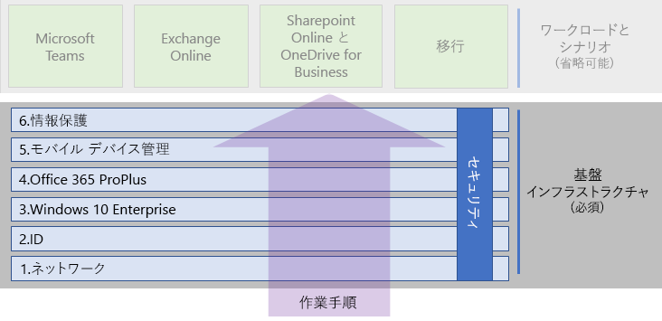
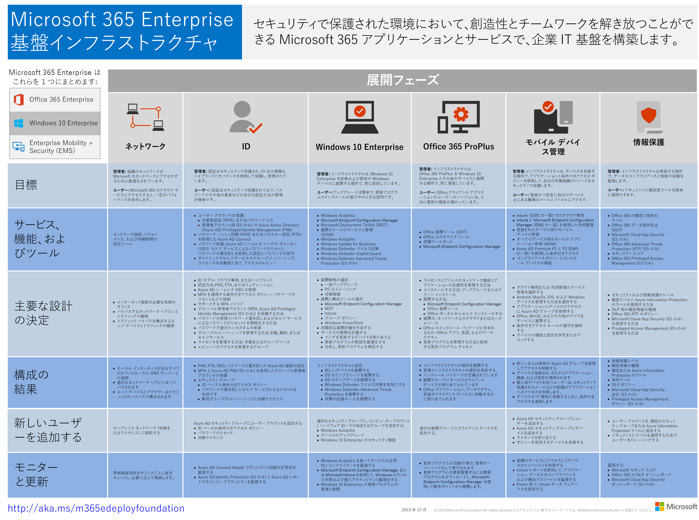

# Microsoft 365 Enterprise の基礎インフラストラクチャチャMicrosoft 365 Enterprise foundation infrastructure

Microsoft 365 Enterprise のエンド ツー エンドの展開を自分で行っている場合は、まずアプリケーションとサービスによる創造性とチームワークが安全な環境で発揮される強固な基盤を構築する必要があります。If you're doing the end-to-end deployment of Microsoft 365 Enterprise yourself, you should first build a firm foundation upon which applications and services can unlock creativity and teamwork in a secure environment. この基盤は、*コア展開*と呼ばれることもあります。This foundation is sometimes referred to as the core deployment.

展開に関して定義されたエンド ツー エンドのパスの次のフェーズを使用して Microsoft 365 Enterprise の基礎インフラストラクチャを計画して展開することができます。For a defined end-to-end path for deployment, you can use these phases to plan for and deploy the foundation infrastructure of Microsoft 365 Enterprise:

| | フェーズPhase | 結果Results |
|:-------|:-----|:-----|
||[フェーズ 1: ネットワークPhase 1: Networking](networking-infrastructure.md)| ネットワークは、Microsoft 365 のクラウドベースのサービスへのアクセスに最適化されます。Your network is optimized for access to Microsoft 365's cloud-based services. |
||[フェーズ 2: IDPhase 2: Identity](identity-infrastructure.md)| 管理者アカウントの保護と、ユーザーおよびグループの同期が行われ、強固なセキュリティによるユーザー認証が実現します。Your admin accounts are protected, your users and groups are synchronized, and your user authentication is strong. |
||[フェーズ 3: Windows 10 EnterprisePhase 3: Windows 10 Enterprise](windows10-infrastructure.md)| 既存の Windows ベースのコンピューターは Windows 10 Enterprise にアップグレードすることができ、新しいデバイスは Windows 10 Enterprise と共にインストールされます。Your existing Windows-based computers can upgrade to Windows 10 Enterprise and new devices are installed with Windows 10 Enterprise. |
||[フェーズ 4: Office 365 ProPlusPhase 4: Office 365 ProPlus](office365proplus-infrastructure.md)| Microsoft Office の既存のユーザーは Office 365 ProPlus にアップグレードすることができます。Your existing users of Microsoft Office can upgrade to Office 365 ProPlus. |
||[フェーズ 5: モバイル デバイス管理Phase 5: Mobile device management](mobility-infrastructure.md)| デバイスを登録し、管理することができます。Your devices can be enrolled and managed. |
||[フェーズ 6: 情報保護Phase 6: Information protection](infoprotect-infrastructure.md)| ラベルを使用してドキュメントを保護する準備が整い、Office 365 のセキュリティ機能が有効になります。Your labels are ready to protect documents and Office 365 security features are enabled. |

フェーズは最も基本的なもの (ネットワークと ID) から始めます。その後に、インフラストラクチャの設定とグループのレイヤーを作成し以下を実施します。The phases start with the most foundational (networking and identity), and then create layers of infrastructure settings and groups to:

- 最新かつセキュリティで保護されたバージョンの Windows をデバイスにインストールします。Install the most current and secure version of Windows on your devices.
- デバイスに最新バージョンの Microsoft Office をインストールします。Install the most current version of Office on your devices.
- 組織のデバイスを管理します。Manage your organization's devices.
- デバイス上およびクラウド内の情報を保護します。Protect the information on those devices and in the cloud.

また、IT リソースやビジネス ニーズに合わせて、フェーズそのものやフェーズ内の手順の構成を変えて臨機応変に実行することもできます。However, you have the flexibility of configuring and rolling out the phases or steps within phases to fit your IT resources and business needs.

- **小規模または新しい組織の場合**、次のフェーズにそって必要に応じてインフラストラクチャを体系的に構築します。**If you are a smaller or newer organization**, follow the phases as needed to methodically build out your infrastructure.

-  **企業組織の場合**、フェーズを定義されたパスではなく IT インフラストラクチャのレイヤーとして表示し、組織全体の各レイヤーに必要な条件に対して最終的に一番最適な方法を決定します。**If you are an enterprise organization**, view the phases as layers of IT infrastructure, rather than a defined path, and determine how to best work toward eventual adherence to the requirements for each layer across your organization.

各フェーズの最後に終了条件がありますので、この条件を確認するようにしてください。満たさなければならない必須条件、検討する必要があるオプションの条件を確認できます。At the end of each phase, you should examine its exit criteria, which include required conditions that you must meet and optional conditions to consider. 各フェーズの終了条件は、オンプレミスとクラウドのインフラストラクチャ、およびそのフェーズから得られるエンド ツー エンドの構成が、Microsoft 365 Enterprise 展開の要件を満たしているかどうかの判断基準となります。Exit criteria for each phase ensures that your on-premises and cloud infrastructure and resulting end-to-end configuration meet the requirements for a Microsoft 365 Enterprise deployment.

以下の短時間のビデオでコンテンツの構造を確認できます。To see how the content is structured, watch this short video.

> [!VIDEO https://www.microsoft.com/videoplayer/embed/RE23VRG]

以下が Microsoft 365 Enterprise の全体的な展開ガイドの基礎インフラストラクチャとなります。Here's the foundation infrastructure in the overall Microsoft 365 Enterprise deployment guide:

## 概要At-a-glance

[Microsoft 365 Enterprise の基盤インフラストラクチャのポスター](http://aka.ms/m365efoundinfraposter)は、各フェーズで参照できる中心的な場所です。The [Microsoft 365 Enterprise foundation infrastructure poster](http://aka.ms/m365efoundinfraposter) is a central location for you to view, for each phase:

- 管理者とユーザーのフェーズの全体的な目標The overall goals of the phase for administrators and users
- サービス、機能、およびツールThe services, features, and tools
- 計画の主な設計の決定The key design decisions for planning
- 構成の結果The configuration results
- 新しいユーザーのオンボード プロセスThe process for onboarding a new user
- モニターと更新の方法How to monitor and update

ポスターのコピーをダウンロードするには、[ここ](https://github.com/MicrosoftDocs/microsoft-365-docs/raw/public/microsoft-365/enterprise/media/deploy-foundation-infrastructure/Microsoft365EnterpriseFoundInfra.pdf)をクリックします。To download a copy of the poster, click [here](https://github.com/MicrosoftDocs/microsoft-365-docs/raw/public/microsoft-365/enterprise/media/deploy-foundation-infrastructure/Microsoft365EnterpriseFoundInfra.pdf).

## インフラストラクチャの構成とユーザー ロールアウトInfrastructure configuration vs. user rollout

構成されたソフトウェアとサービス一式が、基礎インフラストラクチャになります。これらのソフトウェアやサービスをユーザー向けに組み合わせることで、安全な環境で Microsoft 365 Enterprise が提供するすべての機能を利用することができます。The foundation infrastructure is a set of configured software and services that, when combined together for a user, allow them to take advantage of the entire spectrum of capabilities and protections that Microsoft 365 Enterprise offers. エンド ツー エンドの展開の最終目的は、お客様の全ユーザーとそのユーザーの Windows ベースのデバイスに基礎インフラストラクチャを適用することです。The ultimate destination of your end-to-end deployment journey is to have this infrastructure apply to all of your users and their Windows-based devices. 

ただし、Microsoft 365 Enterprise の基礎インフラストラクチャと、ユーザーへのソフトウェアおよびサービスのロールアウトは別のものになります。However, it is important to note that the Microsoft 365 Enterprise foundation infrastructure is independent of the rollout of software and services to your users. ***基礎インフラストラクチャのレイヤーは、すべてのユーザーにロールアウトしなくても構成することができます。******You can configure the layers of the foundation infrastructure without having to roll out those layers to all of your users.***

したがって、組織のオフィス、地域、あるいは部署の多数のユーザーにロールアウトする前に、基礎インフラストラクチャの要素を構成、テスト、試験運用することができます。Therefore, it is possible to configure, test, and pilot elements of the foundation infrastructure well ahead of the rollout of those elements to the multitude of your users in the offices, regions, or divisions of your organization.

たとえば、以下を目的とした設定を行うことができます。For example, you create the settings for:

| フェーズPhase | 結果Results |
|:-------|:-----|
| IDIdentity | アカウント同期と ID ベースの条件付きアクセス ポリシーのグループ。Account synchronization and groups for identity-based conditional access policies. |
| Windows 10 EnterpriseWindows 10 Enterprise | Windows 7 または Windows 8.1 を実行しているコンピューターを Windows 10 Enterprise に自動的にアップグレードするためのグループ。Groups to automatically upgrade computers running Windows 7 or Windows 8.1 to Windows 10 Enterprise in place. |
| Office 365 ProPlusOffice 365 ProPlus | Office 2010、Office 2013、または Office 2016 を使用しているユーザーに Office 365 ProPlus を自動的に展開するためのグループ。Groups to automatically deploy Office 365 ProPlus for users with Office 2010, Office 2013, or Office 2016. |
| モバイル デバイス管理Mobile device management | デバイス登録とデバイス ベースの条件付きアクセス ポリシーのグループ。Groups for device enrollment and device-based conditional access policies. |
| 情報保護Information protection | Office 365 秘密度および Azure Information Protection のラベルとグループ。Office 365 and Azure Information Protection labels and groups. |

基礎インフラストラクチャの要素をユーザーにロールアウトする準備ができたら、以下を実施します。When you are ready to rollout elements of this infrastructure to users, you:

| フェーズPhase | ロールアウト アクションRollout action |
|:-------|:-----|
| IDIdentity | ID ベースの条件付きアクセス ポリシーのグループにユーザー アカウントを追加します。Add user accounts to the groups for identity-based conditional access policies. |
| Windows 10 EnterpriseWindows 10 Enterprise | グループにアカウントを追加して、Windows 7 または Windows 8.1 を使用しているユーザーに Windows 10 Enterprise を自動的に展開します。Add accounts to the groups to automatically deploy Windows 10 Enterprise in place for users with Windows 7 or Windows 8.1. |
| Office 365 ProPlusOffice 365 ProPlus | ユーザー アカウントをグループに追加して、Office 2010、Office 2013、または Office 2016 を使用しているユーザーに Office 365 ProPlus を自動的に展開します。Add user accounts to the groups to automatically deploy Office 365 ProPlus for users with Office 2010, Office 2013, or Office 2016. |
| モバイル デバイス管理Mobile device management | デバイス登録とデバイス ベースの条件付きアクセス ポリシーのグループにアカウントを追加します。Add accounts to the groups for device enrollment and device-based conditional access policies. |
| 情報保護Information protection | 情報保護ラベルのグループにユーザー アカウントを追加します。Add user accounts to the groups for Information Protection labels. |

基礎インフラストラクチャが完成し、テストおよび試験運用が完了したら、Windows 10 Enterprise や Office 365 ProPlus などのインストール済みソフトウェアをロールアウトすることができます。デバイス登録や条件付きアクセス ポリシーなどのクラウドベースのサービスの運用も安全な環境で行えます。ビジネス目標と IT リソースに最も適した方法で、ユーザーに提供することができます。Once the foundation infrastructure is completed, tested, and piloted, you can roll out installed software, such as Windows 10 Enterprise and Office 365 ProPlus, and cloud-based services and protections, such as device enrollment and conditional access policies, to your users in the manner that best fits your business goals and IT resources.

## 展開およびプロジェクト管理の戦略Deployment and project management strategies

パイロット ユーザーおよび他の組織の基礎インフラストラクチャのさまざまなフェーズにおけるプロジェクト管理への取り組み方については、「[展開戦略](deployment-strategies-microsoft-365-enterprise.md)」を参照してください。To give you some ideas on how to approach the project management of the different phases of the foundation infrastructure for pilot users and the rest of your organization, see [deployment strategies](deployment-strategies-microsoft-365-enterprise.md).

## 非エンタープライズの展開Deployment for non-enterprises

組織の規模が小さく、Microsoft 365 Business が適していない場合は、「[非エンタープライズの展開](deploy-foundation-infrastructure-non-enterprises.md)」を参照してください。If your organization is smaller and Microsoft 365 Business is not suitable for you, see [deployment for non-enterprises](deploy-foundation-infrastructure-non-enterprises.md).

## 次の手順Next step

| 現在地Where I am | 行く必要がある場所Where I need to go |
|:-------|:-----|
| Office 365、Enterprise Mobility + Security (EMS)、または Windows 10 Enterprise の既存のインフラストラクチャがある場合I have existing infrastructure for Office 365, Enterprise Mobility + Security (EMS), or Windows 10 Enterprise: | [[既存のインフラストラクチャで展開する](deploy-with-existing-infrastructure.md)] から開始し、各フェーズの終了基準に進みます。Start with [Deploy with existing infrastructure](deploy-with-existing-infrastructure.md), which  steps you through the exit criteria for each phase. |
| エンタープライズとして最初から始めているI'm starting from scratch as an enterprise | 「[フェーズ 1: ネットワーク](networking-infrastructure.md)」を参照して、エンド ツー エンドの展開を開始します。Begin your end-to-end deployment journey with [Phase 1: Networking](networking-infrastructure.md). |
| 非エンタープライズとして最初から始めているI'm starting from scratch as a non-enterprise | 「[非エンタープライズの展開](deploy-foundation-infrastructure-non-enterprises.md)」を参照して、エンド ツー エンドの展開を開始します。Begin your end-to-end deployment journey with [Deployment for non-enterprises](deploy-foundation-infrastructure-non-enterprises.md). |
