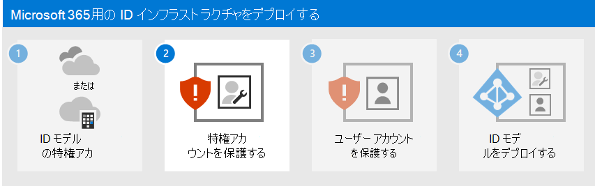

# 手順 1. クラウド ID モデルを決定する

Microsoft 365 では、Microsoft 365 サブスクリプションに含まれるクラウドベースのユーザー ID と認証サービスである Azure Active Directory (Azure AD) を使用して、Microsoft 365 の ID と認証を管理します。 組織の Microsoft 365 ユーザー アクセスとアクセス許可を管理するには、ID インフラストラクチャを正しく構成することが不可欠です。

開始する前に、Microsoft 365 の ID モデルと認証の概要についてこのビデオをご覧ください。

 

> [!VIDEO https://www.microsoft.com/videoplayer/embed/RE2Pjwu]

最初の計画の選択は、クラウド ID モデルです。

## Microsoft クラウド ID モデル

ユーザー アカウントを計画するには、まず Microsoft 365 の 2 つの ID モデルを理解する必要があります。 組織の ID はクラウド内でのみ管理することも、オンプレミスの Active Directory Domain Services (AD DS) ID を維持して、ユーザーが Microsoft 365 クラウド サービスにアクセスするときに認証に使用することもできます。

2 種類の ID と、その最適さと利点を次に示します。

| 属性 | クラウド専用 ID | ハイブリッド ID |
|:-------|:-----|:-----|
| **定義** | ユーザー アカウントは、Microsoft 365 サブスクリプションの Azure AD テナントにのみ存在します。 | ユーザー アカウントは AD DS に存在し、コピーは Microsoft 365 サブスクリプションの Azure AD テナントにも存在します。 Azure AD のユーザー アカウントには、既にハッシュされた AD DS ユーザー アカウントパスワードのハッシュバージョンも含まれる場合があります。 |
| **Microsoft 365 がユーザー資格情報を認証する方法** | Microsoft 365 サブスクリプションの Azure AD テナントは、クラウド ID アカウントを使用して認証を実行します。 | Microsoft 365 サブスクリプションの Azure AD テナントは、認証プロセスを処理するか、ユーザーを別の ID プロバイダーにリダイレクトします。 |
| **最適シナリオ** | オンプレミスの AD DS を持っていない、または必要ない組織。 | AD DS または別の ID プロバイダーを使用している組織。 |
| **最大の利点** | 使いやすいです。 追加のディレクトリ ツールやサーバーは必要ありません。 | ユーザーは、オンプレミスまたはクラウドベースのリソースにアクセスするときに同じ資格情報を使用できます。 |
||||

## クラウド専用 ID

クラウドのみの ID は、Azure AD にのみ存在するユーザー アカウントを使用します。 クラウドのみの ID は、通常、オンプレミス サーバーを持たない小規模な組織、または AD DS を使用してローカル ID を管理しない小規模な組織で使用されます。

クラウドのみの ID の基本的なコンポーネントを次に示します。

オンプレミスユーザーとリモート (オンライン) ユーザーの両方が、自分の Azure AD ユーザー アカウントとパスワードを使用して Microsoft 365 クラウド サービスにアクセスします。 Azure AD は、保存されたユーザー アカウントとパスワードに基づいて、ユーザー資格情報を認証します。

### 管理
ユーザー アカウントは Azure AD にのみ格納されるため、[Microsoft 365 管理センター](/admin)や[Windows PowerShell](manage-user-accounts-and-licenses-with-microsoft-365-powershell.md)などのツールを使用してクラウド ID を管理します。

## ハイブリッド ID

ハイブリッド ID では、オンプレミスの AD DS で作成され、Microsoft 365 サブスクリプションの Azure AD テナントにコピーがあるアカウントが使用されます。 ほとんどの変更は、 [特定のアカウント属性](/azure/active-directory/hybrid/reference-connect-sync-attributes-synchronized)を除き、一方向にのみフローします。 AD DS ユーザー アカウントに加えた変更は、Azure AD のコピーに同期されます。

Azure AD Connect では、継続的なアカウント同期が提供されます。 オンプレミス サーバー上で実行され、AD DS の変更が確認され、それらの変更が Azure AD に転送されます。 Azure AD Connect では、同期されるアカウントと、ハッシュされたバージョンのユーザー パスワード (パスワード ハッシュ同期 (PHS) と呼ばれる) を同期するかどうかをフィルター処理できます。

ハイブリッド ID を導入した場合、オンプレミスの AD DS がアカウント情報の信頼できるソースとなります。 つまり、主にオンプレミスで管理タスクを実行し、Azure AD に同期します。

ハイブリッド ID のコンポーネントを次に示します。

Azure AD テナントには、AD DS アカウントのコピーがあります。 この構成では、Microsoft 365 クラウド サービスにアクセスするオンプレミスユーザーとリモート ユーザーの両方が、Azure AD に対して認証を行います。

> [!NOTE]
> ハイブリッド ID のユーザー アカウントを同期するには、常に Azure AD Connect を使用する必要があります。 ライセンスの割り当てとグループ管理を実行し、アクセス許可を構成し、ユーザー アカウントを含むその他の管理タスクを実行するには、Azure AD で同期されたユーザー アカウントが必要です。

### Microsoft 365 のハイブリッド ID とディレクトリの同期

ビジネス ニーズと技術的要件に応じて、ハイブリッド ID モデルとディレクトリ同期は、Microsoft 365 を採用しているエンタープライズ顧客にとって最も一般的な選択肢です。 ディレクトリ同期を使用すると、Active Directory Domain Services (AD DS) で ID を管理でき、ユーザー アカウント、グループ、連絡先に対するすべての更新は、Microsoft 365 サブスクリプションの Azure Active Directory (Azure AD) テナントに同期されます。

>[!Note]
>AD DS ユーザー アカウントが初めて同期されると、自動的に Microsoft 365 ライセンスが割り当てられず、電子メールなどの Microsoft 365 サービスにアクセスできません。 最初に、使用場所を割り当てる必要があります。 次に、グループ メンバーシップを使用して、これらのユーザー アカウントに個別または動的にライセンスを割り当てます。
>

#### ハイブリッド ID の認証

ハイブリッド ID モデルを使用する場合、認証には次の 2 種類があります。

- マネージド認証

  Azure AD は、ローカルに格納されたハッシュバージョンのパスワードを使用して認証プロセスを処理するか、オンプレミスの AD DS によって認証されるオンプレミスのソフトウェア エージェントに資格情報を送信します。

- フェデレーション認証

  Azure AD は、認証を要求しているクライアント コンピューターを別の ID プロバイダーにリダイレクトします。

#### マネージド認証

管理されたサービス アカウントにはふたつのタイプがあります。

- パスワード ハッシュ同期

  Azure AD は認証自体を実行します。

- パススルー認証 (PTA)

  Azure AD には、認証を実行する AD DS があります。

##### パスワード ハッシュ同期

PHS では、AD DS ユーザー アカウントを Microsoft 365 と同期し、オンプレミスでユーザーを管理します。 ユーザー パスワードのハッシュは、ユーザーがオンプレミスとクラウドで同じパスワードを持つように、AD DS から Azure AD に同期されます。 これは、Azure AD で AD DS ID の認証を有効にする最も簡単な方法です。 

パスワードがオンプレミスで変更またはリセットされると、新しいパスワード ハッシュが Azure AD に同期され、ユーザーはクラウド リソースとオンプレミス リソースに対して常に同じパスワードを使用できるようになります。 ユーザー パスワードは、Azure AD に送信されたり、クリア テキストで Azure AD に保存されたりすることはありません。 Identity Protection などの Azure AD の一部の Premium 機能では、選択されている認証方法に関係なく PHS が必要です。
  
詳細については [、適切な認証方法の選択](/azure/active-directory/hybrid/choose-ad-authn) に関するページを参照してください。
  
##### パススルー認証 (PTA)

PTA では、1 つ以上のオンプレミス サーバーで実行されているソフトウェア エージェントを使用して Azure AD 認証サービスの簡単なパスワード検証を行い、AD DS でユーザーを直接検証します。 PTA では、AD DS ユーザー アカウントを Microsoft 365 と同期し、オンプレミスでユーザーを管理します。 

PTA を使用すると、ユーザーはオンプレミスのアカウントとパスワードを使用して、オンプレミスと Microsoft 365 の両方のリソースとアプリケーションにサインインできます。 この構成では、Azure AD にパスワード ハッシュを格納することなく、ユーザーのパスワードをオンプレミスの AD DS に対して直接検証します。 

PTA は、セキュリティ要件を持つ組織が、オンプレミスのユーザー アカウントの状態、パスワード ポリシー、およびログオン時間を直ちに適用する場合でもあります。 
  
詳細については [、適切な認証方法の選択](/azure/active-directory/hybrid/choose-ad-authn) に関するページを参照してください。
  
##### フェデレーション認証

フェデレーション認証は、主に、より複雑な認証要件を持つ大企業の組織向けです。 AD DS ID は Microsoft 365 と同期され、ユーザー アカウントはオンプレミスで管理されます。 フェデレーション認証では、ユーザーはオンプレミスとクラウドで同じパスワードを持ち、Microsoft 365 を使用するためにもう一度サインインする必要はありません。 

フェデレーション認証は、スマートカード ベースの認証やサード パーティの多要素認証などの追加の認証要件をサポートできます。通常、組織が Azure AD でネイティブにサポートされていない認証要件を持っている場合に必要です。
 
詳細については [、適切な認証方法の選択](/azure/active-directory/hybrid/choose-ad-authn) に関するページを参照してください。
  
サード パーティの認証および ID プロバイダーの場合、オンプレミスのディレクトリ オブジェクトは、主にサード パーティ ID プロバイダー (IdP) によって管理される Microsoft 365 およびクラウド リソース アクセスに同期される場合があります。 組織でサード パーティフェデレーション ソリューションを使用している場合は、サード パーティフェデレーション ソリューションが Azure AD と互換性がある場合に備えて、Microsoft 365 用のそのソリューションでサインオンを構成できます。
  
詳細については、 [Azure AD フェデレーションの互換性の一覧](/azure/active-directory/connect/active-directory-aadconnect-federation-compatibility) を参照してください。
  
### 管理

元の権限のあるユーザー アカウントはオンプレミスの AD DS に格納されるため、AD DS を管理するのと同じツールを使用して ID を管理します。

Microsoft 365 のMicrosoft 365 管理センターまたは PowerShell を使用して、Azure AD で同期されたユーザー アカウントを管理することはありません。

## 次のステップ

[手順 2 に](protect-your-global-administrator-accounts.md)進み、グローバル管理者アカウントをセキュリティで保護します。
