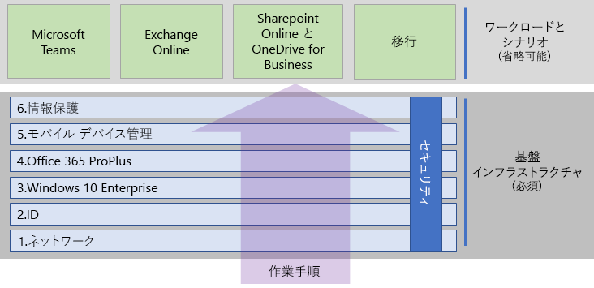

# Microsoft 365 Enterprise を展開するDeploy Microsoft 365 Enterprise

Microsoft 365 Enterprise は、ローカルおよびクラウドベースの生産性アプリとサービスを Windows 10 Enterprise と組み合わせたもので、次のような特徴があります。Microsoft 365 Enterprise is a combination of local and cloud-based productivity apps and services with Windows 10 Enterprise that:  

- インテリジェントなセキュリティを備えている。Has intelligent security.
- 簡素化のため統合されている。Is integrated for simplicity.
- 創造性を引き出す。Unlocks creativity.
- 共同作業向けに構築されている。Is built for teamwork.

これらのメリットは、3つの製品のライセンスを取得するだけで実現するのではなく、統合および最新のセキュリティを含む特定の方法で、製品と製品の機能を展開する事で実現できます。These benefits are not realized just by obtaining the licenses for the three products, but by deploying them and their features in a specific way that includes integration and state-of-the-art security.

Microsoft 365 Enterprise を展開するには、主に 3 つの方法があります。There are three main ways to deploy Microsoft 365 Enterprise:

- Microsoft 365 FastTrack を使用して Microsoft のエンジニアと操作する方法。Do it with Microsoft engineers using FastTrack for Microsoft 365.
- Microsoft Consulting Services または [Microsoft partner](https://partner.microsoft.com/) を使う方法。Do it with help from Microsoft Consulting Services or a [Microsoft partner](https://partner.microsoft.com/).
- Microsoft 365 Enterprise の展開ガイドを使って自分で操作する方法。Do it yourself with the Microsoft 365 Enterprise deployment guide.

## Microsoft 365 の FastTrackFastTrack for Microsoft 365

FastTrack は、お客様のペースに合わせたクラウドへの移行を手伝うために、Microsoft のエンジニアが配信する継続的かつ反復的なサービスです（サブスクリプションの一部として使用できます）。FastTrack is an ongoing and repeatable benefit—available as part of your subscription—that is delivered by Microsoft engineers to help you move to the cloud at your own pace. 必要に応じて、追加サービスを提供する認定パートナーにアクセスできます。FastTrack also gives you access to qualified partners for additional services. FastTrack はこれまで 40,000 を超えるお客様に対応し、ROI を最大化し、展開を迅速化し、組織全体での導入を支援してきました。With over 40,000 customers enabled to date, FastTrack helps maximize ROI, accelerate deployment, and increase adoption across your organization. 「[Microsoft 365 の FastTrack](https://fasttrack.microsoft.com/microsoft365)」を参照してください。See [FastTrack for Microsoft 365](https://fasttrack.microsoft.com/microsoft365).

FastTrack を利用して Microsoft 365 Enterprise を展開する場合は、基礎インフラストラクチャを展開および設定する方法のガイダンスとして FastTrack『[Microsoft 365 展開アドバイザー](https://aka.ms/microsoft365setupguide)』を使用できます。If you want to take advantage of FastTrack to deploy Microsoft 365 Enterprise, you can use the FastTrack [Microsoft 365 deployment advisor](https://aka.ms/microsoft365setupguide) for guidance on how to deploy and set up your foundation infrastructure. このページにアクセスするには、Office 365 または Microsoft 365 テナントのグローバル管理者としてサインインする必要があります。You must be signed in as a global administrator in an Office 365 or Microsoft 365 tenant to access this page.

[ここ](https://fasttrack.microsoft.com/microsoft365) をクリックして、FastTrackを使ってエンド ツー エンドの展開を始めましょう。Get started on your end-to-end deployment journey with FastTrack [here](https://fasttrack.microsoft.com/microsoft365).

## Microsoft 365 Enterprise の展開ガイドMicrosoft 365 Enterprise deployment guide

「Microsoft 365 Enterprise の展開ガイド」は、Microsoft 365 Enterprise の製品と機能に必要な設定をするための手順を示します。The Microsoft 365 Enterprise deployment guide steps you through the correct and required configuration of Microsoft 365 Enterprise products and features.

Microsoft 365 Enterprise を自分で展開するには: To deploy Microsoft 365 Enterprise yourself, you can:

- 最初に、管理の簡素化のための組み込みセキュリティと統合に必要な[基礎インフラストラクチャ](deploy-foundation-infrastructure.md)を展開します。これにより、クライアント ソフトウェアが最新の生産性拡張機能とセキュリティ強化機能で更新されます。Deploy the [foundation infrastructure](deploy-foundation-infrastructure.md) for built-in security and integration for simplified management, which makes it easier to ensure your client software is updated with the latest productivity and security enhancements. 
 
  基礎インフラストラクチャーは、互いに番号付けされたフェーズで編成され、Microsoft 365 Enterprise のワークロードとシナリオをサポートする環境のために作られています。The foundation infrastructure is organized as a series of numbered phases that build upon each other and towards an environment that supports Microsoft 365 Enterprise workloads and scenarios. 

  **小規模または新しい組織の場合**、次のフェーズにそってインフラストラクチャーを構築します。**If you are a smaller or newer organization**, follow the phases in order to methodically build out your infrastructure.

  必要に応じて、任意の順番でインフラストラクチャーのフェーズまたはフェーズの一部を展開することができます[交互または同時](deployment-strategies-microsoft-365-enterprise.md)。現在のインフラストラクチャーと統合するには、IT プランおよびリソースが適切で、ビジネスニーズを満たさなければなりません。However, you can deploy phases or the portions of phases of this infrastructure in any order as needed, [one after the other or in parallel](deployment-strategies-microsoft-365-enterprise.md), to integrate with your current infrastructure, fit your IT plans and resources, and meet your business needs. 

  **企業組織の場合**、フェーズをパスではなく IT インフラストラクチャーのレイヤーとして表示し、組織全体のレイヤーに必要な条件に対して最終的に一番いい方法を決定します。**If you are an enterprise organization**, view the phases as layers of IT infrastructure, rather than a defined path, and determine how to best work toward eventual adherence to the requirements of each layer across your organization.

- インフラストラクチャー上に主要な生産性[ワークロードとシナリオ](deploy-workloads.md) を展開します。Deploy key productivity [workloads and scenarios](deploy-workloads.md) on top of your infrastructure. これらは、組織内の独創性とチームワークを引き出します。These unlock creativity and teamwork in your organization.

ここに、基礎インフラストラクチャーとワークロードとシナリオの関係性を示します。Here's the relationship between the foundation infrastructure and the workloads and scenarios.

ワークロードとシナリオは、基礎インフラストラクチャー上で運用します。Workloads and scenarios operate over the top of the foundation infrastructure. ただし、生産性と共同作業の向上のためにワークロードを使用するのにすべての基礎インフラストラクチャー フェーズを満たす必要はありません。However, you do not have to have all of the foundation infrastructure phases built out to begin using workloads for productivity and collaboration.

[ここ](deploy-foundation-infrastructure.md)をクリックして、エンド ツー エンドの展開を始めましょう。Get self-started on your end-to-end deployment journey [here](deploy-foundation-infrastructure.md).

## 体験版の使用Take a test drive

“*何かを学ぶとき、実際にそれを行う事によって我々は学ぶ*”“*For the things we have to learn before we can do them, we learn by doing them.*” アリストテレス- Aristotle

初めての方は、まずご自分で操作してみるのが Microsoft 365 Enterprise や特定の製品、機能を理解する最善の方法の一つです。If you're new to Microsoft 365 Enterprise or to a specific product or feature, one of the best ways to gain understanding is to build it out yourself and see it working.

テスト ラボ ガイド (TLGs) を活用すれば、試用版や有料サブスクリプションを使って、分かりやすくインフラストラクチャーの設定や機能について知ることができます。We've made this easier with Test Lab Guides (TLGs), which step you through the configuration of infrastructure or a feature in a simplified but representative environment using trial or paid subscriptions.

TLGs を使用すると、自己学習、実例説明、カスタマイズすることができ、また複雑な設定のコンセプトの証明、ワークロード、またはエンド ツー エンドのシナリオをビルドできます。With TLGs, you can self-learn, demonstrate, customize, or build a proof of concept of a complex configuration, workload, or end-to-end scenario.

詳細については、「[Microsoft 365 Enterprise のテスト ラボ ガイド](m365-enterprise-test-lab-guides.md)」を参照してください。 For more information, see [Microsoft 365 Enterprise Test Lab Guides](m365-enterprise-test-lab-guides.md).

## 他のユーザーはどのように活用しましたか？How did others do it?

他のユーザーがどのように Microsoft 365 Enterprise を展開し、活用しているか知りたい場合は、これらのリソースを使います。Use these resources to understand how others have deployed and are using Microsoft 365 Enterprise.

### お客様の Microsoft 365 Enterprise の活用方法How customers use Microsoft 365 Enterprise

お客様導入事例のサイトを使用して、 Microsoft カスタマーによる Microsoft 365 Enterprise の使用方法をご覧ください。Use the Customer Stories site to see how Microsoft customers are using Microsoft 365 Enterprise.

1. [https://customers.microsoft.com/](https://customers.microsoft.com/) に移動して、[**検索**] をクリックします。Go to [https://customers.microsoft.com/](https://customers.microsoft.com/) and click **Search**.
2. 左側のウィンドウにある [**言語**] で使用する言語を選択します。In the left pane, select your language in **Language**.
3. [**業種**] で組織の業種を選択します。Select your organization's industry in **Industry**.
4. [**製品**] で [**Microsoft 365**] を選択します。Select **Microsoft 365** in **Product**.
5. お客様の導入事例を見るには、カードの上をクリックします。Click on a card for the customer's case study.
  

### Microsoft での Microsoft 365 Enterprise の活用方法How Microsoft uses Microsoft 365 Enterprise

デジタル企業文化を定義することは、最新の職場を促進するよう努めているすべてのリーダーにとって最優先です。　Defining a digital culture is a major priority for every leader who strives to foster a modern workplace. Microsoft 365 は、このような文化的なシフトをサポートするように設計されており、リーダーが、会社にいるすべての人の創造性と共同作業を解き放てるよう役立てています。Microsoft 365 was designed to support this kind of cultural shift, helping leaders empower everyone at their companies to unleash creativity and collaboration. Microsoft では、基本となるインフラストラクチャを確立することは、このようなデジタル文化へシフトするまさに火付け役となりました。At Microsoft, establishing our foundational infrastructure has sparked precisely this kind of digital culture shift. Microsoft 365 Enterprise を実装すると、Microsoft Teams や Exchange Online などの共同作業のテクノロジを展開し、セキュリティで保護された SharePoint イントラネット サイトのオンライン間での機密データを共有できるようになります。Implementing Microsoft 365 Enterprise has allowed us to deploy collaboration technology, like Microsoft Teams and Exchange Online, and to share sensitive data online across secure SharePoint intranet sites.

同時に、高度なセキュリティ機能と製品との統合は管理のニーズを効率化し、IT ライフ サイクル全体で総保有コストを最小限に抑えるのに役立ちます。At the same time, intelligent security features and product integration helps streamline management needs and minimize the total cost of ownership across the IT lifecycle. 

セキュリティで保護された環境で、創造性とチームワークの促進を解き放つサービスとアプリケーションをサポートするには、コア サービス エンジニア リングとオペレーション (旧称 Microsoft IT) [計画と基盤の展開](https://www.microsoft.com/en-us/itshowcase/deploying-and-managing-microsoft-365)で詳細を確認します。Learn how Core Services Engineering and Operations (formerly Microsoft IT) [planned and deployed a foundation](https://www.microsoft.com/en-us/itshowcase/deploying-and-managing-microsoft-365) to support the applications and services that unlock creativity and foster teamwork in a secure environment.

> [!Note]
> この web ページは、英語でのみ利用できます。This web page is only available in English.

### Contoso Corporation の Microsoft 365 Enterprise 展開方法How the Contoso Corporation deployed Microsoft 365 Enterprise

架空の企業、Contoso Corporation は、フランスのパリに本社を置く、代表的な世界規模の製造業の複合企業です。The Contoso Corporation is a fictional but representative global manufacturing conglomerate with its headquarters in Paris, France. [Contoso 社が Microsoft 365 Enterprise を展開](contoso-case-study.md)して、ネットワーク、ID、Windows 10 Enterprise、Office 365 ProPlus、モバイル デバイス管理、情報保護そしてセキュリティに関する主な設計上の決定と実装の詳細に、どのように対処したか参照してください。See how [Contoso deployed Microsoft 365 Enterprise](contoso-case-study.md) and addressed major design decisions and implementation details for networking, identity, Windows 10 Enterprise, Office 365 ProPlus, mobile device management, information protection, and security. 

## 次に、Microsoft 365 Enterprise を展開するNext step to deploy Microsoft 365 Enterprise

Microsoft サポートをご希望の場合は、[FastTrack](https://fasttrack.microsoft.com/microsoft365)をご利用下さい。To do it with direct Microsoft assistance, use [FastTrack](https://fasttrack.microsoft.com/microsoft365).

コンサルタントをご希望の場合は、Microsoft Consulting Services または [Microsoft partner](https://partner.microsoft.com/) へご連絡ください。To do it with a consultant, contact Microsoft Consulting Services or a [Microsoft partner](https://partner.microsoft.com/).

自分で操作する場合は、[基礎インフラストラクチャー](deploy-foundation-infrastructure.md)を参照してください。To get started doing it yourself, see the [foundation infrastructure](deploy-foundation-infrastructure.md).
