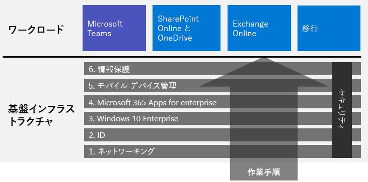
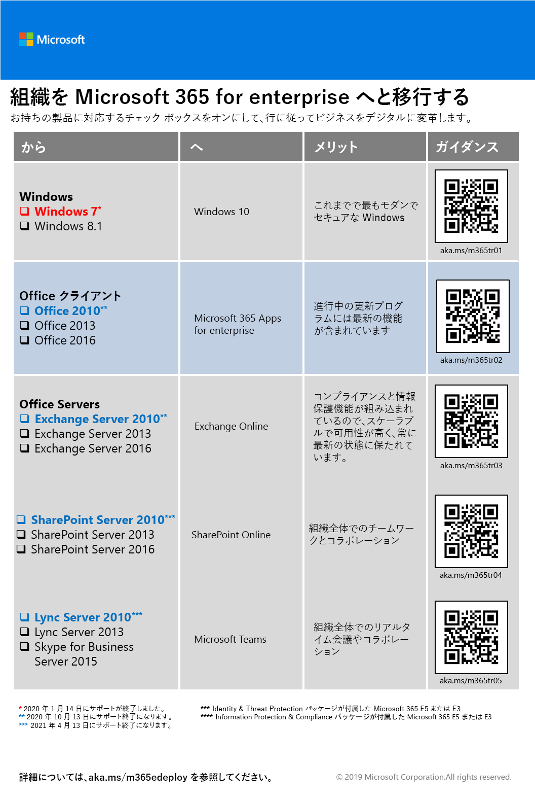

# Microsoft 365 Enterprise の展開

Microsoft 365 Enterprise は、ローカルおよびクラウドベースの生産性向上アプリとサービスを Windows 10 Enterprise と組み合わせたもので、次のような特徴があります。  

- インテリジェントなセキュリティを備えている。
- 簡素化のため統合されている。
- 創造性を引き出す。
- 共同作業向けに構築されている。

ユーザーは、最先端のセキュリティ サービスと機能が含まれる統合的な手法で、インフラストラクチャと生産性ワークロードを展開することにより、これらの利点を得ることができます。

Microsoft 365 Enterprise を展開するには、主に 3 つの方法があります。

- [Microsoft 365 の FastTrack](#fasttrack-for-microsoft-365) を使用して、Microsoft のエンジニアと一緒に操作する方法。
- Microsoft Consulting Services または [Microsoft partner](https://partner.microsoft.com/) を使う方法。
- [Microsoft 365 Enterprise 展開ガイド](#microsoft-365-for-enterprise-deployment-guide) を使って自分で行う方法。

## Microsoft 365 の FastTrack

FastTrack は、自分のペースでクラウドへと移行できるよう、Microsoft のエンジニアによって提供される継続的かつ反復的なサービスです（*サブスクリプションの一部として無料で利用できます*）。 必要に応じて、追加サービスを提供する認定パートナーにアクセスできます。 FastTrack はこれまで 40,000 を超えるお客様に対応し、ROI を最大化し、展開を迅速化し、組織全体での導入を支援してきました。 「[Microsoft 365 の FastTrack](https://fasttrack.microsoft.com/microsoft365)」を参照してください。

FastTrack を利用して Microsoft 365 Enterprise を展開する場合には、基盤インフラストラクチャを展開および設定する方法のガイダンスとして FastTrack [Microsoft 365 展開アドバイザー](https://aka.ms/microsoft365setupguide)を使用できます。 このページにアクセスするには、Office 365 または Microsoft 365 テナントのグローバル管理者としてサインインする必要があります。

[ここ](https://fasttrack.microsoft.com/microsoft365) をクリックして、FastTrackを使ってエンド ツー エンドの展開を始めましょう。

## Microsoft 365 Enterprise 展開ガイド

「Microsoft 365 Enterprise 展開ガイド」は、Microsoft 365 Enterprise の製品および機能に必要な設定をするための手順を示します。

Microsoft 365 Enterprise を自分で展開するには: 

- 最初に、管理の簡素化のための組み込みセキュリティと統合に必要な[基礎インフラストラクチャ](deploy-foundation-infrastructure.md)を展開します。これにより、クライアント ソフトウェアが最新の生産性拡張機能とセキュリティ強化機能で更新されます。 
 
  基盤インフラストラクチャーは互いに番号付けされたフェーズで編成され、Microsoft 365 Enterprise のワークロードおよびシナリオをサポートする環境に向けて作られています。 

  **小規模または新しい組織の場合**、次のフェーズにそってインフラストラクチャーを構築します。

  必要に応じて、任意の順番でインフラストラクチャーのフェーズまたはフェーズの一部を展開することができます[交互または同時](deployment-strategies-microsoft-365-enterprise.md)。現在のインフラストラクチャーと統合するには、IT プランおよびリソースが適切で、ビジネスニーズを満たさなければなりません。 非エンタープライズの簡略化された展開については、[ここ](deploy-foundation-infrastructure-non-enterprises.md) をクリックしてください。

  **企業組織の場合**、フェーズをパスではなく IT インフラストラクチャーのレイヤーとして表示し、組織全体のレイヤーに必要な条件に対して最終的に一番いい方法を決定します。

- インフラストラクチャー上に主要な生産性[ワークロードとシナリオ](deploy-workloads.md) を展開します。 これらは、組織内の独創性とチームワークを引き出します。

ここに、基礎インフラストラクチャーとワークロードとシナリオの関係性を示します。

ワークロードとシナリオは、基礎インフラストラクチャー上で運用します。 ただし、生産性と共同作業の向上のためにワークロードを使用するのにすべての基礎インフラストラクチャー フェーズを満たす必要はありません。

[ここ](deploy-foundation-infrastructure.md)をクリックして、エンド ツー エンドの展開を始めましょう。

## 体験版の使用

“*何かを学ぶとき、実際にそれを行う事によって我々は学ぶ*” アリストテレス

Microsoft 365 Enterprise を初めて使用する場合、または特定の製品や機能を初めて使用する場合、理解を深めるための最良の方法の 1 つはそれを自分自身で構築し、動作を確認することです。

テスト ラボ ガイド (TLGs) を活用すると、試用版や有料サブスクリプションを使用して、簡潔であるが代表的なテスト環境のインフラストラクチャーの設定や機能についてより簡単に学べます。

TLGs を使用すると、複雑な構成、ワークロード、またはエンド ツー エンドのシナリオの概念実証 (PoC) の自己学習、実行、カスタマイズ、または構築を行うことができます。

詳細については、「[Microsoft 365 Enterprise のテスト ラボ ガイド](m365-enterprise-test-lab-guides.md)」を参照してください。 

## 組織全体の移行

組織全体を Microsoft 365 Enterprise の製品とサービスに移行する方法についてより良く理解するためには、「[組織を Microsoft 365 に移行する](../media/deploy-microsoft-365-enterprise/transition-org-to-m365.pdf)」を参照してください。

このポスター (見開き 2 ページ) で簡単に既存のインフラストラクチャのインベントリを作成し、Microsoft 365 Enterprise に対応する製品またはサービスに移行するためのガイダンスへとアクセスします。 Windows と Office の製品、その他のインフラストラクチャ、それから、デバイス管理、ID、情報および脅威保護などのセキュリティ要素が含まれます。

[移行ポスターをダウンロード](https://github.com/MicrosoftDocs/microsoft-365-docs/raw/public/microsoft-365/media/deploy-microsoft-365-enterprise/transition-org-to-m365.pdf)して、レター形式、リーガル形式、またはタブロイド形式 (11 x 17) で印刷することもできます。

## 他のユーザーはどのように活用しましたか？

他のユーザーがどのように Microsoft 365 Enterprise を展開し、活用しているか知りたい場合は、これらのリソースを使います。

### お客様の Microsoft 365 Enterprise の活用方法

お客様導入事例のサイトを使用して、 Microsoft ユーザーによる Microsoft 365 Enterprise の使用方法をご覧ください。

1. [https://customers.microsoft.com/](https://customers.microsoft.com/) に移動して、[**検索**] をクリックします。
2. 左側のウィンドウにある [**言語**] で使用する言語を選択します。
3. [**業種**] で組織の業種を選択します。
4. [**製品**] で [**Microsoft 365**] を選択します。
5. お客様の導入事例を見るには、カードの上をクリックします。

### Microsoft での Microsoft 365 Enterprise の活用方法

デジタル企業文化を定義することは、近代的な職場づくりに努めているすべてのリーダーにとって優先すべき重要課題です。　 この種の文化的なシフトをサポートするために設計された Microsoft 365 では、会社のすべての人々の力となり、自由な創造性と共同作業を育むリーダーを支援しています。 Microsoft の基本となるインフラストラクチャを確立することが、まさにこの種のデジタル文化へのシフトを引き起こしてきました。 Microsoft 365 Enterprise を実装することで Microsoft Teams や Exchange Online のような共同作業テクノロジを展開し、セキュリティで保護された SharePoint イントラネット サイト間でオンラインの機密データを共有できるようになりました。

同時に、高度なセキュリティ機能と製品との統合は管理のニーズを効率化し、IT ライフ サイクル全体で総保有コストを最小限に抑えるのに役立ちます。 

Core Services Engineering and Operations (以前の Microsoft IT) で [Microsoft 365 でモダン ワークプレースが構築された方法](https://www.microsoft.com/ja-JP/itshowcase/microsoft-365)について説明します。

> [!Note]
> この web ページは、英語でのみ利用できます。

### Contoso Corporation の Microsoft 365 Enterprise 展開方法

架空の企業、Contoso Corporation は、フランスのパリに本社を置く、代表的な世界規模の製造業の複合企業です。 どのように [Contoso 社が Microsoft 365 Enterprise を展開](contoso-case-study.md)し、ネットワーク、ID、Windows 10 Enterprise、Microsoft 365 Apps for enterprise、モバイル デバイス管理、情報保護およびセキュリティに関する主な設計上の決定および実装の詳細に対処したかをご覧ください。 

## 展開コンテンツについての最新情報を得る

コンテンツの最新の変更内容については、[この記事](microsoft-365-deploment-guide-changes.md) を参照してください。

## 次の手順

Microsoft サポートをご希望の場合は、[FastTrack](https://fasttrack.microsoft.com/microsoft365)をご利用下さい。

コンサルタントをご希望の場合は、Microsoft Consulting Services または [Microsoft partner](https://partner.microsoft.com/) へご連絡ください。

自分で操作する場合は、[基礎インフラストラクチャー](deploy-foundation-infrastructure.md)を参照してください。
