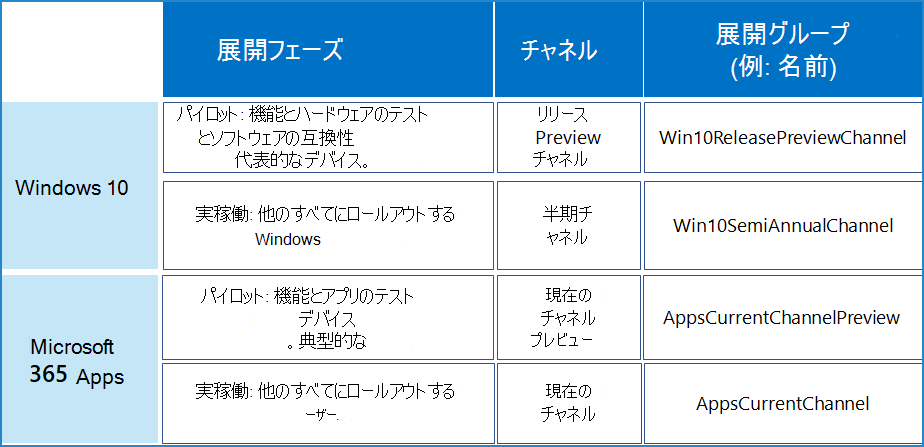

# 最新リリースの幅広い展開例

このチャネル構成例は、次のビジネスの優先度に適合するように、最新のリリースの迅速な展開を使用する組織を対象としています。

- Microsoft のアプリとサービスにより、事業の継続性を確立できます。
- デバイス、サービス、データセキュリティを最大限に活用するための Microsoft の最新の機能と修正プログラムを提供します。
- Microsoft の最新機能で、ユーザーの生産性を最大にします。

このような目標のために、ITタスクには、迅速な運用展開と、ユーザーとデバイスの代表的なサブセットによる早期審査との間のバランスを見つけ、広範な展開の前に機能的に検証するということが課せられます。

私たちの組織の例として、ヨーロッパ、アフリカ、アジア、南北アメリカなど世界中に5,000人の従業員がいます。 従業員の70% が Microsoft 365 E3 を使用しており、その他の残りの組織で Microsoft 365 E5 を使用しています。

>[!Note]
>この例では、さまざまな種類や規模の組織で利用できる展開ステージとグループの使用方法について説明します。　　　
>

組織の IT インフラストラクチャ: 

- Windows、Microsoft 365 アプリ、およびインストールされているベースの60% を構成する Microsoft クラウドサービスの主な機能です。　 ITインフラストラクチャを簡素化および合理化するための数年にわたる努力の結果、いくつかのレガシーシステムが残っています。
- 経験豊富なスタッフが管理し、リリースの際、Microsoftのリードによって、ユーザーとデバイスの生産性と安全性を維持することを任されています。

## 展開と更新のステージ

この組織例では、最新のリリースの迅速な導入目標に基づいて、、2段階の展開プロセスを使用しています。　

1. **プレビューやパイロット展開を使用する：** 早期導入者、IT スタッフ、代表的な構成を使用しているユーザー、トレーニングスタッフと検証および反復します。　　 

   早期導入者、IT スタッフ、および代表的な構成を使用しているユーザーは、新しい機能が組織の他の部分に展開される前に、他のアプリやデバイスで機能を検証できます。

   この新機能は、導入変更マネージャーは、広範囲にわたるロールアウトの前に新機能を早い段階で確認し、メッセージングとロールアウトが計画できます。

   トレーニングスタッフは、広範囲にロールアウトする前に、新しい内部コースを計画したり、新機能に関しては、既存のコースを更新したりできます。

2. **運用展開：** 地域、部署、またはその他の導入方法によって、すべての残りのユーザーにロールアウトます。　　

## Windows 10 の展開構成

全体的な目標は、代表的なユーザーとそのデバイスのグループによるリリースプレビューチャネルの変更の検証後に、最新の半期チャネルリリースの広範な展開を実行することです。

Windows 10の展開方法と戦略の詳細については、[Windows 10 の展開](/windows/deployment/)を参照してください。

| ステージ | チャネル | 展開グループ |
|:-------|:-------|:-----|
| パイロット |  **リリースプレビューチャネル**  <ul><li>目的: 機能更新プログラムを IT スタッフと早期導入者に展開し、代表的なデバイスと構成 (言語、サードパーティ製アプリ) の検証をします。　　　 </li><li> 状態: 商用顧客に対して完全に準拠し、サポートされており、サポート契約には該当しません。 </li></ul> | **Win10リリースプレビューチャネル** (名前の例)    メンバーは以下を含むグループになります： <ul><li> 部門や場所を越えた Windows 愛好家 </li><li> 検証が必要な構成を持つスタッフ </li><li> IT 管理者と IT 展開スタッフ </li><li> 導入変更マネージャー </li><li> 社内トレーニングスタッフ </li></ul> |
| 生産 |  **半期チャネル**  <ul><li>目的: 最新の機能更新を組織の他のユーザーに広く展開します。　　 </li><li> 状態: 完全に準拠し、サポートされています。 </li></ul> | **Win10半期チャネル** (名前の例)    メンバーは、Win10ReleasePreviewChannel グループに属していないすべてのユーザーです。 |
||||

この組織では、Windows Update や Windows Server Update Services などの半期単位のチャネルのリリースを展開する場合と同じ方法で、リリースプレビューチャネルペイロードを展開するベストプラクティスを使用しています。また、両方のチャネル更新に同じポリシーを適用します。　

継続的な更新のプロセス:

1. リリースプレビューチャネルの変更は、Win10リリースプレビューチャネル (仮の名前) 展開グループに展開されます。
2. Win10リリースプレビューチャネルグループメンバーは、リリースプレビューチャネルの変更がIT導入スタッフにより取り組まれていることを確認します。IT 導入スタッフは、Microsoft にフィードバックを提供し、追加の検証のために次のリリースプレビューチャネルの変更を待つことができます。
3. 半期チャネル機能の変更がは、Win10半期チャネル展開グループに展開されます。 

>[!Note]
>半期チャネルは推奨されるチャネルですが、IT の部署は、管理ツールを使用して、組織内に最新の半期チャネルのリリースを展開してからロールバックする時期を決定する必要があります。　　　
>

## Microsoft 365 アプリの展開構成

全体的な目標は、代表的なユーザーグループが現在のチャネル（プレビュー）の変更を検証した後に、最新の現在のチャネルリリースの広範な展開を実行することです。

Microsoft 365 アプリの展開方法と戦略の詳細については、[Microsoft 365 アプリの 展開 ](/deployoffice/plan-office-365-proplus)を参照してください。

| ステージ | チャネル | 展開グループ |
|:-------|:-------|:-----|
| パイロット |  **最新機能提供チャネル (プレビュー)** <ul><li> 目的: {代表的なユーザーのグループに新しいMicrosoft 365 Apps機能のスニーク ピークを提供する} 現在のチャネル (プレビュー) ユーザーでテストされ、運用準備ができたらすぐに機能更新プログラムを展開します。 </li><li> 状態: 完全に準拠し、サポートされています。</li><li> 頻度: 月に2-3 回更新します。 </li></ul> | **AppsCurrentChannelPreview** (名前の例)    メンバーは以下を含むグループになります： <ul><li> 部門や場所を越えた Office アプリ愛好家 </li><li> 検証が必要な構成を持つスタッフ </li><li> IT 管理者と IT 展開スタッフ </li><li> 導入変更マネージャー </li><li> 社内トレーニングスタッフ </li></ul>|
| 生産 | **最新機能提供チャネル** <ul><li> 目的: 最新の機能更新を組織の他のユーザーに広く展開します。　　 </li><li> 状態: 完全に準拠し、サポートされています。 </li></ul> |  **アプリ最新機能提供チャネルプレビュー** (名前の例)    メンバーは、AppsCurrentChannelPreview グループに属していないすべてのユーザーです。 |
|||

継続的な更新のプロセス:

1. 現在のチャネル (プレビュー) の変更は アプリ最新機能提供チャネルプレビュー展開グループに展開されます。
2. アプリ最新機能提供チャネルプレビューグループメンバーは、現在のチャネル (プレビュー) の変更が IT 導入スタッフによって取り組まれていることを確認します。 Microsoft にフィードバックを送信して、その他の検証のための最新のチャネル (プレビュー) リリースをお待ちください。
3. 現在のチャネルの変更は アプリ最新機能提供チャネルプレビュー展開グループに展開されます。 

## 視覚的な概要

この組織例で使用されている製品、チャネル、展開グループを次に示します。 

## 関連項目

[展開および更新プログラム チャネルの構成例](deploy-update-channels-examples.md)

[Microsoft 365 for enterprise の概要](microsoft-365-overview.md)

[テスト ラボ ガイド](m365-enterprise-test-lab-guides.md)