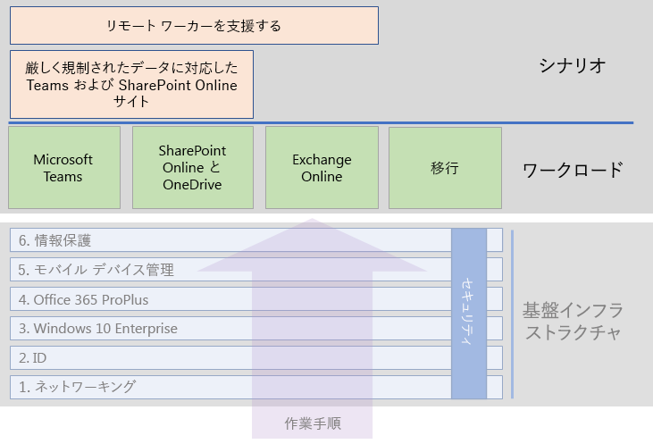

# Microsoft 365 Enterprise のワークロード

Microsoft 365 Enterprise の創造性およびチームワークに関するメリットを得るには、これらのワークロードを基盤インフラストラクチャに展開します。

- [Microsoft Teams](teams-workload.md)
- [Exchange Online](exchangeonline-workload.md)
- [SharePoint および OneDrive](sharepoint-online-onedrive-workload.md)

組織全体を Microsoft 365 Enterprise に移行するための一般的なロードマップについては、[移行](migration-microsoft-365-enterprise-workload.md)に関する記事を参照してください。それには Microsoft Office クライアント製品、オンプレミス Office サーバー製品、および Microsoft Windows ベースのデバイスが含まれます。

全体的な Microsoft 365 Enterprise 展開ガイドのワークロードは次のとおりです。

## 基盤インフラストラクチャの前提条件

*理想的には*、[基盤インフラストラクチャ](deploy-foundation-infrastructure.md)のすべてのフェーズを設定した後で、ワークロードを展開する必要があります。 これにより、基になるすべての基盤レイヤーがユーザーとそのデバイスに対して統合、セキュリティ、および最適な操作性を提供できるようになります。

| フェーズ | 結果 |
|:-------|:-----|
| ネットワーク | Microsoft 365 のクラウド サービスに対して最適なパフォーマンスを得るためにネットワークが更新されます。 |
| ID | ユーザー アカウントの強力な認証と管理アカウントの保護により、ID は同期されセキュリティで保護されます。 |
| Windows 10 Enterprise | Windows 7 または Windows 8.1 を実行しているコンピューターは Windows 10 Enterprise にアップグレードすることができ、新しいデバイスは Windows 10 Enterprise と共にインストールされます。 |
| Microsoft 365 Apps for enterprise | Microsoft Office を使用している既存のユーザーは、Microsoft 365 Apps for enterprise にアップグレードできます。 |
| モバイル デバイス管理 | デバイスを登録し、管理することができます。 |
| 情報保護 | Office 365 の情報保護機能が構成されると、機密ラベルまたは Azure Information Protection ラベルでドキュメントを保護する準備が整います。 |

これは理想的であり、計画、構成、テスト、およびパイロットのために時間がかかる場合があることに注意してください。特に既存のインフラストラクチャで複数の場所が対象になる大規模な組織が該当します。 すべての場所でこれらのフェーズを完了させることは、Microsoft 365 Enterprise からビジネス上の価値をより迅速に得るためには必要ありません。 

すぐに展開するための一般的なワークロードを以下に示します。 

- 基盤インフラストラクチャの **ID** フェーズがユーザーにロールアウトされた後で、多くの組織は以下を展開します。
  - [OneDrive](https://docs.microsoft.com/onedrive/plan-onedrive-enterprise) と統合された [Microsoft 365 Apps for enterprise](office365proplus-infrastructure.md)。 Microsoft 365 Apps for enterprise は、先進的な認証のセキュリティと最新の Microsoft Office クライアントのユーザー エクスペリエンスを提供します。 ユーザーの個人用ファイルを OneDrive に移行すると、インフラストラクチャが削減され、ホーム フォルダーとドライブをサポートする必要性が少なくなります。
  - [Exchange Online](exchangeonline-workload.md)。ユーザーはクラウド ベースのメールの使用できるようになります。
- 厳しく規制されたデジタル資産をすぐにクラウドに保存する必要がない場合は、**情報保護**フェーズの前に [Microsoft Teams](teams-workload.md) と [SharePoint](sharepoint-online-onedrive-workload.md) をユーザー向けに展開します。

ビジネス ニーズを満たすように、基盤インフラストラクチャの前提となるフェーズの設定について最適な順序と展開を決定する必要があります。

### ベスト プラクティス

ユーザーを何らかのワークロードまたはシナリオに参加させる前に、基盤インフラストラクチャの **ID** フェーズを展開しロールアウトすることを強く推奨します。

**ID** フェーズでは、クラウド ベースの ID は、クラウド専用であるかオンプレミスの Active Directory Domain Services (AD DS) と同期されているかにかかわらず、認証とアクセスの管理のためにユーザーおよびコンピューター アカウントとグループを含むようになります。 Microsoft 365 クラウドに組織のデジタル資産を配置する前に、すべてのユーザーの強力な認証のほか管理者アカウントの強力な保護が必要です。

全体的なパフォーマンスにとって基本的かつ非常に重要なことですが、Microsoft 365 のワークロードとサービスのパフォーマンスが時間と共に向上することを考慮すると、ユーザーをワークロードに参加させながら **ネットワーキング** フェーズのロールアウトを進行させることができます。 これは特に複数の場所とエッジ デバイスとインターネット接続が混在する企業にあてはまります。
