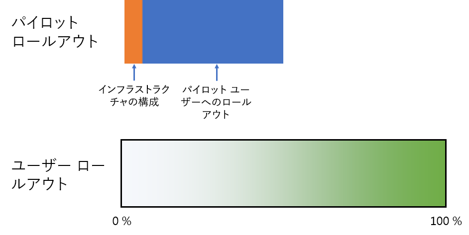
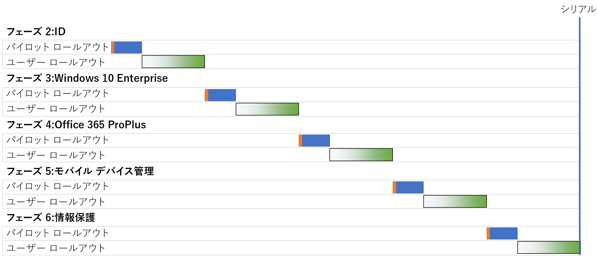
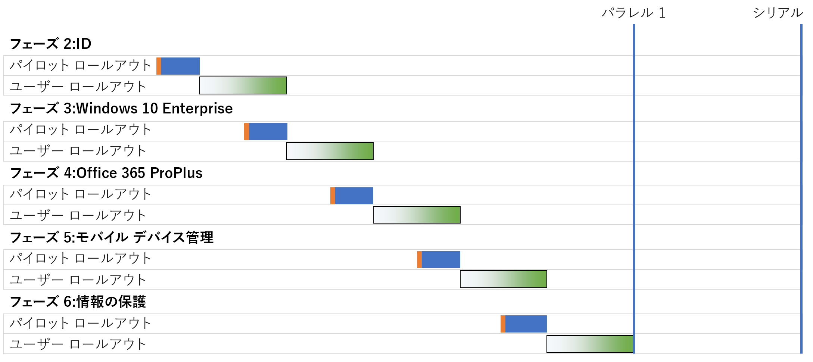

# Microsoft 365 Enterprise の基盤インフラストラクチャの展開戦略

Microsoft 365 Enterprise の[基盤インフラストラクチャ](deploy-foundation-infrastructure.md)の各フェーズを展開し、その機能、ソフトウェア、サービスをユーザーにロールアウトする方法は数多くあります。この仕事のプロジェクト管理に取り掛かることは、組織と既存のインフラストラクチャの規模によっては大がかりで複雑な作業になる可能性があるので、次のような展開戦略を考慮してください。

- 順次展開
- ユーザー ロールアウトが重複しない並列展開
- ユーザー ロールアウトが重複する並列展開
- 事前のインフラストラクチャとエンド ツー エンド構成のロールアウト

プロジェクト全体を管理し、より迅速に Microsoft 365 Enterprise のビジネス上のメリットを実現する方法について着想を得るために、これらの戦略を使用します。

>[!Note]
>この記事には、展開戦略を一貫した方法で説明するための想定と簡略化が含まれています。これらの展開戦略は一般論を述べたものであり、何らかの特定の時間枠を示唆したり、すべての組織と状況に適用したりすることを意図してはいません。
>

## 一般的な企業組織向けの IT プロジェクト管理の要素

IT インフラストラクチャには、バックエンド サービスと、新しい機能や改善された機能またはインストールされたソフトウェアのエンド ユーザーへのロールアウトの両方が含まれています。通常、IT 部門は、系統的な方法で IT インフラストラクチャの各要素を展開します。IT インフラストラクチャの各要素の展開を成功させる方法の 1 つは、次のように構成されます。

- パイロット ロールアウト 

  これには、初期のインフラストラクチャ構成と、一連のパイロット ユーザーへのロールアウト、インフラストラクチャ構成のテストとそれ以降の変更が含まれます。

- ユーザー ロールアウト

  これには、地域、部門、グループ、または他の種類の、構成やソフトウェアの体系的な伝達経路に基づく、組織の残りの部分への展開が含まれます。

パイロット ロールアウト内のユーザーのセットは、ユーザー ロールアウト内のユーザーのセットとは異なります。

この資料では、次の図を使用して、これらの定義を示します。 

 

ユーザー ロールアウトの図の網かけは、グループ、部門、地域などの構造化または系統的アプローチを使用する、組織全体におけるパーセンテージ (0% から 100%) を示します。

## 展開戦略

以下の展開戦略を考慮します。

- 順次展開
- ユーザー ロールアウトが重複しない並列展開
- ユーザー ロールアウトが重複する並列展開
- 事前のインフラストラクチャとエンド ツー エンド構成のロールアウト

### 順次展開

順次展開では、次のフェーズに移る前にすべてのユーザーへの展開が 100% 完了に達するように、1 フェーズを完全にロールアウトします。この方法で展開を行う理由としては、次のようなものがあります。

- リスクの軽減
- リソースの制約
- IT 部門の予算サイクル
- IT テクノロジの依存関係
- ビジネスの変更管理とエンド ユーザーからの抵抗

次のガント チャートでは、Microsoft 365 Enterprise の基盤インフラストラクチャのフェーズ 2 から 6 の簡略化された順次展開を示しています。

 
 
説明と例を簡単にするために、各フェーズと、各フェーズ内の展開セグメントは、同じ時間がかかると想定しています。

>[!Note]
>フェーズ 1: Microsoft 365 Enterprise 基盤インフラストラクチャのネットワークは、IT 部門専用の段階です。ユーザーは Microsoft のクラウド リソースへの最適化された接続のメリットを享受しますが、それを達成することが課されているわけではありません。
>

パイロット ユーザー エクスペリエンスの簡単な例:

- 12 月に、MFA 用にスマート フォンを使用する必要があります。(ユーザー情報)
- 3 月に、Windows 8.1 デスクトップに Windows 10 Enterprise がインストールされます。(Windows 10 Enterprise)
- 6 月に、Office 2013 に代わって Office 365 ProPlus がインストールされます。(Office 365 ProPlus)
- 9 月に、デバイス登録とアプリを取得し、条件付きアクセス ポリシーが適用されます。(モバイル デバイス管理)
- 12 月には Azure Information Protection クライアントがインストールされて、ドキュメントにラベルを適用する方法のトレーニングを受けます。(情報の保護)

結果は、連続するパイロット ロールアウトの間で 90 日間の間隔になります。

エンド ユーザー エクスペリエンスの簡単な例:

- 1 月に、MFA 用にスマート フォンを使用する必要があります。(ユーザー情報)
- 4 月に、Windows 8.1 デスクトップに Windows 10 Enterprise がインストールされます。(Windows 10 Enterprise)
- 7 月に、Office 2013 に代わって Office 365 ProPlus がインストールされます。(Office 365 ProPlus)
- 10 月に、デバイス登録とアプリを取得し、条件付きアクセス ポリシーが適用されます。(モバイル デバイス管理)
- 翌年の 1 月には Azure Information Protection クライアントがインストールされて、ドキュメントにラベルを適用する方法のトレーニングを受けます。(情報の保護)

結果は、連続するユーザー ロールアウトの間で 90 日間の間隔になります。

この展開戦略の欠点は、Microsoft 365 Enterprise の基盤インフラストラクチャを完全に展開するのに時間がかかることです。

### ユーザー ロールアウトが重複しない並列展開 (並列 1)

この展開戦略では、ユーザー ロールアウトの現在のフェーズの最後の部分の間に、次のフェーズのパイロット ロールアウトを開始します。前のフェーズのユーザー ロールアウトと重なる形でパイロット ロールアウトが発生する場合の、フェーズ 2 から 6 の展開を以下に示します。

並列展開戦略と順次展開戦略との簡単な比較を示します。

 
 
最終結果としては、次のフェーズが始まる前に、組織全体で現在のフェーズのユーザー ロールアウトが完了します。パイロット ロールアウトに含まれないユーザーは、同時に複数のフェーズのロールアウトで処理されることはありませんが、パイロット ロールアウトはユーザー ロールアウトと並行して処理されます。

パイロット ユーザー エクスペリエンスの簡単な例: 

- 12 月に、MFA 用にスマート フォンを使用する必要があります。(ユーザー情報)
- 2 月に、Windows 8.1 デスクトップに Windows 10 Enterprise がインストールされます。(Windows 10 Enterprise)
- 4 月に、Office 2013 に代わって Office 365 ProPlus がインストールされます。(Office 365 ProPlus)
- 6 月に、デバイス登録とアプリを取得し、条件付きアクセス ポリシーが適用されます。(モバイル デバイス管理)
- 8 月には Azure Information Protection クライアントがインストールされて、ドキュメントにラベルを適用する方法のトレーニングを受けます。(情報の保護)

結果は、連続するパイロット ロールアウトの間で 60 日間の間隔になります。

エンド ユーザー エクスペリエンスの簡単な例:

- 1 月に、MFA 用にスマート フォンを使用する必要があります。(ユーザー情報)
- 3 月に、Windows 8.1 デスクトップに Windows 10 Enterprise がインストールされます。(Windows 10 Enterprise)
- 5 月に、Office 2013 に代わって Office 365 ProPlus がインストールされます。(Office 365 ProPlus)
- 7 月に、デバイス登録とアプリを取得し、条件付きアクセス ポリシーが適用されます。(モバイル デバイス管理)
- 9 月には Azure Information Protection クライアントがインストールされて、ドキュメントにラベルを適用する方法のトレーニングを受けます。(情報の保護)

結果は、連続するユーザー ロールアウトの間で 60 日間の間隔になります。

この展開戦略の利点は、Microsoft 365 Enterprise の基盤インフラストラクチャを完全に展開するのにかかる時間が短いことです。IT 部門とユーザーが同時に複数のロールアウトを処理することも求められません。

### ユーザー ロールアウトが重複する並列展開 (並列 2)

この展開戦略では、以下の要領で開始します。

- ユーザー ロールアウトの現在のフェーズの最後の部分の間に、次のフェーズのパイロット ロールアウトを開始します。
- 現在のフェーズのユーザー ロールアウト中に、次のフェーズのユーザー ロールアウトを開始します。ただし、どのユーザーも同時に複数のフェーズのロールアウトを処理することがないようにします。これは、基盤インフラストラクチャの各フェーズのロールアウトを同じ方法で (地域、部門、その他を介して) 行うことが前提となります。

各種の展開戦略の簡単な比較を示します。

 

最終結果は次のようになります。

- パイロット ロールアウトは、1 つのフェーズから次のフェーズへ休みなく移行します。
- あるフェーズのユーザー ロールアウトは、前のフェーズのユーザー ロールアウトの完了前に開始しますが、個々のユーザーが同時に複数のフェーズをロールアウトすることはありません。

パイロット ユーザー エクスペリエンスの簡単な例: 

- 12 月に、MFA 用にスマート フォンを使用する必要があります。(ユーザー情報)
- 1 月に、Windows 8.1 デスクトップに Windows 10 Enterprise がインストールされます。(Windows 10 Enterprise)
- 2 月に、Office 2013 に代わって Office 365 ProPlus がインストールされます。(Office 365 ProPlus)
- 3 月に、デバイス登録とアプリを取得し、条件付きアクセス ポリシーが適用されます。(モバイル デバイス管理)
- 4 月には Azure Information Protection クライアントがインストールされて、ドキュメントにラベルを適用する方法のトレーニングを受けます。(情報の保護)

結果は、連続するパイロット ロールアウトの間で 30 日間の間隔になります。

エンド ユーザー エクスペリエンスの簡単な例:

- 1 月に、MFA 用にスマート フォンを使用する必要があります。(ユーザー情報)
- 2 月に、Windows 8.1 デスクトップに Windows 10 Enterprise がインストールされます。(Windows 10 Enterprise)
- 3 月に、Office 2013 に代わって Office 365 ProPlus がインストールされます。(Office 365 ProPlus)
- 4 月に、デバイス登録とアプリを取得し、条件付きアクセス ポリシーが適用されます。(モバイル デバイス管理)
- 5 月には Azure Information Protection クライアントがインストールされて、ドキュメントにラベルを適用する方法のトレーニングを受けます。(情報の保護)

結果は、連続するユーザー ロールアウトの間で 30 日間の間隔になります。

この展開戦略の利点は、Microsoft 365 Enterprise 基盤のインフラストラクチャを完全に展開するのにかかる時間がさらに短いことです。やはり、個々のユーザーが同時に複数のロールアウトを処理することも求められません。ただし、ユーザーは連続するフェーズ間で休みを取ることはできません。

### 事前のインフラストラクチャとエンド ツー エンド構成のロールアウト

フェーズ 2 から 6 を 1 つの展開セグメントに圧縮することができる、小規模な組織の場合には、結果の展開は次のようになります。
 
 

IT 部門はフェーズ 2 から 6 のインフラストラクチャを構成してから、エンド ツー エンド機能を確認するためにパイロット ユーザーにロールアウトします。たとえば、パイロット ユーザーは以下のすべての機能を同時に取得します。

- MFA とその他の ID 機能 (ユーザー情報)
- Windows デバイス上の Windows 10 Enterprise (Windows 10 Enterprise)
- Office スイート用の Office 365 ProPlus (Office 365 ProPlus)
- アプリと条件付きアクセス ポリシー (モバイル デバイス管理)
- Azure Information Protection クライアントのインストールと、ドキュメントにラベルを適用する方法のトレーニング (情報の保護)

パイロット ロールアウトが終了したら、ユーザーのロールアウトを開始します。その際、各ユーザーがすべての機能を同時に取得します。

## 次の手順

[基盤インフラストラクチャ](deploy-foundation-infrastructure.md)を使用して Microsoft 365 Enterprise の展開を開始します。
