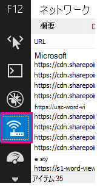
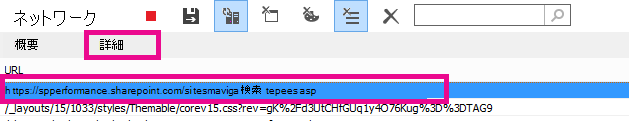

# SharePoint Online のパフォーマンスの問題の診断

この記事では、Internet Explorer 開発者ツールを使用して、SharePoint Online サイトに関する一般的な問題を診断する方法について説明します。
  
SharePoint Online サイトのページでカスタマイズのパフォーマンスに問題があることを特定するには、4 つの異なる方法があります。

- サイトとページのパフォーマンス診断
  
- F12 ツール バーネットワーク モニター

- カスタマイズされていないベースラインとの比較

- SharePoint Online 応答ヘッダー メトリック

このトピックでは、これらの各メソッドを使用してパフォーマンスの問題を診断する方法について説明します。 問題の原因を見つけたら、見つけることができるSharePointパフォーマンスの向上に関する記事を使用してソリューションにhttps://aka.ms/tune取り組むことができます。  

## Microsoft 365 管理 センターからサイトとページのパフォーマンス診断を使用する

> [!NOTE]
> 管理者であり、SharePointのパフォーマンスに問題がある場合は、以下の **[テストの実行**] を選択します。これにより、Microsoft 365 管理 センターのサイトとページパフォーマンスの診断が設定されます。 これらのテストでは、構成を確認し、テナントのSharePointパフォーマンスを向上させるための次の手順を迅速に推奨します。
>> [!div class="nextstepaction"]
>> [テストの実行: SharePointパフォーマンスを確認する](https://aka.ms/PillarSiteandPagePerf)

> [!NOTE] 
> この機能は、Microsoft 365 Government、Microsoft 365 21Vianet、またはMicrosoft 365ドイツでは使用できません。
  
## F12 ツール バーを使用して SharePoint Online のパフォーマンスを診断する

この記事では、Internet Explorer 11 を使用します。 他のブラウザーの F12 開発者ツールのバージョンは、若干異なる場合がありますが、同様の機能を備えています。 F12 開発者ツールの詳細については、次を参照してください。
  
- [F12 ツールの新機能](/previous-versions/windows/internet-explorer/ie-developer/dev-guides/bg182632(v=vs.85))

- [F12 開発者ツールの使用](/previous-versions/windows/internet-explorer/ie-developer/samples/bg182326(v=vs.85))

開発者ツールを起動するには **、F12** キーを押し、Wi-Fi アイコンをクリックします。
  

  
[ **ネットワーク** ] タブで、緑色の再生ボタンを押してページを読み込みます。 このツールは、要求したページを取得するためにブラウザーが要求するすべてのファイルを返します。 次のスクリーンショットは、そのようなリストの 1 つを示しています。
  

  
このスクリーンショットに示すように、右側のファイルのダウンロード時間も確認できます。
  

  
これにより、ファイルの読み込みにかかった時間を視覚的に表現できます。 緑色の線は、ページをブラウザーでレンダリングする準備が整った時点を表します。 これにより、サイトのページ読み込みが遅くなる可能性があるさまざまなファイルを簡単に表示できます。
  
## SharePoint Online のカスタマイズされていないベースラインを設定する

サイトのパフォーマンスの弱点を特定する最善の方法は、SharePoint Online で完全に既定のサイト コレクションを設定することです。 この方法で、サイトのさまざまな側面を、ページのカスタマイズなしで取得できるものと比較できます。 OneDrive for Businessホーム ページは、カスタマイズを行う可能性が低い別のサイト コレクションの良い例です。
  
## 応答ヘッダー情報SharePoint表示する

SharePoint Online では、各ファイルの応答ヘッダーでブラウザーに送信される情報にアクセスできます。 パフォーマンスの問題の診断に最も役立つ値は **SPRequestDuration** で、要求がサーバーで処理された時間を表示します。 これは、要求が負荷が高く、リソースが集中しているかどうかを判断するのに役立ちます。 これは、サーバーがページにサービスを提供するために行っている作業の量に関する最良の洞察です。

### SharePoint応答ヘッダー情報を表示するには
  
1. F12 ツールがインストールされていることを確認します。 これらのツールのダウンロードとインストールの詳細については、「 [F12 ツールの新機能](/previous-versions/windows/internet-explorer/ie-developer/dev-guides/bg182632(v=vs.85))」を参照してください。

2. F12 ツールの [ **ネットワーク** ] タブで、緑色の再生ボタンを押してページを読み込みます。

3. ツールから返された .aspx ファイルのいずれかをクリックし、[詳細] をクリック **します**。

    
  
4. [**応答ヘッダー**] をクリックします。

    
  
## SharePoint Online のパフォーマンスの問題の原因は何ですか?

[SharePoint Online のナビゲーション オプション](navigation-options-for-sharepoint-online.md)に関する記事では、SPRequestDuration 値を使用して、複雑な構造ナビゲーションが原因でページの処理に長い時間がかかったことを確認する例を示しています。 ベースライン サイトの値を (カスタマイズなしで) 取得することで、特定のファイルの読み込みに時間がかかっていないかどうかを判断できます。 [SharePoint Online のナビゲーション オプション](navigation-options-for-sharepoint-online.md)で使用される例は、メインの .aspx ファイルです。 そのファイルには、ページ読み込みに対して実行される ASP.NET コードの大部分が含まれています。 使用するサイト テンプレートによっては、ホーム ページをカスタマイズする場合は、start.aspx、home.aspx、default.aspx、または別の名前を指定できます。 この数がベースライン サイトより大幅に大きい場合は、パフォーマンスの問題の原因となっている複雑な問題がページに存在することを示しています。
  
サイト固有の問題を特定したら、パフォーマンスの低下の原因を特定する推奨される方法は、ページのカスタマイズなど、考えられるすべての原因を排除し、それらを 1 つずつサイトに追加することです。 ページのパフォーマンスが高い十分なカスタマイズを削除したら、特定のカスタマイズを 1 つずつ追加できます。
  
たとえば、複雑なナビゲーションがある場合は、ナビゲーションを変更してサブサイトを表示しないようにしてから、開発者ツールを確認して、これが違いを生むかどうかを確認します。 または、大量のコンテンツ のロールアップがある場合は、ページから削除して、これが改善されるかどうかを確認してください。 考えられるすべての原因を排除し、それらを一度に 1 つずつ追加し直す場合は、最大の問題である機能を簡単に特定し、ソリューションに向けて作業できます。
