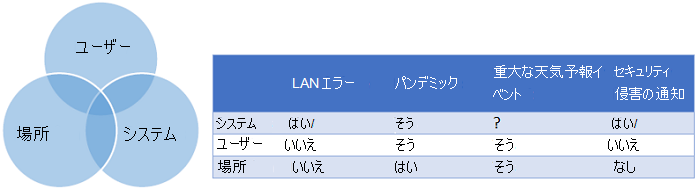

# エンタープライズ ビジネス継続性管理の顧客とクラウド パートナーの責任Enterprise business continuity management customer and cloud partner responsibilities

ユーザーに Microsoft 365 クラウド サービスを提供することは、組織と Microsoft とのパートナーシップです。Getting Microsoft 365 cloud services to your users is a partnership between your organization and Microsoft. Microsoft はサービスを提供します。顧客は、クライアント エンドポイントの接続、ID とアクセスの管理、およびそれらのサービスの使用方法について責任を負います。Microsoft provides the services and you are responsible for connecting your client endpoints, managing identity and access and how those services are used. ID やディレクトリ インフラストラクチャなどの責任も共有されます。There are shared responsibilities, such as the identity and directory infrastructure as well. この記事では、サービス インシデントが発生した場合にビジネスを機能させるために注意する必要のある重要な項目をいくつか取り上げ、Microsoft がサービス インシデントの発生時に何をするかに関する期待を設定するのに役立ちます。This article covers some of the critical items you need to be mindful of to keep your business functioning in the event of a service incident and it helps set expectations as to what Microsoft will do during a service incident.

## サービス インシデントの発生時の透明性Transparency during service incidents

信頼できるパートナーとして、Microsoft は復元力の高いクラウド サービスを構築し、構造化された手順に従ってサービス インシデントを解決します。As a trusted partner, Microsoft  builds highly resilient cloud services and follows structured procedures to resolve service incidents when they happen. サービス インシデントが発生したときには、**タイムリー**で**対象範囲の限定された\*\*\*\*高可用性**の通信が、顧客にとって不可欠であることを Microsoft は認識しています。When a service incident occurs, Microsoft recognizes that **timely**, **targeted**, and **highly available** communications are critical for customers.

## タイムリーTimely
Microsoft は、Microsoft 365 管理ポータルでテナント固有のサービス正常性ダッシュボード (SHD) を更新することで、Microsoft 365 管理者への通知を実施します。Microsoft notifies Microsoft 365 administrators by updating the tenant-specific Service Health Dashboard (SHD) in the Microsoft 365 Admin Portal. サービス インシデントの更新は通常、1 時間ごとに提供されます。Service incident updates are normally provided on an hourly cadence. また、別の時間設定が必要な場合は、SHD 通信投稿の変更をお知らせします。If a different cadence is needed we'll keep you informed of the change in the SHD communication postings.

## 対象範囲の限定Targeted
ほとんどの場合、監視システムが問題を検出すると、影響を受けた顧客ベースを 1 つの顧客から地域またはそれ以上まで特定し、必要な通信をそれらの顧客に送信できます。In most cases, when our monitoring systems detect an issue, we can identify the affected customer base, from a single customer up to region or beyond and direct the necessary communications to those customers. これにより、ビジネスに必要な情報を把握でき、影響のないノイズ通知に煩わされることはありません。This helps you know what you need to know for your business and not be distracted by noise notifications that don't impact you. たとえば、特定のメールボックス データベースが影響を受ける場合、影響を受けるインフラストラクチャにユーザーがいるかどうかを正確に特定し、そのユーザーとの通信範囲を設定できます。For example, if a specific mailbox database is impacted, we're able to identify exactly which customers have users on the affected infrastructure and scope our communications to them. インシデントの影響範囲が明確でない場合、影響を受ける可能性のある最も幅広い顧客グループに通信を拡大します。If the scope of impact of the incident is unclear, we expand our communications out to the widest group of customers who are potentially impacted.

## 高可用性Highly available
Microsoft は、顧客が使用できるサービス状態通信用の複数のチャネルを維持しています。Microsoft maintains multiple channels for service status communications that customers can use.

- 管理センターまたは管理センター内のサービス正常性ダッシュボードが使用できない場合、[バックアップ サイト](https://status.office365.com/)を使用してサービス状態を監視できます。In the event the Admin center or the Service Health Dashboard within the Admin center are unavailable, you can monitor the service status using our [backup site](https://status.office365.com/).
- Twitter アカウント [@MSFT365Status](https://twitter.com/msft365status?lang=en) を維持し、SHD の影響に関する報告と投稿の更新に対応します。We maintain a Twitter account [@MSFT365Status](https://twitter.com/msft365status?lang=en) where we will respond to reports of impact and post updates on SHD impacting events.
- Microsoft 365 テナント管理者向けの管理アプリには、外出先で組織の Microsoft 365 サービスの状態に接続する機能が設けられています。The Admin App for Microsoft 365 tenant administrators gives you the ability to connect with your organization's Microsoft 365 service status on the go. テナントの管理者は、モバイル デバイスにサービス正常性の情報とメンテナンス状態の更新情報を表示できます。Tenant administrators will have the ability to view service health information and maintenance status updates from their mobile devices. 詳細については、「[管理アプリ FAQ](https://docs.microsoft.com/office365/admin/admin-overview/admin-mobile-app?view=o365-worldwide)」を参照してください。For more information, visit the [Admin App FAQ](https://docs.microsoft.com/office365/admin/admin-overview/admin-mobile-app?view=o365-worldwide).
- [Microsoft 365 サービス通信 API](https://docs.microsoft.com/office365/servicedescriptions/office-365-platform-service-description/service-health-and-continuity#office-365-service-communications-api) を使用すると、サービス通信にアクセスできるため、環境をより簡単に監視できます。The [Microsoft 365 Service Communications API](https://docs.microsoft.com/office365/servicedescriptions/office-365-platform-service-description/service-health-and-continuity#office-365-service-communications-api) enables you to access service communications so you can more easily monitor your environment. API に接続し、リアルタイムのサービス正常性データを受信し、内部ダッシュボードで情報を公開して、エンタープライズ ユーザーにインシデントを通知できます。You can connect to the API, receive real-time service health data, and publish the information on an internal dashboard to inform enterprise users of incidents. 内部に情報を配信すると、停止中のヘルプデスクのトラフィックを減らすことができます。Distributing the information internally can decrease your helpdesk traffic during an outage.
- 重大なインシデントについては、Microsoft は管理センター内の SHD にインシデントの事後レビュー (PIR) を公開します。For major incidents, Microsoft publishes Post Incident Reviews (PIR) to the SHD within the Admin center. PIR には、停止の性質を理解できる重要なインシデント情報が含まれています。PIRs contain key incident information to help you understand the nature of the outage. 通常、次のセクションが含まれます。It generally contains the following sections:
    - ユーザーへの影響user impact
    - 影響の範囲scope of impact
    - インシデントの開始終了日時incident start-end date and time
    - 根本原因root cause
    - 実行された処理actions taken
    - 次の手順next steps
- Microsoft 365 メッセージ センターでは、今後の変更、新機能、計画的なメンテナンスの通知などの補助的な通信を利用できます。Ancillary communications are available in the Microsoft 365 Message Center, such as notices of upcoming changes, new features, or planned maintenance.
- 詳細については、「[サービス正常性と継続性ガイド](https://docs.microsoft.com/office365/servicedescriptions/office-365-platform-service-description/service-health-and-continuity)」を参照し、さまざまな通信チャネルとサービス正常性を監視する方法の詳細について確認してください。For more information, see the [Service Health and Continuity guide](https://docs.microsoft.com/office365/servicedescriptions/office-365-platform-service-description/service-health-and-continuity) to learn more about the different communication channels and how to monitor service health.
 
Microsoft 365 オンライン サービスへのアクセスを提供することは、組織と Microsoft とのパートナーシップです。Providing access to Microsoft 365 online services is a partnership between your organization and Microsoft. 次の図は、サービス インシデントの発生時および通常の運用時の Microsoft と顧客の両方の責任のバランスについてまとめたものです。The following chart summarizes the balance of responsibility for both Microsoft and the customer during a service incident and during regular operations.

## 環境 - サービス継続性Your environment - service continuity
継続計画について考えるときは、組織に影響を与える可能性のあるイベントと、全体的な通信の能力に注意してください。When thinking about your continuity plan, be mindful of events which may impact your organization and it's overall ability to communicate. 高レベルでは、ビジネスに影響を与える可能性のある 3 つの要因があります。At a high level there are three factors that could impact your business.

### 複数のユーザーPeople
自然災害やパンデミックなど、従業員に影響を与えるイベントを検討します。Consider events that would cause impact to your workforce like a natural disaster or a pandemic. これは見過ごされがちです。従業員が広範囲に分散している場合、大規模な影響が生じる可能性が低いためです。This is often overlooked, due to the unlikely nature of a broad-scale impact if your workforce is widely distributed. しかし、多くの従業員がオフラインだった場合、ビジネスは継続しますか?But, if a large percentage of the workforce were offline, would your business continue to operate? どのようにそれを軽減しますか?How do you mitigate that?

### 場所Location
多くの組織では、エンタープライズ システムとクラウド サービスに接続するために、従業員が特定の物理的またはネットワークの場所にいる必要があります。Many organizations require employees to be in specific physical or network locations in order to connect to enterprise systems and cloud services.  
Microsoft は、クラウド リソースへのネットワーク接続を設定するためのベスト プラクティスを企業に説明する「[ネットワーク接続の原則](https://docs.microsoft.com/office365/enterprise/office-365-network-connectivity-principles)」を公開しています。Microsoft publishes [network connectivity principles](https://docs.microsoft.com/office365/enterprise/office-365-network-connectivity-principles) that guide enterprises through best practices for setting up network connectivity to cloud resources. 最適化の例には、スプリット トンネル VPN の実装が含まれ、VPN トンネル経由ではなくユーザーのネットワークから直接接続できるようになります。Examples of optimization include implementation of split tunnel VPNs to allow connections directly from a user’s network rather than over a VPN tunnel.  これらの接続の原則は、接続の遅延を低く維持するために重要ですが、サービスの復元力には、一般的なコラボレーションのために企業リソースに接続する代替方法が必要です。While these connectivity principles are important for maintaining low-latency connections, service resiliency requires alternative methods of connecting to corporate resources for general collaboration.

### システムSystems
多くのコラボレーション ソリューションは、企業のワイド エリア ネットワーク (WAN) などのシステムに依存しています。Many collaboration solutions are dependent on systems, such as the company wide area network (WAN). これらのシステムが利用できない場合、組織はどのように対応しますか?When those systems are not available, how would your organization respond?
この図は、複数の領域に影響を与える可能性のある問題を表しています。This graphic represents issues that may impact more than one area. 添付の表は、考慮すべき例を示すThe accompanying table provides examples to consider

継続計画では、これらの各領域を考慮する必要があります。Your continuity plans should consider each of these areas. 例: ユーザーを企業ネットワークに接続する必要があり、吹雪の場合、それらのユーザーはどのようにして主要なリソースにアクセスできますか?For example: If you require users to be on the corporate network and there is a snowstorm, how do those users gain access to key resources? 雪がオフィスへの移動を妨げ、サービス エンジニアが企業ネットワークに接続する必要がある場合、自宅に会社のノートパソコンを持ち込むことを義務付けるポリシーがありますか?If the snow prevents travel into the office and service engineers are required to connect to the corporate network, is there a policy mandating they have their corporate laptops in their possession at home?
