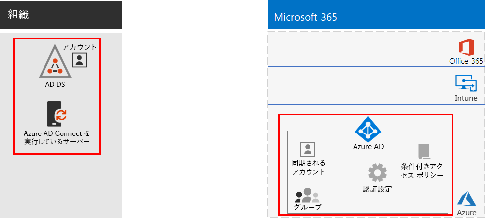
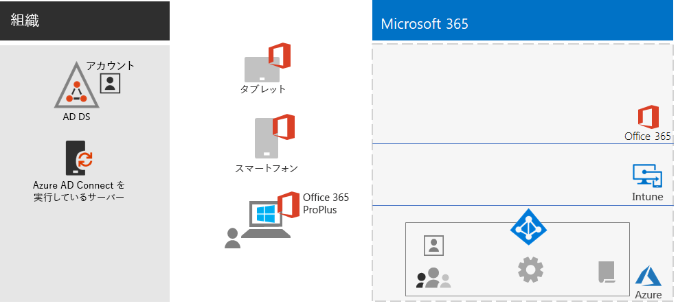
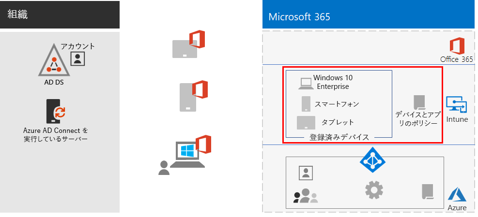
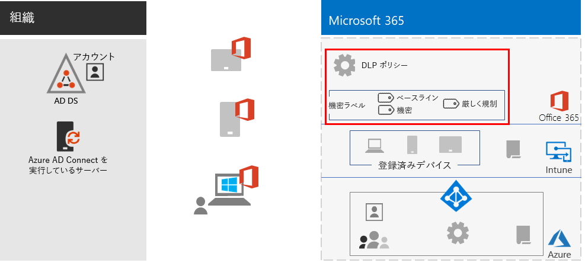
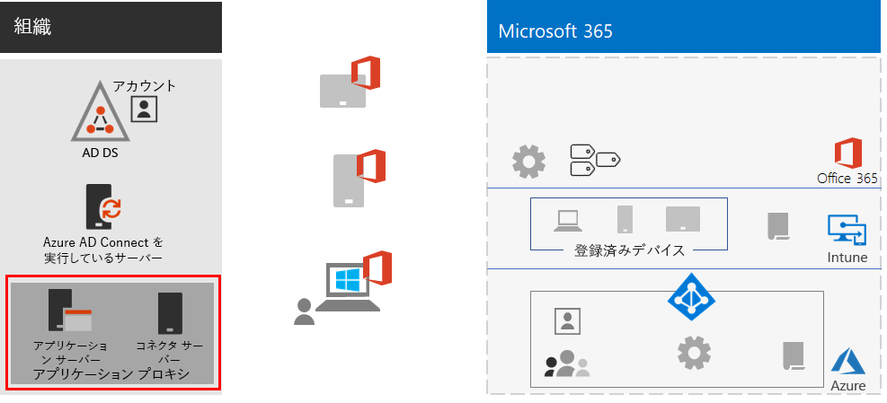
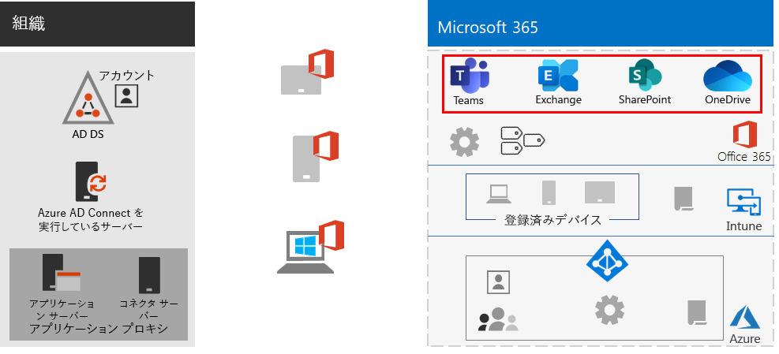
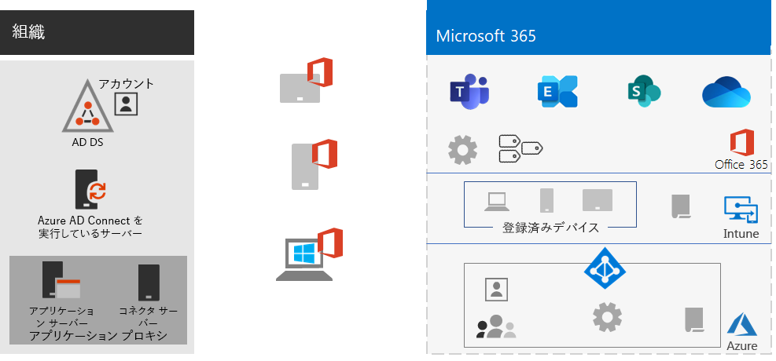
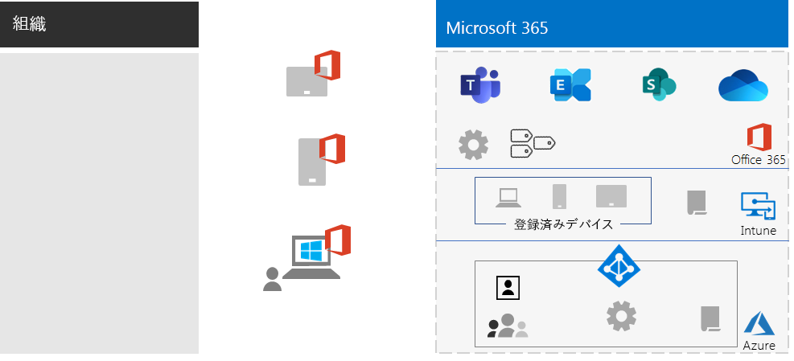

# リモート ワーカーを支援するEmpower remote workers

*このシナリオは、Microsoft 365 Enterprise の E3 および E5 の両バージョンに適用されます**This scenario applies to both the E3 and E5 versions of Microsoft 365 Enterprise*

従業員がオフィスからシームレスかつ安全に離れて作業できるようにすることは、多くの組織にとって、オフィス スペースの節約、転勤を望まない従業員の採用および維持、通勤時間の短縮など、従業員の生産性の向上と仕事以外でストレスを軽減するために重要です。Allowing employees to work away from the office seamlessly and securely is important for many organizations to save on office space, hire and retain employees who are unwilling to relocate, and reduce employee commuting, leaving them with more time to be productive and for stress-reducing activities outside of work.

リモート作業 (テレワーキングとも呼ばれる) は、次のような範囲に及ぶことがあります。Remote working, also known as teleworking, can span a spectrum that includes:

- 会議やクライアント会議のために時々オフィスを離れる従業員。Employees that are occasionally away from the office for conferences or client meetings.
- リモートでフルタイムで働く一部の従業員。Some employees that work remotely full-time.
- オフィスがなく、すべての従業員が離れている完全なリモートの組織。A fully remote organization in which there is no office and all employees are remote.

リモート ワーカーをサポートするために、Microsoft 365 Enterprise の機能を組み合わせることで、次のような高度な共同作業が可能になります。To support remote workers, a combination of features in Microsoft 365 Enterprise enables your remote workers in a highly collaborative way, such as:

- オンライン会議およびチャット セッション。Online meetings and chat sessions.
- グローバルなアクセシビリティとリアルタイムのコラボレーションを実現する、クラウドベースのファイル ストレージ用の共有ワークスペース。Shared workspaces for cloud-based file storage with global accessibility and real-time collaboration.
- 作業を分割して完了するための共有タスクとワークフロー。Shared tasks and workflows to divide up the work and get things done.

セキュリティを強化するために、Microsoft 365 Enterprise には以下が含まれます。For strong security, Microsoft 365 Enterprise includes:

- 認証要件の適用、高リスクのサインインの検出と応答、選択したアプリと非準拠デバイスのブロック。Enforced authentication requirements, detecting and responding to high-risk sign-ins, and blocking selected apps and non-compliant devices.
- クラウド内の暗号化された接続とデジタル資産。Encrypted connections and digital assets in the cloud.
- ファイルに対して誰が何を実行できるかを定義する権限。Permissions to define who can do what with files.
- 高度に規制されたデータの漏洩を防ぐデータ損失防止 (DLP)。Data loss prevention (DLP) to prevent leakage of highly regulated data.

これらのリモート ワーカーの基準を満たすには、次の Microsoft 365 Enterprise 機能を使用します。To meet these criteria for remote workers, use the following Microsoft 365 Enterprise features:

- ユーザー ID とサインイン セキュリティUser identity and sign-in security
  - 多要素認証 (MFA) を使用する Azure Active Directory (Azure AD) ユーザー アカウントAzure Active Directory (Azure AD) user accounts with multi-factor authentication (MFA)
  - 危険なサインインに MFA を要求する条件付きアクセス ポリシーConditional Access policies to require MFA for risky sign-ins
- コラボレーション プラットフォームCollaboration platforms
  - リモート ワーカーがオンライン ビデオベースの会議にスケジュールおよび参加し、同時に同じドキュメントで作業できるようにする Microsoft Teams、SharePoint、および OneDriveMicrosoft Teams, SharePoint, and OneDrive, with which remote workers can schedule and attend online video-based meetings and work on the same documents at the same time
- リソースへのアクセスを保護するSecure access to resources
  - Teams、SharePoint サイト、および OneDrive のグループとアクセス許可により、認証および許可されたユーザーのみがアクセス可能Groups and permissions for Teams, SharePoint sites, and OneDrive so that only authenticated and permitted users have access
- 漏洩ファイルの保護Protection for leaked files
  - Office 365 DLP ポリシーOffice 365 DLP policies
  - 暗号化のための機密ラベルとファイルとともに移動するアクセス許可Sensitivity labels for encryption and permissions that travel with files
- Microsoft Intune によるデバイス管理とセキュリティDevice management and security with Microsoft Intune
  - 管理対象デバイスの登録Enrollment for managed devices
  - 個人用デバイスのアプリ設定App settings for personal devices
  - デバイスとアプリのポリシーDevice and app policies
- デバイス用の生産性アプリProductivity apps for devices
  - Teams、SharePoint、および OneDrive とのコラボレーション エクスペリエンスのための Office 365 ProPlus アプリOffice 365 ProPlus apps for collaborative experiences with Teams, SharePoint, and OneDrive 
- Windows 10 EnterpriseWindows 10 Enterprise
  - サイバー攻撃から保護し、データ漏洩を防止する包括的なセキュリティ機能Comprehensive security features to protect against cyberattacks and prevent data leakage
- オンプレミス アプリへのアクセスAccess to on-premises apps
  - ハイブリッド ID を持つ組織は、仮想プライベート ネットワーク (VPN) 接続の代わりに Azure AD アプリケーション プロキシを使用可能Organizations that have hybrid identity can use Azure AD Application Proxy instead of virtual private network (VPN) connections

次のフェーズでは、リモート アクセスを可能にする Microsoft 365 Enterprise の機能を展開し、リモート ワーカーの採用を推進する手順について説明します。The following phases step you through deploying the feature of Microsoft 365 Enterprise for remote access and driving adoption for remote workers. これらのフェーズの要素がすでに展開されている場合は、次の要素に進む前に、それらの要素が上記の要件を満たしていることを確認してください。If you have already deployed elements of these phases, ensure that they meet the stated requirements before moving on to the next element.

 このシナリオを 1 ページにまとめた「[リモート ワーカーを支援するポスター](../media/empower-people-to-work-remotely/empower-remote-workers-scenario.pdf)」を参照してください。For a 1-page summary of this scenario, see the [Empower remote workers poster](../media/empower-people-to-work-remotely/empower-remote-workers-scenario.pdf).

このポスターを [PDF](https://github.com/MicrosoftDocs/microsoft-365-docs/raw/public/microsoft-365/media/empower-people-to-work-remotely/empower-remote-workers-scenario.pdf) または [PowerPoint](https://github.com/MicrosoftDocs/microsoft-365-docs/raw/public/microsoft-365/media/empower-people-to-work-remotely/Empower-Remote-Workers-Poster.pptx) 形式でダウンロードして、レター、リーガル、タブロイド (11 x 17) のサイズの紙に印刷することもできます。You can also download this poster in [PDF](https://github.com/MicrosoftDocs/microsoft-365-docs/raw/public/microsoft-365/media/empower-people-to-work-remotely/empower-remote-workers-scenario.pdf) or [PowerPoint](https://github.com/MicrosoftDocs/microsoft-365-docs/raw/public/microsoft-365/media/empower-people-to-work-remotely/Empower-Remote-Workers-Poster.pptx) formats and print it on letter, legal, or tabloid (11 x 17)-sized paper.

## フェーズ 1: リモート ワーカーに Microsoft 365 の機能を展開するPhase 1: Deploy Microsoft 365 features and capabilities for remote workers

このシナリオに必要な機能の幅と数が多いため、「[Microsoft 365 Enterprise の展開ガイド](deploy-microsoft-365-enterprise.md)」の基盤インフラストラクチャとワークロード セクションの必須要素を順を追って説明します。Because of the breadth and number of features and capabilities required for this scenario, we’ll step you through the required elements of the foundation infrastructure and workloads sections of the [Microsoft 365 Enterprise Deployment Guide](deploy-microsoft-365-enterprise.md).

### 手順 1: リモート ワーカーの基盤インフラストラクチャの要件Step 1: Foundation infrastructure requirements for remote workers

この手順では、[基盤インフラストラクチャ](deploy-foundation-infrastructure.md)のフェーズにアクセスし、リモート ワーカーを有効にするために必要な要素を一覧表示します。In this step, we’ll visit the phases of the [foundation infrastructure](deploy-foundation-infrastructure.md) and list the required elements to enable remote workers.

[フェーズ 2: ID](identity-infrastructure.md) の場合、ユーザー ID およびサインイン セキュリティ用に次を展開します。For [Phase 2: Identity](identity-infrastructure.md), deploy the following for user identity and sign-in security:

- ハイブリッド ID の場合、オンプレミスの Active Directory ドメイン サービス (AD DS) から同期されたユーザー アカウントとグループ。For hybrid identity, user accounts and groups synchronized from on-premises Active Directory Domain Services (AD DS).
- 権限を割り当てる場合、適切なメンバーと同期または Azure AD グループ。For assigning permissions, synchronized or Azure AD groups with the appropriate members.
- MFA の要求などの認証設定。Authentication settings, such as requiring MFA.
- 危険なサインインに MFA を要求する条件付きアクセス ポリシーおよび先進認証をサポートしないクライアントのブロック。Conditional Access policies to require MFA for risky sign-ins and block clients that don’t support modern authentication.

次に、ID 要素を強調表示した構成を示します。Here's the resulting configuration with the identity elements highlighted.

 
[フェーズ 3: Windows 10 Enterprise](windows10-infrastructure.md) の場合、次を展開します。For [Phase 3: Windows 10 Enterprise](windows10-infrastructure.md), deploy:

- Windows 10 Enterprise で新しいデバイスを展開し、Windows 7 または Windows 8.1 デバイスを Windows 10 Enterprise にアップグレードするためのインフラストラクチャThe infrastructure to deploy new devices with Windows 10 Enterprise and to upgrade of your Windows 7 or Windows 8.1 devices to Windows 10 Enterprise
- ID、脅威、および情報保護のための包括的なセキュリティ機能の有効化Enabling comprehensive security features for identity, threat, and information protection

次に、Windows 10 Enterprise デバイスの構成を示します。Here's the resulting configuration with Windows 10 Enterprise devices.

 
[フェーズ 4: Office 365 ProPlus](office365proplus-infrastructure.md) の場合、インフラストラクチャを展開して Office 365 ProPlus をインストールするか、Office 2010 や Office 2013 などの現在インストールされている Office スイートを組織のデバイス上の Office 365 ProPlus にアップグレードします。For [Phase 4: Office 365 ProPlus](office365proplus-infrastructure.md), deploy the infrastructure to install Office 365 ProPlus or upgrade your currently installed Office suite, such as Office 2010 or Office 2013, to Office 365 ProPlus on your organization devices. これにより、ユーザーがセキュリティと共同作業エクスペリエンスを最大限活用できるようになります。This will give your users the best security and collaborative experiences.

次に、Office 365 ProPlus がデバイスにインストールされた場合の構成を示します。Here's the resulting configuration with Office 365 ProPlus installed on devices.

 
[フェーズ 5: モバイル デバイス管理](mobility-infrastructure.md)の場合、次の目的で Intune デバイスとアプリの管理を展開します。For [Phase 5: Mobile device management](mobility-infrastructure.md), deploy Intune device and app management for:

- 組織が定義した機能とセキュリティ設定を受信するように、Windows 10 Enterprise、iOS、macOS、Android、および Android Enterprise デバイスを登録。Enrollment of your Windows 10 Enterprise, iOS, macOS, Android, and Android Enterprise devices so they receive features and security settings defined by your organization.
- 従業員が所有する個人用デバイスであっても、セキュリティを強化するため、アプリを許可またはブロックするアプリの設定。App settings for extra security and to allow or block apps, even on employee-owned personal devices.
- 非準拠デバイスの接続を防ぐための条件付きアクセスを備えたコンプライアンス ポリシー。Compliance policies with Conditional Access to prevent non-compliant devices from connecting.

次に、Intune の登録済みデバイスとポリシーを強調表示した構成を示します。Here's the resulting configuration with Intune enrolled devices and policies highlighted.

 
[フェーズ 6: 情報保護](infoprotect-infrastructure.md)の場合、デジタル資産の保護を次の機能により設計および構成します。For [Phase 6: Information protection](infoprotect-infrastructure.md), design and configure protection for your digital assets with:

- Office 365 DLP ポリシー。Office 365 DLP policies.
- ファイルと共に移動する暗号化およびアクセス許可のための Office 365 の機密度ラベル。Office 365 sensitivity labels for encryption and permissions that travel with files.

次に、DLP ポリシーと機密度ラベルを強調表示した構成を示します。Here's the resulting configuration with DLP policies and sensitivity labels highlighted.

 
オンプレミス アプリにアクセスするには、ハイブリッド ID 環境を必要とする [Azure AD アプリケーション プロキシ](https://docs.microsoft.com/azure/active-directory/manage-apps/application-proxy)を使用できます。For access to on-premises apps, you can use [Azure AD Application Proxy](https://docs.microsoft.com/azure/active-directory/manage-apps/application-proxy), which requires a hybrid identity environment.

次に、アプリケーション プロキシ コンポーネントを強調表示した構成を示します。Here's the resulting configuration with the application proxy components highlighted.

 
### 手順 2: リモート ワーカーのワークロードStep 2: Workloads for remote workers

[Exchange Online](exchangeonline-workload.md) の場合、Exchange Online メールボックスを各ユーザーに展開します。For [Exchange Online](exchangeonline-workload.md), deploy Exchange Online mailboxes to each of your users.

[Teams](teams-workload.md) の場合、Teams をユーザーとグループに展開します。For [Teams](teams-workload.md), deploy Teams to your users and groups.

[SharePoint および OneDrive](sharepoint-online-onedrive-workload.md) の場合、SharePoint チームまたはコミュニケーション サイトと OneDrive フォルダーを展開します。For [SharePoint and OneDrive](sharepoint-online-onedrive-workload.md), deploy SharePoint team or communication sites and OneDrive folders.

次に、ワークロードを強調表示した構成を示します。Here's the resulting configuration with the workloads highlighted.

 
### 展開結果Deployment results

基盤インフラストラクチャとワークロードを展開し、Windows 10 Enterprise および Office 365 ProPlus を展開した後、リモート ワーカーは次のようになります。After deploying the foundation infrastructure and workloads and rolling out Windows 10 Enterprise and Office 365 ProPlus, remote workers:

- 強力な認証および ID 保護の対象になります。Are subject to strong authentication and identity protection.
- Windows デバイスで最新かつ最も安全なバージョンの Windows を使用するようになります。Have the latest and most secure version of Windows on their Windows devices.
- デバイスで最新かつ最も生産的なバージョンの Office スイートを使用するようになります。Have the latest and most productive version of the Office suite on their devices.
- アプリ管理およびデバイス コンプライアンス ポリシーの対象になります。Are subject to app management and device compliance policies.
- DLP ポリシーおよび制限の対象になります。Are subject to DLP policies and restrictions.
- ファイルおよびメールとともに送信される暗号化およびアクセス許可に機密度ラベルを割り当てられるようになります。Can assign sensitivity labels for encryption and permissions that travel with files and email.
- VPN 接続なしでオンプレミスのアプリにアクセスできます。Can access on-premises apps without a VPN connection.
- Teams 内のチャット、会議、ファイル、SharePoint および OneDrive 内のファイルを使用して、自分の作業を実行し、同僚とのリアルタイム コラボレーションに参加できます。Can perform their own work and participate in real-time collaboration with co-workers with chats, meetings, and files in Teams and files in SharePoint and OneDrive.

オフライン (インターネットに接続されていない) の場合、リモート ワーカーはファイルのローカル コピーを変更できます。When offline (not connected to the Internet), your remote workers can change local copies of files. インターネットに再接続すると、OneDrive はローカル コピーを Microsoft 365 サブスクリプションに保存されているファイルと同期します。When they reconnect to the Internet, OneDrive synchronizes local copies with the files stored in your Microsoft 365 subscription. 

次に、ハイブリッド ID を使用する場合の、組織のリモート ワーカーの構成を示します。Here's the resulting configuration for remote workers of your organization if you use hybrid identity.

 
 
次に、クラウド専用 ID を使用する場合の、組織のリモート ワーカーの構成を示します。Here's the resulting configuration for remote workers your organization if you use cloud-only identity.

## フェーズ 2: リモート ワーカーに導入を促すPhase 2: Drive user adoption for remote workers

基盤インフラストラクチャとワークロードが整ったので、これらの機能の継続的な使用をリモート ワーカーに促し、いつでもどこでも生産的になるようにします。Now that the foundation infrastructure and workloads are in place, it’s time to drive the ongoing usage of these capabilities to your remote workers so they can be productive anywhere and at any time.

### 手順 1: ユーザーをトレーニングするStep 1: Train your users

リモート ワーカーを以下の内容についてトレーニングします。Train your remote workers on:

- MFA 登録を含む適切なサインインの手順、およびリスクが検出されたときにサインインにチャレンジする方法。Proper sign-in procedures, including MFA registration, and how sign ins can be challenged when risk is detected.
- デバイスの使用と、ポリシーを使用して非準拠デバイスのアクセスをブロックする方法。The use of devices and how policies can be used to block access for non-compliant devices.
- 許可されたアプリの使用と、Intune アプリ ポリシーを使用してアプリをブロックする方法。The use of allowed apps and how Intune app polices can be used to block apps.
- Windows 10 Enterprise のセキュリティ機能。Windows 10 Enterprise security features.
- 電子メールと予定表に Outlook を使用する方法。How to use Outlook for email and calendaring.
- [Teams](https://docs.microsoft.com/microsoftteams/training-microsoft-teams-landing-page) を使用してチャット、ビデオベースの会議、ドキュメント共有、およびスレッド形式の会話を行う方法。How to use [Teams](https://docs.microsoft.com/microsoftteams/training-microsoft-teams-landing-page) for chat, video-based conferencing, document sharing, and threaded conversations.
- SharePoint チームまたはコミュニケーション サイトと OneDrive フォルダーを使用して、ユーザーのライブラリおよびグループに属するファイルを閲覧する方法。How to use SharePoint team or communication sites and OneDrive folders to browse files in a user's library and those belonging to a group.
- ファイルのローカル バージョンとオンライン バージョンの両方で、機密データまたは厳しく規制されたデータを含むファイルに機密度ラベルを使用および適用する方法。How to use and apply sensitivity labels for files containing sensitive or highly regulated data, for both local and online versions of files.

このトレーニングには、生徒が上記の機能とその結果を体感できるように、実践的な演習を組み込む必要があります。This training should include hands-on exercises so that your students can experience these capabilities and their results.

### 手順 2: 使用状況を定期的にレビューし、作業者のフィードバックに対処するStep 2: Conduct periodic reviews of usage and address worker feedback

トレーニング後の数週間、次のことを行います。In the weeks after training:

- リモート ワーカーのフィードバックに迅速に対応し、ポリシーと構成を微調整します。Quickly address remote worker feedback and fine tune polices and configurations.
- チーム、SharePoint サイト、および OneDrive フォルダーの使用状況を分析し、予想される使用状況と比較します。Analyze usage for teams, SharePoint sites, and OneDrive folders and compare it with usage expectations.
- 機密または厳しく規制されたファイルが適切な機密度ラベルで適切にラベル付けされていることを確認します。Verify that sensitive or highly regulated files have been properly labeled with the appropriate sensitivity label.

必要に応じて、ユーザーの再トレーニングを行います。Retrain your users as needed.

### ユーザーによる採用の結果User adoption results

リモート ワーカーは、Windows 10 Enterprise または他のデバイスと Office 365 ProPlus を使用して、安全な環境で共有 Microsoft 365 Enterprise クラウド サービスとリソースにアクセスして作業し、リアルタイムで会議、作成、コラボレーションを行うことができます。Your remote workers can use their Windows 10 Enterprise or other devices and Office 365 ProPlus to access and work on shared Microsoft 365 Enterprise cloud services and resources in a secure environment, and they’re meeting, creating, and collaborating in real time.

## 関連項目See also

[ワークロードとシナリオWorkloads and scenarios](deploy-workloads.md)

[Microsoft 365 生産性向上ライブラリ](https://aka.ms/productivitylibrary) (https://aka.ms/productivitylibrary)[Microsoft 365 Productivity Library](https://aka.ms/productivitylibrary) (https://aka.ms/productivitylibrary)

[展開ガイドDeployment guide](deploy-microsoft-365-enterprise.md)
