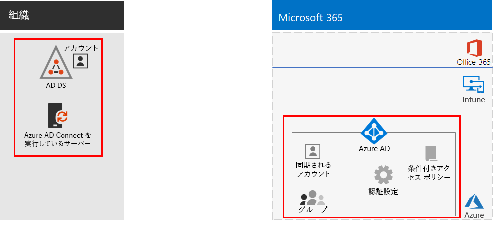
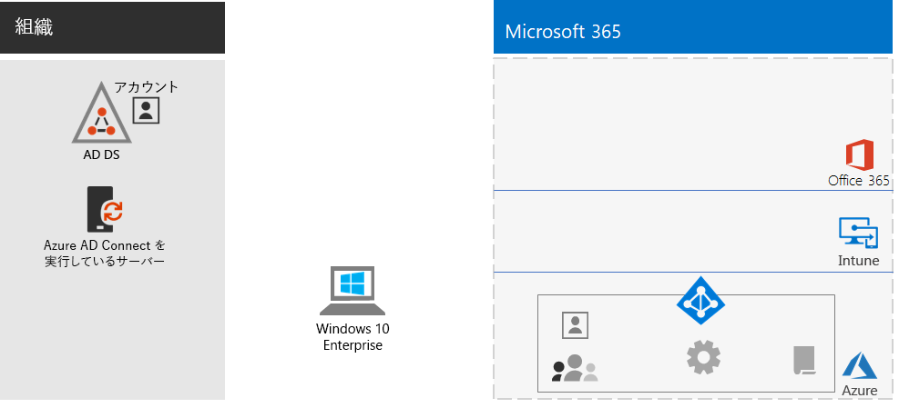
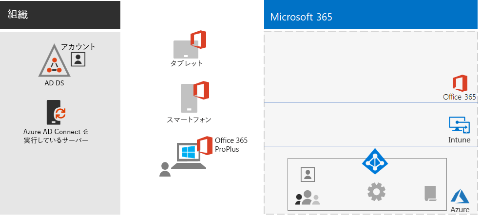
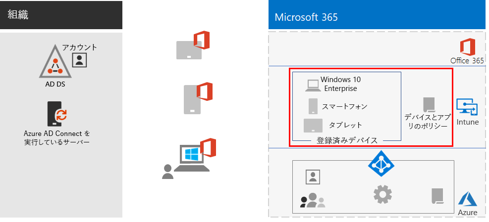
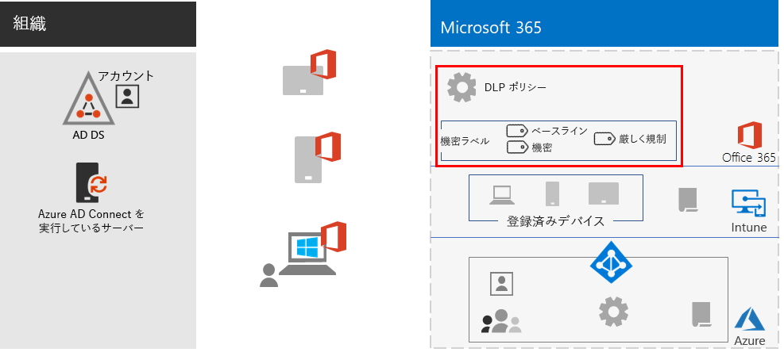
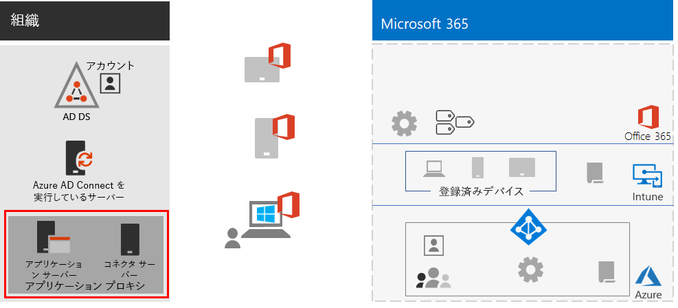
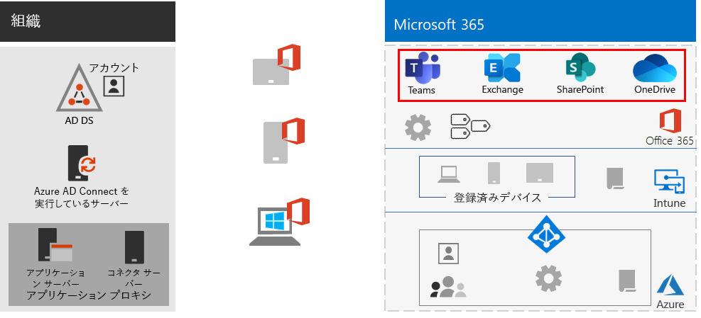
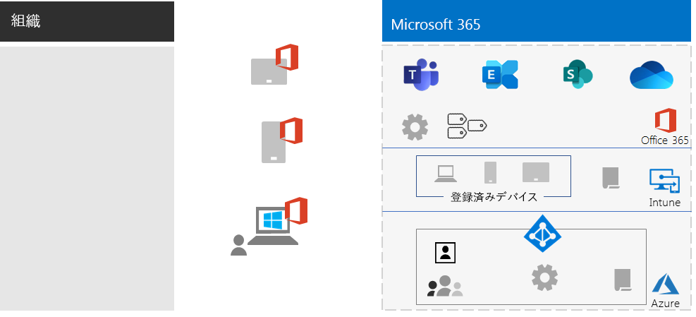

# リモート ワーカーを支援する

*このシナリオは、Microsoft 365 Enterprise の E3 および E5 の両バージョンに適用されます*

従業員がオフィスからシームレスかつ安全に離れて作業できるようにすることは、多くの組織にとって、オフィス スペースの節約、転勤を望まない従業員の採用および維持、通勤時間の短縮など、従業員の生産性の向上と仕事以外でストレスを軽減するために重要です。

リモート作業 (テレワーキングとも呼ばれる) は、次のような範囲に及ぶことがあります。

- 会議やクライアント会議のために時々オフィスを離れる従業員。
- リモートでフルタイムで働く一部の従業員。
- オフィスがなく、すべての従業員が離れている完全なリモートの組織。

リモート ワーカーをサポートするために、Microsoft 365 Enterprise の機能を組み合わせることで、次のような高度な共同作業が可能になります。

- オンライン会議およびチャット セッション。
- グローバルなアクセシビリティとリアルタイムのコラボレーションを実現する、クラウドベースのファイル ストレージ用の共有ワークスペース。
- 作業を分割して完了するための共有タスクとワークフロー。

セキュリティを強化するために、Microsoft 365 Enterprise には以下が含まれます。

- 認証要件の適用、高リスクのサインインの検出と応答、選択したアプリと非準拠デバイスのブロック。
- クラウド内の暗号化された接続とデジタル資産。
- ファイルに対して誰が何を実行できるかを定義する権限。
- 高度に規制されたデータの漏洩を防ぐデータ損失防止 (DLP)。

これらのリモート ワーカーの基準を満たすには、次の Microsoft 365 Enterprise 機能を使用します。

- ユーザー ID とサインイン セキュリティ
  - 多要素認証 (MFA) を使用する Azure Active Directory (Azure AD) ユーザー アカウント
  - 危険なサインインに MFA を要求する条件付きアクセス ポリシー
- コラボレーション プラットフォーム
  - リモート ワーカーがオンライン ビデオベースの会議にスケジュールおよび参加し、同時に同じドキュメントで作業できるようにする Microsoft Teams、SharePoint、および OneDrive
- リソースへのアクセスを保護する
  - Teams、SharePoint サイト、および OneDrive のグループとアクセス許可により、認証および許可されたユーザーのみがアクセス可能
- 漏洩ファイルの保護
  - Office 365 DLP ポリシー
  - 暗号化のための機密ラベルとファイルとともに移動するアクセス許可
- Microsoft Intune によるデバイス管理とセキュリティ
  - 管理対象デバイスの登録
  - 個人用デバイスのアプリ設定
  - デバイスとアプリのポリシー
- デバイス用の生産性アプリ
  - Teams、SharePoint、および OneDrive とのコラボレーション エクスペリエンスのための Office 365 ProPlus アプリ 
- Windows 10 Enterprise
  - サイバー攻撃から保護し、データ漏洩を防止する包括的なセキュリティ機能
- オンプレミス アプリへのアクセス
  - ハイブリッド ID を持つ組織は、仮想プライベート ネットワーク (VPN) 接続の代わりに Azure AD アプリケーション プロキシを使用可能

次のフェーズでは、リモート アクセスを可能にする Microsoft 365 Enterprise の機能を展開し、リモート ワーカーの採用を推進する手順について説明します。 これらのフェーズの要素がすでに展開されている場合は、次の要素に進む前に、それらの要素が上記の要件を満たしていることを確認してください。

## フェーズ 1: リモート ワーカーに Microsoft 365 の機能を展開する

このシナリオに必要な機能の幅と数が多いため、「[Microsoft 365 Enterprise の展開ガイド](deploy-microsoft-365-enterprise.md)」の基盤インフラストラクチャとワークロード セクションの必須要素を順を追って説明します。

### 手順 1: リモート ワーカーの基盤インフラストラクチャの要件

この手順では、[基盤インフラストラクチャ](deploy-foundation-infrastructure.md)のフェーズにアクセスし、リモート ワーカーを有効にするために必要な要素を一覧表示します。

[フェーズ 2: ID](identity-infrastructure.md) の場合、ユーザー ID およびサインイン セキュリティ用に次を展開します。

- ハイブリッド ID の場合、オンプレミスの Active Directory ドメイン サービス (AD DS) から同期されたユーザー アカウントとグループ。
- 権限を割り当てる場合、適切なメンバーと同期または Azure AD グループ。
- MFA の要求などの認証設定。
- 危険なサインインに MFA を要求する条件付きアクセス ポリシーおよび先進認証をサポートしないクライアントのブロック。

次に、ID 要素を強調表示した構成を示します。

 
[フェーズ 3: Windows 10 Enterprise](windows10-infrastructure.md) の場合、次を展開します。

- Windows 10 Enterprise で新しいデバイスを展開し、Windows 7 または Windows 8.1 デバイスを Windows 10 Enterprise にアップグレードするためのインフラストラクチャ
- ID、脅威、および情報保護のための包括的なセキュリティ機能の有効化

次に、Windows 10 Enterprise デバイスの構成を示します。

 
[フェーズ 4: Office 365 ProPlus](office365proplus-infrastructure.md) の場合、インフラストラクチャを展開して Office 365 ProPlus をインストールするか、Office 2010 や Office 2013 などの現在インストールされている Office スイートを組織のデバイス上の Office 365 ProPlus にアップグレードします。 これにより、ユーザーがセキュリティと共同作業エクスペリエンスを最大限活用できるようになります。

次に、Office 365 ProPlus がデバイスにインストールされた場合の構成を示します。

 
[フェーズ 5: モバイル デバイス管理](mobility-infrastructure.md)の場合、次の目的で Intune デバイスとアプリの管理を展開します。

- 組織が定義した機能とセキュリティ設定を受信するように、Windows 10 Enterprise、iOS、macOS、Android、および Android Enterprise デバイスを登録。
- 従業員が所有する個人用デバイスであっても、セキュリティを強化するため、アプリを許可またはブロックするアプリの設定。
- 非準拠デバイスの接続を防ぐための条件付きアクセスを備えたコンプライアンス ポリシー。

次に、Intune の登録済みデバイスとポリシーを強調表示した構成を示します。

 
[フェーズ 6: 情報保護](infoprotect-infrastructure.md)の場合、デジタル資産の保護を次の機能により設計および構成します。

- Office 365 DLP ポリシー。
- ファイルと共に移動する暗号化およびアクセス許可のための Office 365 の機密度ラベル。

次に、DLP ポリシーと機密度ラベルを強調表示した構成を示します。

 
オンプレミス アプリにアクセスするには、ハイブリッド ID 環境を必要とする [Azure AD アプリケーション プロキシ](https://docs.microsoft.com/azure/active-directory/manage-apps/application-proxy)を使用できます。

次に、アプリケーション プロキシ コンポーネントを強調表示した構成を示します。

 
### 手順 2: リモート ワーカーのワークロード

[Exchange Online](exchangeonline-workload.md) の場合、Exchange Online メールボックスを各ユーザーに展開します。

[Teams](teams-workload.md) の場合、Teams をユーザーとグループに展開します。

[SharePoint および OneDrive](sharepoint-online-onedrive-workload.md) の場合、SharePoint チームまたはコミュニケーション サイトと OneDrive フォルダーを展開します。

次に、ワークロードを強調表示した構成を示します。

 
### 展開結果

基盤インフラストラクチャとワークロードを展開し、Windows 10 Enterprise および Office 365 ProPlus を展開した後、リモート ワーカーは次のようになります。

- 強力な認証および ID 保護の対象になります。
- Windows デバイスで最新かつ最も安全なバージョンの Windows を使用するようになります。
- デバイスで最新かつ最も生産的なバージョンの Office スイートを使用するようになります。
- アプリ管理およびデバイス コンプライアンス ポリシーの対象になります。
- DLP ポリシーおよび制限の対象になります。
- ファイルおよびメールとともに送信される暗号化およびアクセス許可に機密度ラベルを割り当てられるようになります。
- VPN 接続なしでオンプレミスのアプリにアクセスできます。
- Teams 内のチャット、会議、ファイル、SharePoint および OneDrive 内のファイルを使用して、自分の作業を実行し、同僚とのリアルタイム コラボレーションに参加できます。

オフライン (インターネットに接続されていない) の場合、リモート ワーカーはファイルのローカル コピーを変更できます。 インターネットに再接続すると、OneDrive はローカル コピーを Microsoft 365 サブスクリプションに保存されているファイルと同期します。 

次に、ハイブリッド ID を使用する場合の、組織のリモート ワーカーの構成を示します。

 
 
次に、クラウド専用 ID を使用する場合の、組織のリモート ワーカーの構成を示します。

## フェーズ 2: リモート ワーカーに導入を促す

基盤インフラストラクチャとワークロードが整ったので、これらの機能の継続的な使用をリモート ワーカーに促し、いつでもどこでも生産的になるようにします。

### 手順 1: ユーザーをトレーニングする

リモート ワーカーを以下の内容についてトレーニングします。

- MFA 登録を含む適切なサインインの手順、およびリスクが検出されたときにサインインにチャレンジする方法。
- デバイスの使用と、ポリシーを使用して非準拠デバイスのアクセスをブロックする方法。
- 許可されたアプリの使用と、Intune アプリ ポリシーを使用してアプリをブロックする方法。
- Windows 10 Enterprise のセキュリティ機能。
- 電子メールと予定表に Outlook を使用する方法。
- [Teams](https://docs.microsoft.com/microsoftteams/training-microsoft-teams-landing-page) を使用してチャット、ビデオベースの会議、ドキュメント共有、およびスレッド形式の会話を行う方法。
- SharePoint チームまたはコミュニケーション サイトと OneDrive フォルダーを使用して、ユーザーのライブラリおよびグループに属するファイルを閲覧する方法。
- ファイルのローカル バージョンとオンライン バージョンの両方で、機密データまたは厳しく規制されたデータを含むファイルに機密度ラベルを使用および適用する方法。

このトレーニングには、生徒が上記の機能とその結果を体感できるように、実践的な演習を組み込む必要があります。

### 手順 2: 使用状況を定期的にレビューし、作業者のフィードバックに対処する

トレーニング後の数週間、次のことを行います。

- リモート ワーカーのフィードバックに迅速に対応し、ポリシーと構成を微調整します。
- チーム、SharePoint サイト、および OneDrive フォルダーの使用状況を分析し、予想される使用状況と比較します。
- 機密または厳しく規制されたファイルが適切な機密度ラベルで適切にラベル付けされていることを確認します。

必要に応じて、ユーザーの再トレーニングを行います。

### ユーザーによる採用の結果

リモート ワーカーは、Windows 10 Enterprise または他のデバイスと Office 365 ProPlus を使用して、安全な環境で共有 Microsoft 365 Enterprise クラウド サービスとリソースにアクセスして作業し、リアルタイムで会議、作成、コラボレーションを行うことができます。

## 関連項目

[ワークロードとシナリオ](deploy-workloads.md)

[Microsoft 365 生産性向上ライブラリ](https://aka.ms/productivitylibrary) (https://aka.ms/productivitylibrary)

[展開ガイド](deploy-microsoft-365-enterprise.md)
