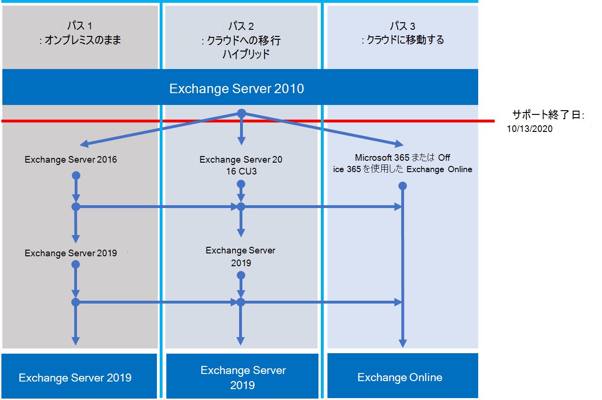

# Exchange 2010 のサポート終了のロードマップ

*この記事は、Microsoft 365 Enterprise および Office 365 Enterprise の両方に適用されます。*

Exchange Server 2010 は **、2020 年 10 月 13** 日にサポートの終了に達しました。 2010 年Exchangeから 2016 年のMicrosoft 365、Office 365、またはExchangeへの移行をまだ開始していない場合は、計画を開始します。

## *サポート終了とは* どういう意味ですか?

ほとんどの Microsoft 製品には、新機能、バグ修正、セキュリティ修正などのサポート ライフサイクルがあります。 このライフサイクルは通常、製品の初期リリースから 10 年間続きます。 このライフサイクルの終了は、製品のサポート終了と呼ばれます。 Exchange 2010 は 2020 年 10 月 13 日にサポートの終了に達したため、Microsoft では次の機能は提供されなくなりました。

- 発生する可能性がある問題のテクニカル サポート。
- サーバーの安定性と使いやすさに影響を与える可能性がある問題に関するバグ修正。
- サーバーがセキュリティ違反に対して脆弱になる可能性がある脆弱性に対するセキュリティ修正。
- タイム ゾーンの更新。

現在インストールされている Exchange 2010 は、この日付以降も引き続き 実行できます。 ただし、上記の変更により、できるだけ早く 2010 Exchangeから移行することを強くお勧めします。

サポートの終了に近づく方法の詳細については、[Office 2010 サーバーとクライアントからのアップグレードに役立つリソース](upgrade-from-office-2010-servers-and-products.md)に関するページを参照してください。

## 使用できるオプション

オプションを調べ、移行計画を準備するのに最適な時期です。 次の操作を実行できます。

- Microsoft 365に完全に移行します。 カットオーバー、最小限のハイブリッド、または完全なハイブリッド移行を使用してメールボックスを移行します。 その後、オンプレミスのExchange サーバーと Active Directory を削除します。
- Exchange 2010 サーバーをオンプレミス サーバー上の Exchange 2016 に移行します。

> [!IMPORTANT]
> 組織がメールボックスをMicrosoft 365に移行することを選択したが、ユーザー アカウントを オンプレミスの Active Directory から引き続き管理するために DirSync またはAzure AD Connectを維持する予定がある場合は、少なくとも 1 つの Microsoft Exchange サーバーをオンプレミスに保持する必要があります。 すべてのExchange サーバーを削除した場合、Exchange OnlineのExchange受信者に変更を加えることはできません。権限のソースはオンプレミスの Active Directoryに残るためです。 そこで変更を加える必要があります。 このシナリオでは、次のオプションがあります。
>
> - *推奨：* メールボックスをMicrosoft 365に移行し、2020 年 10 月 13 日までにサーバーをアップグレードした場合は、Exchange 2010 を使用してMicrosoft 365に接続し、メールボックスを移行します。 次に、2010 Exchangeを 2016 Exchangeに移行し、残りの 2010 サーバー Exchange使用停止します。
> - 2020 年 10 月 13 日までにメールボックスの移行とオンプレミス サーバーのアップグレードを完了しなかった場合は、オンプレミス Exchange 2010 サーバーを最初に 2016 Exchangeにアップグレードします。 次に、Exchange 2016 を使用してMicrosoft 365に接続し、メールボックスを移行します。

> [!NOTE]
> もう少し複雑ですが、オンプレミス Exchange 2010 サーバーを 2016 Exchangeに移行しながら、メールボックスをMicrosoft 365に移行することもできます。

Exchange Server 2010 のサポートが終了しないようにするために使用できる 3 つのパスを次に示します。

以降のセクションでは、各オプションについて詳しく説明します。

## Microsoft 365 に移行する

Microsoft 365に電子メールを移行することは、Exchange 2010 の展開を廃止するのに役立つ最も簡単なオプションです。 Microsoft 365への移行では、次のような古いテクノロジから現在の機能にシングル ホップを作成できます。

- 保持ポリシー、In-Place、訴訟ホールド、インプレース電子情報開示などのコンプライアンス機能。
- Microsoft Teams。
- Power BI。
- 優先受信トレイ。
- MyAnalytics.

Microsoft 365では、新しい機能とエクスペリエンスも最初に取得されるため、組織ですぐに使用を開始できます。 また、次のことを心配する必要はありません。

- ハードウェアの購入と保守。
- サーバーを加熱して冷却するために支払います。
- セキュリティ、製品、タイム ゾーンの修正に関する最新情報。
- コンプライアンス要件をサポートするためのストレージとソフトウェアの保守。
- 新しいバージョンのExchangeにアップグレードする。 Microsoft 365では常に最新バージョンのExchangeを使用しています。

### Microsoft 365に移行するにはどうすればよいですか?

組織によっては、Microsoft 365にアクセスするためのいくつかのオプションがあります。 まず、次のようないくつかの点を考慮する必要があります。

- 移動する必要があるシートまたはメールボックスの数。
- 移行を継続する期間。
- 移行中に、オンプレミスのインストールとMicrosoft 365間のシームレスな統合が必要かどうか。

次の表に、移行オプションと、使用する方法を決定する最も重要な要因を示します。

|移行オプション|組織のサイズ|期間|
|---|---|---|
|カットオーバー移行|150 席未満|1 週間以下|
|最小限のハイブリッド移行|150 席未満|数週間以下|
|完全なハイブリッド移行|150 席を超える|数週間以上|

次のセクションでは、これらのメソッドの概要について説明します。 詳細については、「 [移行パスの決定](https://support.office.com/article/Decide-on-a-migration-path-0d4f2396-9cef-43b8-9bd6-306d01df1e27)」を参照してください。

### カットオーバー移行

一括移行では、すべてのメールボックス、配布グループ、連絡先などを、設定された日時にOffice 365に移行します。 完了したら、オンプレミスのExchange サーバーをシャットダウンし、Microsoft 365を排他的に使用し始めます。

一括移行は、メールボックスの数が少ない小規模な組織や、Microsoft 365を迅速に行い、他の方法の複雑さに対処したくない小規模な組織に適しています。 ただし、1 週間以内に完了する必要があります。 また、ユーザーはOutlookプロファイルを再構成する必要があります。 一括移行では最大 2,000 個のメールボックスを移行できますが、最大 150 個のメールボックスに移行することをお勧めします。 より多くの移行を試みると、期限までにすべてのメールボックスを転送する時間が不足する可能性があります。また、IT サポート スタッフは、ユーザーがOutlookを再構成するのに役立つ要求に圧倒される可能性があります。

一括移行について考慮すべき点を次に示します。

- Microsoft 365は、OUTLOOK Anywhere over TCP ポート 443 を使用して、Exchange 2010 サーバーに接続する必要があります。
- オンプレミスのすべてのメールボックスは、Microsoft 365に移動されます。
- ユーザーのメールボックスへの読み取りアクセス権を持つオンプレミスの管理者アカウントが必要です。
- Microsoft 365で使用するExchange 2010 承認済みドメインは、サービス内の検証済みドメインとして追加する必要があります。
- 移行を開始してから完了フェーズを開始するまで、Microsoft 365はMicrosoft 365とオンプレミスのメールボックスを定期的に同期します。 これにより、オンプレミスのメールボックスに電子メールが残される心配なく移行を完了できます。
- ユーザーは、Microsoft 365 アカウントの新しい一時パスワードを受け取ります。 メールボックスに初めてサインインするときに、それらを変更する必要があります。
- 移行する各ユーザー メールボックスのExchange Onlineを含むMicrosoft 365 ライセンスが必要です。
- ユーザーは、各デバイスに新しいOutlook プロファイルを設定し、もう一度電子メールをダウンロードする必要があります。 Outlookがダウンロードする電子メールの量は異なる場合があります。 詳細については、「[Outlookでオフラインで作業する](https://support.microsoft.com/office/f3a1251c-6dd5-4208-aef9-7c8c9522d633)」を参照してください。

一括移行の詳細については、次を参照してください。

- [一括メール移行について知っておくべきこと](/Exchange/mailbox-migration/what-to-know-about-a-cutover-migration)
- [Office 365へのメールの一括移行を実行する](/Exchange/mailbox-migration/cutover-migration-to-office-365)

### 最小限のハイブリッド移行

最小限のハイブリッドまたは高速移行では、数週間以内に数百個のメールボックスをMicrosoft 365に移動します。 このメソッドでは、空き時間情報の共有予定表情報などの高度なハイブリッド移行機能はサポートされていません。

最小限のハイブリッド移行は、メールボックスをMicrosoft 365に移行する時間を増やす必要があるが、数週間以内に移行を完了する予定の組織に適しています。 複雑さの多くなく、より高度な *フル ハイブリッド移行* の利点の一部を得ることができます。 特定の時点で移行するメールボックスの数とメールボックスの数を制御できます。 Microsoft 365メールボックスは、オンプレミス アカウントのユーザー名とパスワードを使用して作成されます。 また、一括移行とは異なり、ユーザーはOutlookプロファイルを再作成する必要はありません。

最小限のハイブリッド移行について考慮する必要がある事項を次に示します。

- オンプレミスの Active Directory サーバーとMicrosoft 365間で 1 回限りのディレクトリ同期を実行する必要があります。
- ユーザーは、自分のメールボックスの前と同じユーザー名とパスワードを使用して、Microsoft 365 メールボックスにサインインできます。
- 移行する各ユーザー メールボックスのExchange Onlineを含むMicrosoft 365 ライセンスが必要です。
- ユーザーは、ほとんどのデバイスで新しいOutlook プロファイルを設定する必要はありませんが、古い Android スマートフォンの中には新しいプロファイルが必要な場合があります。 ユーザーは自分のメールを再ダウンロードする必要はありません。

詳細については、「[最小ハイブリッドを使用して、ExchangeメールボックスをすばやくOffice 365に移行する」を参照](/Exchange/mailbox-migration/use-minimal-hybrid-to-quickly-migrate)してください。

### フル ハイブリッド

完全ハイブリッド移行では、数百、最大数万のメールボックスがあり、一部または全部をMicrosoft 365に移動します。 これらの移行は通常、より長期的であるため、ハイブリッド移行では次の処理を行うことができます。

- オンプレミスユーザーに、Microsoft 365のユーザーの空き時間情報の予定表情報を表示します。また、その逆も同様です。
- オンプレミスとMicrosoft 365の両方の受信者を含む統合グローバル アドレス一覧を参照してください。
- オンプレミスかMicrosoft 365かに関係なく、すべてのユーザーの完全なOutlook受信者プロパティを表示します。
- TLS と証明書を使用して、オンプレミスのExchange サーバーとOffice 365間の電子メール通信をセキュリティで保護します。
- オンプレミスのExchange サーバーとMicrosoft 365間で送信されたメッセージを内部として扱い、次の処理を行うことができます。
  - 内部メッセージをターゲットとするトランスポート エージェントとコンプライアンス エージェントによって適切に評価され、処理されます。
  - スパム対策フィルターをバイパスします。

完全なハイブリッド移行は、何か月以上ハイブリッド構成を維持する予定の組織に最適です。 このセクションで前述した機能に加えて、ディレクトリ同期、統合コンプライアンス機能の強化、およびオンライン メールボックスの移動を使用してメールボックスをMicrosoft 365との間で移動する機能を利用できます。 Microsoft 365は、オンプレミス組織の拡張機能になります。

フル ハイブリッド移行について考慮する必要がある事項:

- すべての組織に適しているわけではありません。 完全なハイブリッド移行の複雑さのために、数百個未満のメールボックスを持つ組織には、通常、関係する労力とコストを正当化する利点は見られません。 このような場合は、代わりにカットオーバーまたは最小限のハイブリッド移行を検討することをお勧めします。
- オンプレミスの Active Directory サーバーとMicrosoft 365間のAzure Active Directory (Azure AD) Connectを使用してディレクトリ同期を設定する必要があります。
- ユーザーは、ローカル ネットワークにサインインするときに使用するのと同じユーザー名とパスワードを使用して、自分のMicrosoft 365 メールボックスにサインインできます。 (この機能には、パスワード同期やActive Directory フェデレーション サービス (AD FS)を使用したAzure AD Connectが必要です)。
- 移行する各ユーザー メールボックスのExchange Onlineを含むMicrosoft 365 ライセンスが必要です。
- ユーザーは、ほとんどのデバイスで新しいOutlook プロファイルを設定する必要はありませんが、古い Android スマートフォンの中には新しいプロファイルが必要な場合があります。 ユーザーは自分のメールを再ダウンロードする必要はありません。

> [!IMPORTANT]
> 組織がメールボックスをMicrosoft 365に移行することを選択したが、ユーザー アカウントを オンプレミスの Active Directory から引き続き管理するために DirSync またはAzure AD Connectを維持する予定がある場合は、少なくとも 1 つのExchange サーバーをオンプレミスに保持する必要があります。 すべてのExchange サーバーが削除された場合、Exchange OnlineのExchange受信者に変更を加えることはできません。 これは、権限のソースがオンプレミスの Active Directoryに残り、そこで変更を加える必要があるためです。

完全なハイブリッド移行が適切に機能する場合は、次の便利なリソースを参照してください。

- [Exchange 展開アシスタント](/exchange/exchange-deployment-assistant)
- [Exchange Server のハイブリッド展開](/exchange/exchange-hybrid)
- [ハイブリッド構成ウィザード](/exchange/hybrid-configuration-wizard)
- [ハイブリッド構成ウィザードに関する FAQ](/exchange/hybrid-configuration-wizard-faqs)
- [ハイブリッド展開の前提条件](/exchange/hybrid-deployment-prerequisites)

## オンプレミスの新しいバージョンのExchange Serverにアップグレードする

Microsoft 365に完全に移行することで、最適な価値とユーザー エクスペリエンスを得られると強く考えています。 ただし、一部の組織では、一部のExchange サーバーをオンプレミスに保持する必要があることを理解しています。 これは、規制要件が原因である可能性があります。データが外部データセンターに格納されないことを保証するには、クラウドでは満たされない一意の設定または要件があるか、オンプレミスの Active Directory を引き続き使用するため、クラウド メールボックスを管理するExchangeが必要であるためです。 いずれの場合も、オンプレミスExchange維持する場合は、Exchange 2010 環境が少なくとも 2013 年または 2016 年Exchange Exchangeにアップグレードされていることを確認する必要があります。

最適なエクスペリエンスを得るには、残りのオンプレミス環境を 2016 Exchangeにアップグレードすることをお勧めします。 Exchange Server 2010 から Exchange Server 2016 に直行する場合は、Exchange Server 2013 をインストールする必要はありません。

Exchange 2016 には、以前のリリースのExchangeのすべての機能が含まれています。 Microsoft 365で使用できるエクスペリエンスと最もよく一致しますが、一部の機能はMicrosoft 365でのみ使用できます。 不足している点のほんの一部を確認してください。

|Exchange リリース|機能|
|---|---|
|**Exchange 2013**|簡略化されたアーキテクチャにより、サーバー ロールの数が 3 に減ります (メールボックス、クライアント アクセス、エッジ トランスポート)|
||機密情報の漏洩を防ぐデータ損失防止ポリシー (DLP)|
||Outlook Web Appエクスペリエンスの向上|
|**Exchange 2016**|*Exchange 2013 および ... の機能。*|
||メールボックスとエッジ トランスポートだけに対するサーバーの役割をさらに簡略化しました|
||SharePointとの統合と共に DLP を改善しました|
||データベースの回復性の向上|
||オンライン ドキュメントコラボレーション|

|考慮事項|詳細情報|
|---|---|
|サポート終了日|Exchange 2010 と同様に、Exchangeの各バージョンには、独自のサポート終了日があります。    Exchange 2013 - 2023 年 4 月    Exchange 2016 - 2025 年 10 月    サポート終了日が早ければ早いほど、別の移行を実行する必要があります。 2023 年 4 月は、思ったよりずっと近いです。|
|Exchange 2013 または 2016 への移行パス|Exchange 2010 から新しいバージョンへの移行パスは、Exchange 2013 または Exchange 2016 のどちらを選択しても同じです。    Exchange 2013 または 2016 を既存のExchange 2010 組織にインストールします。    サービスとその他のインフラストラクチャを 2013 または 2016 Exchangeに移動します。    メールボックスとパブリック フォルダーを 2013 または 2016 Exchangeに移動し、残りの 2010 サーバー Exchange使用停止します。|
|バージョンの共存|Exchange 2013 または 2016 Exchangeに移行する場合は、いずれかのバージョンを既存の Exchange 2010 組織にインストールできます。 これにより、2013 または 2016 サーバー Exchange 1 つ以上 Exchangeをインストールし、移行を行うことができます。|
|サーバー ハードウェア|サーバー のハードウェア要件は、2010 Exchangeから変更されました。 ハードウェアに互換性があることを確認します。 各バージョンのハードウェア要件の詳細については、次をご覧ください。    [Exchange 2016 のシステム要件](/Exchange/plan-and-deploy/system-requirements?view=exchserver-2016&preserve-view=true)    [Exchange 2013 のシステム要件](/Exchange/exchange-2013-system-requirements-exchange-2013-help)    Exchangeのパフォーマンスが大幅に向上し、新しいサーバーのコンピューティング能力とストレージ容量が向上するため、同じ数のメールボックスをサポートするために必要なサーバーが少なくなる可能性があります。|
|オペレーティング システムのバージョン|各バージョンでサポートされているオペレーティング システムの最小バージョンは次のとおりです。    Exchange 2016 - Windows Server 2012    Exchange 2013 - Windows Server 2008 R2 SP1    オペレーティング システムのサポートの詳細については、[サポート可能性マトリックスExchange](/exchange/plan-and-deploy/supportability-matrix)参照してください。|
|Active Directory フォレストの機能レベル|各バージョンでサポートされている最小の Active Directory フォレスト機能レベルは次のとおりです。    Exchange 2016 - Windows Server 2008 R2 SP1    Exchange 2013 - Windows Server 2003    フォレストの機能レベルのサポートの詳細については、[Exchange Supportability Matrix](/exchange/plan-and-deploy/supportability-matrix) を参照してください。|
|Office クライアント バージョン|各バージョンでサポートされている最小Officeクライアント バージョンは次のとおりです。    Exchange 2016 - Office 2010 (最新の更新プログラムを使用)    Exchange 2013 - Office 2007 SP3    Exchange [Supportability Matrix](/exchange/plan-and-deploy/supportability-matrix) でOfficeクライアント サポートの詳細を確認してください。|

移行に役立つ次のリソースを使用します。

- [Exchange 展開アシスタント](/exchange/exchange-deployment-assistant)
- [Exchange 2016](/exchange/plan-and-deploy/active-directory/ad-schema-changes?view=exchserver-2016&preserve-view=true)、[2013](/Exchange/exchange-2013-active-directory-schema-changes-exchange-2013-help) の Active Directory スキーマの変更
- [Exchange 2016](/exchange/plan-and-deploy/system-requirements?view=exchserver-2016&preserve-view=true)、[2013](/Exchange/exchange-2013-system-requirements-exchange-2013-help) のシステム要件
- [Exchange 2016](/exchange/plan-and-deploy/prerequisites?view=exchserver-2016&preserve-view=true)、[2013](/Exchange/exchange-2013-prerequisites-exchange-2013-help) の前提条件

## Office 2010 クライアントとサーバー、Windows 7 のオプションの概要

Office 2010 サーバー/クライアント、および Windows 7のアップグレード、移行、およびクラウドへの移行オプションを視覚的にまとめた概要は、[サポート終了ポスター](../downloads/Office2010Windows7EndOfSupport.pdf) をご覧ください。

この 1 ページのポスターでは、Office 2010 クライアントおよびサーバー製品に対応するために使用できるさまざまなパスと、サポート終了に達する Windows 7 を示しています。Microsoft 365 Enterpriseの優先パスとオプションのサポートが強調表示されています。

また、このポスターを [ダウンロード](https://github.com/MicrosoftDocs/microsoft-365-docs/raw/public/microsoft-365/downloads/Office2010Windows7EndOfSupport.pdf) し、レター、リーガル、または Tabloid (11 x 17) 形式で印刷することもできます。

## ヘルプが必要な場合はどうすればよいですか?

Microsoft 365に移行する場合は、Microsoft FastTrack サービスを使用できる可能性があります。 FastTrackには、Microsoft 365への移行を可能な限りシームレスにするためのベスト プラクティス、ツール、リソースが用意されています。 何より、サポート エンジニアが計画と設計から最後のメールボックスの移行までの手順を説明します。 FastTrackの詳細については、「[Microsoft FastTrack](https://fasttrack.microsoft.com/)」を参照してください。

Microsoft 365への移行中に問題が発生し、FastTrackを使用していない場合、または新しいバージョンのExchange Serverに移行する場合は、次のリソースを使用できます。

- [テクニカル コミュニティ](https://social.technet.microsoft.com/Forums/office/home?category=exchangeserver)
- [カスタマー サポート](https://support.microsoft.com/gp/support-options-for-business)

## 関連記事

[Office 2010 サーバー/クライアントからのアップグレードに役立つリソース](upgrade-from-office-2010-servers-and-products.md)
