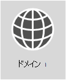

# <a name="external-domain-name-system-records-for-office-365"></a>Office 365 の外部ドメイン ネーム システムのレコード



**Office 365 組織のカスタマイズされた DNS レコードのリストを表示するには** Office 365 のドメイン用に [Office 365 DNS レコードを作成するために必要な情報を見つける](https://support.office.microsoft.com/article/Gather-the-information-you-need-to-create-Office-365-DNS-records-77f90d4a-dc7f-4f09-8972-c1b03ea85a67)ことができます。

**GoDaddy や eNom などのドメインの DNS ホストでこれらのレコードを追加するための手順が必要な場合** [多くの一般的な DNS ホストでの詳しい操作手順へのリンクをご覧ください](../admin/get-help-with-domains/create-dns-records-at-any-dns-hosting-provider.md)。 

**そのまま残って自分のカスタムの展開用のリファレンス リストを使用する場合** 以下のリストは、Office 365 のカスタム展開用のリファレンスとして使用されます。組織に適用するレコードを選択して、適切な値を入力する必要があります。 

「[Office 365 のネットワーク計画とパフォーマンス チューニング](./network-planning-and-performance.md)」**に戻ります**。

SPF と MX レコードは、見つけ出すのが最も困難です。この記事の最後にある、SPF レコードのガイダンスを更新しました。重要なのは、_ドメインに対して持つことができる SPF レコードは 1 つである_ ということです。MX レコードは複数持つことができますが、メール配信の際に問題を引き起こす場合があります。MX レコードを 1 つにし、メールを 1 つのメール システムに配信することで、多くの問題を回避できます。
  
以下のセクションは Office 365 のサービスごとに編成されています。ドメインに対する Office 365 DNS レコードのカスタマイズされたリストを表示するには、Office 365 にサインインして、「[Office 365 の DNS レコードの作成に必要な情報を収集する](https://support.office.com/article/77f90d4a-dc7f-4f09-8972-c1b03ea85a67)」をご覧ください。
  
## <a name="external-dns-records-required-for-office-365-core-services"></a>Office 365 に必要な外部の DNS レコード (コア サービス)
<a name="BKMK_ReqdCore"> </a>

すべての Office 365 のお客様は、外部の DNS に 2 つのレコードを追加する必要があります。最初の CNAME レコードは、Office 365 がワークステーションに適切な ID プラットフォームで認証を行うよう指定できるようにします。2 番目の必須レコードは、ドメイン名を所有していることを証明します。
  
|**DNS レコード** <br/> |**用途** <br/> |**使用する値** <br/> |
|----------|-----------|------------|
|**CNAME** <br/> **(スイート)** <br/> |正しい ID プラットフォームへの認証を指示するために Office 365 で使用されます。[詳細情報](../admin/services-in-china/purpose-of-cname.md?viewFallbackFrom=o365-worldwide) <br/> **注:** この CNAME は、21Vianet が運営する Office 365 にのみ適用されます。[詳細情報](/office365/servicedescriptions/office-365-platform-service-description/office-365-operated-by-21vianet)  |**エイリアス:** msoid  <br/> **対象:** clientconfig.partner.microsoftonline-p.net.cn  <br/> |
|**TXT** <br/> **(ドメインの確認)** <br/> |このレコードは、ドメインを所有していることを確認するためだけに Office 365 で使用されます。他のものには影響しません。  <br/> |**ホスト:** @ (または、一部の DNS ホスティング プロバイダーでは自分のドメイン名)  <br/> **TXT 値:** Office 365 "_から提供されるテキスト文字列_"  <br/> このレコードを作成するために使用する値は、Office 365 の **ドメイン セットアップ ウィザード** で指定されます。  <br/> |


## <a name="external-dns-records-required-for-email-in-office-365-exchange-online"></a>Office 365 でのメールに必要な外部 DNS レコード (Exchange Online)
<a name="BKMK_ReqdCore"> </a>

Office 365 でのメールには、複数の異なるレコードが必要です。すべてのお客様が使用する 3 つの主要なレコードは、自動検出、MX、および SPF レコードです。
  
- **自動検出レコード** では、クライアント コンピューターは自動的に Exchange を検索し、クライアントを正しく構成することができます。

- **MX レコード** は、ドメインのメールを送信する場所を他のメールシステムに知らせます。**注:** ドメインの MX レコードを更新してメールを Office 365 に変更すると、そのドメインに送信されたすべてのメールが Office 365 に届くようになります。  
一部のメール アドレスのみを Office 365 に切り替える場合 [カスタム ドメインの少数のメール アドレスで Office 365 を試験運用する](https://support.office.com/article/39cee536-6a03-40cf-b9c1-f301bb6001d7) ことができます。

- **SPF の TXT レコード** は、ユーザーのメールを送信するサーバーが承認されていることを検証するために受信者のメール システムで使用されます。これはメールのスプーフィングやフィッシングを防ぐために役立ちます。レコードに含める必要があるものについて詳しくは、この記事の「[SPF に必要な外部 DNS レコード](external-domain-name-system-records.md#BKMK_SPFrecords)」をご覧ください。

Exchange フェデレーションを使用しているメールのお客様は、表の一番下に一覧表示されている追加の CNAME および TXT レコードも必要です。
  
|**DNS レコード** <br/> |**用途** <br/> |**使用する値** <br/> |
|----------|-----------|------------|
|**CNAME** <br/> **(Exchange Online)** <br/> |このレコードを使用すると、Outlook クライアントが自動検出サービスを使用して Exchange Online サービスに簡単に接続できます。自動検出は、正しい Exchange Server ホストを自動的に検出し、ユーザーの Outlook を構成します。  <br/> |**エイリアス:** Autodiscover  <br/> **リンク先:** autodiscover.outlook.com  <br/> |
|**MX** <br/> **(Exchange Online)** <br/> |ドメインへの受信メールを Office 365 の Exchange Online サービスへ送信します。  <br/> [!NOTE] 電子メールが Exchange Online に流れたら、古いシステムを指定している MX レコードを削除する必要があります。   |**ドメイン:** 例: contoso.com  <br/> **対象メール サーバー:**\<MX token\>.mail.protection.outlook.com  <br/> **優先度:** その他すべての MX レコードより下 (これにより、メールが Exchange Online に確実に配信されます) - 例: 1 または "low"  <br/>  次の手順に従って \<MX token\> を検索します:  <br/>  Office 365 にサインインし、[Office 365 管理] \> [ドメイン] に移動します。  <br/>  ドメインの [アクション] 列で [問題の修正] を選択します。  <br/>  [MX レコード] セクションで、[何を修正しますか?] を選択します。  <br/>  MX レコードを更新するには、このページに表示される指示に従います。  <br/> [MX 優先度とは何ですか。](../admin/setup/domains-faq.yml) <br/> |
|**SPF (TXT)** <br/> **(Exchange Online)**  <br/> |これは、自分のドメインを他人が使用してスパムなどの悪意のある電子メールを送信するのを防ぐのに役立ちます。Sender policy framework (SPF) レコードは、自分のドメインからメールを送信することを許可されているサーバーを特定することによって動作します。  <br/> |[SPF に必要な外部 DNS レコード](external-domain-name-system-records.md#BKMK_SPFrecords) <br/> |
|**TXT** <br/> **(Exchange フェデレーション)** <br/> |ハイブリッド展開のために Exchange フェデレーションに使用します。  <br/> |**TXT レコード 1:** たとえば、contoso.com および関連するカスタム生成されたもの、ドメイン証明ハッシュ テキスト (たとえば、Y96nu89138789315669824)  <br/> **TXT レコード 2:** たとえば、exchangedelegation.contoso.com および関連するカスタム生成されたもの、ドメイン証明ハッシュ テキスト (たとえば、Y3259071352452626169)  <br/> |
|**CNAME** <br/> **(Exchange フェデレーション)** <br/> |Exchange フェデレーションを使用している場合、自動検出サービスを使用して Exchange Online サービスに簡単に接続するために Outlook クライアントを支援します。自動検出は、自動的に正しい Exchange Server ホストを見つけ、Outlook を構成します。  <br/> |**エイリアス:** 例: Autodiscover.service.contoso.com  <br/> **リンク先:** autodiscover.outlook.com  <br/> |


## <a name="external-dns-records-required-for-skype-for-business-online"></a>Skype for Business Online に必要な外部 DNS レコード
<a name="BKMK_ReqdCore"> </a>

「[Office 365 の URL と IP アドレスの範囲](https://support.office.com/article/8548a211-3fe7-47cb-abb1-355ea5aa88a2#BKMK_LYO)」を使用して、ネットワークが正しく構成されていることを確認する場合、特定の手順を実行する必要があります。

> [!NOTE]
> これらの DNS レコードは、特に特定のフェデレーションの問題が発生する可能性のあるハイブリッド Teams と Skype for Business シナリオの Teams にも適用されます。
  
|**DNS レコード** <br/> |**用途** <br/> |**使用する値** <br/> |
|----------|-----------|------------|
|**SRV** <br/> **(Skype for Business Online)** <br/> |SIP フェデレーションを有効にすることで、Office 365 ドメインが外部クライアントとインスタント メッセージング (IM) 機能を共有することができます。詳しくは、「[Office 365 の URL と IP アドレスの範囲 ](https://support.office.com/article/8548a211-3fe7-47cb-abb1-355ea5aa88a2#BKMK_LYO)」をご覧ください。<br/> |**サービス:** sipfederationtls  <br/> **プロトコル:** TCP  <br/> **優先度:** 100  <br/> **重み:** 1  <br/> **ポート:** 5061  <br/> **リンク先:** sipfed.online.lync.com  <br/> **注:** ファイアウォールまたはプロキシ サーバーが外部 DNS の SRV ルックアップをブロックする場合、内部 DNS レコードにこのレコードを追加する必要があります。   |
|**SRV** <br/> **(Skype for Business Online)** <br/> |Lync クライアント間の情報の流れを調整するために Skype for Business で使用します。  <br/> |**サービス:** sip  <br/> **プロトコル:** TLS  <br/> **優先度:** 100  <br/> **重み:** 1  <br/> **ポート:** 443  <br/> **リンク先:** sipdir.online.lync.com  <br/> |
|**CNAME** <br/> **(Skype for Business Online)** <br/> |Skype for Business Online サービスを見つけてサインインするのを支援するために Lync クライアントで使用します。  <br/> |**エイリアス:** sip  <br/> **リンク先:** sipdir.online.lync.com  <br/> 詳しくは、「[Office 365 URL および IP アドレス範囲](https://support.office.com/article/8548a211-3fe7-47cb-abb1-355ea5aa88a2#BKMK_LYO)」を参照してください。  <br/> |
|**CNAME** <br/> **(Skype for Business Online)** <br/> |Skype for Business Online サービスを見つけてサインインするのを支援するために Lync モバイル クライアントで使用します。  <br/> |**エイリアス:** lyncdiscover  <br/> **リンク先:** webdir.online.lync.com  <br/> |

## <a name="external-dns-records-required-for-office-365-single-sign-on"></a>Office 365 シングル サインオンに必要な外部 DNS レコード
<a name="BKMK_ReqdCore"> </a>

|**DNS レコード** <br/> |**用途** <br/> |**使用する値** <br/> |
|----------|-----------|------------|
|**ホスト (A)** <br/> |シングル サインオン (SSO) に使用されます。これによって社外ユーザー (必要に応じて、オンプレミスのユーザー) にエンドポイントを提供し、Active Directory フェデレーション サービス (AD FS)、フェデレーション サーバー プロキシ、または負荷分散仮想 IP (VIP) に接続できるようにします。  <br/> |**対象:** 例: sts.contoso.com  <br/> |

## <a name="external-dns-records-required-for-spf"></a>SPF に必要な外部 DNS レコード
<a name="BKMK_SPFrecords"> </a>

> [!IMPORTANT]
> SPF はスプーフィングを防止するために設計されていますが、SPF で防御できないスプーフィングの手法があります。これらから保護するために、SPF をセットアップすると、Office 365 用に DKIM と DMARC も構成する必要があります。始めるには「[Use DKIM to validate outbound email sent from your domain in Office 365](../security/office-365-security/use-dkim-to-validate-outbound-email.md)」をご覧ください。次は、「[Use DMARC to validate email in Office 365](../security/office-365-security/use-dmarc-to-validate-email.md)」を参照してください。
  
SPF レコードは、他人が自分のドメインを使用してスパムなどの悪意のある電子メールを送信するのを防ぐのに役立つ TXT レコードです。Sender policy framework (SPF) レコードは、自分のドメインからメールを送信することを許可されているサーバーを特定することによって動作します。
  
ドメインに対して持つことができる SPF レコード (つまり、SPF を定義する TXT レコード) は 1 つだけです。その 1 つのレコードはいくつかの異なる管理対象を持つことができますが、結果の合計 DNS 参照は 10 より多くてもかまいません (これは、サービス拒否攻撃を防ぐのに役立ちます)。環境に適した SPF レコード値の作成または更新については、以下の表と他の例をご覧ください。
  
### <a name="structure-of-an-spf-record"></a>SPF レコードの構造

すべての SPF レコードには 3 つの部分 (SPF レコードである宣言、電子メールを送信するドメイン & IP アドレス、および強制ルール) があります。有効な SPF レコードには 3 つすべてが必要です。Exchange Online メールのみを使用するときの Office 365 の一般的な SPF レコードの例を次に示します。
  
``` dns
TXT Name @
Values: v=spf1 include:spf.protection.outlook.com -all
```

ドメインからメールを受信するメール システムは SPF レコードを見て、メッセージを送信したメール サーバーが Office 365 サーバーの場合、メッセージは受け入れられます。古いメール システムまたはインターネット上の悪意のあるシステムがメッセージを送信したサーバーであった場合は、SPF の確認が失敗する可能性があり、メッセージは配信されません。このようなチェックは、スプーフィングとフィッシング メッセージの防止に役立ちます。
  
### <a name="choose-the-spf-record-structure-you-need"></a>必要な SPF レコードの構造を選択する

Office 365 に対して Exchange Online メールだけを使用するのではないシナリオの場合は (たとえば、SharePoint Online から送信されたメールも使用する場合)、次の表を使用して、レコードの値に含めるものを決定します。
  
> [!NOTE]
> たとえば、ファイアウォール経由のメール トラフィックを管理するためのエッジ メール サーバーを含む複雑なシナリオがある場合、より詳細な SPF レコードをセットアップします。[スプーフィングの防止に役立つ SPF レコードを Office 365 で設定する](../security/office-365-security/set-up-spf-in-office-365-to-help-prevent-spoofing.md)方法を学習してください。Office 365 での SPF の動作について詳しくは、「[Office 365 が Sender Policy Framework (SPF) を使用してスプーフィングを防止する方法](../security/office-365-security/how-office-365-uses-spf-to-prevent-spoofing.md)」をご覧ください。
  
| 番号|使用対象  <br/> |用途  <br/> |以下を追加します。  <br/> |
|:-----|:-----|:-----|:-----|
|1  <br/> |すべてのメール システム (必須)  <br/> |この値で始まるすべての SPF レコード  <br/> |v=spf1  <br/> |
|2  <br/> |Exchange Online (一般的)  <br/> |Exchange Online だけで使用します  <br/> |include:spf.protection.outlook.com  <br/> |
|3  <br/> |サード パーティのメール システム (あまり一般的でない)  <br/> ||\<email system like mail.contoso.com\> の内容を含める  <br/> |
|4  <br/> |オンプレミスのメール システム (あまり一般的でない)  <br/> |Exchange Online Protection または Exchange Online と別のメール システムを使用している場合に使用します  <br/> |ip4:\<0.0.0.0\>  <br/> ip6:\< : : \>  <br/> \<mail.contoso.com\> の内容を含めます。  <br/> 山かっこ (\<\>) 内の値は、自分のドメインにメールを送信する他のメール システムにする必要があります。  <br/> |
|5  <br/> |すべてのメール システム (必須)  <br/> ||-all  <br/> |

### <a name="example-adding-to-an-existing-spf-record"></a>例: 既存の SPF レコードへの追加
<a name="bkmk_addtospf"> </a>

SPF レコードが既にある場合は、Office 365 向けに値を追加または更新する必要があります。たとえば、contoso.com 用の既存の SPF レコードが次のようなものであるとします。
  
``` dns
TXT Name @
Values: v=spf1 ip4:60.200.100.30 include:smtp.adatum.com -all
```

Office 365 の SPF レコードを更新します。現在のレコードを編集して、SPF レコードに必要な値が含まれるようにします。Office 365 の場合、"spf.protection.outlook.com"。
  
正しい:
  
``` dns
TXT Name @
Values: v=spf1 ip4:60.200.100.30 include:spf.protection.outlook.com include:smtp.adatum.com -all
```

正しくない:
  
``` dns
Record 1:
TXT Name @
Values: v=spf1 ip4:60.200.100.30 include:smtp.adatum.com -all
Record 2:
Values: v=spf1 include:spf.protection.outlook.com -all
```

### <a name="more-examples-of-common-spf-values"></a>一般的な SPF 値の他の例
<a name="bkmk_addtospf"> </a>

マーケティング メールの代理送信に Office 365 スイートの完全版および MailChimp を使用している場合には、contoso.com の SPF レコードは、次のような形式になります (上の表の行 1、3、5 を使用)。行 1 と 5 は必須であることに注意してください。
  
``` dns
TXT Name @
Values: v=spf1 include:spf.protection.outlook.com include:servers.mcsv.net -all
```

代わりに、電子メールが Office 365 およびオンプレミスのメール システムの両方から送信される Exchange のハイブリッド構成がある場合、contoso.com の SPF レコードは次のようになることがあります。
  
``` dns
TXT Name @
Values: v=spf1 include:spf.protection.outlook.com include:mail.contoso.com -all
```

メール用に Office 365 にドメインを追加するときに既存の SPF レコードを採用するのに役立つ一般的な例がいくつかあります。たとえば、ファイアウォール経由のメール トラフィックを管理するためのエッジ メール サーバーを含む複雑なシナリオがある場合、より詳細な SPF レコードをセットアップします。[スプーフィングの防止に役立つ SPF レコードを Office 365 で設定する](../security/office-365-security/set-up-spf-in-office-365-to-help-prevent-spoofing.md)方法を学習してください。
  
ここに戻る場合は、次の短いリンクをご利用ください: [https://aka.ms/o365edns]()
