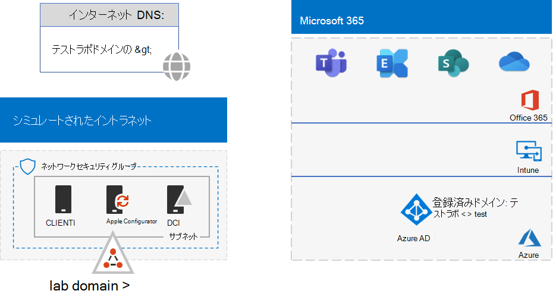
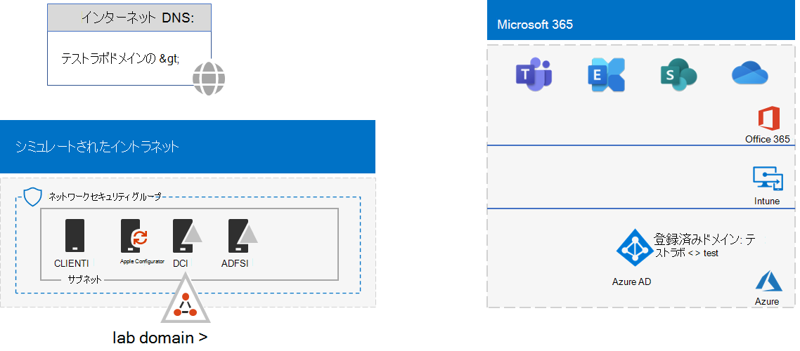

# <a name="federated-identity-for-your-microsoft-365-test-environment"></a>Microsoft 365 テスト環境のフェデレーション ID

*このテスト ラボ ガイドは、エンタープライズ環境とテスト環境Microsoft 365両方Office 365 Enterprise使用できます。*

Microsoft 365 は、フェデレーション ID をサポートします。つまり、資格情報自体の検証を実行する代わりに、Microsoft 365 は、接続しようとしているユーザーを、Microsoft 365 が信頼するフェデレーション認証サーバーに照会します。ユーザーの資格情報が正しい場合、フェデレーション認証サーバーはセキュリティ トークンを発行し、次いでクライアントは認証の証明としてそのセキュリティ トークンを Microsoft 365 に送信します。フェデレーション ID を使用すると、Microsoft 365 サブスクリプションの認証のオフロードとスケールアップや、認証とセキュリティの高度なシナリオが可能になります。
  
この記事では、テスト環境に対してフェデレーション認証を構成するMicrosoft 365、次の結果について説明します。


  
この構成は、次の内容で構成されます:
  
- 試用版Microsoft 365 E5のサブスクリプション。
    
- インターネットに接続された簡略化された組織イントラネットで、Azure 仮想ネットワークのサブネット上の 5 つの仮想マシン (DC1、APP1、CLIENT1、ADFS1、および PROXY1) で構成されます。 Azure AD Connect APP1 で実行して、Active Directory ドメイン サービス ドメイン内のアカウントの一覧をユーザーに同期Microsoft 365。 PROXY1 は、受信認証要求を受信します。 ADFS1 は DC1 を使用して資格情報を検証し、セキュリティ トークンを発行します。
    
このテスト環境のセットアップには、次の 5 つのフェーズがあります。
- [フェーズ 1: Microsoft 365 テスト環境のパスワード ハッシュ同期を構成する](#phase-1-configure-password-hash-synchronization-for-your-microsoft-365-test-environment)
- [フェーズ 2: AD FS サーバーを作成する](#phase-2-create-the-ad-fs-server)
- [フェーズ 3：Web プロキシ サーバーを作成する](#phase-3-create-the-web-proxy-server)
- [フェーズ 4:自己署名証明書を作成し、ADFS1 と PROXY1 を構成する](#phase-4-create-a-self-signed-certificate-and-configure-adfs1-and-proxy1)
- [フェーズ 5: フェデレーション ID に対応するよう Microsoft 365 を構成する](#phase-5-configure-microsoft-365-for-federated-identity)
    
> [!NOTE]
> Azure Trial サブスクリプションでは、このテスト環境を構成できない。
  
## <a name="phase-1-configure-password-hash-synchronization-for-your-microsoft-365-test-environment"></a>フェーズ 1: Microsoft 365 テスト環境のパスワード ハッシュ同期を構成する

パスワード ハッシュ同期の手順[に従](password-hash-sync-m365-ent-test-environment.md)って、Microsoft 365。 結果の構成は次のように表示されます。
  

  
この構成は、次の内容で成立します。
  
- 試用版Microsoft 365 E5有料サブスクリプション。
- Azure 仮想ネットワークのサブネット上の DC1、APP1、および CLIENT1 仮想マシンで構成される、インターネットに接続された簡略化された組織イントラネット。 Azure AD Connect APP1 で実行して、TESTLAB Active Directory ドメイン サービス (AD DS) ドメインを定期的に Microsoft 365 サブスクリプションの Azure AD テナントに同期します。

## <a name="phase-2-create-the-ad-fs-server"></a>フェーズ 2: AD FS サーバーを作成する

AD FS サーバーは、Microsoft 365 と、DC1 でホストされている corp.contoso.com ドメイン内のアカウントとの間でのフェデレーション認証を提供します。
  
ADFS1 用の Azure 仮想マシンを作成するには、基本構成のサブスクリプション名、リソース グループ名、Azure の場所を入力して、次のコマンドをローカル コンピューターの Azure PowerShell コマンド プロンプトで実行します。
  
```powershell
$subscrName="<your Azure subscription name>"
$rgName="<the resource group name of your Base Configuration>"
$vnetName="TlgBaseConfig-01-VNET"
# NOTE: If you built your simulated intranet with Azure PowerShell, comment the previous line with a "#" and remove the "#" from the next line.
#$vnetName="TestLab"
Connect-AzAccount
Select-AzSubscription -SubscriptionName $subscrName
$staticIP="10.0.0.100"
$locName=(Get-AzResourceGroup -Name $rgName).Location
$vnet=Get-AzVirtualNetwork -Name $vnetName -ResourceGroupName $rgName
$pip = New-AzPublicIpAddress -Name ADFS1-PIP -ResourceGroupName $rgName -Location $locName -AllocationMethod Dynamic
$nic = New-AzNetworkInterface -Name ADFS1-NIC -ResourceGroupName $rgName -Location $locName -SubnetId $vnet.Subnets[0].Id -PublicIpAddressId $pip.Id -PrivateIpAddress $staticIP
$vm=New-AzVMConfig -VMName ADFS1 -VMSize Standard_D2_v2
$cred=Get-Credential -Message "Type the name and password of the local administrator account for ADFS1."
$vm=Set-AzVMOperatingSystem -VM $vm -Windows -ComputerName ADFS1 -Credential $cred -ProvisionVMAgent -EnableAutoUpdate
$vm=Set-AzVMSourceImage -VM $vm -PublisherName MicrosoftWindowsServer -Offer WindowsServer -Skus 2016-Datacenter -Version "latest"
$vm=Add-AzVMNetworkInterface -VM $vm -Id $nic.Id
$vm=Set-AzVMOSDisk -VM $vm -Name "ADFS-OS" -DiskSizeInGB 128 -CreateOption FromImage -StorageAccountType "Standard_LRS"
New-AzVM -ResourceGroupName $rgName -Location $locName -VM $vm
```

次に、[Azure portal](https://portal.azure.com) で、ADFS1 のローカル管理者アカウント名とパスワードを使用して ADFS1 仮想マシンに接続し、Windows PowerShell コマンド プロンプトを開きます。
  
ADFS1 と DC1 の間の名前の解決とネットワーク通信を確認するには、**ping dc1.corp.contoso.com** コマンドを実行し、4 つの応答があることを確認します。
  
次に、ADFS1 の Windows PowerShell プロンプトで次のコマンドを使用して、ADFS1 仮想マシンを CORP ドメインに参加させます。
  
```powershell
$cred=Get-Credential -UserName "CORP\User1" -Message "Type the User1 account password."
Add-Computer -DomainName corp.contoso.com -Credential $cred
Restart-Computer
```

結果の構成は次のように表示されます。
  

  
## <a name="phase-3-create-the-web-proxy-server"></a>フェーズ 3：Web プロキシ サーバーを作成する

PROXY1 は、認証しようとするユーザーと ADFS1 との間の認証メッセージのプロキシを提供します。
  
PROXY1 用の Azure 仮想マシンを作成するには、リソース グループ名と Azure の場所を入力し、次のコマンドをローカル コンピューターの Azure PowerShell コマンド プロンプトで実行します。
  
```powershell
$rgName="<the resource group name of your Base Configuration>"
$vnetName="TlgBaseConfig-01-VNET"
# NOTE: If you built your simulated intranet with Azure PowerShell, comment the previous line with a "#" and remove the "#" from the next line.
#$vnetName="TestLab"
$staticIP="10.0.0.101"
$locName=(Get-AzResourceGroup -Name $rgName).Location
$vnet=Get-AzVirtualNetwork -Name $vnetName -ResourceGroupName $rgName
$pip = New-AzPublicIpAddress -Name PROXY1-PIP -ResourceGroupName $rgName -Location $locName -AllocationMethod Static
$nic = New-AzNetworkInterface -Name PROXY1-NIC -ResourceGroupName $rgName -Location $locName -SubnetId $vnet.Subnets[0].Id -PublicIpAddressId $pip.Id -PrivateIpAddress $staticIP
$vm=New-AzVMConfig -VMName PROXY1 -VMSize Standard_D2_v2
$cred=Get-Credential -Message "Type the name and password of the local administrator account for PROXY1."
$vm=Set-AzVMOperatingSystem -VM $vm -Windows -ComputerName PROXY1 -Credential $cred -ProvisionVMAgent -EnableAutoUpdate
$vm=Set-AzVMSourceImage -VM $vm -PublisherName MicrosoftWindowsServer -Offer WindowsServer -Skus 2016-Datacenter -Version "latest"
$vm=Add-AzVMNetworkInterface -VM $vm -Id $nic.Id
$vm=Set-AzVMOSDisk -VM $vm -Name "PROXY1-OS" -DiskSizeInGB 128 -CreateOption FromImage -StorageAccountType "Standard_LRS"
New-AzVM -ResourceGroupName $rgName -Location $locName -VM $vm
```

> [!NOTE]
> PROXY1 には静的パブリック IP アドレスが割り当てられます。この IP アドレスを指すパブリック DNS レコードが作成され、PROXY1 仮想マシンを再起動するときにこの IP アドレスを変更することはできないためです。
  
次に、CorpNet サブネットのネットワーク セキュリティ グループにルールを追加して、インターネットから PROXY1 のプライベート IP アドレスと TCP ポート 443 への未承諾の受信トラフィックを許可します。 ローカル コンピューターの Azure PowerShell コマンド プロンプトで、次のコマンドを実行します。
  
```powershell
$rgName="<the resource group name of your Base Configuration>"
Get-AzNetworkSecurityGroup -Name CorpNet -ResourceGroupName $rgName | Add-AzNetworkSecurityRuleConfig -Name "HTTPS-to-PROXY1" -Description "Allow TCP 443 to PROXY1" -Access "Allow" -Protocol "Tcp" -Direction "Inbound" -Priority 101 -SourceAddressPrefix "Internet" -SourcePortRange "*" -DestinationAddressPrefix "10.0.0.101" -DestinationPortRange "443" | Set-AzNetworkSecurityGroup
```

次に、[Azure portal](https://portal.azure.com) で、PROXY1 のローカル管理者アカウント名とパスワードを使用して PROXY1 仮想マシンに接続し、PROXY1 で Windows PowerShell コマンド プロンプトを開きます。
  
PROXY1 と DC1 の間の名前の解決とネットワーク通信を確認するには、**ping dc1.corp.contoso.com** コマンドを実行し、4 つの応答があることを確認します。
  
次に、PROXY1 の Windows PowerShell プロンプトで次のコマンドを使用して、PROXY1 仮想マシンを CORP ドメインに参加させます。
  
```powershell
$cred=Get-Credential -UserName "CORP\User1" -Message "Type the User1 account password."
Add-Computer -DomainName corp.contoso.com -Credential $cred
Restart-Computer
```

ローカル コンピューターでこれらのコマンドを使用して PROXY1 のAzure PowerShell IP アドレスを表示します。
  
```powershell
Write-Host (Get-AzPublicIpaddress -Name "PROXY1-PIP" -ResourceGroup $rgName).IPAddress
```

次に、パブリック DNS プロバイダーを操作して、**Write-Host** コマンドで表示される IP アドレスに解決される、**fs.testlab.**\<*your DNS domain name*> 用の新しいパブリック DNS A レコードを作成します。これ以降、**fs.testlab.**\<*your DNS domain name*> を *フェデレーション サービス FQDN* と呼びます。
  
次に、[Azure portal](https://portal.azure.com) で、CORP\\User1 の資格情報を使用して DC1 仮想マシンに接続し、管理者レベルの Windows PowerShell コマンド プロンプトで次のコマンドを実行します。
  
```powershell
Add-DnsServerPrimaryZone -Name corp.contoso.com -ZoneFile corp.contoso.com.dns
Add-DnsServerResourceRecordA -Name "fs" -ZoneName corp.contoso.com -AllowUpdateAny -IPv4Address "10.0.0.100" -TimeToLive 01:00:00
```
これらのコマンドは、Azure 仮想ネットワーク上の仮想マシンが内部フェデレーション サービス FQDN を ADFS1 のプライベート IP アドレスに解決できるよう、内部 DNS A レコードを作成します。
  
結果の構成は次のように表示されます。
  

  
## <a name="phase-4-create-a-self-signed-certificate-and-configure-adfs1-and-proxy1"></a>フェーズ 4:自己署名証明書を作成し、ADFS1 と PROXY1 を構成する

このフェーズでは、フェデレーション サービス FQDN 用の自己署名入りデジタル証明書を作成し、ADFS1 と PROXY1 を AD FS ファームとして構成します。
  
まず、[Azure portal](https://portal.azure.com) で、CORP\\User1 の資格情報を使用して DC1 仮想マシンに接続し、管理者レベルの Windows PowerShell コマンド プロンプトを開きます。 
  
次に、DC1 ADコマンド プロンプトで次のコマンドを使用して、Windows PowerShell FS サービス アカウントを作成します。
  
```powershell
New-ADUser -SamAccountName ADFS-Service -AccountPassword (read-host "Set user password" -assecurestring) -name "ADFS-Service" -enabled $true -PasswordNeverExpires $true -ChangePasswordAtLogon $false
```
このコマンドでは、アカウントのパスワードを入力するよう求められることにご注意ください。 強力なパスワードを選択して、安全な場所に記録してください。 このフェーズとフェーズ 5 には必要です。
  
[Azure portal](https://portal.azure.com) で CORP\\User1 の資格情報を使用して、ADFS1 仮想マシンに接続します。ADFS1 で管理者レベルの Windows PowerShell コマンド プロンプトを開き、フェデレーション サービス FQDN を入力し、次のコマンドを実行して自己署名証明書を作成します。
  
```powershell
$fedServiceFQDN="<federation service FQDN>"
New-SelfSignedCertificate -DnsName $fedServiceFQDN -CertStoreLocation "cert:\LocalMachine\My"
New-Item -path c:\Certs -type directory
New-SmbShare -name Certs -path c:\Certs -changeaccess CORP\User1
```

その次に、次の手順を使用して新しい自己署名証明書をファイルとして保存します。
  
1. [ **スタート] を** 選択し、mmc.exe入力し **、Enter** キーを **押します**。
    
2. [ファイル **の**  >  **追加と削除] スナップインを選択します**。
    
3. [**スナップインの追加** と削除] で、使用可能なスナップインの一覧で [証明書] をダブルクリックし、[**コンピューター** アカウント] を選択し、[次へ] を選択 **します**。
    
4. [ **コンピューターの選択]** で、[ **完了] を選択** し **、[OK] を選択します**。
    
5. ツリー ウィンドウで、**[証明書 (ローカル コンピューター)] > [個人] > [証明書]** の順に開きます。
    
6. フェデレーション サービス FQDN を使用して証明書を選択して保持 (または右クリック) し、[すべてのタスク] を選択し、[エクスポート] を **選択します**。
    
7. [ようこそ] **ページで** 、[次へ] を **選択します**。
    
8. [プライベート キー **のエクスポート] ページで** 、[はい] **を選択し**、[次へ] を **選択します**。
    
9. [ファイル形式 **のエクスポート] ページで** 、[すべての拡張プロパティをエクスポートする] **を選択** し、[次へ] を **選択します**。
    
10. [セキュリティ **] ページで**、[パスワード]**を選択し**、[パスワード] と [パスワードの確認 **] にパスワード****を入力します。**
    
11. [エクスポートする **ファイル] ページで、[** 参照] を **選択します**。
    
12. **C: \\ Certs フォルダーを参照** し、[ファイル名] に **SSL** と **入力** し、[保存] を **選択します。**
    
13. [エクスポートする **ファイル] ページで、[** 次へ] を **選択します**。
    
14. [証明書の **エクスポート ウィザードの完了] ページで、[** 完了] を **選択します**。 プロンプトが表示されたら **、[OK] を選択します**。
    
次に、ADFS1 の Windows PowerShell コマンド プロンプトで次のコマンドを使用して、AD FS サービスをインストールします。
  
```powershell
Install-WindowsFeature ADFS-Federation -IncludeManagementTools
```

インストールが完了するまで待ちます。
  
次いで、次の手順で AD FS サービスを構成します。
  
1. [ **スタート] を** 選択し、[サーバー マネージャー] **アイコンを選択** します。
    
2. サーバー マネージャーのツリー ウィンドウで、[FS] を **ADします**。
    
3. 上部のツール バーでオレンジ色の注意記号を選択し、[このサーバーでフェデレーション サービスを構成する **] を選択します**。
    
4. Active Directory **フェデレーション サービス** 構成ウィザードの [ようこそ] ページで、[次へ] を **選択します**。
    
5. [DS を **ConnectするAD] ページで、[** 次へ] を **選択します**。
    
6. **[サービスのプロパティの指定]** ページで、次の操作を実行します。
    
  - [SSL **証明書]** で下矢印を選択し、フェデレーション サービス FQDN の名前を持つ証明書を選択します。
    
  - [ **フェデレーション サービスの表示名]** に、架空の組織の名前を入力します。
    
  - [**次へ**] を選択します。
    
7. [サービス アカウント **の指定] ページで** 、[アカウント **名の選択]** **を選択します**。
    
8. [**ユーザーまたはサービス アカウントの選択]** で **、ADFS-Service** と入力し、[名前の確認] を選択し **、[OK] を選択します**。 
    
9. [ **アカウント パスワード]** で、アカウントのパスワードをADFS-Serviceし、[次へ] を **選択します**。
    
10. [構成データベース **の指定] ページで** 、[次へ] を **選択します**。
    
11. [オプションの **確認] ページで** 、[次へ] を **選択します**。
    
12. [前提条件 **のチェック] ページで、[** 構成] を **選択します**。

13. [結果] **ページで** 、[閉じる] **を選択します**。
    
14. [ **スタート] を** 選択し、電源アイコンを選択し、[再起動] **を選択し**、[続行] を **選択します**。
    
[Azure portal](https://portal.azure.com) から、CORP\\User1 アカウントの資格情報を使用して PROXY1 に接続します。
  
その次に、次の手順を使用して、**PROXY1 と APP1 の両方** に自己署名証明書をインストールします。
  
1. [ **スタート] を** 選択し、mmc.exe入力し **、Enter** キーを **押します**。
    
2. [ **ファイル] >スナップインの追加と削除を選択します**。
    
3. [**スナップインの追加** と削除] で、使用可能なスナップインの一覧で [証明書] をダブルクリックし、[**コンピューター** アカウント] を選択し、[次へ] を選択 **します**。
    
4. [ **コンピューターの選択]** で、[ **完了] を選択** し **、[OK] を選択します**。
    
5. ツリー ウィンドウで、[証明書 (**ローカル コンピューター) 個人用証明書]**  >  **を**  >  **開きます**。
    
6. [個人] を選択して保持 (または右クリック)**し、[** すべてのタスク] を選択し、[インポート] を **選択します**。
    
7. [ようこそ] **ページで** 、[次へ] を **選択します**。
    
8. [インポート **するファイル] ページで****\\ \\ 、adfs1 \\ certs \\ ssl.pfx と** 入力し、[次へ] を **選択します**。
    
9. [プライベート **キー保護] ページで**、[パスワード]に証明書パスワードを入力し、[次へ] を選択 **します。**
    
10. [証明書ストア **] ページで、[** 次へ] を **選択します。**
    
11. [完了] **ページで、[** 完了] を **選択します**。
    
12. [証明書ストア **] ページで、[** 次へ] を **選択します**。
    
13. プロンプトが表示されたら **、[OK] を選択します**。
    
14. ツリー ウィンドウで、[証明書] **を選択します**。
    
15. 証明書を選択して保持 (または右クリック) し、[コピー] を **選択します**。
    
16. ツリー ウィンドウで、[信頼されたルート証明機関 **の証明書] を**  >  **開きます**。
    
17. インストールされている証明書の一覧の下にマウス ポインターを移動し、長押し (または右クリック) し、[貼り付け] を **選択します**。
    
管理者レベルの PowerShell コマンド プロンプトを開き、次のコマンドを実行します。
  
```powershell
Install-WindowsFeature Web-Application-Proxy -IncludeManagementTools
```

インストールが完了するまで待ちます。
  
次の手順を使用して、Web アプリケーション プロキシ サービスを構成し、そのフェデレーション サーバーとして ADFS1 を使用します。
  
1. [スタート **] を** 選択し、[サーバー マネージャー] **を選択します**。
    
2. ツリー ウィンドウで、[リモート アクセス] **を選択します**。
    
3. 上部のツール バーでオレンジ色の注意記号を選択し、[Web アプリケーション プロキシ ウィザードを開く **] を選択します**。
    
4. Web アプリケーション **プロキシ構成** ウィザードの [ようこそ] ページで、[次へ] を **選択します**。
    
5. **[フェデレーション サーバー]** ページで、次の操作を実行します。
    
  - [フェデレーション **サービス名] ボックス** に、フェデレーション サービス FQDN を入力します。
    
  - [ユーザー名 **] ボックスに****「CORP \\ User1」と入力します**。
    
  - [パスワード **] ボックス** に、User1 アカウントのパスワードを入力します。
    
  - [**次へ**] を選択します。
    
6. [FS **プロキシAD]** ページで、下矢印を選択し、フェデレーション サービス FQDN の証明書を選択し、[次へ] を選択 **します**。
    
7. [確認] **ページで** 、[構成] を **選択します**。
    
8. [結果] **ページで** 、[閉じる] **を選択します**。
    
## <a name="phase-5-configure-microsoft-365-for-federated-identity"></a>フェーズ 5: フェデレーション ID に対応するよう Microsoft 365 を構成する

[Azure portal](https://portal.azure.com) を使用して、CORP\\User1 アカウントの資格情報で APP1 仮想マシンに接続します。
  
次の手順を使用して、フェデレーション認証に対応するように Azure AD Connect と Microsoft 365 サブスクリプションを構成します。
  
1. デスクトップで、**[Azure AD Connect]** をダブルクリックします。
    
2. [Azure **へようこそ] ページで、[構成AD Connect** を **選択します**。
    
3. [追加タスク **] ページで** 、[ユーザー サインインの変更] **を** 選択し、[次へ] を **選択します**。
    
4. [Azure **Connect] ページAD、** グローバル管理者アカウント名とパスワードを入力し、[次へ] を **選択します**。
    
5. [ユーザー サインイン **] ページで、[FS** とのフェデレーション] を選択 **AD、[次** へ] を **選択します**。
    
6. [FS ファーム **AD]** ページで、[既存の FS ファームAD使用する] を選択し、[サーバー名] ボックスに **「ADFS1」** と **入力** し、[次へ] を選択 **します**。
    
7. サーバー資格情報の入力を求めるメッセージが表示されたら、CORP User1 アカウントの資格情報を入力し \\ **、[OK] を選択します**。
    
8. [ドメイン **管理者の資格情報]** ページで、[ユーザー名]ボックスに **「CORP \\ User1」** と入力し、[パスワード] ボックスにアカウント パスワードを **入力** し、[次へ] を **選択します**。
    
9. [AD **FS** サービス アカウント] ページで、[ドメイン ユーザー名]ボックスに **\\ 「CORP ADFS-Service」** と入力し、[ドメイン ユーザー パスワード] ボックスにアカウント パスワードを **入力** し、[次へ] を選択 **します**。
    
10. **[Azure AD ドメイン**] ページの [**ドメイン]** で、フェーズ 1 で以前に作成してサブスクリプションに追加したドメインの名前を選択し、[次へ] を選択 **します**。
    
11. [構成の **準備完了] ページで、[** 構成] を **選択します**。
    
12. [インストールの **完了] ページで** 、[確認] を **選択します**。
    
    イントラネットとインターネットの構成の両方が確認されたことを示すメッセージが表示されます。
    
13. [インストールの **完了] ページで** 、[終了] を **選択します**。
    
フェデレーション認証が機能していることを実証するには、次の操作を実行します。
  
1. ローカル コンピューター上でブラウザーの新しいプライベート インスタンスを開き、[https://admin.microsoft.com](https://admin.microsoft.com) にアクセスします。
    
2. サインイン資格情報に「user1@」**と入力します** \<*the domain created in Phase 1*> 。
    
    たとえば、テスト ドメインが testlab.contoso.com **場合は**、「user1@testlab.contoso.com」 と入力します。 Tab キー **を押** するか、自動的にリダイレクトMicrosoft 365を許可します。
    
    **[この接続ではプライバシーが保護されません]** ページが表示されます。 これは、デスクトップ コンピューターで検証できない自己署名証明書を ADFS1 にインストールしたためです。 フェデレーション認証の運用環境デプロイメントでは、信頼された証明機関からの証明書を使用するため、ユーザーにこのページは表示されません。
    
3. [接続が **プライベートではない] ページで、[** 詳細設定] を選択 **し**、[続行]**を選択します \<*your federation service FQDN*>**。 
    
4. 架空の組織名のページで、次を使用してサインインします。
    
  - 名前: **CORP\\User1**
    
  - User1 アカウントのパスワード
    
    **[Microsoft Office Home]** ページが表示されます。
    
次の手順で、試用版サブスクリプションが、DC1 上でホストされている AD DS corp.contoso.com ドメインとフェデレーションされていることを実証します。認証プロセスに関する基本事項を以下に示します。
  
1. フェーズ 1 で作成したフェデレーション ドメインをサインイン アカウント名で使用すると、Microsoft 365 はブラウザーをフェデレーション サービス FQDN と PROXY1 にリダイレクトします。
    
2. PROXY1 は、ローカル コンピューターに架空の会社のサインイン ページを送信します。
    
3. CORP\\User1 とパスワードを PROXY1 に送信すると、それらは ADFS1 に転送されます。
    
4. ADFS1 は、DC1 を使用して CORP\\User1 とパスワードを検証し、ローカル コンピューターにセキュリティ トークンを送信します。
    
5. ローカル コンピューターは、セキュリティ トークンを Microsoft 365 に送信します。
    
6. Microsoft 365 は、セキュリティ トークンが ADFS1 によって作成されたことを検証して、アクセスを許可します。
    
これで、試用版のサブスクリプションがフェデレーション認証を行うように構成されました。この開発/テスト環境は、高度な認証シナリオで使用できます。
  
## <a name="next-step"></a>次の手順

Azure で Microsoft 365 用の実稼働対応の高可用性フェデレーション認証を展開する準備ができたら、「Azure での高可用性フェデレーション認証の展開Microsoft 365」を[参照してください](deploy-high-availability-federated-authentication-for-microsoft-365-in-azure.md)。
  
