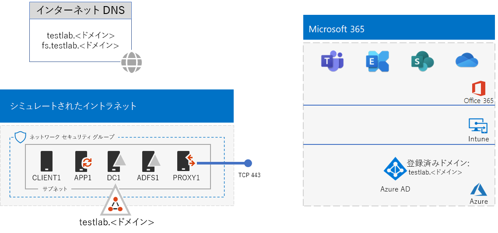
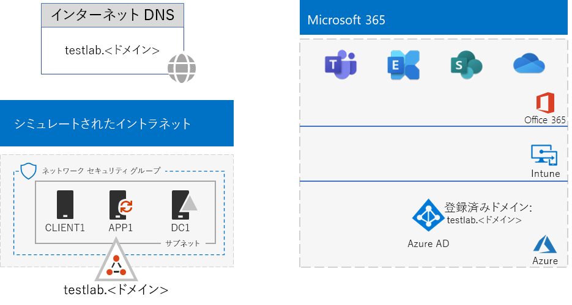
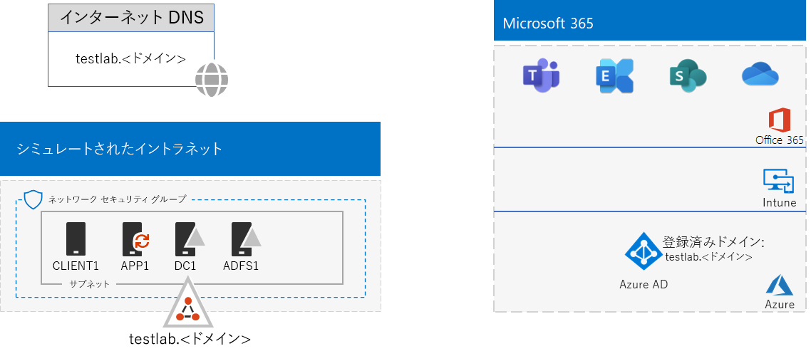

# <a name="federated-identity-for-your-microsoft-365-test-environment"></a>Microsoft 365 テスト環境のフェデレーション ID

*このテスト ラボ ガイドは、Microsoft 365 Enterprise および Office 365 Enterprise テスト環境に使用できます。*

Office 365 は、フェデレーション ID をサポートします。つまり、資格情報自体の検証を実行する代わりに、Office 365 は、接続しようとしているユーザーを、Office 365 が信頼するフェデレーション認証サーバーに照会します。ユーザーの資格情報が正しい場合、フェデレーション認証サーバーはセキュリティ トークンを発行し、次いでクライアントは認証の証明としてそのセキュリティ トークンを Office 365 に送信します。フェデレーション ID を使用すると、Office 365 サブスクリプションの認証のオフロードとスケールアップや、認証とセキュリティの高度なシナリオが可能になります。
  
この記事では、Microsoft 365 または Office 365 テスト環境用にフェデレーション認証を構成する方法について説明します。最終的に、この環境は次のようになります。


  
この構成は、次の内容で構成されます: 
  
- Microsoft 365 E5 または Office 365 E5 の試用版または製品版サブスクリプション。
    
- インターネットに接続する組織の簡易型イントラネット。Azure 仮想ネットワークのサブネット上に配置された 5 つの仮想マシン (DC1、APP1、CLIENT1、ADFS1、PROXY1) で構成されます。APP1 では、Active Directory Domain Services ドメインのアカウントの一覧を Office 365 に同期するために Azure AD Connect が実行されます。PROXY1 は、受信認証要求を受信します。ADFS1 は、DC1 で資格情報を検証し、セキュリティ トークンを発行します。
    
次に示す 5 つのフェーズで、この開発/テスト環境を設定します。
  
1. パスワード ハッシュ同期を実装するシミュレーションのエンタープライズ テスト環境を作成する。
    
2. AD FS サーバー (ADFS1) を作成する。
    
3. Web プロキシ サーバー (PROXY1) を作成する。
    
4. 自己署名証明書を作成し、ADFS1 と PROXY1 を構成する。
    
5. フェデレーション ID に対応するよう Office 365 を構成する。
    
> [!NOTE]
> Azure の試用版サブスクリプションで、このテスト環境を構成することはできません。 
  
## <a name="phase-1-configure-password-hash-synchronization-for-your-microsoft-365-test-environment"></a>フェーズ 1: Microsoft 365 テスト環境のパスワード ハッシュ同期を構成する

「[Microsoft 365 でのパスワード ハッシュ同期](password-hash-sync-m365-ent-test-environment.md)」の手順に従います。最終的な構成は次のとおりです。
  

  
この構成は、次の内容で成立します。 
  
- Microsoft 365 E5 または Office 365 E5 の試用版または有料サブスクリプション。
- インターネットに接続する組織の簡易型イントラネット。Azure 仮想ネットワークのサブネット上に配置された仮想マシン DC1、APP1、および CLIENT1 で構成されます。 Azure AD Connect が APP1 上で実行され、TESTLAB AD DS ドメインが、Microsoft 365 または Office 365 サブスクリプションの Azure AD テナントに定期的に同期されます。

## <a name="phase-2-create-the-ad-fs-server"></a>フェーズ 2: AD FS サーバーを作成する

AD FS サーバーは、Office 365 と、DC1 でホストされている corp.contoso.com ドメイン内のアカウントとの間でのフェデレーション認証を提供します。
  
ADFS1 用の Azure 仮想マシンを作成するには、基本構成のサブスクリプション名、リソース グループ名、Azure の場所を入力して、次のコマンドをローカル コンピューターの Azure PowerShell コマンド プロンプトで実行します。
  
```powershell
$subscrName="<your Azure subscription name>"
$rgName="<the resource group name of your Base Configuration>"
$vnetName="TlgBaseConfig-01-VNET"
# NOTE: If you built your simulated intranet with Azure PowerShell, comment the previous line with a "#" and remove the "#" from the next line.
#$vnetName="TestLab"
Connect-AzAccount
Select-AzSubscription -SubscriptionName $subscrName
$staticIP="10.0.0.100"
$locName=(Get-AzResourceGroup -Name $rgName).Location
$vnet=Get-AzVirtualNetwork -Name $vnetName -ResourceGroupName $rgName
$pip = New-AzPublicIpAddress -Name ADFS1-PIP -ResourceGroupName $rgName -Location $locName -AllocationMethod Dynamic
$nic = New-AzNetworkInterface -Name ADFS1-NIC -ResourceGroupName $rgName -Location $locName -SubnetId $vnet.Subnets[0].Id -PublicIpAddressId $pip.Id -PrivateIpAddress $staticIP
$vm=New-AzVMConfig -VMName ADFS1 -VMSize Standard_D2_v2
$cred=Get-Credential -Message "Type the name and password of the local administrator account for ADFS1."
$vm=Set-AzVMOperatingSystem -VM $vm -Windows -ComputerName ADFS1 -Credential $cred -ProvisionVMAgent -EnableAutoUpdate
$vm=Set-AzVMSourceImage -VM $vm -PublisherName MicrosoftWindowsServer -Offer WindowsServer -Skus 2016-Datacenter -Version "latest"
$vm=Add-AzVMNetworkInterface -VM $vm -Id $nic.Id
$vm=Set-AzVMOSDisk -VM $vm -Name "ADFS-OS" -DiskSizeInGB 128 -CreateOption FromImage -StorageAccountType "Standard_LRS"
New-AzVM -ResourceGroupName $rgName -Location $locName -VM $vm
```

次に、[Azure portal](https://portal.azure.com) で、ADFS1 のローカル管理者アカウント名とパスワードを使用して ADFS1 仮想マシンに接続し、Windows PowerShell コマンド プロンプトを開きます。
  
ADFS1 と DC1 の間の名前の解決とネットワーク通信を確認するには、**ping dc1.corp.contoso.com** コマンドを実行し、4 つの応答があることを確認します。
  
次に、ADFS1 の Windows PowerShell プロンプトで次のコマンドを使用して、ADFS1 仮想マシンを CORP ドメインに参加させます。
  
```powershell
$cred=Get-Credential -UserName "CORP\User1" -Message "Type the User1 account password."
Add-Computer -DomainName corp.contoso.com -Credential $cred
Restart-Computer
```

最終的な構成をここに示します。
  

  
## <a name="phase-3-create-the-web-proxy-server"></a>フェーズ 3：Web プロキシ サーバーを作成する

PROXY1 は、認証しようとするユーザーと ADFS1 との間の認証メッセージのプロキシを提供します。
  
PROXY1 用の Azure 仮想マシンを作成するには、リソース グループ名と Azure の場所を入力し、次のコマンドをローカル コンピューターの Azure PowerShell コマンド プロンプトで実行します。
  
```powershell
$rgName="<the resource group name of your Base Configuration>"
$vnetName="TlgBaseConfig-01-VNET"
# NOTE: If you built your simulated intranet with Azure PowerShell, comment the previous line with a "#" and remove the "#" from the next line.
#$vnetName="TestLab"
$staticIP="10.0.0.101"
$locName=(Get-AzResourceGroup -Name $rgName).Location
$vnet=Get-AzVirtualNetwork -Name $vnetName -ResourceGroupName $rgName
$pip = New-AzPublicIpAddress -Name PROXY1-PIP -ResourceGroupName $rgName -Location $locName -AllocationMethod Static
$nic = New-AzNetworkInterface -Name PROXY1-NIC -ResourceGroupName $rgName -Location $locName -SubnetId $vnet.Subnets[0].Id -PublicIpAddressId $pip.Id -PrivateIpAddress $staticIP
$vm=New-AzVMConfig -VMName PROXY1 -VMSize Standard_D2_v2
$cred=Get-Credential -Message "Type the name and password of the local administrator account for PROXY1."
$vm=Set-AzVMOperatingSystem -VM $vm -Windows -ComputerName PROXY1 -Credential $cred -ProvisionVMAgent -EnableAutoUpdate
$vm=Set-AzVMSourceImage -VM $vm -PublisherName MicrosoftWindowsServer -Offer WindowsServer -Skus 2016-Datacenter -Version "latest"
$vm=Add-AzVMNetworkInterface -VM $vm -Id $nic.Id
$vm=Set-AzVMOSDisk -VM $vm -Name "PROXY1-OS" -DiskSizeInGB 128 -CreateOption FromImage -StorageAccountType "Standard_LRS"
New-AzVM -ResourceGroupName $rgName -Location $locName -VM $vm
```

> [!NOTE]
> PROXY1 には静的パブリック IP アドレスが割り当てられます。この IP アドレスを指すパブリック DNS レコードが作成され、PROXY1 仮想マシンを再起動するときにこの IP アドレスを変更することはできないためです。 
  
次に、CorpNet サブネットのネットワーク セキュリティ グループにルールを追加して、インターネットから PROXY1 のプライベート IP アドレスおよび TCP ポート 443 に着信する、受信者側が送信を要求していないトラフィックを許可します。ローカル コンピューターの Azure PowerShell コマンド プロンプトで、次のコマンドを実行します。
  
```powershell
$rgName="<the resource group name of your Base Configuration>"
Get-AzNetworkSecurityGroup -Name CorpNet -ResourceGroupName $rgName | Add-AzNetworkSecurityRuleConfig -Name "HTTPS-to-PROXY1" -Description "Allow TCP 443 to PROXY1" -Access "Allow" -Protocol "Tcp" -Direction "Inbound" -Priority 101 -SourceAddressPrefix "Internet" -SourcePortRange "*" -DestinationAddressPrefix "10.0.0.101" -DestinationPortRange "443" | Set-AzNetworkSecurityGroup
```

次に、[Azure portal](https://portal.azure.com) で、PROXY1 のローカル管理者アカウント名とパスワードを使用して PROXY1 仮想マシンに接続し、PROXY1 で Windows PowerShell コマンド プロンプトを開きます。
  
PROXY1 と DC1 の間の名前の解決とネットワーク通信を確認するには、**ping dc1.corp.contoso.com** コマンドを実行し、4 つの応答があることを確認します。
  
次に、PROXY1 の Windows PowerShell プロンプトで次のコマンドを使用して、PROXY1 仮想マシンを CORP ドメインに参加させます。
  
```powershell
$cred=Get-Credential -UserName "CORP\User1" -Message "Type the User1 account password."
Add-Computer -DomainName corp.contoso.com -Credential $cred
Restart-Computer
```

ローカル コンピューターで次の Azure PowerShell コマンドを使用して、PROXY1 のパブリック IP アドレスを表示します。
  
```powershell
Write-Host (Get-AzPublicIpaddress -Name "PROXY1-PIP" -ResourceGroup $rgName).IPAddress
```

次に、パブリック DNS プロバイダーを操作して、**Write-Host** コマンドで表示される IP アドレスに解決される、**fs.testlab.**\<DNS ドメイン名> 用の新しいパブリック DNS A レコードを作成します。これ以降、**fs.testlab.**\<DNS ドメイン名> を*フェデレーション サービス FQDN* と呼びます。
  
次に、[Azure portal](https://portal.azure.com) で、CORP\\User1 の資格情報を使用して DC1 仮想マシンに接続し、管理者レベルの Windows PowerShell コマンド プロンプトで次のコマンドを実行します。
  
```powershell
Add-DnsServerPrimaryZone -Name corp.contoso.com -ZoneFile corp.contoso.com.dns
Add-DnsServerResourceRecordA -Name "fs" -ZoneName corp.contoso.com -AllowUpdateAny -IPv4Address "10.0.0.100" -TimeToLive 01:00:00
```
これらのコマンドは、内部 DNS A レコードを作成します。これにより、Azure 仮想ネットワーク上の仮想マシンは内部フェデレーション FQDN を、ADFS1 のプライベート IP アドレスに解決できます。
  
最終的な構成をここに示します。
  

  
## <a name="phase-4-create-a-self-signed-certificate-and-configure-adfs1-and-proxy1"></a>フェーズ 4:自己署名証明書を作成し、ADFS1 と PROXY1 を構成する

このフェーズでは、フェデレーション サービス FQDN 用の自己署名入りデジタル証明書を作成し、ADFS1 と PROXY1 を AD FS ファームとして構成します。
  
まず、[Azure portal](https://portal.azure.com) で、CORP\\User1 の資格情報を使用して DC1 仮想マシンに接続し、管理者レベルの Windows PowerShell コマンド プロンプトを開きます。 
  
次に、DC1 の Windows PowerShell コマンド プロンプトで次のコマンドを使用して、AD FS サービス アカウントを作成します。
  
```powershell
New-ADUser -SamAccountName ADFS-Service -AccountPassword (read-host "Set user password" -assecurestring) -name "ADFS-Service" -enabled $true -PasswordNeverExpires $true -ChangePasswordAtLogon $false
```
このコマンドでは、アカウントのパスワードを入力するよう求められることにご注意ください。強力なパスワードを選択して、安全な場所に記録してください。このパスワードは、このフェーズとフェーズ 5 で必要になります。
  
[Azure portal](https://portal.azure.com) で CORP\\User1 の資格情報を使用して、ADFS1 仮想マシンに接続します。ADFS1 で管理者レベルの Windows PowerShell コマンド プロンプトを開き、フェデレーション サービス FQDN を入力し、次のコマンドを実行して自己署名証明書を作成します。
  
```powershell
$fedServiceFQDN="<federation service FQDN>"
New-SelfSignedCertificate -DnsName $fedServiceFQDN -CertStoreLocation "cert:\LocalMachine\My"
New-Item -path c:\Certs -type directory
New-SmbShare -name Certs -path c:\Certs -changeaccess CORP\User1
```

その次に、次の手順を使用して新しい自己署名証明書をファイルとして保存します。
  
1. **[スタート]** をクリックして、「**mmc.exe**」と入力し、**Enter** キーを押します。
    
2. **[ファイル] > [スナップインの追加と削除]** の順にクリックします。
    
3. **[スナップインの追加と削除]** で、利用できるスナップインの一覧の **[証明書]** をダブルクリックして、**[コンピューター アカウント]**、**[次へ]** の順にクリックします。
    
4. **[コンピューターの選択]** で、**[完了]**、**[OK]** の順にクリックします。
    
5. ツリー ウィンドウで、**[証明書 (ローカル コンピューター)] > [個人] > [証明書]** の順に開きます。
    
6. フェデレーション サービス FQDN を含む証明書を右クリックし、**[すべてのタスク]**、**[エクスポート]** の順にクリックします。
    
7. **[ようこそ]** ページで、**[次へ]** をクリックします。
    
8. **[秘密キーのエクスポート]** ページで、**[はい]**、**[次へ]** の順にクリックします。
    
9. **[エクスポート ファイルの形式]** ページで、**[すべての拡張プロパティをエクスポートする]**、**[次へ]** の順にクリックします。
    
10. **[セキュリティ]** ページで、**[パスワード]** をクリックして、**[パスワード]** と **[パスワードの確認入力]** にパスワードを入力します。
    
11. **[エクスポートするファイル]** ページで、**[参照]** をクリックします。
    
12. **C:\\Certs** フォルダーを参照して、**[ファイル名]** に「**SSL**」と入力し、**[保存]** をクリックします。
    
13. **[エクスポートするファイル]** ページで、**[次へ]** をクリックします。
    
14. **[証明書のエクスポート ウィザードの完了]** ページで、**[完了]** をクリックします。ダイアログが表示されたら、**[OK]** をクリックします。
    
次に、ADFS1 の Windows PowerShell コマンド プロンプトで次のコマンドを使用して、AD FS サービスをインストールします。
  
```powershell
Install-WindowsFeature ADFS-Federation -IncludeManagementTools
```

インストールが完了するまで待ちます。
  
次いで、次の手順で AD FS サービスを構成します。
  
1. **[スタート]** をクリックして、**[サーバー マネージャー]** アイコンをクリックします。
    
2. サーバー マネージャーのツリー ウィンドウで、**[AD FS]** をクリックします。
    
3. 上部にあるツール バーで、オレンジ色の警告マークをクリックし、**[このサーバーにフェデレーション サービスを構成します]** をクリックします。
    
4. Active Directory フェデレーション サービス構成ウィザードの **[ようこそ]** ページで、**[次へ]** をクリックします。
    
5. **[AD DS に接続]** ページで、**[次へ]** をクリックします。
    
6. **[サービスのプロパティの指定]** ページで、次の操作を実行します。
    
  - **[SSL 証明書]** で、下向き矢印をクリックし、フェデレーション サービス FQDN の名前を含む証明書をクリックします。
    
  - **[フェデレーション サービスの表示名]** で、架空の組織名を入力します。
    
  - **[次へ]** をクリックします。
    
7. **[サービス アカウントの指定]** ページで、**[アカウント名]** の **[選択]** をクリックします。
    
8. **[ユーザーまたはサービス アカウントの選択]** で、「**ADFS-Service**」と入力して、**[名前の確認]**、**[OK]** の順にクリックします。
    
9. **[アカウントのパスワード]** で、ADFS-Service アカウントのパスワードを入力して、**[次へ]** をクリックします。
    
10. **[構成データベースの指定]** ページで、**[次へ]** をクリックします。
    
11. **[オプションの確認]** ページで、**[次へ]** をクリックします。
    
12. **[前提条件の確認]** ページで、**[構成]** をクリックします。
    
13. **[結果]** ページで、**[閉じる]** をクリックします。
    
14. **[スタート]** をクリックして、電源アイコン、**[再起動]**、**[続行]** の順にクリックします。
    
[Azure portal](https://portal.azure.com) から、CORP\\User1 アカウントの資格情報を使用して PROXY1 に接続します。
  
その次に、次の手順を使用して、自己署名証明書をインストールし、PROXY1 を構成します。
  
1. **[スタート]** をクリックして、「**mmc.exe**」と入力し、**Enter** キーを押します。
    
2. **[ファイル] > [スナップインの追加と削除]** の順にクリックします。
    
3. **[スナップインの追加と削除]** で、利用できるスナップインの一覧の **[証明書]** をダブルクリックして、**[コンピューター アカウント]**、**[次へ]** の順にクリックします。
    
4. **[コンピューターの選択]** で、**[完了]**、**[OK]** の順にクリックします。
    
5. ツリー ウィンドウで、**[証明書 (ローカル コンピューター)] > [個人] > [証明書]** の順に開きます。
    
6. **[個人]** を右クリックして、**[すべてのタスク]**、**[インポート]** の順にクリックします。
    
7. **[ようこそ]** ページで、**[次へ]** をクリックします。
    
8. **[インポートする証明書ファイル]** ページで、「**\\\\adfs1\\certs\\ssl.pfx**」と入力し、**[次へ]** をクリックします。
    
9. **[秘密キーの保護]** ページで、**[パスワード]** に証明書のパスワードを入力して、**[次へ]** をクリックします。
    
10. **[証明書ストア]** ページで **[次へ]** をクリックします。
    
11. **[完了]** ページで、**[完了]** をクリックします。
    
12. **[証明書ストア]** ページで、**[次へ]** をクリックします。
    
13. ダイアログが表示されたら、**[OK]** をクリックします。
    
14. ツリー ウィンドウで、**[証明書]** をクリックします。
    
15. 証明書を右クリックして、**[コピー]** をクリックします。
    
16. ツリー ウィンドウで、**[信頼されたルート証明機関] > [証明書]** の順に開きます。
    
17. インストールされている証明書の一覧の下にマウス ポインターを移動し、右クリックして、**[貼り付け]** をクリックします。
    
管理者レベルの PowerShell コマンド プロンプトを開き、次のコマンドを実行します。
  
```powershell
Install-WindowsFeature Web-Application-Proxy -IncludeManagementTools
```

インストールが完了するまで待ちます。
  
次の手順を使用して、Web アプリケーション プロキシ サービスを構成し、そのフェデレーション サーバーとして ADFS1 を使用します。
  
1. **[スタート]** をクリックしてから、**[サーバー マネージャー]** をクリックします。
    
2. ツリー ウィンドウで、**[リモート アクセス]** をクリックします。
    
3. 上部にあるツール バーで、オレンジ色の警告マークをクリックし、**[Web アプリケーション プロキシ ウィザードを表示する]** をクリックします。
    
4. Web アプリケーション プロキシ構成ウィザードの **[ようこそ]** ページで、**[次へ]** をクリックします。
    
5. **[フェデレーション サーバー]** ページで、次の操作を実行します。
    
  - **[フェデレーション サービス名]** にフェデレーション サービス FQDN を入力します。
    
  - **[ユーザー名]** に「**CORP\\User1**」と入力します。
    
  - **[パスワード]** に User1 アカウントのパスワードを入力します。
    
  - **[次へ]** をクリックします。
    
6. **[AD FS プロキシ証明書]** ページで、下向き矢印をクリックし、フェデレーション サービス FQDN を含む証明書をクリックして、**[次へ]** をクリックします。
    
7. **[確認]** ページで、**[構成]** をクリックします。
    
8. **[結果]** ページで、**[閉じる]** をクリックします。

    
## <a name="phase-5-configure-office-365-for-federated-identity"></a>フェーズ 5: フェデレーション ID に対応するよう Office 365 を構成する

[Azure portal](https://portal.azure.com) を使用して、CORP\\User1 アカウントの資格情報で APP1 仮想マシンに接続します。
  
次の手順を使用して、フェデレーション認証に対応するように Azure AD Connect と Office 365 サブスクリプションを構成します。
  
1. デスクトップで、**[Azure AD Connect]** をダブルクリックします。
    
2. **[Azure AD Connect へようこそ]** ページで、**[構成]** をクリックします。
    
3. **[追加のタスク]** ページで、**[ユーザー サインインの変更]**、**[次へ]** の順にクリックします。
    
4. **[Azure AD に接続]** ページで、Office 365 全体管理者のアカウント名とパスワードを入力して、**[次へ]** をクリックします。
    
5. **[ユーザー サインイン]** ページで、**[AD FS とのフェデレーション]** をクリックしてから、**[次へ]** をクリックします。
    
6. **[AD FS ファーム]** ページで、**[既存の AD FS のファームを使用する]** をクリックして、**[サーバー名]** に「**ADFS1**」と入力し、**[次へ]** をクリックします。
    
7. サーバーの資格情報の入力を求められたら、CORP\\User1 アカウントの資格情報を入力し、**[OK]** をクリックします。
    
8. **[ドメイン管理者]** の資格情報ページで、**[ユーザー名]** に「**CORP\\User1**」と入力し、**[パスワード]** にアカウントのパスワードを入力して、**[次へ]** をクリックします。
    
9. **[AD FS サービス アカウント]** ページで、**[ドメイン ユーザー名]** に「**CORP\\ADFS-Service**」を入力し、**[ドメイン ユーザー パスワード]** にアカウントのパスワードを入力して、**[次へ]** をクリックします。
    
10. **[Azure AD Domain]** ページの **[ドメイン]** で、あらかじめフェーズ 1 で作成して、Office 365 サブスクリプションに追加したドメイン名を選択して、**[次へ]** をクリックします。
    
11. **[構成の準備完了]** ページで、**[構成]** をクリックします。
    
12. **[インストールの完了]** ページで、**[確認]** をクリックします。
    
    イントラネット構成とインターネット構成の両方が確認されたことを示すメッセージが表示されます。
    
13. **[インストールの完了]** ページで、**[終了]** をクリックします。
    
フェデレーション認証が機能していることを実証するには、次の操作を実行します。
  
1. ローカル コンピューター上でブラウザーの新しいプライベート インスタンスを開き、[https://admin.microsoft.com](https://admin.microsoft.com) にアクセスします。
    
2. サインイン資格情報に、**user1@**\<フェース 1 で作成したドメイン> を入力します。 
    
    たとえば、テスト ドメインが **testlab.contoso.com** の場合は、「user1@testlab.contoso.com」と入力します。TAB キーを押すか、Office 365 に自動的にリダイレクトさせます。
    
    **[この接続ではプライバシーが保護されません]** ページが表示されます。これが表示されるのは、デスクトップ コンピューターで検証できない自己署名証明書を ADFS1 にインストールしたためです。フェデレーション認証の運用環境デプロイメントでは、信頼された証明機関からの証明書を使用するため、ユーザーにこのページは表示されません。
    
3. **[この接続ではプライバシーが保護されません]** ページで、**[詳細設定]**、**[\<フェデレーション サービス FQDN> に進む]** の順にクリックします。 
    
4. 架空の組織名のページで、次を使用してサインインします。
    
  - 名前: **CORP\\User1**
    
  - User1 アカウントのパスワード
    
    **[Microsoft Office Home]** ページが表示されます。
    
次の手順で、Office 365 試用版サブスクリプションが、DC1 上でホストされている AD DS corp.contoso.com ドメインとフェデレーションされていることを実証します。認証プロセスに関する基本事項を以下に示します。
  
1. フェーズ 1 で作成したフェデレーション ドメインをサインイン アカウント名で使用すると、Office 365 はブラウザーをフェデレーション サービス FQDN と PROXY1 にリダイレクトします。
    
2. PROXY1 は、ローカル コンピューターに架空の会社のサインイン ページを送信します。
    
3. CORP\\User1 とパスワードを PROXY1 に送信すると、それらは ADFS1 に転送されます。
    
4. ADFS1 は、DC1 を使用して CORP\\User1 とパスワードを検証し、ローカル コンピューターにセキュリティ トークンを送信します。
    
5. ローカル コンピューターは、セキュリティ トークンを Office 365 に送信します。
    
6. Office 365 は、セキュリティ トークンが ADFS1 によって作成されたことを検証して、アクセスを許可します。
    
これで、Office 365 試用版のサブスクリプションがフェデレーション認証を行うように構成されました。この開発/テスト環境は、高度な認証シナリオで使用できます。
  
## <a name="next-step"></a>次の手順

Azure で Microsoft 365 または Office 365 に対する運用環境対応の高可用性フェデレーション認証をデプロイする準備が整っている場合は、「[Deploy high availability federated authentication for Office 365 in Azure](https://docs.microsoft.com/office365/enterprise/deploy-high-availability-federated-authentication-for-office-365-in-azure)」を参照してください。
  
