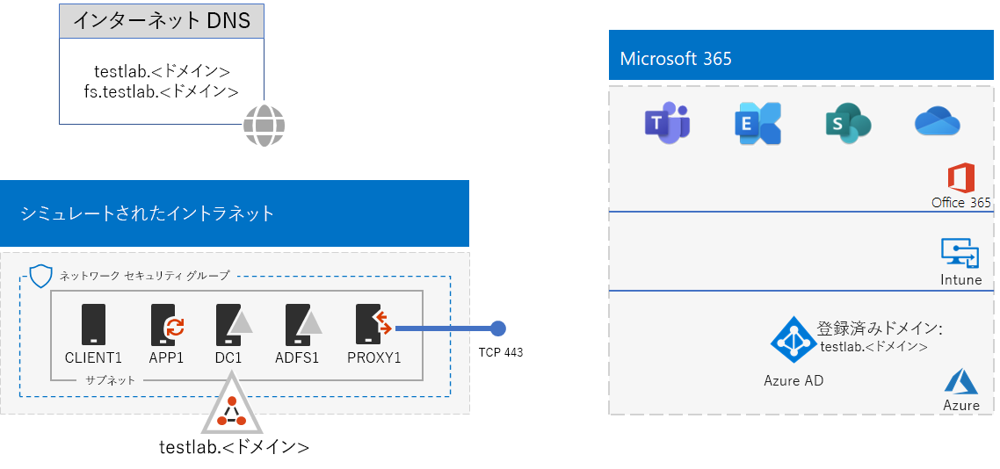
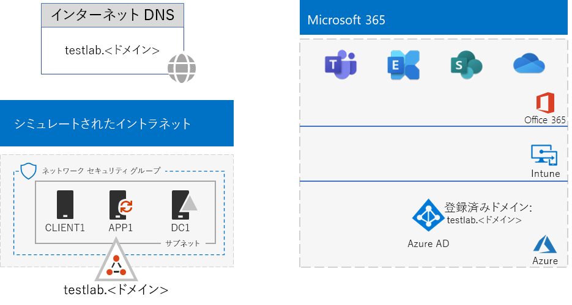
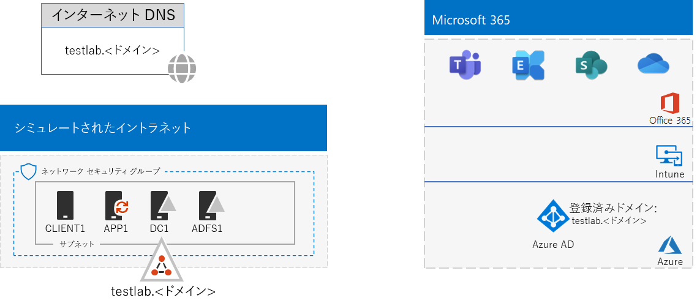

# <a name="federated-identity-for-your-microsoft-365-test-environment"></a><span data-ttu-id="b94a9-103">Microsoft 365 テスト環境のフェデレーション ID</span><span class="sxs-lookup"><span data-stu-id="b94a9-103">Federated identity for your Microsoft 365 test environment</span></span>

<span data-ttu-id="b94a9-104">*このテスト ラボ ガイドは、Microsoft 365 Enterprise および Office 365 Enterprise テスト環境に使用できます。*</span><span class="sxs-lookup"><span data-stu-id="b94a9-104">*This Test Lab Guide can be used for both Microsoft 365 Enterprise and Office 365 Enterprise test environments.*</span></span>

<span data-ttu-id="b94a9-p101">Office 365 は、フェデレーション ID をサポートします。つまり、資格情報自体の検証を実行する代わりに、Office 365 は、接続しようとしているユーザーを、Office 365 が信頼するフェデレーション認証サーバーに照会します。ユーザーの資格情報が正しい場合、フェデレーション認証サーバーはセキュリティ トークンを発行し、次いでクライアントは認証の証明としてそのセキュリティ トークンを Office 365 に送信します。フェデレーション ID を使用すると、Office 365 サブスクリプションの認証のオフロードとスケールアップや、認証とセキュリティの高度なシナリオが可能になります。</span><span class="sxs-lookup"><span data-stu-id="b94a9-p101">Office 365 supports federated identity. This means that instead of performing the validation of credentials itself, Office 365 refers the connecting user to a federated authentication server that Office 365 trusts. If the user's credentials are correct, the federated authentication server issues a security token that the client then sends to Office 365 as proof of authentication. Federated identity allows for the offloading and scaling up of authentication for an Office 365 subscription and advanced authentication and security scenarios.</span></span>
  
<span data-ttu-id="b94a9-109">この記事では、Microsoft 365 または Office 365 テスト環境用にフェデレーション認証を構成する方法について説明します。最終的に、この環境は次のようになります。</span><span class="sxs-lookup"><span data-stu-id="b94a9-109">This article describes how you can configure federated authentication for your Microsoft 365 or Office 365 test environment, resulting in the following:</span></span>


  
<span data-ttu-id="b94a9-111">この構成は、次の内容で構成されます:</span><span class="sxs-lookup"><span data-stu-id="b94a9-111">This configuration consists of:</span></span> 
  
- <span data-ttu-id="b94a9-112">Microsoft 365 E5 または Office 365 E5 の試用版または製品版サブスクリプション。</span><span class="sxs-lookup"><span data-stu-id="b94a9-112">A Microsoft 365 E5 or Office 365 E5 trial or production subscription.</span></span>
    
- <span data-ttu-id="b94a9-p102">インターネットに接続する組織の簡易型イントラネット。Azure 仮想ネットワークのサブネット上に配置された 5 つの仮想マシン (DC1、APP1、CLIENT1、ADFS1、PROXY1) で構成されます。APP1 では、Active Directory Domain Services ドメインのアカウントの一覧を Office 365 に同期するために Azure AD Connect が実行されます。PROXY1 は、受信認証要求を受信します。ADFS1 は、DC1 で資格情報を検証し、セキュリティ トークンを発行します。</span><span class="sxs-lookup"><span data-stu-id="b94a9-p102">A simplified organization intranet connected to the Internet, consisting of five virtual machines on a subnet of an Azure virtual network (DC1, APP1, CLIENT1, ADFS1, and PROXY1). Azure AD Connect runs on APP1 to synchronize the list of accounts in the Active Directory Domain Services domain to Office 365. PROXY1 receives the incoming authentication requests. ADFS1 validates credentials with DC1 and issues security tokens.</span></span>
    
<span data-ttu-id="b94a9-117">次に示す 5 つのフェーズで、このテスト環境を設定します。</span><span class="sxs-lookup"><span data-stu-id="b94a9-117">There are five phases to setting up this test environment:</span></span>
  
1. <span data-ttu-id="b94a9-118">パスワード ハッシュ同期を実装するシミュレーションのエンタープライズ テスト環境を作成する。</span><span class="sxs-lookup"><span data-stu-id="b94a9-118">Create the simulated enterprise test environment with password hash synchronization.</span></span>
    
2. <span data-ttu-id="b94a9-119">AD FS サーバー (ADFS1) を作成する。</span><span class="sxs-lookup"><span data-stu-id="b94a9-119">Create the AD FS server (ADFS1).</span></span>
    
3. <span data-ttu-id="b94a9-120">Web プロキシ サーバー (PROXY1) を作成する。</span><span class="sxs-lookup"><span data-stu-id="b94a9-120">Create the web proxy server (PROXY1).</span></span>
    
4. <span data-ttu-id="b94a9-121">自己署名証明書を作成し、ADFS1 と PROXY1 を構成する。</span><span class="sxs-lookup"><span data-stu-id="b94a9-121">Create a self-signed certificate and configure ADFS1 and PROXY1.</span></span>
    
5. <span data-ttu-id="b94a9-122">フェデレーション ID に対応するよう Office 365 を構成する。</span><span class="sxs-lookup"><span data-stu-id="b94a9-122">Configure Office 365 for federated identity.</span></span>
    
> [!NOTE]
> <span data-ttu-id="b94a9-123">Azure の試用版サブスクリプションで、このテスト環境を構成することはできません。</span><span class="sxs-lookup"><span data-stu-id="b94a9-123">You cannot configure this test environment with an Azure Trial subscription.</span></span> 
  
## <a name="phase-1-configure-password-hash-synchronization-for-your-microsoft-365-test-environment"></a><span data-ttu-id="b94a9-124">フェーズ 1: Microsoft 365 テスト環境のパスワード ハッシュ同期を構成する</span><span class="sxs-lookup"><span data-stu-id="b94a9-124">Phase 1: Configure password hash synchronization for your Microsoft 365 test environment</span></span>

<span data-ttu-id="b94a9-p103">「[Microsoft 365 でのパスワード ハッシュ同期](password-hash-sync-m365-ent-test-environment.md)」の手順に従います。最終的な構成は次のとおりです。</span><span class="sxs-lookup"><span data-stu-id="b94a9-p103">Follow the instructions in [password hash synchronization for Microsoft 365](password-hash-sync-m365-ent-test-environment.md). Here is your resulting configuration.</span></span>
  

  
<span data-ttu-id="b94a9-128">この構成は、次の内容で成立します。</span><span class="sxs-lookup"><span data-stu-id="b94a9-128">This configuration consists of:</span></span> 
  
- <span data-ttu-id="b94a9-129">Microsoft 365 E5 または Office 365 E5 の試用版または有料サブスクリプション。</span><span class="sxs-lookup"><span data-stu-id="b94a9-129">A Microsoft 365 E5 or Office 365 E5 trial or paid subscriptions.</span></span>
- <span data-ttu-id="b94a9-130">インターネットに接続する組織の簡易型イントラネット。Azure 仮想ネットワークのサブネット上に配置された仮想マシン DC1、APP1、および CLIENT1 で構成されます。</span><span class="sxs-lookup"><span data-stu-id="b94a9-130">A simplified organization intranet connected to the Internet, consisting of the DC1, APP1, and CLIENT1 virtual machines on a subnet of an Azure virtual network.</span></span> <span data-ttu-id="b94a9-131">Azure AD Connect が APP1 上で実行され、TESTLAB AD DS ドメインが、Microsoft 365 または Office 365 サブスクリプションの Azure AD テナントに定期的に同期されます。</span><span class="sxs-lookup"><span data-stu-id="b94a9-131">Azure AD Connect runs on APP1 to synchronize the TESTLAB AD DS domain to the Azure AD tenant of your Microsoft 365 or Office 365 subscriptions periodically.</span></span>

## <a name="phase-2-create-the-ad-fs-server"></a><span data-ttu-id="b94a9-132">フェーズ 2: AD FS サーバーを作成する</span><span class="sxs-lookup"><span data-stu-id="b94a9-132">Phase 2: Create the AD FS server</span></span>

<span data-ttu-id="b94a9-133">AD FS サーバーは、Office 365 と、DC1 でホストされている corp.contoso.com ドメイン内のアカウントとの間でのフェデレーション認証を提供します。</span><span class="sxs-lookup"><span data-stu-id="b94a9-133">An AD FS server provides federated authentication between Office 365 and the accounts in the corp.contoso.com domain hosted on DC1.</span></span>
  
<span data-ttu-id="b94a9-134">ADFS1 用の Azure 仮想マシンを作成するには、基本構成のサブスクリプション名、リソース グループ名、Azure の場所を入力して、次のコマンドをローカル コンピューターの Azure PowerShell コマンド プロンプトで実行します。</span><span class="sxs-lookup"><span data-stu-id="b94a9-134">To create an Azure virtual machine for ADFS1, fill in the name of your subscription and the resource group and Azure location for your Base Configuration, and then run these commands at the Azure PowerShell command prompt on your local computer.</span></span>
  
```powershell
$subscrName="<your Azure subscription name>"
$rgName="<the resource group name of your Base Configuration>"
$vnetName="TlgBaseConfig-01-VNET"
# NOTE: If you built your simulated intranet with Azure PowerShell, comment the previous line with a "#" and remove the "#" from the next line.
#$vnetName="TestLab"
Connect-AzAccount
Select-AzSubscription -SubscriptionName $subscrName
$staticIP="10.0.0.100"
$locName=(Get-AzResourceGroup -Name $rgName).Location
$vnet=Get-AzVirtualNetwork -Name $vnetName -ResourceGroupName $rgName
$pip = New-AzPublicIpAddress -Name ADFS1-PIP -ResourceGroupName $rgName -Location $locName -AllocationMethod Dynamic
$nic = New-AzNetworkInterface -Name ADFS1-NIC -ResourceGroupName $rgName -Location $locName -SubnetId $vnet.Subnets[0].Id -PublicIpAddressId $pip.Id -PrivateIpAddress $staticIP
$vm=New-AzVMConfig -VMName ADFS1 -VMSize Standard_D2_v2
$cred=Get-Credential -Message "Type the name and password of the local administrator account for ADFS1."
$vm=Set-AzVMOperatingSystem -VM $vm -Windows -ComputerName ADFS1 -Credential $cred -ProvisionVMAgent -EnableAutoUpdate
$vm=Set-AzVMSourceImage -VM $vm -PublisherName MicrosoftWindowsServer -Offer WindowsServer -Skus 2016-Datacenter -Version "latest"
$vm=Add-AzVMNetworkInterface -VM $vm -Id $nic.Id
$vm=Set-AzVMOSDisk -VM $vm -Name "ADFS-OS" -DiskSizeInGB 128 -CreateOption FromImage -StorageAccountType "Standard_LRS"
New-AzVM -ResourceGroupName $rgName -Location $locName -VM $vm
```

<span data-ttu-id="b94a9-135">次に、[Azure portal](https://portal.azure.com) で、ADFS1 のローカル管理者アカウント名とパスワードを使用して ADFS1 仮想マシンに接続し、Windows PowerShell コマンド プロンプトを開きます。</span><span class="sxs-lookup"><span data-stu-id="b94a9-135">Next, use the [Azure portal](https://portal.azure.com) to connect to the ADFS1 virtual machine using the ADFS1 local administrator account name and password, and then open a Windows PowerShell command prompt.</span></span>
  
<span data-ttu-id="b94a9-136">ADFS1 と DC1 の間の名前の解決とネットワーク通信を確認するには、**ping dc1.corp.contoso.com** コマンドを実行し、4 つの応答があることを確認します。</span><span class="sxs-lookup"><span data-stu-id="b94a9-136">To check name resolution and network communication between ADFS1 and DC1, run the **ping dc1.corp.contoso.com** command and check that there are four replies.</span></span>
  
<span data-ttu-id="b94a9-137">次に、ADFS1 の Windows PowerShell プロンプトで次のコマンドを使用して、ADFS1 仮想マシンを CORP ドメインに参加させます。</span><span class="sxs-lookup"><span data-stu-id="b94a9-137">Next, join the ADFS1 virtual machine to the CORP domain with these commands at the Windows PowerShell prompt on ADFS1.</span></span>
  
```powershell
$cred=Get-Credential -UserName "CORP\User1" -Message "Type the User1 account password."
Add-Computer -DomainName corp.contoso.com -Credential $cred
Restart-Computer
```

<span data-ttu-id="b94a9-138">最終的な構成をここに示します。</span><span class="sxs-lookup"><span data-stu-id="b94a9-138">Here is your resulting configuration.</span></span>
  

  
## <a name="phase-3-create-the-web-proxy-server"></a><span data-ttu-id="b94a9-140">フェーズ 3：Web プロキシ サーバーを作成する</span><span class="sxs-lookup"><span data-stu-id="b94a9-140">Phase 3: Create the web proxy server</span></span>

<span data-ttu-id="b94a9-141">PROXY1 は、認証しようとするユーザーと ADFS1 との間の認証メッセージのプロキシを提供します。</span><span class="sxs-lookup"><span data-stu-id="b94a9-141">PROXY1 provides proxying of authentication messages between users trying to authenticate and ADFS1.</span></span>
  
<span data-ttu-id="b94a9-142">PROXY1 用の Azure 仮想マシンを作成するには、リソース グループ名と Azure の場所を入力し、次のコマンドをローカル コンピューターの Azure PowerShell コマンド プロンプトで実行します。</span><span class="sxs-lookup"><span data-stu-id="b94a9-142">To create an Azure virtual machine for PROXY1, fill in the name of your resource group and Azure location, and then run these commands at the Azure PowerShell command prompt on your local computer.</span></span>
  
```powershell
$rgName="<the resource group name of your Base Configuration>"
$vnetName="TlgBaseConfig-01-VNET"
# NOTE: If you built your simulated intranet with Azure PowerShell, comment the previous line with a "#" and remove the "#" from the next line.
#$vnetName="TestLab"
$staticIP="10.0.0.101"
$locName=(Get-AzResourceGroup -Name $rgName).Location
$vnet=Get-AzVirtualNetwork -Name $vnetName -ResourceGroupName $rgName
$pip = New-AzPublicIpAddress -Name PROXY1-PIP -ResourceGroupName $rgName -Location $locName -AllocationMethod Static
$nic = New-AzNetworkInterface -Name PROXY1-NIC -ResourceGroupName $rgName -Location $locName -SubnetId $vnet.Subnets[0].Id -PublicIpAddressId $pip.Id -PrivateIpAddress $staticIP
$vm=New-AzVMConfig -VMName PROXY1 -VMSize Standard_D2_v2
$cred=Get-Credential -Message "Type the name and password of the local administrator account for PROXY1."
$vm=Set-AzVMOperatingSystem -VM $vm -Windows -ComputerName PROXY1 -Credential $cred -ProvisionVMAgent -EnableAutoUpdate
$vm=Set-AzVMSourceImage -VM $vm -PublisherName MicrosoftWindowsServer -Offer WindowsServer -Skus 2016-Datacenter -Version "latest"
$vm=Add-AzVMNetworkInterface -VM $vm -Id $nic.Id
$vm=Set-AzVMOSDisk -VM $vm -Name "PROXY1-OS" -DiskSizeInGB 128 -CreateOption FromImage -StorageAccountType "Standard_LRS"
New-AzVM -ResourceGroupName $rgName -Location $locName -VM $vm
```

> [!NOTE]
> <span data-ttu-id="b94a9-143">PROXY1 には静的パブリック IP アドレスが割り当てられます。この IP アドレスを指すパブリック DNS レコードが作成され、PROXY1 仮想マシンを再起動するときにこの IP アドレスを変更することはできないためです。</span><span class="sxs-lookup"><span data-stu-id="b94a9-143">PROXY1 is assigned a static public IP address because you will create a public DNS record that points to it and it must not change when you restart the PROXY1 virtual machine.</span></span> 
  
<span data-ttu-id="b94a9-p105">次に、CorpNet サブネットのネットワーク セキュリティ グループにルールを追加して、インターネットから PROXY1 のプライベート IP アドレスおよび TCP ポート 443 に着信する、受信者側が送信を要求していないトラフィックを許可します。ローカル コンピューターの Azure PowerShell コマンド プロンプトで、次のコマンドを実行します。</span><span class="sxs-lookup"><span data-stu-id="b94a9-p105">Next, add a rule to the network security group for the CorpNet subnet to allow unsolicited inbound traffic from the Internet to PROXY1's private IP address and TCP port 443. Run these commands at the Azure PowerShell command prompt on your local computer.</span></span>
  
```powershell
$rgName="<the resource group name of your Base Configuration>"
Get-AzNetworkSecurityGroup -Name CorpNet -ResourceGroupName $rgName | Add-AzNetworkSecurityRuleConfig -Name "HTTPS-to-PROXY1" -Description "Allow TCP 443 to PROXY1" -Access "Allow" -Protocol "Tcp" -Direction "Inbound" -Priority 101 -SourceAddressPrefix "Internet" -SourcePortRange "*" -DestinationAddressPrefix "10.0.0.101" -DestinationPortRange "443" | Set-AzNetworkSecurityGroup
```

<span data-ttu-id="b94a9-146">次に、[Azure portal](https://portal.azure.com) で、PROXY1 のローカル管理者アカウント名とパスワードを使用して PROXY1 仮想マシンに接続し、PROXY1 で Windows PowerShell コマンド プロンプトを開きます。</span><span class="sxs-lookup"><span data-stu-id="b94a9-146">Next, use the [Azure portal](https://portal.azure.com) to connect to the PROXY1 virtual machine using the PROXY1 local administrator account name and password, and then open a Windows PowerShell command prompt on PROXY1.</span></span>
  
<span data-ttu-id="b94a9-147">PROXY1 と DC1 の間の名前の解決とネットワーク通信を確認するには、**ping dc1.corp.contoso.com** コマンドを実行し、4 つの応答があることを確認します。</span><span class="sxs-lookup"><span data-stu-id="b94a9-147">To check name resolution and network communication between PROXY1 and DC1, run the **ping dc1.corp.contoso.com** command and check that there are four replies.</span></span>
  
<span data-ttu-id="b94a9-148">次に、PROXY1 の Windows PowerShell プロンプトで次のコマンドを使用して、PROXY1 仮想マシンを CORP ドメインに参加させます。</span><span class="sxs-lookup"><span data-stu-id="b94a9-148">Next, join the PROXY1 virtual machine to the CORP domain with these commands at the Windows PowerShell prompt on PROXY1.</span></span>
  
```powershell
$cred=Get-Credential -UserName "CORP\User1" -Message "Type the User1 account password."
Add-Computer -DomainName corp.contoso.com -Credential $cred
Restart-Computer
```

<span data-ttu-id="b94a9-149">ローカル コンピューターで次の Azure PowerShell コマンドを使用して、PROXY1 のパブリック IP アドレスを表示します。</span><span class="sxs-lookup"><span data-stu-id="b94a9-149">Display the public IP address of PROXY1 with these Azure PowerShell commands on your local computer:</span></span>
  
```powershell
Write-Host (Get-AzPublicIpaddress -Name "PROXY1-PIP" -ResourceGroup $rgName).IPAddress
```

<span data-ttu-id="b94a9-p106">次に、パブリック DNS プロバイダーを操作して、**Write-Host** コマンドで表示される IP アドレスに解決される、**fs.testlab.**\<DNS ドメイン名> 用の新しいパブリック DNS A レコードを作成します。これ以降、**fs.testlab.**\<DNS ドメイン名> を*フェデレーション サービス FQDN* と呼びます。</span><span class="sxs-lookup"><span data-stu-id="b94a9-p106">Next, work with your public DNS provider and create a new public DNS A record for **fs.testlab.**\<your DNS domain name> that resolves to the IP address displayed by the **Write-Host** command. The **fs.testlab.**\<your DNS domain name> is hereafter referred to as the  *federation service FQDN*.</span></span>
  
<span data-ttu-id="b94a9-152">次に、[Azure portal](https://portal.azure.com) で、CORP\\User1 の資格情報を使用して DC1 仮想マシンに接続し、管理者レベルの Windows PowerShell コマンド プロンプトで次のコマンドを実行します。</span><span class="sxs-lookup"><span data-stu-id="b94a9-152">Next, use the [Azure portal](https://portal.azure.com) to connect to the DC1 virtual machine using the CORP\\User1 credentials, and then run the following commands at an administrator-level Windows PowerShell command prompt:</span></span>
  
```powershell
Add-DnsServerPrimaryZone -Name corp.contoso.com -ZoneFile corp.contoso.com.dns
Add-DnsServerResourceRecordA -Name "fs" -ZoneName corp.contoso.com -AllowUpdateAny -IPv4Address "10.0.0.100" -TimeToLive 01:00:00
```
<span data-ttu-id="b94a9-153">これらのコマンドは、内部 DNS A レコードを作成します。これにより、Azure 仮想ネットワーク上の仮想マシンは内部フェデレーション FQDN を、ADFS1 のプライベート IP アドレスに解決できます。</span><span class="sxs-lookup"><span data-stu-id="b94a9-153">These commands create an internal DNS A record so that virtual machines on the Azure virtual network can resolve the internal federation FQDN to ADFS1's private IP address.</span></span>
  
<span data-ttu-id="b94a9-154">最終的な構成をここに示します。</span><span class="sxs-lookup"><span data-stu-id="b94a9-154">Here is your resulting configuration.</span></span>
  

  
## <a name="phase-4-create-a-self-signed-certificate-and-configure-adfs1-and-proxy1"></a><span data-ttu-id="b94a9-156">フェーズ 4:自己署名証明書を作成し、ADFS1 と PROXY1 を構成する</span><span class="sxs-lookup"><span data-stu-id="b94a9-156">Phase 4: Create a self-signed certificate and configure ADFS1 and PROXY1</span></span>

<span data-ttu-id="b94a9-157">このフェーズでは、フェデレーション サービス FQDN 用の自己署名入りデジタル証明書を作成し、ADFS1 と PROXY1 を AD FS ファームとして構成します。</span><span class="sxs-lookup"><span data-stu-id="b94a9-157">In this phase, you create a self-signed digital certificate for your federation service FQDN and configure ADFS1 and PROXY1 as an AD FS farm.</span></span>
  
<span data-ttu-id="b94a9-158">まず、[Azure portal](https://portal.azure.com) で、CORP\\User1 の資格情報を使用して DC1 仮想マシンに接続し、管理者レベルの Windows PowerShell コマンド プロンプトを開きます。 </span><span class="sxs-lookup"><span data-stu-id="b94a9-158">First, use the [Azure portal](https://portal.azure.com) to connect to the DC1 virtual machine using the CORP\\User1 credentials, and then open an administrator-level Windows PowerShell command prompt.</span></span>
  
<span data-ttu-id="b94a9-159">次に、DC1 の Windows PowerShell コマンド プロンプトで次のコマンドを使用して、AD FS サービス アカウントを作成します。</span><span class="sxs-lookup"><span data-stu-id="b94a9-159">Next, create AD FS service account with this command at the Windows PowerShell command prompt on DC1:</span></span>
  
```powershell
New-ADUser -SamAccountName ADFS-Service -AccountPassword (read-host "Set user password" -assecurestring) -name "ADFS-Service" -enabled $true -PasswordNeverExpires $true -ChangePasswordAtLogon $false
```
<span data-ttu-id="b94a9-p107">このコマンドでは、アカウントのパスワードを入力するよう求められることにご注意ください。強力なパスワードを選択して、安全な場所に記録してください。このパスワードは、このフェーズとフェーズ 5 で必要になります。</span><span class="sxs-lookup"><span data-stu-id="b94a9-p107">Note that this command prompts you to supply the account password. Choose a strong password and record it in a secured location. You will need it for this phase and Phase 5.</span></span>
  
<span data-ttu-id="b94a9-p108">[Azure portal](https://portal.azure.com) で CORP\\User1 の資格情報を使用して、ADFS1 仮想マシンに接続します。ADFS1 で管理者レベルの Windows PowerShell コマンド プロンプトを開き、フェデレーション サービス FQDN を入力し、次のコマンドを実行して自己署名証明書を作成します。</span><span class="sxs-lookup"><span data-stu-id="b94a9-p108">Use the [Azure portal](https://portal.azure.com) to connect to the ADFS1 virtual machine using the CORP\\User1 credentials. Open an administrator-level Windows PowerShell command prompt on ADFS1, fill in your federation service FQDN, and then run these commands to create a self-signed certificate:</span></span>
  
```powershell
$fedServiceFQDN="<federation service FQDN>"
New-SelfSignedCertificate -DnsName $fedServiceFQDN -CertStoreLocation "cert:\LocalMachine\My"
New-Item -path c:\Certs -type directory
New-SmbShare -name Certs -path c:\Certs -changeaccess CORP\User1
```

<span data-ttu-id="b94a9-165">その次に、次の手順を使用して新しい自己署名証明書をファイルとして保存します。</span><span class="sxs-lookup"><span data-stu-id="b94a9-165">Next, use these steps to save the new self-signed certificate as a file.</span></span>
  
1. <span data-ttu-id="b94a9-166">**[スタート]** をクリックして、「**mmc.exe**」と入力し、**Enter** キーを押します。</span><span class="sxs-lookup"><span data-stu-id="b94a9-166">Click **Start**, type **mmc.exe**, and then press **Enter**.</span></span>
    
2. <span data-ttu-id="b94a9-167">**[ファイル] > [スナップインの追加と削除]** の順にクリックします。</span><span class="sxs-lookup"><span data-stu-id="b94a9-167">Click **File > Add/Remove Snap-in**.</span></span>
    
3. <span data-ttu-id="b94a9-168">**[スナップインの追加と削除]** で、利用できるスナップインの一覧の **[証明書]** をダブルクリックして、**[コンピューター アカウント]**、**[次へ]** の順にクリックします。</span><span class="sxs-lookup"><span data-stu-id="b94a9-168">In **Add or Remove Snap-ins**, double-click **Certificates** in the list of available snap-ins, click **Computer account**, and then click **Next**.</span></span>
    
4. <span data-ttu-id="b94a9-169">**[コンピューターの選択]** で、**[完了]**、**[OK]** の順にクリックします。</span><span class="sxs-lookup"><span data-stu-id="b94a9-169">In **Select Computer**, click **Finish**, and then click **OK**.</span></span>
    
5. <span data-ttu-id="b94a9-170">ツリー ウィンドウで、**[証明書 (ローカル コンピューター)] > [個人] > [証明書]** の順に開きます。</span><span class="sxs-lookup"><span data-stu-id="b94a9-170">In the tree pane, open **Certificates (Local Computer) > Personal > Certificates**.</span></span>
    
6. <span data-ttu-id="b94a9-171">フェデレーション サービス FQDN を含む証明書を右クリックし、**[すべてのタスク]**、**[エクスポート]** の順にクリックします。</span><span class="sxs-lookup"><span data-stu-id="b94a9-171">Right-click the certificate with your federation service FQDN, click **All tasks**, and then click **Export**.</span></span>
    
7. <span data-ttu-id="b94a9-172">**[ようこそ]** ページで、**[次へ]** をクリックします。</span><span class="sxs-lookup"><span data-stu-id="b94a9-172">On the **Welcome** page, click **Next**.</span></span>
    
8. <span data-ttu-id="b94a9-173">**[秘密キーのエクスポート]** ページで、**[はい]**、**[次へ]** の順にクリックします。</span><span class="sxs-lookup"><span data-stu-id="b94a9-173">On the **Export Private Key** page, click **Yes**, and then click **Next**.</span></span>
    
9. <span data-ttu-id="b94a9-174">**[エクスポート ファイルの形式]** ページで、**[すべての拡張プロパティをエクスポートする]**、**[次へ]** の順にクリックします。</span><span class="sxs-lookup"><span data-stu-id="b94a9-174">On the **Export File Format** page, click **Export all extended properties**, and then click **Next**.</span></span>
    
10. <span data-ttu-id="b94a9-175">**[セキュリティ]** ページで、**[パスワード]** をクリックして、**[パスワード]** と **[パスワードの確認入力]** にパスワードを入力します。</span><span class="sxs-lookup"><span data-stu-id="b94a9-175">On the **Security** page, click **Password** and type a password in **Password** and **Confirm password.**</span></span>
    
11. <span data-ttu-id="b94a9-176">**[エクスポートするファイル]** ページで、**[参照]** をクリックします。</span><span class="sxs-lookup"><span data-stu-id="b94a9-176">On the **File to Export** page, click **Browse**.</span></span>
    
12. <span data-ttu-id="b94a9-177">**C:\\Certs** フォルダーを参照して、**[ファイル名]** に「**SSL**」と入力し、**[保存]** をクリックします。</span><span class="sxs-lookup"><span data-stu-id="b94a9-177">Browse to the **C:\\Certs** folder, type **SSL** in **File name**, and then click **Save.**</span></span>
    
13. <span data-ttu-id="b94a9-178">**[エクスポートするファイル]** ページで、**[次へ]** をクリックします。</span><span class="sxs-lookup"><span data-stu-id="b94a9-178">On the **File to Export** page, click **Next**.</span></span>
    
14. <span data-ttu-id="b94a9-p109">**[証明書のエクスポート ウィザードの完了]** ページで、**[完了]** をクリックします。ダイアログが表示されたら、**[OK]** をクリックします。</span><span class="sxs-lookup"><span data-stu-id="b94a9-p109">On the **Completing the Certificate Export Wizard** page, click **Finish**. When prompted, click **OK**.</span></span>
    
<span data-ttu-id="b94a9-181">次に、ADFS1 の Windows PowerShell コマンド プロンプトで次のコマンドを使用して、AD FS サービスをインストールします。</span><span class="sxs-lookup"><span data-stu-id="b94a9-181">Next, install the AD FS service with this command at the Windows PowerShell command prompt on ADFS1:</span></span>
  
```powershell
Install-WindowsFeature ADFS-Federation -IncludeManagementTools
```

<span data-ttu-id="b94a9-182">インストールが完了するまで待ちます。</span><span class="sxs-lookup"><span data-stu-id="b94a9-182">Wait for the installation to complete.</span></span>
  
<span data-ttu-id="b94a9-183">次いで、次の手順で AD FS サービスを構成します。</span><span class="sxs-lookup"><span data-stu-id="b94a9-183">Next, configure the AD FS service with these steps:</span></span>
  
1. <span data-ttu-id="b94a9-184">**[スタート]** をクリックして、**[サーバー マネージャー]** アイコンをクリックします。</span><span class="sxs-lookup"><span data-stu-id="b94a9-184">Click **Start**, and then click the **Server Manager** icon.</span></span>
    
2. <span data-ttu-id="b94a9-185">サーバー マネージャーのツリー ウィンドウで、**[AD FS]** をクリックします。</span><span class="sxs-lookup"><span data-stu-id="b94a9-185">In the tree pane of Server Manager, click **AD FS**.</span></span>
    
3. <span data-ttu-id="b94a9-186">上部にあるツール バーで、オレンジ色の警告マークをクリックし、**[このサーバーにフェデレーション サービスを構成します]** をクリックします。</span><span class="sxs-lookup"><span data-stu-id="b94a9-186">In the tool bar at the top, click the orange caution symbol, and then click **Configure the federation service on this server**.</span></span>
    
4. <span data-ttu-id="b94a9-187">Active Directory フェデレーション サービス構成ウィザードの **[ようこそ]** ページで、**[次へ]** をクリックします。</span><span class="sxs-lookup"><span data-stu-id="b94a9-187">On the **Welcome** page of the Active Directory Federation Services Configuration Wizard, click **Next**.</span></span>
    
5. <span data-ttu-id="b94a9-188">**[AD DS に接続]** ページで、**[次へ]** をクリックします。</span><span class="sxs-lookup"><span data-stu-id="b94a9-188">On the **Connect to AD DS** page, click **Next**.</span></span>
    
6. <span data-ttu-id="b94a9-189">**[サービスのプロパティの指定]** ページで、次の操作を実行します。</span><span class="sxs-lookup"><span data-stu-id="b94a9-189">On the **Specify Service Properties** page:</span></span>
    
  - <span data-ttu-id="b94a9-190">**[SSL 証明書]** で、下向き矢印をクリックし、フェデレーション サービス FQDN の名前を含む証明書をクリックします。</span><span class="sxs-lookup"><span data-stu-id="b94a9-190">For **SSL Certificate**, click the down arrow, and then click the certificate with the name of your federation service FQDN.</span></span>
    
  - <span data-ttu-id="b94a9-191">**[フェデレーション サービスの表示名]** で、架空の組織名を入力します。</span><span class="sxs-lookup"><span data-stu-id="b94a9-191">In **Federation Service Display Name**, type the name of your fictional organization.</span></span>
    
  - <span data-ttu-id="b94a9-192">**[次へ]** をクリックします。</span><span class="sxs-lookup"><span data-stu-id="b94a9-192">Click **Next**.</span></span>
    
7. <span data-ttu-id="b94a9-193">**[サービス アカウントの指定]** ページで、**[アカウント名]** の **[選択]** をクリックします。</span><span class="sxs-lookup"><span data-stu-id="b94a9-193">On the **Specify Service Account** page, click **Select** for **Account name**.</span></span>
    
8. <span data-ttu-id="b94a9-194">**[ユーザーまたはサービス アカウントの選択]** で、「**ADFS-Service**」と入力して、**[名前の確認]**、**[OK]** の順にクリックします。</span><span class="sxs-lookup"><span data-stu-id="b94a9-194">In **Select User or Service Account**, type **ADFS-Service**, click **Check Names**, and then click **OK**.</span></span>
    
9. <span data-ttu-id="b94a9-195">**[アカウントのパスワード]** で、ADFS-Service アカウントのパスワードを入力して、**[次へ]** をクリックします。</span><span class="sxs-lookup"><span data-stu-id="b94a9-195">In **Account Password**, type the password for the ADFS-Service account, and then click **Next**.</span></span>
    
10. <span data-ttu-id="b94a9-196">**[構成データベースの指定]** ページで、**[次へ]** をクリックします。</span><span class="sxs-lookup"><span data-stu-id="b94a9-196">On the **Specify Configuration Database** page, click **Next**.</span></span>
    
11. <span data-ttu-id="b94a9-197">**[オプションの確認]** ページで、**[次へ]** をクリックします。</span><span class="sxs-lookup"><span data-stu-id="b94a9-197">On the **Review Options** page, click **Next**.</span></span>
    
12. <span data-ttu-id="b94a9-198">**[前提条件の確認]** ページで、**[構成]** をクリックします。</span><span class="sxs-lookup"><span data-stu-id="b94a9-198">On the **Pre-requisite Checks** page, click **Configure**.</span></span>
    
13. <span data-ttu-id="b94a9-199">**[結果]** ページで、**[閉じる]** をクリックします。</span><span class="sxs-lookup"><span data-stu-id="b94a9-199">On the **Results** page, click **Close**.</span></span>
    
14. <span data-ttu-id="b94a9-200">**[スタート]** をクリックして、電源アイコン、**[再起動]**、**[続行]** の順にクリックします。</span><span class="sxs-lookup"><span data-stu-id="b94a9-200">Click **Start**, click the power icon, click **Restart**, and then click **Continue**.</span></span>
    
<span data-ttu-id="b94a9-201">[Azure portal](https://portal.azure.com) から、CORP\\User1 アカウントの資格情報を使用して PROXY1 に接続します。</span><span class="sxs-lookup"><span data-stu-id="b94a9-201">From the [Azure portal](https://portal.azure.com), connect to PROXY1 with the CORP\\User1 account credentials.</span></span>
  
<span data-ttu-id="b94a9-202">その次に、次の手順を使用して、自己署名証明書をインストールし、PROXY1 を構成します。</span><span class="sxs-lookup"><span data-stu-id="b94a9-202">Next, use these steps to install the self-signed certificate and configure PROXY1.</span></span>
  
1. <span data-ttu-id="b94a9-203">**[スタート]** をクリックして、「**mmc.exe**」と入力し、**Enter** キーを押します。</span><span class="sxs-lookup"><span data-stu-id="b94a9-203">Click **Start**, type **mmc.exe**, and then press **Enter**.</span></span>
    
2. <span data-ttu-id="b94a9-204">**[ファイル] > [スナップインの追加と削除]** の順にクリックします。</span><span class="sxs-lookup"><span data-stu-id="b94a9-204">Click **File > Add/Remove Snap-in**.</span></span>
    
3. <span data-ttu-id="b94a9-205">**[スナップインの追加と削除]** で、利用できるスナップインの一覧の **[証明書]** をダブルクリックして、**[コンピューター アカウント]**、**[次へ]** の順にクリックします。</span><span class="sxs-lookup"><span data-stu-id="b94a9-205">In **Add or Remove Snap-ins**, double-click **Certificates** in the list of available snap-ins, click **Computer account**, and then click **Next**.</span></span>
    
4. <span data-ttu-id="b94a9-206">**[コンピューターの選択]** で、**[完了]**、**[OK]** の順にクリックします。</span><span class="sxs-lookup"><span data-stu-id="b94a9-206">In **Select Computer**, click **Finish**, and then click **OK**.</span></span>
    
5. <span data-ttu-id="b94a9-207">ツリー ウィンドウで、**[証明書 (ローカル コンピューター)] > [個人] > [証明書]** の順に開きます。</span><span class="sxs-lookup"><span data-stu-id="b94a9-207">In the tree pane, open **Certificates (Local Computer) > Personal > Certificates**.</span></span>
    
6. <span data-ttu-id="b94a9-208">**[個人]** を右クリックして、**[すべてのタスク]**、**[インポート]** の順にクリックします。</span><span class="sxs-lookup"><span data-stu-id="b94a9-208">Right-click **Personal**, click **All tasks**, and then click **Import**.</span></span>
    
7. <span data-ttu-id="b94a9-209">**[ようこそ]** ページで、**[次へ]** をクリックします。</span><span class="sxs-lookup"><span data-stu-id="b94a9-209">On the **Welcome** page, click **Next**.</span></span>
    
8. <span data-ttu-id="b94a9-210">**[インポートする証明書ファイル]** ページで、「**\\\\adfs1\\certs\\ssl.pfx**」と入力し、**[次へ]** をクリックします。</span><span class="sxs-lookup"><span data-stu-id="b94a9-210">On the **File to Import** page, type **\\\\adfs1\\certs\\ssl.pfx**, and then click **Next**.</span></span>
    
9. <span data-ttu-id="b94a9-211">**[秘密キーの保護]** ページで、**[パスワード]** に証明書のパスワードを入力して、**[次へ]** をクリックします。</span><span class="sxs-lookup"><span data-stu-id="b94a9-211">On the **Private key protection** page, type the certificate password in **Password**, and then click **Next.**</span></span>
    
10. <span data-ttu-id="b94a9-212">**[証明書ストア]** ページで **[次へ]** をクリックします。</span><span class="sxs-lookup"><span data-stu-id="b94a9-212">On the **Certificate store** page, click **Next.**</span></span>
    
11. <span data-ttu-id="b94a9-213">**[完了]** ページで、**[完了]** をクリックします。</span><span class="sxs-lookup"><span data-stu-id="b94a9-213">On the **Completing** page, click **Finish**.</span></span>
    
12. <span data-ttu-id="b94a9-214">**[証明書ストア]** ページで、**[次へ]** をクリックします。</span><span class="sxs-lookup"><span data-stu-id="b94a9-214">On the **Certificate Store** page, click **Next**.</span></span>
    
13. <span data-ttu-id="b94a9-215">ダイアログが表示されたら、**[OK]** をクリックします。</span><span class="sxs-lookup"><span data-stu-id="b94a9-215">When prompted, click **OK**.</span></span>
    
14. <span data-ttu-id="b94a9-216">ツリー ウィンドウで、**[証明書]** をクリックします。</span><span class="sxs-lookup"><span data-stu-id="b94a9-216">Click **Certificates** in the tree pane.</span></span>
    
15. <span data-ttu-id="b94a9-217">証明書を右クリックして、**[コピー]** をクリックします。</span><span class="sxs-lookup"><span data-stu-id="b94a9-217">Right-click the certificate, and then click **Copy**.</span></span>
    
16. <span data-ttu-id="b94a9-218">ツリー ウィンドウで、**[信頼されたルート証明機関] > [証明書]** の順に開きます。</span><span class="sxs-lookup"><span data-stu-id="b94a9-218">In the tree pane, open **Trusted Root Certification Authorities > Certificates**.</span></span>
    
17. <span data-ttu-id="b94a9-219">インストールされている証明書の一覧の下にマウス ポインターを移動し、右クリックして、**[貼り付け]** をクリックします。</span><span class="sxs-lookup"><span data-stu-id="b94a9-219">Move your mouse pointer below the list of installed certificates, right-click, and then click **Paste**.</span></span>
    
<span data-ttu-id="b94a9-220">管理者レベルの PowerShell コマンド プロンプトを開き、次のコマンドを実行します。</span><span class="sxs-lookup"><span data-stu-id="b94a9-220">Open an administrator-level PowerShell command prompt and run the following command:</span></span>
  
```powershell
Install-WindowsFeature Web-Application-Proxy -IncludeManagementTools
```

<span data-ttu-id="b94a9-221">インストールが完了するまで待ちます。</span><span class="sxs-lookup"><span data-stu-id="b94a9-221">Wait for the installation to complete.</span></span>
  
<span data-ttu-id="b94a9-222">次の手順を使用して、Web アプリケーション プロキシ サービスを構成し、そのフェデレーション サーバーとして ADFS1 を使用します。</span><span class="sxs-lookup"><span data-stu-id="b94a9-222">Use these steps to configure the web application proxy service to use ADFS1 as its federation server:</span></span>
  
1. <span data-ttu-id="b94a9-223">**[スタート]** をクリックしてから、**[サーバー マネージャー]** をクリックします。</span><span class="sxs-lookup"><span data-stu-id="b94a9-223">Click **Start**, and then click **Server Manager**.</span></span>
    
2. <span data-ttu-id="b94a9-224">ツリー ウィンドウで、**[リモート アクセス]** をクリックします。</span><span class="sxs-lookup"><span data-stu-id="b94a9-224">In the tree pane, click **Remote Access**.</span></span>
    
3. <span data-ttu-id="b94a9-225">上部にあるツール バーで、オレンジ色の警告マークをクリックし、**[Web アプリケーション プロキシ ウィザードを表示する]** をクリックします。</span><span class="sxs-lookup"><span data-stu-id="b94a9-225">In the tool bar at the top, click the orange caution symbol, and then click **Open the Web Application Proxy Wizard**.</span></span>
    
4. <span data-ttu-id="b94a9-226">Web アプリケーション プロキシ構成ウィザードの **[ようこそ]** ページで、**[次へ]** をクリックします。</span><span class="sxs-lookup"><span data-stu-id="b94a9-226">On the **Welcome** page of the Web Application Proxy Configuration Wizard, click **Next**.</span></span>
    
5. <span data-ttu-id="b94a9-227">**[フェデレーション サーバー]** ページで、次の操作を実行します。</span><span class="sxs-lookup"><span data-stu-id="b94a9-227">On the **Federation Server** page:</span></span>
    
  - <span data-ttu-id="b94a9-228">**[フェデレーション サービス名]** にフェデレーション サービス FQDN を入力します。</span><span class="sxs-lookup"><span data-stu-id="b94a9-228">Type your federation service FQDN in **Federation service name**.</span></span>
    
  - <span data-ttu-id="b94a9-229">**[ユーザー名]** に「**CORP\\User1**」と入力します。</span><span class="sxs-lookup"><span data-stu-id="b94a9-229">Type **CORP\\User1** in **User name**.</span></span>
    
  - <span data-ttu-id="b94a9-230">**[パスワード]** に User1 アカウントのパスワードを入力します。</span><span class="sxs-lookup"><span data-stu-id="b94a9-230">Type the password for the User1 account in **Password**.</span></span>
    
  - <span data-ttu-id="b94a9-231">**[次へ]** をクリックします。</span><span class="sxs-lookup"><span data-stu-id="b94a9-231">Click **Next**.</span></span>
    
6. <span data-ttu-id="b94a9-232">**[AD FS プロキシ証明書]** ページで、下向き矢印をクリックし、フェデレーション サービス FQDN を含む証明書をクリックして、**[次へ]** をクリックします。</span><span class="sxs-lookup"><span data-stu-id="b94a9-232">On the **AD FS Proxy Certificate** page, click the down arrow, click the certificate with your federation service FQDN, and then click **Next**.</span></span>
    
7. <span data-ttu-id="b94a9-233">**[確認]** ページで、**[構成]** をクリックします。</span><span class="sxs-lookup"><span data-stu-id="b94a9-233">On the **Confirmation** page, click **Configure**.</span></span>
    
8. <span data-ttu-id="b94a9-234">**[結果]** ページで、**[閉じる]** をクリックします。</span><span class="sxs-lookup"><span data-stu-id="b94a9-234">On the **Results** page, click **Close**.</span></span>

    
## <a name="phase-5-configure-office-365-for-federated-identity"></a><span data-ttu-id="b94a9-235">フェーズ 5: フェデレーション ID に対応するよう Office 365 を構成する</span><span class="sxs-lookup"><span data-stu-id="b94a9-235">Phase 5: Configure Office 365 for federated identity</span></span>

<span data-ttu-id="b94a9-236">[Azure portal](https://portal.azure.com) を使用して、CORP\\User1 アカウントの資格情報で APP1 仮想マシンに接続します。</span><span class="sxs-lookup"><span data-stu-id="b94a9-236">Use the [Azure portal](https://portal.azure.com) to connect to the APP1 virtual machine with the CORP\\User1 account credentials.</span></span>
  
<span data-ttu-id="b94a9-237">次の手順を使用して、フェデレーション認証に対応するように Azure AD Connect と Office 365 サブスクリプションを構成します。</span><span class="sxs-lookup"><span data-stu-id="b94a9-237">Use these steps to configure Azure AD Connect and your Office 365 subscription for federated authentication:</span></span>
  
1. <span data-ttu-id="b94a9-238">デスクトップで、**[Azure AD Connect]** をダブルクリックします。</span><span class="sxs-lookup"><span data-stu-id="b94a9-238">From the desktop, double-click **Azure AD Connect**.</span></span>
    
2. <span data-ttu-id="b94a9-239">**[Azure AD Connect へようこそ]** ページで、**[構成]** をクリックします。</span><span class="sxs-lookup"><span data-stu-id="b94a9-239">On the **Welcome to Azure AD Connect** page, click **Configure**.</span></span>
    
3. <span data-ttu-id="b94a9-240">**[追加のタスク]** ページで、**[ユーザー サインインの変更]**、**[次へ]** の順にクリックします。</span><span class="sxs-lookup"><span data-stu-id="b94a9-240">On the **Additional tasks** page, click **Change user sign-in**, and then click **Next**.</span></span>
    
4. <span data-ttu-id="b94a9-241">**[Azure AD に接続]** ページで、Office 365 全体管理者のアカウント名とパスワードを入力して、**[次へ]** をクリックします。</span><span class="sxs-lookup"><span data-stu-id="b94a9-241">On the **Connect to Azure AD** page, type your Office 365 global administrator account name and password, and then click **Next**.</span></span>
    
5. <span data-ttu-id="b94a9-242">**[ユーザー サインイン]** ページで、**[AD FS とのフェデレーション]** をクリックしてから、**[次へ]** をクリックします。</span><span class="sxs-lookup"><span data-stu-id="b94a9-242">On the **User sign-in** page, click **Federation with AD FS**, and then click **Next**.</span></span>
    
6. <span data-ttu-id="b94a9-243">**[AD FS ファーム]** ページで、**[既存の AD FS のファームを使用する]** をクリックして、**[サーバー名]** に「**ADFS1**」と入力し、**[次へ]** をクリックします。</span><span class="sxs-lookup"><span data-stu-id="b94a9-243">On the **AD FS farm** page, click **Use an existing AD FS farm**, type **ADFS1** in **Server Name**, and then click **Next**.</span></span>
    
7. <span data-ttu-id="b94a9-244">サーバーの資格情報の入力を求められたら、CORP\\User1 アカウントの資格情報を入力し、**[OK]** をクリックします。</span><span class="sxs-lookup"><span data-stu-id="b94a9-244">When prompted for server credentials, enter the credentials of the CORP\\User1 account, and then click **OK**.</span></span>
    
8. <span data-ttu-id="b94a9-245">**[ドメイン管理者]** の資格情報ページで、**[ユーザー名]** に「**CORP\\User1**」と入力し、**[パスワード]** にアカウントのパスワードを入力して、**[次へ]** をクリックします。</span><span class="sxs-lookup"><span data-stu-id="b94a9-245">On the **Domain Administrator** credentials page, type **CORP\\User1** in **Username** and the account password in **Password**, and then click **Next**.</span></span>
    
9. <span data-ttu-id="b94a9-246">**[AD FS サービス アカウント]** ページで、**[ドメイン ユーザー名]** に「**CORP\\ADFS-Service**」を入力し、**[ドメイン ユーザー パスワード]** にアカウントのパスワードを入力して、**[次へ]** をクリックします。</span><span class="sxs-lookup"><span data-stu-id="b94a9-246">On the **AD FS service account** page, type **CORP\\ADFS-Service** in **Domain Username** and the account password in **Domain User Password**, and then click **Next**.</span></span>
    
10. <span data-ttu-id="b94a9-247">**[Azure AD Domain]** ページの **[ドメイン]** で、あらかじめフェーズ 1 で作成して、Office 365 サブスクリプションに追加したドメイン名を選択して、**[次へ]** をクリックします。</span><span class="sxs-lookup"><span data-stu-id="b94a9-247">On the **Azure AD Domain** page, in **Domain**, select the name of the domain you previously created and added to your Office 365 subscription in Phase 1, and then click **Next**.</span></span>
    
11. <span data-ttu-id="b94a9-248">**[構成の準備完了]** ページで、**[構成]** をクリックします。</span><span class="sxs-lookup"><span data-stu-id="b94a9-248">On the **Ready to configure** page, click **Configure**.</span></span>
    
12. <span data-ttu-id="b94a9-249">**[インストールの完了]** ページで、**[確認]** をクリックします。</span><span class="sxs-lookup"><span data-stu-id="b94a9-249">On the **Installation complete** page, click **Verify**.</span></span>
    
    <span data-ttu-id="b94a9-250">イントラネット構成とインターネット構成の両方が確認されたことを示すメッセージが表示されます。</span><span class="sxs-lookup"><span data-stu-id="b94a9-250">You should see messages indicating that both the intranet and Internet configuration was verified.</span></span>
    
13. <span data-ttu-id="b94a9-251">**[インストールの完了]** ページで、**[終了]** をクリックします。</span><span class="sxs-lookup"><span data-stu-id="b94a9-251">On the **Installation complete** page, click **Exit**.</span></span>
    
<span data-ttu-id="b94a9-252">フェデレーション認証が機能していることを実証するには、次の操作を実行します。</span><span class="sxs-lookup"><span data-stu-id="b94a9-252">To demonstrate that federated authentication is working:</span></span>
  
1. <span data-ttu-id="b94a9-253">ローカル コンピューター上でブラウザーの新しいプライベート インスタンスを開き、[https://admin.microsoft.com](https://admin.microsoft.com) にアクセスします。</span><span class="sxs-lookup"><span data-stu-id="b94a9-253">Open a new private instance of your browser on your local computer and go to [https://admin.microsoft.com](https://admin.microsoft.com).</span></span>
    
2. <span data-ttu-id="b94a9-254">サインイン資格情報に、**user1@**\<フェース 1 で作成したドメイン> を入力します。</span><span class="sxs-lookup"><span data-stu-id="b94a9-254">For the sign-in credentials, type **user1@**\<the domain created in Phase 1>.</span></span> 
    
    <span data-ttu-id="b94a9-p110">たとえば、テスト ドメインが **testlab.contoso.com** の場合は、「user1@testlab.contoso.com」と入力します。TAB キーを押すか、Office 365 に自動的にリダイレクトさせます。</span><span class="sxs-lookup"><span data-stu-id="b94a9-p110">For example, if your test domain is **testlab.contoso.com**, you would type "user1@testlab.contoso.com". Press TAB or allow Office 365 to automatically redirect you.</span></span>
    
    <span data-ttu-id="b94a9-p111">**[この接続ではプライバシーが保護されません]** ページが表示されます。これが表示されるのは、デスクトップ コンピューターで検証できない自己署名証明書を ADFS1 にインストールしたためです。フェデレーション認証の運用環境デプロイメントでは、信頼された証明機関からの証明書を使用するため、ユーザーにこのページは表示されません。</span><span class="sxs-lookup"><span data-stu-id="b94a9-p111">You should now see a **Your connection is not private** page. You are seeing this because you installed a self-signed certificate on ADFS1 that your desktop computer cannot validate. In a production deployment of federated authentication, you would use a certificate from a trusted certification authority and your users would not see this page.</span></span>
    
3. <span data-ttu-id="b94a9-260">**[この接続ではプライバシーが保護されません]** ページで、**[詳細設定]**、**[\<フェデレーション サービス FQDN> に進む]** の順にクリックします。</span><span class="sxs-lookup"><span data-stu-id="b94a9-260">On the **Your connection is not private** page, click **Advanced**, and then click **Proceed to \<your federation service FQDN>**.</span></span> 
    
4. <span data-ttu-id="b94a9-261">架空の組織名のページで、次を使用してサインインします。</span><span class="sxs-lookup"><span data-stu-id="b94a9-261">On the page with the name of your fictional organization, sign in with the following:</span></span>
    
  - <span data-ttu-id="b94a9-262">名前: **CORP\\User1**</span><span class="sxs-lookup"><span data-stu-id="b94a9-262">**CORP\\User1** for the name</span></span>
    
  - <span data-ttu-id="b94a9-263">User1 アカウントのパスワード</span><span class="sxs-lookup"><span data-stu-id="b94a9-263">The password for the User1 account</span></span>
    
    <span data-ttu-id="b94a9-264">**[Microsoft Office Home]** ページが表示されます。</span><span class="sxs-lookup"><span data-stu-id="b94a9-264">You should see the **Microsoft Office Home** page.</span></span>
    
<span data-ttu-id="b94a9-p112">次の手順で、Office 365 試用版サブスクリプションが、DC1 上でホストされている AD DS corp.contoso.com ドメインとフェデレーションされていることを実証します。認証プロセスに関する基本事項を以下に示します。</span><span class="sxs-lookup"><span data-stu-id="b94a9-p112">This procedure demonstrates that your Office 365 trial subscription is federated with the AD DS corp.contoso.com domain hosted on DC1. Here are the basics of the authentication process:</span></span>
  
1. <span data-ttu-id="b94a9-267">フェーズ 1 で作成したフェデレーション ドメインをサインイン アカウント名で使用すると、Office 365 はブラウザーをフェデレーション サービス FQDN と PROXY1 にリダイレクトします。</span><span class="sxs-lookup"><span data-stu-id="b94a9-267">When you use the federated domain that you created in Phase 1 within the sign-in account name, Office 365 redirects your browser to your federation service FQDN and PROXY1.</span></span>
    
2. <span data-ttu-id="b94a9-268">PROXY1 は、ローカル コンピューターに架空の会社のサインイン ページを送信します。</span><span class="sxs-lookup"><span data-stu-id="b94a9-268">PROXY1 sends your local computer the fictional company sign-in page.</span></span>
    
3. <span data-ttu-id="b94a9-269">CORP\\User1 とパスワードを PROXY1 に送信すると、それらは ADFS1 に転送されます。</span><span class="sxs-lookup"><span data-stu-id="b94a9-269">When you send CORP\\User1 and the password to PROXY1, it forwards them to ADFS1.</span></span>
    
4. <span data-ttu-id="b94a9-270">ADFS1 は、DC1 を使用して CORP\\User1 とパスワードを検証し、ローカル コンピューターにセキュリティ トークンを送信します。</span><span class="sxs-lookup"><span data-stu-id="b94a9-270">ADFS1 validates CORP\\User1 and the password with DC1 and sends your local computer a security token.</span></span>
    
5. <span data-ttu-id="b94a9-271">ローカル コンピューターは、セキュリティ トークンを Office 365 に送信します。</span><span class="sxs-lookup"><span data-stu-id="b94a9-271">Your local computer sends the security token to Office 365.</span></span>
    
6. <span data-ttu-id="b94a9-272">Office 365 は、セキュリティ トークンが ADFS1 によって作成されたことを検証して、アクセスを許可します。</span><span class="sxs-lookup"><span data-stu-id="b94a9-272">Office 365 validates that the security token was created by ADFS1 and allows access.</span></span>
    
<span data-ttu-id="b94a9-p113">これで、Office 365 試用版のサブスクリプションがフェデレーション認証を行うように構成されました。この開発/テスト環境は、高度な認証シナリオで使用できます。</span><span class="sxs-lookup"><span data-stu-id="b94a9-p113">Your Office 365 trial subscription is now configured with federated authentication. You can use this dev/test environment for advanced authentication scenarios.</span></span>
  
## <a name="next-step"></a><span data-ttu-id="b94a9-275">次の手順</span><span class="sxs-lookup"><span data-stu-id="b94a9-275">Next step</span></span>

<span data-ttu-id="b94a9-276">Azure で Microsoft 365 または Office 365 に対する運用環境対応の高可用性フェデレーション認証をデプロイする準備が整っている場合は、「[Deploy high availability federated authentication for Office 365 in Azure](https://docs.microsoft.com/office365/enterprise/deploy-high-availability-federated-authentication-for-office-365-in-azure)」を参照してください。</span><span class="sxs-lookup"><span data-stu-id="b94a9-276">When you are ready to deploy production-ready, high availability federated authentication for Microsoft 365 or Office 365 in Azure, see [Deploy high availability federated authentication for Office 365 in Azure](https://docs.microsoft.com/office365/enterprise/deploy-high-availability-federated-authentication-for-office-365-in-azure).</span></span>
  
