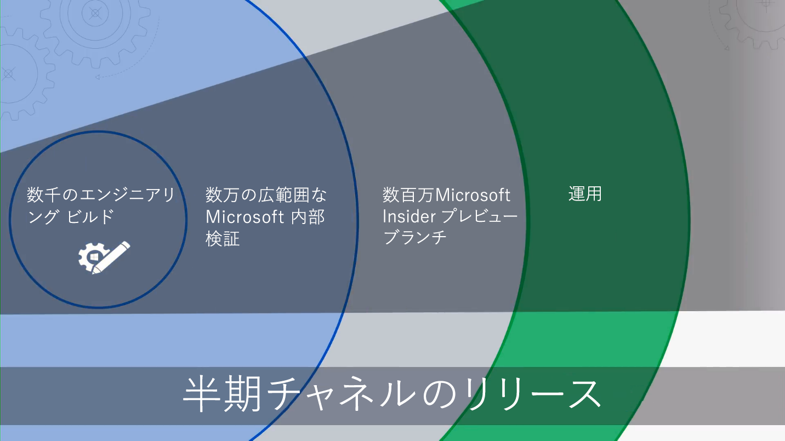

# 概要 - モダン デスクトップの展開Getting Started - Modern Desktop Deployment

クラウドによって PC の管理方法が変わってきており、Microsoft のインテリジェント クラウドは、IT 担当者がモダン デスクトップに移行する際に役立つアクションの洞察を提供しています。このシリーズは、Windows 10 および Office 365 ProPlus をベースにした、モダン デスクトップへの移行と計画が円滑に行えるように構成されています。The Cloud is changing how management of PCs is be done, with the Microsoft Intelligent Cloud delivering actional insights to help IT Professionals shift to a modern desktop. This series designed to help you plan for and make the shift to a modern desktop based on Windows 10 and Office 365 ProPlus.

<table>
<thead>
<td></td>
<td>
<strong>はじめに: ユーザー、プロセス、およびテクノロジのガイダンス</strong><strong>Getting Started: People, Process and Technology Guidance</strong>

モダン デスクトップの利点、大きな変更点、考慮事項を以前の展開と比べたうえで明確にし、Windows 10 および Office 365 ProPlus への移行をスムーズにできるようなベスト プラクティスを確立します。Discover the benefits of a modern desktop, major changes and considerations versus previous deployments and best practices to ensure a smooth transition to Windows 10 and Office 365 ProPlus.
</td>
<td></td>
</thead>
</table>

>[!NOTE]
>このシリーズでは、既存のツールを使用する最適な方法について説明し、クラウドによって実現される新しいテクノロジ、サービス、メソッドを紹介します。デスクトップの完全な展開プロセスを確認するには、「[モダン デスクトップ展開センター](https://aka.ms/HowToShift)」を参照してください。In this series we will explain the best ways to use existing tools, and introduce you to new technologies, services and methods enabled by the Cloud.  To see the full desktop deployment process, visit the [Modern Desktop Deployment Center](https://aka.ms/HowToShift).
>

モダン デスクトップ展開センターは中心的な役割を果たすもので、モダン デスクトップへの移行と計画に関する詳細情報がここから得られます。モダン デスクトップ展開センターを利用すると、質の高い生産性、チームワーク、コラボレーションが実現する安全なワークスペースを活用することができます。Welcome to the Modern Desktop Deployment Center, our central place to learn how to help you plan and make the shift to the modern desktop. This will allow you take advantage of a secure workspace, powered by the latest productivity, teamwork and collaboration experiences.

新しいデスクトップ環境をしばらく導入していなかったユーザーは、進化した多くの展開プロセスを目にすることができます。アプリケーションの互換性など、過去に直面していた課題は現在ではクリアされており、クラウドから提供される新しいツールや洞察によって、今まで以上に安心して、より速く、効率的に作業を進めることができます。If you haven’t deployed a new desktop environment for a while, the good news is much about the deployment process has improved. Challenges of the past, such as application compatibility, are much less of an issue today and new tools, and insight delivered from the Cloud, enable you to move forward with confidence, faster and more efficiently than ever before.

この序論では、変更点の概要と、デスクトップの展開プロセス全体のツアーを案内します。Windows 10 および Office 365 ProPlus への移行の推奨手順を示し、最新の管理テクノロジとアプローチを取り入れながら既存のツールとプロセスを活用する方法が詳述されています。In this introduction we’ll outline what has changed and go on a tour of the Desktop Deployment Wheel. This will guide you through the recommended steps for your shift to Windows 10 and Office 365 ProPlus, detailing how to leverage your existing tools and processes while adopting modern management technology and approaches along the way.

## アップグレードが必要な理由Why upgrade?

Windows 10 と Microsoft のインテリジェンス クラウドを組み合わせることで、最も強力かつ豊かで安全なユーザー用のワークスペースを提供しやすくなり、サポートのためのインフラストラクチャを簡素化することができます。In combination, Windows 10 and the Microsoft Intelligence Cloud enhance your ability to deliver the most empowering, rich and secure Workspace for your users, and allow you to simplify your supporting infrastructure.

最新の管理方法における重要なテナントの 1 つとして、常に最新の状態にあるデバイスが挙げられます。このシリーズでは、Windows 10 および Office 365 ProPlus への移行を支援するために用意されている新しい機能と、Windows 10 と Office 365 ProPlus 両方の半期のリリースを利用して、最新の状態を保つ方法について説明します。One of the key tenants of modern management practices is devices that are always up-to-date. Through this series you are going to see new capabilities that are being delivered to help you move to Windows 10 and Office 365 ProPlus and how to stay current with the semi-annual releases of both.

[IT 担当者向けの Windows 10Windows 10 for the IT Pro](https://www.microsoft.com/ja-JP/itpro/windows-10)

## 変更点What has Changed

まずは、前回のデスクトップの展開以降の変更点と改善点を見てみましょう。デスクトップ環境をしばらく変更していない場合は、Windows 7、Office 2010、または Office 2013 を使用している可能性があります。その場合、前回のメジャー アップグレード後に施されたいくつかの変更点に気付くはずです。以下が重要な変更点になります。Let’s start by taking a look at what has changed and improved since your last desktop deployment. If you haven’t shifted your desktop environment in a while you’re likely using Windows 7 and Office 2010 or Office 2013. If you are, you'll notice a few things have evolved since your last major upgrade. Here are some of the core changes:

**ID およびアクセスの管理**: モダン デスクトップは、クラウドの生産性、セキュリティ、および管理サービスへの接続性を備え、ID とアクセスの新しい管理サービスである Azure Active Directory を基盤としています。これにより、シングル サインオンが可能になり、クラウド サービス間の接続がセキュリティで保護されます。つまり、Azure AD は必須であり、これを活用することにより、Office 365、Intune、Windows Autopilot などの Microsoft 365 サービスの利点を生かすことができます。**Identity and Access Management** The modern desktop, with its connectivity to cloud productivity, security and management services, has, at its core, a new Identity and Access Management service: Azure Active Directory. This enables single sign-on and secure connectivity across your cloud services. That means you are going to need Azure AD in place. This will allow you take advantage of advantage of Microsoft 365 services such as Office 365, Intune, or Windows Autopilot.

[Microsoft 365Microsoft 365](https://www.microsoft.com/ja-JP/microsoft-365/default.aspx)

**プリブート環境をセキュリティで保護**: BIOS の代わりに 64 ビットの UEFI ファームウェアが置き換えられます。これにより、起動時間が短縮されます。また、Windows 10 にある多くの最新のセキュリティ機能を有効にする必要があります。Windows 10 は BIOS 上でも動作しますが、UEFI の使用を強くお勧めします。BIOS から UEFI および 64 ビットに切り替えていない場合は、今すぐ切り替えましょう。Windows 10 のアップグレード中またはアップグレード後の切り替えを支援するツールが用意されています。**Secure Pre-Boot Environment** 64-bit UEFI firmware replaces BIOS. This not only speeds up boot times, it is required to enable many of the modern security capabilities in Windows 10. Windows 10 will run on BIOS but UEFI is strongly recommended. If you have not switched from BIOS to UEFI and 64-bit, now is the time. There are tools to help you make this switch either during a Windows 10 upgrade, or after it.

[MBR2GPT による BIOS から UEFI への変換Convert from BIOS to UEFI with MBR2GPT](https://technet.microsoft.com/ja-JP/windows/mt782786.aspx)

**クラウドベースのデバイス管理**: Microsoft Intune などのサービスは、他のモバイル デバイスと同様、Windows 10 デバイスを 1 か所から管理します。しかし、Microsoft Intune には、System Center Configuration Manager で Windows 10 デバイスを共同管理するという独自の機能があります。System Center Configuration Manager を使用して Windows 10 に移行し、それから Microsoft Intune を追加することができます。この連携を通じて、System Center Configuration Manager は、Microsoft のインテリジェント クラウドに接続され、組織内のインテリジェント エッジになります。管理者は、ユーザーのデバイスがどこにあっても安全に管理することができます。ユーザーが組織に接続されていても、パブリック クラウドに接続されていても、デバイスの管理が可能となります。**Cloud-based device Management** Services like Microsoft Intune you manage your Windows 10 devices as you do other mobile devices, all from one place. What makes Microsoft Intune unique is the ability to co-manage your Windows 10 devices with System Center Configuration Manager. You can use System Center Configuration Manager to help you in your shift to Windows 10, and then add Microsoft Intune. Working together, System Center Configuration Manager becomes the intelligent Edge within your organization, connected to the Microsoft intelligent cloud. This allows you to manage your users’ devices securely wherever they are, whether connected on your organization’s or in the public cloud.

[Windows 10 デバイスの共同管理Co-management for Windows 10 devices](https://docs.microsoft.com/ja-JP/sccm/core/clients/manage/co-management-overview)

**クラウドベースの展開サービス**: 新しい PC を取得した際に、Microsoft 365 デバイスの導入に役立つ新しいクラウド サービスが紹介されました。これは、Windows Autopilot 展開サービスと呼ばれます。Autopilot はハードウェア プロバイダーと統合し、新しい PC は Autopilot に自動的に登録されます。このため、新しい PC をエンドユーザーに直接出荷することができます。最初に PC の電源を入れると、組織の希望する設定にすばやく構成され、ユーザーの特定のニーズに合わせてカスタマイズされます。**Cloud-based Deployment Service** As you acquire new PCs, we’ve introduced a new cloud service to help you deploy Microsoft 365 devices. It is called the Windows Autopilot deployment service. AutoPilot is integrated with your hardware providers and new PCs are automatically registered in Auto Pilot. This enabling the new PC to be shipped directly to the end-user. When the PC is powered on the first time it is quickly configured to your organizations desired configuration and customized for the specific needs of the user.

[Windows AutopilotWindows Autopilot](https://www.microsoft.com/ja-JP/windowsforbusiness/windows-autopilot)

**クイック実行の展開**: Office デスクトップ アプリケーションをプロビジョニングする場合の推奨オプションは Office 365 ProPlus になります。Office 365 ProPlus を利用すれば、開発中の Office の最新の技術革新の実践が可能となり、新しい機能を取得するまで何年も待つ必要はなくなります。クイック実行と呼ばれるという新しいインストールも使用できます。**Click-to-Run Deployments** When provisioning Office desktop apps, Office 365 ProPlus is the preferred option. This gives you access to the newest innovations in Office as they are developed, so you won’t need to wait years before getting new capabilities. You’ll also use a new installation called Click-to-Run.

クイック実行は、過去の MSI ベースのパッケージとはまったく異なります。今まで以上に高速で軽いクイック実行では、プログラム ストリーミングを使用します。このストリーミングによって、ユーザーは起動および実行を数分で行うことができ、バックグラウンドでの更新を行えます。それは引き続き Office のローカル コピーであり、System Center Configuration Manager などの既存の展開ツールを使用した、アプリのプロビジョニングと構成も継続して行うことができます。Click-to-Run quite different from the MSI-based packages of the past. Click-to-Run is faster, lighter, and it uses program streaming to allow users to be up and running in just minutes, and to be updated in the background. Don’t worry, it is still a local copy of Office, and you can continue to use your existing deployment tools – like System Center Configuration Manager – to provision and configure the apps.

[Office 365 ProPlus の展開ガイドDeployment guide for Office 365 ProPlus](https://docs.microsoft.com/ja-JP/DeployOffice/deployment-guide-for-office-365-proplus)

**半期の更新プログラム**: Windows 10 および Office 365 ProPlus に移行すると、新機能を備えた更新プログラムが半年ごとに配信されます。Microsoft がクラウドから提供する洞察を活用すれば、これらの新機能の更新プログラムを数百または数千のデバイスにすばやく安心して展開することができます。一括アップグレードと同様、機能更新プログラムは、以前のリリースからのアプリ、データ、設定を保持します。**Semi-Annual Updates** Once you have moved to Windows 10 and Office 365 ProPlus, updates are delivered semi-annually with new features. But with Microsoft able to deliver insights from the Cloud to help you, you can quickly and confidently roll out these updates to hundreds or thousands of devices. Like an in-place upgrade, the Feature Update preserves apps, data and configurations from the previous release.

## 展開プロセス全体The Deployment Process Wheel

開始する前に、高レベルの計画と、その実現を支援するスポンサーを得ることが重要になります。ここでは、Microsoft の展開プロセス全体における重要な手順の概要を説明しています。手順を参照すれば、以下の展開分野におけるコア チーム メンバーと管理するリソースを特定しやすくなります。Before you get started, the you’ll want to create a high-level plan and get the necessary sponsors on board. Our deployment process wheel outlines critical steps to help you to identify core team members and resources to manage in the following deployment areas.

**[手順 1: デバイスとアプリの準備](https://aka.ms/mdd1)**: 展開を成功させるには、まず自分が所有しているものを把握する必要があります。つまり、デバイスやアプリのインベントリを作成し、互換性を確認することが重要になります。**[Step 1: Device and App readiness](https://aka.ms/mdd1)** For a successful deployment you must first know what you have. That means taking an inventory of your devices and apps and verifying compatibility.

クラウドベースのサービスである Windows Analytics で利用できるツールを活用すると、インベントリの作成や互換性の確認がしやすくなります。Windows Analytics を使用すれば、何億台もの PC から収集された互換性のインテリジェンスとテレメトリを基に、デバイス上で実行されているアプリやドライバーを評価し、デスクトップ資産を整備することができます。「展開可能な PC」の一覧を Windows Analytics から System Center Configuration Manager にエクスポートすることもできます。エクスポート後、対象となる PC のデータ ドリブン コレクションを作成できるようになります。To help with this you can tools available in our cloud-based service, Windows Analytics. Windows Analytics allows you tap into compatibility intelligence and telemetry gathered from hundreds of millions of PCs, to assess the apps and drivers running on your device so you can establish the readiness of your desktop estate. You can even export a list of “PCs ready for deployment” from Windows Analytics to System Center Configuration Manager if you use it, allowing you to build data-driven collections of targeted PCs as they become ready.

[アップグレードの準備を開始するGet started with Upgrade Readiness](https://docs.microsoft.com/ja-JP/windows/deployment/upgrade/upgrade-readiness-get-started)

**[手順 2: ディレクトリとネットワークの準備](https://aka.ms/mdd2)**: Azure Active Directory の実装がまだの場合は、まず実装してください。ID とアクセス管理を行う際に必要となります。また、システム イメージ、アプリケーション パッケージ、ユーザー ファイル、更新プログラムが作動するネットワークの準備も必要です。ネットワークには大量のデータが追加されます。そのため、組織の日常業務に支障がなく、この大量に読み込まれたデータを処理できるネットワークが必要になります。Microsoft では、帯域幅の調整やピアツーピアのオプションから、動的帯域幅の清掃や差分更新まで、さまざまなネットワークの最適化を用意しています。**[Step 2: Directory and Network Readiness](https://aka.ms/mdd2)** If you haven’t already, you’ll want to implement Azure Active Directory for identity and access management next. You will also want to prepare your network for the movement of system images, application packages, user files and updates across it. That means a large amount of additional data; your network must have the capacity to handle this extra load without impact to the day-to-day work of your organization. We have a range of networking optimizations available from bandwidth throttling and peer-to-peer options to dynamic bandwidth scavenging and differential updating.

[BranchCache 対ピア キャッシュBranchCache vs. Peer Cache](https://blogs.technet.microsoft.com/swisspfe/2018/01/25/branch-cache-vs-peer-cache/)

**[手順 3: Office と基幹業務アプリの配信](https://aka.ms/mdd3)**: Windows は MSI ベースのインストールを引き続きサポートしていますが、自動インストールと継続的な更新プログラム用に最適化された新しいインストール方式もサポートしています。Office 365 ProPlus および Windows 2019 クライアントでクイック実行を使用すると、さまざまな UWP アプリケーションを利用できます。新しい MSIX ベースのパッケージ化されたアプリを基に、数多くのサード パーティのアプリや社内開発の基幹業務アプリを展開できるようになります。ここでの手順を実行すると、アプリの自動展開の準備が整います。クイック実行、MSIX、従来の MSI ベースによるアプリの展開や、ビジネス向けの Microsoft Store で配布している UWP アプリの展開もできるようになります。**[Step 3: Office and Line of Business App Delivery](https://aka.ms/mdd3)** While Windows continues to support MSI-based installations it also now supports newer installations mechanisms, optimized for automated deployment and continuous updates. Office 365 ProPlus and Windows 2019 clients use Click-to-Run, you may want to make a range of UWP apps available, and you may increasingly find yourself deploying third-party apps and in-house developed Line of Business Apps that use the new MSIX-based packaging apps. This step ensures your apps are ready for automated deployments, and that you are set up for success whether your apps deploy using Click-to-Run, MSIX, conventional MSI-based, or are UWP apps deployed from a Microsoft Store from Business you set up.

[MSIX とはMSIX Intro](https://blogs.msdn.microsoft.com/sgern/2018/06/15/msix-intro/)

**[手順 4: ユーザー ファイルと設定の移行](https://aka.ms/mdd4)**: ここは、PC の交換や更新サイクルにおける重要な手順です。ユーザーのファイル、データ、設定が正常に移行し、移行中に内容が保持されるようにする必要があります。この手順では、よく知られているオプションや新しいオプションを含め、手動または自動で移行できるオプションを網羅します。**[Step 4: User Files and Settings Migration](https://aka.ms/mdd4)** This is a critical step in any PC replacement or refresh cycle: you have to ensure users’ files, data and settings move successfully and are preserved over the migration. This step covers the options available for manual or automated migrations, including well-known and new options.

以前のアップグレードと同様、ユーザー状態移行ツールはこのプロセスを自動化する貴重なツールであり、System Center Configuration Manager または Microsoft Deployment Toolkit による移行において重要な役割を果たします。しかし、移行の際にすべてのデータを移動すると、PC ごとに数百 GB にも及ぶ転送が 2 回行われるため (1 回目は既存のデスクトップからの転送で、2 回目は新しいデスクトップへの転送)、PC 交換の時間的ボトルネックになる可能性があります。OneDrive で有効になった新しいオプションである Known Folder Move を使用すれば、クラウド上の大きなサイズのユーザーのドキュメント、画像、デスクトップ ファイルを、展開前に同期することが可能となります。As in previous upgrades, the User State Migration Tool continues to be a valuable tool to automate this process and it remains an integral part of migrations orchestrated using System Center Configuration Manager or the Microsoft Deployment Toolkit. But moving all this data at migration can be a timing bottleneck for PC replacement, due to the physics involved in transferring sometimes hundreds of gigabytes per PC twice – first from the existing desktop, then back down to the new desktop. A new option enabled by OneDrive is Known Folder Move is to sync user documents, pictures and desktop files, at scale, in the cloud, ahead of deployment.

[Windows の既知のフォルダーを OneDrive へリダイレクトし移動するRedirect and move Windows known folders to OneDrive](https://docs.microsoft.com/ja-JP/onedrive/redirect-known-folders)

**[手順 5: セキュリティとコンプライアンス](https://aka.ms/mdd5)**: セキュリティとコンプライアンスは、Windows 10 および Office 365 ProPlus に移行する際の非常に重要な分野です。新しく組み込まれた機能に精通し、既存の機能との相違点を把握しておくことが大切です。たとえば、仮想化ベースのセキュリティによる Windows 10 の新機能を利用すると、コア プロセスと機密事項がオペレーティング システムから独立するため、資格情報の盗難、ブラウザベースの悪用、悪質なコードの実行を防止することができます。さらに、Advanced Threat Protection のようなクラウド サービスには、セキュリティ強化、感染後の検出、調査、復旧対応を行う、統一されたプラットフォームが用意されています。また、Advanced Threat Protection は、悪意のある電子メールの添付ファイル、危険なハイパーリンクなどの脅威からもユーザーを守ります。**[Step 5: Security and Compliance](https://aka.ms/mdd5)** Security and Compliance is an area with a lot upside when moving to Windows 10 and Office 365 ProPlus. It is important you familiarize yourself with the new built-in capabilities and compare that with what you already have. For example, new capabilities in Windows 10 using virtualization-based security can prevent credential theft, protect against browser-based exploits and malicious code execution by isolating core processes and secrets from the operating system. In addition, cloud services like Advanced Threat Protection give you a unified platform for security hardening, post-breach detection, investigation, and response. Advanced Threat Protection can also safeguard you against malicious email attachments, unsafe hyperlinks and more.

[Microsoft セキュリティMicrosoft Security](https://www.microsoft.com/ja-JP/security/default.aspx)

**[Step 6: OS の展開と機能の更新プログラム](https://aka.ms/mdd6)**: 準備がすべて整ったら、次の手順は OS イメージを展開することです。複雑な作業の多くを、System Center Configuration Manager のタスク シーケンスとインフラストラクチャを使用して実行できます。推奨されるアプローチは、フェーズごとの展開です。代表的な一連のハードウェアとアプリケーションを使用して、最初に「早期採用グループ」を対象に設定し、展開を行います。その後、これらのデバイスやユーザーのデータを基に、展開の対象となる PC をさらに増やしていくことができます。**[Step 6: OS Deployment and Feature Updates](https://aka.ms/mdd6)** With everything prepared, the next step is to deploy the OS images. A lot of the heavy lifting for can be done using System Center Configuration Manage task sequences and infrastructure. The recommended approach is to deploy in phases, first targeting and deploying to an “early adopter group” in your organization using a representative set of hardware and apps. You can then use the data from those devices and users to gradually target more and more PCs.

[System Center Configuration Manager のオペレーティング システムの展開の概要Introduction to operating system deployment in System Center Configuration Manager](https://docs.microsoft.com/ja-JP/sccm/osd/understand/introduction-to-operating-system-deployment)

**[手順 7: サービスとしての Windows および Office](https://aka.ms/mdd7)**: これは、ユーザーのデスクトップ資産の維持方法に関する大きな変更を表しています。Windows 10 (および Office 365 ProPlus) に移行すると、サービスとしての Windows (および Office) を管理することができます。数年に 1 度のテクノロジの更新ではなく、新しい機能、エクスペリエンス、保護機能を継続してユーザーに提供します。半期の機能更新プログラムは毎年秋と春に新しい機能を提供し、毎月の累積的な品質更新プログラムには、セキュリティ、信頼性、バグ修正プログラムが含まれます。Office 2019 クライアントを展開することもできますが、Office ProPlus に移行することを強くお勧めします。これには Windows と同様のサービス プランが用意されており、ユーザーが Office アプリの更新プログラムを定期的に入手することもできます。**[Step 7: Windows and Office as a Service](https://aka.ms/mdd7)** This represents a major shift in the way you maintain users’ desktop real-estate. With this move to Windows 10 (and Office 365 ProPlus) you can move to managing Windows (and Office) as a service. In place of a massive shift in technology every few years, you will continually be bringing new capabilities, experiences and protections to your user. Semi-annual feature updates deliver new capabilities in the Fall and Spring of each year, while monthly cumulative Quality Updates will contain security, reliability and bug fixes. While you can opt to deploy Office 2019 clients, we strongly recommend you to move to Office ProPlus. This follows a similar service plan to Windows, so your users get updates to the Office apps on a regular basis too.

[サービスとしての Windows の概要Overview of Windows as a service](https://docs.microsoft.com/ja-JP/windows/deployment/update/waas-overview)

**[手順 8: ユーザーのコミュニケーションとトレーニング](https://aka.ms/mdd8)**: この最後の手順は、チームワーク、コミュニケーション、セキュリティなどを強化するための新しい機能を使用するうえで非常に重要です。早期に採用している組織に属さないユーザーを対象とした広範囲の展開を行う場合は、展開前にユーザーのコミュニケーションとトレーニングを実施することをお勧めします。これを実施すれば、Office、Windows、他の基幹業務アプリやサービスの新機能に関して、ユーザーは自分に適した活用方法を見つけることができます。また、Microsoft FastTrack のオンライン トレーニングによる支援も行っています。さらに、コミュニケーション プランとタイムラインの無料サンプルを、電子メール、ソーシャルおよびイントラネットのテンプレートとともに公開しています。これらは Windows 10 の展開に役立ちます。Microsoft 365 または Office 365 組織の場合は、直接サポートを受けることもできます。**[Step 8: User Communications and Training](https://aka.ms/mdd8)** This last step is critical to driving usage of new capabilities for enhancing teamwork, communications, security and more. Before broad deployment is targeted to users outside early adopter rings, we recommend you roll out user communication and training. This will help drive desired changes in how people use new capabilities in Office, Windows or other line of business apps and services. To assist, we provide free online training via Microsoft FastTrack. Plus, we’ve published free sample communication plans and timelines together with email, social and intranet templates to help with your rollout of Windows 10. As a Microsoft 365 or Office 365 organization, your organization may also be eligible for and direct support.

## 次の手順Next Step

ここまで、新しい機能とこれまでとの相違点を確認し、推奨される展開プロセスの全体像を見てきました。エンド ツー エンドのこのガイダンスを活用し、用意されているツールを駆使して、モダン デスクトップへの移行を始めましょう。Now you know what’s new and different, and we have walked through our recommended deployment process wheel. With this taste for the end-to-end guidance and tools available for you to make the shift a modern desktop, let’s get started.

## [手順 1: デバイスとアプリの準備Step 1: Device and App Readiness](https://aka.ms/mdd1)

