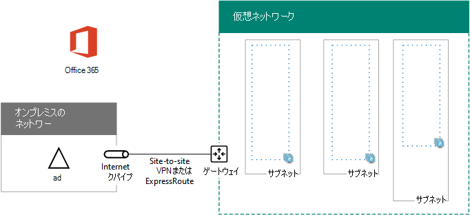

# <a name="high-availability-federated-authentication-phase-1-configure-azure"></a>高可用性フェデレーション認証のフェーズ 1: Azure を構成する

このフェーズでは、フェーズ 2、3、および 4 で仮想マシンをホストするリソース グループ、仮想ネットワーク (VNet)、可用性セットを Azure で作成します。 このフェーズは、「[Phase 2: Configure domain controllers](high-availability-federated-authentication-phase-2-configure-domain-controllers.md)」に進む前に完了しておく必要があります。 すべての[フェーズについては、「高可用性フェデレーション認証を Azure Microsoft 365展開](deploy-high-availability-federated-authentication-for-microsoft-365-in-azure.md)する」を参照してください。
  
Azure は、次の基本的なコンポーネントを使用してプロビジョニングする必要があります。
  
- リソース グループ
    
- Azure 仮想マシンをホストするためのサブネットを含むクロスプレミスの Azure 仮想ネットワーク
    
- サブネットの分離を実行するためのネットワーク セキュリティ グループ
    
- 可用性セット
    
## <a name="configure-azure-components"></a>Azure のコンポーネントの構成

Azure のコンポーネントの構成を開始する前に、次に示す表に必要事項を記入します。 Azure の構成の手順で役立つように、このセクションを印刷して、必要な情報を書き込むか、このセクションをドキュメントにコピーして必要事項を記入してください。 VNet の設定は、「表 V」に記入します。
  
|**項目**|**構成設定**|**説明**|**値**|
|:-----|:-----|:-----|:-----|
|1.  <br/> |VNet 名  <br/> |VNet に割り当てる名前 (例 FedAuthNet)。  <br/> |  <br/> |
|2.  <br/> |VNet の場所  <br/> |仮想ネットワークが含まれる地域の Azure データセンター。  <br/> |  <br/> |
|3.  <br/> |VPN デバイスの IP アドレス  <br/> |インターネット上の VPN デバイスのインターフェイスのパブリック IPv4 アドレス。  <br/> |  <br/> |
|4.  <br/> |VNet アドレス空間  <br/> |仮想ネットワークのアドレス空間。このアドレス空間は、IT 部門と協議して決定してください。  <br/> |  <br/> |
|5.  <br/> |IPsec 共有キー  <br/> |32 文字のランダムな英数字文字列。サイト間 VPN 接続の両側を認証するために使用されます。このキーの値は、IT 部門またはセキュリティ部門と協議して決定してください。または、「[IPsec 事前共有キーのランダム文字列を作成する](https://social.technet.microsoft.com/wiki/contents/articles/32330.create-a-random-string-for-an-ipsec-preshared-key.aspx)」を参照してください。  <br/> |  <br/> |
   
 **表 V:クロスプレミスの仮想ネットワーク構成**
  
次に、このソリューションのサブネットついて、「表 S」に必要事項を記入します。すべてのアドレス空間は、クラスレス ドメイン間ルーティング (CIDR) 形式 (別称: ネットワーク プレフィックス形式) にする必要があります。たとえば、10.24.64.0/20 のようにします。
  
最初の 3 つのサブネットについて、仮想ネットワークのアドレス空間に基づいた名前と単一の IP アドレス空間を指定します。ゲートウェイ サブネットについて、次を実行して、Azure ゲートウェイ サブネットの 27 ビット アドレス空間 (プレフィックス長 /27) を決定します。
  
1. VNet アドレス空間の可変ビットを 1 に設定します (ゲートウェイ サブネットに使用しているビット数まで)。残りのビットは 0 に設定します。
    
2. その結果のビットを 10 進数に変換して、ゲートウェイ サブネットのサイズに設定されたプレフィックス長のアドレス空間として表現します。
    
この [計算を実行する PowerShell](address-space-calculator-for-azure-gateway-subnets.md) コマンド ブロックおよび C# または Python コンソール アプリケーションについては、「Azure ゲートウェイ サブネットのアドレス空間計算」を参照してください。
  
これに該当するアドレス空間については、仮想ネットワークのアドレス空間に基づいて、IT 部門と協議して決定してください。
  
|**アイテム**|**サブネット名**|**サブネット アドレス スペース**|**用途**|
|:-----|:-----|:-----|:-----|
|1.  <br/> |  <br/> |  <br/> |Active Directory ドメイン サービス (DS) ドメイン コントローラー ADディレクトリ同期サーバー仮想マシン (VM) によって使用されるサブネット。  <br/> |
|2.  <br/> |  <br/> |  <br/> |AD FS VM が使用するサブネット。  <br/> |
|3.  <br/> |  <br/> |  <br/> |Web アプリケーション プロキシ VM が使用するサブネット。  <br/> |
|4.  <br/> |GatewaySubnet  <br/> |  <br/> |Azure ゲートウェイ VM が使用するサブネット。  <br/> |
   
 **表 S:仮想ネットワーク内のサブネット**
  
次に、仮想マシンとロード バランサーのインスタンスに割り当てる静的 IP について、「表 I」に必要事項を記入します。
  
|**項目**|**用途**|**サブネット上の IP アドレス**|**値**|
|:-----|:-----|:-----|:-----|
|1.  <br/> |最初のドメイン コントローラーの静的 IP アドレス  <br/> |「表 S」の「項目 1」で定義されたサブネットのアドレス空間について、4 番目に考えられる IP アドレス。  <br/> |  <br/> |
|2.  <br/> |2 番目のドメイン コントローラーの静的 IP アドレス  <br/> |「表 S」の「項目 1」で定義されたサブネットのアドレス空間について、5 番目に考えられる IP アドレス。  <br/> |  <br/> |
|3.  <br/> |ディレクトリ同期サーバーの静的 IP アドレス  <br/> |「表 S」の「項目 1」で定義されたサブネットのアドレス空間について、6 番目に考えられる IP アドレス。  <br/> |  <br/> |
|4.  <br/> |AD FS サーバーの内部ロード バランサーの静的 IP アドレス  <br/> |「表 S」の「項目 2」で定義されたサブネットのアドレス空間について、4 番目に考えられる IP アドレス。  <br/> |  <br/> |
|5.  <br/> |最初の AD FS サーバーの静的 IP アドレス  <br/> |「表 S」の「項目 2」で定義されたサブネットのアドレス空間について、5 番目に考えられる IP アドレス。  <br/> |  <br/> |
|6.  <br/> |2 番目の AD FS サーバーの静的 IP アドレス  <br/> |「表 S」の「項目 2」で定義されたサブネットのアドレス空間について、6 番目に考えられる IP アドレス。  <br/> |  <br/> |
|7.  <br/> |最初の Web アプリケーション プロキシ サーバーの静的 IP アドレス  <br/> |「表 S」の「項目 3」で定義されたサブネットのアドレス空間について、4 番目に考えられる IP アドレス。  <br/> |  <br/> |
|8.  <br/> |2 番目の Web アプリケーション プロキシ サーバーの静的 IP アドレス  <br/> |「表 S」の「項目 3」で定義されたサブネットのアドレス空間について、5 番目に考えられる IP アドレス。  <br/> |  <br/> |
   
 **表 I: 仮想ネットワークの静的 IP アドレス**
  
仮想ネットワーク内のドメイン コントローラーを最初にセットアップするときに使用する、オンプレミス ネットワーク内の 2 つのドメイン ネーム システム (DNS) について、「表 D」に必要事項を記入します。IT 部門と協議して、このリストを決定してください。
  
|**アイテム**|**DNS サーバーのフレンドリ名**|**DNS サーバーの IP アドレス**|
|:-----|:-----|:-----|
|1.  <br/> |  <br/> |  <br/> |
|2.  <br/> |  <br/> |  <br/> |
   
 **表 D:オンプレミスの DNS サーバー**
  
サイト間 VPN 接続を通してクロスオンプレミス ネットワークから組織ネットワークにパケットをルーティングするには、組織のオンプレミス ネットワーク上のすべての到達可能な場所のアドレス スペースの一覧 (CIDR 表記) を持つローカル ネットワークを使用して仮想ネットワークを構成する必要があります。 このローカル ネットワークを定義するアドレス空間の一覧は、一意であることが必要であり、別の仮想ネットワークや別のローカル ネットワークとの重複がないことが必要になります。
  
一連のローカル ネットワークのアドレス スペースに関しては表 L に記入します。3 つの空白のエントリが記載されていますが、通常はさらに必要となります。IT 部門に尋ねてこのアドレス スペースの一覧を特定してください。
  
|**アイテム**|**ローカル ネットワークのアドレス スペース**|
|:-----|:-----|
|1.  <br/> |  <br/> |
|2.  <br/> |  <br/> |
|3.  <br/> |  <br/> |
   
 **表 L:ローカル ネットワークのアドレス プレフィックス**
  
次に、Azure インフラストラクチャの構築を開始して、フェデレーション認証をホストMicrosoft 365。
  
> [!NOTE]
> 次のコマンド セットは、Azure PowerShell の最新版を使用します。 「[使い始める」を参照Azure PowerShell。](/powershell/azure/get-started-azureps) 
  
まず、Azure PowerShell プロンプトを起動して、自分のアカウントにログインします。
  
```powershell
Connect-AzAccount
```

> [!TIP]
> カスタム設定に基づいてすぐに実行できる PowerShell コマンド ブロックを生成するには、次の構成[ブックMicrosoft Excel使用します](https://github.com/MicrosoftDocs/OfficeDocs-Enterprise/raw/live/Enterprise/downloads/O365FedAuthInAzure_Config.xlsx)。 

次のコマンドを使用して、サブスクリプションの名前を取得します。
  
```powershell
Get-AzSubscription | Sort Name | Select Name
```

以前のバージョンの Azure PowerShell代わりに、このコマンドを使用します。
  
```powershell
Get-AzSubscription | Sort Name | Select SubscriptionName
```

Azure サブスクリプションを設定します。 \< and >文字を含む引用符で囲まれたすべての内容を正しい名前に置き換えます。
  
```powershell
$subscrName="<subscription name>"
Select-AzSubscription -SubscriptionName $subscrName
```

次に、新しいリソース グループを作成します。リソース グループ名の一意のセットを決定するために、このコマンドを使用して、既存のリソース グループを一覧表示します。
  
```powershell
Get-AzResourceGroup | Sort ResourceGroupName | Select ResourceGroupName
```

一意のリソース グループ名のセットについて、次に示す表に必要事項を記入します。
  
|**項目**|**リソース グループ名**|**用途**|
|:-----|:-----|:-----|
|1.  <br/> |  <br/> |ドメイン コントローラー  <br/> |
|2.  <br/> |  <br/> |AD FS サーバー  <br/> |
|3.  <br/> |  <br/> |Web アプリケーション プロキシ サーバー  <br/> |
|4.  <br/> |  <br/> |インフラストラクチャの要素  <br/> |
   
 **表 R: リソース グループ**
  
次に示すコマンドで、新しいリソース グループを作成します。
  
```powershell
$locName="<an Azure location, such as West US>&quot;
$rgName=&quot;<Table R - Item 1 - Name column>&quot;
New-AzResourceGroup -Name $rgName -Location $locName
$rgName=&quot;<Table R - Item 2 - Name column>&quot;
New-AzResourceGroup -Name $rgName -Location $locName
$rgName=&quot;<Table R - Item 3 - Name column>&quot;
New-AzResourceGroup -Name $rgName -Location $locName
$rgName=&quot;<Table R - Item 4 - Name column>&quot;
New-AzResourceGroup -Name $rgName -Location $locName
```

次に、Azure 仮想ネットワークとそのサブネットを作成します。
  
```powershell
$rgName=&quot;<Table R - Item 4 - Resource group name column>&quot;
$locName=&quot;<your Azure location>&quot;
$vnetName=&quot;<Table V - Item 1 - Value column>&quot;
$vnetAddrPrefix=&quot;<Table V - Item 4 - Value column>&quot;
$dnsServers=@( &quot;<Table D - Item 1 - DNS server IP address column>&quot;, &quot;<Table D - Item 2 - DNS server IP address column>" )
# Get the shortened version of the location
$locShortName=(Get-AzResourceGroup -Name $rgName).Location

# Create the subnets
$subnet1Name="<Table S - Item 1 - Subnet name column>"
$subnet1Prefix="<Table S - Item 1 - Subnet address space column>"
$subnet1=New-AzVirtualNetworkSubnetConfig -Name $subnet1Name -AddressPrefix $subnet1Prefix
$subnet2Name="<Table S - Item 2 - Subnet name column>"
$subnet2Prefix="<Table S - Item 2 - Subnet address space column>"
$subnet2=New-AzVirtualNetworkSubnetConfig -Name $subnet2Name -AddressPrefix $subnet2Prefix
$subnet3Name="<Table S - Item 3 - Subnet name column>"
$subnet3Prefix="<Table S - Item 3 - Subnet address space column>"
$subnet3=New-AzVirtualNetworkSubnetConfig -Name $subnet3Name -AddressPrefix $subnet3Prefix
$gwSubnet4Prefix="<Table S - Item 4 - Subnet address space column>"
$gwSubnet=New-AzVirtualNetworkSubnetConfig -Name "GatewaySubnet" -AddressPrefix $gwSubnet4Prefix

# Create the virtual network
New-AzVirtualNetwork -Name $vnetName -ResourceGroupName $rgName -Location $locName -AddressPrefix $vnetAddrPrefix -Subnet $gwSubnet,$subnet1,$subnet2,$subnet3 -DNSServer $dnsServers

```

次に、仮想マシンを持つサブネットごとにネットワーク セキュリティ グループを作成します。 サブネットを分離するには、サブネットのネットワーク セキュリティ グループでの特定の種類のトラフィックを許可または拒否する規則を追加できます。
  
```powershell
# Create network security groups
$vnet=Get-AzVirtualNetwork -ResourceGroupName $rgName -Name $vnetName

New-AzNetworkSecurityGroup -Name $subnet1Name -ResourceGroupName $rgName -Location $locShortName
$nsg=Get-AzNetworkSecurityGroup -Name $subnet1Name -ResourceGroupName $rgName
Set-AzVirtualNetworkSubnetConfig -VirtualNetwork $vnet -Name $subnet1Name -AddressPrefix $subnet1Prefix -NetworkSecurityGroup $nsg

New-AzNetworkSecurityGroup -Name $subnet2Name -ResourceGroupName $rgName -Location $locShortName
$nsg=Get-AzNetworkSecurityGroup -Name $subnet2Name -ResourceGroupName $rgName
Set-AzVirtualNetworkSubnetConfig -VirtualNetwork $vnet -Name $subnet2Name -AddressPrefix $subnet2Prefix -NetworkSecurityGroup $nsg

New-AzNetworkSecurityGroup -Name $subnet3Name -ResourceGroupName $rgName -Location $locShortName
$nsg=Get-AzNetworkSecurityGroup -Name $subnet3Name -ResourceGroupName $rgName
Set-AzVirtualNetworkSubnetConfig -VirtualNetwork $vnet -Name $subnet3Name -AddressPrefix $subnet3Prefix -NetworkSecurityGroup $nsg
$vnet | Set-AzVirtualNetwork
```

次に、これらのコマンドを使用して、サイト間 VPN 接続のゲートウェイを作成します。
  
```powershell
$rgName="<Table R - Item 4 - Resource group name column>"
$locName="<Azure location>"
$vnetName="<Table V - Item 1 - Value column>"
$vnet=Get-AzVirtualNetwork -Name $vnetName -ResourceGroupName $rgName
$subnet=Get-AzVirtualNetworkSubnetConfig -VirtualNetwork $vnet -Name "GatewaySubnet"

# Attach a virtual network gateway to a public IP address and the gateway subnet
$publicGatewayVipName="PublicIPAddress"
$vnetGatewayIpConfigName="PublicIPConfig"
New-AzPublicIpAddress -Name $vnetGatewayIpConfigName -ResourceGroupName $rgName -Location $locName -AllocationMethod Dynamic
$publicGatewayVip=Get-AzPublicIpAddress -Name $vnetGatewayIpConfigName -ResourceGroupName $rgName
$vnetGatewayIpConfig=New-AzVirtualNetworkGatewayIpConfig -Name $vnetGatewayIpConfigName -PublicIpAddressId $publicGatewayVip.Id -Subnet $subnet

# Create the Azure gateway
$vnetGatewayName="AzureGateway"
$vnetGateway=New-AzVirtualNetworkGateway -Name $vnetGatewayName -ResourceGroupName $rgName -Location $locName -GatewayType Vpn -VpnType RouteBased -IpConfigurations $vnetGatewayIpConfig

# Create the gateway for the local network
$localGatewayName="LocalNetGateway"
$localGatewayIP="<Table V - Item 3 - Value column>"
$localNetworkPrefix=@( <comma-separated, double-quote enclosed list of the local network address prefixes from Table L, example: "10.1.0.0/24", "10.2.0.0/24"> )
$localGateway=New-AzLocalNetworkGateway -Name $localGatewayName -ResourceGroupName $rgName -Location $locName -GatewayIpAddress $localGatewayIP -AddressPrefix $localNetworkPrefix

# Define the Azure virtual network VPN connection
$vnetConnectionName="S2SConnection"
$vnetConnectionKey="<Table V - Item 5 - Value column>"
$vnetConnection=New-AzVirtualNetworkGatewayConnection -Name $vnetConnectionName -ResourceGroupName $rgName -Location $locName -ConnectionType IPsec -SharedKey $vnetConnectionKey -VirtualNetworkGateway1 $vnetGateway -LocalNetworkGateway2 $localGateway

```

> [!NOTE]
> 個々のユーザーのフェデレーション認証は、オンプレミスのリソースには依存しません。 ただし、このサイト間 VPN 接続が使用できなくなった場合、VNet 内のドメイン コントローラーは、オンプレミスの Active Directory ドメイン サービスで行われたユーザー アカウントとグループに対する更新プログラムを受信できません。 このようなことが起こらないよう、サイト間 VPN 接続の高可用性を構成できます。 詳細については、「[高可用性のクロスプレミス接続および VNet 間接続](/azure/vpn-gateway/vpn-gateway-highlyavailable)」を参照してください。
  
次に、このコマンドの表示から得られる、仮想ネットワーク用の Azure VPN ゲートウェイのパブリック IPv4 アドレスを記録します。
  
```powershell
Get-AzPublicIpAddress -Name $publicGatewayVipName -ResourceGroupName $rgName
```

次に、Azure VPN ゲートウェイに接続するようにオンプレミスの VPN デバイスを構成します。詳細については、「[サイト間 VPN Gateway 接続の VPN デバイスについて](/azure/vpn-gateway/vpn-gateway-about-vpn-devices)」を参照してください。
  
オンプレミス VPN デバイスを構成するには、次のものが必要になります。
  
- Azure VPN ゲートウェイのパブリック IPv4 アドレス。
    
- サイト間 VPN 接続の IPsec 事前共有キー (「表 V」-「項目 5」-「値」列)。
    
次に、仮想ネットワークのアドレス空間がオンプレミスのネットワークからアクセスできることを確認します。一般に、これは、仮想ネットワークのアドレス空間から VPN デバイスに対応するルートを追加してから、そのルートを組織ネットワークの残りのルーティング インフラストラクチャに公示することで実行します。IT 部門と協議して、この方法について決定してください。
  
次に、3 つの可用性セットの名前を定義します。「表 A」に必要事項を記入します。 
  
|**項目**|**用途**|**可用性セット名**|
|:-----|:-----|:-----|
|1.  <br/> |ドメイン コントローラー  <br/> |  <br/> |
|2.  <br/> |AD FS サーバー  <br/> |  <br/> |
|3.  <br/> |Web アプリケーション プロキシ サーバー  <br/> |  <br/> |
   
 **表 A: 可用性セット**
  
これらの名前は、フェーズ 2、3、および 4 で仮想マシンを作成する際に必要になります。
  
次に示す Azure PowerShell コマンドで、新しい可用性セットを作成します。
  
```powershell
$locName="<the Azure location for your new resource group>"
$rgName="<Table R - Item 1 - Resource group name column>"
$avName="<Table A - Item 1 - Availability set name column>"
New-AzAvailabilitySet -ResourceGroupName $rgName -Name $avName -Location $locName -Sku Aligned  -PlatformUpdateDomainCount 5 -PlatformFaultDomainCount 2
$rgName="<Table R - Item 2 - Resource group name column>"
$avName="<Table A - Item 2 - Availability set name column>"
New-AzAvailabilitySet -ResourceGroupName $rgName -Name $avName -Location $locName -Sku Aligned  -PlatformUpdateDomainCount 5 -PlatformFaultDomainCount 2
$rgName="<Table R - Item 3 - Resource group name column>"
$avName="<Table A - Item 3 - Availability set name column>"
New-AzAvailabilitySet -ResourceGroupName $rgName -Name $avName -Location $locName -Sku Aligned  -PlatformUpdateDomainCount 5 -PlatformFaultDomainCount 2
```

次に、このフェーズが正常に完了した結果の構成を示します。
  
**フェーズ 1: 高可用性フェデレーション認証用の Azure インフラストラクチャMicrosoft 365**


  
## <a name="next-step"></a>次の手順

[ [フェーズ 2: このワークロードの](high-availability-federated-authentication-phase-2-configure-domain-controllers.md) 構成を続行するドメイン コントローラーを構成する] を使用します。
  
## <a name="see-also"></a>関連項目

[Azure に Microsoft 365 の高可用性フェデレーション認証を展開する](deploy-high-availability-federated-authentication-for-microsoft-365-in-azure.md)
  
[開発/テスト環境Microsoft 365フェデレーション ID](federated-identity-for-your-microsoft-365-dev-test-environment.md)
  
[Microsoft 365 ソリューションおよびアーキテクチャ センター](../solutions/index.yml)

[ID とMicrosoft 365についてAzure Active Directory](about-microsoft-365-identity.md)