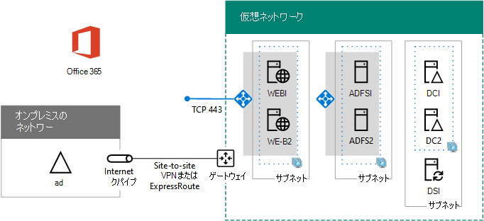

# <a name="high-availability-federated-authentication-phase-4-configure-web-application-proxies"></a>高可用性フェデレーション認証のフェーズ 4: Web アプリケーション プロキシを構成する

Azure インフラストラクチャ サービスでMicrosoft 365フェデレーション認証の高可用性をデプロイするこのフェーズでは、内部ロード バランサーと 2 台の AD FS サーバーを作成します。
  
フェーズ [5: Microsoft 365のフェデレーション認証を構成する](high-availability-federated-authentication-phase-5-configure-federated-authentic.md)に進む前に、このフェーズを完了する必要があります。 すべてのフェーズについては、「[Azure でMicrosoft 365用の高可用性フェデレーション認証をデプロイ](deploy-high-availability-federated-authentication-for-microsoft-365-in-azure.md)する」を参照してください。
  
## <a name="create-the-internet-facing-load-balancer-in-azure"></a>Azure でインターネット接続ロード バランサーを作成する

Azure がインターネットからの着信クライアント認証トラフィックを 2 つの Web アプリケーション プロキシ サーバーに均等に分散するように、インターネット接続ロード バランサーを作成する必要があります。
  
> [!NOTE]
> 次のコマンド セットは、Azure PowerShell の最新版を使用します。 [Azure PowerShellの概要を](/powershell/azure/get-started-azureps)参照してください。 
  
場所とリソース グループの値を指定したら、その結果のブロックを Azure PowerShell コマンド プロンプトまたは PowerShell ISE で実行します。
  
> [!TIP]
> カスタム設定に基づいてすぐに実行できる PowerShell コマンド ブロックを生成するには、この[Microsoft Excel構成ブック](https://github.com/MicrosoftDocs/OfficeDocs-Enterprise/raw/live/Enterprise/downloads/O365FedAuthInAzure_Config.xlsx)を使用します。 

```powershell
# Set up key variables
$locName="<your Azure location>"
$rgName="<Table R - Item 4 - Resource group name column>"

$publicIP=New-AzPublicIpAddress -ResourceGroupName $rgName -Name "WebProxyPublicIP" -Location $LocName -AllocationMethod "Static"
$frontendIP=New-AzLoadBalancerFrontendIpConfig -Name "WebAppProxyServers-LBFE" -PublicIpAddress $publicIP
$beAddressPool=New-AzLoadBalancerBackendAddressPoolConfig -Name "WebAppProxyServers-LBBE"
$healthProbe=New-AzLoadBalancerProbeConfig -Name "WebServersProbe" -Protocol "TCP" -Port 443 -IntervalInSeconds 15 -ProbeCount 2
$lbrule=New-AzLoadBalancerRuleConfig -Name "WebTraffic" -FrontendIpConfiguration $frontendIP -BackendAddressPool $beAddressPool -Probe $healthProbe -Protocol "TCP" -FrontendPort 443 -BackendPort 443
New-AzLoadBalancer -ResourceGroupName $rgName -Name "WebAppProxyServers" -Location $locName -LoadBalancingRule $lbrule -BackendAddressPool $beAddressPool -Probe $healthProbe -FrontendIpConfiguration $frontendIP
```

インターネット接続ロード バランサーに割り当てられたパブリック IP アドレスを表示するには、ローカル コンピューターの Azure PowerShell コマンド プロンプトで次のコマンドを実行します。
  
```powershell
Write-Host (Get-AzPublicIpaddress -Name "WebProxyPublicIP" -ResourceGroup $rgName).IPAddress
```

## <a name="determine-your-federation-service-fqdn-and-create-dns-records"></a>フェデレーション サービス FQDN を決定してて、DNS レコードを作成する

インターネット上のフェデレーション サービス名を識別するには、DNS 名を決定する必要があります。 Azure AD Connectはフェーズ 5 でこの名前でMicrosoft 365を構成します。これは、セキュリティ トークンを取得するために接続クライアントに送信Microsoft 365 URL の一部になります。 たとえば、fs.contoso.com です (fs はフェデレーション サービスを表します)。
  
フェデレーション サービス FDQN を取得後、Azure インターネット接続ロード バランサーのパブリック IP アドレスに解決される、フェデレーション サービス FDQN のパブリック DNS ドメイン A レコードを作成します。
  
|**名前**|**Type**|**TTL**|**値**|
|:-----|:-----|:-----|:-----|
|フェデレーション サービス FDQN  <br/> |A  <br/> |3600  <br/> |Azure インターネット接続ロード バランサーのパブリック IP アドレス (前のセクションの **Write-Host** コマンドで表示されます) <br/> |
   
次に例を示します。
  
|**名前**|**Type**|**TTL**|**値**|
|:-----|:-----|:-----|:-----|
|fs.contoso.com  <br/> |A  <br/> |3600  <br/> |131.107.249.117  <br/> |
   
次に、フェデレーション サービス FQDN を AD FS サーバーの内部ロード バランサーに割り当てられたプライベート IP アドレスに解決する、組織のプライベート DNS 名前空間に DNS アドレス レコードを追加します (「表 I」、「項目 4」、「値」列)。
  
## <a name="create-the-web-application-proxy-server-virtual-machines-in-azure"></a>Azure に Web アプリケーション プロキシ サーバーの仮想マシンを作成する

次に示す Azure PowerShell コマンドのブロックを使用して、2 つの Web アプリケーション プロキシ サーバーの仮想マシンを作成します。  
  
次に示す Azure PowerShell コマンド セットには、次の表の値を使用します。
  
- 表 M: 仮想マシン用
    
- 表 R: リソース グループ用
    
- 表 V: 仮想ネットワークの設定用
    
- 表 S: サブネット用
    
- 表 I: 静的 IP アドレス用
    
- 表 A: 可用性セット用
    
[フェーズ 2: フェーズ](high-availability-federated-authentication-phase-2-configure-domain-controllers.md) [1: Azure](high-availability-federated-authentication-phase-1-configure-azure.md) の構成でドメイン コントローラーとテーブル R、V、S、I、A を構成するで表 M を定義したことを思い出してください。
  
適切な値をすべて指定したら、その結果のブロックを Azure PowerShell コマンド プロンプトまたは PowerShell ISE で実行します。
  
```powershell
# Set up variables common to both virtual machines
$locName="<your Azure location>"
$vnetName="<Table V - Item 1 - Value column>"
$subnetName="<Table R - Item 3 - Subnet name column>"
$avName="<Table A - Item 3 - Availability set name column>"
$rgNameTier="<Table R - Item 3 - Resource group name column>"
$rgNameInfra="<Table R - Item 4 - Resource group name column>"

$rgName=$rgNameInfra
$vnet=Get-AzVirtualNetwork -Name $vnetName -ResourceGroupName $rgName
$subnet=Get-AzVirtualNetworkSubnetConfig -VirtualNetwork $vnet -Name $subnetName
$backendSubnet=Get-AzVirtualNetworkSubnetConfig -Name $subnetName -VirtualNetwork $vnet
$webLB=Get-AzLoadBalancer -ResourceGroupName $rgName -Name "WebAppProxyServers"

$rgName=$rgNameTier
$avSet=Get-AzAvailabilitySet -Name $avName -ResourceGroupName $rgName

# Create the first web application proxy server virtual machine
$vmName="<Table M - Item 6 - Virtual machine name column>"
$vmSize="<Table M - Item 6 - Minimum size column>"
$staticIP="<Table I - Item 7 - Value column>"
$diskStorageType="<Table M - Item 6 - Storage type column>"

$nic=New-AzNetworkInterface -Name ($vmName +"-NIC") -ResourceGroupName $rgName -Location $locName -Subnet $backendSubnet -LoadBalancerBackendAddressPool $webLB.BackendAddressPools[0] -PrivateIpAddress $staticIP
$vm=New-AzVMConfig -VMName $vmName -VMSize $vmSize -AvailabilitySetId $avset.Id

$cred=Get-Credential -Message "Type the name and password of the local administrator account for the first web application proxy server." 
$vm=Set-AzVMOperatingSystem -VM $vm -Windows -ComputerName $vmName -Credential $cred -ProvisionVMAgent -EnableAutoUpdate
$vm=Set-AzVMSourceImage -VM $vm -PublisherName MicrosoftWindowsServer -Offer WindowsServer -Skus 2016-Datacenter -Version "latest"
$vm=Add-AzVMNetworkInterface -VM $vm -Id $nic.Id
$vm=Set-AzVMOSDisk -VM $vm -Name ($vmName +"-OS") -DiskSizeInGB 128 -CreateOption FromImage -StorageAccountType $diskStorageType
New-AzVM -ResourceGroupName $rgName -Location $locName -VM $vm

# Create the second web application proxy virtual machine
$vmName="<Table M - Item 7 - Virtual machine name column>"
$vmSize="<Table M - Item 7 - Minimum size column>"
$staticIP="<Table I - Item 8 - Value column>"
$diskStorageType="<Table M - Item 7 - Storage type column>"

$nic=New-AzNetworkInterface -Name ($vmName +"-NIC") -ResourceGroupName $rgName -Location $locName  -Subnet $backendSubnet -LoadBalancerBackendAddressPool $webLB.BackendAddressPools[0] -PrivateIpAddress $staticIP
$vm=New-AzVMConfig -VMName $vmName -VMSize $vmSize -AvailabilitySetId $avset.Id

$cred=Get-Credential -Message "Type the name and password of the local administrator account for the second web application proxy server." 
$vm=Set-AzVMOperatingSystem -VM $vm -Windows -ComputerName $vmName -Credential $cred -ProvisionVMAgent -EnableAutoUpdate
$vm=Set-AzVMSourceImage -VM $vm -PublisherName MicrosoftWindowsServer -Offer WindowsServer -Skus 2016-Datacenter -Version "latest"
$vm=Add-AzVMNetworkInterface -VM $vm -Id $nic.Id
$vm=Set-AzVMOSDisk -VM $vm -Name ($vmName +"-OS") -DiskSizeInGB 128 -CreateOption FromImage -StorageAccountType $diskStorageType
New-AzVM -ResourceGroupName $rgName -Location $locName -VM $vm
```

> [!NOTE]
> これらの仮想マシンはイントラネット アプリケーション向けのため、パブリック IP アドレスや DNS ドメイン名のラベルが割り当てられていません。また、インターネットに公開もされていません。ただし、これは Azure ポータルから接続できないことを意味します。仮想マシンのプロパティを表示したときに、**接続** オプションは使用できない状態になります。リモート デスクトップ接続アクセサリなどのリモート デスクトップ ツールを使用して、仮想マシンのプライベート IP アドレスやイントラネット DNS 名、ローカル管理者アカウントの資格情報で仮想マシンに接続します。
  
次に、このフェーズが正常に完了した結果の構成を示します。コンピューター名にはプレース ホルダーを使用しています。
  
**フェーズ 4:Azure での高可用性フェデレーション認証インフラストラクチャ用のインターネット接続ロード バランサーと Web アプリケーション プロキシ サーバー**


  
## <a name="next-step"></a>次の手順

[フェーズ 5 を使用する: Microsoft 365のフェデレーション認証](high-availability-federated-authentication-phase-5-configure-federated-authentic.md)を構成して、このワークロードの構成を続行します。
  
## <a name="see-also"></a>関連項目

[Azure に Microsoft 365 の高可用性フェデレーション認証を展開する](deploy-high-availability-federated-authentication-for-microsoft-365-in-azure.md)
  
[Microsoft 365開発/テスト環境のフェデレーション ID](federated-identity-for-your-microsoft-365-dev-test-environment.md)
  
[Microsoft 365 ソリューションおよびアーキテクチャ センター](../solutions/index.yml)