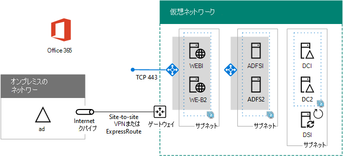

# 高可用性フェデレーション認証 フェーズ 5: サーバーのフェデレーション認証を構成Microsoft 365

Azure インフラストラクチャ サービスに Microsoft 365 の高可用性フェデレーション認証を展開するこの最終フェーズでは、パブリック証明機関によって発行された証明書を取得してインストールし、構成を確認してから、ディレクトリ同期サーバーに Azure AD Connect をインストールして実行します。 Azure AD Connectは、フェデレーション認証Microsoft 365 Active Directory フェデレーション サービス (AD FS) と Web アプリケーション プロキシ サーバーを構成します。
  
すべての[フェーズについては、「高可用性フェデレーション認証を Azure Microsoft 365展開](deploy-high-availability-federated-authentication-for-microsoft-365-in-azure.md)する」を参照してください。
  
## パブリック証明書を取得し、ディレクトリ同期サーバーにコピーする

次のプロパティを使用して、公開証明機関からデジタル証明書を取得します。
  
- SSL 接続の作成に適した X.509 証明書。
    
- サブジェクトの別名 (SAN) の拡張プロパティは、フェデレーション サービス FQDN に設定されています (例: fs.contoso.com)。
    
- 証明書には、秘密キーを PFX 形式で格納する必要があります。
    
さらに、組織のコンピューターとデバイスでデジタル証明書を発行した公開証明機関を信頼する必要があります。この信頼を確立するには、コンピューターとデバイス上の信頼されたルート証明機関ストアに、公開証明機関から取得したルート証明書をインストールします。通常、Microsoft Windows を実行するコンピューターには、一般的に使用される証明機関が発行したこれらの種類の証明書セットがインストールされています。公開証明機関のルート証明書がまだインストールされていない場合は、この証明書を組織のコンピューターとデバイスに展開する必要があります。
  
フェデレーション認証の証明書要件に関する詳細については、「[フェデレーションのインストールと構成の前提条件](/azure/active-directory/connect/active-directory-aadconnect-prerequisites#prerequisites-for-federation-installation-and-configuration)」を参照してください。
  
証明書を受け取った場合は、ディレクトリ同期サーバーの C: ドライブ上のフォルダーにコピーします。 たとえば、ファイルに SSL.pfx という名前を付け、ディレクトリ同期サーバーの C: \\ Certs フォルダーに保存します。
  
## 構成を確認する

これで、Azure 認証とフェデレーション認証AD Connect構成する準備が整Microsoft 365。 確認用のチェックリストを以下に示します。
  
- 組織のパブリック ドメインがサブスクリプションにMicrosoft 365されます。
    
- 組織のユーザー アカウントMicrosoft 365組織のパブリック ドメイン名に構成され、正常にサインインできます。
    
- フェデレーション サービス FQDN をパブリック ドメイン名に基づいて決定している。
    
- フェデレーション サービス FQDN のパブリック DNS A レコードが、Web アプリケーション プロキシ サーバー用の Azure インターネット接続ロード バランサーのパブリック IP アドレスを指している。
    
- フェデレーション サービス FQDN のプライベート DNS A レコードが、AD FS サーバー用の内部の Azure ロード バランサーのプライベート IP アドレスを指している。
    
- SAN をフェデレーション サービス FQDN に設定した SSL 接続に適した公的証明機関-isssued デジタル証明書は、ディレクトリ同期サーバーに保存されている PFX ファイルです。
    
- 公的証明機関のルート証明書が、コンピューターとデバイスの信頼されたルート証明機関ストアにインストールされている。
    
Contoso 組織の例を、以下に示します。
  
**Azure での高可用性フェデレーション認証インフラストラクチャの構成例**

  
## Azure AD Connect を実行してフェデレーション認証を構成する

Azure AD Connect ツールは、FS AD、Web アプリケーション プロキシ サーバー、およびフェデレーション認証のMicrosoft 365を次の手順で構成します。
  
1. ローカル管理者特権を持つドメイン アカウントを使用して、ディレクトリ同期サーバーへのリモート デスクトップ接続を作成します。
    
2. ディレクトリ同期サーバーのデスクトップから、ディレクトリを開Internet Explorerに移動します [https://aka.ms/aadconnect](https://aka.ms/aadconnect) 。
    
3. **[Microsoft Azure Active Directory Connect]** ページで、 **[ダウンロード]** をクリックしてから **[実行]** をクリックします。
    
4. **[Azure AD Connect へようこそ]** ページで、 **[同意する]** をクリックしてから、 **[続行]** をクリックします。
    
5. **[簡単設定]** ページで、**[カスタマイズ]** をクリックします。
    
6. **[必須コンポーネントのインストール]** ページで、**[インストール]** をクリックします。
    
7. **[ユーザー サインイン]** ページで、**[AD FS とのフェデレーション]** をクリックしてから、**[次へ]** をクリックします。
    
8. **[Azure Connect AD]** ページで **、Azure AD DC** 管理者の名前とパスワード、または Microsoft 365 サブスクリプションのグローバル管理者アカウントを入力し、[次へ] をクリック **します**。
    
9. [ディレクトリConnect] ページで、フォレストでオンプレミスの Active Directory ドメイン サービス (AD DS) フォレストが選択されていないことを確認し、ドメイン管理者アカウントの名前とパスワードを入力し、[ディレクトリの追加] をクリックし、[次へ] をクリックします。 
    
10. **[Azure AD サインインの構成]** ページで、 **[次へ]** をクリックします。
    
11. **[ドメインと OU のフィルタリング]** ページで、 **[次へ]** をクリックします。
    
12. **[一意のユーザー識別]** ページで、 **[次へ]** をクリックします。
    
13. **[ユーザーおよびデバイスのフィルタリング]** ページで、 **[次へ]** をクリックします。
    
14. **[オプション機能]** ページで、 **[次へ]** をクリックします。
    
15. **[AD FS ファーム]** ページで、 **[新しい AD FS ファームを構成する]** をクリックします。
    
16. **[参照]** をクリックして、公開証明機関から取得した SSL 証明書の場所と名前を指定します。
    
17. 確認する画面が表示されたら、証明書のパスワードを入力して、 **[OK]** をクリックします。
    
18. **[サブジェクト名]** と **[フェデレーション サービス名]** がフェデレーション サービス FQDN に設定されていることを確認して、 **[次へ]** をクリックします。
    
19. **[AD FS サーバー]** ページで、最初の AD FS サーバーの名前 (「表 M」-「項目 4」-「仮想マシン名」列) を入力し、 **[追加]** をクリックします。
    
20. 2 番目の AD FS サーバーの名前 (「表 M」-「項目 5」-「仮想マシン名」列) を入力し、 **[追加]** をクリックしてから、 **[次へ]** をクリックします。
    
21. **[Web アプリケーション プロキシ サーバー]** ページで、最初の Web アプリケーション プロキシ サーバーの名前 (「表 M」-「項目 6」-「仮想マシン名」列) を入力し、 **[追加]** をクリックします。
    
22. 2 番目の Web アプリケーション プロキシ サーバーの名前 (「表 M」-「項目 7」-「仮想マシン名」列) を入力し、 **[追加]** をクリックしてから、 **[次へ]** をクリックします。
    
23. **[ドメイン管理者の資格情報]** ページで、ドメイン管理者アカウントのユーザー名とパスワードを入力し、 **[次へ]** をクリックします。
    
24. **[AD FS サービス アカウント]** ページで、エンタープライズ管理者アカウントのユーザー名とパスワードを入力し、 **[次へ]** をクリックします。
    
25. **[Azure AD ドメイン]** ページの **[ドメイン]** で、組織の DNS ドメイン名を選択して、 **[次へ]** をクリックします。
    
26. **[構成の準備完了]** ページで、 **[インストール]** をクリックします。
    
27. **[インストールの完了]** ページで **[確認]** をクリックします。イントラネット構成とインターネット構成の両方が正常に確認されたことを示す 2 つのメッセージが表示されます。
    
  - イントラネット メッセージには、AD FS サーバー用の Azure 内部ロード バランサーのプライベート IP アドレスが一覧表示されます。
    
  - インターネット メッセージには、Web アプリケーション プロキシ サーバー用の Azure インターネット接続ロード バランサーのパブリック IP アドレスが一覧表示されます。
    
28. **[インストールの完了]** ページで、 **[終了]** をクリックします。
    
サーバーのプレース ホルダー名を使用した、最終構成がこちらです。
  
**フェーズ 5:Azure での高可用性フェデレーション認証インフラストラクチャの最終構成**

  
Azure 内のユーザーの高可用性フェデレーションMicrosoft 365インフラストラクチャが完了しました。
  
## 関連項目

[Azure に Microsoft 365 の高可用性フェデレーション認証を展開する](deploy-high-availability-federated-authentication-for-microsoft-365-in-azure.md)
  
[開発/テスト環境Microsoft 365フェデレーション ID](federated-identity-for-your-microsoft-365-dev-test-environment.md)
  
[Microsoft 365 ソリューションおよびアーキテクチャ センター](../solutions/index.yml)

[ユーザーのフェデレーション id Microsoft 365](https://support.office.com/article/Understanding-Office-365-identity-and-Azure-Active-Directory-06a189e7-5ec6-4af2-94bf-a22ea225a7a9#bk_federated)
