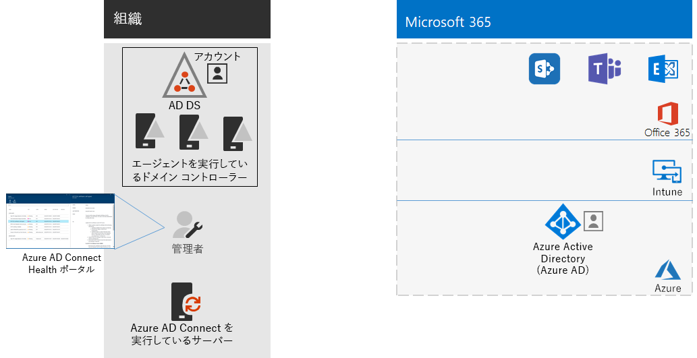

# 手順 4: ユーザ アカウントを追加するStep 4: Add your user accounts

## クラウド専用 ID のユーザー アカウントを作成するCreate your user accounts for cloud-only identity

クラウド専用 ID の場合、Azure Active Directory (Azure AD) にユーザーとグループを作成します。For cloud-only identity, create your users and groups in Azure Active Directory (Azure AD). 使用できるもの:You can use:

- Microsoft 365 管理センターMicrosoft Office 365 admin center
- Azure portalThe Azure portal
- Azure PowerShellAzure Powershell

## ハイブリッド ID の ID を同期するSynchronize identities for hybrid identity

*これはハイブリッド環境で必須であり、Microsoft 365 Enterprise のバージョン E3 および E5 の両方に適用されます。**This is required for hybrid environments and applies to both the E3 and E5 versions of Microsoft 365 Enterprise*

このセクションでは、オンプレミス Active Directory Domain Services (AD DS) を、Office 365、Microsoft Intune、Microsoft 365 Enterprise に含まれるその他のクラウドベースのサービスで使用される Azure AD テナントに同期させます。In this section, you'll synchronize your on-premises Active Directory Domain Services (AD DS) with the Azure AD tenant used by Office 365, Microsoft Intune, and other cloud-based services included with Microsoft 365 Enterprise.

Azure AD Connect は、シングル フォレストまたはマルチフォレスト AD DS 環境の実際に必要な ID のみを、Azure AD テナントと同期できるようにする、サポートされている Microsoft ツールです。Azure AD Connect is the supported Microsoft tool that guides you through synchronizing only the identities you really need from single or multi-forest AD DS environments to your Azure AD tenant. 次の図は、Azure AD Connect 同期に関する基本的なプロセスを示します。The following figure shows the basic process for Azure AD Connect synchronization.

1. サーバーで実行している Azure AD Connect は、アカウント、グループ、および連絡先の変更に関して AD DS にポーリングします。Azure AD Connect running on a server polls AD DS for changes in accounts, groups, and contacts.
2. Azure AD Connect はそれらの変更を Microsoft 365 サブスクリプションの Azure AD テナントに送信します。Azure AD Connect sends those changes to the Azure AD tenant of your Microsoft 365 subscription.

ハイブリッド ID ソリューションでは、最初に認証の要件を決定します。次にオプションを示します。The first decision in your hybrid identity solution is your authentication requirement. The following options are options:

- **管理認証**では、Azure AD はユーザー サインインの認証プロセスを処理します。管理認証方式は 2 種類あります。With **managed authentication**, Azure AD handles the authentication process for user sign-in. There are two methods for managed authentication: 
    - **パスワード ハッシュ同期 (PHS)**: (一部のプレミアム機能で推奨または必須)**Password Hash Sync (PHS)** [Recommended and required for some premium features]. Azure AD でオンプレミス ディレクトリ オブジェクトの認証を有効にする最も簡単な方法です。This is the simplest way to enable authentication for on-premises directory objects in Azure AD. Azure AD Connect は AD DS からハッシュ化されたパスワードを抽出し、パスワード ハッシュに対し追加のセキュリティ処理を実行し、パスワードを Azure AD に同期します。Azure AD Connect extracts the hashed password from AD DS, does extra security processing on the password, and saves it in Azure AD. 詳細については、「[Azure AD Connect 同期を使用したパスワード ハッシュ同期の実装](https://docs.microsoft.com/azure/active-directory/hybrid/how-to-connect-password-hash-synchronization)」を参照してください。For more information, see [Implement password hash synchronization with Azure AD Connect sync](https://docs.microsoft.com/azure/active-directory/hybrid/how-to-connect-password-hash-synchronization).
    - **パススルー認証 (PTA)**: Azure AD ベース サービスのためのシンプルなパスワード検証ソリューションです。**Pass-through Authentication (PTA)** provides a simple password validation solution for Azure AD-based services. PTA は 1 つ以上のオンプレミス サーバーで実行されているエージェントを使用して、オンプレミス AD DS に対し直接ユーザー認証を検証します。PTA uses an agent running on one or more on-premises servers to validate the user authentications directly with your on-premises AD DS. 詳細については、「[Azure Active Directory パススルー認証によるユーザー サインイン](https://docs.microsoft.com/azure/active-directory/connect/active-directory-aadconnect-pass-through-authentication)」を参照してください。For more information, see [User sign-in with Azure Active Directory Pass-through Authentication](https://docs.microsoft.com/azure/active-directory/connect/active-directory-aadconnect-pass-through-authentication).
- **フェデレーション認証**では、ユーザーのサインインで、認証プロセスが ID フェデレーション サーバー (Active Directory フェデレーション サービス (AD FS) など) を介して別の ID プロバイダーにリダイレクトされます。ID プロバイダーは、その他の認証方式 (スマートカード ベースの認証など) を提供できます。詳細については、「[Azure Active Directory ハイブリッド ID ソリューションの適切な認証方法を選択する](https://docs.microsoft.com/azure/security/azure-ad-choose-authn)」を参照してください。With **federated authentication**, the authentication process is redirected to another identity provider through an identity federation server, such as Active Directory Federation Services (AD FS), for a user’s sign-in. The identity provider can provide additional authentication methods, such as smartcard-based authentication. For more information, see [Choosing the right authentication method for your Azure Active Directory hybrid identity solution](https://docs.microsoft.com/azure/security/azure-ad-choose-authn).

Microsoft 365 Enterprise の ID モデルと認証の概要については、このビデオをご覧ください。Before you begin, watch this video for an overview of identity models and authentication for Microsoft 365.

 

> [!VIDEO https://www.microsoft.com/videoplayer/embed/RE2Pjwu]

ハイブリッド ID ソリューションが決定したら、[IdFix Directory Synchronization Error Remediation Tool](https://www.microsoft.com/download/details.aspx?id=36832) をダウンロードして実行し、AD DS を分析して問題がないかどうかを確認します。After you've determined your hybrid identity solution, download and run the [IdFix Directory Synchronization Error Remediation Tool](https://www.microsoft.com/download/details.aspx?id=36832) to analyze your AD DS for issues.

IdFix ツールで検出されたすべての問題を解決したら、Azure AD Connect ツールのインストール、および Microsoft 365 サブスクリプションのオンプレミス AD DS と Azure AD テナント間のディレクトリ同期の構成に関するガイダンスとして「[パスワード ハッシュ同期の実装](https://docs.microsoft.com/azure/active-directory/connect/active-directory-aadconnectsync-implement-password-hash-synchronization)」を参照してください。After resolving all of the issues identified by the IdFix tool, see [Implement password hash synchronization](https://docs.microsoft.com/azure/active-directory/connect/active-directory-aadconnectsync-implement-password-hash-synchronization) for guidance on installing the Azure AD Connect tool and configuring directory synchronization between your on-premises AD DS and the Azure AD tenant for your Office 365 and EMS subscriptions. 同期開始後は、オンプレミス ID プロバイダー (AD DS など) でユーザー アカウントとグループを維持できます。After synchronization starts, you'll maintain your user accounts and groups with your on-premises identity provider, such as AD DS.

Microsoft では、セキュアで生産性の高い労働力を確保するために [ID とデバイスのアクセス](microsoft-365-policies-configurations.md)に関する一連の推奨事項を提供しています。Microsoft provides a set of recommendations for [identity and device access](microsoft-365-policies-configurations.md) to ensure a secure and productive workforce. 

- ハイブリッド環境で推奨されている要件については、[前提条件](identity-access-prerequisites.md#prerequisites)の**パスワード ハッシュ同期を使用した Active Directory** をご覧ください。For recommended requirements for hybrid environments, see the **Active Directory with password hash sync** column in [prerequisites](identity-access-prerequisites.md#prerequisites). 

- クラウド専用環境で推奨されている要件については、[前提条件](identity-access-prerequisites.md#prerequisites)の**クラウドのみ**列をご覧ください。For recommended requirements for cloud only environments, see the **Cloud only** column in [prerequisites](identity-access-prerequisites.md#prerequisites).

Azure AD にオンプレミスのユーザーとグループが作成されると、 OneDrive for Business や Exchange Online などのライセンスの割り当てと、生産性ワークロードの使用を開始できます。Once your on-premises users and groups are present in Azure AD, you can start assigning licenses and using Exchange Online.

|||
|:-------|:-----|
|| [テスト ラボ ガイド: パスワード ハッシュ同期Test Lab Guide: Password hash synchronization](password-hash-sync-m365-ent-test-environment.md)  [テスト ラボ ガイド: パススルー認証Test Lab Guide: Pass-through authentication](pass-through-auth-m365-ent-test-environment.md) |
|||

中間チェックポイントとして、このセクションに対応する[終了条件](identity-exit-criteria.md#crit-identity-sync)を確認できます。As an interim checkpoint, you can see the [exit criteria](identity-exit-criteria.md#crit-identity-sync) corresponding to this section.

## 同期の状態を監視するMonitor synchronization health

*この手順はオプションであり、Microsoft 365 Enterprise のバージョン E3 および E5 の両方に適用されます。**This is optional and applies to both the E3 and E5 versions of Microsoft 365 Enterprise*

このセクションでは、Azure AD Connect Health エージェントを各オンプレミス AD DS ドメイン コントローラーにインストールして、Azure AD Connect によって提供されている ID インフラストラクチャと 同期サービスを監視します。In this section, you'll install an Azure AD Connect Health agent on each of your on-premises identity servers to monitor your identity infrastructure and the synchronization services provided by Azure AD Connect. 監視情報は Azure AD Connect Health ポータルで使用可能になります。このポータルでは、アラート、パフォーマンス監視、使用状況分析などの情報を確認できます。The monitoring information is made available in an Azure AD Connect Health portal, where you can view alerts, performance monitoring, usage analytics, and other information.

Azure AD Connect Health の使用法に関する重要な設計上の決定は、Azure AD Connect をどのように使用しているかに応じて異なります。The key design decision of how to use Azure AD Connect Health is based on how you are using Azure AD Connect:

- **管理認証**オプションを使用している場合は、最初に「[Azure AD Connect Health を使用した Azure AD Connect の同期の監視](https://docs.microsoft.com/azure/active-directory/connect-health/active-directory-aadconnect-health-sync)」を参照し、Azure AD Connect Health について理解し、構成します。If you’re using the **managed authentication** option, start with [Using Azure AD Connect Health with sync](https://docs.microsoft.com/azure/active-directory/connect-health/active-directory-aadconnect-health-sync) to understand and configure Azure AD Connect Health.
- Active Directory フェデレーション サービス (AD FS) で**フェデレーション認証**を使用してアカウントとグループの名前だけを同期している場合は、最初に「[Azure AD Connect Health を使用した AD FS の監視](https://docs.microsoft.com/azure/active-directory/connect-health/active-directory-aadconnect-health-adfs)」を参照し Azure AD Connect Health について理解し、構成します。If you're synchronizing just the names of the accounts and groups using **federated authentication** with Active Directory Federation Services (AD FS), start with [Using Azure AD Connect Health with AD FS](https://docs.microsoft.com/azure/active-directory/connect-health/active-directory-aadconnect-health-adfs) to understand and configure Azure AD Connect Health.

このセクションの完了後の成果物は次のとおりです。When you complete this section, you’ll have:

- Azure AD Connect Health エージェントがオンプレミス ID プロバイダー サーバーにインストールされている。The Azure AD Connect Health agent installed on your on-premises identity provider servers.
- Azure AD Connect Health ポータルでは、Microsoft 365 サブスクリプションの Azure AD テナントでオンプレミス インフラストラクチャの現在の状態と同期アクティビティを表示しています。The Azure AD Connect Health portal displaying the current state of your on-premises infrastructure and synchronization activities with the Azure AD tenant for your Office 365 and EMS subscriptions.

中間チェックポイントとして、このセクションの[終了条件](identity-exit-criteria.md#crit-identity-sync-health)を確認できます。As an interim checkpoint, you can see the [exit criteria](identity-exit-criteria.md#crit-identity-sync-health) for this section.

## パスワードの更新を簡素化するSimplify password updates

*この手順はハイブリッド環境でオプションであり、Microsoft 365 Enterprise のバージョン E3 および E5 に適用されます。**This is optional for hybrid environments and applies to both the E3 and E5 versions of Microsoft 365 Enterprise*

このセクションでは、ユーザーに Azure Active directory (Azure AD) を通じてパスワードを再設定することを許可します。この再設定はローカル Active Directory Domain Services (AD DS) に複製されます。In this section, you'll allow users to reset their passwords through Azure Active Directory (Azure AD), which is then replicated to your local Active Directory Domain Services (AD DS). このプロセスは、パスワードの書き戻しと呼びます。This process is known as password writeback. ユーザーはパスワードの書き戻しを使用すれば、ユーザー アカウントとその属性が保存されているオンプレミス AD DS を通じてパスワードの更新を行う必要がありません。With password writeback, users don’t need to update their passwords through the on-premises Active Directory Domain Services (AD DS) where user accounts and their attributes are stored. これは、オンプレミスのネットワークへのリモート アクセス接続を持たないローミング ユーザーやリモート ユーザーにとって役立ちます。This is valuable to roaming or remote users who do not have a remote access connection to the on-premises network.

パスワードの書き戻しは、Azure AD Identity Protection (アカウント侵害が発生する可能性が高い危険が検出された場合にオンプレミス パスワードの変更をユーザーに義務付けるなど) を最大限に活用するために必要です。Password writeback is required to fully utilize Identity Protection feature capabilities, such as requiring users to change their on-premises passwords when there has been a high risk of account compromise detected.

その他の情報と構成手順については、「[Azure AD SSPR とパスワード書き戻し](https://docs.microsoft.com/azure/active-directory/active-directory-passwords-writeback)」を参照してください。For additional information and configuration instructions, see [Azure AD SSPR with password writeback](https://docs.microsoft.com/azure/active-directory/active-directory-passwords-writeback).

>[!Note]
>最適なエクスペリエンスとリリースされた新機能を利用できるようにするため、Azure AD Connect の最新バージョンにアップグレードします。詳細については、「[Azure AD Connect のカスタム インストール](https://docs.microsoft.com/azure/active-directory/connect/active-directory-aadconnect-get-started-custom)」を参照してください。Upgrade to the latest version of Azure AD Connect to ensure the best possible experience and new features as they are released. For more information, see [Custom installation of Azure AD Connect](https://docs.microsoft.com/azure/active-directory/connect/active-directory-aadconnect-get-started-custom).
>

|||
|:-------|:-----|
|| [テスト ラボ ガイド: パスワードの書き戻しTest Lab Guide: Password writeback](password-writeback-m365-ent-test-environment.md) |
|||

中間チェックポイントとして、このセクションの[終了条件](identity-exit-criteria.md#crit-identity-pw-writeback)を確認できます。As an interim checkpoint, you can see the [exit criteria](identity-exit-criteria.md#crit-identity-pw-writeback) for this section.

|||
|:-------|:-----|
|| [管理にグループを使用するUse groups for easier management](identity-use-group-management.md) |
