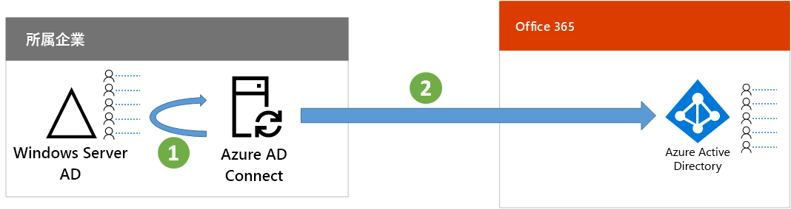

# 手順 3: ハイブリッド ID の構成

## ID を同期する

*これはハイブリッド環境で必須であり、Microsoft 365 Enterprise のバージョン E3 および E5 の両方に適用されます。*

このセクションでは、オンプレミス Active Directory Domain Services (AD DS) と、Office 365 および Enterprise Mobility + Security (EMS) のサブスクリプションで使用される Active Directory (Azure AD) テナントを同期します。

Azure AD Connect は、シングル フォレストまたはマルチフォレスト AD DS 環境の実際に必要な ID のみを、Azure AD テナントと同期できるようにする、サポートされている Microsoft ツールです。 次の図は、Azure AD Connect 同期に関する基本的なプロセスを示します。

1. サーバーで実行している Azure AD Connect は、アカウント、グループ、および連絡先の変更に関して AD DS にポーリングします。
2. Azure AD Connect はそれらの変更を Microsoft 365 サブスクリプションの Azure AD テナントに送信します。

ハイブリッド ID ソリューションでは、最初に認証の要件を決定します。次にオプションを示します。

- **管理認証**では、Azure AD はユーザー サインインの認証プロセスを処理します。管理認証方式は 2 種類あります。 
    - **パスワード ハッシュ同期 (PHS)**: (一部のプレミアム機能で推奨または必須) Azure AD でオンプレミス ディレクトリ オブジェクトの認証を有効にする最も簡単な方法です。 Azure AD Connect は AD DS からハッシュ化されたパスワードを抽出し、パスワードに対し追加のセキュリティ処理を実行し、パスワードを Azure AD に保存します。 詳細については、「[Azure AD Connect 同期を使用したパスワード ハッシュ同期の実装](https://docs.microsoft.com/azure/active-directory/connect/active-directory-aadconnectsync-implement-password-synchronization)」を参照してください。
    - **パススルー認証 (PTA)**: Azure AD ベース サービスのためのシンプルなパスワード検証ソリューションです。 PTA は 1 つ以上のオンプレミス サーバーで実行されているエージェントを使用して、オンプレミス AD DS に対し直接ユーザー認証を検証します。 詳細については、「[Azure Active Directory パススルー認証によるユーザー サインイン](https://docs.microsoft.com/azure/active-directory/connect/active-directory-aadconnect-pass-through-authentication)」を参照してください。
- **フェデレーション認証**では、ユーザーのサインインで、認証プロセスが ID フェデレーション サーバー (Active Directory フェデレーション サービス (AD FS) など) を介して別の ID プロバイダーにリダイレクトされます。ID プロバイダーは、その他の認証方式 (スマートカード ベースの認証など) を提供できます。詳細については、「[Azure Active Directory ハイブリッド ID ソリューションの適切な認証方法を選択する](https://docs.microsoft.com/azure/security/azure-ad-choose-authn)」を参照してください。

ハイブリッド ID ソリューションが決定したら、[IdFix Directory Synchronization Error Remediation Tool](https://www.microsoft.com/download/details.aspx?id=36832) をダウンロードして実行し、AD DS を分析して問題がないかどうかを確認します。

IdFix ツールで検出されたすべての問題を解決したら、「[パスワード ハッシュ同期を実装する](https://docs.microsoft.com/azure/active-directory/connect/active-directory-aadconnectsync-implement-password-hash-synchronization)」を参照し、Azure AD Connect ツールのインストールと、Office 365 および EMS サブスクリプションのオンプレミス AD DS と Azure AD テナント間のディレクトリ同期の構成について確認してください。 同期開始後は、オンプレミス ID プロバイダー (AD DS など) でユーザー アカウントとグループを維持できます。

Microsoft では、セキュアで生産性の高い労働力を確保するために [ID とデバイスのアクセス](microsoft-365-policies-configurations.md)に関する一連の推奨事項を提供しています。 

- ハイブリッド環境で推奨されている要件については、[前提条件](identity-access-prerequisites.md#prerequisites)の**パスワード ハッシュ同期を使用した Active Directory** をご覧ください。 

- クラウド専用環境で推奨されている要件については、[前提条件](identity-access-prerequisites.md#prerequisites)の**クラウドのみ**列をご覧ください。

Azure AD にオンプレミスのユーザーとグループが作成されると、ライセンスを割り当てて、Exchange Online の使用を開始できます。 Exchange Online をユーザーにロールアウトし、オンプレミスのメールボックスを移行するには、[Microsoft 365 Enterprise 用 Exchange Online を展開する](exchangeonline-workload.md)を参照してください。

|||
|:-------|:-----|
|| [テスト ラボ ガイド: パスワード ハッシュ同期](password-hash-sync-m365-ent-test-environment.md)  [テスト ラボ ガイド: パススルー認証](pass-through-auth-m365-ent-test-environment.md) |
|||

中間チェックポイントとして、このセクションに対応する[終了条件](identity-exit-criteria.md#crit-identity-sync)を確認できます。

## 同期の状態を監視する

*この手順はオプションであり、Microsoft 365 Enterprise のバージョン E3 および E5 の両方に適用されます。*

このセクションでは、Azure AD Connect Health エージェントを各オンプレミス ID サーバーにインストールし、ID インフラストラクチャと Azure AD Connect から提供される同期サービスを監視します。 監視情報は Azure AD Connect Health ポータルで使用可能になります。このポータルでは、アラート、パフォーマンス監視、使用状況分析などの情報を確認できます。

Azure AD Connect Health の使用法に関する重要な設計上の決定は、Azure AD Connect をどのように使用しているかに応じて異なります。

- **管理認証**オプションを使用している場合は、最初に「[Azure AD Connect Health を使用した Azure AD Connect の同期の監視](https://docs.microsoft.com/azure/active-directory/connect-health/active-directory-aadconnect-health-sync)」を参照し、Azure AD Connect Health について理解し、構成します。
- Active Directory フェデレーション サービス (AD FS) で**フェデレーション認証**を使用してアカウントとグループの名前だけを同期している場合は、最初に「[Azure AD Connect Health を使用した AD FS の監視](https://docs.microsoft.com/azure/active-directory/connect-health/active-directory-aadconnect-health-adfs)」を参照し Azure AD Connect Health について理解し、構成します。

このセクションの完了後の成果物は次のとおりです。

- Azure AD Connect Health エージェントがオンプレミス ID プロバイダー サーバーにインストールされている。
- Azure AD Connect Health ポータルに、オンプレミス インフラストラクチャの現在の状態と、Office 365 および EMS サブスクリプションの Azure AD テナントとの同期アクティビティが表示される。

中間チェックポイントとして、このセクションの[終了条件](identity-exit-criteria.md#crit-identity-sync-health)を確認できます。

## 次の手順

|||
|:-------|:-----|
| [セキュリティで保護されたユーザー認証を構成する](identity-multi-factor-authentication.md)
