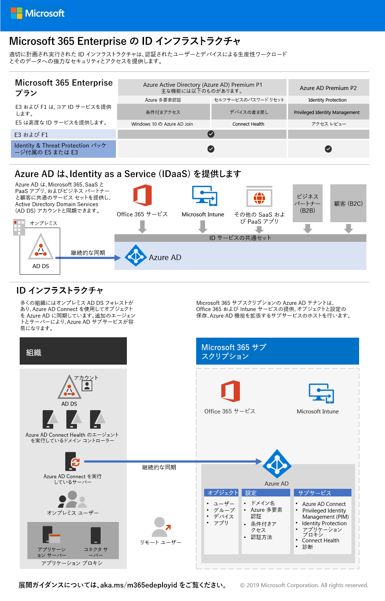

# フェーズ 2: IDPhase 2: Identity

Microsoft 365 enterprise では、ID インフラストラクチャを入念に計画および実施することで、セキュリティを強化し、認証されたユーザーとデバイスだけが生産性ワークロードとそのデータにアクセスできるようにする準備が整います。In Microsoft 365 Enterprise, a well-planned and executed identity infrastructure paves the way for stronger security and access to your productivity workloads and their data only by authenticated users and devices.

Microsoft 365 Enterprise の ID モデルと認証の概要については、このビデオをご覧ください。Watch this video for an overview of identity models and authentication for Microsoft 365 Enterprise.

 

 

> [!VIDEO https://www.microsoft.com/videoplayer/embed/RE2Pjwu]

>[!Note]
>既に ID インフラストラクチャを展開している場合は、[ID インフラストラクチャの終了条件](identity-exit-criteria.md)を参照し、Microsoft 365 Enterprise の必須条件とオプションの条件を満たしていることを確認してください。If you’ve already deployed an identity infrastructure, please see the [identity exit criteria](identity-exit-criteria.md) to make sure that you meet the required and optional conditions for Microsoft 365 Enterprise.
>

各 Microsoft 365 Enterprise プランの ID 機能、Azure Active Directory (Azure AD) の役割、オンプレミスおよびクラウドベースのコンポーネント、および最も一般的な認証構成については、[ID インフラストラクチャのポスター](../media/identity-infrastructure/M365E-ID-Infra.pdf) を参照してください。For the identity features of each Microsoft 365 Enterprise plan, the role of Azure Active Directory (Azure AD), on-premises and cloud-based components, and the most common authentication configurations, see the [Identity Infrastructure poster](../media/identity-infrastructure/M365E-ID-Infra.pdf).

この 2 ページのポスターで、Microsoft 365 Enterprise の ID の概念と構成をすばやく把握できます。This two-page poster is a quick way to ramp up on identity concepts and configurations for Microsoft 365 Enterprise.

[このポスターをダウンロード](https://github.com/MicrosoftDocs/microsoft-365-docs/raw/public/microsoft-365/enterprise/media/identity-infrastructure/M365E-ID-Infra.pdf)して、レター形式、リーガル形式、またはタブロイド形式 (11 x 17) で印刷することもできます。You can also [download this poster](https://github.com/MicrosoftDocs/microsoft-365-docs/raw/public/microsoft-365/enterprise/media/identity-infrastructure/M365E-ID-Infra.pdf) and print it in letter, legal, or tabloid (11 x 17) formats.

## Microsoft 365 Enterprise の ID インフラストラクチャを計画および展開するPlan and deploy your Microsoft 365 Enterprise identity infrastructure 

クラウドで新しい ID インフラストラクチャを計画および展開するには、次の手順を使用します。また、これらの手順を使用して既存のオンプレミスまたはハイブリッド ID インフラストラクチャを導入し、Microsoft 365 Enterprise と連携することができます。Use the following steps to plan and deploy your new identity infrastructure in the cloud. You can also use these steps to adapt your existing on-premises or hybrid identity infrastructure to work with Microsoft 365 Enterprise. 

|||
|:-------|:-----|
|| [グローバル管理者アカウントを作成して保護するCreate and protect your global admin accounts](identity-create-protect-global-admins.md) |
|| [パスワードをセキュリティで保護するSecure your passwords](identity-secure-your-passwords.md) |
|| [ユーザーのサインインをセキュリティで保護して管理するSecure and manage your user sign-ins](identity-secure-user-sign-ins.md) |
|| [ユーザー アカウントを追加するAdd your user accounts](identity-add-user-accounts.md) |
|| [管理にグループを使用するUse groups for management](identity-use-group-management.md) |
|| [Identity Governance を構成するConfigure identity governance](identity-configure-identity-governance.md) |

上記の手順が完了したら、このフェーズの[終了条件](identity-exit-criteria.md)を参照し、Microsoft 365 Enterprise ID の必須条件とオプションの条件を満たしていることを確認します。When you've completed these steps, go to the [exit criteria](identity-exit-criteria.md) for this phase to ensure that you meet the required and optional conditions for Microsoft 365 Enterprise identity.

## ID とデバイスのアクセスに関する推奨事項Identity and device access recommendations

Microsoft では、セキュアで生産性の高い要員を確保するために [ID とデバイスのアクセス](microsoft-365-policies-configurations.md)に関する一連の推奨事項を提供しています。たとえば、このフェーズの手順で、以下の記事に記されている推奨事項と設定を使用してください。Microsoft provides a set of recommendations for [identity and device access](microsoft-365-policies-configurations.md) to ensure a secure and productive workforce. For identity, use the recommendations and settings in the following articles along with the steps in this phase:

- [前提条件Prerequisites](identity-access-prerequisites.md)
- [共通 ID とデバイスのアクセス ポリシーCommon identity and device access policies](identity-access-policies.md)

## Microsoft での Microsoft 365 Enterprise の活用方法How Microsoft does Microsoft 365 Enterprise

Microsoft の IT エキスパートが [ID を管理し、アクセスをセキュリティで保護](https://www.microsoft.com/itshowcase/deploying-and-managing-microsoft-365#primaryR5)する方法について説明します。Learn how IT experts at Microsoft [manage identities and secure access](https://www.microsoft.com/itshowcase/deploying-and-managing-microsoft-365#primaryR5).

## Contoso 社での Microsoft 365 Enterprise の活用方法How Contoso did Microsoft 365 Enterprise

架空の典型的な多国籍企業である Contoso Corporation が、Microsoft 365 のクラウド サービス向けに[ハイブリッド ID インフラストラクチャを展開](contoso-identity.md)した方法をご紹介します。See how the Contoso Corporation, a fictional but representative multi-national business, [deployed a hybrid identity infrastructure](contoso-identity.md) for Microsoft 365 cloud services.

## 次の手順Next step

|||
|:-------|:-----|
|| [グローバル管理者アカウントを作成して保護するCreate and protect your global admin accounts](identity-create-protect-global-admins.md) |
