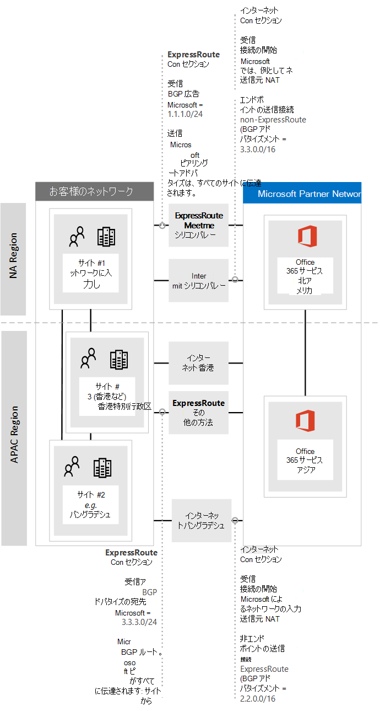

# <a name="implementing-expressroute-for-office-365"></a>Office 365 向け ExpressRoute の実装

*この記事は、Microsoft 365 Enterprise および Office 365 Enterprise の両方に適用されます。*

ExpressRoute for Office 365は、多くのインターネットに接続するOffice 365 サービスへの代替ルーティング パスを提供します。 Office 365用 ExpressRoute のアーキテクチャは、インターネット経由で既にアクセスできるOffice 365 サービスのパブリック IP プレフィックスをプロビジョニング済みの ExpressRoute 回線にアドバタイズし、それらの IP プレフィックスをネットワークに再配布することに基づいています。 ExpressRoute を使用すると、多くのOffice 365 サービスに対して、インターネット経由と ExpressRoute 経由で、いくつかの異なるルーティング パスを効果的に有効にすることができます。 このネットワーク上のルーティング状態は、内部ネットワーク トポロジの設計方法に大きな変化をもたらす可能性があります。
  
 **ステータス：** ガイド v2 を完了する
  
コア ネットワークとインターネットに挿入されたルートを使用して専用回線を介してルーティングを利用できるネットワークの複雑さに対応するために、expressRoute の実装をOffice 365に慎重に計画する必要があります。 このガイドで詳細な計画とテストを自分とチームが実行しない場合、ExpressRoute 回線が有効になっていると、断続的に発生したり、Office 365 サービスへの接続が完全に失われたりするリスクが高くなります。
  
実装を成功させるには、インフラストラクチャ要件を分析し、詳細なネットワーク評価と設計を行い、段階的かつ制御された方法でロールアウトを慎重に計画し、詳細な検証とテスト計画を構築する必要があります。 大規模な分散環境では、実装が数か月にわたって行われます。 このガイドは、事前の計画に役立つよう設計されています。
  
大規模な展開は計画に 6 か月かかる場合があり、多くの場合、ネットワーク、ファイアウォール、プロキシ サーバー管理者、Office 365管理者、セキュリティ、エンド ユーザー サポート、プロジェクト管理、エグゼクティブ スポンサーなど、組織内の多くの分野のチーム メンバーが含まれます。 計画プロセスへの投資により、デプロイエラーが発生する可能性が低くなり、ダウンタイムや複雑でコストのかかるトラブルシューティングが行われます。
  
この実装ガイドを開始する前に、次の前提条件が完了することが予想されます。
  
1. ExpressRoute が推奨され、承認されているかどうかを判断するためのネットワーク評価が完了しました。

2. ExpressRoute ネットワーク サービス プロバイダーを選択しました。 [ExpressRoute パートナーとピアリングの場所](/azure/expressroute/expressroute-locations)に関する詳細を確認します。

3. [ExpressRoute のドキュメント](https://azure.microsoft.com/documentation/services/expressroute/)を既に読んで理解しており、内部ネットワークは ExpressRoute の前提条件をエンド ツー エンドで満たすことができる。

4. チームは、すべてのパブリック ガイダンスとドキュメント[https://aka.ms/expressrouteoffice365](./azure-expressroute.md)[https://aka.ms/ert](https://aka.ms/ert)を読み、チャネル 9 で [Azure ExpressRoute for Office 365 トレーニング](https://channel9.msdn.com/series/aer) シリーズを視聴し、次のような重要な技術的詳細を理解しました。

      - SaaS サービスのインターネット依存関係。

      - 非対称ルートを回避し、複雑なルーティングを処理する方法。

      - 境界セキュリティ、可用性、およびアプリケーション レベルの制御を組み込む方法。

## <a name="begin-by-gathering-requirements"></a>要件を収集することから始める
<a name="requirements"> </a>

まず、組織内で採用する予定の機能とサービスを決定します。 さまざまなOffice 365 サービスのどの機能が使用され、ネットワーク上のどの場所がそれらの機能を使用してユーザーをホストするかを決定する必要があります。 シナリオのカタログを使用して、各シナリオで必要なネットワーク属性を追加する必要があります。受信および送信のネットワーク トラフィック フローや、Office 365 エンドポイントが ExpressRoute 経由で使用できるかどうかを確認できます。
  
組織の要件を収集するには:
  
- 組織が使用しているOffice 365 サービスの受信および送信ネットワーク トラフィックをカタログ化します。 さまざまなOffice 365シナリオで必要なフローの説明については、Office 365 URL と IP アドレス範囲のページを参照してください。

- 内部 WAN バックボーンとトポロジの詳細、サテライト サイトの接続、最後の 1 マイルのユーザー接続、ネットワーク境界エグレス ポイントへのルーティング、プロキシ サービスを示す既存のネットワーク トポロジのドキュメントを収集します。

  - Office 365およびその他のMicrosoft サービスが接続するネットワーク図で受信サービス エンドポイントを特定し、インターネット接続パスと提案された ExpressRoute 接続パスの両方を示します。

  - すべての地理的なユーザーの場所と WAN 接続を、現在インターネットに送信している場所と、ExpressRoute ピアリングの場所へのエグレスを提案する場所を特定します。

  - プロキシ、ファイアウォールなど、すべてのエッジ デバイスを識別し、インターネットと ExpressRoute 経由のフローとの関係をカタログ化します。

  - エンド ユーザーが、インターネットフローと ExpressRoute フローの両方のダイレクト ルーティングまたは間接アプリケーション プロキシを介してOffice 365 サービスにアクセスするかどうかを文書化します。

- テナントの場所と meet-me の場所をネットワークダイアグラムに追加します。

- 主要なユーザーの場所からOffice 365までの予想される、観察されるネットワークパフォーマンスと待機時間の特性を見積もる。 Office 365はグローバルで分散されたサービス のセットであり、ユーザーはテナントの場所とは異なる可能性がある場所に接続することに注意してください。 このため、ExpressRoute とインターネット接続を介してユーザーと Microsoft グローバル ネットワークの最も近いエッジとの間の待機時間を測定し、最適化することをお勧めします。 ネットワーク評価の結果を使用して、このタスクを支援できます。

- 新しい ExpressRoute 接続で満たす必要がある会社のネットワーク セキュリティと高可用性の要件を一覧表示します。 たとえば、インターネット エグレスまたは ExpressRoute 回線障害が発生した場合に、ユーザーが引き続きOffice 365にアクセスできるようにする方法について説明します。

- ネットワーク フローがインターネット パスを使用し、ExpressRoute を使用する受信と送信のOffice 365を文書化します。 ユーザーの地理的な場所とオンプレミスのネットワーク トポロジの詳細の詳細については、計画がユーザーの場所間で異なっている必要がある場合があります。

### <a name="catalog-your-outbound-and-inbound-network-traffic"></a>送信および受信ネットワーク トラフィックをカタログ化する
<a name="trafficCatalog"> </a>

ルーティングやその他のネットワークの複雑さを最小限に抑えるために、規制要件またはネットワーク評価の結果として専用接続を経由するために必要なネットワーク トラフィック フローのOffice 365にのみ ExpressRoute を使用することをお勧めします。 さらに、ExpressRoute ルーティングの範囲をステージングし、実装プロジェクトの異なる個別のステージとして送信および受信ネットワーク トラフィック フローにアプローチすることをお勧めします。 ユーザーが開始した送信ネットワーク トラフィック フローに対してOffice 365用の ExpressRoute をデプロイし、インターネット経由で受信ネットワーク トラフィック フローを残しておくと、トポロジの複雑さの増加と、非対称ルーティングの可能性が増すリスクを制御するのに役立ちます。
  
ネットワーク トラフィック カタログには、オンプレミス ネットワークと Microsoft の間に存在するすべての受信および送信ネットワーク接続の一覧が含まれている必要があります。
  
- 送信ネットワーク トラフィック フローは、内部クライアントやサーバーなどのオンプレミス環境から接続が開始され、Microsoft サービスの宛先が設定されるシナリオです。 これらの接続は、接続がプロキシ サーバー、ファイアウォール、またはOffice 365へのパス上の他のネットワーク デバイスを経由する場合など、Office 365または間接に向かう場合があります。

- 受信ネットワーク トラフィック フローは、Microsoft クラウドからオンプレミス ホストへの接続が開始されるシナリオです。 通常、これらの接続は、外部から送信されたフローに対して顧客のセキュリティ ポリシーが必要とするファイアウォールやその他のセキュリティ インフラストラクチャを経由する必要があります。

[expressRoute for Office 365 でのルーティングに関](https://support.office.com/article/Routing-with-ExpressRoute-for-Office-365-e1da26c6-2d39-4379-af6f-4da213218408)する記事のルート対称性の **確保** に関するセクションを参照して、受信トラフィックを送信するサービスを特定し、Office 365 [エンドポイント](https://support.office.com/article/Office-365-URLs-and-IP-address-ranges-8548a211-3fe7-47cb-abb1-355ea5aa88a2)の参照記事で **ExpressRoute for Office 365** とマークされた列を探して、残りの接続情報を決定します。
  
送信接続を必要とするサービスごとに、ネットワーク ルーティング、プロキシ構成、パケット検査、帯域幅のニーズなど、サービスの計画的な接続について説明する必要があります。
  
受信接続を必要とするサービスごとに、いくつかの追加情報が必要になります。 Microsoft クラウド内のサーバーは、オンプレミス ネットワークへの接続を確立します。 接続が正しく行われるようにするには、次を含め、この接続のすべての側面を記述する必要があります。これらの受信接続を受け入れるサービスのパブリック DNS エントリ、CIDR 形式の IPv4 IP アドレス、どの ISP 機器が関与しているか、およびこれらの接続に対する受信 NAT またはソース NAT の処理方法。
  
受信接続は、インターネット経由で接続しているか ExpressRoute 経由で接続しているかに関係なく、非対称ルーティングが導入されていないことを確認する必要があります。 場合によっては、Office 365 サービスが受信接続を開始するオンプレミス エンドポイントにも、他の Microsoft および非Microsoft サービスからアクセスする必要があります。 これらのサービスへの ExpressRoute ルーティングをOffice 365目的で有効にしても、他のシナリオは中断されないことが重要です。 多くの場合、お客様は、ExpressRoute が有効になった後も Microsoft からの受信フローが対称的なままになるように、ソース ベースの NAT などの内部ネットワークに対して特定の変更を実装する必要があります。
  
必要な詳細レベルのサンプルを次に示します。 この場合、ハイブリッドExchange ExpressRoute 経由でオンプレミス システムにルーティングされます。 

|Connection プロパティ   |値  |
|----------|-----------|
|**ネットワーク トラフィックの方向** <br/> |受信  <br/> |
|**サービス** <br/> |Exchange ハイブリッド  <br/> |
|**パブリック Office 365 エンドポイント (ソース)** <br/> |Exchange Online (IP アドレス)  <br/> |
|**パブリック オンプレミス エンドポイント (宛先)** <br/> |5.5.5.5  <br/> |
|**パブリック (インターネット) DNS エントリ** <br/> |Autodiscover.contoso.com  <br/> |
|**このオンプレミス エンドポイントは、他の (Office 365以外の) Microsoft サービスで使用されますか?** <br/> |いいえ  <br/> |
|**このオンプレミス エンドポイントは、インターネット上のユーザー/システムによって使用されますか?** <br/> |はい  <br/> |
|**パブリック エンドポイントを介して発行された内部システム** <br/> |Exchange Server クライアント アクセス ロール (オンプレミス) 192.168.101、192.168.102、192.168.103  <br/> |
|**パブリック エンドポイントの IP アドバタイズ** <br/> |**インターネットへ**: 5.5.0.0/16 **To ExpressRoute**: 5.5.5.0/24  <br/> |
|**セキュリティ/境界コントロール** <br/> |**インターネット パス**:  **DeviceID_002 ExpressRoute パス**: DeviceID_003  <br/> |
|**高可用性** <br/> |2 geo 冗長/ExpressRoute 回線間でのアクティブ/アクティブ - シカゴとダラス  <br/> |
|**パス対称制御** <br/> |**方法**: ソース NAT **インターネット パス**: 192.168.5.5 **ExpressRoute パス** へのソース NAT 受信接続: 192.168.1.0 (シカゴ) および 192.168.2.0 (ダラス) へのソース NAT 接続  <br/> |

送信専用のサービスのサンプルを次に示します。

|**Connection プロパティ**|**値**|
|----------|-----------|
|**ネットワーク トラフィックの方向** <br/> |送信  <br/> |
|**サービス** <br/> |SharePoint Online  <br/> |
|**オンプレミス エンドポイント (ソース)** <br/> |ユーザー ワークステーション  <br/> |
|**パブリック Office 365 エンドポイント (宛先)** <br/> |SharePoint Online (IP アドレス)  <br/> |
|**パブリック (インターネット) DNS エントリ** <br/> |\*.sharepoint.com (およびその他の FQDN)  <br/> |
|**CDN紹介** <br/> |cdn.sharepointonline.com (およびその他の FQDN) - CDN プロバイダーによって管理される IP アドレス)  <br/> |
|**使用中の IP アドバタイズメントと NAT** <br/> |**インターネット パス/ソース NAT**: 1.1.1.0/24  <br/> **ExpressRoute パス/ソース NAT**: 1.1.2.0/24 (シカゴ) と 1.1.3.0/24 (ダラス)  <br/> |
|**接続方法** <br/> |**インターネット**: レイヤー 7 プロキシ経由 (.pac ファイル)  <br/> **ExpressRoute**: ダイレクト ルーティング (プロキシなし)  <br/> |
|**セキュリティ/境界コントロール** <br/> |**インターネット パス**: DeviceID_002  <br/> **ExpressRoute パス**: DeviceID_003  <br/> |
|**高可用性** <br/> |**インターネット パス**: 冗長なインターネット エグレス  <br/> **ExpressRoute パス**: 2 つの geo 冗長 ExpressRoute 回線間のアクティブ/アクティブな "ホット ポテト" ルーティング - シカゴとダラス  <br/> |
|**パス対称制御** <br/> |**方法**: すべての接続のソース NAT  <br/> |

### <a name="your-network-topology-design-with-regional-connectivity"></a>リージョン間接続を使用したネットワーク トポロジの設計
<a name="topology"> </a>

サービスとそれに関連するネットワーク トラフィック フローを理解したら、これらの新しい接続要件を組み込んだネットワーク図を作成し、ExpressRoute をOffice 365に使用するために行う変更を示すことができます。 図には次のものが含まれている必要があります。
  
1. Office 365およびその他のサービスにアクセスするすべてのユーザーの場所。

2. すべてのインターネットおよび ExpressRoute エグレス ポイント。

3. ルーター、ファイアウォール、アプリケーション プロキシ サーバー、侵入検出/防止など、ネットワーク内外の接続を管理するすべての送信デバイスと受信デバイス。

4. ADFS Web アプリケーション プロキシ サーバーからの接続を受け入れる内部 ADFS サーバーなど、すべての受信トラフィックの内部宛先。

5. アドバタイズされるすべての IP サブネットのカタログ

6. ユーザーがOffice 365にアクセスする各場所を特定し、ExpressRoute に使用する meet-me の場所を一覧表示します。

7. ExpressRoute から学習した Microsoft IP プレフィックスが受け入れられ、フィルター処理され、伝達される内部ネットワーク トポロジの場所と部分。

8. ネットワーク トポロジは、各ネットワーク セグメントの地理的な場所と、ExpressRoute またはインターネット経由で Microsoft ネットワークに接続する方法を示す必要があります。

次の図は、ユーザーが受信および送信のルーティングアドバタイズと共にOffice 365を使用する各場所をOffice 365に示しています。
  

  
送信トラフィックの場合、ユーザーは次の 3 つの方法のいずれかでOffice 365にアクセスします。
  
1. カリフォルニア州の人々のための北米の meet-me の場所を通して。

2. 香港の人々のための香港のミートミーの場所を通して。

3. 人が少なく、ExpressRoute 回線がプロビジョニングされていないバングラデシュのインターネット経由。


  
同様に、Office 365からの受信ネットワーク トラフィックは、次の 3 つの方法のいずれかで返されます。
  
1. カリフォルニア州の人々のための北米の meet-me の場所を通して。

2. 香港の人々のための香港のミートミーの場所を通して。

3. 人が少なく、ExpressRoute 回線がプロビジョニングされていないバングラデシュのインターネット経由。


  
### <a name="determine-the-appropriate-meet-me-location"></a>適切な meet-me の場所を決定する

ExpressRoute 回線がネットワークを Microsoft ネットワークに接続する物理的な場所である meet-me の場所の選択は、ユーザーがOffice 365にアクセスする場所の影響を受けます。 SaaS オファリングとして、Office 365は、Azure と同じ方法で IaaS または PaaS リージョン モデルでは動作しません。 代わりに、Office 365はコラボレーション サービスの分散セットであり、ユーザーは複数のデータセンターとリージョンにまたがるエンドポイントに接続する必要がある場合があります。これは、ユーザーのテナントがホストされているのと同じ場所またはリージョンにあるとは限りません。
  
つまり、Office 365の ExpressRoute の meet-me の場所を選択する際に必要な最も重要な考慮事項は、組織内のユーザーが接続する場所です。 最適なOffice 365接続に関する一般的な推奨事項は、ルーティングを実装することです。これにより、Office 365 サービスに対するユーザー要求が最短のネットワーク パス経由で Microsoft ネットワークに渡されます。これは、多くの場合、"ホット ポテト" ルーティングとも呼ばれます。 たとえば、Office 365 ユーザーのほとんどが 1 つまたは 2 つの場所にある場合、それらのユーザーの場所に最も近い meet-me の場所を選択すると、最適な設計が作成されます。 会社が多数の異なるリージョンで大規模なユーザー集団を持っている場合は、複数の ExpressRoute 回線と meet-me の場所を使用することを検討することをお勧めします。 一部のユーザーの場所では、Microsoft ネットワークとOffice 365への最短/最も最適なパスは、内部 WAN と ExpressRoute meet-me ポイントを介してではなく、インターネット経由である可能性があります。
  
多くの場合、ユーザーに相対的に近いリージョン内で選択できる複数の meet-me の場所があります。 次の表に入力して、決定事項を説明します。

**計画済みの ExpressRoute meet-me の場所 (カリフォルニア州とニューヨーク)**

|場所  <br/> |ユーザー数  <br/> |インターネットエグレス経由で Microsoft ネットワークに予想される待機時間  <br/> |ExpressRoute 経由で Microsoft ネットワークに予想される待機時間  <br/> |
|----------|-----------|----------|-----------|
|Los Angeles  <br/> |10,000  <br/> |~15 ミリ秒  <br/> |~10 ミリ秒 (シリコン バレー経由)  <br/> |
|ワシントン DC  <br/> |15,000  <br/> |~20 ミリ秒  <br/> |~10 ミリ秒 (ニューヨーク経由)  <br/> |
|ダラス  <br/> |5,000  <br/> |~15 ミリ秒  <br/> |~40 ミリ秒 (ニューヨーク経由)  <br/> |

Office 365リージョン、ExpressRoute ネットワーク サービス プロバイダーの meet-me の場所、場所ごとの人数を示すグローバル ネットワーク アーキテクチャが開発されたら、最適化を行うことができるかどうかを特定するために使用できます。 また、meet-me の場所を取得するために、トラフィックが離れた場所にルーティングされるグローバル ヘアピン ネットワーク接続を表示することもできます。 グローバル ネットワーク上のヘアピンが検出された場合は、続行する前に修復する必要があります。 別の meet-me の場所を見つけるか、選択的なインターネットブレークアウトエグレス ポイントを使用してヘアピンを回避します。
  
最初の図は、北米に 2 つの物理的な場所を持つ顧客の例を示しています。 Office の場所、Office 365 テナントの場所、ExpressRoute meet-me の場所に関するいくつかの選択肢に関する情報を確認できます。 この例では、顧客は次の 2 つの原則に基づいて meet-me の場所を順番に選択しています。
  
1. 組織内のユーザーに最も近い場所。

2. Office 365がホストされている Microsoft データセンターに最も近い場所。


  
この概念をさらに少し広げ、2 番目の図は、同様の情報と意思決定に直面した多国籍顧客の例を示しています。 この顧客は、バングラデシュに小規模なオフィスを持ち、この地域でのフットプリントの拡大に重点を置いている 10 人の小規模なチームだけです。 Office 365が開催されているOffice 365が含まれる、その他の場所は、その他の場所に置く必要があります。ただし、10 人の場合、余分な回線のコストは負担になります。 ネットワークを見ると、ネットワーク経由でネットワーク トラフィックを送信する際の待機時間が、別の ExpressRoute 回線を取得するために資本を費やすよりも効果的かどうかを判断する必要があります。
  
また、バングラデシュの 10 人のユーザーは、インターネット経由で Microsoft ネットワークに送信されるネットワーク トラフィックで、最初の図で示したとおり、内部ネットワーク上でルーティングするよりもパフォーマンスが向上し、以下で再現される場合があります。
  

  
## <a name="create-your-expressroute-for-office-365-implementation-plan"></a>Office 365実装計画用の ExpressRoute を作成する
<a name="implementation"> </a>

実装計画には、ExpressRoute の構成に関する技術的な詳細と、ネットワーク上の他のすべてのインフラストラクチャの構成の詳細 (次のように) の両方が含まれている必要があります。
  
- ExpressRoute とインターネットの間で分割されるサービスを計画します。

- 帯域幅、セキュリティ、高可用性、フェールオーバーを計画します。

- 異なる場所に対する適切なルーティング パスの最適化を含む受信ルーティングと送信ルーティングを設計する

- ExpressRoute ルートをネットワークにアドバタイズする距離と、クライアントがインターネットまたは ExpressRoute パスを選択するメカニズムを決定します。たとえば、ダイレクト ルーティングやアプリケーション プロキシなどです。

- [Sender Policy Framework](../security/office-365-security/set-up-spf-in-office-365-to-help-prevent-spoofing.md) エントリを含む DNS レコードの変更を計画します。

- 送信および受信ソース NAT を含む NAT 戦略を計画します。

### <a name="plan-your-routing-with-both-internet-and-expressroute-network-paths"></a>インターネットと ExpressRoute の両方のネットワーク パスを使用してルーティングを計画する
<a name="paths"> </a>

- 最初のデプロイでは、受信メールやハイブリッド接続など、すべての受信サービスでインターネットを使用することをお勧めします。

- [PAC/WPAD ファイル](./managing-office-365-endpoints.md)、既定のルート、プロキシ サーバー、BGP ルートアドバタイズの構成など、エンド ユーザー クライアント LAN ルーティングを計画します。

- プロキシ サーバー、ファイアウォール、クラウド プロキシを含む境界ルーティングを計画します。

### <a name="plan-your-bandwidth-security-high-availability-and-failover"></a>帯域幅、セキュリティ、高可用性、フェールオーバーを計画する
<a name="availability"> </a>

主要なOffice 365ワークロードごとに必要な帯域幅のプランを作成します。 Exchange Online、SharePoint Online、Skype for Business Online の帯域幅の要件を個別に見積もります。 Exchange OnlineとSkype for Businessに対して提供した見積もり計算ツールを出発点として使用できますが、組織の帯域幅のニーズを完全に把握するには、ユーザー プロファイルと場所の代表的なサンプルを使用したパイロット テストが必要です。
  
各インターネットと ExpressRoute エグレスの場所でのセキュリティの処理方法をプランに追加し、パブリック ピアリングを使用Office 365すべての ExpressRoute 接続を記憶し、外部ネットワークに接続する会社のセキュリティ ポリシーに従ってセキュリティを確保する必要があります。
  
計画に、どのユーザーがどの種類の停止の影響を受け、それらのユーザーが最も簡単な方法でフルキャパシティで作業を実行できるかに関する詳細を追加します。
  
#### <a name="plan-bandwidth-requirements-including-skype-for-business-requirements-on-jitter-latency-congestion-and-headroom"></a>ジッター、待機時間、混雑、ヘッドルームのSkype for Business要件を含む帯域幅要件を計画する
  
Skype for Business Online には、Skype for Business [Online のメディア品質とネットワーク接続のパフォーマンス](https://support.office.com/article/Media-Quality-and-Network-Connectivity-Performance-in-Skype-for-Business-Online-5fe3e01b-34cf-44e0-b897-b0b2a83f0917)に関する記事で詳しく説明されている、特定の追加のネットワーク要件もあります。
  
「Office 365用 [の ExpressRoute を使用したネットワーク計画](https://support.office.com/article/Network-planning-with-ExpressRoute-for-Office-365-103208f1-e788-4601-aa45-504f896511cd)」の **「Azure ExpressRoute の帯域幅** 計画」セクションを参照してください。
  
パイロット ユーザーと共に帯域幅評価を実行する場合は、ガイドを使用できます。[ベースラインとパフォーマンス履歴を使用したパフォーマンスチューニングをOffice 365](https://support.office.com/article/Office-365-performance-tuning-using-baselines-and-performance-history-1492cb94-bd62-43e6-b8d0-2a61ed88ebae)します。
  
#### <a name="plan-for-high-availability-requirements"></a>高可用性の要件を計画する
  
ニーズを満たす高可用性のプランを作成し、これを更新されたネットワーク トポロジ図に組み込みます。 Office 365用 **ExpressRoute を使用したネットワーク計画の Azure ExpressRoute での高可用性とフェールオーバー**[に関するセクションを参照](https://support.office.com/article/Network-planning-with-ExpressRoute-for-Office-365-103208f1-e788-4601-aa45-504f896511cd)してください。
  
#### <a name="plan-for-network-security-requirements"></a>ネットワーク セキュリティ要件を計画する
  
ネットワーク セキュリティ要件を満たす計画を作成し、これを更新されたネットワーク トポロジ図に組み込みます。 Office 365の **ExpressRoute を使用したネットワーク計画のOffice 365シナリオについては、「Azure ExpressRoute へのセキュリティ制御の適用**」セクション [を参照](https://support.office.com/article/Network-planning-with-ExpressRoute-for-Office-365-103208f1-e788-4601-aa45-504f896511cd)してください。
  
### <a name="design-outbound-service-connectivity"></a>送信サービス接続を設計する
<a name="outbound"> </a>

expressRoute for Office 365には *、なじみのないアウトバウンド* ネットワーク要件があります。 具体的には、ユーザーとネットワークを表す IP アドレスをOffice 365し、Microsoft への送信ネットワーク接続のソース エンドポイントとして機能する IP アドレスは、次に示す特定の要件に従う必要があります。
  
1. エンドポイントは、会社または ExpressRoute 接続を提供する通信事業者に登録されたパブリック IP アドレスである必要があります。

2. エンドポイントは Microsoft にアドバタイズし、ExpressRoute によって検証/承認される必要があります。

3. エンドポイントは、同じまたはより優先されるルーティング メトリックを使用してインターネットにアドバタイズしないでください。

4. エンドポイントは、ExpressRoute 経由で構成されていないMicrosoft サービスへの接続に使用しないでください。

ネットワーク設計がこれらの要件を満たしていない場合、ルートブラック ホールまたは非対称ルーティングが原因で、ユーザーがOffice 365やその他のMicrosoft サービスへの接続エラーが発生するリスクが高くなります。 これは、Microsoft サービスへの要求が ExpressRoute 経由でルーティングされているが、応答がインターネット経由でルーティングされる場合、またはその逆の場合に発生し、応答はファイアウォールなどのステートフル ネットワーク デバイスによって削除されます。
  
上記の要件を満たすために使用できる最も一般的な方法は、ネットワークの一部として実装されるか、ExpressRoute キャリアによって提供されるソース NAT を使用することです。 ソース NAT を使用すると、ExpressRoute と; からインターネット ネットワークの詳細とプライベート IP アドレスを抽象化できます。適切な IP ルートアドバタイズと組み合わせて、パスの対称性を確保するための簡単なメカニズムを提供します。 ExpressRoute ピアリングの場所に固有のステートフル ネットワーク デバイスを使用している場合は、パスの対称性を確保するために、ExpressRoute ピアリングごとに個別の NAT プールを実装する必要があります。
  
[ExpressRoute NAT の要件](/azure/expressroute/expressroute-nat)の詳細については、こちらをご覧ください。
  
送信接続の変更をネットワーク トポロジ図に追加します。
  
### <a name="design-inbound-service-connectivity"></a>受信サービス接続を設計する
<a name="inbound"> </a>

ほとんどのエンタープライズ Office 365 展開では、Exchange、SharePoint、Skype for Businessハイブリッド シナリオ、メールボックス移行、ADFS インフラストラクチャを使用した認証など、Office 365からオンプレミス サービスへの受信接続の何らかの形式が想定されます。 ExpressRoute でオンプレミス ネットワークと Microsoft 間の追加のルーティング パスをアウトバウンド接続に有効にすると、これらのフローでインターネットを引き続き使用する場合でも、これらの受信接続が誤って非対称ルーティングの影響を受ける可能性があります。 Office 365からオンプレミス システムへのインターネット ベースの受信フローに影響を及ぼさないよう、以下で説明するいくつかの予防策を推奨します。
  
受信ネットワーク トラフィック フローの非対称ルーティングのリスクを最小限に抑えるために、すべての受信接続は、ExpressRoute へのルーティング可視性を持つネットワークのセグメントにルーティングされる前に、ソース NAT を使用する必要があります。 送信元 NAT なしで ExpressRoute へのルーティング可視性を持つネットワーク セグメントへの着信接続が許可されている場合、Office 365から発信された要求はインターネットから入力されますが、応答がOffice 365に戻ると、ExpressRoute ネットワーク パスを Microsoft ネットワークに戻す方が優先され、非対称ルーティングが発生します。
  
この要件を満たすために、次のいずれかの実装パターンを検討できます。
  
1. インターネットからオンプレミス システムへのパス上のファイアウォールやロード バランサーなどのネットワーク機器を使用して、要求が内部ネットワークにルーティングされる前に、ソース NAT を実行します。

2. ExpressRoute ルートが、インターネット接続を処理するフロントエンド サーバーやリバース プロキシ システムなどの受信サービスが存在するネットワーク セグメントに伝達されないようにします。

ネットワーク内のこれらのシナリオを明示的に考慮し、インターネット経由のすべての受信ネットワーク トラフィック フローを維持することで、非対称ルーティングの展開と運用上のリスクを最小限に抑えることができます。
  
ExpressRoute 接続経由で一部の受信フローを送信する場合があります。 これらのシナリオでは、次の追加の考慮事項を考慮してください。
  
1. Office 365は、パブリック IP を使用するオンプレミス エンドポイントのみを対象にすることができます。 つまり、オンプレミスの受信エンドポイントが ExpressRoute 経由でOffice 365にのみ公開されている場合でも、パブリック IP が関連付けられている必要があります。

2. オンプレミス エンドポイントを解決するためにOffice 365 サービスが実行するすべての DNS 名解決は、パブリック DNS を使用して行われます。 つまり、受信サービス エンドポイントの FQDN をインターネット上の IP マッピングに登録する必要があります。

3. ExpressRoute 経由で受信ネットワーク接続を受信するには、これらのエンドポイントのパブリック IP サブネットを ExpressRoute 経由で Microsoft にアドバタイズする必要があります。

4. これらの受信ネットワーク トラフィック フローを慎重に評価し、会社のセキュリティとネットワーク ポリシーに従って適切なセキュリティとネットワーク制御が適用されるようにします。

5. オンプレミスの受信エンドポイントが ExpressRoute 経由で Microsoft にアドバタイズされると、ExpressRoute は、Office 365を含むすべてのMicrosoft サービスのこれらのエンドポイントへの優先ルーティング パスになります。 つまり、これらのエンドポイント サブネットは、Office 365 サービスとの通信にのみ使用する必要があり、Microsoft ネットワーク上の他のサービスは使用できません。 そうしないと、デザインによって非対称ルーティングが発生し、他のMicrosoft サービスからの受信接続は ExpressRoute 経由で受信をルーティングすることを好みますが、リターン パスではインターネットが使用されます。

6. ExpressRoute 回線または meet-me の場所がダウンした場合でも、別のネットワーク パス経由で要求を受け入れるためにオンプレミスの受信エンドポイントを引き続き使用できるようにする必要があります。 これは、複数の ExpressRoute 回線を介してこれらのエンドポイントのサブネットをアドバタイズする場合があります。

7. ExpressRoute を介してネットワークに入るすべての受信ネットワーク トラフィック フローにソース NAT を適用することをお勧めします。特に、これらのフローがファイアウォールなどのステートフル ネットワーク デバイスをまたがる場合です。

8. ADFS プロキシやExchange自動検出などの一部のオンプレミス サービスは、Office 365 サービスとインターネットからのユーザーの両方から受信要求を受け取る場合があります。 これらの要求の場合、Office 365はインターネット経由のユーザー要求と同じ FQDN を対象とします。 インターネットからオンプレミス エンドポイントへの受信ユーザー接続を許可すると同時に、ExpressRoute を使用するようにOffice 365接続を強制すると、ルーティングが大幅に複雑になります。 ExpressRoute を介してこのような複雑なシナリオを実装しているほとんどのお客様は、運用上の考慮事項のためお勧めしません。 この追加のオーバーヘッドには、非対称ルーティングのリスクの管理が含まれており、複数のディメンションにわたるルーティングアドバタイズとポリシーを慎重に管理する必要があります。

### <a name="update-your-network-topology-plan-to-show-how-you-would-avoid-asymmetric-routes"></a>非対称ルートを回避する方法を示すためにネットワーク トポロジ 計画を更新する
<a name="asymmetric"> </a>

組織内のユーザーがインターネット上のOffice 365や他の重要なサービスをシームレスに使用できるようにするには、非対称ルーティングを回避する必要があります。 非対称ルーティングを引き起こす 2 つの一般的な構成があります。 次は、使用する予定のネットワーク構成を確認し、これらの非対称ルーティング シナリオのいずれかが存在する可能性があるかどうかを確認するのに適したタイミングです。
  
まず、次のネットワーク図に関連するいくつかの状況を調べます。 この図では、ADFS やオンプレミスのハイブリッド サーバーなどの受信要求を受信するすべてのサーバーが、New Jersey データ センターにあり、インターネットにアドバタイズされています。
  
1. 境界ネットワークはセキュリティで保護されていますが、受信要求に使用できるソース NAT はありません。

2. New Jersey データ センターのサーバーでは、インターネットルートと ExpressRoute ルートの両方を確認できます。


  
また、修正方法に関する提案もあります。
  
#### <a name="problem-1-cloud-to-on-premises-connection-over-the-internet"></a>問題 1: インターネット経由のクラウドからオンプレミスへの接続
  
次の図は、ネットワーク構成がインターネット経由で Microsoft クラウドからの受信要求に NAT を提供しない場合に取得される非対称ネットワーク パスを示しています。
  
1. Office 365からの受信要求は、パブリック DNS からオンプレミス エンドポイントの IP アドレスを取得し、要求を境界ネットワークに送信します。

2. この障害のある構成では、トラフィックが送信される境界ネットワークでソース NAT が構成されていないか、使用可能なソース NAT がないため、実際の送信元 IP アドレスが戻り先として使用されます。

  - ネットワーク上のサーバーは、使用可能な ExpressRoute ネットワーク接続を介して、リターン トラフィックをOffice 365にルーティングします。

  - その結果、そのフローの非対称パスがOffice 365になり、接続が切断されます。


  
##### <a name="solution-1a-source-nat"></a>ソリューション 1a: ソース NAT
  
受信要求にソース NAT を追加するだけで、この構成が誤ったネットワークが解決されます。 この図では次のようになっています。
  
1. 受信要求は、引き続き、New Jersey データ センターの境界ネットワーク経由で入力されます。 今回はソース NAT を使用できます。

2. サーバーからの応答は、元の IP アドレスではなくソース NAT に関連付けられた IP にルーティングされ、同じネットワーク パスに沿って応答が返されます。


  
##### <a name="solution-1b-route-scoping"></a>解決策 1b: ルート スコーピング
  
または、ExpressRoute BGP プレフィックスのアドバタイズを許可しないようにして、それらのコンピューターの代替ネットワーク パスを削除することもできます。 この図では次のようになっています。
  
1. 受信要求は、引き続き、New Jersey データ センターの境界ネットワーク経由で入力されます。 今回は、ExpressRoute 回線経由で Microsoft からアドバタイズされたプレフィックスは、New Jersey データ センターでは使用できません。

2. サーバーからの応答は、使用可能な唯一のルートに対して元の IP アドレスに関連付けられた IP に戻り、同じネットワーク パスに沿って応答が返されます。


  
#### <a name="problem-2-cloud-to-on-premises-connection-over-expressroute"></a>問題 2: ExpressRoute 経由のクラウドからオンプレミスへの接続
  
次の図は、ネットワーク構成が ExpressRoute 経由で Microsoft クラウドからの受信要求に NAT を提供しない場合に取得される非対称ネットワーク パスを示しています。
  
1. Office 365からの受信要求は、DNS から IP アドレスを取得し、要求を境界ネットワークに送信します。

2. この障害のある構成では、トラフィックが送信される境界ネットワークでソース NAT が構成されていないか、使用可能なソース NAT がないため、実際の送信元 IP アドレスが戻り先として使用されます。

  - ネットワーク上のコンピューターは、使用可能な ExpressRoute ネットワーク接続を介して、リターン トラフィックをOffice 365にルーティングします。

  - 結果として、Office 365への非対称接続が行われます。


  
##### <a name="solution-2-source-nat"></a>解決策 2: ソース NAT
  
受信要求にソース NAT を追加するだけで、この構成が誤ったネットワークが解決されます。 この図では次のようになっています。
  
1. 受信要求は、引き続きニューヨーク データ センターの境界ネットワークを介して入力されます。 今回はソース NAT を使用できます。

2. サーバーからの応答は、元の IP アドレスではなくソース NAT に関連付けられた IP にルーティングされ、同じネットワーク パスに沿って応答が返されます。


  
### <a name="paper-verify-that-the-network-design-has-path-symmetry"></a>紙は、ネットワーク設計にパス対称性があることを確認する

この時点で、実装計画で、Office 365を使用するさまざまなシナリオに対してルート対称性が提供されていることを紙で確認する必要があります。 ユーザーがサービスのさまざまな機能を使用する場合に想定される特定のネットワーク ルートを特定します。 オンプレミスネットワークと WAN ルーティングから境界デバイス、接続パスまで。ExpressRoute またはインターネット、およびオンライン エンドポイントへの接続。
  
これは、組織が採用するサービスとして以前に識別されたすべてのOffice 365 ネットワーク サービスに対して行う必要があります。
  
このペーパーでは、2 人目のユーザーと一緒にルートのウォークスルーを行うのに役立ちます。 各ネットワーク ホップの次のルートを取得する必要がある場所を説明し、ルーティング パスに慣れていることを確認します。 ExpressRoute は常に Microsoft サーバー IP アドレスへのよりスコープ付きのルートを提供し、インターネットの既定のルートよりも低いルート コストを提供します。
  
### <a name="design-client-connectivity-configuration"></a>クライアント接続構成を設計する
<a name="asymmetric"> </a>


  
インターネットにバインドされたトラフィックにプロキシ サーバーを使用している場合は、ネットワーク上のクライアント コンピューターがプロキシ サーバーを転送せずにOffice 365する ExpressRoute トラフィックを送信するように正しく構成され、一部のOffice 365 トラフィックを含む残りのトラフィックが関連するプロキシに送信されるように、PAC またはクライアント構成ファイルを調整する必要があります。 PAC ファイルなど、[Office 365 エンドポイントの管理](./managing-office-365-endpoints.md)に関するガイドを参照してください。
  
> [!NOTE]
> エンドポイントは、毎週のように頻繁に変更されます。 組織が採用したサービスと機能に基づいて変更を加えるだけで、最新の状態を維持するために必要な変更の数を減らすことができます。 変更が発表され、過去のすべての変更のレコードが保持される RSS フィードの **有効日** に注意してください。通知された IP アドレスは、有効日に達するまでアドバタイズまたは広告から削除されない可能性があります。
  
## <a name="build-your-deployment-and-testing-procedures"></a>デプロイとテストの手順をビルドする
<a name="testing"> </a>

実装計画には、テスト計画とロールバック計画の両方を含める必要があります。 実装が期待どおりに機能しない場合は、問題が検出される前に最小限の人数に影響を与えるように計画を設計する必要があります。 計画で考慮すべき大まかな原則を次に示します。
  
1. 中断を最小限に抑えるために、ネットワーク セグメントとユーザー サービスのオンボードをステージングします。

2. traceroute と TCP 接続を使用して、別のインターネット接続ホストからルートをテストする計画を立てる。

3. できれば、受信サービスと送信サービスのテストは、テスト Office 365 テナントを使用して分離されたテスト ネットワークで行う必要があります。

      - または、お客様がまだOffice 365を使用していない場合やパイロットである場合は、運用ネットワークでテストを実行できます。

      - または、テストと監視のみを目的として確保されている運用環境の停止中にテストを実行することもできます。

      - または、各レイヤー 3 ルーター ノード上の各サービスのルートを確認することで、テストを実行できます。 このフォールバックは、物理的なテストが不足するとリスクが発生するため、他のテストが不可能な場合にのみ使用する必要があります。

### <a name="build-your-deployment-procedures"></a>デプロイ手順をビルドする

デプロイ手順は、大規模なユーザー グループにデプロイする前にテストを可能にするために、段階的に小規模なユーザー グループにロールアウトする必要があります。 ExpressRoute のデプロイをステージングする方法をいくつか次に示します。
  
1. Microsoft ピアリングを使用して ExpressRoute を設定し、段階的なテスト目的でのみ、ルートアドバタイズを 1 つのホストに転送します。

2. ExpressRoute ネットワークへのルートを最初に 1 つのネットワーク セグメントにアドバタイズし、ネットワーク セグメントまたはリージョン別にルートアドバタイズを展開します。

3. 初めてOffice 365をデプロイする場合は、少数のユーザーのパイロットとして ExpressRoute ネットワークデプロイを使用します。

4. プロキシ サーバーを使用している場合は、テスト PAC ファイルを構成して、テストとフィードバックを含む ExpressRoute に数人のユーザーを誘導してから追加することもできます。

実装計画には、実行する必要がある各デプロイ手順、またはネットワーク構成のデプロイに使用する必要があるコマンドを一覧表示する必要があります。 ネットワーク停止時間が到着したら、行われるすべての変更は、事前に書き込まれ、ピア レビューされた、書き込まれたデプロイ 計画から行う必要があります。 ExpressRoute の技術的な構成に関するガイダンスを参照してください。
  
- 引き続き電子メールを送信するオンプレミス サーバーの IP アドレスを変更した場合は、SPF TXT レコードを更新します。

- 新しい NAT 構成に対応するように IP アドレスを変更した場合に、オンプレミス サーバーの DNS エントリを更新します。

- ルーティングまたはプロキシの構成を維持するために、Office 365エンドポイント通知の RSS フィードをサブスクライブしていることを確認します。

ExpressRoute のデプロイが完了したら、テスト計画の手順を実行する必要があります。 各プロシージャの結果をログに記録する必要があります。 テスト計画の結果が実装に成功しなかった場合に、元の運用環境にロールバックする手順を含める必要があります。
  
### <a name="build-your-test-procedures"></a>テスト 手順をビルドする

テスト手順には、ExpressRoute を使用するOffice 365と使用しないネットワーク サービスの両方について、送信および受信ネットワーク サービスごとにテストを含める必要があります。 手順には、企業 LAN にオンプレミスではないユーザーを含む、各一意のネットワークの場所からのテストを含める必要があります。
  
テスト アクティビティの例を次に示します。
  
1. オンプレミス ルーターからネットワーク オペレーター ルーターに ping を実行します。

2. 500 以上のOffice 365と CRM Online IP アドレスアドバタイズがオンプレミス ルーターによって受信されていることを確認します。

3. ExpressRoute と内部ネットワークの間で受信 NAT と送信 NAT が動作していることを確認します。

4. NAT へのルートがルーターからアドバタイズされていることを確認します。

5. ExpressRoute がアドバタイズされたプレフィックスを受け入れたことを検証します。

      - ピアリングアドバタイズを確認するには、次のコマンドレットを使用します。

      ```PowerShell
      Get-AzureRmExpressRouteCircuitRouteTable -DevicePath Primary -ExpressRouteCircuitName TestER -ResourceGroupName RG -PeeringType MicrosoftPeering
      ```

6. 前の例のように、より大きな範囲の特定のサブセットでない限り、パブリック NAT IP 範囲が他の ExpressRoute またはパブリック インターネット ネットワーク回線を介して Microsoft にアドバタイズされないことを検証します。

7. ExpressRoute 回線はペアになっているので、両方の BGP セッションが実行されていることを検証します。

8. NAT の内側に 1 つのホストを設定し、ping、tracert、tcpping を使用して、ホスト outlook.office365.com への新しい回線間の接続をテストします。 または、MSEE にミラー化されたポートの Wireshark や Microsoft Network Monitor 3.4 などのツールを使用して、outlook.office365.com に関連付けられている IP アドレスに接続できることを検証することもできます。

9. Exchange Onlineのアプリケーション レベルの機能をテストします。

  - テスト Outlookは、Exchange Onlineに接続し、電子メールを送受信できます。

  - テスト Outlookでは、オンライン モードを使用できます。

  - スマートフォンの接続と送受信機能をテストします。

10. SharePoint Online のアプリケーション レベルの機能をテストする

  - 同期クライアントOneDrive for Businessテストします。

  - オンライン Web アクセスSharePointテストします。

11. Skype for Business呼び出しシナリオのアプリケーション レベルの機能をテストします。

  - 認証されたユーザーとして電話会議に参加する [エンド ユーザーによって開始された招待]。

  - 電話会議にユーザーを招待する [MCU から送信された招待]。

  - Skype for Business Web アプリケーションを使用して、匿名ユーザーとして会議に参加します。

  - 有線 PC 接続、IP 電話、モバイル デバイスからの通話に参加します。

  - フェデレーション ユーザーの呼び出し o PSTN 検証への呼び出し: 通話が完了し、通話品質が許容され、接続時間が許容されます。

  - テナントのメンバーとフェデレーション ユーザーの両方について、連絡先のプレゼンス状態が更新されていることを確認します。

### <a name="common-problems"></a>一般的な問題

非対称ルーティングは、最も一般的な実装の問題です。 検索する一般的なソースを次に示します。
  
- ソース NAT を配置せずにオープンまたはフラットネットワーク ルーティング トポロジを使用する。

- SNAT を使用して、インターネット接続と ExpressRoute 接続の両方を介して受信サービスにルーティングしません。

- 広範にデプロイする前に、テスト ネットワーク上の ExpressRoute で受信サービスをテストしません。

## <a name="deploying-expressroute-connectivity-through-your-network"></a>ネットワーク経由での ExpressRoute 接続のデプロイ
<a name="testing"> </a>

デプロイを一度に 1 つのネットワーク セグメントにステージングし、新しいネットワーク セグメントごとにロールバックする計画で、ネットワークのさまざまな部分への接続を段階的にロールアウトします。 デプロイがOffice 365デプロイと一致している場合は、最初にOffice 365 パイロット ユーザーにデプロイし、そこから拡張します。
  
最初にテストを行い、次に運用環境用に次の手順を実行します。
  
- 展開手順を実行して ExpressRoute を有効にします。

- ネットワーク ルートが想定どおりに表示されていることをテストします。

- 各受信サービスと送信サービスでテストを実行します。

- 問題が見つかればロールバックします。

### <a name="set-up-a-test-connection-to-expressroute-with-a-test-network-segment"></a>テスト ネットワーク セグメントを使用して ExpressRoute へのテスト接続を設定する

完成した計画が紙に書かれたので、今度は小規模でテストします。 このテストでは、オンプレミス ネットワーク上のテスト サブネットへの Microsoft Peering との ExpressRoute 接続を 1 つ確立します。 テスト サブネットとの間の接続を使用[して試用版Office 365テナント](https://go.microsoft.com/fwlink/p/?LinkID=403802)を構成し、テスト サブネットの運用環境で使用するすべての送信サービスと受信サービスを含めることができます。 テスト ネットワーク セグメントの DNS を設定し、すべての受信サービスと送信サービスを確立します。 テスト計画を実行し、各サービスのルーティングとルートの伝達について理解していることを確認します。
  
### <a name="execute-the-deployment-and-test-plans"></a>デプロイとテスト計画を実行する

上記の項目を完了したら、完了した領域を確認し、デプロイとテスト計画を実行する前に、自分とチームが確認したことを確認します。
  
- ネットワーク変更に関連する送信サービスと受信サービスの一覧。

- インターネットエグレスと ExpressRoute meet-me の両方の場所を示すグローバル ネットワーク アーキテクチャ図。

- デプロイされたサービスごとに使用されるさまざまなネットワーク パスを示すネットワーク ルーティング図。

- 必要に応じて変更とロールバックを実装する手順を含むデプロイ 計画。

- 各Office 365とネットワーク サービスをテストするためのテスト計画。

- 受信および送信サービスの運用ルートのペーパー検証を完了しました。

- 可用性テストを含むテスト ネットワーク セグメント全体で完了したテスト。

デプロイ計画全体とテスト計画を実行するのに十分な長さである停止期間を選択します。トラブルシューティングに使用できる時間と、必要に応じてロールバックする時間があります。
  
> [!CAUTION]
> インターネットと ExpressRoute の両方を経由するルーティングの複雑な性質のため、複雑なルーティングのトラブルシューティングを処理するために、このウィンドウにバッファー時間を追加することをお勧めします。
  
### <a name="configure-qos-for-skype-for-business-online"></a>Skype for Business Online の QoS を構成する

QoS は、Skype for Business Online の音声と会議の特典を取得するために必要です。 ExpressRoute ネットワーク接続が他のOffice 365 サービス へのアクセスをブロックしないことを確認した後、QoS を構成できます。 QoS の構成については、「[expressRoute と QoS in Skype for Business Online](https://support.office.com/article/ExpressRoute-and-QoS-in-Skype-for-Business-Online-20c654da-30ee-4e4f-a764-8b7d8844431d)」の記事を参照してください。
  
## <a name="troubleshooting-your-implementation"></a>実装のトラブルシューティング
<a name="troubleshooting"> </a>

最初に見る場所は、この実装ガイドの手順です。実装計画で見落とされましたか? エラーをレプリケートし、そこでデバッグできる場合は、さらに小規模なネットワーク テストを戻るして実行します。
  
テスト中に失敗した受信サービスまたは送信サービスを特定します。 失敗した各サービスの IP アドレスとサブネットを具体的に取得します。 先に進み、ネットワーク トポロジ図を紙に書き、ルーティングを検証します。 ExpressRoute ルーティングがアドバタイズされる場所を具体的に検証し、トレースで可能な場合は停止中にそのルーティングをテストします。
  
各顧客エンドポイントに対してネットワーク トレースを使用して PSPing を実行し、ソース IP アドレスと宛先 IP アドレスを評価して、期待どおりに検証します。 ポート 25 で公開するすべてのメール ホストに Telnet を実行し、SNAT が元の送信元 IP アドレスを非表示にしていることを確認します (これが想定される場合)。
  
ExpressRoute 接続を使用してOffice 365を展開するときは、ExpressRoute のネットワーク構成が最適に設計されていることと、クライアント コンピューターなどのネットワーク上の他のコンポーネントも最適化されていることを確認する必要があることに注意してください。 この計画ガイドを使用して、見逃した可能性がある手順のトラブルシューティングに加えて、[Office 365のパフォーマンスのトラブルシューティング計画](https://support.office.com/article/Performance-troubleshooting-plan-for-Office-365-e241e5d9-b1d8-4f1d-a5c8-4106b7325f8c)も作成しました。
  
ここに戻る場合は、次のショート リンクをご利用ください: [https://aka.ms/implementexpressroute365]()
  
## <a name="related-topics"></a>関連項目

[Office 365 ネットワーク接続の評価](assessing-network-connectivity.md)
  
[Office 365 向け Azure ExpressRoute](azure-expressroute.md)
  
[Office 365 向け ExpressRoute の管理](managing-expressroute-for-connectivity.md)
  
[Office 365 向け ExpressRoute でのルーティング](routing-with-expressroute.md)
  
[Office 365 向け ExpressRoute でのネットワーク計画](network-planning-with-expressroute.md)
  
[Office 365シナリオでの ExpressRoute での BGP コミュニティの使用](bgp-communities-in-expressroute.md)
  
[Skype for Business Online でのメディア品質とネットワーク接続のパフォーマンス](https://support.office.com/article/5fe3e01b-34cf-44e0-b897-b0b2a83f0917)
  
[Skype for Business Online 向けのネットワークの最適化](https://support.office.com/article/b363bdca-b00d-4150-96c3-ec7eab5a8a43)
  
[Skype for Business Online での ExpressRoute および QoS](https://support.office.com/article/20c654da-30ee-4e4f-a764-8b7d8844431d)
  
[ExpressRoute を使用したコール フロー](https://support.office.com/article/413acb29-ad83-4393-9402-51d88e7561ab)
  
[ベースラインとパフォーマンス履歴を使用した、Office 365 のパフォーマンスのチューニング](performance-tuning-using-baselines-and-history.md)
  
[Office 365 のパフォーマンスに関するトラブルシューティングの計画](performance-troubleshooting-plan.md)
  
[Office 365 の URL および IP アドレスの範囲](https://support.office.com/article/8548a211-3fe7-47cb-abb1-355ea5aa88a2)
  
[Office 365 のネットワークとパフォーマンスのチューニング](network-planning-and-performance.md)
