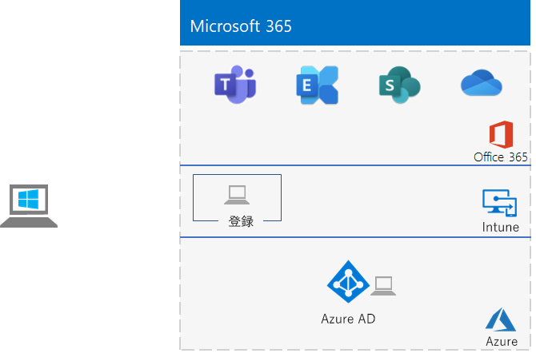
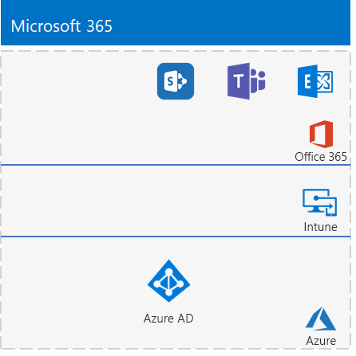

# <a name="the-lightweight-base-configuration"></a><span data-ttu-id="9f11a-103">軽量な基本構成</span><span class="sxs-lookup"><span data-stu-id="9f11a-103">The lightweight base configuration</span></span>

<span data-ttu-id="9f11a-104">この記事は、Microsoft 365 E5 サブスクリプションと、Windows 10 Enterprise を実行しているコンピューターを使用して、簡略化された環境を作成する詳細な手順を説明します。</span><span class="sxs-lookup"><span data-stu-id="9f11a-104">This article provides you with step-by-step instructions to create a simplified environment with a Microsoft 365 E5 subscription and a computer running Windows 10 Enterprise.</span></span> 



<span data-ttu-id="9f11a-106">作成された環境を使用して、[Microsoft 365 Enterprise](https://www.microsoft.com/microsoft-365/enterprise) のフィーチャーと機能をテストします。</span><span class="sxs-lookup"><span data-stu-id="9f11a-106">Use the resulting environment to test the features and functionality of [Microsoft 365 Enterprise](https://www.microsoft.com/microsoft-365/enterprise).</span></span>


  
> [!TIP]
> <span data-ttu-id="9f11a-108">[ここ](https://aka.ms/m365etlgstack)をクリックして、Microsoft 365 Enterprise のテスト ラボ ガイド スタックに含まれるすべての記事のビジュアル マップを確認してください。</span><span class="sxs-lookup"><span data-stu-id="9f11a-108">Click [here](https://aka.ms/m365etlgstack) for a visual map to all the articles in the Microsoft 365 Enterprise Test Lab Guide stack.</span></span>

## <a name="phase-1-create-your-office-365-e5-subscription"></a><span data-ttu-id="9f11a-109">フェーズ 1: Office 365 E5 サブスクリプションを作成する</span><span class="sxs-lookup"><span data-stu-id="9f11a-109">Phase 1: Create your Office 365 E5 subscription</span></span>

<span data-ttu-id="9f11a-110">「[Office 365 開発/テスト環境](https://docs.microsoft.com/office365/enterprise/office-365-dev-test-environment)」のフェーズ 2 とフェーズ 3 の手順に従って、Office 365 の軽量な開発/テスト環境を作成します。</span><span class="sxs-lookup"><span data-stu-id="9f11a-110">Follow the steps in Phase 2 and Phase 3 of the [Office 365 dev/test environment](https://docs.microsoft.com/office365/enterprise/office-365-dev-test-environment) to create a lightweight Office 365 dev/test environment.</span></span>

>[!Note]
><span data-ttu-id="9f11a-111">開発/テスト環境に現在お持ちの有料サブスクリプションとは別の Azure AD テナントが存在するように、Office 365 の試用版サブスクリプションを作成します。</span><span class="sxs-lookup"><span data-stu-id="9f11a-111">We have you create a trial subscription of Office 365 so that your dev/test environment has a separate Azure AD tenant from any paid subscriptions you currently have.</span></span> <span data-ttu-id="9f11a-112">このように分離することにより、運用サブスクリプションに影響を与えることなく、テスト テナントでのユーザーとグループの追加と削除が可能になります。</span><span class="sxs-lookup"><span data-stu-id="9f11a-112">This separation means you can add and remove users and groups in the test tenant without affecting your production subscriptions.</span></span>
>
  
## <a name="phase-2-add-a-microsoft-365-e5-trial-subscription"></a><span data-ttu-id="9f11a-113">フェーズ 2: Microsoft 365 E5 の試用版サブスクリプションを追加する</span><span class="sxs-lookup"><span data-stu-id="9f11a-113">Phase 2: Add a Microsoft 365 E5 trial subscription</span></span>

<span data-ttu-id="9f11a-114">このフェーズでは、Microsoft 365 E5 試用版サブスクリプションにサインアップして、Office 365 E5 試用版サブスクリプションと同じ組織に追加します。</span><span class="sxs-lookup"><span data-stu-id="9f11a-114">In this phase, you sign up for the Microsoft 365 E5 trial subscription and add it to the same organization as your Office 365 E5 trial subscription.</span></span>
  
<span data-ttu-id="9f11a-115">まず最初に、Microsoft 365 E5 試用版サブスクリプションを追加して、Microsoft 365 ライセンスを全体管理者アカウントに割り当てます。</span><span class="sxs-lookup"><span data-stu-id="9f11a-115">First, add the Microsoft 365 E5 trial subscription and assign a Microsoft 365 license to your global administrator account.</span></span>
  
1. <span data-ttu-id="9f11a-116">インターネット ブラウザーのプライベート インスタンスで、全体管理者アカウントの資格情報を使用して、Microsoft 365 管理センター ([https://admin.microsoft.com](https://admin.microsoft.com)) にサインインします。</span><span class="sxs-lookup"><span data-stu-id="9f11a-116">With a private instance of an Internet browser, sign in to the Microsoft 365 admin center at [https://admin.microsoft.com](https://admin.microsoft.com) with your global administrator account credentials.</span></span>
    
2. <span data-ttu-id="9f11a-117">**[Microsoft 365 管理センター]** ページの左側のナビゲーションで **[請求]、[サービスを購入する]** の順にクリックします。</span><span class="sxs-lookup"><span data-stu-id="9f11a-117">On the **Microsoft 365 admin center** page, in the left navigation, click **Billing > Purchase services**.</span></span>
    
3. <span data-ttu-id="9f11a-118">**[サービスを購入する]** ページで、**Microsoft 365 E5** 項目を見つけます。</span><span class="sxs-lookup"><span data-stu-id="9f11a-118">On the **Purchase services** page, find the **Microsoft 365 E5** item.</span></span> <span data-ttu-id="9f11a-119">その項目の上にマウス ポインターを移動させ、**[無料試用版を起動する]** をクリックします。</span><span class="sxs-lookup"><span data-stu-id="9f11a-119">Hover your mouse pointer over it and click **Start free trial**.</span></span>

4. <span data-ttu-id="9f11a-120">**[Microsoft 365 E5 試用版]** ページで、テキスト メッセージを受信するか電話を受けるかを選択し、電話番号を入力して、**[テキスト メッセージを送信する]** または **[電話する]** をクリックします。</span><span class="sxs-lookup"><span data-stu-id="9f11a-120">On the **Microsoft 365 E5 Trial** page, choose to receive a text or a call, enter your phone number, then click **Text me** or **Call me**.</span></span>

5. <span data-ttu-id="9f11a-121">**[注文の確認]** ページで、 **[今すぐ実行]** をクリックします。</span><span class="sxs-lookup"><span data-stu-id="9f11a-121">On the **Confirm your order** page, click **Try now**.</span></span>

6. <span data-ttu-id="9f11a-122">**[注文の受領書]** ページで、**[続行]** をクリックします。</span><span class="sxs-lookup"><span data-stu-id="9f11a-122">On the **Order receipt** page, click **Continue**.</span></span>

7. <span data-ttu-id="9f11a-123">Microsoft 365 管理センターで、**[アクティブ ユーザー]** をクリックしてから、管理者アカウントをクリックします。</span><span class="sxs-lookup"><span data-stu-id="9f11a-123">In the Microsoft 365 admin center, click **Active users**, and then your administrator account.</span></span>

8. <span data-ttu-id="9f11a-124">**[製品ライセンス]** の **[編集]** をクリックします。</span><span class="sxs-lookup"><span data-stu-id="9f11a-124">Click **Edit** for **Product licenses**.</span></span>

9. <span data-ttu-id="9f11a-125">Office 365 Enterprise E5 のライセンスをオフにして、Microsoft 365 E5 のライセンスをオンにします。</span><span class="sxs-lookup"><span data-stu-id="9f11a-125">Turn off the license for Office 365 Enterprise E5 and turn on the license for Microsoft 365 E5.</span></span>

10. <span data-ttu-id="9f11a-126">**[保存]、[閉じる]、[閉じる]** の順にクリックします。</span><span class="sxs-lookup"><span data-stu-id="9f11a-126">Click **Save > Close > Close**.</span></span>

<span data-ttu-id="9f11a-127">次に、「[Office 365 開発/テスト環境](https://docs.microsoft.com/office365/enterprise/office-365-dev-test-environment)」の***フェーズ 3 を完了している場合***は、その他のすべてのアカウント (User 2、User 3、User 4、および User 5) に前述の手順 8 から手順 11 を繰り返します。</span><span class="sxs-lookup"><span data-stu-id="9f11a-127">Next, ***if you completed Phase 3 of the*** [Office 365 dev/test environment](https://docs.microsoft.com/office365/enterprise/office-365-dev-test-environment), repeat steps 8 through 11 of the previous procedure for all of your other accounts (User 2, User 3, User 4, and User 5).</span></span>
  
> [!NOTE]
> <span data-ttu-id="9f11a-128">Microsoft 365 E5 の試用版サブスクリプションは 30 日間有効です。</span><span class="sxs-lookup"><span data-stu-id="9f11a-128">The Microsoft 365 E5 trial subscription is 30 days.</span></span> <span data-ttu-id="9f11a-129">永続的なテスト環境では、少数のライセンスを使用して、この試用版のサブスクリプションを有料サブスクリプションに変換します。</span><span class="sxs-lookup"><span data-stu-id="9f11a-129">For a permanent test environment, convert this trial subscription to a paid subscription with a small number of licenses.</span></span> 
  
<span data-ttu-id="9f11a-130">テスト環境は、次のようになっています。</span><span class="sxs-lookup"><span data-stu-id="9f11a-130">Your test environment now has:</span></span>
  
- <span data-ttu-id="9f11a-131">Microsoft 365 E5 の試用版サブスクリプション。</span><span class="sxs-lookup"><span data-stu-id="9f11a-131">A Microsoft 365 E5 trial subscription.</span></span>
- <span data-ttu-id="9f11a-132">すべての適切なユーザー アカウント (全体管理者のみまたは 5 つすべてのユーザー アカウントのどちらか) が、Microsoft 365 E5 を使用できるようになっている。</span><span class="sxs-lookup"><span data-stu-id="9f11a-132">All your appropriate user accounts (either just the global administrator or all five user accounts) are enabled to use Microsoft 365 E5.</span></span>
    
<span data-ttu-id="9f11a-133">図 1 は、Office 365 と Enterprise Security + Management (EMS) の両方を含む Microsoft 365 E5 を追加した構成です。</span><span class="sxs-lookup"><span data-stu-id="9f11a-133">Figure 1 shows your resulting configuration, which adds Microsoft 365 E5, which includes both Office 365 and Enterprise Security + Management (EMS).</span></span>
  
<span data-ttu-id="9f11a-134">**図 1: Microsoft 365 試用版サブスクリプションを追加**</span><span class="sxs-lookup"><span data-stu-id="9f11a-134">**Figure 1: Adding the Microsoft 365 trial subscription**</span></span>


  
## <a name="phase-3-create-a-windows-10-enterprise-computer"></a><span data-ttu-id="9f11a-136">フェーズ 3: Windows 10 Enterprise コンピューターを作成する</span><span class="sxs-lookup"><span data-stu-id="9f11a-136">Phase 3: Create a Windows 10 Enterprise computer</span></span>

<span data-ttu-id="9f11a-137">このフェーズでは、物理コンピューター、仮想マシン、Azure 仮想マシンのいずれかとして Windows 10 Enterprise を実行するスタンドアロン コンピューターを作成します。</span><span class="sxs-lookup"><span data-stu-id="9f11a-137">In this phase, you create a standalone computer running Windows 10 Enterprise as either a physical computer, a virtual machine, or an Azure virtual machine.</span></span>
  
### <a name="physical-computer"></a><span data-ttu-id="9f11a-138">物理コンピューター</span><span class="sxs-lookup"><span data-stu-id="9f11a-138">Physical computer</span></span>

<span data-ttu-id="9f11a-p104">パーソナル コンピューターを入手し、Windows 10 Enterprise をインストールします。Windows 10 Enterprise 試用版は、[ここ](https://www.microsoft.com/evalcenter/evaluate-windows-10-enterprise)からダウンロードできます。</span><span class="sxs-lookup"><span data-stu-id="9f11a-p104">Obtain a personal computer and install Windows 10 Enterprise on it. You can download the Windows 10 Enterprise trial [here](https://www.microsoft.com/evalcenter/evaluate-windows-10-enterprise).</span></span>
  
### <a name="virtual-machine"></a><span data-ttu-id="9f11a-141">仮想マシン</span><span class="sxs-lookup"><span data-stu-id="9f11a-141">Virtual machine</span></span>

<span data-ttu-id="9f11a-p105">任意のハイパーバイザーを使用して仮想マシンを作成し、そのマシンに Windows 10 Enterprise をインストールします。Windows 10 Enterprise 試用版は、[ここ](https://www.microsoft.com/evalcenter/evaluate-windows-10-enterprise)からダウンロードできます。</span><span class="sxs-lookup"><span data-stu-id="9f11a-p105">Create a virtual machine using the hypervisor of your choice and install Windows 10 Enterprise on it. You can download the Windows 10 Enterprise trial [here](https://www.microsoft.com/evalcenter/evaluate-windows-10-enterprise).</span></span>
  
### <a name="virtual-machine-in-azure"></a><span data-ttu-id="9f11a-144">Azure での仮想マシン</span><span class="sxs-lookup"><span data-stu-id="9f11a-144">Virtual machine in Azure</span></span>

<span data-ttu-id="9f11a-p106">Microsoft Azure で Windows 10 の仮想マシンを作成するには、***Visual Studio ベースのサブスクリプションが必要***です。このサブスクリプションにより、Windows 10 Enterprise のイメージにアクセスできます。試用版や有料のサブスクリプションなど、その他の種類の Azure サブスクリプションでは、このイメージにアクセスできません。最新情報については、「[Azure で Windows クライアントを開発/テスト シナリオに使用する](https://docs.microsoft.com/azure/virtual-machines/windows/client-images)」を参照してください。</span><span class="sxs-lookup"><span data-stu-id="9f11a-p106">To create a Windows 10 virtual machine in Microsoft Azure, ***you must have a Visual Studio-based subscription***, which has access to the image for Windows 10 Enterprise. Other types of Azure subscriptions, such as trial and paid subscriptions, do not have access to this image. For the latest information, see [Use Windows client in Azure for dev/test scenarios](https://docs.microsoft.com/azure/virtual-machines/windows/client-images).</span></span>
  
> [!NOTE]
> <span data-ttu-id="9f11a-p107">次のコマンド セットは、最新バージョンの Azure PowerShell を使用します。「[Azure PowerShell の概要](https://docs.microsoft.com/powershell/azureps-cmdlets-docs/)」を参照してください。このコマンド セットにより、WIN10 という名前の Windows 10 Enterprise の仮想マシンと、このマシンに必要なすべてのインフラストラクチャをビルドします。これには、リソース グループ、ストレージ アカウント、仮想ネットワークが含まれます。Azure インフラストラクチャ サービスを既に使い慣れている場合は、これらの手順は展開済みのインフラストラクチャに合わせて、実行してください。</span><span class="sxs-lookup"><span data-stu-id="9f11a-p107">The following command sets use the latest version of Azure PowerShell. See [Get started with Azure PowerShell cmdlets](https://docs.microsoft.com/powershell/azureps-cmdlets-docs/). These command sets build a Windows 10 Enterprise virtual machine named WIN10 and all of its required infrastructure, including a resource group, a storage account, and a virtual network. If you are already familiar with Azure infrastructure services, please adapt these instructions to suit your currently deployed infrastructure.</span></span> 
  
<span data-ttu-id="9f11a-152">最初に、Microsoft PowerShell プロンプトを起動します。</span><span class="sxs-lookup"><span data-stu-id="9f11a-152">First, start a Microsoft PowerShell prompt.</span></span>
  
<span data-ttu-id="9f11a-153">次のコマンドを使用して Azure アカウントにログインします。</span><span class="sxs-lookup"><span data-stu-id="9f11a-153">Sign in to your Azure account with the following command.</span></span>
  
```
Connect-AzAccount
```

<span data-ttu-id="9f11a-154">次のコマンドを使用して、サブスクリプションの名前を取得します。</span><span class="sxs-lookup"><span data-stu-id="9f11a-154">Get your subscription name using the following command.</span></span>
  
```
Get-AzSubscription | Sort Name | Select Name
```

<span data-ttu-id="9f11a-p108">Azure サブスクリプションを設定します。二重引用符内のすべて (「\<」と「>」の文字を含む) を正しい名前に置き換えます。</span><span class="sxs-lookup"><span data-stu-id="9f11a-p108">Set your Azure subscription. Replace everything within the quotes, including the \< and > characters, with the correct name.</span></span>
  
```
$subscr="<subscription name>"
Get-AzSubscription -SubscriptionName $subscr | Select-AzSubscription
```

<span data-ttu-id="9f11a-p109">次に、新しいリソース グループを作成します。一意のリソース グループ名を決定するには、このコマンドを使用して既存のリソース グループを一覧表示します。</span><span class="sxs-lookup"><span data-stu-id="9f11a-p109">Next, create a new resource group. To determine a unique resource group name, use this command to list your existing resource groups.</span></span>
  
```
Get-AzResourceGroup | Sort ResourceGroupName | Select ResourceGroupName
```

<span data-ttu-id="9f11a-p110">これらのコマンドを使用して、新しいリソース グループを作成します。二重引用符内のすべて (「\<」と「>」の文字を含む) を正しい名前に置き換えます。</span><span class="sxs-lookup"><span data-stu-id="9f11a-p110">Create your new resource group with these commands. Replace everything within the quotes, including the \< and > characters, with the correct names.</span></span>
  
```
$rgName="<resource group name>"
$locName="<location name, such as West US>"
New-AzResourceGroup -Name $rgName -Location $locName
```

<span data-ttu-id="9f11a-p111">次に、これらのコマンドを使用して新しい仮想ネットワークと WIN10 仮想マシンを作成します。ダイアログ ボックスが表示されたら、WIN10 の名前とローカル管理者アカウントのパスワードを指定し、これらを安全な場所に保存します。</span><span class="sxs-lookup"><span data-stu-id="9f11a-p111">Next, you create a new virtual network and the WIN10 virtual machine with these commands. When prompted, provide the name and password of the local administrator account for WIN10 and store these in a secure location.</span></span>
  
```
$corpnetSubnet=New-AzVirtualNetworkSubnetConfig -Name Corpnet -AddressPrefix 10.0.0.0/24
New-AzVirtualNetwork -Name "M365Ent-TestLab" -ResourceGroupName $rgName -Location $locName -AddressPrefix 10.0.0.0/8 -Subnet $corpnetSubnet
$rule1=New-AzNetworkSecurityRuleConfig -Name "RDPTraffic" -Description "Allow RDP to all VMs on the subnet" -Access Allow -Protocol Tcp -Direction Inbound -Priority 100 -SourceAddressPrefix Internet -SourcePortRange * -DestinationAddressPrefix * -DestinationPortRange 3389
New-AzNetworkSecurityGroup -Name Corpnet -ResourceGroupName $rgName -Location $locName -SecurityRules $rule1
$vnet=Get-AzVirtualNetwork -ResourceGroupName $rgName -Name "M365Ent-TestLab"
$nsg=Get-AzNetworkSecurityGroup -Name Corpnet -ResourceGroupName $rgName
Set-AzVirtualNetworkSubnetConfig -VirtualNetwork $vnet -Name Corpnet -AddressPrefix "10.0.0.0/24" -NetworkSecurityGroup $nsg
$vnet | Set-AzVirtualNetwork
$pip=New-AzPublicIpAddress -Name WIN10-PIP -ResourceGroupName $rgName -Location $locName -AllocationMethod Dynamic
$nic=New-AzNetworkInterface -Name WIN10-NIC -ResourceGroupName $rgName -Location $locName -SubnetId $vnet.Subnets[0].Id -PublicIpAddressId $pip.Id
$vm=New-AzVMConfig -VMName WIN10 -VMSize Standard_D1_V2
$cred=Get-Credential -Message "Type the name and password of the local administrator account for WIN10."
$vm=Set-AzVMOperatingSystem -VM $vm -Windows -ComputerName WIN10 -Credential $cred -ProvisionVMAgent -EnableAutoUpdate
$vm=Set-AzVMSourceImage -VM $vm -PublisherName MicrosoftWindowsDesktop -Offer Windows-10 -Skus RS3-Pro -Version "latest"
$vm=Add-AzVMNetworkInterface -VM $vm -Id $nic.Id
$vm=Set-AzVMOSDisk -VM $vm -Name WIN10-TestLab-OSDisk -DiskSizeInGB 128 -CreateOption FromImage
New-AzVM -ResourceGroupName $rgName -Location $locName -VM $vm
```

## <a name="phase-4-join-your-windows-10-computer-to-azure-ad"></a><span data-ttu-id="9f11a-163">フェーズ 4: Windows 10 のコンピューターを Azure AD に参加させる</span><span class="sxs-lookup"><span data-stu-id="9f11a-163">Phase 4: Join your Windows 10 computer to Azure AD</span></span>

<span data-ttu-id="9f11a-164">Windows 10 Enterprise の物理マシンまたは仮想マシンの作成後、ローカル管理者アカウントでサインインします。</span><span class="sxs-lookup"><span data-stu-id="9f11a-164">After the physical or virtual machine with Windows 10 Enterprise is created, sign in with a local administrator account.</span></span>
  
> [!NOTE]
> <span data-ttu-id="9f11a-165">Azure の仮想マシンの場合は、[この手順](https://docs.microsoft.com/azure/virtual-machines/windows/connect-logon)に従います。</span><span class="sxs-lookup"><span data-stu-id="9f11a-165">For a virtual machine in Azure, connect to it using [these instructions](https://docs.microsoft.com/azure/virtual-machines/windows/connect-logon).</span></span>
  
<span data-ttu-id="9f11a-166">次に、WIN10 コンピューターを Microsoft 365 E5 サブスクリプションの Azure AD テナントに参加させます。</span><span class="sxs-lookup"><span data-stu-id="9f11a-166">Next, join the WIN10 computer to the Azure AD tenant of your Microsoft 365 E5 subscription.</span></span>
  
1. <span data-ttu-id="9f11a-167">WIN10 コンピューターのデスクトップで、**[スタート] > [設定] > [アカウント] > [職場または学校にアクセスする] > [接続]** の順にクリックします。</span><span class="sxs-lookup"><span data-stu-id="9f11a-167">At the desktop of the WIN10 computer, click **Start > Settings > Accounts > Access work or school > Connect**.</span></span>
    
2. <span data-ttu-id="9f11a-168">**[職場または学校アカウントの設定]** ダイアログ ボックスで、**[このデバイスを Azure Active Directory に参加させる]** をクリックします。</span><span class="sxs-lookup"><span data-stu-id="9f11a-168">In the **Set up a work or school account** dialog box, click **Join this device to Azure Active Directory**.</span></span>
    
3. <span data-ttu-id="9f11a-169">**[職場または学校アカウント]** に Microsoft 365 E5 サブスクリプションの全体管理者のアカウント名を入力して、**[次へ]** をクリックします。</span><span class="sxs-lookup"><span data-stu-id="9f11a-169">In **Work or school account**, type the global administrator account name of your Microsoft 365 E5 subscription, and then click **Next**.</span></span>
    
4. <span data-ttu-id="9f11a-170">**[パスワードの入力]** に全体管理者アカウントのパスワードを入力して、**[サインイン]** をクリックします。</span><span class="sxs-lookup"><span data-stu-id="9f11a-170">In **Enter password**, type the password for your global administrator account, and then click **Sign in**.</span></span>
    
5. <span data-ttu-id="9f11a-171">この組織で合っているか確認するダイアログ ボックスが表示されたら、**[参加]** をクリックしてから **[完了]** をクリックします。</span><span class="sxs-lookup"><span data-stu-id="9f11a-171">When prompted to make sure this is your organization, click **Join**, and then click **Done**.</span></span>
    
6. <span data-ttu-id="9f11a-172">[設定] ウィンドウを閉じます。</span><span class="sxs-lookup"><span data-stu-id="9f11a-172">Close the settings window.</span></span>
    
<span data-ttu-id="9f11a-173">次に、WIN10 コンピューターに Office 365 ProPlus をインストールします。</span><span class="sxs-lookup"><span data-stu-id="9f11a-173">Next, install Office 365 ProPlus on the WIN10 computer.</span></span>
  
1. <span data-ttu-id="9f11a-174">Microsoft Edge ブラウザーを開いて、グローバル管理者アカウントの認証資格情報を使用して、Office ポータルにサインインします。</span><span class="sxs-lookup"><span data-stu-id="9f11a-174">Open the Microsoft Edge browser and sign in to the Office portal with your global administrator account credentials.</span></span> <span data-ttu-id="9f11a-175">詳細については、「[一般法人向け Office 365 にサインインする場所](https://support.office.com/Article/Where-to-sign-in-to-Office-365-e9eb7d51-5430-4929-91ab-6157c5a050b4)」を参照してください。</span><span class="sxs-lookup"><span data-stu-id="9f11a-175">For help, see [Where to sign in to Office 365](https://support.office.com/Article/Where-to-sign-in-to-Office-365-e9eb7d51-5430-4929-91ab-6157c5a050b4).</span></span>
    
2. <span data-ttu-id="9f11a-176">**[Microsoft Office Home]** タブで、**[Office のインストール]** をクリックします。</span><span class="sxs-lookup"><span data-stu-id="9f11a-176">On the **Microsoft Office Home** tab, click **Install Office**.</span></span>
    
3. <span data-ttu-id="9f11a-177">操作内容を確認するダイアログ ボックスが表示されたら、**[実行]** をクリックし、**[ユーザー アカウント制御]** の **[はい]** をクリックします。</span><span class="sxs-lookup"><span data-stu-id="9f11a-177">When prompted with what to do, click **Run**, and then click **Yes** for **User Account Control**.</span></span>
    
4. <span data-ttu-id="9f11a-p113">Office のインストールが完了するまで待ちます。**[準備が完了しました]** が表示されたら、**[閉じる]** を 2 回クリックします。</span><span class="sxs-lookup"><span data-stu-id="9f11a-p113">Wait for Office to complete its installation. When you see **You're all set!**, click **Close** twice.</span></span>
    
<span data-ttu-id="9f11a-180">図 3 に、構成される環境を示します。この環境には、次の WIN10 コンピューターが含まれています。</span><span class="sxs-lookup"><span data-stu-id="9f11a-180">Figure 3 shows your resulting environment, which includes the WIN10 computer that has:</span></span>

- <span data-ttu-id="9f11a-181">Microsoft 365 E5 サブスクリプションの Azure AD テナントに参加している。</span><span class="sxs-lookup"><span data-stu-id="9f11a-181">Joined the Azure AD tenant of your Microsoft 365 E5 subscription.</span></span>
- <span data-ttu-id="9f11a-182">Microsoft Intune (EMS) で Azure AD デバイスとして登録されている。</span><span class="sxs-lookup"><span data-stu-id="9f11a-182">Enrolled as an Azure AD device in Microsoft Intune (EMS).</span></span>
- <span data-ttu-id="9f11a-183">Office 365 ProPlus がインストールされている。</span><span class="sxs-lookup"><span data-stu-id="9f11a-183">Has Office 365 ProPlus installed.</span></span>
  
<span data-ttu-id="9f11a-184">**図 2: Microsoft 365 テスト環境の最終構成**</span><span class="sxs-lookup"><span data-stu-id="9f11a-184">**Figure 2: The final configuration of the Microsoft 365 test environment**</span></span>


  
<span data-ttu-id="9f11a-186">これで、[Microsoft 365 Enterprise](https://www.microsoft.com/microsoft-365/enterprise) の追加機能を試せるようになりました。</span><span class="sxs-lookup"><span data-stu-id="9f11a-186">You are now ready to experiment with additional features of [Microsoft 365 Enterprise](https://www.microsoft.com/microsoft-365/enterprise).</span></span>
  
## <a name="next-steps"></a><span data-ttu-id="9f11a-187">次の手順</span><span class="sxs-lookup"><span data-stu-id="9f11a-187">Next steps</span></span>

<span data-ttu-id="9f11a-188">こうした追加のテスト ラボ ガイドについて説明します。</span><span class="sxs-lookup"><span data-stu-id="9f11a-188">Explore these additional sets of Test Lab Guides:</span></span>
  
- [<span data-ttu-id="9f11a-189">ID</span><span class="sxs-lookup"><span data-stu-id="9f11a-189">Identity</span></span>](m365-enterprise-test-lab-guides.md#identity)
- [<span data-ttu-id="9f11a-190">モバイル デバイス管理</span><span class="sxs-lookup"><span data-stu-id="9f11a-190">Mobile device management</span></span>](m365-enterprise-test-lab-guides.md#mobile-device-management)
- [<span data-ttu-id="9f11a-191">情報保護</span><span class="sxs-lookup"><span data-stu-id="9f11a-191">Information protection</span></span>](m365-enterprise-test-lab-guides.md#information-protection)
   

## <a name="see-also"></a><span data-ttu-id="9f11a-192">関連項目</span><span class="sxs-lookup"><span data-stu-id="9f11a-192">See also</span></span>

[<span data-ttu-id="9f11a-193">Microsoft 365 Enterprise のテスト ラボ ガイド</span><span class="sxs-lookup"><span data-stu-id="9f11a-193">Microsoft 365 Enterprise Test Lab Guides</span></span>](m365-enterprise-test-lab-guides.md)

[<span data-ttu-id="9f11a-194">Microsoft 365 Enterprise を展開する</span><span class="sxs-lookup"><span data-stu-id="9f11a-194">Deploy Microsoft 365 Enterprise</span></span>](deploy-microsoft-365-enterprise.md)

[<span data-ttu-id="9f11a-195">Microsoft 365 Enterprise のドキュメントとリソース</span><span class="sxs-lookup"><span data-stu-id="9f11a-195">Microsoft 365 Enterprise documentation</span></span>](https://docs.microsoft.com/microsoft-365-enterprise/)
