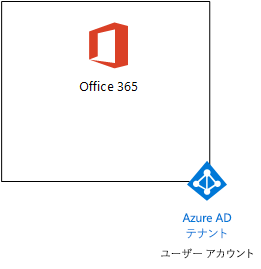

# <a name="the-lightweight-base-configuration"></a>軽量な基本構成

この記事は、Office 365 E5、Enterprise Mobility + Security (EMS) E5、Windows 10 Enterprise を実行しているコンピューターなどの簡略化された環境を作成する詳細な手順を説明します。 


作成された環境を使用して、[Microsoft 365 Enterprise](https://www.microsoft.com/microsoft-365/enterprise) のフィーチャーと機能をテストします。


  
> [!TIP]
> [ここ](https://aka.ms/m365etlgstack)をクリックして、Microsoft 365 Enterprise のテスト ラボ ガイド スタックに含まれるすべての記事のビジュアル マップを確認してください。

## <a name="phase-1-create-your-office-365-e5-subscription"></a>フェーズ 1: Office 365 E5 サブスクリプションを作成する

「[Office 365 開発/テスト環境](https://docs.microsoft.com/office365/enterprise/office-365-dev-test-environment)」のフェーズ 2 とフェーズ 3 の手順に従って、図 1 に示すように、Office 365 の軽量な開発/テスト環境を作成します。
  
**図 1: Azure Active Directory (AD) のテナントとユーザー アカウントの Office 365 E5 サブスクリプション**



> [!NOTE]
> Office 365 E5 試用版サブスクリプションの試用期間は 30 日間です。この試用期間は簡単に 60 日間にまで延長できます。永続的なテスト環境については、少数のライセンスが付いた新しい有料サブスクリプションを作成してください。 
  
## <a name="phase-2-add-ems"></a>フェーズ 2: EMS を追加する

このフェーズでは、EMS E5 試用版サブスクリプションにサインアップして、Office 365 E5 試用版サブスクリプションと同じ組織に追加します。
  
最初に、EMS E5 試用版サブスクリプションを追加して、EMS ライセンスを全体管理者アカウントに割り当てます。
  
1. インターネット ブラウザーのプライベート インスタンスで、全体管理者アカウントの資格情報を使用して、Office 365 ポータルにサインインします。ヘルプについては、「[Office 365 にサインインする場所](https://support.office.com/Article/Where-to-sign-in-to-Office-365-e9eb7d51-5430-4929-91ab-6157c5a050b4)」を参照してください。
    
2. **[管理]** タイルをクリックします。
    
3. ブラウザーの **[Office 管理センター]** タブの左側のナビゲーションで **[請求] > [サービスを購入する]** の順にクリックします。
    
4. **[サービスを購入]** ページで、 **[Enterprise Mobility + Security E5]** 項目を探します。その項目の上にマウス ポインターを移動させ、 **[無料試用版を起動する]** をクリックします。
    
5. **[注文の確認]** ページで、 **[今すぐ実行]** をクリックします。
    
6. **[注文の受領書]** ページで、**[続行]** をクリックします。
    
7. ブラウザーの **[Office 365 管理センター]** タブの左側のナビゲーションで **[ユーザー] > [アクティブなユーザー]** の順にクリックします。
    
8. 全体管理者アカウントをクリックしてから、 **[製品ライセンス]** で **[編集]** をクリックします。
    
9. **[製品ライセンス]** ウィンドウで、 **Enterprise Mobility + Security E5** の製品ライセンスを **[オン]** にして、 **[保存]** をクリックしてから、 **[閉じる]** を 2 回クリックします。
    
> [!NOTE]
> Enterprise Mobility + Security E5 試用版サブスクリプションの試用期間は 90 日間です。永続的なテスト環境では、少数のライセンスを使用して新しい有料サブスクリプションを作成します。 
  
 「[Office 365 開発/テスト環境](https://docs.microsoft.com/office365/enterprise/office-365-dev-test-environment)」の***フェーズ 3 を完了している場合***は、その他のすべてのアカウント (User 2、User 3、User 4、および User 5) に前述の手順 8 と手順 9 を繰り返します。
  
テスト環境は、次のようになっています。
  
- Office 365 E5 Enterprise と EMS E5 の試用版サブスクリプションが、ユーザー アカウントの一覧と同じ Azure AD テナントを共有している。
- すべての適切なアカウント (全体管理者のみまたは 5 つすべてのユーザー アカウントのどちらか) が、Office 365 E5 と EMS E5 を使用できるようになっている。
    
図 2 は、EMS が追加された結果的な構成を示しています。
  
**図 2: EMS 試用版サブスクリプションを追加**


  
## <a name="phase-3-create-a-windows-10-enterprise-computer"></a>フェーズ 3: Windows 10 Enterprise コンピューターを作成する

このフェーズでは、物理コンピューター、仮想マシン、Azure 仮想マシンのいずれかとして Windows 10 Enterprise を実行するスタンドアロン コンピューターを作成します。
  
### <a name="physical-computer"></a>物理コンピューター

パーソナル コンピューターを入手し、Windows 10 Enterprise をインストールします。Windows 10 Enterprise 試用版は、[ここ](https://www.microsoft.com/evalcenter/evaluate-windows-10-enterprise)からダウンロードできます。
  
### <a name="virtual-machine"></a>仮想マシン

任意のハイパーバイザーを使用して仮想マシンを作成し、そのマシンに Windows 10 Enterprise をインストールします。Windows 10 Enterprise 試用版は、[ここ](https://www.microsoft.com/evalcenter/evaluate-windows-10-enterprise)からダウンロードできます。
  
### <a name="virtual-machine-in-azure"></a>Azure での仮想マシン

Microsoft Azure で Windows 10 の仮想マシンを作成するには、***Visual Studio ベースのサブスクリプションが必要***です。このサブスクリプションにより、Windows 10 Enterprise のイメージにアクセスできます。試用版や有料のサブスクリプションなど、その他の種類の Azure サブスクリプションでは、このイメージにアクセスできません。最新情報については、「[Azure で Windows クライアントを開発/テスト シナリオに使用する](https://docs.microsoft.com/azure/virtual-machines/windows/client-images)」を参照してください。
  
> [!NOTE]
> 次のコマンド セットは、最新バージョンの Azure PowerShell を使用します。「[Azure PowerShell の概要](https://docs.microsoft.com/powershell/azureps-cmdlets-docs/)」を参照してください。このコマンド セットにより、WIN10 という名前の Windows 10 Enterprise の仮想マシンと、このマシンに必要なすべてのインフラストラクチャをビルドします。これには、リソース グループ、ストレージ アカウント、仮想ネットワークが含まれます。Azure インフラストラクチャ サービスを既に使い慣れている場合は、これらの手順は展開済みのインフラストラクチャに合わせて、実行してください。 
  
最初に、Microsoft PowerShell プロンプトを起動します。
  
次のコマンドを使用して Azure アカウントにログインします。
  
```
Login-AzureRMAccount
```

次のコマンドを使用して、サブスクリプションの名前を取得します。
  
```
Get-AzureRMSubscription | Sort Name | Select Name
```

Azure サブスクリプションを設定します。二重引用符内のすべて (「\<」と「>」の文字を含む) を正しい名前に置き換えます。
  
```
$subscr="<subscription name>"
Get-AzureRmSubscription -SubscriptionName $subscr | Select-AzureRmSubscription
```

次に、新しいリソース グループを作成します。一意のリソース グループ名を決定するには、このコマンドを使用して既存のリソース グループを一覧表示します。
  
```
Get-AzureRMResourceGroup | Sort ResourceGroupName | Select ResourceGroupName
```

これらのコマンドを使用して、新しいリソース グループを作成します。二重引用符内のすべて (「\<」と「>」の文字を含む) を正しい名前に置き換えます。
  
```
$rgName="<resource group name>"
$locName="<location name, such as West US>"
New-AzureRMResourceGroup -Name $rgName -Location $locName
```

次に、これらのコマンドを使用して新しい仮想ネットワークと WIN10 仮想マシンを作成します。ダイアログ ボックスが表示されたら、WIN10 の名前とローカル管理者アカウントのパスワードを指定し、これらを安全な場所に保存します。
  
```
$corpnetSubnet=New-AzureRMVirtualNetworkSubnetConfig -Name Corpnet -AddressPrefix 10.0.0.0/24
New-AzureRMVirtualNetwork -Name "M365Ent-TestLab" -ResourceGroupName $rgName -Location $locName -AddressPrefix 10.0.0.0/8 -Subnet $corpnetSubnet
$rule1=New-AzureRMNetworkSecurityRuleConfig -Name "RDPTraffic" -Description "Allow RDP to all VMs on the subnet" -Access Allow -Protocol Tcp -Direction Inbound -Priority 100 -SourceAddressPrefix Internet -SourcePortRange * -DestinationAddressPrefix * -DestinationPortRange 3389
New-AzureRMNetworkSecurityGroup -Name Corpnet -ResourceGroupName $rgName -Location $locName -SecurityRules $rule1
$vnet=Get-AzureRMVirtualNetwork -ResourceGroupName $rgName -Name "M365Ent-TestLab"
$nsg=Get-AzureRMNetworkSecurityGroup -Name Corpnet -ResourceGroupName $rgName
Set-AzureRMVirtualNetworkSubnetConfig -VirtualNetwork $vnet -Name Corpnet -AddressPrefix "10.0.0.0/24" -NetworkSecurityGroup $nsg
$pip=New-AzureRMPublicIpAddress -Name WIN10-PIP -ResourceGroupName $rgName -Location $locName -AllocationMethod Dynamic
$nic=New-AzureRMNetworkInterface -Name WIN10-NIC -ResourceGroupName $rgName -Location $locName -SubnetId $vnet.Subnets[0].Id -PublicIpAddressId $pip.Id
$vm=New-AzureRMVMConfig -VMName WIN10 -VMSize Standard_D1_V2
$cred=Get-Credential -Message "Type the name and password of the local administrator account for WIN10."
$vm=Set-AzureRMVMOperatingSystem -VM $vm -Windows -ComputerName WIN10 -Credential $cred -ProvisionVMAgent -EnableAutoUpdate
$vm=Set-AzureRMVMSourceImage -VM $vm -PublisherName MicrosoftWindowsDesktop -Offer Windows-10 -Skus RS3-Pro -Version "latest"
$vm=Add-AzureRMVMNetworkInterface -VM $vm -Id $nic.Id
$vm=Set-AzureRmVMOSDisk -VM $vm -Name WIN10-TestLab-OSDisk -DiskSizeInGB 128 -CreateOption FromImage -StorageAccountType "Standard_LRS"
New-AzureRMVM -ResourceGroupName $rgName -Location $locName -VM $vm
```

## <a name="phase-4-join-your-windows-10-computer-to-azure-ad"></a>フェーズ 4: Windows 10 のコンピューターを Azure AD に参加させる

Windows 10 Enterprise の物理マシンまたは仮想マシンの作成後、ローカル管理者アカウントでサインインします。
  
> [!NOTE]
> Azure の仮想マシンの場合は、[この手順](https://docs.microsoft.com/azure/virtual-machines/windows/connect-logon)に従います。
  
次に、WIN10 コンピューターを Office 365 と EMS のサブスクリプションの Azure AD テナントに参加させます。
  
1. WIN10 コンピューターのデスクトップで、**[スタート] > [設定] > [アカウント] > [職場または学校にアクセスする] > [接続]** の順にクリックします。
    
2. **[職場または学校アカウントの設定]** ダイアログ ボックスで、**[このデバイスを Azure Active Directory に参加させる]** をクリックします。
    
3. **[職場または学校アカウント]** に Office 365 サブスクリプションの全体管理者のアカウント名を入力して、**[次へ]** をクリックします。
    
4. **[パスワードの入力]** に全体管理者アカウントのパスワードを入力して、**[サインイン]** をクリックします。
    
5. この組織で合っているか確認するダイアログ ボックスが表示されたら、**[参加]** をクリックしてから **[完了]** をクリックします。
    
6. [設定] ウィンドウを閉じます。
    
次に、WIN10 コンピューターに Office 365 ProPlus をインストールします。
  
1. Microsoft Edge ブラウザーを開いて、全体管理者アカウントの資格情報を使用して、Office 365 ポータルにサインインします。ヘルプについては、「[Office 365 にサインインする場所](https://support.office.com/Article/Where-to-sign-in-to-Office-365-e9eb7d51-5430-4929-91ab-6157c5a050b4)」を参照してください。
    
2. **[Microsoft Office Home]** タブで、**[Office 2016 のインストール]** をクリックします。
    
3. 操作内容を確認するダイアログ ボックスが表示されたら、**[実行]** をクリックし、**[ユーザー アカウント制御]** の **[はい]** をクリックします。
    
4. Office のインストールが完了するまで待ちます。**[準備が完了しました]** が表示されたら、**[閉じる]** を 2 回クリックします。
    
図 3 に、構成される環境を示します。この環境には、次の WIN10 コンピューターが含まれています。

- Office 365 および EMS サブスクリプションの Azure AD テナントに参加している
- Intune (EMS) で Azure AD デバイスとして登録されている。
- Office 365 ProPlus がインストールされている。
  
**図 3: Microsoft 365 テスト環境の最終構成**


  
これで、[Microsoft 365 Enterprise](https://www.microsoft.com/microsoft-365/enterprise) の追加機能を試せるようになりました。
  
## <a name="next-steps"></a>次の手順

こうした追加のテスト ラボ ガイドについて説明します。
  
- [ID](m365-enterprise-test-lab-guides.md#identity)
- [モバイル デバイス管理](m365-enterprise-test-lab-guides.md#mobile-device-management)
- [情報保護](m365-enterprise-test-lab-guides.md#information-protection)
   

## <a name="see-also"></a>関連項目

[Microsoft 365 Enterprise のテスト ラボ ガイド](m365-enterprise-test-lab-guides.md)

[Microsoft 365 Enterprise を展開する](deploy-microsoft-365-enterprise.md)

[Microsoft 365 Enterprise のドキュメントとリソース](https://docs.microsoft.com/microsoft-365-enterprise/)
