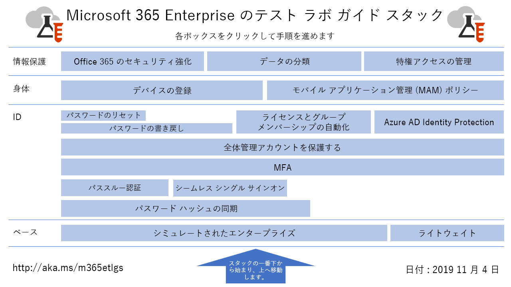

# Microsoft 365 Enterprise のテスト ラボ ガイド

*これは、Microsoft 365 Enterprise および Office 365 Enterprise の両方に適用されます。*

テスト ラボ ガイド (TLG) を活用すれば、Microsoft 製品の概要をいち早く把握することができます。テスト ラボ ガイドは、簡単ではあるものの代表的なテスト環境を構成する方法を説明しています。これらの環境は、試用期間または有料サブスクリプションの期間内に、デモ、カスタマイズ、概念の複合的な証拠の作成に使用できます。

TLG はモジュール式になるように設計されています。 これらは相互に構築され、学習またはテストの構成のニーズにより密接に一致する複数の構成を作成します。 "自分でビルドして動作する" ハンズオン エクスペリエンスは、新しい製品またはシナリオのデプロイ要件を理解するのに役立ち、運用環境でのホスティングをより適切に計画できます。

TLG を使用して代表的な環境を作成し、開発/テスト環境とも呼ばれるアプリケーションを開発およびテストすることもできます。
  

エンタープライズ テスト ラボ ガイド スタックのMicrosoft 365のすべての記事に視覚的にマップするには、次の図を展開するか、[エンタープライズ テスト ラボ ガイド スタックのMicrosoft 365](../downloads/Microsoft365EnterpriseTLGStack.pdf)に移動します。

## 基本構成

まず、[エンタープライズ向けのMicrosoft 365用の](/microsoft-365-enterprise/)テスト環境を作成します。 2 種類の基本構成を作成できます。

- [軽量ベース構成](lightweight-base-configuration-microsoft-365-enterprise.md) - これは、オンプレミス コンポーネントを含まないクラウド専用環境で、エンタープライズ機能と機能のMicrosoft 365を構成してデモンストレーションする場合に使用します。

- [シミュレートされたエンタープライズ ベースの構成](simulated-ent-base-configuration-microsoft-365-enterprise.md) - これは、Active Directory Domain Services (AD DS) ドメインなどのオンプレミス コンポーネントを使用するハイブリッド クラウド環境で、エンタープライズ機能と機能のMicrosoft 365を構成してデモンストレーションする場合に使用します。

試用版または運用テスト環境に Microsoft 365 E5 ライセンスを追加することなく、Office 365 E5 のテスト環境を作成することもできます。
    
## ID

ID に関連する機能や能力のデモンストレーションは、以下を参照してください:

- [パスワード ハッシュ同期](password-hash-sync-m365-ent-test-environment.md)
  
   AD DS ドメイン コントローラーからのパスワード ハッシュによるディレクトリ同期を有効にしてテストします。

- [パススルー認証](pass-through-auth-m365-ent-test-environment.md)
  
   AD DS ドメイン コントローラーへのパススルー認証を有効にしてテストします。

- [フェデレーション認証](federated-identity-for-your-microsoft-365-dev-test-environment.md)
  
   AD DS ドメイン コントローラーへのフェデレーション認証を有効にしてテストします。

- [Azure AD シームレス シングル サインオン](single-sign-on-m365-ent-test-environment.md)
  
   AD DS ドメイン コントローラー Azure ADシームレス シングル サインオン (シームレス SSO) を有効にしてテストします。

- [多要素認証](multi-factor-authentication-microsoft-365-test-environment.md)
  
   特定のユーザー アカウントで、スマートフォンによる多要素認証を有効にしてテストします。

- [全体管理者アカウントを保護する](protect-global-administrator-accounts-microsoft-365-test-environment.md)

   条件付きアクセス ポリシーを使用してグローバル管理者アカウントをロックする。

- [パスワード ライトバック](password-writeback-m365-ent-test-environment.md)

   パスワードの書き戻しは、Azure AD から AD DS ユーザー アカウントのパスワードを変更する場合に使用します。

- [パスワードのリセット](password-reset-m365-ent-test-environment.md)

   セルフサービスのパスワード リセットを使用して、パスワードをリセットします。

- [ライセンスとグループ メンバーシップの自動管理](automate-licenses-group-membership-microsoft-365-test-environment.md)

   自動ライセンス認証と動的なグループ メンバーシップを使用すると、新しいアカウントの管理をこれまでよりも簡単に行えます。

- [Azure AD Identity Protection](azure-ad-identity-protection-microsoft-365-test-environment.md)

   現在のユーザー アカウントの脆弱性を確認します。

- [ID と デバイス アクセス](identity-device-access-m365-test-environment.md)

   お勧めする ID、デバイス アクセスの構成、および条件付きアクセス ポリシーをテストするための環境を作成します。

## モバイル デバイス管理

モバイル デバイス管理に関連する機能や能力のデモンストレーションは、以下を参照してください。

- [デバイス コンプライアンス ポリシー](mam-policies-for-your-microsoft-365-enterprise-dev-test-environment.md)
    
   Windows 10 デバイスのユーザー グループおよびデバイス コンプライアンス ポリシーを作成します。
    
- [iOS および Android デバイスの登録](enroll-ios-and-android-devices-in-your-microsoft-enterprise-365-dev-test-environ.md)
   
   iOS または Android デバイスを登録し、それらをリモートで管理します。

## 情報保護

情報保護に関連する機能や能力のデモンストレーションは、以下を参照してください。

- [強化された Microsoft 365 のセキュリティ](increased-o365-security-microsoft-365-enterprise-dev-test-environment.md)
    
   強化された Microsoft 365 セキュリティの設定を構成し、組み込みのセキュリティ ツールを調査します。
  
- [データ分類](data-classification-microsoft-365-enterprise-dev-test-environment.md)
    
   ラベルを構成し、SharePoint Online チーム サイトのドキュメントに適用します。
    
- [特権アクセスの管理](privileged-access-microsoft-365-enterprise-dev-test-environment.md)
    
   組織の昇格されたタスクと特権タスクへの Just-In-Time アクセスを可能にするため、特権アクセス管理を構成します。