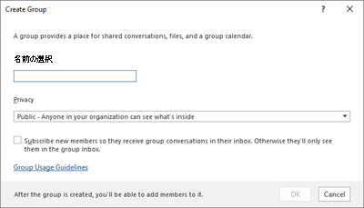
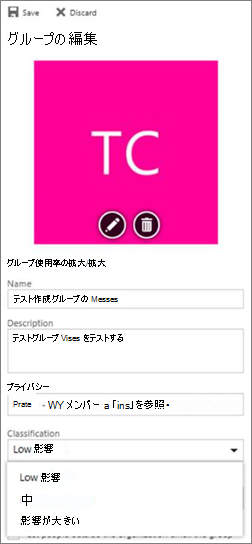

# <a name="manage-microsoft-365-groups-with-powershell"></a>PowerShell でMicrosoft 365 グループを管理する

*この記事は、Microsoft 365 Enterprise および Office 365 Enterprise の両方に適用されます。*

この記事では、Microsoft PowerShell でグループの一般的な管理タスクを行うための手順について説明します。 また、グループの PowerShell コマンドレットを示します。 SharePoint サイトを管理する方法の詳細については、「[PowerShell を使用して SharePoint Online サイトを管理する](/sharepoint/manage-team-and-communication-sites-in-powershell)」を参照してください。

## <a name="link-to-your-microsoft-365-groups-usage-guidelines"></a>Microsoft 365 グループ使用ガイドラインへのリンク

ユーザーが [Outlook でグループを作成または編集](https://support.office.com/article/04d0c9cf-6864-423c-a380-4fa858f27102.aspx)するときに、組織での使用に関するガイドラインへのリンクをそのユーザーに表示することができます。 たとえば、グループ名に特定のプレフィックスまたはサフィックスを追加する必要がある場合があります。

Azure Active Directory (Azure AD) PowerShell を使用して、Microsoft 365 グループに対する組織の使用ガイドラインをユーザーに示します。 「[グループの設定を構成するための Azure Active Directory コマンドレット](/azure/active-directory/enterprise-users/groups-settings-cmdlets)」の「**ディレクトリ レベルでの設定の作成**」の手順に従って、使用ガイドラインのハイパーリンクを定義します。 AAD コマンドレットを実行すると、ユーザーがOutlookでグループを作成または編集するときに、ガイドラインへのリンクが表示されます。



![[グループの使用ガイドライン] をクリックして、組織Office 365グループのガイドラインを確認します。](../media/d0d54ace-f0ec-4946-b2de-50ce23f17765.png)

## <a name="allow-users-to-send-as-the-microsoft-365-group"></a>ユーザーがMicrosoft 365 グループとして送信できるようにする

Microsoft 365 グループで "Send As" を有効にする場合は、[Add-RecipientPermission](/powershell/module/exchange/add-recipientpermission) コマンドレットと [Get-RecipientPermission](/powershell/module/exchange/get-recipientpermission) コマンドレットを使用してこれを構成します。 この設定を有効にすると、Microsoft 365 グループ ユーザーはOutlookまたはOutlook on the webを使用して、Microsoft 365 グループとして電子メールを送信および返信できます。 ユーザーはグループに移動し、新しいメールを作成して、「メールボックス所有者として送信する」フィールドをグループのメール アドレスに変更することができます。

([Exchange 管理センターでもこれを行うことができます](/office365/admin/create-groups/allow-members-to-send-as-or-send-on-behalf-of-group)。)

次のスクリプトを使用し、更新するグループのエイリアスと *\<UserAlias\>*、アクセス許可を付与するユーザーのエイリアスに置き換えます *\<GroupAlias\>*。 [Exchange Online PowerShell に接続し](/powershell/exchange/connect-to-exchange-online-powershell)、このスクリプトを実行します。

```PowerShell
$groupAlias = "<GroupAlias>"
$userAlias = "<UserAlias>"
$groupsRecipientDetails = Get-Recipient -RecipientTypeDetails groupmailbox -Identity $groupAlias

Add-RecipientPermission -Identity $groupsRecipientDetails.Name -Trustee $userAlias -AccessRights SendAs
```

コマンドレットが実行されると、**From** フィールドにグループ メール アドレスを追加することにより、ユーザーが Outlook または Outlook on the web に移動して、グループとして送信することができます。

## <a name="create-classifications-for-microsoft-365-groups-in-your-organization"></a>組織内のMicrosoft 365 グループの分類を作成する

組織内のユーザーがMicrosoft 365 グループを作成するときに設定できる秘密度ラベルを作成できます。 グループを分類する場合は、前のグループ分類機能ではなく機密ラベルを使用することをお勧めします。 秘密度ラベルの使用については、「[秘密度ラベルを使用して、Microsoft Teams、Microsoft 365 グループ、およびSharePoint サイトのコンテンツを保護する」を](../compliance/sensitivity-labels-teams-groups-sites.md)参照してください。

> [!IMPORTANT]
> 現在分類ラベルを使用している場合、機密ラベルが有効になると、グループを作成するユーザーは分類ラベルを使用できなくなります。

前のグループ分類機能は引き続き使用できます。 組織内のユーザーがMicrosoft 365 グループを作成するときに設定できる分類を作成できます。 たとえば、作成するグループにユーザーが「標準」、「機密」、「極秘」といった分類を設定できるようにすることができます。 グループの分類は既定では設定されていないので、ユーザーに分類を設定させるには、分類を作成する必要があります。 Azure Active Directory PowerShell を使用して、Microsoft 365 グループに関する組織の使用ガイドラインをユーザーに示します。

[グループ設定を構成するためのAzure Active Directoryコマンドレットを](/azure/active-directory/users-groups-roles/groups-settings-cmdlets)確認し、**ディレクトリ レベルでの設定の作成** の手順に従って、Microsoft 365 グループの分類を定義します。

```powershell
$setting["ClassificationList"] = "Low Impact, Medium Impact, High Impact"
```

各分類に説明を関連付けるには、設定属性  *ClassificationDescriptions* を使用して定義できます。

```powershell
$setting["ClassificationDescriptions"] ="Classification:Description,Classification:Description"
```

分類が ClassificationList 内の文字列と一致する場所。

例:

```powershell
$setting["ClassificationDescriptions"] = "Low Impact: General communication, Medium Impact: Company internal data , High Impact: Data that has regulatory requirements"
```

上の Azure Active Directory コマンドレットを実行して分類を設定した後、特定のグループに分類を設定する場合は、[Set-UnifiedGroup](/powershell/module/exchange/Set-UnifiedGroup) コマンドレットを実行します。

```powershell
Set-UnifiedGroup <LowImpactGroup@constoso.com> -Classification <LowImpact>
```

または、分類を使用して新しいグループを作成します。

```powershell
New-UnifiedGroup <HighImpactGroup@constoso.com> -Classification <HighImpact> -AccessType <Public>
```

Exchange Online PowerShell の使用の詳細については、「[Exchange Online による PowerShell の使用](/powershell/exchange/exchange-online-powershell)」および「[Exchange Online PowerShell への接続](/powershell/exchange/connect-to-exchange-online-powershell)」を参照してください。

これらの設定を有効にした後、グループの所有者は、Outlook on the web および Outlook​​ のドロップダウン メニューから分類を選択し、[**編集**] グループ ページから分類を保存できるようになります。



## <a name="hide-microsoft-365-groups-from-the-global-address-list"></a>グローバル アドレス一覧からMicrosoft 365 グループを非表示にします。

Microsoft 365 グループをグローバル アドレス一覧 (GAL) および組織内の他のリストに表示するかどうかを指定できます。 たとえば、住所一覧に表示しない法務部門グループがある場合、そのグループが GAL に表示されないようにすることができます。 Set-Unified Group コマンドレットを実行して、次のようにアドレス一覧からグループを非表示にします。

```powershell
Set-UnifiedGroup -Identity "Legal Department" -HiddenFromAddressListsEnabled $true
```

## <a name="allow-only-internal-users-to-send-message-to-microsoft-365-groups"></a>内部ユーザーのみがメッセージをMicrosoft 365 グループに送信できるようにする

他の組織のユーザーがメールをMicrosoft 365 グループに送信したくない場合は、そのグループの設定を変更できます。 これにより、内部のユーザーのみがグループにメールを送信できるようになります。 外部ユーザーがそのグループにメッセージを送信しようとすると、拒否されます。

この設定を更新するには、次のように Set-UnifiedGroup コマンドレットを実行します。

```powershell
Set-UnifiedGroup -Identity "Internal senders only" -RequireSenderAuthenticationEnabled $true
```

## <a name="add-mailtips-to-microsoft-365-groups"></a>Microsoft 365 グループにメール ヒントを追加する

送信者がMicrosoft 365 グループに電子メールを送信しようとすると、メール ヒントを表示できます。

グループにメール ヒントを追加するには、Set-UnifiedGroup コマンドレットを実行します。

```powershell
Set-UnifiedGroup -Identity "MailTip Group" -MailTip "This group has a MailTip"
```

MailTip と共に、メール ヒントの他の言語を指定する MailTipTranslations を設定することもできます。 スペイン語の翻訳を追加するとします。この場合は、次のコマンドを実行します。

```powershell
Set-UnifiedGroup -Identity "MailaTip Group" -MailTip "This group has a MailTip" -MailTipTranslations "@{Add="ES:Esta caja no se supervisa."
```

## <a name="change-the-display-name-of-the-microsoft-365-group"></a>Microsoft 365 グループの表示名を変更する

表示名は、Microsoft 365 グループの名前を指定します。 この名前は<a href="https://go.microsoft.com/fwlink/p/?linkid=2059104" target="_blank">、Exchange管理センター</a>または<a href="https://go.microsoft.com/fwlink/p/?linkid=2024339" target="_blank">Microsoft 365 管理センター</a>で確認できます。 Set-UnifiedGroup コマンドを実行すると、グループの表示名を編集したり、既存のMicrosoft 365 グループに表示名を割り当てたりできます。

```powershell
Set-UnifiedGroup -Identity "mygroup@contoso.com" -DisplayName "My new group"
```

## <a name="change-the-default-setting-of-microsoft-365-groups-for-outlook-to-public-or-private"></a>Outlookの既定のMicrosoft 365 グループ設定をパブリックまたはプライベートに変更する

OutlookのMicrosoft 365 グループは、既定でプライベートとして作成されます。 組織で既定でパブリックとして作成する (または Private に戻る) Microsoft 365 グループ必要がある場合は、次の PowerShell コマンドレット構文を使用します。

 ```powershell
 Set-OrganizationConfig -DefaultGroupAccessType Public
 ```

非公開に設定するには:

 ```powershell
 Set-OrganizationConfig -DefaultGroupAccessType Private
 ```

設定を確認するには:

 ```powershell
 Get-OrganizationConfig | ft DefaultGroupAccessType
 ```

詳細については、「[Set-OrganizationConfig](/powershell/module/exchange/set-organizationconfig)」および「[Get-OrganizationConfig](/powershell/module/exchange/get-organizationconfig)」を参照してください。

## <a name="microsoft-365-groups-cmdlets"></a>Microsoft 365 グループ コマンドレット

次のコマンドレットは、Microsoft 365 グループで使用できます。

|**コマンドレット名**|**Description**|
|:-----|:-----|
|[Get-UnifiedGroup](/powershell/module/exchange/get-unifiedgroup) <br/> |このコマンドレットを使用して、既存のMicrosoft 365 グループを検索し、グループ オブジェクトのプロパティを表示します。  <br/> |
|[Set-UnifiedGroup](/powershell/module/exchange/set-unifiedgroup) <br/> |特定のMicrosoft 365 グループのプロパティを更新する  <br/> |
|[New-UnifiedGroup](/powershell/module/exchange/new-unifiedgroup) <br/> |新しいMicrosoft 365 グループを作成します。 このコマンドレットは、最小限のパラメーター セットを提供します。 拡張プロパティの値を設定するには、新しいグループの作成後にSet-UnifiedGroupを使用します  <br/> |
|[Remove-UnifiedGroup](/powershell/module/exchange/remove-unifiedgroup) <br/> |既存のMicrosoft 365 グループを削除する  <br/> |
|[Get-UnifiedGroupLinks](/powershell/module/exchange/get-unifiedgrouplinks) <br/> |Microsoft 365 グループのメンバーシップと所有者の情報を取得する  <br/> |
|[Add-UnifiedGroupLinks](/powershell/module/exchange/add-unifiedgrouplinks) <br/> |既存のMicrosoft 365 グループにメンバー、所有者、サブスクライバーを追加する <br/> |
|[Remove-UnifiedGroupLinks](/powershell/module/exchange/remove-unifiedgrouplinks) <br/> |既存のMicrosoft 365 グループから所有者とメンバーを削除する  <br/> |
|[Get-UserPhoto](/powershell/module/exchange/get-userphoto) <br/> |アカウントと関連付けられたユーザーの写真について情報を表示します。 パスワードは Active Directory に格納されます。  <br/> |
|[Set-UserPhoto](/powershell/module/exchange/set-userphoto) <br/> |ユーザーの写真をアカウントに関連付けるために使用します。 パスワードは Active Directory に格納されます。  <br/> |
|[Remove-UserPhoto](/powershell/module/exchange/remove-userphoto) <br/> |Microsoft 365 グループの写真を削除する  <br/> |

## <a name="related-topics"></a>関連項目

[配布リストをMicrosoft 365 グループにアップグレードする](/office365/admin/manage/upgrade-distribution-lists)

[Microsoft 365 グループを作成できるユーザーを管理する](/office365/admin/create-groups/manage-creation-of-groups)

[Microsoft 365 グループへのゲスト アクセスを管理する](https://support.office.com/article/bfc7a840-868f-4fd6-a390-f347bf51aff6)

[静的なグループメンバーシップを動的に変更する](/azure/active-directory/users-groups-roles/groups-change-type)
