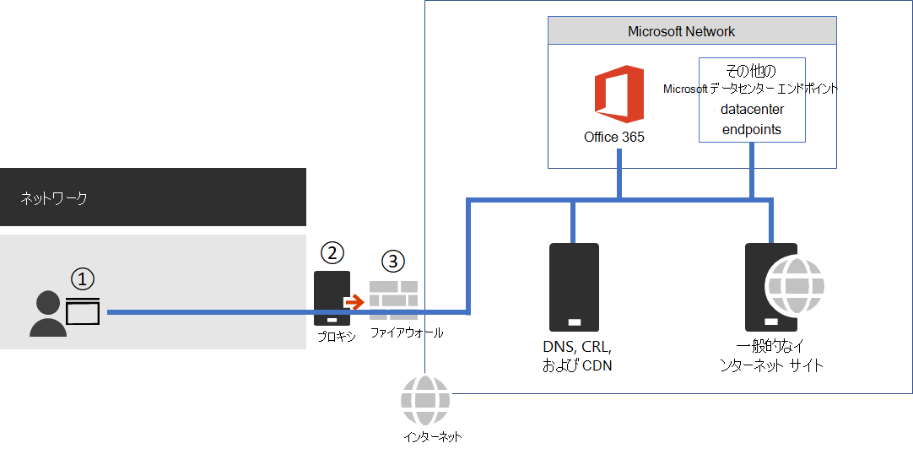

# <a name="managing-office-365-endpoints"></a>Office 365 エンドポイントを管理する

複数の異なる場所にオフィスを構えて WAN 接続を使用しているエンタープライズ組織のほとんどでは、Office 365 ネットワーク接続用の構成が必要です。 すべての信頼できる Office 365 ネットワーク要求をファイアウォール経由で直接送信し、余分なパケット レベルの検査や処理をすべてバイパスすることで、ネットワークを最適化できます。 これにより、待機時間と境界の容量要件が削減されます。 Office 365 ネットワーク トラフィックを識別することは、ユーザーに最適なパフォーマンスを提供するための第一歩です。 詳細については、「 [Office 365 ネットワーク接続の原則](microsoft-365-network-connectivity-principles.md)」を参照してください。

Microsoft では、[Office 365 IP アドレスと URL の Web サービス](microsoft-365-ip-web-service.md) を使用して、Office 365 ネットワーク エンドポイントおよびそれらに対する進行中の変更にアクセスすることをお勧めします。

重要な Office 365 ネットワーク トラフィックの管理方法にかかわらず、Office 365 にはインターネット接続が必要です。接続が必要なその他のネットワーク エンドポイントは、「[Office 365 IP アドレスと URL Web サービスに含まれないその他のエンドポイント](additional-office365-ip-addresses-and-urls.md)」に記載されています。

Office 365 ネットワーク エンドポイントの使用方法は、エンタープライズ組織のネットワーク アーキテクチャによって決まります。この記事では、エンタープライズ ネットワーク アーキテクチャを Office 365 IP アドレスおよび URL と統合するためのいくつかの方法を概説しています。信頼できるネットワーク要求を選択するための最も簡単な方法は、各オフィスの所在地で Office 365 の自動構成をサポートする SD-WAN デバイスを使用することです。

## <a name="sd-wan-for-local-branch-egress-of-vital-office-365-network-traffic"></a>重要な Office 365 ネットワーク トラフィックのローカル ブランチ送信用 SD-WAN

各ブランチ オフィスの所在地で、Office 365 の最適化カテゴリのエンドポイント、または最適化および許可カテゴリのエンドポイントへのトラフィックを直接 Microsoft のネットワークにルーティングするように構成されている SD-WAN デバイスを提供できます。その他のネットワーク トラフィック (オンプレミス データセンター トラフィック、一般的なインターネット Web サイトのトラフィック、および Office 365 の既定カテゴリのエンドポイントに対するトラフィックなど) は、より強固なネットワーク境界を持つ別の場所に送信されます。

Microsoft は SD-WAN のプロバイダーと協力し、自動構成を可能にしています。詳細については、「[Office 365 ネットワーク パートナー プログラム](microsoft-365-networking-partner-program.md)」を参照してください。

<a name="pacfiles"> </a>
## <a name="use-a-pac-file-for-direct-routing-of-vital-office-365-traffic"></a>重要な Office 365 トラフィックの直接ルーティング用 PAC ファイルの使用

PAC または WPAD ファイルを使用して、Office 365 と関連付けられているが、IP アドレスを持たないネットワーク要求を管理します。プロキシまたは境界デバイスを介して送信される一般的なネットワーク要求は、待機時間を増大させます。SSL の中断と検査によって待機時間が最長になる一方、プロキシ認証や評価の検索などのその他のサービスは、パフォーマンスとユーザー エクスペリエンスを低下させます。また、これらの境界ネットワーク デバイスには、すべてのネットワーク接続要求を処理するために十分な容量が必要です。直接の Office 365 ネットワーク要求のために、プロキシまたは検査デバイスをバイパスすることをお勧めします。
  
[PowerShell Gallery の Get-PacFile](https://www.powershellgallery.com/packages/Get-PacFile) は、Office 365 IP アドレスと URL Web サービスから最新のネットワーク エンドポイントを読み取り、サンプル PAC ファイルを作成する PowerShell スクリプトです。このスクリプトを変更して、既存の PAC ファイル管理と統合させることができます。

> [!NOTE]
> Office 365 エンドポイントへの直接接続のセキュリティとパフォーマンスに関する考慮事項の詳細については、「 [Office 365 ネットワーク接続の原則](microsoft-365-network-connectivity-principles.md)」を参照してください。



**図 1 - 単純なエンタープライズ ネットワーク境界**

PAC ファイルは、図 1 のポイント 1 で Web ブラウザーに展開されます。重要な Office 365 ネットワーク トラフィックの直接送信に PAC ファイルを使用する場合は、ご使用のネットワーク境界ファイアウォールでこれらの URL の背後にある IP アドレスへの接続も許可する必要があります。これには、PAC ファイルで指定されているものと同じ Office 365 エンドポイント カテゴリの IP アドレスを取得し、これらのアドレスに基づくファイアウォール ACL を作成します。ファイアウォールは、図 1 のポイント 3 です。

それとは別に、最適化カテゴリのエンドポイントの直接ルーティングのみを行う場合は、それ以降の処理をバイパスするために、プロキシ サーバーに送信する必要なすべての許可カテゴリのエンドポイントをプロキシ サーバーにリストする必要があります。たとえば、SSL の中断と検査およびプロキシ認証は、最適化および許可いずれのカテゴリのエンドポイントとも互換性がありません。プロキシ サーバーは、図 1 のポイント 2 です。

一般的な構成は、プロキシ サーバーからの送信トラフィックをまったく処理せずに、プロキシ サーバーに到達する Office 365 ネットワーク トラフィックの宛先 IP アドレスを許可するというものです。SSL の中断と検査に関する問題の詳細については、「[Office 365 トラフィックに対するサード パーティ製のネットワーク デバイスまたはソリューションの使用](https://support.microsoft.com/help/2690045/using-third-party-network-devices-or-solutions-with-office-365)」を参照してください。

Get-PacFile スクリプトでは、次の 2 つの型のPAC ファイルが生成されます。

| 型 | 説明 |
|:-----|:-----|
|**1** <br/> |最適化エンドポイント トラフィックを直接送信し、その他すべてのトラフィックはプロキシ サーバーに送信します。 <br/> |
|**2** <br/> |最適化および許可エンドポイント トラフィックを直接送信し、その他すべてのトラフィックはプロキシ サーバーに送信します。この型のファイルは、サポートされているすべての ExpressRoute for Office 365 トラフィックを ExpressRoute ネットワーク セグメントに送信し、その他すべてのトラフィックをプロキシ サーバーに送信するためにも使用できます。 <br/> |

PowerShell スクリプトを呼び出す簡単な例を次に示します。

```powershell
Get-PacFile -ClientRequestId b10c5ed1-bad1-445f-b386-b919946339a7
```

スクリプトに渡すことができるパラメーターは多数あります。

| パラメーター | 説明 |
|:-----|:-----|
|**ClientRequestId** <br/> |このパラメーターは必須です。呼び出しを行うクライアント マシンを表す GUID で、Web サービスに渡されます。 <br/> |
|**Instance** <br/> |既定で Worldwide に設定される Office 365 サービス インスタンスです。これも Web サービスに渡されます。 <br/> |
|**TenantName** <br/> |ご使用の Office 365 テナント名。Web サービスに渡され、一部の Office 365 URL で置換可能なパラメーターとして使用されます。 <br/> |
|**Type** <br/> |生成するプロキシ PAC ファイルの型。 <br/> |

追加のパラメーターを指定して PowerShell スクリプトを呼び出す別の例を、次に示します。

```powershell
Get-PacFile -Type 2 -Instance Worldwide -TenantName Contoso -ClientRequestId b10c5ed1-bad1-445f-b386-b919946339a7
```

## <a name="proxy-server-bypass-processing-of-office-365-network-traffic"></a>プロキシ サーバーによる Office 365 ネットワーク トラフィック処理のバイパス

PAC ファイルを直接送信トラフィックに使用しない場合でも、プロキシ サーバーを構成してネットワーク境界で処理をバイパスする必要があります。 一部のプロキシ サーバー ベンダーでは、 [Office 365 ネットワーク パートナー プログラム](microsoft-365-networking-partner-program.md)で説明されているように、この自動構成が有効になっています。

これを手動で行う場合は、Office 365 の IP アドレスと URL Web サービスから最適化と許可のエンドポイント カテゴリ データを取得し、これらの処理をバイパスするようにプロキシ サーバーを構成する必要があります。 最適化と許可のカテゴリ エンドポイントの SSL 中断と検査、プロキシ認証を回避することが重要です。
  
<a name="bkmk_changes"> </a>
## <a name="change-management-for-office-365-ip-addresses-and-urls"></a>Office 365 IP アドレスと URL の変更管理

ネットワーク境界に適した構成を選択するだけでなく、Office 365 エンドポイントの変更管理プロセスを採用することが重要です。 これらのエンドポイントは定期的に変更され、変更を管理しないと、新しい IP アドレスまたは URL が追加された後、ユーザーがブロックされたり、パフォーマンスが低下したりする可能性があります。

Office 365 IP アドレスと URL の変更は通常、各月の末日近くに公開されます。場合によっては、運用、サポート、またはセキュリティ上の必要により、このスケジュール外に変更が公開されることもあります。

IP アドレスまたは URL が追加されたために操作する必要がある変更が発行された場合、そのエンドポイントに Office 365 サービスが存在するまで、変更を公開してから 30 日間の通知を受け取る必要があります。 これは、有効日として反映されます。 この通知期間を目指していますが、運用、サポート、またはセキュリティの要件により、常に可能であるとは限りません。 削除された IP アドレスや URL などの接続を維持するための即時アクションを必要としない変更や、重大でない変更は、事前通知を含めないでください。 このような場合、有効日は指定されません。 どの通知が提供されているかに関係なく、変更ごとに予想されるサービスのアクティブな日付が一覧表示されます。

### <a name="change-notification-using-the-web-service"></a>Web サービスを使用した変更通知

Office 365 IP アドレスと URL Web サービスを使用して、変更通知を受け取ることができます。 **/version** Web メソッドを 1 時間に 1 回呼び出して、Office 365 への接続に使用しているエンドポイントのバージョンを確認することをお勧めします。 使用中のバージョンと比較してこのバージョンが変更された場合は、 **/endpoints** Web メソッドから最新のエンドポイント データを取得し、必要に応じて **/changes** Web メソッドとの違いを取得する必要があります。 検出したバージョンに変更がない場合は、 **/endpoints** または **/changes** Web メソッドを呼び出す必要はありません。

詳細については、「[Office 365 IP アドレスと URL の Web サービス](microsoft-365-ip-web-service.md)」を参照してください。

### <a name="change-notification-using-rss-feeds"></a>RSS フィードを使用した変更通知

Office 365 IP アドレスと URL の Web サービスでは、Outlook で登録できる RSS フィードが提供されます。Office 365 サービス インスタンス固有の各ページに、IP アドレスと URL の RSS URL へのリンクがあります。詳細については、「[Office 365 IP アドレスと URL の Web サービス](microsoft-365-ip-web-service.md)」を参照してください。

### <a name="change-notification-and-approval-review-using-power-automate"></a>Power Automate を使用した変更通知および承認確認

毎月行われるネットワーク エンドポイントの変更を手動で処理する必要がある方もいらっしゃるでしょう。Power Automate を使用すれば、Office 365 のネットワーク エンドポイントに変更があったときに、電子メールで通知し、必要に応じて、変更の承認プロセスを実行するフローを作成できます。確認が完了したら、ファイアウォールとプロキシ サーバーの管理チームに、自動的に電子メールで変更を通知するように設定できます。

Power Automate のサンプルおよびテンプレートの詳細については、「[Power Automate を使用して、Office 365 IP アドレスや URL への変更のメール通知を受け取る](https://techcommunity.microsoft.com/t5/Office-365-Networking/Use-Microsoft-Flow-to-receive-an-email-for-changes-to-Office-365/td-p/240651)」を参照してください。
  
<a name="FAQ"> </a>
## <a name="office-365-network-endpoints-faq"></a>Office 365 のネットワーク エンドポイントについてよく寄せられる質問

Office 365 ネットワーク接続に関してよく寄せられるこれらの質問を参照してください。
  
### <a name="how-do-i-submit-a-question"></a>質問を送信するにはどうすればよいですか?

下部のリンクをクリックして、記事が役に立ったかどうかを示し、追加の質問を送信してください。Microsoft は皆様からのフィードバックを確認し、よく寄せられる質問でここの質問を更新しています。
  
### <a name="how-do-i-determine-the-location-of-my-tenant"></a>テナントの場所を確認するにはどうすればよいですか?

 **テナントの場所** は、Microsoft の [データセンター マップ](./o365-data-locations.md)を使用して最適な場所が決定されます。
  
### <a name="am-i-peering-appropriately-with-microsoft"></a>私は Microsoft と適切にピアリングされていますか?

 **ピアリング場所** の詳細については、[Microsoft とのピアリングのページ](https://www.microsoft.com/peering)を参照してください。
  
世界中に 2,500 を超える ISP ピアリング リレーションシップと 70 を超えるポイントがあるため、ユーザーのネットワークから Microsoft のネットワークへの接続はシームレスであるはずです。数分あれば、ISP のピアリング リレーションシップが最適であることを確認することができます。Microsoft ネットワークとのピアリング手順の[よい例と悪い例については、こちら](/archive/blogs/onthewire/__guidance)を参照してください。
  
<a name="bkmk_MissingIP"> </a>
### <a name="i-see-network-requests-to-ip-addresses-not-on-the-published-list-do-i-need-to-provide-access-to-them"></a>公開済みの一覧に掲載されていない IP アドレスに対してネットワーク要求を受け取ります。それらの IP アドレスに対してアクセス権を付与する必要はありますか?

直接ルーティングする必要がある Office 365 サーバーの IP アドレスのみが提供されます。 これは、ネットワーク要求が表示されるすべての IP アドレスの包括的な一覧ではありません。 Microsoft とサードパーティが所有する未公開の IP アドレスに対するネットワーク要求が表示されます。 これらの IP アドレスは、変更されたときにタイムリーに通知されないように、動的に生成または管理されます。 ファイアウォールでこれらのネットワーク要求の FQDN に基づくアクセスを許可できない場合は、PAC または WPAD ファイルを使用して要求を管理します。
  
Office 365 と関連付けられた IP の詳細を確認するには、以下の手順を実行してください。
  
1. [IPv4](https://www.ipaddressguide.com/cidr) や [IPv6](https://www.ipaddressguide.com/ipv6-cidr) などの CIDR 計算ツールを使用して、より広く公開されている範囲に IP アドレスが含まれているかどうかを確認します。 たとえば、40.103.0.1 が含まれる IP アドレス 40.96.0.0/13 には、40.96 は一致しますが、40.103 は一致しません。
2. [whois クエリ](https://dnsquery.org/) を使用して、パートナーが IP を所有しているかどうかを確認します。 Microsoft 所有の場合は、内部パートナーの可能性があります。 多くのパートナー ネットワーク エンドポイントは、IP アドレスが公開されていない _既定_ のカテゴリに属するものとして一覧表示されます。
3. IP アドレスは、Office 365 または依存関係の一部ではない可能性があります。 Office 365 ネットワーク エンドポイントの発行には、すべての Microsoft ネットワーク エンドポイントが含まれているわけではありません。
4. 証明書を確認します。ブラウザーで *HTTPS://\<IP_ADDRESS\>* を使用して IP アドレスに接続し、証明書に表示されるドメインを確認して、IP アドレスに関連付けられているドメインを把握します。Microsoft 所有の IP アドレスで、Office 365 の IP アドレス一覧に掲載されていない場合、その IP アドレスは、*MSOCDN.NET* や IP 情報が公開されていない他の Microsoft ドメインなど、Microsoft CDN に関連付けられている可能性があります。証明書のドメインが、Microsoft が IP アドレスの登録を主張しているドメインの場合は、お知らせください。

<a name="bkmk_cname"> </a>
### <a name="some-office-365-urls-point-to-cname-records-instead-of-a-records-in-the-dns-what-do-i-have-to-do-with-the-cname-records"></a>一部の Office 365 URL が、DNS 内の A レコードではなく CNAME レコードを指しています。CNAME レコードはどのように扱えばよいでしょうか?

クライアント コンピューターがクラウド サービスに接続するには、1 つ以上の IP アドレスが含まれる DNS A レコードまたは AAAA レコードが必要です。Office 365 に含まれる一部の URL は、A レコードまたは AAAA レコードではなく CNAME レコードを示します。こうした CNAME レコードは中間レコードで、一連の処理の途中であるものもあります。最終的には、特定の IP アドレスの A レコードまたは AAAA レコードに必ず解決されます。たとえば、最終的に IP アドレス _IP_1_ に解決される以下の一連の DNS レコードについて考慮してみましょう。

```console
serviceA.office.com -> CNAME: serviceA.domainA.com -> CNAME: serviceA.domainB.com -> A: IP_1
```

これらの CNAME リダイレクトは DNS の通常の部分であり、クライアント コンピューターに対して透過的であり、プロキシ サーバーには透過的です。 これらは、負荷分散、コンテンツ配信ネットワーク、高可用性、およびサービス インシデントの軽減に使用されます。 Microsoft は中間 CNAME レコードを発行せず、いつでも変更される可能性があるため、プロキシ サーバーで許可されているように構成する必要はありません。

プロキシ サーバーは最初の URL を検証します。この例では serviceA.office.com であり、この URL は Office 365 発行に含まれます。 プロキシ サーバーは、その URL の DNS 解決を IP アドレスに要求し、IP_1を受信します。 中間 CNAME リダイレクト レコードは検証されません。

ハードコーディングされた構成や、間接 Office 365 FQDN に基づく許可リストの使用は推奨されておらず、Microsoft ではサポートされておらず、お客様の接続の問題の原因になることがわかっています。 CNAME リダイレクトをブロックする DNS ソリューション、または Office 365 DNS エントリを誤って解決する DNS ソリューションは、DNS 再帰が有効になっている DNS フォワーダーまたは DNS ルート ヒントを使用して解決できます。 多くのサードパーティネットワーク境界製品では、推奨される Office 365 エンドポイントをネイティブに統合して、 [Office 365 IP アドレスと URL Web サービス](microsoft-365-ip-web-service.md)を使用して構成に許可リストを含めます。

<a name="bkmk_akamai"> </a>
### <a name="why-do-i-see-names-such-as-nsatcnet-or-akadnsnet-in-the-microsoft-domain-names"></a>Microsoft ドメイン名に nsatc.net や akadns.net などの名前が表示されるのはなぜですか?

Office 365 と他の Microsoft サービスは、Akamai や MarkMonitor などのいくつかのサードパーティ サービスを使用し、Office 365 の操作性を高めています。お客様の操作性を可能な限り高めるために、将来これらのサービスを変更する可能性があります。サード パーティ ドメインは、CDN などのコンテンツをホストする場合があります。また、地理的なトラフィック管理サービスなどのサービスをホストする場合があります。現在、次のようなサービスが使用されています:
  
*\*.nsatc.net* を含む要求が表示される場合、[MarkMonitor](https://www.markmonitor.com/) が使用されています。このサービスは、ドメイン名の保護と、悪意のある動作に対して保護するための監視サービスを提供しています。
  
*\*.exacttarget.com* に対する要求が表示される場合、[ExactTarget](https://www.marketingcloud.com/) が使用されています。このサービスは、メール リンク管理と悪意のある動作に対する監視サービスを提供しています。
  
次のいずれかの FQDN を含む要求が表示される場合、[Akamai](https://www.akamai.com/) が使用されています。このサービスは、geo-DNS サービスとコンテンツ配信ネットワーク サービスを提供しています。
  
```console
*.akadns.net
*.akam.net
*.akamai.com
*.akamai.net
*.akamaiedge.net
*.akamaihd.net
*.akamaized.net
*.edgekey.net
*.edgesuite.net
```

<a name="bkmk_thirdparty"> </a>
### <a name="i-have-to-have-the-minimum-connectivity-possible-for-office-365"></a>Office 365 への接続を最小限にする必要があります

Office 365 はインターネット上で機能するように構築された一連のサービスであり、信頼性と可用性の保証は、使用可能な多数の標準インターネット サービスに基づいています。最新のインターネット サービスを使用するには、DNS、CRL、CDN などの標準インターネット サービスに到達可能である必要がありますが、同様に、Office 365 を使用するためにも標準インターネット サービスに到達可能である必要があります。

Office 365 スイートは、主要なサービス 領域に分割されます。 これらは接続に対して選択的に有効にすることができ、共通領域があります。これはすべてのユーザーの依存関係であり、常に必要です。

| サービス分野 | 説明 |
|:-----|:-----|
|**Exchange** <br/> |Exchange Online および Exchange Online Protection <br/> |
|**SharePoint** <br/> |SharePoint Online と OneDrive for Business <br/> |
|**Skype for Business Online および Microsoft Teams** <br/> |Skype for Business および Microsoft Teams <br/> |
|**共通** <br/> |Office 365 Pro Plus、Office ブラウザー、Azure AD、およびその他の一般的なネットワーク エンドポイント <br/> |

基本的なインターネット サービスに加え、機能を統合するためにのみ使用されるサード パーティ サービスがあります。これらは統合のために必要ですが、Office 365 エンドポイントの記事ではオプションと示されています。オプションとは、エンドポイントにアクセスできなくても、サービスのコア機能は動作することを意味します。必須であるすべてのネットワーク エンドポイントでは、必須属性が true に設定されます。オプションのネットワーク エンドポイントでは、必須属性が false に設定され、通知属性によって、接続がブロックされた場合に失われる機能の詳細が示されます。
  
Office 365 を使用しようとして、サードパーティ サービスにアクセスできなかった場合、[この記事で必須またはオプションと記載されているすべての FQDN がプロキシとファイアウォールで許可されていることを確認します](urls-and-ip-address-ranges.md)。
  
<a name="bkmk_consumer"> </a>
### <a name="how-do-i-block-access-to-microsofts-consumer-services"></a>Microsoft のコンシューマー サービスへのアクセスをブロックするにはどうすればよいですか?

テナント制限機能では、OneDrive、Hotmail、Xbox.com など、すべての Microsoft コンシューマー アプリケーション (MSA アプリ) の使用のブロックがサポートされるようになりました。 これで、login.live.com エンドポイントに別のヘッダーが使用されます。 詳細については、「 [テナント制限を使用して SaaS クラウド アプリケーションへのアクセスを管理する」を](/azure/active-directory/manage-apps/tenant-restrictions#blocking-consumer-applications)参照してください。

<a name="bkmk_IPOnlyFirewall"> </a>

### <a name="my-firewall-requires-ip-addresses-and-cannot-process-urls-how-do-i-configure-it-for-office-365"></a>ファイアウォールには IP アドレスが必要で、URL を処理することはできません。 Office 365 に合わせて構成する方法

Office 365 では、必要なすべてのネットワーク エンドポイントの IP アドレスは提供されません。 一部は URL としてだけ提供され、既定に分類されます。 必要な既定のカテゴリの URL は、プロキシ サーバー経由で許可する必要があります。 プロキシ サーバーがない場合は、ユーザーが Web ブラウザーのアドレス バーに入力する URL に対する Web 要求を構成した方法を確認します。ユーザーも IP アドレスを指定しません。 Office 365 の既定のカテゴリ URL に IP アドレスがない場合でも、同じ方法で構成する必要があります。

## <a name="related-topics"></a>関連項目

[Office 365 IP アドレスと URL の Web サービス](microsoft-365-ip-web-service.md)

[Microsoft Azure データ センターの IP 範囲](https://www.microsoft.com/download/details.aspx?id=41653)
  
[Microsoft パブリック IP スペース](https://www.microsoft.com/download/details.aspx?id=53602)
  
[Microsoft Intune のネットワーク インフラストラクチャの要件](/mem/intune/fundamentals/intune-endpoints)
  
[ExpressRoute と Power BI](https://powerbi.microsoft.com/documentation/powerbi-admin-power-bi-expressroute/)
  
[Office 365 の URL と IP アドレスの範囲](urls-and-ip-address-ranges.md)
  
[Office 365 向け ExpressRoute の管理](managing-expressroute-for-connectivity.md)
  
[Office 365 ネットワーク接続の原則](microsoft-365-network-connectivity-principles.md)
