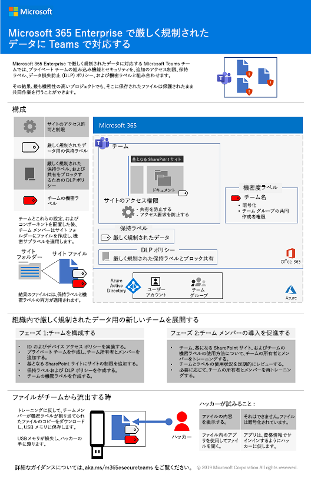
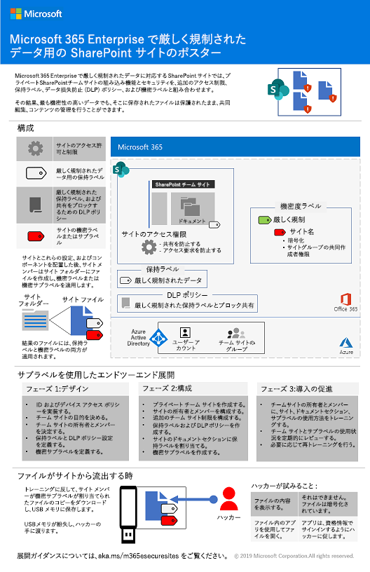
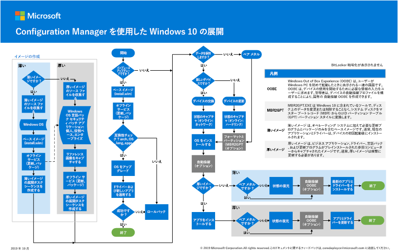
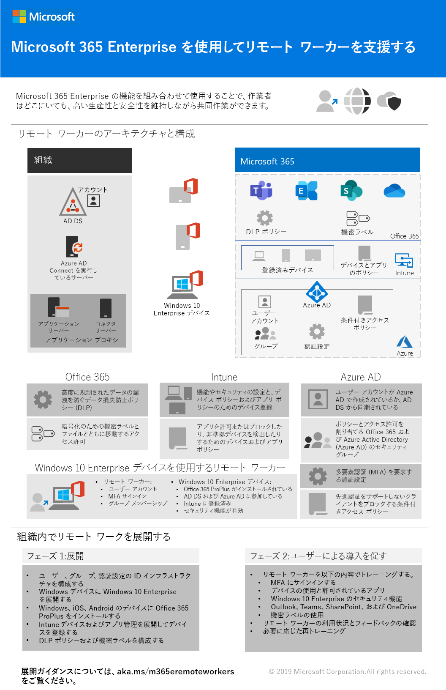
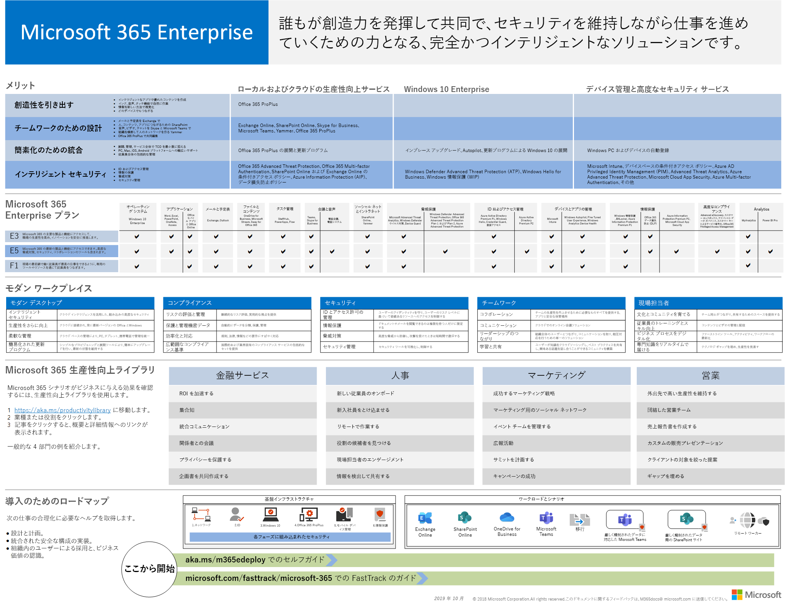
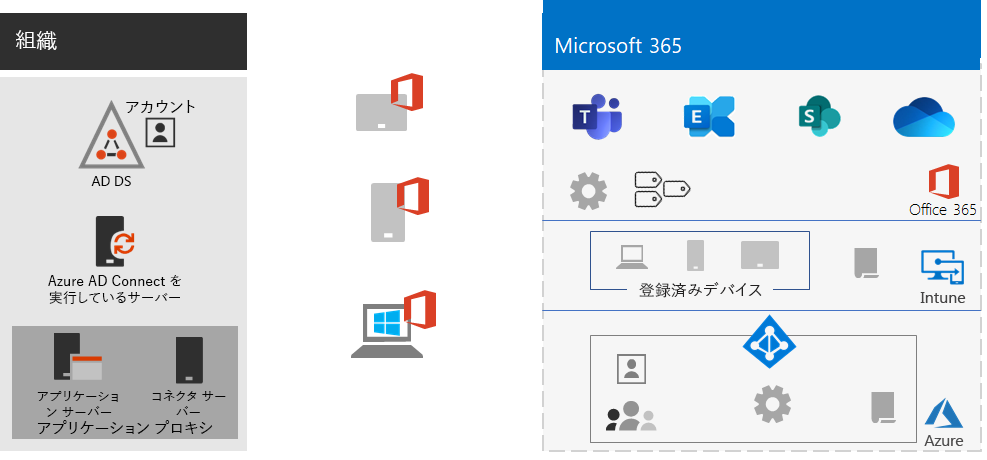
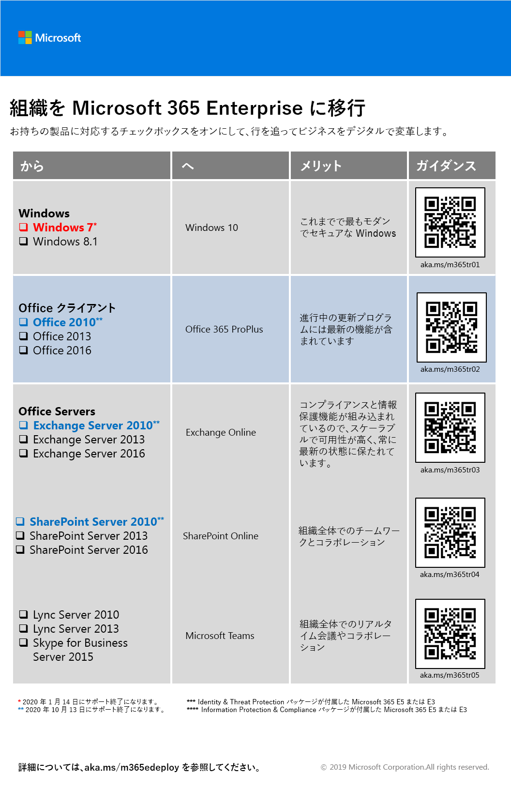
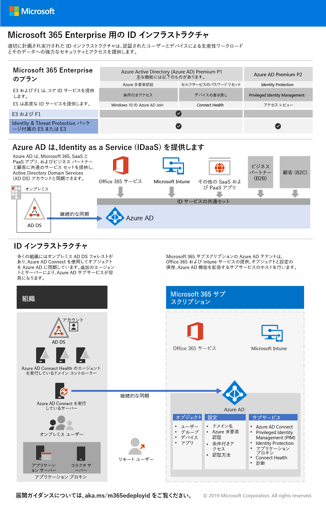
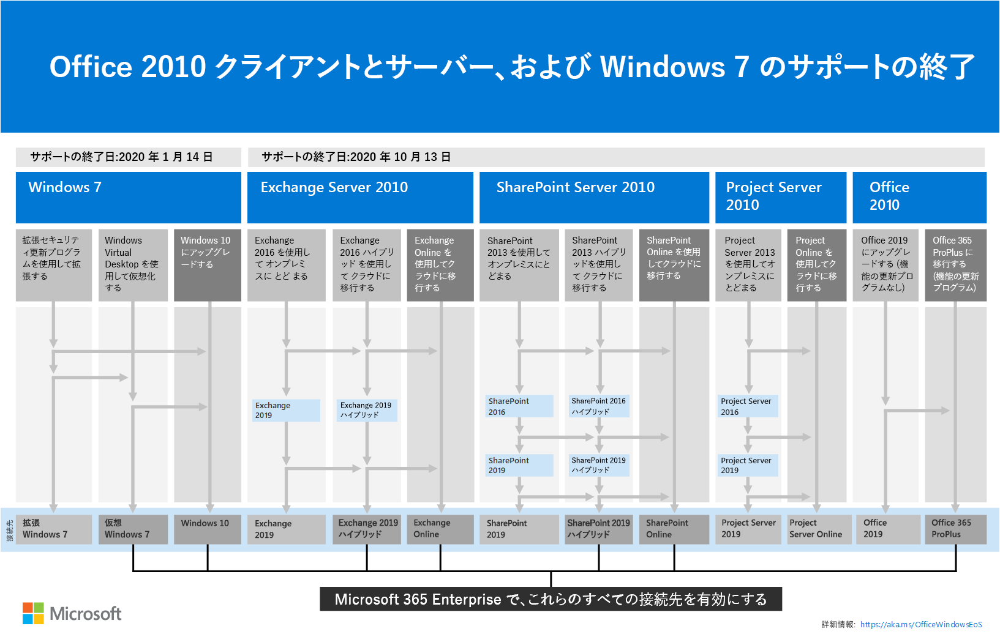

# Microsoft 365 Enterprise 展開コンテンツの変更

## 2019 年 11 月

### 新しいコンテンツ 

- [Microsoft 365 Business から Microsoft 365 Enterprise E3 への移行](https://docs.microsoft.com/microsoft-365/business/migrate-from-microsoft-365-business-to-microsoft-365-enterprise)

- [Contoso 社の極秘プロジェクトのチーム](contoso-team-for-top-secret-project.md)

  

## 2019 年 10 月

### 新しいコンテンツ 

- [厳しく規制されたデータ用の Teams のポスター](secure-teams-highly-regulated-data-scenario.md#poster)

  

  このポスターを [PDF](https://github.com/MicrosoftDocs/microsoft-365-docs/raw/public/microsoft-365/enterprise/media/secure-teams-highly-regulated-data-scenario/TeamsHighlyRegulatedData.pdf) または [PowerPoint](https://github.com/MicrosoftDocs/microsoft-365-docs/raw/public/microsoft-365/enterprise/media/secure-teams-highly-regulated-data-scenario/Teams-Highly-Regulated-Data-Poster.pptx) 形式でダウンロードして、レター、リーガル、タブロイド (11 x 17) のサイズの紙に印刷することもできます。

- [厳しく規制されたデータ用の SharePoint サイトのポスター](teams-sharepoint-online-sites-highly-regulated-data.md#poster)

  

  このポスターを [PDF](https://github.com/MicrosoftDocs/microsoft-365-docs/raw/public/microsoft-365/enterprise/media/teams-sharepoint-online-sites-highly-regulated-data/SharePointSitesHighlyRegulatedData.pdf) または [PowerPoint](https://github.com/MicrosoftDocs/microsoft-365-docs/raw/public/microsoft-365/enterprise/media/teams-sharepoint-online-sites-highly-regulated-data/SharePoint-Sites-Highly-Regulated-Data.pptx) 形式でダウンロードして、レター、リーガル、タブロイド (11 x 17) のサイズの紙に印刷することもできます。

- [Autopilot ポスターを使用した Windows 10 の展開](windows10-deploy-autopilot.md) 

  

  このポスターを [PDF](https://github.com/MicrosoftDocs/windows-itpro-docs/raw/public/windows/deployment/media/Windows10AutopilotFlowchart.pdf) または [Visio](https://github.com/MicrosoftDocs/windows-itpro-docs/raw/public/windows/deployment/media/Windows10Autopilotflowchart.vsdx) 形式でダウンロードすることもできます。

- [Microsoft Endpoint Configuration Manager ポスターを使用した Windows 10 の展開](windows10-deploy-inplaceupgrade.md)

  

  このポスターを [PDF](https://github.com/MicrosoftDocs/windows-itpro-docs/raw/public/windows/deployment/media/Windows10DeploymentConfigManager.pdf) または [Visio](https://github.com/MicrosoftDocs/windows-itpro-docs/raw/public/windows/deployment/media/Windows10DeploymentConfigManager.vsdx) 形式でダウンロードすることもできます。

- [厳しく規制されたデータ シナリオ用の Teams](secure-teams-highly-regulated-data-scenario.md)

  

  お知らせ: [Microsoft 365 テクニカル コミュニティ ブログ](https://techcommunity.microsoft.com/t5/Microsoft-365-Blog/Protect-your-highly-regulated-files-in-Teams-with-Microsoft-365/ba-p/962985)  |  [LinkedIn](https://www.linkedin.com/pulse/how-can-i-lock-down-team-sensitive-top-secret-joe-davies/?published=t)

- [リモート ワーカーを支援するポスター](empower-people-to-work-remotely.md#poster)

   

  このポスターを [PDF](https://github.com/MicrosoftDocs/microsoft-365-docs/raw/public/microsoft-365/enterprise/media/empower-people-to-work-remotely/empower-remote-workers-scenario.pdf) または [PowerPoint](https://github.com/MicrosoftDocs/microsoft-365-docs/raw/public/microsoft-365/enterprise/media/empower-people-to-work-remotely/Empower-Remote-Workers-Poster.pptx) 形式でダウンロードして、レター、リーガル、タブロイド (11 x 17) のサイズの紙に印刷することもできます。

### 更新プログラムおよび拡張機能

- [フェーズ 4 の更新: Office 365 ProPlus](office365proplus-infrastructure.md)
- [Contoso 社の導入実例](contoso-case-study.md) の更新
- [Microsoft Teams](teams-workload.md)、[Exchange Online](exchangeonline-workload.md)、および [SharePoint Online](sharepoint-online-onedrive-workload.md) ワークロードの更新
- [厳しく規制されたデータに適した SharePoint サイト](teams-sharepoint-online-sites-highly-regulated-data.md) のシナリオの更新
 
  

- 新しいシナリオの [Microsoft 365 Enterprise ポスター](microsoft-365-overview.md#get-the-big-picture) 

  

## 2019 年 9 月

### 新しいコンテンツ 

- [リモート ワーカーのシナリオ](empower-people-to-work-remotely.md)

   
 
  お知らせ: [Microsoft 365 テクニカル コミュニティ ブログ](https://techcommunity.microsoft.com/t5/Microsoft-365-Blog/Empower-your-remote-workers-with-Microsoft-365-Enterprise/ba-p/935196#M236)  |  [LinkedIn](https://www.linkedin.com/pulse/how-do-i-configure-microsoft-365-enterprise-empower-my-joe-davies/)

- [フェーズ 6: 情報保護](infoprotect-infrastructure.md) 用の[メールの暗号化の手順](infoprotect-email-encryption.md)

### 更新プログラムおよび拡張機能

- [フェーズ 2: ID](identity-infrastructure.md) の再編成と更新
- [フェーズ 1: ネットワーク](networking-infrastructure.md) および [フェーズ 6: 情報保護](infoprotect-infrastructure.md)の更新

## 2019 年 8 月

### 新しいコンテンツ 

- [組織を Microsoft 365 Enterprise に移行するポスター](migration-microsoft-365-enterprise-workload.md#transition-your-entire-organization)

   
 
- [Microsoft 365 Enterprise ポスターの ID インフラストラクチャ](identity-infrastructure.md)

  

  お知らせ: [Microsoft 365 テクニカル コミュニティ ブログ](https://techcommunity.microsoft.com/t5/Microsoft-365-Blog/Get-the-new-Identity-infrastructure-for-Microsoft-365-Enterprise/ba-p/874941)  |  [LinkedIn](https://www.linkedin.com/pulse/how-can-i-quickly-ramp-up-key-concepts-features-identity-joe-davies/?published=t)

- [Windows 7 および Office 10 のサポート終了のポスター](migration-microsoft-365-enterprise-workload.md#summary-of-options-for-office-2010-clients-and-servers-and-windows-7)
  
  

  お知らせ: [Microsoft 365 テクニカル コミュニティ ブログ](https://techcommunity.microsoft.com/t5/Microsoft-365-Blog/Move-from-Office-2010-clients-and-servers-and-Windows-7-to/ba-p/846994)  |  [LinkedIn](https://www.linkedin.com/pulse/how-can-microsoft-365-enterprise-help-me-end-support-products-davies/)

### 更新プログラムおよび拡張機能

- 新しい生産性向上シナリオ用の [Microsoft 365 Enterprise ポスター](microsoft-365-overview.md#get-the-big-picture)

   

## 2019 年 7 月

### 新しいコンテンツ

- [非エンタープライズの条項に適した Microsoft 365 Enterprise](deploy-foundation-infrastructure-non-enterprises.md#onboarding) 用の Excel ブック

## 2019 年 5 月

### 新しいコンテンツ

- [基盤インフラストラクチャのポスター](deploy-foundation-infrastructure.md#at-a-glance)

  

  お知らせ: [LinkedIn](https://www.linkedin.com/pulse/how-can-i-get-big-picture-microsoft-365-enterprise-joe-davies/)

 
- [非エンタープライズの条項に適した Microsoft 365 Enterprise](deploy-foundation-infrastructure-non-enterprises.md)

  

  お知らせ: [Microsoft 365 テクニカル コミュニティ ブログ](https://techcommunity.microsoft.com/t5/Microsoft-365-Blog/Deploy-Microsoft-365-Enterprise-infrastructure-even-if-you-re/ba-p/900012)  |  [LinkedIn](https://www.linkedin.com/pulse/how-do-i-deploy-microsoft-365-enterprise-without-joe-davies/)

## 2019 年 4 月

### 新しいコンテンツ 

- [ID およびデバイス アクセス](identity-device-access-m365-test-environment.md) の前提条件となるテスト ラボ ガイド
- [フェーズ 6: 情報保護](infoprotect-infrastructure.md)に適した [Windows 情報保護](infoprotect-deploy-windows-information-protection.md) および [Office 365 データ損失防止](infoprotect-data-loss-prevention.md) 

## 関連項目

[展開ガイド](deploy-microsoft-365-enterprise.md)
