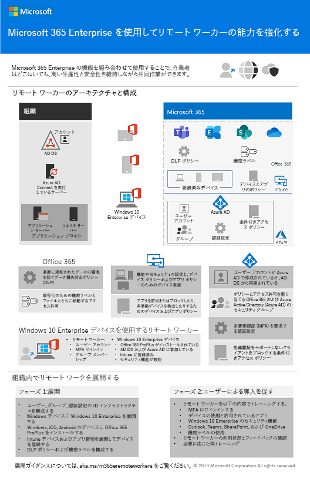

# Microsoft 365 Enterprise 展開コンテンツの変更Changes to Microsoft 365 Enterprise deployment content

## 2019 年 10 月October 2019

### 新しいコンテンツNew Announcements content type 

- [リモート ワーカーを支援するポスターEmpower remote workers](empower-people-to-work-remotely.md#poster)

   
 

### 更新プログラムおよび機能強化Updates and enhancements

- [Contoso 社の導入実例](contoso-case-study.md) の更新Refresh of the [Contoso case study](contoso-case-study.md)
- [Exchange Online](exchangeonline-workload.md) ワークロードの更新Refresh of the [Exchange Online](exchangeonline-workload.md) workload
- [厳しく規制されたデータに適した SharePoint サイト](teams-sharepoint-online-sites-highly-regulated-data.md) のシナリオの更新Refresh of the [SharePoint sites for highly regulated data](teams-sharepoint-online-sites-highly-regulated-data.md) scenario
 
  

- 新しいシナリオの [Microsoft 365 Enterprise ポスター](microsoft-365-overview.md#get-the-big-picture)[Microsoft 365 Enterprise poster](microsoft-365-overview.md#get-the-big-picture) for new scenarios 

  

## 2019 年 9 月September 2019

### 新しいコンテンツNew Announcements content type 

- [リモート ワーカーのシナリオRemote workers scenario](empower-people-to-work-remotely.md)

   
 
- [フェーズ 6: 情報保護](infoprotect-infrastructure.md) 用の[メールの暗号化の手順](infoprotect-email-encryption.md)[Email encryption step](infoprotect-email-encryption.md) for [Phase 6: Information Protection](infoprotect-infrastructure.md)

### 更新プログラムおよび拡張機能Updates and enhancements

- [フェーズ 2: ID](identity-infrastructure.md) の再編成と更新Reorganization and refresh of [Phase 2: Identity](identity-infrastructure.md)
- [フェーズ 1: ネットワーク](networking-infrastructure.md) および [フェーズ 6: 情報保護](infoprotect-infrastructure.md)の更新Refresh of [Phase 1: Networking](networking-infrastructure.md) and [Phase 6: Information Protection](infoprotect-infrastructure.md)

## 2019 年 8 月August 2019

### 新しいコンテンツNew Announcements content type 

- [組織を Microsoft 365 Enterprise に移行するポスターTransition Your Organization to Microsoft 365 poster](migration-microsoft-365-enterprise-workload.md#transition-your-entire-organization)

   
 
- [Microsoft 365 Enterprise ポスターの ID インフラストラクチャIdentity for Microsoft 365 Enterprise](identity-infrastructure.md)

  

  お知らせ: [Microsoft 365 テクニカル コミュニティ ブログ](https://techcommunity.microsoft.com/t5/Microsoft-365-Blog/Get-the-new-Identity-infrastructure-for-Microsoft-365-Enterprise/ba-p/874941)  |  [LinkedIn](https://www.linkedin.com/pulse/how-can-i-quickly-ramp-up-key-concepts-features-identity-joe-davies/?published=t)Announcements: [Microsoft 365 Technical Community blog](https://techcommunity.microsoft.com/t5/Microsoft-365-Blog/Get-the-new-Identity-infrastructure-for-Microsoft-365-Enterprise/ba-p/874941)  |  [LinkedIn](https://www.linkedin.com/pulse/how-can-i-quickly-ramp-up-key-concepts-features-identity-joe-davies/?published=t)

- [Windows 7 および Office 10 のサポート終了のポスターWindows 7 and Office 10 End-of-Support poster](migration-microsoft-365-enterprise-workload.md#summary-of-options-for-office-2010-clients-and-servers-and-windows-7)
  
  

  お知らせ: [Microsoft 365 テクニカル コミュニティ ブログ](https://techcommunity.microsoft.com/t5/Microsoft-365-Blog/Move-from-Office-2010-clients-and-servers-and-Windows-7-to/ba-p/846994)  |  [LinkedIn](https://www.linkedin.com/pulse/how-can-microsoft-365-enterprise-help-me-end-support-products-davies/)Announcements: [Microsoft 365 Technical Community blog](https://techcommunity.microsoft.com/t5/Microsoft-365-Blog/Move-from-Office-2010-clients-and-servers-and-Windows-7-to/ba-p/846994)  |  [LinkedIn](https://www.linkedin.com/pulse/how-can-microsoft-365-enterprise-help-me-end-support-products-davies/)

### 更新プログラムおよび拡張機能Updates and enhancements

- 新しい生産性向上シナリオ用の [Microsoft 365 Enterprise ポスター](microsoft-365-overview.md#get-the-big-picture)[Microsoft 365 Enterprise poster](microsoft-365-overview.md#get-the-big-picture) for new productivity scenarios

   

## 2019 年 7 月July 2019

### 新しいコンテンツNew Announcements content type

- [非エンタープライズの条項に適した Microsoft 365 Enterprise](deploy-foundation-infrastructure-non-enterprises.md#onboarding) 用の Excel ブックExcel workbook for [Microsoft 365 Enterprise for non-enterprise organizations article](deploy-foundation-infrastructure-non-enterprises.md#onboarding)

## 2019 年 5 月May 2019

### 新しいコンテンツNew Announcements content type

- [基盤インフラストラクチャのポスターFoundation Infrastructure poster](deploy-foundation-infrastructure.md#at-a-glance)

  

  お知らせ: [LinkedIn](https://www.linkedin.com/pulse/how-can-i-get-big-picture-microsoft-365-enterprise-joe-davies/)Announcements: [LinkedIn](https://www.linkedin.com/pulse/how-can-i-get-big-picture-microsoft-365-enterprise-joe-davies/)

 
- [非エンタープライズの条項に適した Microsoft 365 EnterpriseMicrosoft 365 Enterprise for non-enterprise organizations article](deploy-foundation-infrastructure-non-enterprises.md)

  

  お知らせ: [Microsoft 365 テクニカル コミュニティ ブログ](https://techcommunity.microsoft.com/t5/Microsoft-365-Blog/Deploy-Microsoft-365-Enterprise-infrastructure-even-if-you-re/ba-p/900012)  |  [LinkedIn](https://www.linkedin.com/pulse/how-do-i-deploy-microsoft-365-enterprise-without-joe-davies/)Announcements: [Microsoft 365 Technical Community blog](https://techcommunity.microsoft.com/t5/Microsoft-365-Blog/Deploy-Microsoft-365-Enterprise-infrastructure-even-if-you-re/ba-p/900012)  |  [LinkedIn](https://www.linkedin.com/pulse/how-do-i-deploy-microsoft-365-enterprise-without-joe-davies/)

## 2019 年 4 月April 2019

### 新しいコンテンツNew Announcements content type 

- [ID およびデバイス アクセス](identity-device-access-m365-test-environment.md) の前提条件となるテスト ラボ ガイド[Identity and device access](identity-device-access-m365-test-environment.md) prerequisite Test Lab Guides
- [フェーズ 6: 情報保護](infoprotect-infrastructure.md)に適した [Windows 情報保護](infoprotect-deploy-windows-information-protection.md) および [Office 365 データ損失防止](infoprotect-data-loss-prevention.md) [Windows Information Protection](infoprotect-deploy-windows-information-protection.md) and [Office 365 Data Loss Prevention](infoprotect-data-loss-prevention.md) steps for [Phase 6: Information Protection](infoprotect-infrastructure.md)

## 関連項目See also

[展開ガイドDeployment guide](deploy-microsoft-365-enterprise.md)
