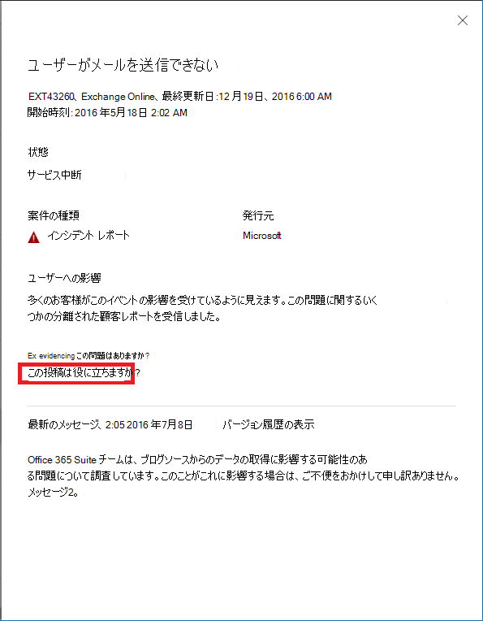

# Microsoft 365 の Exchange Online の監視Exchange Online monitoring for Microsoft 365

Microsoft 365 管理センターで Exchange Online の監視を使用して、組織の Microsoft 365 サブスクリプションの Exchange サービスの正常性を監視できます。You can use Exchange Online monitoring in the Microsoft 365 admin center to monitor the health of the Exchange service for your organization’s Microsoft 365 subscription. Exchange Online の監視は、以下のカテゴリに収集されたインシデントと勧告についての情報を提供します。Exchange Online monitoring provides you with information about incidents and advisories that are collected in these categories:

- **インフラストラクチャ**: 定期的な更新を提供し、問題を解決するために Microsoft が所有する Microsoft 365 のインフラストラクチャで問題が検出されます。**Infrastructure**: Issue is detected in the Microsoft 365 infrastructure that Microsoft owns for providing regular updates and resolving the issue. たとえば、Exchange または他の Microsoft 365 のクラウド インフラストラクチャの問題のため、ユーザーが Exchange Online にアクセスできない場合などです。For example, users cannot access Exchange Online because of issues with Exchange or other Microsoft 365 cloud infrastructure.
- **サードパーティのインフラストラクチャ**: 組織が依存関係にあるサードパーティのインフラストラクチャで問題が検出され、解決するには所属の組織によるアクションが必要です。**Third-party infrastructure**: Issue is detected in third-party infrastructure on which your organization has taken a dependency and requires action from your organization for resolution. たとえば、ユーザー認証のトランザクションが、ユーザーが Exchange Online にアクセスできないようにするサードパーティのセキュリティ トークン サービス (STS) プロバイダーによって調整される場合などです。For example, user authentication transactions are getting throttled by a third-party security token service (STS) provider that prevents users from connecting to Exchange Online.
- **顧客のインフラストラクチャ**: 組織のインフラストラクチャで問題が検出され、解決するには所属の組織によるアクションが必要です。**Customer infrastructure**: Issue is detected in your organization's infrastructure and requires action from your organization for resolution. たとえば、組織によってホストされている STS プロバイダーから承認トークンを取得できないため、ユーザーが Exchange Online にアクセスできない場合などです。For example, users cannot access Exchange Online because they are unable to obtain an authentication token from STS provider hosted by your organization because of an expired certificate.

以下は、Microsoft 365 管理センターの **[サービス正常性]** ページの例です。これは、**[正常性] > [サービス正常性]** から利用できます。Here is an example of the **Service health** page in the Microsoft 365 admin center, available from **Health > Service health**.

![Microsoft 365 管理センターの [サービス正常性] ページ](../media/microsoft-365-exchange-monitoring/service-health-dashboard-example.png)

**[状態]** 列の値は、サービスが正常な状態にあるか、Microsoft が維持するクラウド サービスに基づいて勧告やインシデントがあるかどうかを示します。The value of the **Status** column indicates whether the service is healthy or has advisories or incidents based on the cloud services that Microsoft maintains. 

**[組織とサード パーティの問題]** 列の値は、組織のインフラストラクチャまたはサードパーティ製のソフトウェアが、Exchange Online のユーザーのサービス正常性のエクスペリエンスに影響を与えるかどうかを示します。The value of the **Your org and 3rd party issues** column indicates that your organization's infrastructure or third-party software affects your users service health experience with Exchange Online. 勧告やインシデントを解決するには、*ユーザー* のアクションが必要です。Advisories or incidents require *your* actions to resolve.

以下は、Microsoft 365 管理センターの **Exchange Online** の監視ページです。これは、**[正常性] > [サービス正常性] > [Exchange Online]** から利用できます。Here is an example of the **Exchange Online** monitoring page in the Microsoft 365 admin center, available from **Health > Service health > Exchange Online**.

**Exchange Online** の監視ページで、Exchange Online サービスが正常な状態かどうか、関連するインシデントや勧告がないかどうかを確認できます。With the **Exchange Online** monitoring page, you can see whether the Exchange Online service is healthy or not and whether there are any associated incidents or advisories. Exchange Online の監視で、特定のメールのシナリオにおけるサービス正常性を確認し、リアルタイムに近い信号を表示してシナリオごとに影響を特定できます。With Exchange Online monitoring, you can look at the service health for specific email scenarios and view near real-time signals to determine the impact by scenario. 

## 要件Requirements

このプレビューは、次の要件を満たしているお客様に対して有効になっています。This preview is enabled for customers who meet these requirements: 

- 組織に Office 365 E3、Microsoft 365 E3、Office 365 E5、Microsoft 365 E5 の製品のいずれか 1 つまたは組み合わせから 5,000 個以上のライセンス数が必要です。Your organization needs to have a license count of at least 5,000, from one or a combination of these products: Office 365 E3, Microsoft 365 E3, Office 365 E5, Microsoft 365 E5. 

  たとえば、組織は Office 365 E3 のライセンスを 3,000 個と Microsoft 365 E5 のライセンスを 2,500 個持つことで、条件を満たす製品から合計 5,500 個のライセンスを持つことができます。For example, your organization can have 3,000 Office 365 E3 licenses and 2,500 Microsoft 365 E5, for a total of 5,500 licenses from the qualifying products.

- 組織に月間 50 人以上のアクティブな Exchange Online ユーザーが必要です。Your organization needs to have at least 50 monthly active Exchange Online users.

Exchange Online の監視で、次のメール クライアントの正常性をメールの読み取りアクティビティに基づいて表示できます。With Exchange Online monitoring you can view the health for the following email clients based on email read activity:

- Outlook デスクトップOutlook Desktop
- Outlook on the WebOutlook on the Web
- iOS と Android のネイティブのメール クライアントNative mail clients of iOS and Android 
- iOS と Android の Outlook モバイル アプリOutlook Mobile app in iOS and Android 
- Outlook Mac クライアントOutlook Mac client

これらのクライアントについては、メールを読んでいるユーザーに基づいて過去 30 分間のアクティブ ユーザー数を表示すると共に、ダッシュボードのインシデントと勧告の数も表示できます。For these clients, you can see the number of active users in the last 30 minutes based on users reading an email, along with number of incidents and advisories in the dashboard. 問題がないか確認するため、このデータは前週と同じ間隔と比較されます。This data is compared to the same interval for the previous week to see if there’s an issue. 

>[!Note]
> アクティブ ユーザー数は、ユーザーがメールを読むときなど、1 つのアクティビティによって測定されます。Active user count is measured by a single activity, for example, when a user reads an email. 過去 30 分間のアクティビティだけを把握しています。It only accounts for the last 30 minutes of activity.
>

また、次のシナリオでも Exchange Online の正常性を監視することができます。You can also monitor Exchange Online health for the following scenarios:

- **メール フロー**: メッセージが Microsoft 365 ネットワークに配信された後に直ちに受信トレイに送信されたメッセージの数。**Mail flow**: The number of messages successfully delivered to a mailbox without any delay after the message reached the Microsoft 365 network. 
- **基本認証と先進認証**: Exchange Online サービスで正常に検証されたユーザー数。**Basic Authentication and Modern Authentication**: The number of users successfully validated in the Exchange Online service.

これらすべてのシナリオにおいて、鍵となる数字はメイン ダッシュボードでの過去 30 分間のものです。For all these scenarios, the key numbers are for the last 30 minutes in the main dashboard. これらの各シナリオの詳細表示には、7 日間のほぼリアルタイムの傾向が、前週との比較された 30 分間の集計関数と共に表示されます。Detailed views for each of these scenarios shows the near real-time trend for seven days with the 30-minute aggregate compared with the previous week. 

## フィードバックを送信するSend us feedback

フィードバックは 2 つの方法でお寄せいただけます。There are two ways you can provide feedback:

- Microsoft 365 管理センターのすべてのページに表示されている **[フィードバックの送信]** オプションを使用します。Use the **Give feedback** option available on every page of the Microsoft 365 admin center.
- 特定のインシデントや勧告の場合、**[この投稿は役に立ちましたか?]** のリンクを使用してフィードバックを送信します。Submit feedback using the **Is this post helpful?** link for a specific incident or advisory.

## よく寄せられる質問Frequently asked questions

#### 1. Microsoft 365 管理センターの [正常性] で [Exchange Online の監視] が表示されないのはなぜですか?1. Why don’t I see “Exchange Online monitoring” under Health in the Microsoft 365 admin center? 

まず、Microsoft 365 管理センターの **[ホーム]** ページで新しい管理センターが有効になっていることを確認してください。First, make sure you’ve enabled the new admin center on the **Home** page of the Microsoft 365 admin center. 

次に、次の両方の要件を満たしていることを確認してください。Then make sure you meet both of the following requirements: 

- 組織に Office 365 E3、Microsoft 365 E3、Office 365 E5、Microsoft 365 E5 の製品のいずれか 1 つまたは組み合わせから 5,000 個以上のライセンス数が必要です。Your organization needs to have a license count of at least 5,000, from one or a combination of these products: Office 365 E3, Microsoft 365 E3, Office 365 E5, Microsoft 365 E5. 
- 組織に月間 50 人以上のアクティブな Exchange Online ユーザーが必要です。Your organization needs to have at least 50 monthly active Exchange Online users.

組織のライセンス数が 5,000 ユーザー未満であり、月間アクティブ ユーザー数が 50 未満である場合、この要件が満たされるまで Exchange Online の監視は有効になりません。If the license count for your organization goes below 5,000 users and the monthly active users goes below 50 users, Exchange Online monitoring won’t be enabled until these requirements are met.

#### 2. 各クライアントのダッシュボードのアクティブ ユーザー数が少なく表示されます。2. The active user count in the dashboard for each client appears to be low. しかし、多くの有効なライセンスがユーザーにアサインされています。We have a lot of active licenses assigned to users. これはどういうことですか?What does this mean? 

監視に表示されるアクティブ ユーザー数は、機能が呼び出したアクティビティをユーザーが実行した 30 分間のウィンドウに基づいています。The active user count shown in monitoring is based on a 30-minute window where users have performed the activity called out in the feature. これは、使用数とは異なることに注意してください。This shouldn’t be confused with usage numbers. 使用数を表示するには、Microsoft 365 管理センターでアクティビティ レポートを使用してください (**[レポート] > [使用状況]**)。To view usage numbers, use activity reports in the Microsoft 365 admin center (**Reports > Usage**).

#### 3. Teams や SharePoint などの他のサービスに対する他の監視シナリオは追加されますか?3. Will there be other monitoring scenarios for other services such as Teams and SharePoint? 

Microsoft は、このエクスペリエンスを Microsoft 365 管理センターのサービス正常性ダッシュボード内に直接統合しています。Microsoft is integrating this experience directly inside the Service Health dashboard in the Microsoft 365 admin center. これにより、Microsoft は監視シナリオを他のサービスにも拡張できるようになります。お知らせするニュースがある場合は発表されます。This will provide opportunities for Microsoft to extend monitoring scenarios for other services, which will be announced when there is news to share. 

#### 4. このエクスペリエンスの一般提供予定について教えてください。4. What is the plan for general availability of this experience? 

Microsoft は、Exchange Online の監視を Microsoft 365 管理センターの **[サービス正常性]** ダッシュボードに直接統合しました。Microsoft has integrated Exchange Online monitoring directly on the **Service Health** dashboard in the Microsoft 365 admin center. 

新しくなった統合エクスペリエンスにより、Microsoft はユーザーからのフィードバックを収集し、一般提供の計画を定義する予定です。With this new integrated experience, Microsoft's plan is to collect your feedback and then define our plan for general availability.

#### 5. この機能は無料 (ライセンス付属) と有料 (追加コンテンツ) のどちらですか?5. Is this a free (included) or paid (extra) feature? 

この機能はパブリック プレビューの段階にあり、質問 1 での要件を満たしたユーザーのみ利用できます。This feature is in Public preview and only available for customers that meet the requirements in question 1.

<!--
>[!Note]
>INTERNAL: That decision is pending
>
--> 

#### 6. フィードバックを送信するにはどうすればいいですか?6. How do I provide feedback? 

一般的なフィードバックについては、**Exchange Online** の監視ページの右下隅にある **[フィードバックの送信]** アイコンを使用してください。For general feedback, use the **Give feedback** icon on the bottom-right corner of the **Exchange Online** monitoring page. 

インシデントや勧告のフィードバックについては、**[この投稿は役に立ちましたか?]** リンクを使用します。For feedback on incidents or advisories, use the **Is this post helpful?** link.

#### 7. アクティビティの傾向を示すシナリオのインストルメント化されたデータはどこにありますか?7. Where is the data instrumented for the scenarios that show activity trends?

データは Exchange Online サービスにインストルメント化されています。要求が Exchange Online に到達する前に障害が発生するか、Exchange Online に障害がある場合、アクティビティ信号の降下が確認できます。The data is instrumented in the Exchange Online service. If there is a failure that happens before the request reaches Exchange Online or there is a failure in Exchange Online, you will see a drop in the activity signal.

